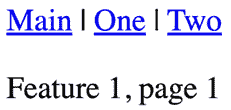
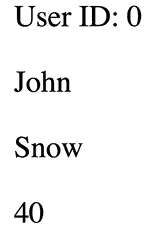
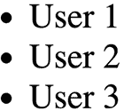
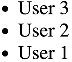
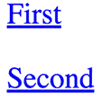
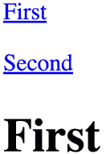
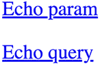

# 第七章：使用路由处理导航

几乎每个 Web 应用程序都需要路由，这是根据一组路由处理声明对 URL 进行响应的过程。换句话说，这是 URL 到渲染内容的映射。然而，这项任务比最初看起来要复杂得多，因为管理不同的 URL 模式并将它们映射到适当的内容渲染涉及到许多复杂性。这包括处理嵌套路由、动态参数以及确保正确的导航流程。这些任务的复杂性是为什么在本章中，你将利用 `react-router` 包，这是 React 的既定路由工具。

首先，你将学习使用 JSX 语法声明路由的基础知识。然后，你将了解路由的动态方面，例如动态路径段和查询参数。接下来，你将使用 `react-router` 的组件实现链接。

本章我们将涵盖以下高级主题：

+   声明路由

+   处理路由参数

+   使用链接组件

# 技术要求

你可以在 GitHub 上找到本章的代码文件，地址为 [`github.com/PacktPublishing/React-and-React-Native-5E/tree/main/Chapter07`](https://github.com/PacktPublishing/React-and-React-Native-5E/tree/main/Chapter07)。

# 声明路由

使用 `react-router`，你可以将路由与它们渲染的内容进行组合。通过使用 JSX 语法定义与组件关联的路由，`react-router` 使开发者能够为他们的 React 应用程序创建一个清晰且逻辑的结构。这种组合使得理解应用程序的不同部分是如何连接和导航的变得更加容易，从而提高了代码库的可读性和可维护性。

在本章中，我们将使用 `react-router` 探索 React 应用程序中路由的基础知识。我们将从创建一个基本的示例路由开始，以便熟悉路由声明的语法和结构。然后，我们将更深入地研究按功能组织路由，而不是依赖于一个单一的路由模块。最后，我们将实现一个常见的父子路由模式，以展示如何处理更复杂的路由场景。

## 嗨，路由

在我们开始编写代码之前，让我们设置 `react-router` 项目。运行以下命令以将 `react-router-dom` 添加到依赖项中：

```js
npm install react-router-dom 
```

让我们创建一个简单的路由，它渲染一个简单的组件：

1.  首先，我们有一个小的 React 组件，当路由被激活时我们想要渲染它：

    ```js
    function MyComponent() {
      return <p>Hello Route!</p>;
    } 
    ```

1.  接下来，让我们看看路由定义：

    ```js
    import React from "react";
    import ReactDOM from "react-dom/client";
    import { createBrowserRouter, RouterProvider } from "react-router-dom";
    import MyComponent from "./MyComponent";
    const router = createBrowserRouter([
      {
        path: "/",
        element: <MyComponent />,
      },
    ]);
    ReactDOM.createRoot(document.getElementById("root")!).render(
      <React.StrictMode>
        <RouterProvider router={router} />
      </React.StrictMode>
    ); 
    ```

`RouterProvider` 组件是应用程序的最高级组件。让我们分解它，以了解路由器内部发生了什么。

你在`createBrowserRouter`函数中声明了实际的路线。任何路由都有两个关键属性：`path`和`element`。当`path`属性与活动 URL 匹配时，组件将被渲染。但它在哪里渲染呢？实际上，路由器并不渲染任何内容；它负责根据当前 URL 管理其他组件的连接。换句话说，路由器检查当前 URL，并从`createBrowserRouter`声明中返回相应的组件。确实，当你在一个浏览器中查看这个例子时，`<MyComponent>`如预期那样被渲染：


图 7.1：我们组件的渲染输出

当`path`属性与当前 URL 匹配时，路由组件会被`element`属性值替换。在这个例子中，路由返回`<MyComponent>`。如果给定的路由不匹配，则不会渲染任何内容。

这个例子展示了 React 中路由的基础。声明路由非常简单直观。为了进一步巩固你对`react-router`的理解，我鼓励你尝试实验我们覆盖的概念。尝试自己创建更多路由，并观察它们如何影响你应用程序的行为。之后，你可以尝试更高级的技术，比如使用 React.lazy 和 Suspense 来懒加载组件（你将在下一章中了解更多关于这些的内容），并实现基于路由的代码拆分以优化你应用程序的性能。通过深入研究这些主题并将它们应用到自己的项目中，你将更加欣赏`react-router`的能力及其在现代、高效和用户友好的 React 应用程序构建中的作用。

## 解耦路由声明

路由的困难在于当你的应用程序在单个模块中声明了数十个路由时，因为将路由映射到功能上在心理上更困难。

为了帮助解决这个问题，应用程序的每个顶级功能都可以定义自己的路由。这样，就可以清楚地知道哪些路由属于哪个功能。所以，让我们从`App`组件开始：

```js
const router = createBrowserRouter([
  {
    path: "/",
    element: <Layout />,
    children: [
      {
        index: true,
        element: <h1>Nesting Routes</h1>,
      },
      routeOne,
      routeTwo,
    ],
  },
]);
export const App = () => <RouterProvider router={router} />; 
```

在这个例子中，应用程序有两个路由：`one`和`two`。这些作为路由对象导入，并放置在`createBrowserRouter`内部。这个路由器中的第一个`element`是`<Layout />`组件，它渲染一个带有永不改变的数据的页面模板，并作为我们路由数据的位置。让我们看看`<Layout />`组件：

```js
function Layout() {
  return (
    <main>
      <nav>
        <Link to="/">Main</Link>
        <span> | </span>
        <Link to="/one">One</Link>
        <span> | </span>
        <Link to="/two">Two</Link>
      </nav>
      <Outlet />
    </main>
  );
} 
```

这个组件包含一个带有链接和`<Outlet />`组件的小型导航工具栏。它是一个内置的`react-router`组件，它将被匹配的路由元素替换。

路由的大小仅与应用程序的功能数量相关，而不是路由的数量，这可能会大得多。让我们看看其中一个功能路由：

```js
 const routes: RouteObject = {
  path: "/one",
  element: <Outlet />,
  children: [
    {
      index: true,
      element: <Redirect path="/one/1" />,
    },
    {
      path: "1",
      element: <First />,
    },
    {
      path: "2",
      element: <Second />,
    },
  ],
}; 
```

这个模块，`one/index.js`，导出了一个包含三个路由的配置对象：

+   当`/one`路径匹配时，重定向到`/one/1`。

+   当匹配到`/one/1`路径时，渲染`First`组件。

+   当匹配到`/one/2`路径时，渲染`Second`组件。

这意味着当应用程序加载 URL`/one`时，`<Redirect>`组件将用户发送到`/one/1`。与`RouterProvider`一样，`Redirect`组件内部没有 UI 元素；它仅管理逻辑。

这与 React 将组件嵌入布局以处理特定功能的做法相一致。这种方法允许实现关注点的清晰分离，组件专注于渲染 UI 元素，而其他如`Redirect`等组件则专注于处理路由逻辑。`react-router`中的`Redirect`组件负责将用户程序性地导航到不同的路由。它通常用于根据某些条件（如身份验证状态或路由参数）将用户从一个 URL 重定向到另一个 URL。通过将导航逻辑抽象到单独的组件中，它促进了应用程序中的代码重用和可维护性。

您在这里使用`Redirect`是因为我们在根路由上没有内容。通常，您的应用程序实际上在功能的根或应用程序本身的根处没有要渲染的内容。这种模式允许您将用户发送到适当的路由和内容。以下是您打开应用程序并点击**One**链接时将看到的内容：



图 7.2：第 1 页的内容

第二个功能遵循与第一个完全相同的模式。以下是`First`组件的示例：

```js
export default function First() {
  return <p>Feature 1, page 1</p>;
} 
```

在这个例子中，每个功能都使用相同的最小渲染内容。这些组件是用户在导航到特定路由时最终需要看到的内容。通过这种方式组织路由，您已经使功能在路由方面具有自包含性。

在下一节中，您将学习如何进一步将路由组织成父子关系。

# 处理路由参数

本章中您所看到的 URL 都是静态的。大多数应用程序将同时使用**静态**和**动态**路由。在本节中，您将学习如何将动态 URL 段传递给组件，如何使这些段可选，以及如何获取查询字符串参数。

## 路由中的资源 ID

一个常见的用例是将资源的 ID 作为 URL 的一部分。这使得您的代码能够获取 ID，然后执行一个**API**调用以获取相关资源数据。让我们实现一个渲染用户详情页的路由。这需要一个包含用户 ID 的路由，然后需要以某种方式将用户 ID 传递给组件，以便它可以获取用户信息。

让我们从声明路由的`App`组件开始：

```js
const router = createBrowserRouter([
  {
    path: "/",
    element: <UsersContainer />,
    errorElement: <p>Route not found</p>,
  },
  {
    path: "/users/:id",
    element: <UserContainer />,
    errorElement: <p>User not found</p>,
    loader: async ({ params }) => {
      const user = await fetchUser(Number(params.id));
      return { user };
    },
  },
]);
function App() {
  return <RouterProvider router={router} />;
} 
```

`:` 语法标记了 URL 变量的开始。`id` 变量将被传递给 `UserContainer` 组件。在显示组件之前，`loader` 函数被触发，异步获取指定用户 ID 的数据。在数据加载错误的情况下，`errorElement` 属性提供了一个回退来有效地处理这种情况。以下是 `UserContainer` 的实现方式：

```js
function UserContainer() {
  const params = useParams();
  const { user } = useLoaderData() as { user: User };
  return (
    <div>
      User ID: {params.id}
      <UserData user={user} />
    </div>
  );
} 
```

`useParams()` 钩子用于获取 URL 的任何动态部分。在这种情况下，您对 `id` 参数感兴趣。然后，我们使用 `useLoaderData` 钩子从 `loader` 函数中获取 `user`。如果 URL 完全缺少该部分，则此代码根本不会运行；路由器将使我们回退到 `errorElement` 组件。

现在，让我们看看在这个示例中使用的 API 函数：

```js
export type User = {
  first: string;
  last: string;
  age: number;
};
const users: User[] = [
  { first: "John", last: "Snow", age: 40 },
  { first: "Peter", last: "Parker", age: 30 },
];
export function fetchUsers(): Promise<User[]> {
  return new Promise((resolve) => {
    resolve(users);
  });
}
export function fetchUser(id: number): Promise<User> {
  return new Promise((resolve, reject) => {
    const user = users[id];
    if (user === undefined) {
      reject('User ${id} not found');
    } else {
      resolve(user);
    }
  });
} 
```

`fetchUsers()` 函数由 `UsersContainer` 组件用于填充用户链接列表。`fetchUser()` 函数将从模拟数据的 `users` 数组中查找并解析一个值。

这是 `User` 组件，它负责渲染用户详细信息：

```js
type UserDataProps = {
  user: User;
};
function UserData({ user }: UserDataProps) {
  return (
    <section>
      <p>{user.first}</p>
      <p>{user.last}</p>
      <p>{user.age}</p>
    </section>
  );
} 
```

当您运行此应用程序并导航到 `/` 时，您应该会看到一个用户列表，看起来像这样：


图 7.3：应用程序主页的内容

点击第一个链接应将您带到 `/users/0`，看起来像这样：



图 7.4：用户页面的内容

如果您导航到一个不存在的用户，例如 `/users/2`，您将看到以下内容：


图 7.5：当找不到用户时

您得到此错误消息而不是 500 错误的原因是 API 端点知道如何处理缺失的资源：

```js
if (user === undefined) {
  reject('User ${id} not found');
} 
```

此拒绝将由 `react-router` 使用提供的 `errorElement` 组件来处理。

在下一节中，我们将探讨定义可选路由参数。

## 查询参数

有时，我们需要可选的 URL 路径值或查询参数。对于简单的选项，URL 效果最好；如果组件可以使用许多值，则查询参数效果最好。

让我们实现一个用户列表组件，用于渲染用户列表。可选地，您希望能够按降序排序列表。让我们使用可以接受查询字符串的路由来实现这一点：

```js
const router = createBrowserRouter([
  {
    path: "/",
    element: <UsersContainer />,
  },
]);
ReactDOM.createRoot(document.getElementById("root")!).render(
  <React.StrictMode>
    <RouterProvider router={router} />
  </React.StrictMode>
); 
```

路由器中没有特殊设置用于处理查询参数。处理任何提供的查询字符串的责任在于组件。因此，虽然路由声明没有提供定义接受查询字符串的机制，但路由器仍然会将查询参数传递给组件。让我们看看用户列表容器组件：

```js
export type SortOrder = "asc" | "desc";
function UsersContainer() {
  const [users, setUsers] = useState<string[]>([]);
  const [search] = useSearchParams();
  useEffect(() => {
    const order = search.get("order") as SortOrder;
    fetchUsers(order).then((users) => {
      setUsers(users);
    });
  }, [search]);
  return <Users users={users} />;
} 
```

此组件查找任一 `order` 查询字符串。它使用此作为 `fetchUsers()` API 的参数来确定排序顺序。

这是 `Users` 组件的外观：

```js
type UsersProps = {
  users: string[];
};
function Users({ users }: UsersProps) {
  return (
    <ul>
      {users.map((user) => (
        <li key={user}>{user}</li>
      ))}
    </ul>
  );
} 
```

当您导航到 `/` 时，以下是渲染的内容：



图 7.6：按默认顺序渲染用户列表

如果你通过导航到`/?order=desc`包含`order`查询参数，你将得到以下内容：



图 7.7：按降序渲染用户列表

在本节中，你学习了关于路由中的参数。可能最常见的一种模式是将应用中资源的 ID 作为 URL 的一部分，这意味着组件需要能够解析出这些信息以便与 API 交互。你还学习了关于路由中的查询参数，这对于动态内容、过滤或组件之间传递临时数据非常有用。接下来，你将学习关于链接组件的内容。

# 使用链接组件

在本节中，你将学习如何创建链接。你可能倾向于使用标准的`<a>`元素来链接到由`react-router`控制的页面。这种方法的缺点是，从简单来说，这些链接将尝试通过发送`GET`请求在后台定位页面。这不是你想要的，因为路由配置已经在应用中，并且我们可以本地处理路由。

首先，你将看到一个示例，说明`<Link>`组件的行为与`<a>`元素类似，但它们是本地工作的。然后，你将学习如何构建使用 URL 参数和查询参数的链接。

## 基本链接

React 应用中链接的概念是它们指向指向组件的路由，这些组件渲染新的内容。`Link`组件还负责浏览器历史 API 并查找路由-组件映射。以下是一个渲染两个链接的应用组件：

```js
function Layout() {
  return (
    <>
      <nav>
        <p>
          <Link to="first">First</Link>
        </p>
        <p>
          <Link to="second">Second</Link>
        </p>
      </nav>
      <main>
        <Outlet />
      </main>
    </>
  );
}
const router = createBrowserRouter([
  {
    path: "/",
    element: <Layout />,
    children: [
      {
        path: "/first",
        element: <First />,
      },
      {
        path: "/second",
        element: <Second />,
      },
    ],
  },
]);
function App() {
  return <RouterProvider router={router} />;
} 
```

`to`属性指定了点击时激活的路由。在这种情况下，应用程序有两个路由：`/first`和`/second`。以下是渲染的链接的外观：



图 7.8：应用的第一页和第二页的链接

当你点击**第一个**链接时，页面内容将改变，看起来像这样：



图 7.9：应用渲染时的第一页

现在你已经可以使用`Link`组件渲染到基本路径的链接，是时候学习如何使用参数构建动态链接了。

## URL 和查询参数

构建传递给`<Link>`的路径的动态段涉及字符串操作。路径的任何部分都发送到`to`属性。这意味着你需要编写更多的代码来构建字符串，但也意味着在路由器中幕后发生的魔法更少。

让我们创建一个简单的组件，它将回显传递给 echo URL 段或 echo 查询参数的内容：

```js
function Echo() {
  const params = useParams();
  const [searchParams] = useSearchParams();
  return <h1>{params.msg || searchParams.get("msg")}</h1>;
} 
```

为了获取传递给路由的搜索参数，你可以使用`useSearchParams()`钩子，它给你一个`URLSearchParams`对象。在这种情况下，我们可以调用`searchParams.get("msg")`来获取所需的参数。

现在，让我们看看渲染两个链接的`App`组件。第一个将构建一个使用动态值作为 URL 参数的字符串。第二个将使用`URLSearchParams`构建 URL 的查询字符串部分：

```js
const param = "From Param";
const query = new URLSearchParams({ msg: "From Query" });
export default function App() {
  return (
    <section>
      <p>
        <Link to={'echo/${param}'}>Echo param</Link>
      </p>
      <p>
        <Link to={'echo?${query.toString()}'}>Echo query</Link>
      </p>
    </section>
  );
} 
```

下面是两个链接渲染后的样子：



图 7.10：不同类型的链接参数

**参数**链接将你带到`/echo/From%20Param`，看起来像这样：


图 7.11：页面的参数版本

**查询**链接将你带到`/echo?msg=From+Query`，看起来像这样：


图 7.12：页面的查询版本

在了解`Link`组件和动态链接构建的过程中，你解锁了更互动和可导航的网页体验，使用户能够通过包含丰富旅程的 URL 和查询参数在应用程序中移动。

# 摘要

在本章中，你学习了 React 应用程序中的路由。路由器的工作是渲染与 URL 相对应的内容。`react-router`包是完成这项工作的标准工具。你学习了路由是如何像它们渲染的组件一样是 JSX 元素。有时，你需要将路由拆分成基于功能的模块。结构页面内容的一个常见模式是有一个父组件，它根据 URL 的变化渲染动态部分。然后，你学习了如何处理 URL 段和查询字符串的动态部分。你还学习了如何使用`<Link>`元素在你的应用程序中构建链接。

理解 React 应用程序中的路由为构建具有高效导航的复杂应用程序奠定了基础，为后续章节深入性能优化、状态管理和集成外部 API 做好了准备，确保了无缝的用户体验。

在下一章中，你将学习如何使用懒组件将你的代码拆分成更小的块。
