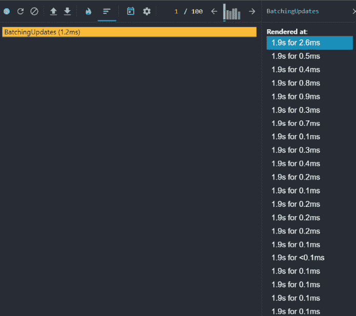
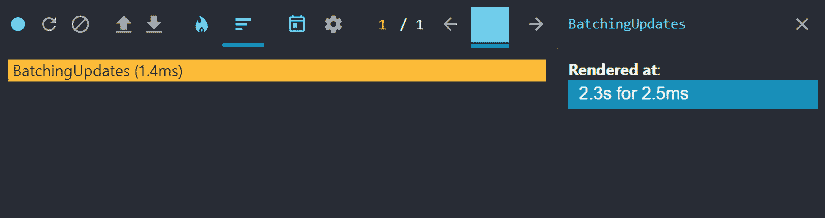
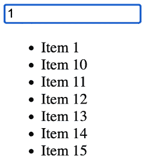
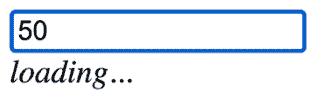

# 第十章：高性能状态更新

**状态**代表了你的 React 应用程序的动态方面。当状态发生变化时，你的组件会对这些变化做出反应。没有状态，你将只有一些花哨的 HTML 模板语言。通常，执行状态更新并在屏幕上渲染更改所需的时间几乎不明显，如果有的话。然而，有时复杂的状态变化可能导致用户注意到明显的延迟。本章的目标是解决这些问题，并找出我们如何避免这些延迟。

在本章中，你将学习以下内容：

+   将你的状态更改批量处理在一起以实现最小化重新渲染

+   优先更新状态以渲染对用户体验至关重要的内容

+   在**批量处理**和**优先处理**状态更新时开发执行异步操作的战略

# 技术要求

对于本章，你需要你的代码编辑器（**Visual Studio Code**）。我们将遵循的代码可以在以下位置找到：[`github.com/PacktPublishing/React-and-React-Native-5E/tree/main/Chapter10`](https://github.com/PacktPublishing/React-and-React-Native-5E/tree/main/Chapter10)。

你可以在 Visual Studio Code 中的终端运行`npm install`，以确保你能够随着阅读本章的例子而跟进。

# 批量处理状态更新

在本节中，你将了解 React 如何将**状态更新**批量处理在一起，以防止在多个状态变化同时发生时进行不必要的渲染。特别是，我们将探讨在**React 18**中引入的更改，这些更改使得状态更新的**自动批量处理**变得普遍。

当你的 React 组件发出状态变化时，这会导致 React 内部重新渲染由于这种状态更新而视觉上发生变化的部分。例如，想象你有一个包含名称状态的组件，该状态渲染在`<span>`元素内部，并将名称状态从`Adam`更改为`Ashley`。这是一个简单的更改，导致重新渲染得太快，以至于用户甚至注意不到。不幸的是，Web 应用程序中的状态更新很少如此简单。相反，可能会有数十个状态变化在 10 毫秒内发生。例如，名称状态可能会跟随以下变化：

1.  `Adam`

1.  `Ashley`

1.  `Andrew`

1.  `Ashley`

1.  `Aaron`

1.  `Adam`

在这里，我们短时间内发生了六个名为 state 的变化。这意味着 React 会重新渲染**DOM**六次，每次设置一个值作为 name state。关于这个场景有趣的是最终的状态更新：我们回到了起点，`Adam`。这意味着我们无端地重新渲染了 DOM 五次。现在，想象一下在 Web 应用规模上的这些浪费的重新渲染，以及这些类型的状态更新可能会对性能造成的问题。例如，当应用使用复杂的动画、用户交互如拖放、超时和间隔时，都可能导致不必要的重新渲染，从而对性能产生负面影响。

解决这个问题的答案是**批处理**。这就是 React 如何将我们在组件代码中做出的几个状态更新视为一个单一的状态更新。而不是逐个处理每个状态更新，在每次更新之间重新渲染 DOM，状态更改都被合并，从而只导致一次 DOM 重新渲染。总的来说，这大大减少了我们的 Web 应用需要执行的工作量。

在**React 17**中，状态更新的自动批处理仅在事件处理函数内部发生。例如，假设你有一个带有`onClick()`处理器的按钮，该处理器执行五个状态更新。React 会将所有这些状态更新一起批处理，从而只需要一次重新渲染。问题出现在你的事件处理器进行异步调用，通常是为了获取一些数据，然后在异步调用完成后进行状态更新。这些状态更改不再自动批处理，因为它们不是直接在事件处理器函数中运行的。相反，它们运行在异步操作的`回调`代码中，React 17 不会批处理这些更新。这是一个挑战，因为我们的 React 组件异步获取数据并在事件响应中执行状态更新是很常见的！

现在我们知道了如何处理最常见的不必要重新渲染问题，即短时间内对状态进行多次更改。现在，让我们通过例子来理解它。

## React 18 批处理

现在，让我们将注意力转向一些代码，看看**React 18**是如何解决我们刚刚概述的批处理问题的。在这个例子中，我们将渲染一个按钮，当点击时，将执行 100 次状态更新。我们将使用`setTimeout()`来确保更新是异步执行的，在事件处理函数之外。目的是展示两种不同的 React 版本处理此代码的方式之间的差异。为此，我们可以在浏览器开发者工具中打开**React 分析器**，在按下按钮执行我们的状态更改之前点击记录。下面是代码的样子：

```js
import * as React from "react";
export default function BatchingUpdates() {
  let [value, setValue] = React.useState("loading...");
  function onStart() {
    setTimeout(() => {
      for (let i = 0; i < 100; i++) {
        setValue('value ${i + 1}');
      }
    }, 1);
  }
  return (
    <div>
      <p>
        Value: <em>{value}</em>
      </p>
      <button onClick={onStart}>Start</button>
    </div>
  );
} 
```

通过点击该组件渲染的按钮，我们调用由我们的组件定义的 `onStart()` 事件处理器函数。然后，我们的处理器在循环中调用 `setValue()` 100 次。理想情况下，我们不想进行 100 次重新渲染，因为这会损害我们应用程序的性能，而且也不需要这样做。这里只关心 `setValue()` 的最终调用。

首先，让我们看看使用 React 17 捕获的该组件的配置文件：



图 10.1：使用 React 开发工具查看每次状态更新时进行的重新渲染

通过按下与我们事件处理器相关联的按钮，我们进行了 100 次状态更新调用。由于这是在 `setTimeout()` 函数外部完成的，所以不会发生自动批处理。我们可以在 `BactchingUpdates` 组件的配置文件输出中看到这一点，其中有一长串的渲染。其中大部分是不必要的，并增加了 React 需要执行以响应用户交互的工作量，从而损害了我们应用程序的整体性能。

让我们捕获使用 React 18 渲染的相同组件的配置文件：



图 10.2：React 开发工具显示启用自动批处理时仅有一个渲染

**自动批处理**应用于所有进行状态更新的地方，甚至在像这种情况这样的常见异步场景中也是如此。正如配置文件所示，当我们点击按钮时，只有一个重新渲染，而不是 100 个。我们也不必对我们的组件代码进行任何调整来实现这一点。然而，为了使状态更新自动批处理，我们需要进行一个更改。假设你使用了 `ReactDOM.render()` 来渲染你的根组件，如下所示：

```js
ReactDOM.render(
  <React.StrictMode>
    <App />
  </React.StrictMode>,
  document.getElementById("root")
); 
```

相反，你可以使用 `ReactDOM.createRoot()` 并渲染它：

```js
ReactDOM.createRoot(document.getElementById("root")!).render(
  <React.StrictMode>
    <App />
  </React.StrictMode>
); 
```

通过这种方式创建和渲染你的根节点，你可以确保在 **React 18** 中，你将获得整个应用程序的批处理状态更新。你不再需要担心手动优化状态更新以确保它们立即发生：React 现在为你这样做。然而，有时你会有比其他状态更新优先级更高的状态更新。在这种情况下，我们需要一种方法来告诉 React 优先处理某些状态更新，而不是将所有内容一起批处理。

# 优先处理状态更新

当我们的 React 应用程序发生某些事件时，我们通常会进行多次状态更新，以便 UI 可以反映这些变化。通常，你可以做出这些状态变化而不必过多考虑渲染性能的影响。例如，假设你有一个需要渲染的长列表项目。这可能会对 UI 产生一些影响：当列表正在渲染时，用户可能无法与某些页面元素交互，因为 JavaScript 引擎在短时间内 100%被占用。

然而，当昂贵的渲染干扰了用户期望的正常浏览器行为时，这可能会成为一个问题。例如，如果用户在文本框中输入文本，他们期望刚刚输入的字符立即显示出来。但如果你组件正忙于渲染一个大型项目列表，文本框的状态无法立即更新。这就是新的 React 状态更新优先级 API 派上用场的地方。

`startTransition()` API 用于标记某些状态更新为过渡性，这意味着更新被视为低优先级。如果你考虑一个项目列表要么是首次渲染，要么是改变为另一个项目列表，这种转换不需要立即进行。另一方面，如更改文本框中的值这样的状态更新应该尽可能接近立即。通过使用`startTransition()`，你告诉 React，如果存在更重要的更新，任何状态更新都可以等待。

对于`startTransition()`的一个好的经验法则是用于以下情况：

+   任何可能执行大量渲染工作的内容

+   任何不需要用户对其交互立即反馈的内容

让我们通过一个例子来了解，当用户在文本框中输入以过滤列表时，如何渲染大量项目列表。

这个组件将渲染一个用户可以输入以过滤 25000 个项目列表的文本框。我选择这个数字是基于我编写此代码时所使用的笔记本电脑的性能：如果你没有延迟，你可能需要调整它，如果渲染任何东西都花费太长时间，你可能需要将其降低。当页面首次加载时，你应该看到一个看起来像这样的过滤器文本框：


图 10.3：用户输入任何内容之前的过滤器框

当你开始在过滤器文本框中输入时，过滤后的项目将显示在其下方。由于需要渲染的项目很多，可能需要一秒钟或两秒钟：



图 10.4：当用户开始输入时，过滤器输入下方的过滤项目

现在，让我们从一组大量项目开始，逐步分析代码：

```js
let unfilteredItems = new Array(25000)
  .fill(null)
  .map((_, i) => ({ id: i, name: 'Item ${i}' })); 
```

数组的尺寸是在数组构造函数中指定的，然后它被填充了我们可以通过其进行过滤的编号字符串值。

接下来，让我们看看这个组件使用的状态：

```js
let [filter, setFilter] = React.useState("");
let [items, setItems] = React.useState([]); 
```

`filter`状态表示过滤器文本框的值，默认为空字符串。`items`状态表示来自我们的`unfilteredItems`数组的过滤项。当用户在过滤器文本框中输入时，此数组被填充。

接下来，让我们看看这个组件渲染的标记：

```js
<div>
  <div>
    <input
      type="text"
      placeholder="Filter"
      value={filter}
      onChange={onChange}
    />
  </div>
  <div>
    <ul>
      {items.map((item) => (
        <li key={item.id}>{item.name}</li>
      ))}
    </ul>
  </div>
</div> 
```

过滤器文本框由一个`<input>`元素渲染，而过滤结果通过遍历`items`数组以列表形式渲染。

最后，让我们看看当用户在过滤器文本框中输入时触发的事件处理函数：

```js
const onChange = (e) => {
  setFilter(e.target.value);
  setItems(
    e.target.value === ""
      ? []
      : unfilteredItems.filter((item) => item.name.includes(e.target.value))
  );
}; 
```

当用户在过滤器文本框中输入时，会调用`onChange()`函数，并设置两个状态值。首先，它使用`setFilter()`来设置过滤器文本框的值。然后，它调用`setItems()`来设置要渲染的过滤项，除非过滤器文本为空，在这种情况下，我们不渲染任何内容。

当与这个示例交互时，你可能会注意到在输入时文本框的响应性问题。这是因为在这个函数中，我们不仅设置了文本框的值，还设置了过滤项。这意味着在文本值可以渲染之前，我们必须等待数千个项被渲染。

尽管这些是两个独立的状态更新（`setFilter()`和`setItems()`），但它们被批处理并被视为单一状态更新。同样，当渲染开始时，React 会一次性执行所有更改，这意味着 CPU 不会让用户与文本框交互，因为它完全被利用，渲染出长长的过滤结果列表。理想情况下，我们希望优先处理文本框的状态更新，同时允许项在之后渲染。换句话说，我们希望降低项渲染的优先级，因为它成本高昂，并且用户不会直接与之交互。

这就是`startTransition()` API 发挥作用的地方。传递给`startTransition()`函数内部发生的任何状态更新都将被赋予比其外部发生的任何状态更新更低的优先级。在我们的过滤示例中，我们可以通过将`setItems()`状态更改移动到`startTransition()`内部来修复文本框的响应性问题。

这是我们的新`onChange()`事件处理器的样子：

```js
const onChange = (e) => {
  setFilter(e.target.value);
  React.startTransition(() => {
    setItems(
      e.target.value === ""
        ? []
        : unfilteredItems.filter((item) => item.name.includes(e.target.value))
    );
  });
}; 
```

注意，我们不需要对项的状态更新方式做出任何更改：相同的代码被移动到一个传递给`startTransition()`的函数中。这告诉 React 仅在所有其他状态更改完成后执行此状态更改。在我们的情况下，这允许文本框在`setItems()`状态更改运行之前更新和渲染。如果你现在运行示例，你会看到文本框的响应性不再受渲染长列表所需时间的影响。

在这个新 API 介绍之前，你可以通过使用 `setTimeout()` 的变通方法来实现状态更新优先级。这种方法的主要缺点是，React 内部调度器对您的状态更新及其优先级一无所知。例如，通过使用 `startTransitiion()`，React 可以在状态更改再次发生之前或组件卸载时取消整个更新。

在实际应用中，这不仅仅是一个优先考虑哪个状态更新应该首先运行的问题。相反，它是在确保优先级得到考虑的同时异步获取数据。在本章的最后部分，我们将把这些内容串联起来。

# 处理异步状态更新

在本章的最后部分，我们将探讨异步获取数据和设置渲染优先级的常见场景。我们想要解决的关键场景是确保用户在输入或进行任何需要即时反馈的交互时不会被中断。这需要适当的优先级处理和从服务器处理异步响应。让我们首先看看可以帮助这个场景的 React API。

`startTransition()` API 可以用作 **钩子**。当我们这样做时，我们也会得到一个布尔值，我们可以检查它以确定转换是否仍在挂起。这有助于向用户显示正在加载。让我们修改上一节中的示例，使用异步数据获取函数来获取我们的项目。我们还将使用 `useTransition()` 钩子，并给组件的输出添加加载行为：

```js
let unfilteredItems = new Array(25000)
  .fill(null)
  .map((_, i) => ({ id: i, name: 'Item ${i}' }));
function filterItems(filter: string) {
  return new Promise((resolve) => {
    setTimeout(() => {
      resolve(unfilteredItems.filter((item) => item.name.includes(filter)));
    }, 1000);
  });
}
export default function AsyncUpdates() {
  const [isPending, startTransition] = React.useTransition();
  const [isLoading, setIsLoading] = React.useState(false);
  const [filter, setFilter] = React.useState("");
  const [items, setItems] = React.useState<{ id: number; name: string }[]>([]);
  const onChange: React.ChangeEventHandler<HTMLInputElement> = async (e) => {
    setFilter(e.target.value);
    startTransition(() => {
      if (e.target.value === "") {
        setItems([]);
      } else {
        filterItems(e.target.value).then((result) => {
          setItems(result);
        });
      }
    });
  };
  return (...);
} 
```

这个例子表明，一旦你在过滤文本框中开始输入，它将触发 `onChange()` 处理程序，这将调用 `filterItems()` 函数。我们还有一个 `isLoading` 值，我们可以用它来向用户显示后台正在发生某些事情：

```js
<div>
  <div>
    <input
      type="text"
      placeholder="Filter"
      value={filter}
      onChange={onChange}
    />
  </div>
  <div>
    {isPending && <em>loading...</em>}
    <ul>
      {items.map((item) => (
        <li key={item.id}>{item.name}</li>
      ))}
    </ul>
  </div>
</div> 
```

当 `isLoading` 为 `true` 时，用户将看到以下内容：



图 10.5：状态转换挂起时的加载指示器

然而，我们的方法存在一个小问题。你可能已经注意到，在文本框中输入时，加载信息会短暂闪烁。但随后，你可能有一个更长的时间段，项目仍然不可见，加载信息消失了。这里发生了什么？嗯，来自 `useTransition()` 钩子的 `isPending` 值可能会误导。我们设计组件的方式是，以下情况下 `isPending` 将为 `true`：

+   如果 `filterItems()` 函数仍在获取我们的数据

+   如果 `setItems()` 状态更新仍在执行一个昂贵的渲染，并且有很多项目

很不幸，`isPending` 并不是这样工作的。这个值只有在我们将函数传递给 `startTransition()` 之前是 `true` 的。这就是为什么你会在数据获取操作和渲染操作期间看到加载指示器短暂闪烁而不是一直显示的原因。记住，React 在内部调度状态更新，通过使用 `startTransition()`，我们已经调度了 `setItems()` 在其他状态更新之后运行。

另一种思考 `isPending` 的方式是，它在高优先级更新仍在运行时是 `true` 的。我们可以称之为 `highPriorityUpdatesPending` 以避免混淆。尽管如此，这个值的用途很窄，但它们确实偶尔会发生。对于我们的更常见情况，即获取数据和执行昂贵的渲染，我们需要考虑另一种解决方案。让我们审查我们的代码，并以一种方式重构它，使得在获取和更高优先级的更新发生时显示加载指示器。首先，让我们引入一个新的 `isLoading` 状态，默认为 `false`：

```js
const [isLoading, setIsLoading] = React.useState(false);
const [filter, setFilter] = React.useState("");
const [items, setItems] = React.useState([]); 
```

现在，在我们的 `onChange()` 处理程序内部，我们可以将状态设置为 `true`。在数据获取完成后运行的转换中，我们将其设置回 `false`：

```js
const onChange: React.ChangeEventHandler<HTMLInputElement> = async (e) => {
  setFilter(e.target.value);
  setIsLoading(true);
  React.startTransition(() => {
    if (e.target.value === "") {
      setItems([]);
      setIsLoading(false);
    } else {
      filterItems(e.target.value).then((result) => {
        setItems(result);
        setIsLoading(false);
      });
    }
  });
}; 
```

现在我们正在跟踪 `isLoading` 状态，我们知道所有重负载何时完成，并且可以隐藏加载指示器。最后的更改是将指示器的显示基于 `isLoading` 而不是 `isPending`：

```js
<div>
  {isLoading && <em>loading...</em>}
  <ul>
    {items.map((item) => (
      <li key={item.id}>{item.name}</li>
    ))}
  </ul>
</div> 
```

当你运行这些更改的示例时，结果应该会更加可预测。`setLoading()` 和 `setFilter()` 状态更新是高优先级的，并且会立即执行。使用 `filterItems()` 获取数据的调用直到高优先级状态更新完成后才会进行。

只有在我们获取到数据后，我们才会隐藏加载指示器。

# 摘要

本章向您介绍了 React 18 中可用的新 API，这些 API 有助于您实现高性能状态更新。我们从 React 18 中自动状态更新批处理的变化开始，并探讨了如何最好地利用它们。然后我们探讨了新的 `startTransition()` API 以及如何将其用于标记某些状态更新为比那些需要即时用户交互反馈的状态更新具有更低优先级。最后，我们探讨了如何将状态更新优先级与异步数据获取相结合。

在下一章中，我们将介绍从服务器获取数据。
