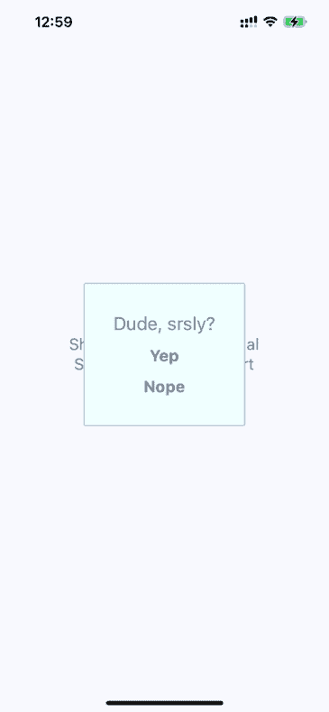
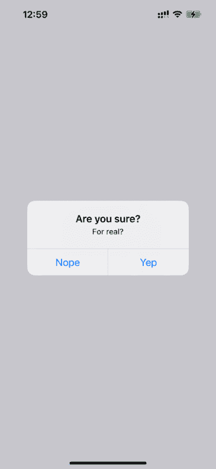
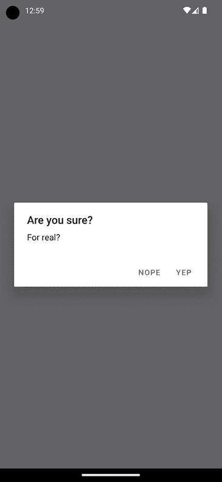
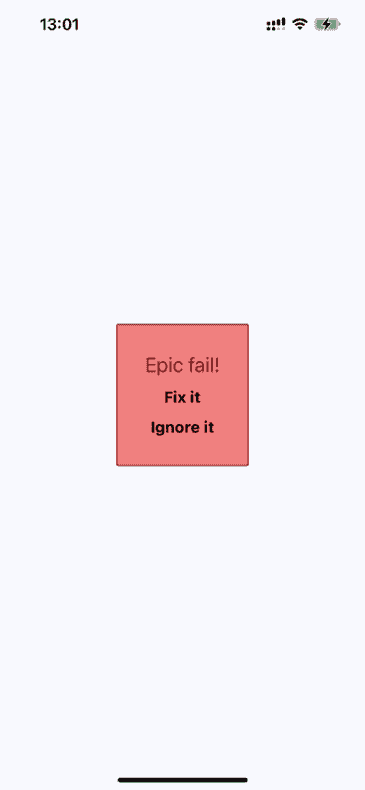
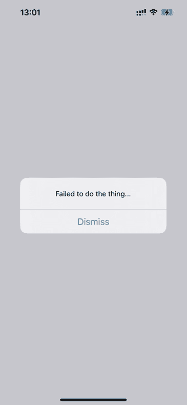
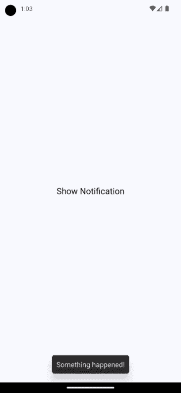
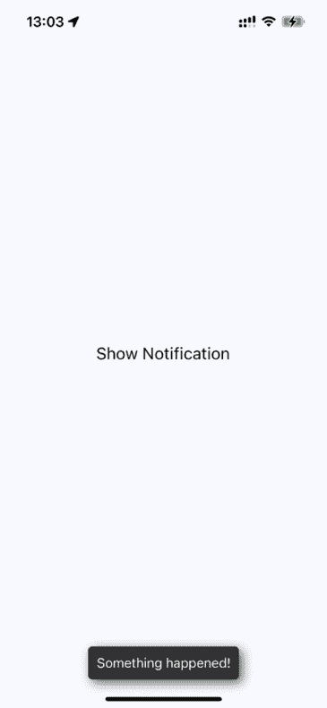
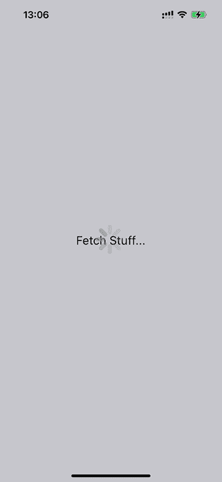

# 第二十五章：显示模态屏幕

本章的目标是向您展示如何以不干扰当前页面的方式向用户展示信息。页面使用`View`组件并将其直接渲染到屏幕上。然而，有时会有一些重要的信息用户需要看到，但你又不想让他们离开当前页面。

你将从学习如何显示重要信息开始。通过了解哪些信息是重要的以及何时使用它，你将学习如何获取用户的确认：既适用于错误场景也适用于成功场景。然后，你将实现被动通知，向用户显示发生了某些事情。最后，你将实现**模态视图**，显示后台正在发生的事情。

本章将涵盖以下主题：

+   术语定义

+   获取用户确认

+   被动通知

+   活动模态

# 技术要求

你可以在 GitHub 上找到本章的代码文件，链接为[`github.com/PacktPublishing/React-and-React-Native-5E/tree/main/Chapter2`](https://github.com/PacktPublishing/React-and-React-Native-5E/tree/main/Chapter24)。

# 术语定义

在你开始实现警告、通知和确认之前，让我们花几分钟时间思考一下每一项的含义。我认为这很重要，因为如果你只是被动地通知用户关于错误的信息，它很容易被忽略。以下是我对您希望显示的信息类型的定义：

+   **警告**：刚刚发生了一些重要的事情，你需要确保用户能看到正在发生的情况。可能的话，用户需要确认这个警告。

+   **确认**：这是警告的一部分。例如，如果用户刚刚执行了一个操作，然后想要在继续之前确保操作成功，他们必须确认他们已经看到了信息，以便关闭模态框。确认也可以存在于警告中，提醒用户即将执行的操作。

+   **通知**：发生了一些事情，但并不足以完全阻止用户正在进行的活动。这些通常会在自己消失。

技巧在于尝试在信息值得了解但不是关键的情况下使用通知。只有在功能的工作流程无法在没有用户确认正在发生的事情的情况下继续时，才使用确认。在接下来的章节中，你将看到用于不同目的的警告和通知的示例。

# 获取用户确认

在本节中，你将学习如何显示模态视图以获取用户的确认。首先，你将学习如何实现一个成功的场景，其中操作产生了一个成功的成果，你希望用户意识到这一点。然后，你将学习如何实现一个错误场景，其中出了问题，你不想让用户在没有确认问题的情况下继续前进。

## 显示成功确认

让我们从实现一个作为用户成功执行操作的结果显示的模态视图开始。这是`Modal`组件，用于向用户展示**确认模态**：

```js
type Props = ModalProps & {
  onPressConfirm: () => void;
  onPressCancel: () => void;
};
export default function ConfirmationModal({
  onPressConfirm,
  onPressCancel,
  ...modalProps
}: Props) {
  return (
    <Modal transparent onRequestClose={() => {}} {...modalProps}>
      <View style={styles.modalContainer}>
        <View style={styles.modalInner}>
          <Text style={styles.modalText}>Dude, srsly?</Text>
          <Text style={styles.modalButton} onPress={onPressConfirm}>
            Yep
          </Text>
          <Text style={styles.modalButton} onPress={onPressCancel}>
            Nope
          </Text>
        </View>
      </View>
    </Modal>
  );
} 
```

传递给`ConfirmationModal`的属性被转发到 React Native 的`Modal`组件。你很快就会明白原因。首先，让我们看看这个确认模态的外观：



图 25.1：确认模态

用户完成操作后显示的模态使用我们自己的样式和确认消息。它还有两个操作，但根据这个确认是预操作还是后操作，可能只需要一个。以下是用于此模态的样式：

```js
 modalContainer: {
    flex: 1,
    justifyContent: "center",
    alignItems: "center",
  },
  modalInner: {
    backgroundColor: "azure",
    padding: 20,
    borderWidth: 1,
    borderColor: "lightsteelblue",
    borderRadius: 2,
    alignItems: "center",
  },
  modalText: {
    fontSize: 16,
    margin: 5,
    color: "slategrey",
  },
  modalButton: {
    fontWeight: "bold",
    margin: 5,
    color: "slategrey",
  }, 
```

使用 React Native 的`Modal`组件，你几乎可以随心所欲地设计你的确认模态视图的外观。把它们想象成常规视图，唯一的区别是它们是在其他视图之上渲染的。

大多数时候，你可能不会关心自己模态视图的样式。例如，在网页浏览器中，你可以简单地调用`alert()`函数，该函数在浏览器设置的窗口中显示文本。React Native 有类似的东西：`Alert.alert()`。这就是我们如何打开原生警告框的方式：

```js
function toggleAlert() {
    Alert.alert("", "Failed to do the thing...", [
      {
        text: "Dismiss",
      },
    ]);
  } 
```

这是 iOS 上警告的显示效果：



图 25.2：iOS 上的确认警告

在功能方面，这里并没有什么真正的区别。这里有一个标题和其下的文本，但如果你想要的话，这些可以很容易地添加到模态视图中。真正的区别在于，这个模态看起来像 iOS 模态，而不是由应用设置的样式。让我们看看这个警告在 Android 上的显示效果：



图 25.3：Android 上的确认警告

这个模态看起来像 Android 模态，你不需要为其设置样式。我认为大多数情况下，使用警告框而不是模态框是更好的选择。让某些东西看起来像是 iOS 或 Android 的一部分是有意义的。然而，有时你需要更多控制模态的外观，例如在显示错误确认时。

渲染模态的方法与渲染警告的方法不同。然而，它们仍然是基于属性值变化的声明式组件。

# 错误确认

在*显示成功确认*部分学到的所有原则，在你需要用户确认错误时都是适用的。如果你需要更多控制显示方式，请使用模态框。例如，你可能想让模态框看起来是红色的，令人害怕的，就像这样：



图 25.4：错误确认模态

这是创建此外观所使用的样式。也许你想要更微妙一些，但重点是你可以按照自己的意愿来制作这个外观：

```js
 modalInner: {
    backgroundColor: "azure",
    padding: 20,
    borderWidth: 1,
    borderColor: "lightsteelblue",
    borderRadius: 2,
    alignItems: "center",
  }, 
```

在`modalInner`样式属性中，我们定义了屏幕样式。接下来，我们将定义模态样式：

```js
 modalInnerError: {
    backgroundColor: "lightcoral",
    borderColor: "darkred",
  },
  modalText: {
    fontSize: 16,
    margin: 5,
    color: "slategrey",
  },
  modalTextError: {
    fontSize: 18,
    color: "darkred",
  },
  modalButton: {
    fontWeight: "bold",
    margin: 5,
    color: "slategrey",
  },
  modalButtonError: {
    color: "black",
  }, 
```

你用于成功确认的相同模态样式仍然在这里。这是因为错误确认模态需要许多相同的样式属性。

下面是如何将两者应用到`Modal`组件上：

```js
const innerViewStyle = [styles.modalInner, styles.modalInnerError];
const textStyle = [styles.modalText, styles.modalTextError];
const buttonStyle = [styles.modalButton, styles.modalButtonError];
type Props = ModalProps & {
  onPressConfirm: () => void;
  onPressCancel: () => void;
};
export default function ErrorModal({
  onPressConfirm,
  onPressCancel,
  ...modalProps
}: Props) {
  return (
    <Modal transparent onRequestClose={() => {}} {...modalProps}>
      <View style={styles.modalContainer}>
        <View style={innerViewStyle}>
          <Text style={textStyle}>Epic fail!</Text>
          <Text style={buttonStyle} onPress={onPressConfirm}>
            Fix it
          </Text>
          <Text style={buttonStyle} onPress={onPressCancel}>
            Ignore it
          </Text>
        </View>
      </View>
    </Modal>
  );
} 
```

样式在传递给`style`组件属性之前被组合成数组。错误样式总是放在最后，因为如`backgroundColor`这样的冲突样式属性将被数组中后面的样式覆盖。

除了错误确认中的样式外，你还可以包括你想要的任何高级控件。这完全取决于你的应用程序如何让用户处理错误：例如，可能有一些可以采取的行动方案。

然而，更常见的情况是出了些问题，除了确保用户意识到这种情况外，你无能为力。在这些情况下，你可能只需显示一个警告：



图 25.5：错误警告

现在你已经能够显示需要用户参与的错误通知了，是时候了解不那么激进的、不会打断用户当前操作的通知了。

# 被动通知

在本章中你检查到的所有通知都需要用户的输入。这是出于设计考虑，因为这是重要的信息，你正在强迫用户查看。然而，你不想做得太过分。对于重要但忽略后不会改变生活的重要性的通知，你可以使用**被动通知**。这些通知以一种不那么引人注目的方式显示，并且不需要任何用户操作来关闭它们。

在本节中，你将创建一个使用`react-native-root-toast`库提供的**Toast API**的应用程序。之所以称为 Toast API，是因为显示的信息看起来像一块弹出的吐司。`Toast`是 Android 中显示一些不需要用户响应的基本信息的常用组件。由于 iOS 没有 Toast API，我们将使用一个在两个平台上都运行良好的类似 API 的库。

下面是`App`组件的样式：

```js
export default function PassiveNotifications() {
  return (
    <RootSiblingParent>
      <View style={styles.container}>
        <Text
          onPress={() => {
            Toast.show("Something happened!", {
              duration: Toast.durations.LONG,
            });
          }}
        >
          Show Notification
        </Text>
      </View>
    </RootSiblingParent>
  );
} 
```

首先，我们应该将我们的应用程序包裹在`RootSiblingParent`组件中，然后我们就可以开始使用 Toast API 了。要打开一个 Toast，我们调用`Toast.show`方法。

下面是 Toast 通知的样式：



图 25.6：Android 的 Toast

在屏幕底部显示一条通知，内容为**发生了某些事情**！，并在短时间内消失。关键是通知不会太引人注目。

让我们看看相同的 Toast 在 iOS 设备上的样子：



图 25.7：iOS 的通知

在下一节中，你将了解活动模态，它向用户显示正在发生的事情。

# 活动模态

在本章的最后部分，您将实现一个显示进度指示器的模态框。想法是显示模态框，然后在 promise 解析时隐藏它。以下是通用`Activity`组件的代码，它显示带有`ActivityIndicator`的模态框：

```js
type ActivityProps = {
  visible: boolean;
  size?: "small" | "large";
};
export default function Activity({ visible, size = "large" }: ActivityProps) {
  return (
    <Modal visible={visible} transparent>
      <View style={styles.modalContainer}>
        <ActivityIndicator size={size} />
      </View>
    </Modal>
  );
} 
```

您可能会想将 promise 传递给组件，以便它在 promise 解析时自动隐藏。我认为这不是一个好主意，因为那样您就必须将状态引入此组件。此外，它将依赖于 promise 才能运行。按照您实现此组件的方式，您可以根据`visible`属性单独显示或隐藏模态框。

这是 iOS 上活动模态的显示效果：



图 25.8：活动模态

在覆盖主视图的模态窗口上有一个半透明的背景，其中包含**Fetch Stuff...**链接。点击此链接，我们将看到**活动加载器**。以下是`styles.js`中创建此效果的方法：

```js
modalContainer: {
    flex: 1,
    justifyContent: "center",
    alignItems: "center",
    backgroundColor: "rgba(0, 0, 0, 0.2)",
  }, 
```

而不是将实际的`Modal`组件设置为透明，您可以在`backgroundColor`中设置透明度，这样看起来就像是一个覆盖层。现在，让我们看看控制此组件的代码：

```js
export default function App() {
  const [fetching, setFetching] = useState(false);
  const [promise, setPromise] = useState(Promise.resolve());
  function onPress() {
    setPromise(
      new Promise((resolve) => setTimeout(resolve, 3000)).then(() => {
        setFetching(false);
      })
    );
    setFetching(true);
  }
  return (
    <View style={styles.container}>
      <Activity visible={fetching} />
      <Text onPress={onPress}>Fetch Stuff...</Text>
    </View>
  );
} 
```

当按下获取链接时，会创建一个新的 promise 来模拟异步网络活动。然后，当 promise 解析时，您可以更改`fetching`状态回`false`，以便隐藏活动对话框。

# 摘要

在本章中，我们学习了向移动用户显示重要信息的需求。这有时需要用户的明确反馈，即使只是承认消息。在其他情况下，被动通知效果更好，因为它们比确认模态不那么侵扰。

我们可以使用两种工具向用户显示消息：模态框和警告框。模态框更灵活，因为它们就像常规视图一样。警告框适合显示纯文本，并且会为我们处理样式问题。在 Android 上，我们还有`ToastAndroid`接口。我们看到了在 iOS 上也可以这样做，但这需要更多的工作。

在下一章中，我们将更深入地探讨 React Native 内部的手势响应系统，这比浏览器能提供的移动体验更好。
