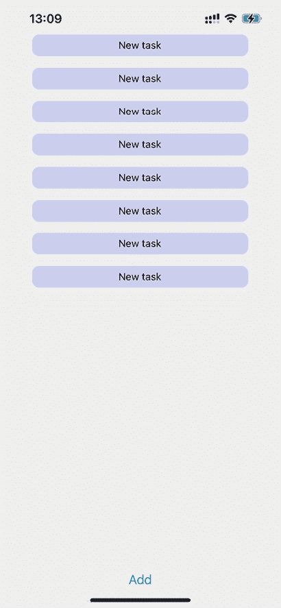
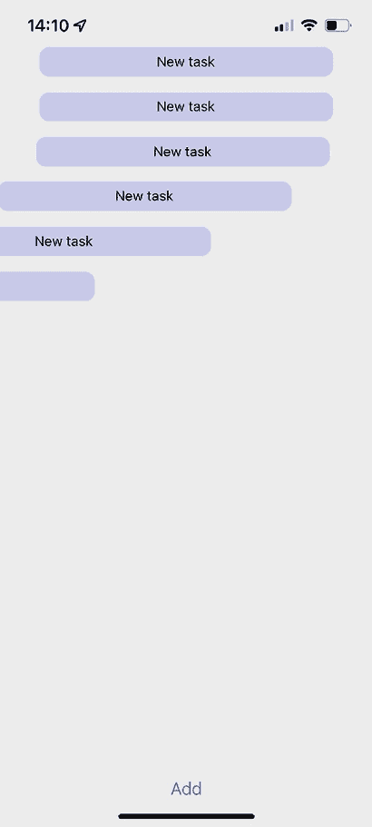
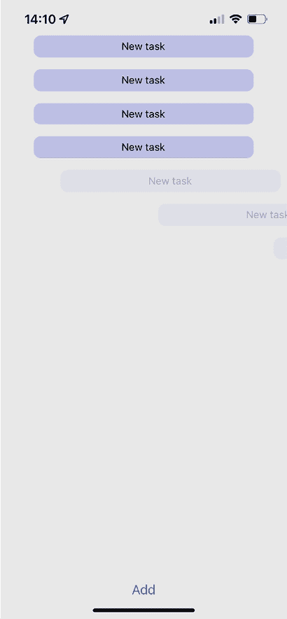

# 第二十六章：使用动画

动画可以用来提升移动应用程序的用户体验。它们通常帮助用户快速识别出变化，或者帮助他们关注重要的事情。它们提升了用户体验和用户满意度。此外，动画看起来也很有趣。例如，在 Instagram 应用中点赞帖子时的心跳反应，或者在 Snapchat 刷新页面时的幽灵动画。

在 React Native 中处理和控制动画有几种不同的方法。首先，我们将看看我们可以使用的动画工具，发现它们的优缺点，并进行比较。然后，我们将实现几个示例，以更好地了解 API。

在这个章节中，我们将涵盖以下主题：

+   使用 React Native Reanimated

+   动画化布局组件

+   动画化组件样式

# 技术要求

你可以在 GitHub 上找到这个章节的代码文件，链接为 [`github.com/PacktPublishing/React-and-React-Native-5E/tree/main/Chapter26`](https://github.com/PacktPublishing/React-and-React-Native-5E/tree/main/Chapter26)。

# 使用 React Native Reanimated

在 React Native 世界中，我们有大量的库和方案来动画化我们的组件，包括内置的 **Animated API**。但在这个章节中，我想要选择一个名为 **React Native Reanimated** 的库，并将其与 Animated API 进行比较，以了解为什么它是最佳选择。

# Animated API

**Animated API** 是在 React Native 中用于动画化组件最常用的工具。它提供了一系列方法，帮助你创建动画对象，控制其状态，并处理它。主要好处是它可以与任何组件一起使用，而不仅仅是像 View 或 Text 这样的动画组件。

但是，同时，这个 API 已经在 React Native 的旧架构中实现了。JavaScript 和 UI Native 线程之间的异步通信使用 Animated API，导致更新至少延迟一帧，持续大约 16 毫秒。有时，如果 JavaScript 线程正在运行 React 的 diff 算法，同时比较或处理网络请求，延迟可能会更长。React Native Reanimated 库可以解决这个问题，它基于新的架构，并在 UI 线程中从 JavaScript 线程处理所有业务逻辑。

## React Native Reanimated

**React Native Reanimated** 可以用来提供对 Animated API 的更全面的抽象，以便与 React Native 一起使用。它提供了一个具有多阶段动画和自定义过渡的命令式 API，同时提供了一个声明式 API，可以用来以类似 CSS 过渡的方式描述简单的动画和过渡。它是建立在 React Native Animated 之上的，并在原生线程上重新实现了它。这允许你在使用最高性能和最简单的 API 的同时，利用熟悉的 JavaScript 语言。

此外，React Native Reanimated 定义了 worklets，这些是可以在 UI 线程中同步执行的 JavaScript 函数。这允许在不等待新帧的情况下进行即时动画。让我们看看一个简单的 worklet 是什么样子：

```js
function simpleWorklet() {
  "worklet";
  console.log("Hello from UI thread");
} 
```

要在 UI 线程内调用 `simpleWorklet` 函数，只需在 `function` 块的顶部添加 `worklet` 指令即可。

React Native Reanimated 提供了各种钩子和方法，帮助我们处理动画：

+   `useSharedValue`：这个钩子返回一个 `SharedValue` 实例，这是在 UI 线程上下文中存在的主要有状态数据对象，其概念与核心 Animated API 中的 `Animated.Value` 类似。当 `SharedValue` 发生变化时，会触发 Reanimated 动画。主要好处是共享值的更新可以在 React Native 和 UI 线程之间同步，而不会触发重新渲染。这使复杂的动画能够在 60 FPS 下平稳运行，而不会阻塞 JS 线程。

+   `useDerivedValue`：这个钩子创建了一个新的共享值，当其计算中使用的共享值发生变化时，它会自动更新。它允许你创建依赖于其他共享值的共享值，同时保持它们的所有反应性。`useDerivedValue` 用于在 UI 线程上运行的 worklet 中创建 **派生** 状态，该状态基于源共享值的更新。然后，这个派生状态可以驱动动画或其他副作用，而不会在 JS 线程上触发重新渲染。

+   `useAnimatedStyle`：这个钩子允许你创建一个可以基于共享值动画其属性的风格对象。它将共享值更新映射到相应的视图属性。`useAnimatedStyle` 是将共享值连接到视图并启用在 UI 线程上运行的平滑动画的主要方式。

+   `withTiming`、`withSpring`、`withDecay`：这些是动画实用方法，它们使用各种曲线和物理方式以平滑、动画的方式更新共享值。它们允许你通过指定目标值和动画配置来声明式地定义动画。

我们已经了解了 React Native Reanimated 是什么以及它与 Animated API 的不同之处。接下来，让我们尝试安装它并将其应用到我们的应用中。

## 安装 React Native Reanimated 库

要安装 React Native Reanimated 库，请在您的 Expo 项目内部运行此命令：

```js
expo install react-native-reanimated 
```

安装完成后，我们需要将 **Babel** 插件添加到 `babel.config.js` 文件中：

```js
module.exports = function(api) {
  api.cache(true);
  return {
    presets: ['babel-preset-expo'],
    plugins: ['react-native-reanimated/plugin'],
  };
}; 
```

该插件的主要目的是将我们的 JavaScript worklet 函数转换为将在 UI 线程中工作的函数。

添加 Babel 插件后，重新启动您的开发服务器并清除 bundler 缓存：

```js
expo start --clear 
```

本节向我们介绍了 React Native Reanimated 库。我们了解到为什么它比内置的 Animated API 更好。在下一节中，我们将使用实际示例来展示它。

# 布局组件的动画

一个常见的用例是动画化组件的进入和退出布局。这意味着当您的组件首次渲染时以及当您卸载组件时，它将以动画形式出现。React Native Reanimated 是一个 API，允许您动画化布局并添加如 `FadeIn`、`BounceIn` 和 `ZoomIn` 等动画。

React Native Reanimated 还提供了一个特殊的 `Animated` 组件，它与 Animated API 中的 `Animated` 组件相同，但具有额外的属性：

+   `entering`：在组件挂载和渲染时接受预定义的动画

+   `exiting`：接受相同的动画对象，但将在组件卸载时被调用

让我们创建一个简单的待办事项列表，其中包含创建任务的按钮和允许我们在点击时删除任务的功能。

截图中无法看到动画，所以我建议你打开代码并尝试实现动画以查看结果。

首先，让我们看看我们的待办事项应用的主屏幕以及当前项目是如何渲染的：



图 26.1：待办事项列表

这是一个简单的示例，包含任务项列表和一个用于添加新任务的按钮。当我们快速多次按下 **添加** 按钮时，列表项会以动画形式从屏幕左侧出现：



图 26.2：具有动画渲染的待办事项列表

魔法是在 `TodoItem` 组件中实现的。让我们看看它：

```js
export const TodoItem = ({ id, title, onPress }) => {
  return (
    <Animated.View entering={SlideInLeft}
      exiting={SlideOutRight}>
      <TouchableOpacity onPress={() => onPress(id)}
        style={styles.todoItem}>
        <Text>{title}</Text>
      </TouchableOpacity>
    </Animated.View>
  );
}; 
```

如您所见，没有复杂的逻辑，代码也不是很多。我们只是将 `Animated` 组件作为动画的根组件，并将 React Native Reanimated 库中预定义的动画传递给 `entering` 和 `exiting` 属性。

要看到项目如何从屏幕上消失，我们需要按下待办事项项目，这样退出动画就会运行。我已经按下了几个项目，并尝试在下面的屏幕截图中捕捉结果：



图 26.3：从屏幕上删除待办事项

让我们检查 `App` 组件以了解整个情况：

```js
export default function App() {
  const [todoList, setTodoList] = useState([]);
  const addTask = () => {
    setTodoList([
      ...todoList,
      { id: String(new Date().getTime()), title: "New task"
        },
    ]);
  };
  const deleteTask = (id) => {
    setTodoList(todoList.filter((todo) => todo.id !== id));
  }; 
```

我们使用 `useState` 钩子和添加和删除任务的处理器函数创建了一个 `todoList` 状态。接下来，让我们看看动画将如何应用于布局：

```js
 return (
    <View style={styles.container}>
      <View style={{ flex: 1 }}>
        {todoList.map(({ id, title }) => (
          <TodoItem key={id} id={id} title={title}
            onPress={deleteTask} />
        ))}
      </View>
      <Button onPress={addTask} title="Add" />
    </View>
  );
} 
```

在这个示例中，我们学习了一种简单的方法来应用动画，使我们的应用看起来更好。然而，React Native Reanimated 库比我们想象的要强大得多。下一个示例将说明我们如何通过直接将动画应用于组件的样式来动画化和创建自己的动画。

# 组件样式动画

在一个更复杂的示例中，我建议创建一个具有美丽可触摸反馈的按钮。这个按钮将使用我们在第二十三章“响应用户手势”中学到的`Pressable`组件来构建。该组件接受`onPressIn`、`onLongPress`和`onPressOut`事件。由于这些事件，我们将能够看到我们的触摸如何在按钮上反映。

让我们先定义`SharedValue`和`AnimatedStyle`：

```js
 const radius = useSharedValue(30);
  const opacity = useSharedValue(1);
  const scale = useSharedValue(1);
  const color = useSharedValue(0);
  const backgroundColor = useDerivedValue(() => {
    return interpolateColor(color.value, [0, 1], ["orange",      "red"]);
     });
  const animatedStyles = useAnimatedStyle(() => {
    return {
      opacity: opacity.value,
      borderRadius: radius.value,
      transform: [{ scale: scale.value }],
      backgroundColor: backgroundColor.value,
    };
  }, []); 
```

为了动画化样式属性，我们使用`useSharedValue`钩子创建了一个`SharedValue`对象。它接受默认值作为参数。接下来，我们使用`useAnimatedStyle`钩子创建了样式对象。该钩子接受一个回调，该回调应返回一个样式对象。`useAnimatedStyle`钩子与`useMemo`钩子类似，但所有计算都在 UI 线程中执行，并且所有`SharedValue`的变化都将触发钩子重新计算样式对象。按钮的背景色是通过`useDerivedValue`创建的，通过在橙色和红色之间插值来提供平滑的过渡。

接下来，让我们创建处理函数，这些函数将根据按钮的按下状态更新样式属性：

```js
 const onPressIn = () => {
    radius.value = withSpring(20);
    opacity.value = withSpring(0.7);
    scale.value = withSpring(0.9);
  };
  const onLongPress = () => {
    scale.value = withSpring(0.8);
    color.value = withSpring(1);
  };
  const onPressOut = () => {
    radius.value = withSpring(30);
    opacity.value = withSpring(1);
    scale.value = withSpring(1, { damping: 50 });
    color.value = withSpring(0);
  }; 
```

第一个处理函数`onPressIn`将`borderRadius`、`opacity`和`scale`从它们的默认值更新。我们同样使用`withSpring`来更新这些值，这使得更新样式更加平滑。像第一个处理函数一样，其他处理函数也会以不同的方式更新按钮的样式。`onLongPress`将按钮变为红色并使其变小。`onPressOut`将所有值重置为它们的默认值。

我们已经实现了所有必要的逻辑，现在可以将其应用于布局：

```js
 <View style={styles.container}>
      <Animated.View style={[styles.buttonContainer,
        animatedStyles]}>
        <Pressable
          onPressIn={onPressIn}
          onPressOut={onPressOut}
          onLongPress={onLongPress}
          style={styles.button}
        >
          <Text style={styles.buttonText}>Press me</Text>
        </Pressable>
      </Animated.View>
    </View> 
```

最后，让我们看看结果：


图 26.4：具有默认、按下和长按样式的按钮

在*图 26.4*中，你可以看到按钮的三个状态：默认、按下和长按。

# 摘要

在本章中，我们学习了如何使用 React Native Reanimated 库向布局和组件添加动画。我们了解了库的基本原理，并发现了它在底层的工作方式以及它是如何在不使用 Bridge 连接应用 JavaScript 和原生层的情况下在 UI 线程中执行代码的。

我们还通过两个使用 React Native Reanimated 库的示例进行了说明。在第一个示例中，我们学习了如何使用预定义的声明式动画来应用布局动画，使我们的组件以美丽的方式出现和消失。在第二个示例中，我们使用`useSharedValue`和`useAnimatedStyle`钩子来动画化按钮的样式。

动画组件和布局的技巧将帮助您使您的应用更加美观和响应。在下一章中，我们将学习如何在我们的应用中控制图像。
