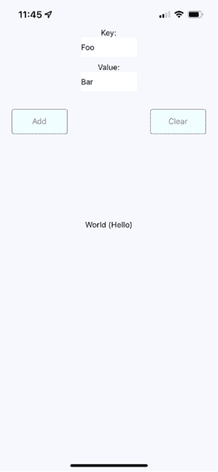
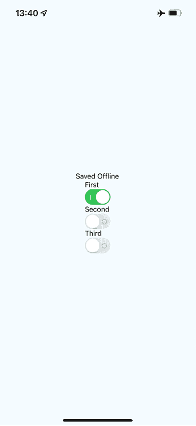

# 第二十八章：离线操作

用户期望应用程序在不稳定的网络连接下无缝运行。如果您的移动应用程序无法处理短暂的网络问题，您的用户将使用其他应用程序。当没有网络时，您必须在设备上本地持久化数据。或者，也许您的应用程序甚至不需要网络访问，在这种情况下，您仍然需要本地存储数据。

在本章中，您将学习如何使用 React Native 完成这三件事。首先，您将学习如何检测网络连接状态。其次，您将学习如何本地存储数据。最后，您将学习如何在网络再次连接后同步因网络问题而存储的本地数据。

在本章中，我们将涵盖以下主题：

+   检测网络状态

+   存储应用程序数据

+   同步应用程序数据

# 技术要求

您可以在 GitHub 上找到本章的代码文件，地址为[`github.com/PacktPublishing/React-and-React-Native-5E/tree/main/Chapter28`](https://github.com/PacktPublishing/React-and-React-Native-5E/tree/main/Chapter28)。

# 检测网络状态

如果您的代码在断开连接的情况下尝试使用`fetch()`发起网络请求，例如，将会发生错误。您可能已经为这些场景准备了错误处理代码，因为服务器可能会返回其他类型的错误。

然而，在出现连接问题时，你可能想在用户尝试发起网络请求之前检测这个问题。

主动检测网络状态有两个潜在原因。第一个原因是防止用户在网络检测到应用程序重新上线之前执行任何网络请求。为此，您可以向用户显示一条友好的消息，说明由于网络断开，他们无法进行任何操作。早期网络状态检测的另一个可能好处是，您可以准备离线执行操作，并在网络再次连接时同步应用程序状态。

让我们看看一些使用来自`@react-native-community/netinfo`包的`NetInfo`实用工具处理网络状态变化的代码：

```js
const connectedMap = {
  none: "Disconnected",
  unknown: "Disconnected",
  cellular: "Connected",
  wifi: "Connected",
  bluetooth: "Connected",
  ethernet: "Connected",
  wimax: "Connected",
  vpn: "Connected",
  other: "Connected",
} as const; 
```

`connectedMap`涵盖了所有连接状态，并将帮助我们将其渲染到屏幕上。现在让我们看看`App`组件：

```js
export default function App() {
  const [connected, setConnected] = useState("");
  useEffect(() => {
    function onNetworkChange(connection: NetInfoState) {
      const type = connection.type;
      setConnected(connectedMap[type]);
    }
    const unsubscribe = NetInfo.addEventListener(onNetworkChange);
    return () => {
      unsubscribe();
    };
  }, []);
  return (
    <View style={styles.container}>
      <Text>{connected}</Text>
    </View>
  );
} 
```

此组件将根据`connectedMap`中的字符串值渲染网络状态。`NetInfo`对象的`onNetworkChange`事件将导致连接状态改变。

例如，当您第一次运行此应用程序时，屏幕可能看起来像这样：


图 28.1：连接状态

然后，如果您关闭主机的网络连接，模拟设备上的网络状态也会改变，从而导致我们应用程序的状态改变，如下所示：


图 28.2：断开连接状态

这就是如何在应用中使用网络状态检测。正如讨论的那样，除了显示消息外，你还可以使用网络状态来防止用户发起 API 请求。另一种有价值的方法是在网络恢复在线之前将用户输入本地保存。让我们在下一节中探讨它。

# 存储应用程序数据

要在设备上存储数据，有一个特殊的跨平台解决方案，称为`AsyncStorage` API。它在 iOS 和 Android 平台上工作方式相同。你会使用这个 API 来处理最初不需要任何网络连接的应用程序，或者存储最终将通过网络可用时使用 API 端点同步的数据。

要安装`async-storage`包，请运行以下命令：

```js
npx expo install @react-native-async-storage/async-storage 
```

让我们看看一些允许用户输入一个`key`和一个`value`并将它们存储起来的代码：

```js
export default function App() {
  const [key, setKey] = useState("");
  const [value, setValue] = useState("");
  const [source, setSource] = useState<KeyValuePair[]>([]); 
```

`key`、`value`和`source`值将处理我们的状态。为了将其保存到`AsyncStorage`，我们需要定义函数：

```js
 function setItem() {
    return AsyncStorage.setItem(key, value)
      .then(() => {
        setKey("");
        setValue("");
      })
      .then(loadItems);
  }
  function clearItems() {
    return AsyncStorage.clear();
  }
  async function loadItems() {
    const keys = await AsyncStorage.getAllKeys();
    const values = await AsyncStorage.multiGet(keys);
    setSource([...values]);
  }
  useEffect(() => {
    loadItems();
  }, []); 
```

我们已经定义了处理程序来保存输入中的值、清除`AsyncStorage`以及在启动应用时加载已保存的项目。以下是`App`组件渲染的标记：

```js
 return (
    <View style={styles.container}>
      <Text>Key:</Text>
      <TextInput
        style={styles.input}
        value={key}
        onChangeText={(v) => {
          setKey(v);
        }}
      />
      <Text>Value:</Text>
      <TextInput
        style={styles.input}
        value={value}
        onChangeText={(v) => {
          setValue(v);
        }}
      />
      <View style={styles.controls}>
        <Button label="Add" onPress={setItem} />
        <Button label="Clear" onPress={clearItems} />
      </View> 
```

上一段代码块中的标记表示为创建、保存和删除项的输入和按钮。接下来，我们将使用`FlatList`组件渲染项目列表：

```js
 <View style={styles.list}>
        <FlatList
          data={source.map(([key, value]) => ({
            key: key.toString(),
            value,
          }))}
          renderItem={({ item: { value, key } }) => (
            <Text>
              {value} ({key})
            </Text>
          )}
        />
      </View>
    </View>
  ); 
```

在我们遍历这段代码的功能之前，让我们看看以下屏幕，因为它将解释我们将在存储应用程序数据时覆盖的大部分内容：



图 28.3：存储应用程序数据

如你在*图 28.3*中看到的，有两个输入字段和两个按钮。这些字段允许用户输入新的`key`和`value`。**添加**按钮允许用户将这个键值对本地存储在他们的设备上，而**清除**按钮则清除之前存储的任何现有项。

`AsyncStorage` API 在 iOS 和 Android 上工作方式相同。在底层，`AsyncStorage`根据其运行的平台而有很大不同。React Native 能够在两个平台上公开相同的存储 API 的原因在于其简单性：它只是键值对。任何比这更复杂的东西都留给应用开发者处理。

在这个例子中，围绕`AsyncStorage`创建的抽象是最小的。想法是设置和获取项。然而，即使是这样的直接操作也值得有一个抽象层。例如，你在这里实现的`setItem()`方法将异步调用`AsyncStorage`并在完成更新后更新项的状态。加载项甚至更复杂，因为你需要作为两个单独的异步操作获取键和值。

我们这样做是为了保持 UI 的响应性。如果在数据写入磁盘时需要发生待处理的屏幕重绘，阻止这些操作会导致用户体验不佳。

在下一节中，你将学习如何在设备重新上线后，同步设备离线时存储的数据与远程服务。

# 同步应用程序数据

到目前为止，在本章中，你已经学习了如何在 React Native 应用程序中检测网络连接状态以及如何本地存储数据。现在，是时候将这两个概念结合起来，实现一个可以检测网络中断并继续工作的应用程序。

基本的想法是在确定设备在线时才进行网络请求。如果你知道它不在线，你可以将任何状态更改保存在本地。然后，当你再次在线时，你可以使用远程 API 同步这些已保存的更改。

让我们实现一个简化的 React Native 应用程序来完成这个任务。第一步是实现一个位于 React 组件和网络调用存储数据之间的抽象。我们将把这个模块称为 `store.ts`：

```js
export function set(key: Key, value: boolean) {
  return new Promise((resolve, reject) => {
    if (connected) {
      fakeNetworkData[key] = value;
      resolve(true);
    } else {
      AsyncStorage.setItem(key, value.toString()).then(
        () => {
          unsynced.push(key);
          resolve(false);
        },
        (err) => reject(err)
      );
    }
  });
} 
```

`set` 方法依赖于 `connected` 变量，并且根据是否有互联网连接，它处理不同的逻辑。实际上，`get` 方法也遵循相同的方法：

```js
export function get(key?: Key): Promise<boolean | typeof fakeNetworkData> {
  return new Promise((resolve, reject) => {
    if (connected) {
      resolve(key ? fakeNetworkData[key] : fakeNetworkData);
    } else if (key) {
      AsyncStorage.getItem(key)
        .then((item) => resolve(item === "true"))
        .catch((err) => reject(err));
    } else {
      AsyncStorage.getAllKeys()
        .then((keys) =>
          AsyncStorage.multiGet(keys).then((items) =>
            resolve(Object.fromEntries(items) as any)
          )
        )
        .catch((err) => reject(err));
    }
  });
} 
```

本模块导出两个函数，`set()` 和 `get()`。它们分别负责设置和获取数据。由于这只是演示如何在本地存储和网络端点之间同步的一种方式，因此本模块仅使用 `fakeNetworkData` 对象模拟实际的网络。

让我们先看看 `set()` 函数。它是一个异步函数，它总是返回一个解析为布尔值的承诺。如果是真的，这意味着你在线上，并且网络调用是成功的。如果是假的，这意味着你离线，使用了 `AsyncStorage` 来保存数据。

与 `get()` 函数使用相同的方法。它返回一个解析为布尔值的承诺，该值指示网络的状态。如果提供了键参数，则查找该键的值。否则，返回所有值，无论是从网络还是从 `AsyncStorage`。

除了这两个函数之外，本模块还做两件事：

```js
NetInfo.fetch().then(
  (connection) => {
    connected = ["wifi", "unknown"].includes(connection.type);
  },
  () => {
    connected = false;
  }
);
NetInfo.addEventListener((connection) => {
  connected = ["wifi", "unknown"].includes(connection.type);
  if (connected && unsynced.length) {
    AsyncStorage.multiGet(unsynced).then((items) => {
      items.forEach(([key, val]) => set(key as Key, val === "true"));
      unsynced.length = 0;
    });
  }
}); 
```

它使用 `NetInfo.fetch()` 来设置连接状态。然后，它添加一个监听器来监听网络状态的变化。这就是在你离线时保存的项在再次连接时与网络同步的方式。

现在，让我们检查使用这些函数的主要应用程序：

```js
export default function App() {
  const [message, setMessage] = useState<string | null>(null);
  const [first, setFirst] = useState(false);
  const [second, setSecond] = useState(false);
  const [third, setThird] = useState(false);
  const setters = new Map([
    ["first", setFirst],
    ["second", setSecond],
    ["third", setThird],
  ]); 
```

在这里，我们定义了将在 `Switch` 组件中使用的状态变量：

```js
 function save(key: Key) {
    return (value: boolean) => {
      set(key, value).then(
        (connected) => {
          setters.get(key)?.(value);
          setMessage(connected ? null : "Saved Offline");
        },
        (err) => {
          setMessage(err);
        }
      );
    };
  } 
```

`save()` 函数帮助我们重用在不同的 `Switch` 组件中的逻辑。接下来，我们有 `useEffect` 钩子，用于在页面首次渲染时获取保存的数据：

```js
 useEffect(() => {
    NetInfo.fetch().then(() =>
      get().then(
        (items) => {
          for (let [key, value] of Object.entries(items)) {
            setters.get(key)?.(value);
          }
        },
        (err) => {
          setMessage(err);
        }
      )
    );
  }, []); 
```

接下来，让我们看看页面的最终标记：

```js
 return (
    <View style={styles.container}>
      <Text>{message}</Text>
      <View>
        <Text>First</Text>
        <Switch value={first} onValueChange={save("first")} />
      </View>
      <View>
        <Text>Second</Text>
        <Switch value={second} onValueChange={save("second")} />
      </View>
      <View>
        <Text>Third</Text>
        <Switch value={third} onValueChange={save("third")} />
      </View>
    </View>
  ); 
```

`App`组件的职责是保存三个`Switch`组件的状态，当你向用户提供在线和离线模式之间的无缝过渡时，这很困难。幸运的是，你的`set()`和`get()`抽象，这些抽象在另一个模块中实现，隐藏了应用功能的大部分细节。

然而，请注意，在尝试加载任何项目之前，你需要在此模块中检查网络状态。如果你不这样做，那么`get()`函数将假设你处于离线状态，即使连接良好。

这就是应用的外观：



图 28.4：同步应用数据

注意，你实际上只有在更改 UI 中的内容后才会看到“**已保存离线**”的消息。

# 摘要

本章向我们介绍了在 React Native 应用程序中离线存储数据。我们想要本地存储数据的主要原因是当设备离线且我们的应用无法与远程 API 通信时。然而，并非所有应用都需要 API 调用，`AsyncStorage`可以用作通用存储机制。我们只需要在它周围实现适当的抽象。

我们还学习了如何检测 React Native 应用的网络状态变化。知道设备何时离线很重要，这样我们的存储层就不会进行无谓的网络调用。相反，我们可以让用户知道设备处于离线状态，然后在有连接可用时同步应用状态。

在下一章中，我们将学习如何从 NativeBase 库中导入和使用 UI 组件。

# 加入我们的 Discord 频道！

与其他用户和作者本人一起阅读这本书。提出问题，为其他读者提供解决方案，与作者聊天，等等。扫描二维码或访问链接加入社区。

[`packt.link/ReactAndReactNative5e`](https://packt.link/ReactAndReactNative5e)


