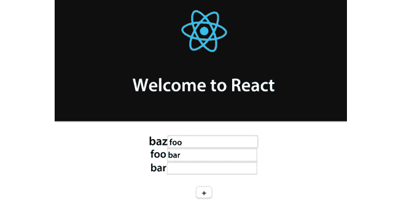

# 第七章：需要避免的反模式

在这本书中，你已经学会了如何在编写 React 应用程序时应用最佳实践。在前几章中，我们回顾了基本概念以建立坚实的基础，然后在接下来的章节中，我们深入探讨了更高级的技术。

现在，你应该能够构建可重用的组件，使组件之间相互通信，并优化应用程序树以获得最佳性能。然而，开发者会犯错误，本章全部关于我们在使用 React 时应避免的常见反模式。

通过查看常见错误，可以帮助你避免它们，并有助于你理解 React 的工作原理以及如何以 React 的方式构建应用程序。对于每个问题，我们将看到一个示例，展示如何重现和解决它。

在本章中，我们将涵盖以下主题：

+   使用属性初始化状态

+   使用索引作为键

+   在 DOM 元素上展开属性

# 技术要求

要完成本章，你需要以下内容：

+   Node.js 19+

+   Visual Studio Code

你可以在本书的 GitHub 仓库中找到本章的代码：[`github.com/PacktPublishing/React-18-Design-Patterns-and-Best-Practices-Fourth-Edition/tree/main/Chapter07`](https://github.com/PacktPublishing/React-18-Design-Patterns-and-Best-Practices-Fourth-Edition/tree/main/Chapter07)。

# 使用属性初始化状态

在本节中，我们将看到使用从父组件接收的属性初始化状态通常是一个反模式。我使用“通常”这个词，因为我们将会看到，一旦我们清楚这种方法的弊端，我们仍然可能决定使用它。

学习某样东西的最好方法之一是查看代码，所以我们将从一个带有+按钮的简单组件开始，用于增加计数器。

让我们创建一个名为`Counter`的函数组件，如下代码片段所示：

```js
import { FC, useState } from 'react'
type Props = {
 count: number
}
const Counter: FC<Props> = (props) => {}
export default Counter 
```

现在，让我们设置我们的`count`状态：

```js
const [state, setState] = useState<number>(props.count) 
```

点击处理器的实现很简单 - 我们只是将`1`添加到当前的`count`值，并将结果值存储回状态：

```js
const handleClick = () => {
 setState({ count: state.count + 1 })
} 
```

最后，我们渲染并描述输出，它由`count`状态的当前值和增加它的按钮组成：

```js
return (
 <div>
 {state.count}
 <button onClick={handleClick}>+</button>
 </div>
) 
```

现在，让我们渲染这个组件，将`1`作为`count`属性传递：

```js
<Counter count={1} /> 
```

它按预期工作 - 每次点击`+`按钮都会增加当前值。那么问题是什么？

主要有两个错误，如下所述：

+   我们有一个重复的真实来源。

+   如果传递给组件的`count`属性发生变化，状态不会更新。

如果我们使用 React DevTools 检查`Counter`元素，我们会注意到`Props`和`State`持有相似的价值：

```js
<Counter>
Props
 count: 1
State
 count: 1 
```

这使得在组件内部和向用户显示时，不清楚哪个是当前和可信的值。

更糟糕的是，点击`+`一次就会使值发散。以下代码展示了这种发散的例子：

```js
<Counter>
Props
 count: 1
State
 count: 2 
```

到目前为止，我们可以假设第二个值代表当前的计数，但这并不明确，可能会导致意外的行为或错误的值。

第二个问题集中在 React 如何创建和实例化类。组件的`useState`函数在组件创建时只被调用一次。

在我们的`Counter`组件中，我们读取`count`属性的值并将其存储在状态中。如果在应用程序的生命周期中该属性的值发生变化（比如说变成 10），`Counter`组件将永远不会使用新的值，因为它已经被初始化。这使组件处于不一致的状态，这并不理想且难以调试。

如果我们真的想使用属性的值来初始化组件，并且我们确信该值在将来不会改变呢？

在这种情况下，最好是使其明确，并给属性一个表明你意图的名称，例如`initialCount`。例如，让我们假设我们以以下方式更改`Counter`组件的属性声明：

```js
type Props = {
 initialCount: number
}
const Counter: FC<Props> = (props) => {
 const [count, setState] = useState<Count>({ count: props.initialCount })
 ...
} 
```

这种用法清楚地表明，父组件只能初始化计数器，任何随后的`initialCount`属性的值都将被忽略：

```js
<Counter initialCount={1} /> 
```

在下一节中，我们将深入探讨键的概念。

# 使用索引作为键

在第十五章“提高应用程序的性能”中，我们讨论了性能和协调器，我们看到了如何通过使用`key`属性来帮助 React 找出更新 DOM 的最短路径。

`key`属性唯一标识 DOM 中的元素，React 使用它来检查元素是否是新元素，或者当组件属性或状态改变时是否必须更新。

使用键总是一个好主意，如果你不这样做，React 会在控制台（在开发模式下）发出警告。然而，这不仅仅是使用键的问题；有时，我们决定用作键的值可能会产生影响。实际上，使用错误的键在某些情况下可能会给我们带来意外的行为。在本节中，我们将看到这些情况之一。

让我们再次创建一个`List`组件，如下所示：

```js
import { FC, useState } from 'react'
const List: FC = () => {
}
export default List 
```

然后我们定义我们的状态：

```js
const [items, setItems] = useState(['foo', 'bar']) 
```

点击处理器的实现与之前略有不同，因为在这种情况下，我们需要在列表顶部插入一个新项目：

```js
const handleClick = () => {
const newItems = items.slice()
 newItems.unshift('baz')
 setItems(newItems)
} 
```

最后，在渲染中，我们显示列表和添加到列表顶部的`baz`项目的`+`按钮：

```js
return (
 <div>
 <ul>
  {items.map((item, index) => (
  <li key={index}>{item}</li>
  ))}
 </ul>
 <button onClick={handleClick}>+</button>
 </div>
) 
```

如果你将组件运行在浏览器中，你将看不到任何问题；点击`+`按钮会在列表顶部插入一个新项目。但让我们做一个实验。

让我们以以下方式更改渲染，在每个项目旁边添加一个输入字段。我们之所以使用输入字段，是因为我们可以编辑其内容，这使得找出问题更容易：

```js
return (
 <div>
 <ul>
  {items.map((item, index) => (
  <li key={index}>
  {item}
  <input type="text" />
  </li>
  ))}
 </ul>
 <button onClick={handleClick}>+</button>
 </div>
) 
```

如果我们在浏览器中再次运行此组件，复制输入字段中项目的值，然后点击 *+*，我们将得到意外的行为。

如以下截图所示，项目向下移动，而输入元素保持在相同的位置，这样它们的值就不再与项目的值匹配：



图 7.1：使用索引作为键

运行组件，点击 **+**，并检查控制台应该会给我们所有需要的答案。

我们可以看到，React 不是在顶部插入新元素，而是交换两个现有元素的文本，并将最后一个项目插入底部，仿佛它是新的。这样做的原因是我们正在使用 map 函数的索引作为键。

实际上，索引始终从 `0` 开始，即使我们将新项目推到列表的顶部，React 也会认为我们更改了现有两个项目的值，并在索引 `2` 处添加了一个新元素。这种行为与完全不使用 `key` 属性时的行为相同。

这是一个非常常见的模式，因为我们可能会认为提供任何键总是最好的解决方案，但事实并非如此。键必须是唯一的和稳定的，以标识一个、且仅标识一个项目。

要解决这个问题，例如，如果我们预期列表中不会重复该项的值，我们可以使用该项的值，或者创建一个唯一的标识符，例如：

```js
 {items.map((item, index) => (
   <li key={`${item}-${index}`}>
  {item}
   <input type="text" />
 </li>
 ))} 
```

现在我们已经了解了在 React 中唯一和稳定的键的重要性，并探讨了解决这个常见问题的实际解决方案，让我们将注意力转向 React 开发中的另一种普遍做法。接下来的部分将专注于在 DOM 元素上分配属性，这是一种最近被 Dan Abramov 标记为反模式的技术。

# 在 DOM 元素上分配属性

最近，Dan Abramov 将这种常见的做法描述为反模式；在您的 React 应用程序中执行此操作时，它也会在控制台中触发警告。

这是一种在社区中广泛使用的技巧，我亲自在多个实际项目中看到过。我们通常将属性分配给元素，以避免手动编写每一个，如下所示：

```js
<Component {...props} /> 
```

这方法非常有效，并且通过 Babel 转译成以下代码：

```js
_jsx(Component, props) 
```

然而，当我们向 DOM 元素分配属性时，我们面临添加未知 HTML 属性的风险，这是不良实践。

问题不仅与 `Spread` 操作符有关；逐个传递非标准属性也会导致相同的问题和警告。由于 `Spread` 操作符隐藏了我们正在分配的单个属性，因此更难弄清楚我们传递给元素的内容。

要在控制台中看到警告，我们可以执行的基本操作是渲染以下组件：

```js
const Spread = () => <div foo="bar" /> 
```

我们收到的消息看起来如下，因为`foo`属性对于`div`元素不是有效的：

```js
 Unknown prop `foo` on <div> tag. Remove this prop from the element 
```

在这种情况下，正如我们所说的，很容易找出我们传递了哪个属性并移除它，但如果我们使用`Spread`运算符，就像以下示例中那样，我们就无法控制从父组件传递哪些属性：

```js
 const Spread = props => <div {...props} />; 
```

如果我们以以下方式使用组件，就没有问题：

```js
 <Spread className="foo" /> 
```

然而，如果我们做如下操作，情况就不同了。React 会抱怨因为我们正在将非标准属性应用于 DOM 元素：

```js
 <Spread foo="bar" className="baz" /> 
```

我们可以使用创建一个名为`domProps`的属性来解决这个问题的解决方案，我们可以安全地将其传播到组件中，因为我们明确表示它包含有效的 DOM 属性。

例如，我们可以这样改变`Spread`组件：

```js
 const Spread = props => <div {...props.domProps} /> 
```

然后，我们可以这样使用它：

```js
 <Spread foo="bar" domProps={{ className: 'baz' }} /> 
```

就像我们多次在 React 中看到的那样，明确总是好的实践。

# 摘要

了解所有最佳实践总是好事，但有时，了解反模式可以帮助我们避免走错路。最重要的是，了解为什么某些技术被认为是坏习惯有助于我们理解 React 是如何工作的，以及我们如何有效地使用它。

在本章中，我们介绍了四种可能损害我们 Web 应用程序性能和行为的使用组件的不同方式。

对于每一个，我们使用示例来重现问题，并提供了需要应用以修复问题的更改。

我们学习了为什么使用属性初始化状态可能导致状态和属性之间不一致。我们还看到了使用错误的`key`属性如何对协调算法产生不良影响。最后，我们学习了为什么将非标准属性传播到 DOM 元素被认为是反模式。

在下一章中，我们将探讨新的 React Hooks。
