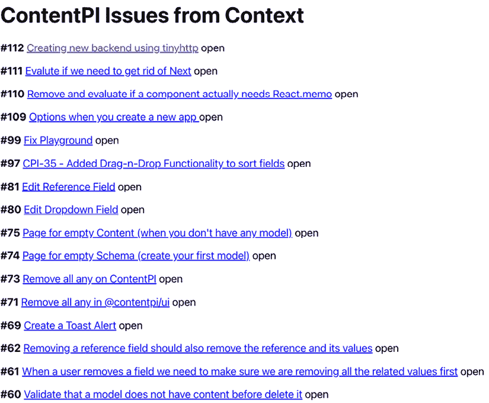
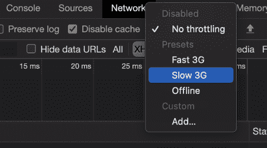
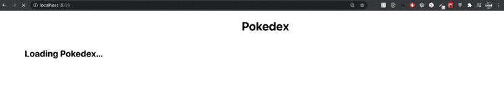
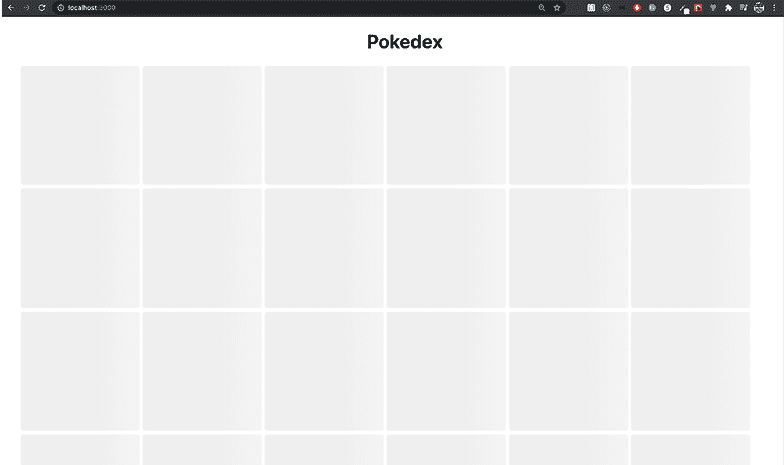
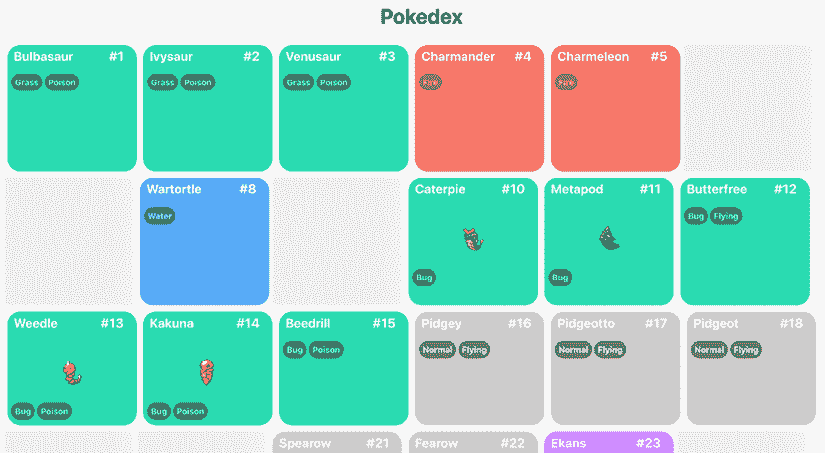
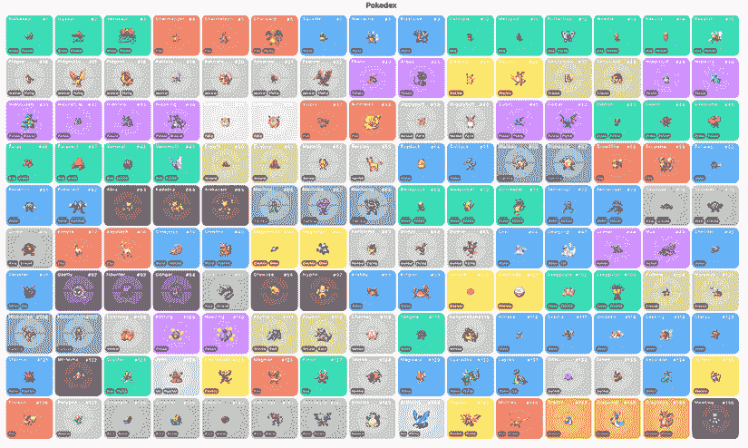
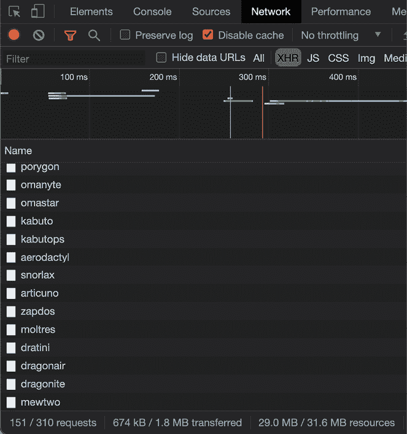
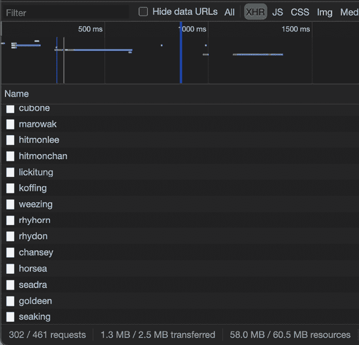

# 第十一章：管理数据

在本章中，我们将探讨两个有益的工具：**React Context API**和**React Suspense**。Context API 简化了在整个应用程序中共享数据的过程，无需通过多层传递。另一方面，React Suspense 允许应用程序的特定部分在显示之前等待某些操作，从而实现更平滑的加载体验。

通过共同利用这些工具，我们可以增强数据管理并提高应用程序的整体性能。加入我们，深入了解 React 中数据的有效处理。

在本章中，我们将涵盖以下主题：

+   React Context API

+   如何使用`useContext`消费上下文

+   如何使用 SWR（Stale-While-Revalidate）与 React Suspense

+   如何使用 Redux Toolkit

# 技术要求

为了完成本章，你需要以下内容：

+   Node.js 19+

+   Visual Studio Code

你可以在本书的 GitHub 仓库中找到本章的代码：[`github.com/PacktPublishing/React-18-Design-Patterns-and-Best-Practices-Fourth-Edition/tree/main/Chapter11`](https://github.com/PacktPublishing/React-18-Design-Patterns-and-Best-Practices-Fourth-Edition/tree/main/Chapter11)。

# 介绍 React Context API

**React Context API**自从首次作为实验性功能引入以来已经走了很长的路。自 16.3.0 版本以来，它已被正式添加到 React 中，并成为许多开发者的游戏改变者。事实上，现在许多人正在使用新的 Context API 而不是 Redux。Context API 允许你在不向每个子组件传递 prop 的情况下在组件之间共享数据。

为了说明如何使用新的 Context API，让我们回顾一下第八章的例子，*React Hooks*，其中我们使用 React Hooks 获取 GitHub 问题，但这次我们使用 Context API。

## 创建我们的第一个上下文

你需要做的第一件事是创建问题上下文。为此，你可以在你的**src**文件夹中创建一个名为`contexts`的文件夹，在那里你将添加`Issue.tsx`文件。

然后，你需要从 React 和`axios`导入一些函数：

```js
import { FC, createContext, useState, useEffect, ReactElement, useCallback } from 'react'
import axios from 'axios' 
```

到目前为止，很明显你应该安装`axios`。如果你还没有安装，只需做以下操作：

```js
 npm install axios
  npm install --save-dev @types/axios 
```

接下来，我们需要声明我们的接口：

```js
export type Issue = {
  number: number
  title: string
  url: string
  state: string
}
interface Issue_Context {
  issues: Issue[]
  url: string
}
interface Props {
  url: string
} 
```

在此之后，我们需要做的第一件事是使用`createContext`函数创建我们的上下文，并定义我们想要导出的值：

```js
export const IssueContext = createContext<Issue_Context>({ issues: [], url: '' }) 
```

一旦我们有了`IssueContext`，我们需要创建一个组件，在那里我们可以接收 props，设置一些状态，并使用`useEffect`执行 fetch，然后我们在`IssueContext.Provider`中渲染，指定我们想要导出的上下文（值）：

```js
const IssueProvider: FC<Props> = ({ children, url }) => {
  // State
  const [issues, setIssues] = useState<Issue[]>([])
  const fetchIssues = useCallback(async () => {
    const response = await axios(url)
    if (response) {
      setIssues(response.data)
    }
  }, [url])
  // Effects
  useEffect(() => {
    fetchIssues()
  }, [fetchIssues])
  const context = {
    issues,
    url
  }
  return <IssueContext.Provider value={context}>{children}</IssueContext.Provider>
}
export default IssueProvider 
```

如你所知，每次你想在`useEffect` Hook 中使用一个函数时，你都需要用`useCallback` Hook 将你的函数包装起来。如果你想要使用 async/await，一个好的做法是将其放在一个单独的函数中，而不是直接在`useEffect`中。

一旦我们在 `issues` 状态中执行获取并获取数据，我们将添加我们想要导出为上下文的所有值，然后当渲染 `IssueContext.Provider` 时，我们将通过 `value` 属性传递上下文，最后，我们将渲染组件的子元素。

## 使用提供者包裹我们的组件

消费上下文的方式分为两部分。第一部分是你将你的应用程序包裹在你的上下文提供者中，因此这段代码可以添加到 `App.tsx` 中（通常，所有提供者都在父组件中定义）。

注意这里我们正在导入 `IssueProvider` 组件：

```js
// Providers
import IssueProvider from '../contexts/Issue'
// Components
import Issues from './Issues'
const App = () => {
  return (
    <IssueProvider url="https://api.github.com/repos/ContentPI/ContentPI/issues">
      <Issues />
    </IssueProvider>
  )
}
export default App; 
```

如你所见，我们正在用 `IssueProvider` 包裹 `Issues` 组件。这意味着在 `Issues` 组件内部，我们可以消费我们的上下文并获取问题值。

许多人发现这个概念很令人困惑。如果你忘记将你的组件包裹在提供者中，你将无法在它们内部访问上下文。挑战之处在于你可能不会收到错误消息；相反，你将遇到未定义的数据，这使得很难定位问题。

现在我们已经理解了正确包裹组件以提供者的重要性，让我们探索如何在 `Issues` 组件中使用 `useContext` 钩子精确地消费我们的上下文。

# 使用 useContext 消费上下文

如果你已经在 `App.tsx` 中放置了 `IssueProvider`，现在你可以在你的 `Issues` 组件中使用 `useContext` 钩子来消费你的上下文。

注意这里我们正在导入 `IssueContext` 上下文（在 `{ }` 之间）：

```js
// Dependencies
import { FC, useContext } from 'react'
// Contexts
import { IssueContext, Issue } from '../contexts/Issue'
const Issues: FC = () => {
  // Here you consume your Context, and you can grab the issues value.
  const { issues, url } = useContext(IssueContext)
  return (
    <>
      <h1>ContentPI Issues from Context</h1>
      {issues.map((issue: Issue) => (
        <p key={`issue-${issue.number}`}>
          <strong>#{issue.number}</strong> {' '}
          <a href={`${url}/${issue.number}`}>{issue.title}</a> {' '}
          {issue.state}
        </p>
      ))}
    </>
  )
}
export default Issues 
```

如果你一切操作正确，你应该能够看到问题列表：



图 11.1：来自上下文的 ContentPI 问题

当你想要将应用程序与数据分离并在其中执行所有获取操作时，**Context API** 非常有用。当然，**Context API** 有多种用途，也可以用于主题或传递函数；这完全取决于你的应用程序。

在下一节中，我们将学习如何使用 SWR 库实现 **React Suspense**。

# 使用 SWR 引入 React Suspense

React Suspense 在 React 16.6 版本中被引入。Suspense 允许你在满足某个条件之前暂停组件的渲染。你可以渲染一个加载组件或任何你想要的作为 Suspense 的后备内容。

目前，这个用法只有两种：

+   **代码拆分**：当你拆分应用程序并且用户想要访问它时正在等待下载应用程序的一个块。

+   **数据获取**：当你正在获取数据。

在这两种情况下，你可以渲染一个后备内容，这通常可以是一个加载指示器，一些加载文本，或者更好的是，一个占位符骨架。

## 介绍 SWR

**Stale-While-Revalidate** （**SWR**）是一个用于数据获取的 React 钩子；它是一个 HTTP 缓存失效策略。SWR 是一种策略，首先从缓存（过时）返回数据，然后发送获取请求（重新验证），最后返回最新的数据，并由 **Vercel** 公司开发，该公司创建了 **Next.js**。

## 构建 Pokedex！

我找不到比构建一个 **宝可梦图鉴** 更好的例子来解释 React Suspense 和 SWR。我们将使用一个公开的宝可梦 API ([`pokeapi.co`](https://pokeapi.co))：*必须全部捕捉*！

你需要做的第一件事是安装一些包：

```js
npm install swr react-loading-skeleton styled-components 
```

对于这个示例，你需要在 `src/components/Pokemon` 创建 Pokemon 目录。我们需要做的第一件事是为了使用 SWR 创建一个 fetcher 文件，我们将在这里执行我们的请求。

此文件应在 `src/components/Pokemon/fetcher.ts` 创建：

```js
const fetcher = (url: string) => {
  return fetch(url).then((response) => {
    if (response.ok) {
      return response.json()
    }
    return {
      error: true
    }
  })
}
export default fetcher 
```

如果你注意到，我们在响应不成功时返回一个带有 `error` 的对象。这是因为有时我们可以从 API 获取 404 错误，这可能导致应用程序崩溃。

一旦你创建了你的 fetcher，让我们修改 `App.tsx` 以配置 `SWRConfig` 并启用 Suspense：

```js
import { SWRConfig } from 'swr'
import PokeContainer from './Pokemon/PokeContainer'
import fetcher from './Pokemon/fetcher'
import { StyledPokedex, StyledTitle } from './Pokemon/Pokemon.styled'
const App = () => {
  return (
    <>
      <StyledTitle>Pokedex</StyledTitle>
      <SWRConfig value={{ fetcher, suspense: true }}>
        <StyledPokedex>
          <PokeContainer />
        </StyledPokedex>
      </SWRConfig>
    </>
  )
}
export default App 
```

如你所见，我们需要将 `PokeContainer` 组件包裹在 `SWRConfig` 中，以便能够获取数据。`PokeContainer` 组件将是我们的父组件，我们将在这里添加第一个 `Suspense`。此文件位于 `src/components/Pokemon/PokeContainer.tsx`：

```js
import { FC, Suspense } from 'react'
import Pokedex from './Pokedex'
const PokeContainer: FC = () => {
  return (
    <Suspense fallback={<h2>Loading Pokedex...</h2>}>
      <Pokedex />
    </Suspense>
  )
}
export default PokeContainer 
```

如你所见，我们为第一个 `Suspense` 定义了一个回退，它只是 `Loading Pokedex...` 文本。你可以在那里渲染任何你想要的内容，React 组件或纯文本。然后，我们在 Suspense 内部放置了 Pokedex 组件。

现在我们来看看我们的 Pokedex 组件，我们将使用 `useSWR` 钩子来获取第一次数据：

```js
import { FC, Suspense } from 'react'
import useSWR from 'swr'
import LoadingSkeleton from './LoadingSkeleton'
import Pokemon from './Pokemon'
import { StyledGrid } from './Pokemon.styled'
const Pokedex: FC = () => {
  const { data: { results } } = useSWR('https://pokeapi.co/api/v2/pokemon?limit=150')
  return (
    <>
      {results.map((pokemon: { name: string }) => (
        <Suspense fallback={<StyledGrid><LoadingSkeleton /></StyledGrid>}>
          <Pokemon key={pokemon.name} pokemonName={pokemon.name} />
        </Suspense>
      ))}
    </>
  )
}
export default Pokedex 
```

如你所见，我们正在获取前 150 个宝可梦，因为我是个老派的人，这些是第一代。现在，我不知道有多少宝可梦存在。此外，如果你注意到，我们正在获取数据中的 `results` 变量（这是 API 的实际响应）。然后我们将结果映射以渲染每个宝可梦，但我们为每个宝可梦添加了一个带有 `<LoadingSkeleton />` 回退的 Suspense 组件（`<StyledGrid />` 有一些 CSS 样式使其看起来更美观），最后，我们将 `pokemonName` 传递给 `<Pokemon>` 组件，这是因为第一次获取只带来了宝可梦的名字，但我们需要进行另一次获取以带来实际的宝可梦数据（名称、类型、力量等）。

然后，最后，我们的宝可梦组件将通过宝可梦名称执行特定的获取，并将数据渲染出来：

```js
import { FC } from 'react'
import useSWR from 'swr'
import { StyledCard, StyledTypes, StyledType, StyledHeader } from './Pokemon.styled'
type Props = {
  pokemonName: string
}
const Pokemon: FC<Props> = ({ pokemonName }) => {
  const { data, error } = useSWR(`https://pokeapi.co/api/v2/pokemon/${pokemonName}`)
  // Do you remember the error we set on the fetcher?
  if (error || data.error) {
    return <div />
  }
  if (!data) {
    return <div>Loading...</div>
  }
  const { id, name, sprites, types } = data
  const pokemonTypes = types.map((pokemonType: any) => pokemonType.type.name)
  return (
    <StyledCard pokemonType={pokemonTypes[0]}>
      <StyledHeader>
        <h2>{name}</h2>
        <div>#{id}</div>
      </StyledHeader>
      
      <StyledTypes>
        {pokemonTypes.map((pokemonType: string) => (
          <StyledType key={pokemonType}>{pokemonType}</StyledType>
        ))}
      </StyledTypes>
    </StyledCard>
  )
}
export default Pokemon 
```

基本上，在这个组件中，我们将所有宝可梦数据（ID、名称、精灵和类型）组合在一起，并渲染信息。正如你所看到的，我正在使用样式组件，它们非常棒，所以如果你想了解我用于 Pokedex 的样式，这里就是 `Pokemon.styled.ts` 文件：

```js
import styled from 'styled-components'
// Type colors
const type: any = {
  bug: '#2ADAB1',
  dark: '#636363',
  dragon: '#E9B057',
  electric: '#ffeb5b',
  fairy: '#ffdbdb',
  fighting: '#90a4b5',
  fire: '#F7786B',
  flying: '#E8DCB3',
  ghost: '#755097',
  grass: '#2ADAB1',
  ground: '#dbd3a2',
  ice: '#C8DDEA',
  normal: '#ccc',
  poison: '#cc89ff',
  psychic: '#705548',
  rock: '#b7b7b7',
  steel: '#999',
  water: '#58ABF6'
}
export const StyledPokedex = styled.div`
  display: flex;
  flex-wrap: wrap;
  flex-flow: row wrap;
  margin: 0 auto;
  width: 90%;
  &::after {
    content: '';
    flex: auto;
  }
`
type Props = {
  pokemonType: string
}
export const StyledCard = styled.div<Props>`
  position: relative;
  ${({ pokemonType }) => `
    background: ${type[pokemonType]} url(./pokeball.png) no-repeat;
    background-size: 65%;
    background-position: center;
  `}
  color: #000;
  font-size: 13px;
  border-radius: 20px;
  margin: 5px;
  width: 200px;
  img {
    margin-left: auto;
    margin-right: auto;
    display: block;
  }
`
export const StyledTypes = styled.div`
  display: flex;
  margin-left: 6px;
  margin-bottom: 8px;
`
export const StyledType = styled.span`
  display: inline-block;
  background-color: black;
  border-radius: 20px;
  font-weight: bold;
  padding: 6px;
  color: white;
  margin-right: 3px;
  opacity: 0.4;
  text-transform: capitalize;
`
export const StyledHeader = styled.div`
  display: flex;
  justify-content: space-between;
  width: 90%;
  h2 {
    margin-left: 10px;
    margin-top: 5px;
    color: white;
    text-transform: capitalize;
  }
  div {
    color: white;
    font-size: 20px;
    font-weight: bold;
    margin-top: 5px;
  }
`
export const StyledTitle = styled.h1`
  text-align: center;
`
export const StyledGrid = styled.div`
  display: flex;
  flex-wrap: wrap;
  flex-flow: row wrap;
  div {
    margin-right: 5px;
    margin-bottom: 5px;
  }
` 
```

最后，我们的`LoadingSkeleton`组件应该像这样：

```js
import { FC } from 'react'
import Skeleton from 'react-loading-skeleton'
const LoadingSkeleton: FC = () => (
  <div>
    <Skeleton height={200} width={200} />
  </div>
)
export default LoadingSkeleton 
```

这个库非常棒。它让你可以创建骨架占位符来等待数据。当然，你可以构建你想要的任何数量的表单。你可能已经在 LinkedIn 或 YouTube 等网站上看到过这种效果。

### 测试 React Suspense

一旦所有的代码片段都开始工作，你可以使用一个技巧来查看所有的 Suspense 回退。通常，如果你有高速连接，很难看到它，但你可以通过在 Chrome 检查器的**网络**标签页中选择**慢速 3G**来降低你的连接速度，看看一切是如何渲染的：



图 11.2：慢速 3G 连接

一旦你设置了**慢速 3G**预设并运行你的项目，你将看到的第一个回退是**正在加载宝可梦...**：



图 11.3：加载宝可梦

然后，你会看到宝可梦的回退，每个正在加载的宝可梦都会渲染`SkeletonLoading`：



图 11.4：SkeletonLoading

通常这些加载器有动画，但在这本书中当然不会看到！然后你将开始看到数据是如何渲染的，一些图片开始出现：



图 11.5：加载宝可梦图鉴

如果你等待所有数据正确下载，你现在应该能看到包含所有宝可梦的宝可梦图鉴：



图 11.6：显示整个宝可梦图鉴

真的很不错，对吧？但还有其他要说的；正如我之前提到的，SWR 会首先从缓存中获取数据，然后会持续验证数据，以查看是否有新的更新。这意味着每次数据发生变化时，SWR 都会执行另一个获取操作来重新验证旧数据是否仍然有效或需要用新数据替换。

即使你从宝可梦标签页移到另一个标签页然后再返回，你也能看到这个效果。你会发现你的**网络**终端，第一次，看起来是这样的：



图 11.7：请求

正如你所见，我们执行了 151 个初始请求（1 个用于宝可梦列表和 150 个其他请求，每个宝可梦 1 个），但如果你切换标签页然后返回，你会看到 SWR 再次进行获取：



图 11.8：151 个请求

现在你可以看到它正在执行 302 个请求（另外 151 个）。当你需要每秒或每分钟获取实时数据时，这非常有用。

目前，React Suspense 缺乏一个定义的使用模式，这意味着有各种方法可以利用它，而且还没有建立最佳实践。我发现 SWR 是处理 React Suspense 最容易、最易懂的方法。我相信这是一个功能强大的库，即使不需要 Suspense 也可以有效地使用。

在探索了 React Suspense 的灵活性之后，让我们将注意力转向 React 生态系统中的另一个强大工具：Redux Toolkit。这个工具正在改变 Redux 的方法，在接下来的章节中，我们将深入探讨其基本特性和通过实际代码示例展示其应用。

# Redux Toolkit：Redux 的现代方法

**Redux Toolkit** 是官方的、有偏见的、包含所有电池的工具集，用于高效的 Redux 开发。它是为了帮助开发者用更少的样板代码编写更好、更高效的 Redux 代码而创建的。在本节中，我们将探讨 Redux Toolkit 的关键特性，并伴随代码示例来展示如何在您的应用程序中使用它。

## 关键特性

Redux Toolkit 包含几个关键特性，简化了 Redux 开发过程：

+   **configureStore**：一个设置具有合理默认值的 Redux 存储的函数。

+   **createSlice**：一个基于提供的配置自动生成动作创建器和还原器的函数。

+   **createAction**：一个创建具有特定类型和有效负载的动作创建器的实用函数。

+   **createReducer**：一个简化还原器创建的实用函数，使用 **Immer**，允许直接状态操作。

## 入门

首先，安装 Redux Toolkit 和其依赖项：

```js
 npm install @reduxjs/toolkit react-redux typescript @types/react @types/react-redux @types/react-dom 
```

## 创建存储

要创建存储，我们将使用 Redux Toolkit 提供的 `configureStore` 函数（`store.ts`）：

```js
import { configureStore } from '@reduxjs/toolkit'
import rootReducer from './rootReducer'
const store = configureStore({
  reducer: rootReducer
})
export type RootState = ReturnType<typeof rootReducer>
export default store 
```

## 创建一个切片

一个切片代表 Redux 存储中与特定功能或领域相对应的部分。要创建一个切片，请使用 `createSlice` 函数（`createSlice.ts`）：

```js
import { createSlice } from '@reduxjs/toolkit'
const counterSlice = createSlice({
  name: 'counter',
  initialState: 0,
  reducers: {
    increment: (state) => state + 1,
    decrement: (state) => state – 1
  }
})
export const { increment, decrement } = counterSlice.actions
export default counterSlice.reducer 
```

## 合并还原器

如果您有多个切片，您可以使用 Redux Toolkit 中的 `combineReducers` 函数来创建一个根还原器（`rootReducer.ts`）：

```js
import { combineReducers } from '@reduxjs/toolkit'
import counterReducer from './counterSlice'
const rootReducer = combineReducers({
  counter: counterReducer
})
export default rootReducer 
```

## 将组件连接到存储

要将 React 组件连接到 Redux 存储，请使用来自 `react-redux` 包的 `useSelector` 和 `useDispatch` 钩子（`Counter.ts`）：

```js
import { useSelector, useDispatch } from 'react-redux'
import { increment, decrement } from './counterSlice'
import { RootState } from './store'
function Counter() {
  const count = useSelector((state: RootState) => state.counter)
  const dispatch = useDispatch()
  return (
    <div>
      <button onClick={() => dispatch(decrement())}>-</button>
      <span>{count}</span>
      <button onClick={() => dispatch(increment())}>+</button>
    </div>
  )
}
export default Counter 
```

## 将存储与 React 应用程序集成

最后，使用来自 `react-redux` 的 `Provider` 组件包裹您的 React 应用程序，并将您的存储作为属性传递：

```js
import React from 'react'
import { createRoot } from 'react-dom/client'
import { Provider } from 'react-redux'
import store from './store'
import Counter from './Counter'
createRoot(document.getElementById('root') as HTMLElement).render(
  <Provider store={store}>
    <Counter />
  </Provider>
) 
```

在本节中，我们探讨了 Redux Toolkit 的关键特性，包括 `configureStore`、`createSlice`、`createAction` 和 `createReducer`。通过利用这些特性，开发者可以用更少的样板代码编写更高效、更易于维护的 Redux 代码。提供的代码示例演示了如何使用 Redux Toolkit 创建一个简单的计数器应用程序，说明了设置存储、创建切片和还原器以及将组件连接到存储所需的步骤。通过利用 Redux Toolkit，您可以简化 Redux 开发过程并构建更健壮的应用程序。

# 概述

我真心希望你喜欢阅读这一章，其中包含了大量关于 React Context API 以及如何使用 SWR 实现 React Suspense 的信息。我们涵盖了 Context API 的基础知识，包括如何创建和消费上下文，以及如何使用 `useContext` 钩子进行更简单的消费。

此外，我们还探讨了 React Suspense 以及它如何通过允许我们更有效地处理加载状态来提升用户体验。我们还学习了 SWR 以及它是如何通过 React Suspense 简化数据获取和缓存的。最后，我们学习了如何实现新的 Redux Toolkit。通过利用这些强大的工具，你可以构建更高效、更友好的 React 应用程序。

在下一章中，我们将学习如何在 React 中使用 **Server-Side Rendering** 和 **Next.js**。
