# 第十三章：通过真实项目理解 GraphQL

**GraphQL**是一种强大的查询语言，旨在与 API 无缝协作，使它们能够高效地与现有数据交互。与传统 REST API 不同，GraphQL 提供了 API 中数据的全面概述，使得请求所需的确切数据变得容易，而不需要更多。这不仅简化了 API 请求，而且在必要时也使得优化和改进 API 变得更加容易。此外，GraphQL 还配备了强大的开发者工具，以进一步增强您的开发体验。

在本章中，我们将深入探讨 GraphQL 的实际应用，通过为现实世界项目构建基本的登录和用户注册系统。通过探索 GraphQL 在此环境下的应用，您将全面了解该语言，并能够在自己的项目中有效地应用它。

本章将涵盖以下主题：

+   安装 PostgreSQL

+   使用 `.env` 文件创建环境变量

+   配置 Apollo Server

+   定义 GraphQL 查询和突变

+   使用解析器进行工作

+   创建 Sequelize 模型

+   实现 JWT

+   使用 GraphQL Playground

+   执行身份验证

# 技术要求

要完成本章，您需要以下内容：

+   Node.js 19+

+   Visual Studio Code

+   PostgreSQL

+   Homebrew ([`brew.sh`](https://brew.sh))

+   pgAdmin 4 ([`www.pgadmin.org/download/`](https://www.pgadmin.org/download/))

您可以在本书的 GitHub 仓库中找到本章的代码：[`github.com/PacktPublishing/React-18-Design-Patterns-and-Best-Practices-Fourth-Edition/tree/main/Chapter13`](https://github.com/PacktPublishing/React-18-Design-Patterns-and-Best-Practices-Fourth-Edition/tree/main/Chapter13)。

# 使用 PostgreSQL、Apollo Server、GraphQL、Sequelize 和 JSON Web Tokens（JWT）构建后端登录系统

在本节中，我们将使用 PostgreSQL、Apollo Server、GraphQL、Sequelize 和**JSON Web Tokens**（**JWTs**）构建后端登录系统。我们将利用 PostgreSQL 进行数据存储，Sequelize 执行数据库操作，Apollo Server 创建 GraphQL API，GraphQL 塑造我们的 API，JWTs 用于用户身份验证和授权。无论您是初学者还是有经验的开发者，本指南将全面了解如何将这些技术集成到一个强大且安全的后端登录系统中。让我们开始吧。

# 安装 PostgreSQL

对于这个示例，我们将使用 PostgreSQL 数据库，因此您需要安装 PostgreSQL 才能在您的机器上运行此项目。

PostgreSQL 是我们数据库的一个优秀选择。*为什么？*它在保持数据安全和井然有序方面表现出色，即使在意外问题发生时也是如此。它能够处理各种类型的数据，这证明非常方便。此外，PostgreSQL 是可扩展的，使其能够超越基础功能。它运行高效，可以同时管理大量用户。

此外，它拥有强大的安全特性，确保我们的数据得到保护。作为一个开源平台，它不仅免费，还能从大量积极致力于其改进的社区中受益。如果你有其他数据库的先前经验，PostgreSQL 很容易理解，因为它遵循相同的标准。此外，它能够处理大量数据，并能够同时容纳众多用户。这正是它成为我们登录系统等项目的可靠选择的原因。

如果你有一台 macOS 机器，通过 Homebrew 安装 PostgreSQL 是最简单的方法。你只需要运行以下命令：

```js
brew install postgres 
```

安装完成后，你需要运行以下命令：

```js
ln -sfv /usr/local/opt/postgresql/*.plist ~/Library/LaunchAgents 
```

此命令创建了一个从 PostgreSQL `plist`文件（macOS 使用的配置文件）到你的`~/Library/LaunchAgents`目录的符号链接（一种快捷方式）。`ln -sfv`命令使用的选项如下：“**s**”代表**符号**（创建符号链接），“**f**”代表**强制**（删除现有的目标文件），以及“**v**”代表**详细**（显示正在发生的事情）。

然后，你可以创建两个新的别名来启动和停止你的 PostgreSQL 服务器：

```js
alias pg_start="launchctl load ~/Library/LaunchAgents"
alias pg_stop="launchctl unload ~/Library/LaunchAgents" 
```

现在，你应该可以使用`pg_start`启动你的 PostgreSQL 服务器，或者使用`pg_stop`停止它。之后，你需要创建你的第一个数据库，如下所示：

```js
createdb `whoami` 
```

现在，你可以使用`psql`命令连接到 PostgreSQL。如果你收到一个错误，指出角色`"postgresql"`不存在，你可以通过运行以下命令来修复它：

```js
createuser -s postgres 
```

如果你一切操作正确，你应该会看到类似以下的内容：

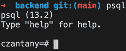

图 13.1：psql

如果你使用 Windows，你可以从[`www.postgresql.org/download/windows/`](https://www.postgresql.org/download/windows/)下载 PostgreSQL，而对于使用 Linux（Ubuntu）的用户，你可以从[`www.postgresql.org/download/linux/ubuntu/`](https://www.postgresql.org/download/linux/ubuntu/)下载。

## PostgreSQL 数据库管理的最佳工具

PostgreSQL 数据库管理的最佳工具是**pgAdmin 4** ([`www.pgadmin.org/download/`](https://www.pgadmin.org/download/))。我喜欢这个工具，因为它可以用来创建新的服务器、用户和数据库，也可以用来执行 SQL 查询和处理数据。记住，为了在这个例子中使用它，你需要创建一个数据库。

有时，当你启动 PostgreSQL 服务器时，可能会遇到错误，可能会说类似 **FATAL 锁文件“postmaster.pid”已存在** 的话。如果你遇到这个错误，你可以通过运行以下命令轻松修复它：

```js
rm /usr/local/var/postgres/postmaster.pi 
```

使用这个方法，你将能够启动你的 PostgreSQL 服务器。

现在我们已经完成了 PostgreSQL 的设置，并且有了 pgAdmin 工具来简化数据库管理，我们可以将注意力转移到下一个任务，即构建我们的后端项目。

# 创建我们的后端项目

首先，你需要在你的 GraphQL 项目中创建一个后端目录（`graphql/backend`）。然后，让我们回顾一下你需要安装的大量 NPM 软件包（重点关注最相关的）：

```js
npm init --yes
npm install @apollo/server@4.7.3 @contentpi/lib@1.0.10 @graphql-tools/load-files@7.0.0 @graphql-tools/merge@9.0.0 @graphql-tools/schema@10.0.0 body-parser@1.20.2 cors@2.8.5 dotenv@16.1.4 express@4.18.2 graphql-middleware@6.1.34 graphql-tag@2.12.6 jsonwebtoken@9.0.0 pg@8.11.0 pg-hstore@2.3.4 pm2@5.3.0 sequelize@6.32.0 ts-node@10.9.1
npm install --save-dev prettier@2.8.8 ts-node-dev@2.0.0 typescript@5.1.3 eslint@8.42.0 @types/jsonwebtoken@9.0.2 @types/cors@2.8.13 
```

请注意，我上一本书的一些读者遇到了某些代码的问题，这些代码没有按预期工作。这是由于自写作以来软件包版本的更新导致的。

为了确保这本书中的代码能够正确运行，我已经指定了我使用的特定版本的软件包。需要注意的是，这些软件包的新版本可能包含破坏性更改，可能会影响代码的功能，因此建议你使用指定的版本以避免任何问题。

你应该在 `package.json` 文件中拥有的脚本如下：

```js
"scripts": {
  "dev": "ts-node-dev src/index.ts",
  "build": "rm -rf dist && tsc -p . --traceResolution",
  "lint": "eslint . --ext .js,.tsx,.ts",
  "lint:fix": "eslint . --fix --ext .js,.tsx,.ts",
  "test": "jest src"
} 
```

在下一节中，我们将配置我们的环境变量。

## 配置我们的 .env 文件

`.env` 文件（也称为 *dotenv*）是一个配置文件，用于指定应用程序的环境变量。通常情况下，你的应用程序在开发、预发布或生产环境中不会改变，但它们通常需要不同的配置。最常更改的变量是基本 URL、API URL，甚至 API 密钥。

在我们深入研究实际的登录代码之前，我们需要创建一个名为 `.env` 的文件（通常，这个文件被 **.gitignore** 忽略），这将允许我们使用私有数据，例如数据库连接和安全机密。仓库中已经存在一个名为 **.env.example** 的文件；你只需要将其重命名并将你的连接数据放入其中。`.env 文件` 将看起来像这样：

```js
DB_DIALECT=postgres
DB_PORT=5432
DB_HOST=localhost
DB_DATABASE=<your-database>
DB_USERNAME=<your-username>
DB_PASSWORD=<your-password> 
```

## 创建一个基本的配置文件

对于这个项目，我们需要创建一个配置文件来存储一些安全数据，它应该创建在 **/backend/config/config.json**。

在这里，我们将定义一些基本配置，例如我们的服务器端口和一些安全信息：

```js
{
  "server": {
  "port": 4000
},
  "security": {
  "secretKey": "C0nt3ntP1",
  "expiresIn": "7d"
}
} 
```

然后，你需要在配置目录中创建一个 **index.ts** 文件。这将引入我们在 `.env` 文件中定义的所有数据库连接信息，然后导出三个配置变量，分别称为 **$db**、**$security** 和 **$server**：

```js
import dotenv from 'dotenv'
import config from './config.json'
dotenv.config()
type Db = {
  dialect: string
  host: string
  port: string
  database: string
  username: string
  password: string
}
type Security = {
  secretKey: string
  expiresIn: string
}
type Server = {
  port: number
}
const db: Db = {
  dialect: process.env.DB_DIALECT || '',
  port: process.env.DB_PORT || '',
  host: process.env.DB_HOST || '',
  database: process.env.DB_DATABASE || '',
  username: process.env.DB_USERNAME || '',
  password: process.env.DB_PASSWORD || ''
}
const { security, server } = config
export const $db: Db = db
export const $security: Security = security
export const $server: Server = server 
```

如果你的 `.env` 文件不在 `root` 目录中或不存在，所有你的变量都将被 **未定义**。

一旦您配置了文件并验证了项目的安全细节，接下来增强我们项目的步骤就涉及到利用和设置 Apollo Server。这个无价工具促进了服务器和客户端之间数据交换的管理，简化了通信过程。

# 配置 Apollo Server

Apollo Server 是一个高度流行的开源库，用于处理 GraphQL，无论是作为服务器还是客户端。凭借广泛的文档和简单的实现，它已成为许多开发者的首选。其直观的界面和灵活的架构使其易于定制和适应您的特定需求，同时其强大的功能和可靠的表现确保了与现有代码库的无缝集成。无论您是经验丰富的开发者还是 GraphQL 新手，Apollo Server 都是一个强大的工具，可以帮助您将项目提升到新的水平。

以下图表解释了 Apollo Server 在客户端和服务器中的工作方式：

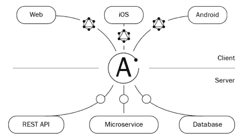

图 13.2：Apollo Server

Apollo Server 促进了您的应用程序或网站与相关数据库之间的有效通信。通过利用 GraphQL，它允许您的应用程序的前端部分在单个操作中从后端请求特定的数据，从而实现更快、更流畅的数据交换。本质上，它充当了用户界面和数据库之间的有效中介。

对于我们的设置，我们将使用 Express 来建立我们的 Apollo Server，并使用 Sequelize **对象关系映射器**（**ORM**）来处理我们的 PostgreSQL 数据库。由于 Express 与 Apollo 的无缝集成及其灵活性，它成为配置 Apollo Server 的流行选择，这为开发者提供了更大的自由度。Express.js 是一个轻量级且性能优化的框架，适用于从小型到大型和可扩展的各种规模的应用程序。此外，它的成熟度和广泛的社区支持使其成为一个可靠的选择。它的简单性，特别是对于那些已经熟悉 JavaScript 和 Node.js 的人来说，使得 Apollo Server 的设置快速而高效。因此，我们将首先导入必要的组件。

所需的文件可以在 `/backend/src/index.ts` 找到：

```js
import { makeExecutableSchema } from '@graphql-tools/schema'
import { ApolloServer } from '@apollo/server'
import { expressMiddleware } from '@apollo/server/express4'
import { ApolloServerPluginDrainHttpServer } from '@apollo/server/plugin/drainHttpServer'
import cors from 'cors'
import http from 'http'
import express from 'express'
import { applyMiddleware } from 'graphql-middleware'
import { json } from 'body-parser'
import { $server } from '../config'
import resolvers from './graphql/resolvers'
import typeDefs from './graphql/types'
import models from './models' 
```

首先，我们需要设置我们的 `Express.js 应用程序` 和 `cors`：

```js
const app = express()
const corsOptions = {
  origin: '*',
  credentials: true
}
app.use(cors(corsOptions))
app.use((req, res, next) => {
  res.header('Access-Control-Allow-Origin', '*')
  res.header(
    'Access-Control-Allow-Headers', 
    'Origin, X-Requested-With, Content-Type, Accept'
)
next()
}) 
```

然后，我们需要使用 `applyMiddleware` 和 `makeExecutableSchema` 通过传递 `typeDefs` 和 `resolvers` 来创建我们的模式：

```js
// Schema
const schema = applyMiddleware(
  makeExecutableSchema({
    typeDefs,
    resolvers
  })
) 
```

之后，我们需要创建一个 Apollo Server 的实例，其中我们需要传递模式和插件：

```js
// Apollo Server
const apolloServer = new ApolloServer({
  schema,
  plugins: [ApolloServerPluginDrainHttpServer({ httpServer })]
}) 
```

最后，我们需要同步 Sequelize。在这里，我们传递一些可选变量（`alter` 和 `force`）。如果 `force` 为真并且你更改了 Sequelize 模型，这将删除你的表，包括它们的值，并强制你再次创建表，而如果 `force` 为 `false` 且 `alter` 为 `true`，那么你将只更新表字段，而不会影响你的值。因此，你需要小心这个选项，因为你不小心可能会丢失所有数据。然后，在同步之后，我们必须运行我们的 Apollo Server，它监听端口 `4000`（**$server.port**）：

```js
const main = async () => {
  const alter = true
  const force = false
  await apolloServer.start()
  await models.sequelize.sync({ alter, force })
  app.use(
    '/graphql',
    cors<cors.CorsRequest>(),
    json(),
    expressMiddleware(apolloServer, {
      context: async () => ({ models })
    })
  )
  await new Promise<void>((resolve) => httpServer.listen({ 
    port: $server.port 
  }, resolve))
  console.log(`🚀 Server ready at http://localhost:${$server.port}/graphql`)
}
main() 
```

这个过程将帮助我们同步数据库与模型，确保对模型所做的任何修改都将自动更新相应的表。

# 定义我们的 GraphQL 类型、查询和变异

现在你已经创建了 Apollo Server 实例，下一步是创建你的 GraphQL 类型。在设置像 Apollo 这样的 GraphQL 服务器时，创建 GraphQL 类型至关重要。这些类型确保从你的 API 返回的数据是可靠的，并符合预期的结构。它们作为可用数据和其预期格式的有用参考。通过使用类型，你的应用程序可以精确地请求所需的数据，从而实现更快的执行和减少数据消耗。此外，类型有助于维护数据一致性，从而实现强大、易于理解且高效的 API。

## 标量类型

你需要做的第一件事是在 `/backend/src/graphql/types/Scalar.ts` 中定义你的标量类型：

```js
import gql from 'graphql-tag'
export default gql`
  scalar UUID
  scalar Datetime
  scalar JSON 
```

现在，让我们创建我们的 `User` 类型（`backend/src/graphql/types/User.ts`）：

```js
import gql from 'graphql-tag'
export default gql`
  type User {
  id: UUID!
  username: String!
  email: String!
  password: String!
  role: String!
  active: Boolean!
  createdAt: Datetime!
  updatedAt: Datetime!
}
` 
```

如你所见，我们使用了一些标量类型，如 **UUID** 和 **Datetime**，来定义 `User` 类型中的某些字段。在这种情况下，当你定义 GraphQL 中的类型时，你需要使用 `type` 关键字，后跟类型名称的首字母大写。然后，你可以在大括号 `{}` 内定义你的字段。

GraphQL 中有一些原始数据类型，例如 `String`、`Boolean`、`Float` 和 `Int`。你可以定义自定义标量类型，就像我们定义 **UUID**、**Datetime** 和 **JSON** 一样，你也可以定义自定义类型，例如 `User` 类型，并指定我们是否想要该类型的数组，例如 `[User]`。

类型后面的 `!` 字符表示字段不可为空。

## 查询

GraphQL 查询用于从数据存储中读取或获取值。现在你知道如何定义自定义类型，让我们定义我们的 `Query` 类型。在这里，我们将定义 `getUsers` 和 `getUser`。第一个将检索用户列表，而第二个将提供特定用户的详细信息：

```js
type Query {
  getUser(at: String!): User!
  getUsers: [User!]
} 
```

在这种情况下，我们的 `getUsers` 查询将返回用户数组（`[User!]`），而我们的 `getUser` 查询，它需要 `at`（访问令牌）属性，将返回单个 `User!`。记住，对于你添加的任何查询，你都需要在后面的 `resolvers` 中定义它（我们将在下一节中这样做）。

## 变异

突变用于写入或发布值：也就是说，修改数据存储中的数据，如果你想要与 `REST` 进行一些比较，例如执行任何 `POST`、`PUT`、`PATCH` 或 `DELETE` 操作，你可以返回一个值。`Mutation` 类型与 `Query` 类型的工作方式完全相同，你需要定义你的突变并指定你将接收什么参数以及返回什么数据：

```js
type Mutation {
  createUser(input: CreateUserInput): User!
  login(input: LoginInput): Token!
} 
```

如你所见，我们定义了两个突变。第一个是 **createUser**，用于在我们的数据存储中注册或创建新用户，而第二个是执行 **登录**。正如你可能已经注意到的，它们都接收带有不同值的输入参数（`CreateUserInput` 和 `LoginInput`），称为 **输入类型**，这些类型用作查询或突变的参数。最后，它们将分别返回 `User!` 和 `Token!` 类型。让我们学习如何定义这些输入：

```js
type Token {
 token: String!
}
input CreateUserInput {
 username: String!
 password: String!
 email: String!
 active: Boolean!
 role: String!
}
input LoginInput {
 emailOrUsername: String!
 password: String!
} 
```

输入通常与突变一起使用，但你也可以将它们与查询一起使用。

## 合并类型定义

现在我们已经定义了所有我们的类型、查询和突变，我们需要合并所有我们的 GraphQL 文件来创建我们的 GraphQL 模式，这基本上是一个包含所有我们的 GraphQL 定义的大文件。

为了做到这一点，你需要创建一个名为 `/backend/src/graphql/types/index.ts` 的文件，其中包含以下代码：

```js
import { mergeTypeDefs } from '@graphql-tools/merge'
import Scalar from './Scalar'
import User from './User'
export default mergeTypeDefs([Scalar, User]) 
```

在成功将你的类型定义合并到一个综合的 GraphQL 模式后，下一个关键步骤是创建解析器。解析器是负责从你的 GraphQL 模式中定义的字段获取和生成数据的函数。

# 创建我们的解析器

解析器是一个负责为你的 GraphQL 模式中的字段生成数据的函数。它通常可以以任何你想要的方式生成数据，因为它可以从数据库中获取数据或使用第三方 API。

要创建我们的用户解析器，你需要创建一个名为 `/backend/src/graphql/resolvers/user.ts` 的文件。让我们创建我们的解析器应该看起来像的框架。在这里，我们需要指定在 GraphQL 模式中的 **Query** 和 **Mutation** 下定义的函数。所以，你的解析器应该看起来像这样：

```js
export default {
  Query: {
    getUsers: () => {},
    getUser: () => {}
  },
  Mutation: {
    createUser: () => {},
    login: () => {}
  }
} 
```

如你所见，我们返回一个包含两个主要节点 **Query** 和 **Mutation** 的对象，并将我们在 GraphQL 模式中定义的查询和突变映射（`User.ts` 文件）。当然，我们需要做一些更改以接收一些参数并返回一些数据，但我首先想向你展示解析器文件的基本框架。

你需要做的第一件事是在文件中添加一些导入：

```js
import { doLogin, getUserBy } from '../../lib/auth'
import { getUserData } from '../../lib/jwt'
import { ICreateUserInput, IloginInput, Imodels, Itoken, Iuser } from '../../types' 
```

我们将在下一节创建 **getUsers** 和 **getUser** 函数。

## 创建 getUsers 查询

我们的第一种方法将是 **getUsers** 查询。让我们看看我们需要如何定义它：

```js
getUsers: (
_: any, 
args: any, 
ctx: { models: Imodels }
): Iuser[] => ctx.models.User.findAll(), 
```

在任何查询或突变方法中，我们总是接收四个参数：父节点（定义为 `_`），参数（定义为 `args`），上下文（定义为 `ctx`），和信息（这是可选的）。

如果您想稍微简化一下代码，可以像这样解构上下文：

```js
getUsers: (
_: any, 
args: any, 
{ models }: { models: Imodels }
): Iuser[] => ctx.models.User.findAll(), 
```

在我们的下一个解析器函数中，我们也将解构我们的参数。提醒一下，上下文是在我们的 Apollo Server 设置中传递的（我们之前这样做过）：

```js
// Apollo Server
const apolloServer = new ApolloServer({
schema,
context: async () => ({
models
})
}) 
```

当我们需要在解析器中全局共享某些内容时，上下文非常重要。

## 创建 getUser 查询

这个函数需要是`async`的，因为我们需要执行一些异步操作，例如，如果用户已经有一个有效的会话，通过`at`（访问令牌）获取已连接的用户。然后，我们可以通过查看我们的数据库来验证这确实是一个真实用户。这有助于阻止人们修改 cookies 或尝试进行某种形式的注入。如果我们找不到已连接的用户，则返回一个包含空数据的用户对象：

```js
getUser: async (
_: any, 
{ at }: { at: string }, 
{ models }: { models: IModels }
): Promise<any> => {
// Get current connected user
const connectedUser = await getUserData(at)
if (connectedUser) {
// Validating if the user is still valid
const user = await getUserBy({
id: connectedUser.id,
email: connectedUser.email,
active: connectedUser.active
},
[connectedUser.role],
models
)

if (user) {
return connectedUser
}
}
return {
id: '',
username: '',
password: '',
email: '',
role: '',
active: false
}
} 
```

## 创建突变

我们的突变非常简单：我们只需要执行一些函数，并通过展开输入值（这来自我们的 GraphQL 模式）传递所有参数。让我们看看我们的`Mutation`节点应该是什么样子：

```js
Mutation: {
createUser: (
_: any,
{ input }: { input: ICreateUserInput },
{ models }: { models: IModels }
): IUser => models.User.create({ ...input }),
login: (
_: any,
{ input }: { input: ILoginInput },
{ models }: { models: IModels }
): Promise<IToken> => doLogin(input.email, input.password, models)
} 
```

您需要将**电子邮件**、**密码**和**模型**传递给`doLogin`函数。

## 合并我们的解析器

就像我们对`types`定义所做的那样，我们需要使用`@graphql-tools`包合并所有我们的解析器。您需要在`/backend/src/graphql/resolvers/index.ts`创建以下文件：

```js
import { mergeResolvers } from '@graphql-tools/merge'
import user from './user'
const resolvers = mergeResolvers([user])
export default resolvers 
```

这将把所有您的解析器组合成一个解析器数组。

一旦您的解析器合并，将所有您的数据获取函数整合到一个连贯的结构中，就到了下一个阶段：创建 Sequelize 模型。Sequelize 是一个强大的工具，它简化了您的应用程序与各种数据库之间的交互，将复杂的 SQL 命令转换为用户友好的 JavaScript。

# 使用 Sequelize ORM

Sequelize 是 Node.js 的一个流行的 ORM 库。它使开发者能够通过将底层的 SQL 命令抽象为高级、易于使用的 JavaScript 对象和方法，与 MySQL、PostgreSQL、SQLite 和 Microsoft SQL Server 等数据库进行交互。

使用 Sequelize，开发者可以执行创建、更新、删除和查询记录等数据库操作，而无需编写原始 SQL 查询。Sequelize 还帮助定义数据模型、管理表之间的关系以及处理数据库迁移。

Sequelize ORM 的一些关键特性包括：

+   **模型定义**：Sequelize 允许您定义具有其属性、数据类型和约束的模型，这些映射到底层数据库中的表。

+   **关联**：您可以轻松定义模型之间的关系，例如一对一、一对多和多对多，这些映射到数据库中的外键约束。

+   **查询**：Sequelize 提供了一个强大的查询系统，允许您在不编写原始 SQL 的情况下获取、过滤、排序和分页数据。

+   **事务**：它支持执行多个数据库操作的事务。

+   **迁移**: Sequelize 提供了一个迁移系统来管理随时间变化的模式更改，并确保您的数据库模式与应用程序代码保持同步。

## 在 Sequelize 中创建用户模型

在我们深入研究身份验证函数之前，我们需要在 Sequelize 中创建我们的 `User` 模型。为此，我们需要在 `/backend/src/models/User.ts` 创建一个文件。我们的模型将包含以下字段：

+   `id`

+   `username`

+   `password`

+   `email`

+   `role`

+   `active`

让我们看看代码：

```js
import { encrypt } from '@contentpi/lib'
import { IDataTypes, IUser } from '../types'
export default (sequelize: any, DataTypes: IDataTypes): IUser => {
const User = sequelize.define('User', {
id: {
primaryKey: true,
allowNull: false,
type: DataTypes.UUID,
defaultValue: DataTypes.UUIDV4()
},
username: {
type: DataTypes.STRING,
allowNull: false,
unique: true,
validate: {
isAlphanumeric: {
args: true,
msg: 'The user just accepts alphanumeric characters'
},
len: {
args: [4, 20],
msg: 'The username must be from 4 to 20 characters'
}
}
},
password: {
type: Datatypes.STRING,
allowNull: false
},
email: {
type: DataTypes.STRING,
allowNull: false,
unique: true,
validate: {
isEmail: {
args: true,
msg: 'Invalid email'
}
}
},
role: {
type: DataTypes.STRING,
allowNull: false,
defaultValue: 'user'
},
active: {
type: DataTypes.BOOLEAN,
allowNull: false,
defaultValue: false
}
},
{
hooks: {
beforeCreate: (user: IUser): void => {
user.password = encrypt(user.password)
}
}
}
)
return User
} 
```

如您所见，我们正在定义一个名为 `beforeCreate` 的 Sequelize 钩子，它在我们保存数据之前帮助我们将用户密码**加密**（使用 **sha1**）。最后，我们返回 `User` 模型。

## 将 Sequelize 连接到 PostgreSQL 数据库

现在我们已经创建了用户模型，我们需要将 Sequelize 连接到我们的 PostgreSQL 数据库并将所有模型组合在一起。

您需要将以下代码添加到 `/backend/src/models/index.ts` 文件中：

```js
import { Sequelize } from 'sequelize'
import { $db } from '../../config'
import { IModels } from '../types'
// Db Connection
const { dialect, port, host, database, username, password } = $db
// Connecting to the database
const uri = `${dialect}://${username}:${password}@${host}:${port}/${database}`
const sequelize = new Sequelize(uri)
// Models
const models: IModels = {
User: require('./User').default(sequelize, Sequelize),
sequelize
}
export default models 
```

# 身份验证函数

一步一步地，我们将所有拼图碎片拼在一起。现在，让我们看看我们将使用的身份验证函数，以验证用户是否已连接以及获取用户数据。为此，我们需要使用 JWT。

JWT 是在 RFC 7519 中概述的开放标准（[`tools.ietf.org/html/rfc7519`](https://tools.ietf.org/html/rfc7519)）。它作为在各方之间作为 JSON 对象传输信息的宝贵工具。JWT 的一个主要优点是其数字签名，这使得它们可以轻松验证和信任。令牌使用 HMAC 算法和秘密或公钥对（使用 RSA 或 ECDSA）进行签名，确保其安全且防篡改。这使得 JWT 成为各种应用程序中身份验证和授权的可靠选择。

## 创建 JWT 函数

让我们创建一些函数来帮助验证 JWT 并获取用户数据。为此，我们需要在 `/backend/src/lib/jwt.ts` 创建文件：

```js
import { encrypt, getBase64, setBase64 } from '@contentpi/lib'
import jwt from 'jsonwebtoken'
import { $security } from '../../config'
import { IUser } from '../types'
const { secretKey } = $security
export function jwtVerify(accessToken: string, cb: any): void {
// Verifiying our JWT token using the accessToken and the secretKey
jwt.verify(accessToken, secretKey, (error: any, accessTokenData: any = {}) => {
const { data: user } = accessTokenData
// If we get an error or the user is not found we return false
if (error || !user) {
return cb(false)
}
// The user data is on base64 and getBase64 will retreive the
// information as JSON object
const userData = getBase64(user)
return cb(userData)
})
}
export async function getUserData(accessToken: string): Promise<any> {
// We resolve the jwtVerify promise to get the user data
const UserPromise = new Promise((resolve) => jwtVerify(accessToken, (user: any) => resolve(user)))
// This will get the user data or false (if the user is not connected)
const user = await UserPromise
return user
}
export const createToken = async (user: IUser): Promise<string[]> => {
// Extracting the user data
const { id, username, password, email, role, active } = user
// Encrypting our password by combining the secretKey and the password
// and converting it to base64
const token = setBase64(`${encrypt($security.secretKey)}${password}`)
// The "token" is an alias for password in this case
const userData = {
id,
username,
email,
role,
active,
token
}
// We sign our JWT token and we save the data as Base64
const _createToken = jwt.sign({ data: setBase64(userData) }, $security.secretKey, {
expiresIn: $security.expiresIn
})
return Promise.all([_createToken])
} 
```

如您所见，`jwt.sign` 用于创建新的 JWT，而 `jwt.verify` 用于验证我们的 JWT。

## 创建身份验证函数

现在我们已经创建了 JWT 函数，我们需要创建一些函数来帮助我们登录到 `/backend/src/lib/auth.ts`：

```js
import { encrypt, isPasswordMatch } from '@contentpi/lib'
import { IToken, IModels, IUser } from '../types'
import { createToken } from './jwt'
export const getUserBy = async (where: any, models: IModels): Promise<IUser> => { 
```

我们通过 `WHERE` 条件查找用户：

```js
const user = await models.User.findOne({
where,
raw: true
})
return user
}
export const doLogin = async (
email: string,
password: string,
models: IModels
): Promise<IToken> => { 
```

通过电子邮件查找用户：

```js
const user = await getUserBy({ email }, models) 
```

如果用户不存在，我们返回 `Invalid Login`：

```js
if (!user) {
  throw new Error('Invalid Login')
} 
```

我们验证我们的加密密码是否与 `user.password` 的值相同：

```js
const passwordMatch = isPasswordMatch(encrypt(password), user.password) 
```

我们验证用户是否处于活动状态：

```js
const isActive = user.active 
```

如果密码不匹配，我们返回 `Invalid Login`：

```js
if (!passwordMatch) {
  throw new Error('Invalid Login')
} 
```

如果账户未处于活动状态，我们返回一个错误：

```js
if (!isActive) {
  throw new Error('Your account is not activated yet')
} 
```

如果用户存在，密码正确且账户处于活动状态，则我们创建 JWT：

```js
const [token] = await createToken(user)
// Finally we return the token to Graphql
return {
  token
}
} 
```

在这里，我们通过电子邮件验证用户是否存在，密码是否正确，以及账户是否处于活动状态，以便创建 JWT。

## 定义类型和接口

最后，我们需要为所有我们的 Sequelize 模型和 GraphQL 输入定义我们的类型和接口。为此，您需要在 `/backend/src/types/types.ts` 中创建一个文件：

```js
export type User = {
  username: string
  password: string
  email: string
  role: string
  active: boolean
}
export type Sequelize = {
  _defaults?: any
  name?: string
  options?: any
  associate?: any
} 
```

现在，让我们在 `/backend/src/types/interfaces.ts` 中创建我们的接口：

```js
import { Sequelize, User } from './types'
export interface IDataTypes {
UUID: string
UUIDV4(): string
STRING: string
BOOLEAN: boolean
TEXT: string
INTEGER: number
DATE: string
FLOAT: number
}
export interface IUser extends User, Sequelize {
id: string
token?: string
createdAt?: Date
updatedAt?: Date
}
export interface ICreateUserInput extends User {}
export interface ILoginInput {
email: string
password: string
}
export interface IToken {
token: string
}
export interface IModels {
User: any
sequelize: any
} 
```

最后，我们需要导出 `/backend/src/types/index.ts` 中的两个文件：

```js
export * from './interfaces'
export * from './types' 
```

当您需要添加更多模型时，请记住始终将这些类型和接口添加到这些文件中。

最后，您需要在 `root` 目录中创建您的 `tsconfig.json` 文件：

```js
{
  "compilerOptions": {
    "baseUrl": "./src",
    "esModuleInterop": true,
    "module": "commonjs",
    "noImplicitAny": true,
    "outDir": "dist",
    "resolveJsonModule": true,
    "sourceMap": true,
    "target": "ESNext",
    "typeRoots": ["./src/@types", "./node_modules/@types"]
  },
  "include": ["src/**/*.ts"],
  "exclude": ["node_modules"]
} 
```

在下一节中，我们将运行我们的项目并创建我们的表。

# 第一次运行我们的项目

接下来，我们将第一次启动我们的项目。如果我们一切都做得正确，我们将看到我们的 `Users` 表正在设置，我们的 Apollo 服务器将开始运行。

在这部分，我们将介绍如何启动我们的项目。之后，我们将探索如何使用我们的 GraphQL API。我们将学习关于测试查询的知识，这些查询允许我们检索数据，以及突变，它使我们能够修改数据。我们还将讨论验证，这是确保我们数据正确性的检查。最后，我们将深入了解用户登录的过程。让我们开始吧！

如果您正确地遵循了前面的部分并运行了 `npm run dev` 命令，您应该能够看到 `Users` 表已创建，并且 Apollo 服务器正在端口 `4000` 上运行：


图 13.3：第一次运行我们的项目

现在，假设您想修改您的用户模型并将 `"username"` 字段更改为 `"username2"`。让我们看看会发生什么：

```js
[INFO] 23:45:16 Restarting: /Users/czantany/projects/React-Design-Patterns-and-Best-Practices-Third-Edition/Chapter05/graphql/backend/src/models/User.ts has been modified
Executing (default): CREATE TABLE IF NOT EXISTS "Users" ("id" UUID NOT NULL , "username2" VARCHAR(255) NOT NULL UNIQUE, "password" VARCHAR(255) NOT NULL, "email" VARCHAR(255) NOT NULL UNIQUE, "privilege" VARCHAR(255) NOT NULL DEFAULT 'user', "active" BOOLEAN NOT NULL DEFAULT false, "createdAt" TIMESTAMP WITH TIME ZONE NOT NULL, "updatedAt" TIMESTAMP WITH TIME ZONE NOT NULL, PRIMARY KEY ("id"));
Executing (default): ALTER TABLE "public"."Users" ADD COLUMN "username2" VARCHAR(255) NOT NULL UNIQUE;
Executing (default): ALTER TABLE "Users" ALTER COLUMN "password" SET NOT NULL;ALTER TABLE "Users" ALTER COLUMN "password" DROP DEFAULT;ALTER TABLE "Users" ALTER COLUMN "password" TYPE VARCHAR(255);
Executing (default): ALTER TABLE "Users" ALTER COLUMN "email" SET NOT NULL;ALTER TABLE "Users" ALTER COLUMN "email" DROP DEFAULT;ALTER TABLE "Users" ADD UNIQUE ("email");ALTER TABLE "Users" ALTER COLUMN "email" TYPE VARCHAR(255) ;
Executing (default): ALTER TABLE "Users" ALTER COLUMN "privilege" SET NOT NULL;ALTER TABLE "Users" ALTER COLUMN "privilege" SET DEFAULT 'user';ALTER TABLE "Users" ALTER COLUMN "privilege" TYPE VARCHAR(255);
Executing (default): ALTER TABLE "Users" ALTER COLUMN "active" SET NOT NULL;ALTER TABLE "Users" ALTER COLUMN "active" SET DEFAULT false;ALTER TABLE "Users" ALTER COLUMN "active" TYPE BOOLEAN;
Executing (default): ALTER TABLE "Users" ALTER COLUMN "createdAt" SET NOT NULL;ALTER TABLE "Users" ALTER COLUMN "createdAt" DROP DEFAULT;ALTER TABLE "Users" ALTER COLUMN "createdAt" TYPE TIMESTAMP WITH TIME ZONE;
Running on http://localhost:4000/graphql 
```

这将执行以下 SQL 查询：

```js
Executing (default): ALTER TABLE "public"."Users" ADD COLUMN "username2" VARCHAR(255) NOT NULL UNIQUE;
Executing (default): ALTER TABLE "public"."Users" DROP COLUMN "username"; 
```

现在，假设您将 `index.ts` 文件中的 `force` 常量更改为 `true`。以下将发生：

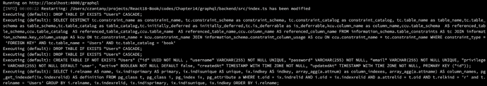

图 13.4：DROP TABLE IF EXISTS

如您所见，如果 `force` 为 `true`，它将执行 `DROP TABLE IF EXISTS "Users" CASCADE;`。这将完全删除您的表和值，然后从头开始重新创建您的表。这就是为什么您在使用 `force` 选项时需要小心。

在这一点上，如果您打开 [`localhost:4000/graphql`](http://localhost:4000/graphql)，您应该能够看到您的新 GraphQL 探索器：

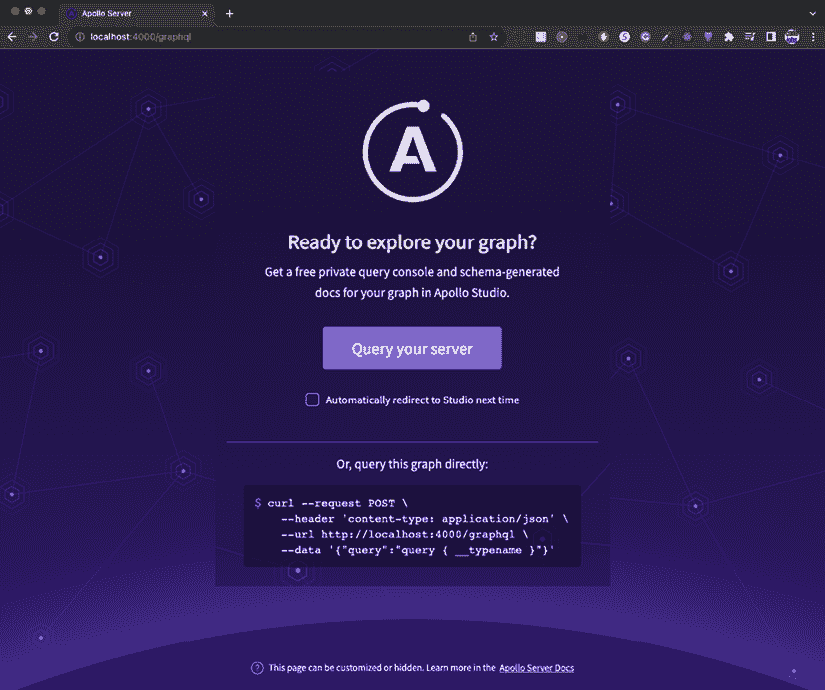

图 13.5：GraphQL 探索器

点击**查询您的服务器**按钮，然后我们就可以开始测试我们的查询和突变了。

## 测试 GraphQL 查询和突变

太好了！在这个时候，您已经非常接近执行您的第一个 GraphQL 查询和突变了。我们将执行的第一个查询将是 `getUsers`。以下运行查询的正确语法：

```js
query {
getUsers {
id
username
email
role
}
} 
```

当你没有属性要传递给查询时，你只需要在 `query {...}` 块下指定查询的名称，然后在你执行查询后指定你想要检索的字段。在这种情况下，我们想要检索 `id`、`username`、`email` 和 `role` 字段。

如果你运行这个查询，你可能会得到一个空的数据数组。这是因为我们还没有注册任何用户：

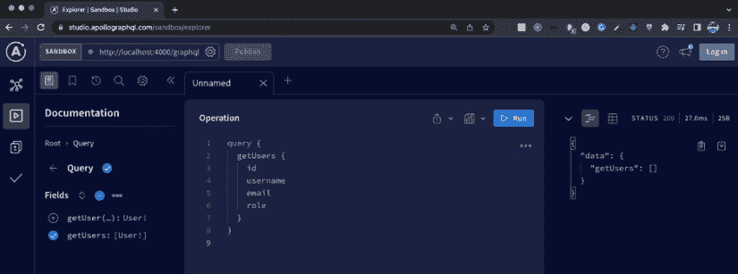

图 13.6：getUsers 查询

这意味着我们需要执行我们的 `createUser 变异` 来注册我们的第一个用户。我喜欢 GraphQL Explorer 的一个地方是，你可以在左侧的 **Schema** 图标中找到所有的模式文档。如果你点击 **Schema** 图标，你会看到所有你的查询和变异列出来。

让我们点击那里并选择我们的 `createUser 变异` 来查看需要调用什么以及可能返回什么数据：

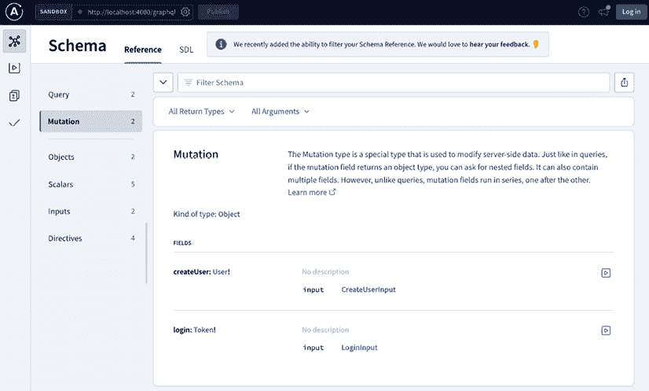

图 13.7：模式

如你所见，`createUser 变异`需要一个 `input` 参数，它是 `CreateUserInput`。让我们点击那个输入：

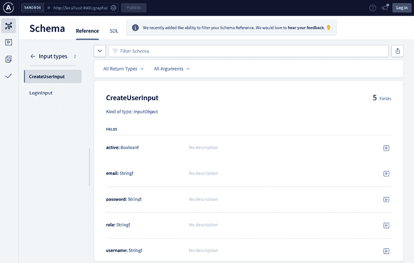

图 13.8：CreateUserInput

太棒了！现在，我们知道我们需要传递 **username**、**password**、**email**、**role** 和 **active** 字段来创建一个新用户。让我们这么做吧！

创建一个新标签页，这样你就不会丢失第一个查询的代码，然后编写变异：

```js
mutation($input: CreateUserInput) {
  createUser(input: $input) {
    id
    username
    email
    role
    active
  }
} 
```

如你所见，你的变异需要在 `mutation {...}` 块下编写，你必须将 `input` 参数作为一个对象在 **Variables** 部分传递。最后，一旦变异正确执行，你必须指定你想要检索的字段。如果一切正常，你应该看到类似这样的内容：

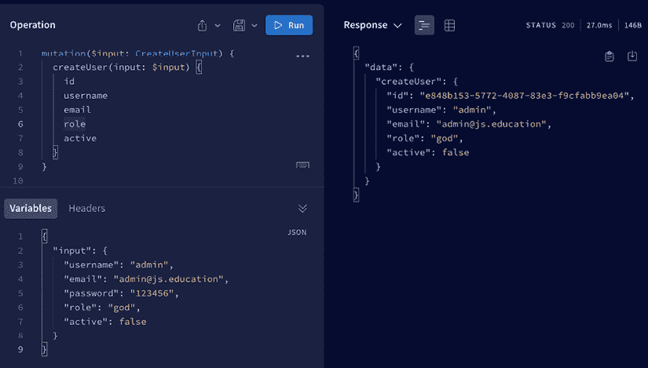

图 13.9：CreateUser 变异

如果你好奇并想看看你运行 Apollo Server 的终端，你会看到为这个用户执行的 SQL 查询：

```js
INSERT INTO "Users" ("id","username","password","email","role","active","createdAt","updatedAt") VALUES ($1,$2,$3,$4,$5,$6,$7,$8) 
```

`VALUES` 变量由 Apollo Server 处理，所以你不会在那里看到实际的值，但你可以找出正在数据库中执行的操作。

现在，回到你的第一个查询（`getUsers`）并再次运行它！

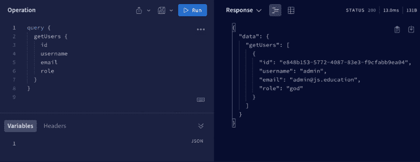

图 13.10：getUsers 查询

很好：这是你在 GraphQL 中正确执行的第一个查询和变异。如果你想在你数据库中看到这些数据，你可以使用 OmniDB 或 PgAdmin4 来查看你的 PostgreSQL 数据库中的 `Users` 表：

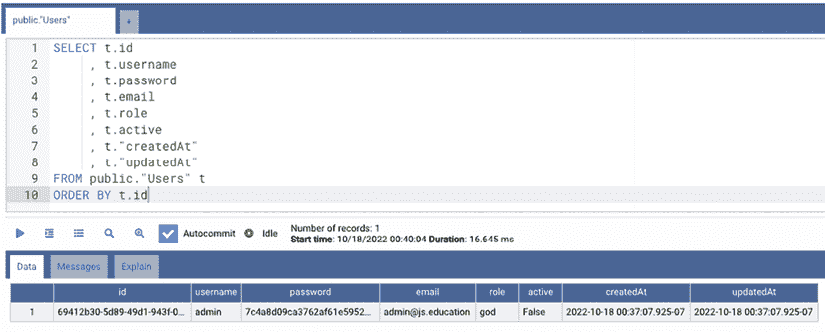

图 13.11：数据库查询

如你所见，我们的第一条记录有自己的 `id` 字段（UUID）以及一个加密的密码字段（记得我们在用户模型中的 `beforeCreate` 钩子吗？）。默认情况下，Sequelize 将创建 `createdAt` 和 `updatedAt` 字段。

## 测试模型验证和查询用户

如你所回忆的，关于我们的用户模型，你想要确保我们做的所有验证都正常工作，比如用户是否唯一，或者他们的电子邮件是否有效且唯一。你只需要再次执行完全相同的突变：

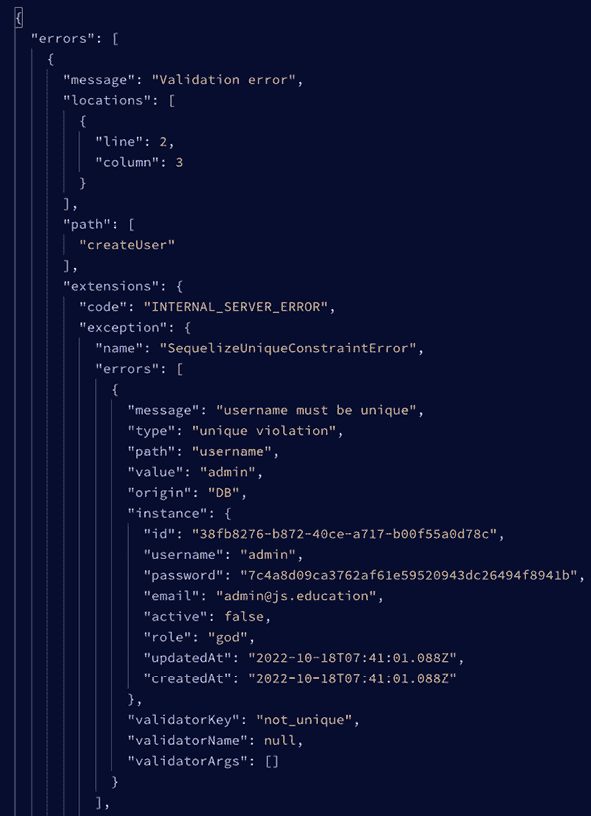

图 13.12：用户名必须唯一

如你所见，我们会得到一个“**用户名必须唯一**”的错误信息，因为我们已经注册了“admin”用户名。现在，让我们尝试将用户名更改为“**admin2**”，但保持电子邮件不变（**admin@js.education**）：

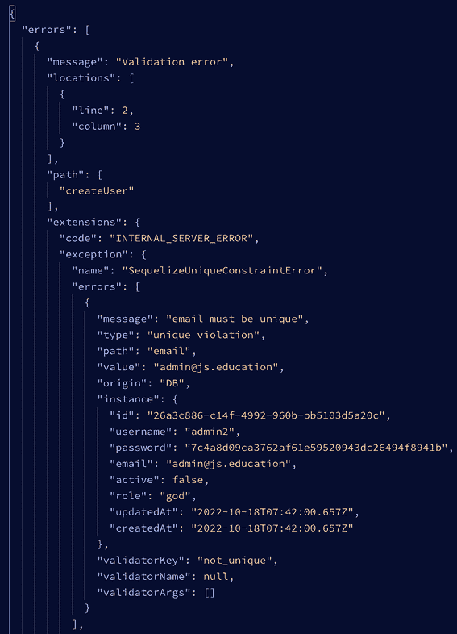

图 13.13：电子邮件必须唯一

我们还会得到一个“**电子邮件必须唯一**”的错误。现在，尝试将电子邮件更改为无效的地址，例如 **admin@myfakedomain**：


图 13.14：无效的电子邮件

现在，我们得到了一个“`Invalid email`”错误信息。这真是太神奇了，不是吗？现在，让我们停止玩验证，并添加一个新有效用户（**用户名**：admin2 和 **电子邮件**：admin2@js.education）。一旦你创建了第二个用户，再次运行我们的 **getUsers** 查询。然而，这次，将 `active` 字段添加到我们想要返回的字段列表中：

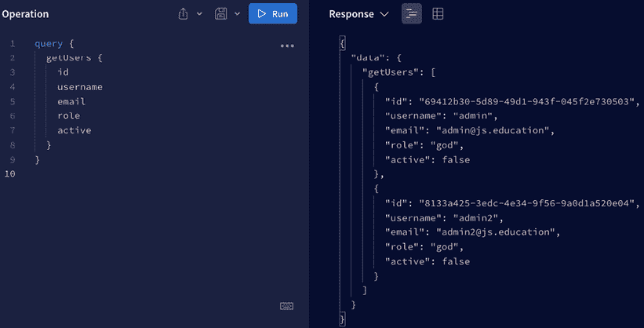

图 13.15：getUsers 查询

现在，我们有两个注册用户，并且这两个都是非活动账户（`"active" = false`）。

我喜欢 GraphQL 的一个地方是，当你编写查询或突变，并且你不记得某个字段时，GraphQL 总会显示该查询或突变可用的字段列表。例如，如果你只写密码的字母 `p`，你会看到类似这样的内容：

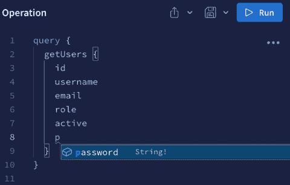

图 13.16：自动完成

现在，我们准备尝试登录！

## 执行登录

我想恭喜你来到这本书的这一部分：我知道我们已经覆盖了很多内容，但我们几乎要完成了！现在，我们将尝试使用 GraphQL 登录（这有多疯狂？）。

首先，我们需要编写我们的登录突变：

```js
mutation($input: LoginInput) {
  login(input: $input) {
    token
  }
} 
```

然后，我们需要使用“`fake@email.com`”作为我们的电子邮件地址和“`123456`”作为我们的密码来登录我们的用户。这些信息在我们的数据库中不存在：

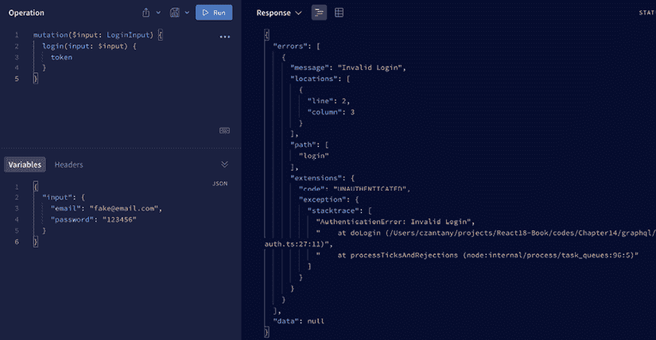

图 13.17：使用不存在的登录详情后的无效登录

因为邮箱在我们的数据库中不存在，所以会返回一个`无效登录`错误信息。现在，让我们添加正确的邮箱，但使用一个假的密码：


图 13.18：输入正确的邮箱但使用假密码后的无效登录

如您所见，我们收到了完全相同的错误（`无效登录`）。这是因为我们不希望提供太多关于登录错误的详细信息，因为有人可能正在尝试入侵您的系统。如果我们说像“密码无效”或“您的邮箱不在我们的系统中”这样的话，我们就会给攻击者提供可能对他们有用的额外信息。

现在，让我们尝试使用正确的用户名和密码（`admin@js.education`和`123456`）进行连接，看看会发生什么：

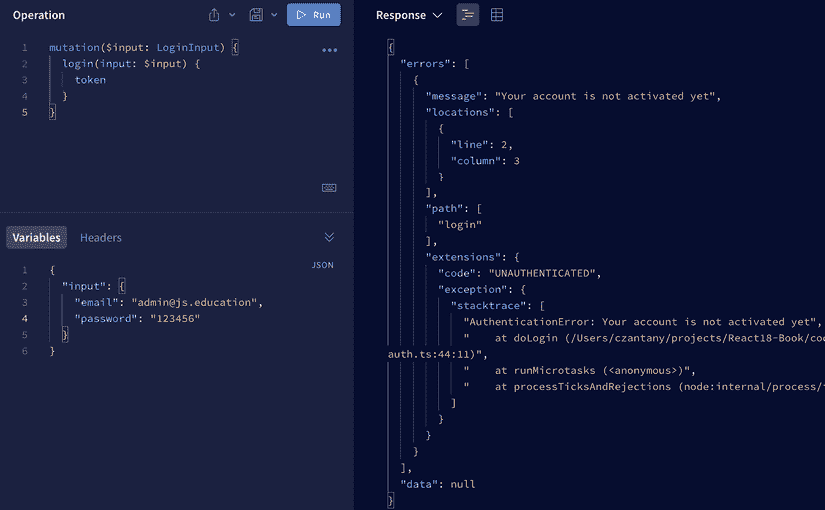

图 13.19：您的账户尚未激活

现在，我们收到一个错误信息，显示“您的账户尚未激活”。这是正常的，因为我们的用户尚未激活。通常情况下，当用户在一个系统中注册时，你需要发送一个链接到他们的邮箱，以便他们可以激活他们的账户。我们目前没有这个功能，但假设我们已经发送了那封邮件，并且用户已经激活了他们的账户。我们可以通过使用 OnmiDB 或 PgAdmin4 手动更改数据库中的值来模拟这种情况。

我们可以通过执行一个`UPDATE` SQL 查询来完成这个操作：

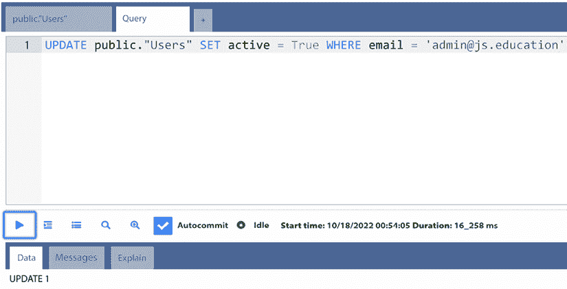

图 13.20：UPDATE SQL 查询

现在，让我们再次尝试登录！

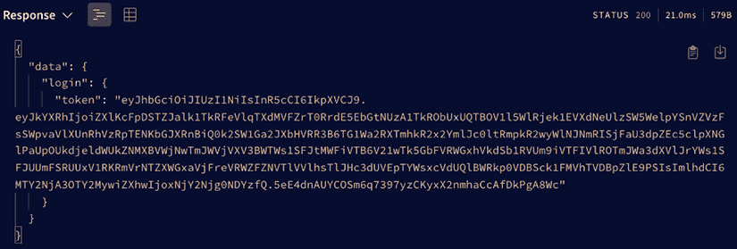

图 13.21：登录令牌

好的：我们进去了，宝贝！这是你现在的情况：


图 13.22：匿名

现在我们已经登录并获取了我们的 JWT，让我们复制那个长字符串，并在我们的**getUser**查询中使用它，看看我们是否能获取用户的数据：

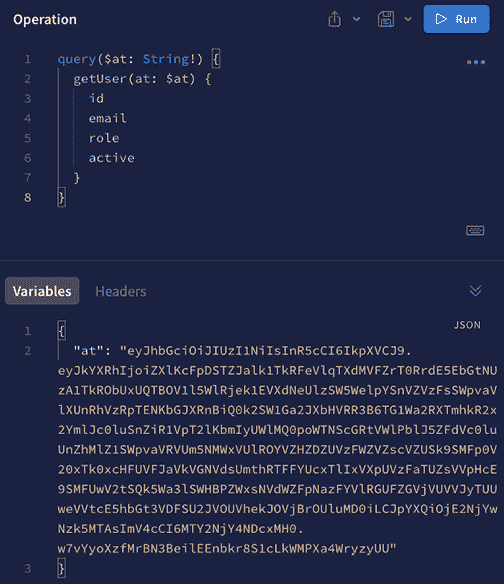

图 13.23：访问令牌

如果一切顺利，你应该能获取到用户的数据：

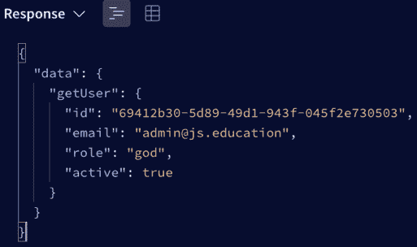

图 13.24：getUser 数据

如果你更改或删除字符串中的任何字母（意味着令牌无效），你应该会得到空的用户数据：

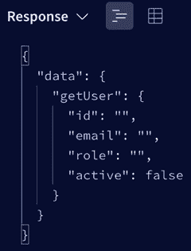

图 13.25：空的 getUser 数据

现在我们后端的登录系统运行得非常完美，是时候在前端应用程序中实现这个功能了。我们将在下一节中这样做。

# 使用 Apollo Client 构建前端登录系统

在上一节中，我们学习了如何使用 Apollo Server 创建我们的 GraphQL 查询和突变来构建登录系统的后端。你可能正在想，“太好了，后端已经工作，但我如何在前端使用它？” 你是对的：我总是喜欢用完整的示例来解释事物，而不仅仅是展示基本的东西，即使这会花费更长的时间。那么，让我们开始吧！

你可以在这个部分的代码示例在 [`github.com/PacktPublishing/React-18-Design-Patterns-and-Best-Practices-Fourth-Edition/tree/main/Chapter13/graphql/frontend`](https://github.com/PacktPublishing/React-18-Design-Patterns-and-Best-Practices-Fourth-Edition/tree/main/Chapter13/graphql/frontend) 找到。

## 配置 Webpack 5

我们将不使用 **vite** 项目，而是从头开始配置一个使用 Webpack 5 和 Node.js 的 React 项目。

我们需要做的第一件事是创建前端目录并安装所有包。为此，我们将执行以下命令：

```js
npm init --yes
npm install @apollo/client@3.7.0 @contentpi/lib@1.0.10 cookie-parser@1.4.6 cors@2.8.5 dotenv-webpack@8.0.1 express@4.18.2 jsonwebtoken@8.5.1 pm2@5.2.2 react@18.2.0 react-dom@18.2.0 react-cookie@4.1.1 react-router-dom@6.4.2 run-script-webpack-plugin@0.1.1 styled-components@5.3.6 typescript-plugin-styled-components@2.0.0 webpack-node-externals@3.0.0
npm install --save-dev @babel/core@7.19.3 @babel/preset-env@7.19.4 @babel/preset-react@7.18.6 @types/node@18.11.3 buffer@6.0.3 cross-env@7.0.3 crypto-browserify@3.12.0 dotenv@16.0.3 html-webpack-plugin@5.5.0 npm-run-all@4.1.5 prettier@2.7.1 stream-browserify@3.0.0 ts-loader@9.4.1 ts-node@10.9.1 ts-node-dev@2.0.0 typescript@4.8.4 webpack@5.74.0 webpack-cli@4.10.0 webpack-dev-server@4.11.1 webpackbar@5.0.2 
```

`buffer`、`crypto-browserify` 和 `stream-browserify` 是在 Webpack 4 及之前版本中默认包含的 polyfills。然而，在最新版本（Webpack 5）中，这些 polyfills 已不再包含，因此你将遇到以下错误：

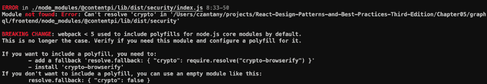

图 13.26：Webpack < 5 默认包含 Node.js 核心模块的 polyfills

你需要在你的 `package.json` 中包含以下脚本：

```js
"scripts": {
  "build": "npm-run-all clean build:production:*",
  "build:production:client": "webpack --env mode=production --env presets=client",
  "build:production:server": "webpack --env mode=production --env presets=server",
  "clean": "rm -rf dist",
  "dev": "cross-env DEBUG=server:* npm-run-all clean serve:dev",
  "analyze": "cross-env ANALYZE=true cross-env DEBUG=server:* npm-run-all clean serve:*",
  "start": "pm2 start apps.json",
  "stop": "pm2 stop apps.json",
  "restart": "pm2 restart apps.json",
  "serve:dev": "cross-env NODE_ENV=development ts-node ./src/server/devServer.ts",
  "webpack": "cross-env NODE_ENV=production webpack",
  "lint": "eslint . --ext .js,.tsx,.ts",
  "lint:fix": "eslint . --fix --ext .js,.tsx,.ts",
  "test": "jest src",
  "test:coverage": "jest src --coverage"
} 
```

我喜欢将我的 Webpack 配置拆分为单独的文件，以便更容易地识别客户端、服务器、开发环境和生产环境的配置。首先，让我们在 `/frontend/webpack/presets` 下创建我们的 `presets` 目录，然后创建我们的 `webpack.client.ts` 以指定客户端配置：

```js
import HtmlWebpackPlugin from 'html-webpack-plugin'
import { Configuration } from 'webpack'
import { BundleAnalyzerPlugin } from 'webpack-bundle-analyzer'
import WebpackBar from 'webpackbar'
const isAnalyze = Boolean(process.env.ANALYZE) // This is to analyze the bundles sizes
const webpackClientConfig: (args: { mode: string }) => Configuration = ({ mode }) => {
const isProductionMode = mode === 'production'
const title = 'My Website Title'
const webpackConfig: Configuration = {
entry: {
main: './src/client/index.tsx' // Entry for the client app
},
output: {
publicPath: 'http://localhost:3001/' // This is for webpack-dev-server
},
plugins: [
new HtmlWebpackPlugin({
title,
template: './src/client/index.xhtml',
filename: './index.xhtml'
}),
new WebpackBar({
name: 'client',
color: '#2EA1F8'
})
]
}
if (isProductionMode) {
webpackConfig.output = {
filename: '[name].js',
chunkFilename: '[name].js',
publicPath: '/'
}
}
if (isAnalyze) {
webpackConfig.plugins = [
...(webpackConfig.plugins || []),
new BundleAnalyzerPlugin({
analyzerPort: 9001
})
]
}
return webpackConfig
}
export default webpackClientConfig 
```

这就是我们的客户端预设；现在让我们在 `/frontend/webpack/presets/webpack.server.ts` 下创建服务器预设：

```js
import { resolve } from 'path'
import { RunScriptWebpackPlugin } from 'run-script-webpack-plugin'
import { Configuration, IgnorePlugin, optimize } from 'webpack'
import { BundleAnalyzerPlugin } from 'webpack-bundle-analyzer'
import nodeExternals from 'webpack-node-externals'
import WebpackBar from 'webpackbar'
const isAnalyze = Boolean(process.env.ANALYZE)
const webpackServerConfig: (args: { mode: string }) => Configuration = ({ mode }) => {
const isDevelopment = mode === 'development'
const webpackConfig: Configuration = {
target: 'node', // Target node is only for server
entry: './src/server/index.ts', // Entry for the server app
output: {
libraryTarget: 'commonjs2',
filename: 'server.js',
path: resolve('dist')
},
externals: [nodeExternals()], // Ignoring all node_modules
plugins: [
new optimize.LimitChunkCountPlugin({
maxChunks: 1
}),
new IgnorePlugin({
resourceRegExp: /\.((sc|c)ss|jpe?g|png|gif|svg)$/i
}),
new WebpackBar({
name: 'server',
color: '#2EA1F8',
profile: true,
basic: false
})
]
}
if (isDevelopment) {
webpackConfig.watch = true
if (webpackConfig.entry instanceof Array) {
webpackConfig.entry.unshift('webpack/hot/poll?300') // This is for HMR
}
if (webpackConfig.plugins instanceof Array) {
webpackConfig.plugins.push(
new RunScriptWebpackPlugin({
name: 'server.js',
nodeArgs: ['--inspect']
})
)
}
webpackConfig.externals = [
nodeExternals({
allowlist: ['webpack/hot/poll?300']
})
]
}
if (isAnalyze) {
webpackConfig.plugins = [
...(webpackConfig.plugins || []),
new BundleAnalyzerPlugin({
analyzerPort: 9002
})
]
}
return webpackConfig
}
export default webpackServerConfig 
```

在创建预设之后，你需要创建一个 `loadPresets.ts` 文件来处理这些预设。此文件必须位于 `/frontend/webpack/loadPresets.ts`：

```js
import { Configuration } from 'webpack'
import { merge } from 'webpack-merge'
import { ConfigArgs } from './webpack.types'
const loadPresets: (mode: ConfigArgs) => Promise<Configuration> = async (env) => {
const presets: string[] = ([] as string[]).concat(...[env.presets])
const webpackConfigs = await Promise.all(
presets.map(async (presetName: string) => {
try {
// Dynamically loading the presets
const {default: webpackConfig} = await import(`./presets/webpack.${presetName}`)
return Promise.resolve(webpackConfig(env))
} catch (err) {
return Promise.resolve({})
}
})
)
return merge({}, ...webpackConfigs)
}
export default loadPresets 
```

除了客户端和服务器预设之外，我们还需要创建一些其他配置文件：一个用于开发，另一个用于生产，以及一个将包含两者之间共同配置的文件。首先，让我们在 `/frontend/webpack/webpack.common.ts` 创建公共配置：

```js
import Dotenv from 'dotenv-webpack'
import { resolve } from 'path'
import createStyledComponentsTransformer from 'typescript-plugin-styled-components'
import { Configuration } from 'webpack'
const styledComponentsTransformer = createStyledComponentsTransformer()
const webpackCommonConfig: () => Configuration = () => {
const webpackConfig: Configuration = {
output: {
path: resolve('dist') // Output by default will be dist directory
},
resolve: {
extensions: ['.ts', '.tsx', '.js', '.jsx', '.json'],
alias: {
'~': resolve(__dirname, '../src') // Alias for src
},
fallback: {
crypto: require.resolve('crypto-browserify'),
buffer: require.resolve('buffer/'),
stream: require.resolve('stream-browserify')
}
},
optimization: { // This is to split the bundle in main.js (app) and vendor.js (node_modules)
splitChunks: {
cacheGroups: {
default: false,
commons: {
test: /node_modules/,
name: 'vendor',
chunks: 'all'
}
}
}
},
module: {
rules: [
{
test: /\.(woff|woff2)$/, // For loading fonts
use: {
loader: 'url-loader'
}
},
{
test: /\.(ts|tsx)$/, // For loading TypeScript files
exclude: /node_modules/,
use: [
{
loader: 'ts-loader',
options: {
transpileOnly: true,
getCustomTransformers: () => ({
before: [styledComponentsTransformer]
})
}
}
]
}
]
},
plugins: [new Dotenv()] // This will load our .env variables into Webpack
}
return webpackConfig
}
export default webpackCommonConfig 
```

然后，我们需要在 `/frontend/webpack/webpack.development.ts` 创建开发配置：

```js
import { Configuration, HotModuleReplacementPlugin, NoEmitOnErrorsPlugin } from 'webpack'
const webpackDevConfig: () => Configuration = () => {
const webpackConfig: Configuration = {
mode: 'development',
devtool: 'source-map',
output: {
filename: '[name].js'
},
plugins: [new HotModuleReplacementPlugin(), new NoEmitOnErrorsPlugin()]
}
return webpackConfig
}
export default webpackDevConfig 
```

正如你在开发中看到的，我们包括 `HotModuleReplacementPlugin` 以实现 **HMR**，每次我们进行更改时都会重新加载网站。之后，你需要创建生产配置文件在 `/frontend/webpack/webpack.production.ts`：

```js
import { Configuration } from 'webpack'
const webpackProdConfig: (args: { presets: string[] }) => Configuration = () => {
const webpackConfig: Configuration = {
mode: 'production' // By default this mode minifies all code
}
return webpackConfig
}
export default webpackProdConfig 
```

最后，我们必须在 `/frontend/webpack/webpack.types.ts` 创建我们的 Webpack 类型文件。这些是我们将用于 Webpack 的 TypeScript 类型：

```js
export type WebpackMode = 'production' | 'development'
export type ConfigArgs = {
mode: WebpackMode
presets: string[]
} 
```

在这一点上，您需要创建`index.xhtml`文件，该文件应位于`/frontend/src/client/index.xhtml`。这将是我们的初始 HTML 文件，由`HtmlWebpackPlugin`处理：

```js
<!DOCTYPE html>
<html>
<head>
<meta charset="UTF-8" />
<title><%= htmlWebpackPlugin.options.title %></title>
</head>
<body>
<div id="root"></div>
</body>
</html> 
```

在下一节中，我们将配置我们的 TypeScript。

## 配置我们的 TypeScript

TypeScript 是 JavaScript 的一种特殊版本，通常是编写 Web 应用的编程语言。TypeScript 有趣之处在于它能够更早地识别我们代码中的错误，这可能会为我们节省大量时间。当在大规模项目中工作时，此功能尤其有价值。因此，我们将为我们的项目使用 TypeScript。现在让我们深入了解设置过程。

我们的`tsconfig.json`文件应如下所示：

```js
{
  "compilerOptions": {
    "sourceMap": true,
    "target": "ESNext",
    "lib": ["dom", "dom.iterable", "esnext"],
    "allowJs": true,
    "skipLibCheck": true,
    "esModuleInterop": true,
    "allowSyntheticDefaultImports": true,
    "strict": true,
    "forceConsistentCasingInFileNames": true,
    "noFallthroughCasesInSwitch": true,
    "module": "commonjs",
    "moduleResolution": "node",
    "resolveJsonModule": true,
    "isolatedModules": true,
    "noEmit": true,
    "jsx": "react-jsx",
    "noImplicitAny": false,
    "paths": {
      "~/*": ["./src/*"]
    }
  },
  "include": ["src"],
  "exclude": ["node_modules", "**/*.test.tsx"]
} 
```

现在，让我们学习如何配置 Express 服务器。

## 配置 Express 服务器

我们的应用程序需要一个 Express 服务器，以便我们可以执行验证。这些验证将帮助我们找出用户是否已连接（使用自定义中间件，我将在后面解释）并且还可以配置我们的 Express 会话。我们在网站上主要有四个路由：

+   `/`：我们的主页（由 React 处理）。

+   `/dashboard`：我们的仪表板，受保护。只有具有 god 或 admin 权限的已连接用户允许（首先由 Express 处理，然后由 React 处理）。

+   `/login`：我们的登录页面（由 React 处理）。

+   `/logout`：这将删除我们现有的会话（由 Express 处理）。

让我们看看我们的服务器代码。以下文件应位于`/frontend/src/server.ts`。这是为了创建我们的 Express 应用并运行我们的 React 应用：

```js
import cookieParser from 'cookie-parser'
import cors from 'cors'
import express, { Application, Request, Response } from 'express'
import { resolve } from 'path'
import * as config from '../config'
import html from './html'
import { isConnected } from './lib/middlewares/user'
// Express application
const app: Application = express()
const distDir = resolve('dist')
const staticDir = resolve('src', 'static')
// Middlewares
app.use(express.json())
app.use(express.urlencoded({ extended: true }))
app.use(cookieParser(config.security.secretKey))
app.use(cors({ credentials: true, origin: true }))
// Static directories
app.use(express.static(distDir))
app.use(express.static(staticDir))
// Routes
app.get('/login', isConnected(false), (req: Request, res: Response) => {
res.send(html({ title: 'My Website' }))
})
app.get(`/logout`, (req: Request, res: Response) => {
const redirect: any = req.query.redirectTo || '/'
res.clearCookie('at')
res.redirect(redirect)
})
app.get('*', (req: Request, res: Response) => {
res.send(html({ title: 'My Website' }))
})
export default app 
```

如您所见，我们使用`isConnected`中间件保护我们的仪表板路由。在这里，我们验证我们只接受在登录路由中未连接的用户。

## 创建我们的前端配置

现在，我们需要创建我们的前端配置。因此，让我们在`/frontend/src/config.ts`创建配置。此文件将帮助我们管理我们的 GraphQL 端口和服务器，以及集成安全配置，如我们的密钥和过期选项：

```js
// Types
type API = {
uri: string
}
type Security = {
secretKey: string
expiresIn: string
}
// Environment Configuration
export const isProduction: boolean = process.env.NODE_ENV === 'production'
export const isDevelopment: boolean = process.env.NODE_ENV !== 'production'
// Server Configuration
const devUrl = 'localhost'
const prodUrl = 'localhost' // change this to your production url
export const PORT: number = Number(process.env.PORT) || 3000
export const DEV_SERVER_PORT = 3001
export const GRAPHQL_PORT = 4000
export const GRAPHQL_SERVER = isDevelopment ? devUrl : prodUrl
// Paths Configuration
export const domain: string = devUrl
export const baseUrl: string = isProduction
? `https://${domain}:${PORT}`
: `http://${domain}:${PORT}` // Remove port in actual production
export const publicPath: string = isProduction 
? `` 
: `http://${domain}:${DEV_SERVER_PORT}/`
// API Configuration
export const api: API = {
uri: `http://${GRAPHQL_SERVER}:${GRAPHQL_PORT}/graphql`
}
// Security Configuration
export const security: Security = {
secretKey: process.env.SECURITY_SECRET_KEY || '',
expiresIn: '7d'
} 
```

接下来，我们需要创建一个用户调用的中间件以及**jwt**函数来验证用户是否已连接并且具有正确的权限。

## 创建用户中间件

在 Web 开发中，中间件是一个可以访问请求对象（**req**）、响应对象（**res**）以及应用请求-响应周期中的下一个函数的功能。下一个函数是 Express 路由器中的一个函数，当被调用时，会执行当前中间件之后的中间件。这创建了一个函数链，每个函数都可以执行特定的任务或根据需要修改请求和响应对象。通过利用中间件，您可以简化代码并简化复杂的过程。

以下图表提供了中间件流程的视觉表示：

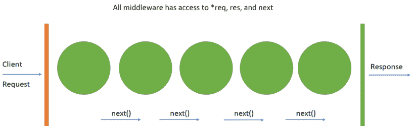

图 13.27：中间件流程的视觉表示

在我们的案例中，我们将创建 **isConnected** 中间件来验证用户是否已连接并且具有正确的权限。如果没有，我们将中断流程并将他们重定向到登录页面。如果用户有效，我们将执行下一个中间件，这将渲染我们的 React 应用程序。以下图表描述了此过程：

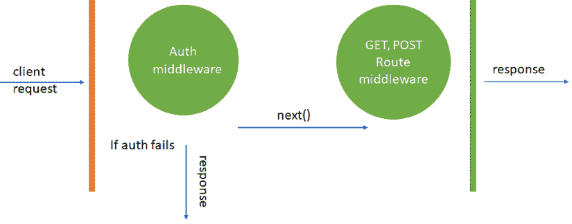

图 13.28：认证中间件

让我们将理论部分应用到我们的代码中。所需的文件应位于 `/frontend/src/server/lib/middlewares/user.ts`：

```js
import { NextFunction, Request, Response } from 'express'
import { getUserData } from '../jwt'
export const isConnected = (isLogged = true, roles = ['user'], redirectTo = '/') =>
async (req: Request, res: Response, next: NextFunction): Promise<void> => {
const user = await getUserData(req.cookies.at)
if (!user && !isLogged) {
return next()
}
if (user && isLogged) {
if (roles.includes('god') && roles.role === 'god') {
return next()
}
if (roles.includes('admin') && user.role === 'admin') {
return next()
}
if (roles.includes('user') && user.role === 'user') {
return next()
}
res.redirect(redirectTo)
} else {
res.redirect(redirectTo)
}
} 
```

基本上，通过这个中间件，我们可以控制是否要验证用户是否已连接（`isLogged = true`）。然后，我们可以验证特定的角色（`roles = ['god', 'admin']`），如果用户未连接或没有正确的角色，则将用户重定向（`redirectTo = '/'`）。

如您所见，我们正在使用来自 `jwt` 的 `getUserData` 函数。我们将在下一节创建我们的 `jwt` 函数。

## 创建 JWT 函数

在我之前解释后端代码时，我提到了 JWT。在前端，我们需要这些函数来验证我们的令牌并获取用户数据。让我们在 `/frontend/src/server/lib/jwt.ts` 创建包含以下代码的文件：

```js
import { getBase64 } from '@contentpi/lib'
import jwt from 'jsonwebtoken'
import * as config from '~/config'
const { security: { secretKey } } = config
export function jwtVerify(accessToken: string, cb: any) {
jwt.verify(accessToken, secretKey, (error: any, accessTokenData: any = {}) => {
const { data: user } = accessTokenData
if (error || !user) {
return cb(null)
}
const userData = getBase64(user)
return cb(userData)
})
}
export async function getUserData(accessToken: string): Promise<any> {
const UserPromise = new Promise(
(resolve) => jwtVerify(accessToken, (user: any) => resolve(user))
)
const user = await UserPromise
return user
} 
```

如您所见，我们的 `getUserData` 函数将使用 `accessToken` 从 cookies 中检索用户数据，这是我们之前获取的。

为了安全原因和确保用户的身份得到验证，JWT 必须有效。服务器在用户发起请求时验证此令牌。如果令牌无效，服务器将不会满足用户的需求。此外，令牌有助于保护用户信息，因为它不能在没有服务器知识的情况下被更改。此外，这些令牌有有效期，需要用户再次登录。这防止了未经授权的个人使用被盗令牌来冒充用户。因此，确保 JWT 的有效性至关重要。

## 创建我们的 GraphQL 查询和突变

我们已经在我们的后端项目中创建了所需的查询和突变。然而，此时我们需要在我们的前端项目中创建一些文件来执行它们。目前，我们只需要定义我们的 `getUserData` 查询和登录突变，以便在前端执行登录。

让我们在 `/frontend/src/client/graphql/user/getUser.query.ts` 创建我们的 `getUser` 查询：

```js
import { gql } from '@apollo/client'
export default gql`
query getUser($at: String!) {
getUser(at: $at) {
id
email
username
role
active
}
}
` 
```

我们的登录突变应在 `/frontend/src/graphql/user/login.mutation.ts`：

```js
import { gql } from '@apollo/client'
export default gql`
mutation login($email: String!, $password: String!) {
login(input: { email: $email, password: $password }) {
token
}
}
` 
```

现在我们已经定义了查询和突变，让我们创建用户上下文，以便我们可以使用它们。

## 创建用户上下文以处理登录和已连接用户

在我们的用户上下文中，我们将有一个登录方法，它将执行我们的突变并验证电子邮件和密码是否正确。我们还将导出用户数据。

让我们在 `/frontend/src/client/contexts/user.tsx` 创建此上下文：

```js
import { useMutation, useQuery } from '@apollo/client'
import { getGraphQlError, redirectTo } from '@contentpi/lib'
import { createContext, FC, ReactElement, useEffect, useState } from 'react'
import { useCookies } from 'react-cookie'
import GET_USER_QUERY from '../graphql/user/getUser.query'
import LOGIN_MUTATION from '../graphql/user/login.mutation'
// Interfaces
interface IUserContext {
login(input: any): any
connectedUser: any
}
interface IProps {
page?: string
children: ReactElement
}
// Creating context
export const UserContext = createContext<IUserContext>({
login: () => null,
connectedUser: null
})
const UserProvider: FC<IProps> = ({ page = '', children }) => {
const [cookies, setCookie] = useCookies()
const [connectedUser, setConnectedUser] = useState(null)
// Mutations
const [loginMutation] = useMutation(LOGIN_MUTATION)
// Queries
const { data: dataUser } = useQuery(GET_USER_QUERY, {
variables: {
at: cookies.at || ''
}
})
// Effects
useEffect(() => {
if (dataUser) {
if (!dataUser.getUser.id && page !== 'login') {
// If the user session is invalid and is on a different page than login
// we redirect them to login
redirectTo('/login?redirectTo=/dashboard')
} else {
// If we have the user data available we save it in our connectedUser state
setConnectedUser(dataUser.getUser)
}
}
}, [dataUser, page])
async function login(input: { email: string; password: string }): Promise<any> {
try {
// Executing our loginMutation passing the email and password
const { data: dataLogin } = await loginMutation({
variables: {
email: input.email,
password: input.password
}
})
if (dataLogin) {
// If the login was success, we save the token in our "at" cookie
setCookie('at', dataLogin.login.token, { path: '/' })
return dataLogin.login.token
}
} catch (err) {
// If there is an error we return it
return getGraphQlError(err)
}
}
// Exporting our context
const context = {
login,
connectedUser
}
return <UserContext.Provider value={context}>{children}</UserContext.Provider>
}
export default UserProvider 
```

如您所见，我们处理了登录，并在我们的上下文中有了 `connectedUser` 数据。在这里，我们始终执行 `GET_USER_QUERY` 以验证用户是否已连接（验证数据库而不是仅通过 cookies）。

## 配置 Apollo 客户端

到目前为止，我们已经创建了大量的代码，但如果我们不配置 Apollo 客户端，那么这些代码将无法工作。要配置 Apollo 客户端，我们需要将其添加到我们的索引文件 `/frontend/src/client/index.tsx` 中：

```js
import { ApolloClient, ApolloProvider, InMemoryCache } from '@apollo/client'
import { render } from 'react-dom'
import * as config from '../config'
import AppRoutes from './AppRoutes'
const client = new ApolloClient({
uri: config.api.uri,
cache: new InMemoryCache()
})
render(
<ApolloProvider client={client}>
<AppRoutes />
</ApolloProvider>,
document.querySelector('#root')
) 
```

基本上，我们传递 `config.api.uri`，这是 GraphQL Playground 运行的地方 ([`localhost:4000/graphql`](http://localhost:4000/graphql))，然后使用 `ApolloProvider` 组件包装我们的 `AppRoutes` 组件。

## 创建我们的应用路由

我们将使用 `react-router-dom` 创建我们的应用程序路由。让我们在 `/frontend/src/client/AppRoutes.tsx` 创建所需的代码：

```js
import { BrowserRouter as Router, Route, Routes } from 'react-router-dom'
import DashboardPage from './pages/dashboard'
import Error404 from './pages/error404'
import HomePage from './pages/home'
import LoginPage from './pages/login'
const AppRoutes = () => (
<>
<Router>
<Routes>
<Route path="/" element={<HomePage />} />
<Route path="/dashboard" element={<DashboardPage />} />
<Route path="/login" element={<LoginPage />} />
<Route element={<Error404 />} />
</Routes>
</Router>
</>
)
export default AppRoutes 
```

如您所见，我们正在向我们的路由中添加一些页面，例如 `HomePage`、`DashboardPage`（受保护）和 `LoginPage`。如果用户尝试访问不同的 URL，那么我们将显示 `Error404` 组件。我们将在下一节中创建这些页面。

## 创建我们的页面

`Home` 页面应该位于 `/frontend/src/client/pages/home.tsx`：

```js
const Page = () => (
<div className="home">
<h1>Home</h1>
<ul>
<li><a href="/dashboard">Go to Dashboard</a></li>
</ul>
</div>
)
export default Page 
```

`Dashboard` 页面应该位于 `/frontend/src/client/pages/dashboard.tsx`：

```js
import DashboardLayout from '../components/dashboard/DashboardLayout'
import UserProvider from '../contexts/user'
const Page = () => (
<UserProvider>
<DashboardLayout />
</UserProvider>
)
export default Page 
```

`Login` 页面应该位于 `/frontend/src/client/pages/login.tsx`：

```js
import { isBrowser } from '@contentpi/lib'
import { FC, ReactElement } from 'react'
import LoginLayout from '../components/users/LoginLayout'
import UserProvider from '../contexts/user'
interface IProps {
currentUrl?: string
}
const Page: FC<IProps> = ({
currentUrl = isBrowser() ? window.location.search.replace('?redirectTo=', '') : ''
}) => (
<UserProvider page="login">
<LoginLayout currentUrl={currentUrl} />
</UserProvider>
)
export default Page 
```

最后，我们需要创建我们的 404 错误页面 `(/frontend/src/client/pages/error404.tsx)`：

```js
const Page = () => (
<div className="error404">
<h1>Error404</h1>
</div>
)
export default Page 
```

我们几乎完成了。这个谜题的最后一块是创建 `Login` 和 `Dashboard` 组件。我们将在下一节中完成。

## 创建我们的登录组件

我为我们的登录和仪表板创建了一些基本组件。当然，它们的样式可以改进，但让我们看看它们是如何工作的，以及我们的登录系统将看起来如何。

您需要创建的第一个文件是位于 `/frontend/src/client/components/users/LoginLayout.tsx` 的 `LoginLayout.tsx`：

```js
import { FC, useContext } from 'react'
import { UserContext } from '../../contexts/user'
import Login from './Login'
// Interfaces
interface IProps {
currentUrl: string
}
const Layout: FC<IProps> = ({ currentUrl }) => {
const { login } = useContext(UserContext)
return <Login login={login} currentUrl={currentUrl} />
}
export default Layout 
```

布局文件在我们想要为组件添加特定布局时很有用。它还有助于从上下文中获取数据并将数据或函数作为属性传递。

我们的 `Login` 组件应该看起来像这样 (`/frontend/src/client/components/users/Login.tsx`)：

```js
import { redirectTo } from '@contentpi/lib'
import { ChangeEvent, FC, useState } from 'react'
import { IUser } from '../../types'
import { StyledLogin } from './Login.styled'
interface IProps {
login(input: any): any
currentUrl: string
}
const Login: FC<IProps> = ({ login, currentUrl }) => {
const [values, setValues] = useState({
email: '',
password: ''
})
const [errorMessage, setErrorMessage] = useState('')
const [invalidLogin, setInvalidLogin] = useState(false)
const onChange = (e: ChangeEvent<HTMLInputElement>): void => {
const { target: { name, value } } = e
if (name) {
setValues((prevValues: any) => ({
...prevValues,
[name]: value
}))
}
}
const handleSubmit = async (user: IUser): Promise<void> => {
// Here we execute the login mutation
const response = await login(user)
if (response.error) {
setInvalidLogin(true)
setErrorMessage(response.message)
} else {
redirectTo(currentUrl || '/')
}
}
return (
<>
<StyledLogin>
<div className="wrapper">
{invalidLogin && <div className="alert">{errorMessage}</div>}
<div className="form">
<p>
<input 
autoComplete="off"
type="email"
className="email"
name="email"
placeholder="Email"
onChange={onChange}
value={values.email}
/>
</p>
<p>
<input
autoComplete="off"
type="password"
className="password"
name="password"
placeholder="Password"
onChange={onChange}
value={values.password}
/>
</p>
<div className="actions">
<button name="login" onClick={() => handleSubmit(values)}>Login</button>
</div>
</div>
</div>
</StyledLogin>
</>
)
}
export default Login 
```

我们将接下来创建 `dashboard` 组件。

## 创建我们的仪表板组件

在创建我们的 `dashboard` 组件时，第一个应该是位于 `/frontend/src/client/components/dashboard/DashboardLayout.tsx` 的 `DashboardLayout.tsx` 文件：

```js
import { FC, useContext } from 'react'
import { UserContext } from '../../contexts/user'
import Dashboard from './Dashboard'
const Layout: FC = () => {
const { connectedUser } = useContext(UserContext)
// We only render the Dashboard if the user is connected
if (connectedUser) {
return <Dashboard connectedUser={connectedUser} />
}
return <div />
}
export default Layout 
```

这就是我们保护 `dashboard` 页面以仅允许已连接用户的方法。现在，让我们在 `/frontend/src/components/dashboard/Dashboard.tsx` 创建我们的 `dashboard` 组件：

```js
interface IProps {
connectedUser: any
}
const Dashboard = ({ connectedUser }) => (
<div className="dashboard">
<h1>Welcome, {connectedUser.username}!</h1>
<ul>
<li><a href="/logout">Logout</a></li>
</ul>
</div>
)
export default Dashboard 
```

有了这些，我们就完成了！我们将在下一节测试登录系统。

## 测试我们的登录系统

如果您正确地遵循了前面的章节，那么您应该能够成功运行登录系统。为此，我们需要打开三个终端：

+   在第一个中，您需要运行您的后端项目（**npm run dev**）。

+   在另一个方面，您需要在前端项目中运行 Node.js 服务器（**npm run dev**）。

第三个终端是当您第一次打开`http://localhost:3000`时，您应该能够看到`Home`页面：

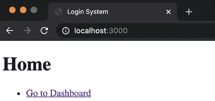

图 13.29：主页

然后，如果您点击**转到仪表板**（[`localhost:3000/dashboard`](http://localhost:3000/dashboard)）链接，您将被重定向到[`localhost:3000/login?redirectTo=/dashboard`](http://localhost:3000/login?redirectTo=/dashboard)，如下面的截图所示：

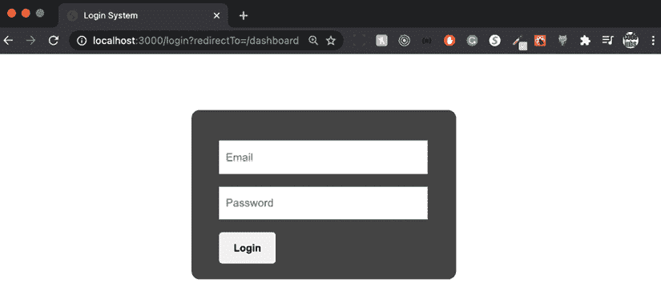

图 13.30：登录页面

这是我们的登录表单。如果您尝试使用虚假凭证登录，您应该会收到一个错误：

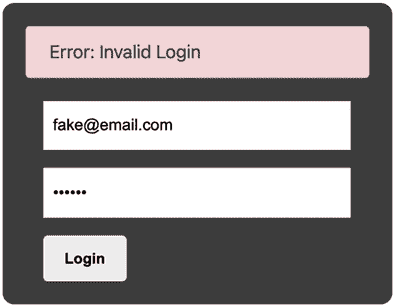

图 13.31：无效登录

如果您想查看 GraphQL 请求，您可以在**头部**选项卡上这样做：


图 13.32：GraphQL 请求

在这里，您可以查看您执行的查询和您发送的变量（电子邮件和密码）。您可以在**预览**选项卡上看到响应：

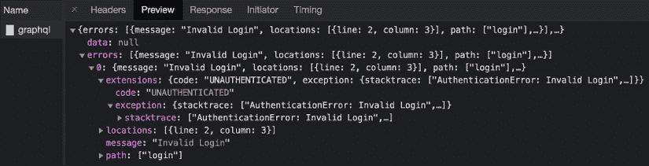

图 13.33：无效登录

如您所见，我们得到了一个`"Invalid Login"`错误消息，这就是为什么我们在`login`组件中渲染它。

现在，让我们尝试使用正确的账户（**admin@js.education**和**123456**）进行连接。如果您的登录正确，那么您应该被重定向到仪表板，在那里您将看到以下页面：

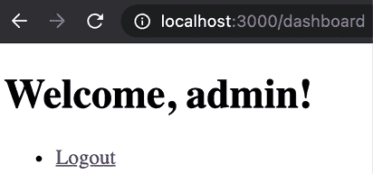

图 13.34：欢迎，admin！页面

此外，您还可以查看用于检索用户数据的查询（**getUser**）：

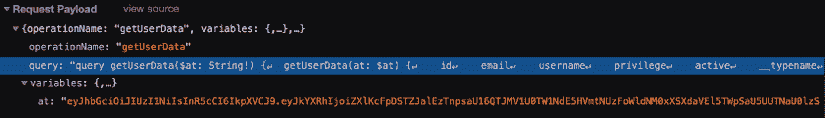

图 13.35：获取用户数据

在这里，您将看到返回的负载：

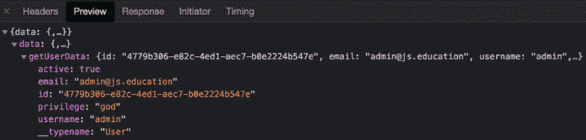

图 13.36：getUserData 负载

我们从访问令牌（**at**）中获取用户信息。如果您刷新页面，您应该保持连接到页面。这是因为我们保存了一个包含我们的令牌的 cookie：

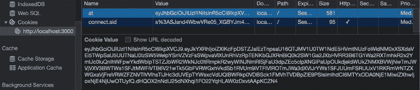

图 13.37：Cookies

现在，让我们尝试通过更改令牌中的任何字母来修改 cookie。例如，让我们将前两个字母（**ey**）更改为**XX**：

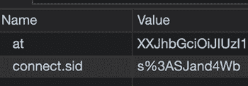

图 13.38：更新 cookie

在这里，您将收到用户的空数据。这将使会话无效，并再次将您重定向到登录页面：

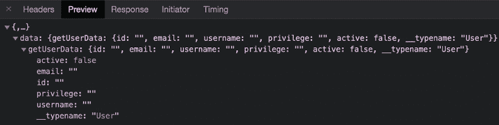

图 13.39：空数据

现在，你已经学会了如何在后端实现 GraphQL 以及如何在前端消费查询和突变。

这个登录系统是我正在 YouTube 上开设的一门课程的组成部分，我在课程中教授观众如何从头开始开发一个无头 CMS，所以如果你渴望了解更多，你可以查看课程[`www.youtube.com/watch?v=4n1AfD6aV4M`](https://www.youtube.com/watch?v=4n1AfD6aV4M)。

# 摘要

我希望你觉得这一章关于 GraphQL、JWT 创建、登录功能以及 Sequelize 模型创建的内容既信息丰富又引人入胜。它提供了大量宝贵的见解和实用技巧，你可以将这些应用到自己的项目中，帮助你简化开发过程，更高效地实现目标。通过掌握这些概念，你将更好地装备自己，构建强大、可扩展的应用程序，满足用户需求并推动你的成功。

感谢您的阅读，我期待在下一章中与您分享更多内容，届时你将学习如何创建单仓库和多站点项目。
