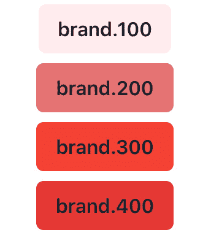
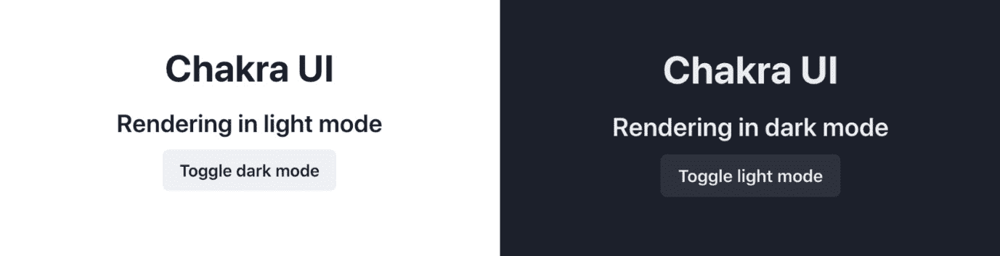
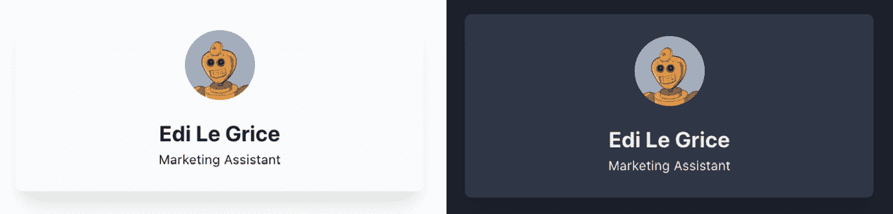
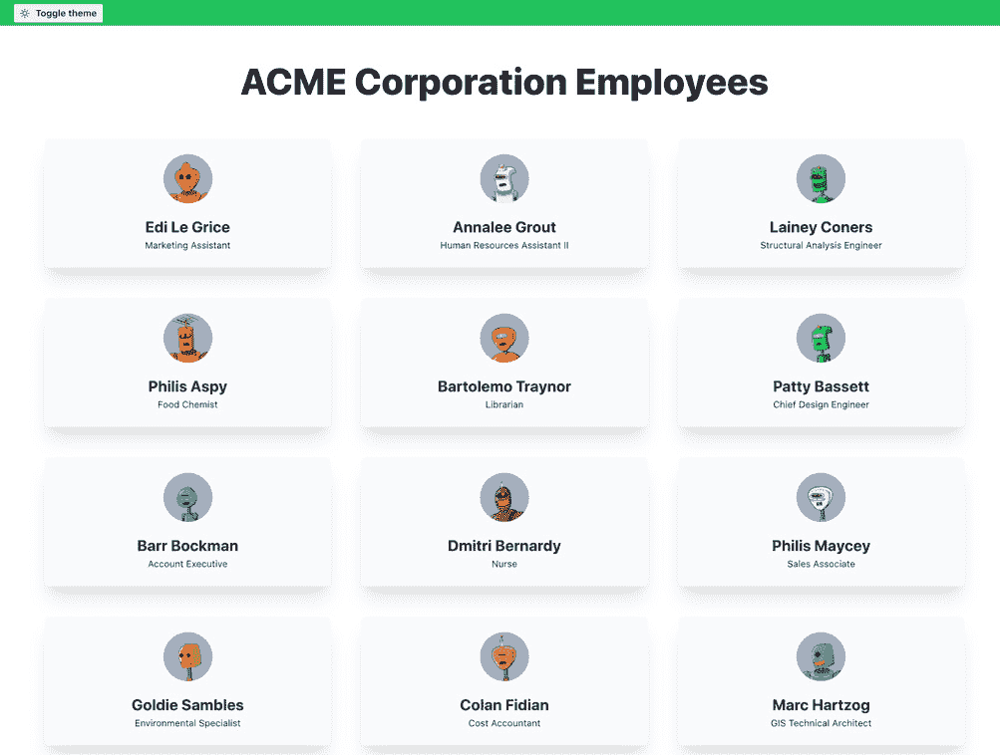
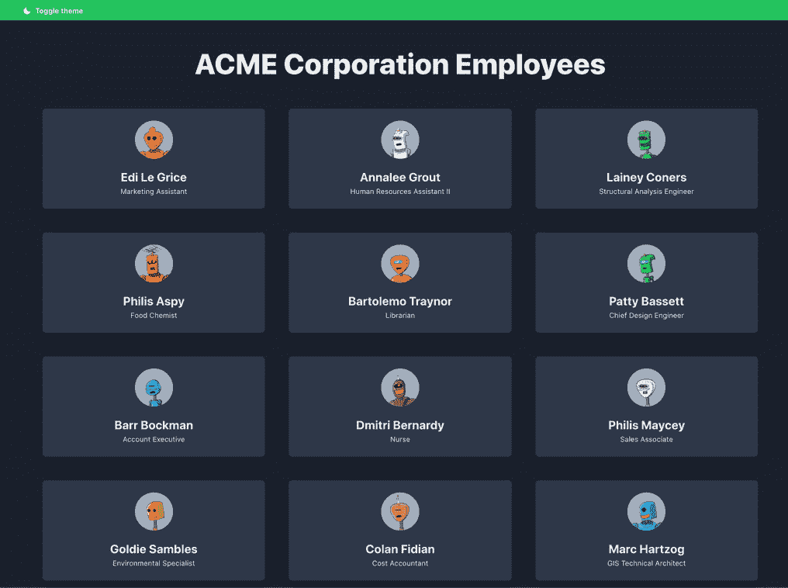
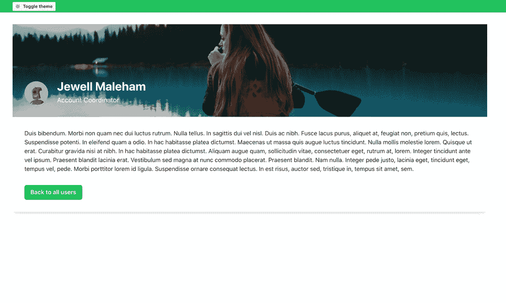
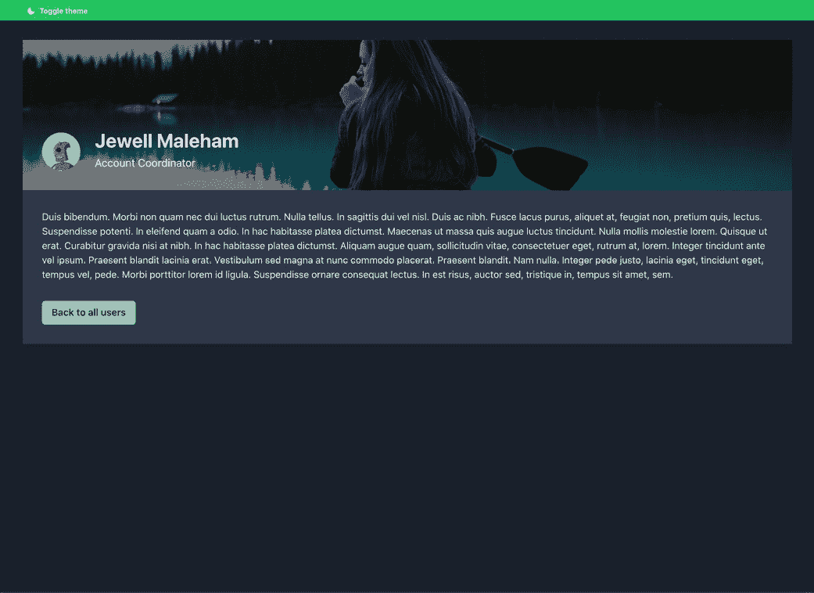
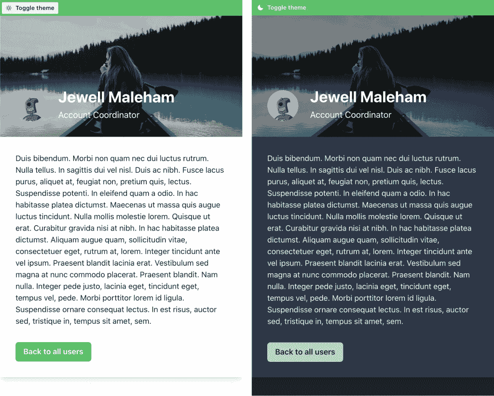
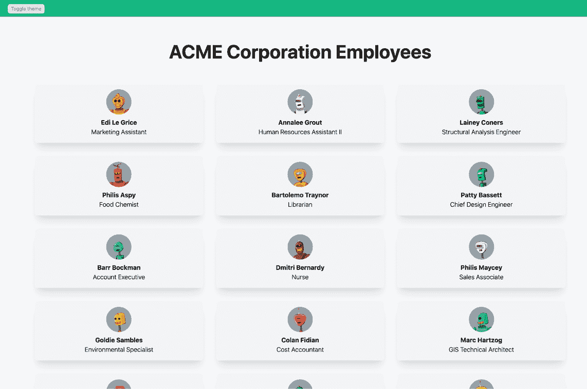

# 第七章：使用 UI 框架

在上一章中，我们看到了 Next.js 如何通过为我们提供许多无需安装和配置多个不同外部包即可编写 CSS 的有效替代方案来提高我们的生产力。

尽管如此，有些情况下我们可能希望使用预构建的 UI 库来利用它们的组件、主题和内置功能，这样我们就不必从头开始构建，并利用庞大的社区在出现任何问题时帮助我们。

在本章中，我们将发现一些现代 UI 库，并学习如何正确地将它们集成到任何 Next.js 应用程序中。我们将详细探讨以下内容：

+   UI 库是什么以及为什么我们可能需要它们

+   如何集成 **Chakra UI**

+   如何集成 **TailwindCSS**

+   如何使用 **Headless UI** 组件

到本章结束时，您将能够通过遵循以下章节中我们将看到的提示和原则来集成任何 UI 库。

# 技术要求

要运行本章中的代码示例，您需要在您的本地计算机上安装 Node.js 和 npm。

如果您愿意，可以使用在线 IDE，例如 [`repl.it`](https://repl.it) 或 [`codesandbox.io`](https://codesandbox.io)；它们都支持 Next.js，您不需要在您的计算机上安装任何依赖项。至于其他章节，您可以在 GitHub 上找到本章的代码库：https://github.com/PacktPublishing/Real-World-Next.js。

# UI 库简介

UI 库、框架和实用工具并非必需品。我们可以从头开始使用纯 JavaScript、HTML 和 CSS 构建任何用户界面（尽管可能很复杂）。然而，我们经常发现自己会在构建的每个用户界面上使用相同的模式、可访问性规则、优化和实用函数。因此，UI 库的概念应运而生。

策略是将我们最常用的用例抽象化，在不同的用户界面中重用大部分代码，提高我们的生产力，并使用知名、经过测试且 **可主题化** 的 UI 组件。

“可主题化”指的是那些允许我们自定义给定框架的颜色方案、间距和整个设计语言的库和组件。

我们可以以流行的 *Bootstrap* 库为例。它允许我们覆盖其默认变量（如颜色、字体、混入等）以自定义默认主题。多亏了这个特性，我们有可能在数十个不同的 UI 上使用 Bootstrap，每个 UI 都有非常不同的外观和感觉。

虽然 Bootstrap 仍然是一个好、经过测试且广为人知的库，但在以下章节中，我们将关注更现代的替代品。每个选项将采用不同的方法，让您了解在选择 UI 库时应该寻找什么。

# 集成 Next.js 中的 Chakra UI

Chakra UI 是一个开源组件库，用于构建模块化、可访问且美观的用户界面。

它的主要优势如下：

+   *可访问性*：Chakra UI 允许我们使用 Chakra UI 团队创建的预构建组件（如按钮、模态框、输入框等），并额外关注可访问性。

+   *可主题化*：该库附带默认主题，其中（例如）按钮具有特定的默认背景颜色、边框半径、填充等。我们可以始终使用 Chakra UI 内置的编辑库组件每个样式的函数来自定义默认主题。

+   *浅色和深色模式*：它们都支持默认设置，并且可以依赖于用户的系统设置。如果用户将计算机设置为默认使用深色模式，Chakra UI 将在加载时立即加载深色主题。

+   *可组合性*：我们可以从 Chakra UI 组件开始创建更多组件。该库将为我们提供创建自定义组件的构建块。

+   *TypeScript 支持*：Chakra UI 使用 TypeScript 编写，并提供了一流的类型，以提供美好的开发者体验。

要了解如何将 Chakra UI 集成到 Next.js 应用程序中，我们将通过使用静态 Markdown 文档作为页面来构建一个简单的公司员工目录。

因此，让我们首先创建一个新的 Next.js 项目：

```js
npx create-next-app employee-directory-with-chakra-ui
```

我们现在需要安装 Chakra UI 及其依赖项：

```js
yarn add @chakra-ui/react @emotion/react@¹¹ @emotion/styled@¹¹ framer-motion@⁴ @chakra-ui/icons
```

现在，我们已经准备好将 Chakra UI 与 Next.js 集成。要做到这一点，让我们打开 `pages/_app.js` 文件并将默认的 `<Component />` 组件包裹在 Chakra 提供者中：

```js
import { ChakraProvider } from '@chakra-ui/react';
function MyApp({ Component, pageProps }) {
  return (
    <ChakraProvider>
      <Component {...pageProps} />
    </ChakraProvider>
  );
}
export default MyApp;
```

使用 `ChakraProvider`，我们还可以传递一个包含表示主题覆盖的对象的 `theme` 属性。实际上，我们可以通过使用内置的 `extendTheme` 函数来使用我们的自定义颜色、字体、间距等来覆盖默认的 Chakra UI 主题：

```js
import { ChakraProvider, extendTheme } from '@chakra- 
  ui/react';
const customTheme = extendTheme({
  colors: {
    brand: {
      100: '#ffebee',
      200: '#e57373',
      300: '#f44336',
      400: '#e53935',
    },
  },
});
function MyApp({ Component, pageProps }) {
  return (
    <ChakraProvider theme={customTheme}>
      <Component {...pageProps} />
    </ChakraProvider>
  );
}
export default MyApp;
```

现在，我们可以打开 `pages/index.js` 文件并使用我们的自定义颜色添加一些 Chakra UI 组件：

```js
import { VStack, Button } from '@chakra-ui/react';
export default function Home() {
  return (
    <VStack padding="10">
      <Button backgroundColor="brand.100"> brand.100     
      </Button>
      <Button backgroundColor="brand.200"> brand.200 
      </Button>
      <Button backgroundColor="brand.300"> brand.300 
      </Button>
      <Button backgroundColor="brand.400"> brand.400    
      </Button>
    </VStack>
  );
}
```

在网页浏览器中打开页面，我们将看到以下结果：



图 7.1 – 带自定义主题颜色的 Chakra UI 按钮

在继续本章之前，你可以自由地向该 Chakra UI 安装添加你的自定义样式，以确保结果符合你的品味！

如果你想了解更多关于自定义属性名称的信息，我建议你在继续之前先阅读官方指南：https://chakra-ui.com/docs/theming/customize-theme。

我们已经讨论过但尚未看到的是 Chakra UI 提供的内置深色/浅色模式支持。

该库默认使用浅色模式，但我们可以通过打开 `pages/_document.js` 文件并添加以下内容来修改此行为：

```js
import { ColorModeScript } from '@chakra-ui/react';
import NextDocument, {
    Html,
    Head,
    Main,
    NextScript 
} from 'next/document';
import { extendTheme } from '@chakra-ui/react';
const config = {
  useSystemColorMode: true,
};
const theme = extendTheme({ config });
export default class Document extends NextDocument {
  render() {
    return (
      <Html lang="en">
        <Head />
        <body>
          <ColorModeScript
            initialColorMode={theme.config.initialColorMode}
          />
          <Main />
          <NextScript />
        </body>
      </Html>
    );
  }
}
```

`ColorModeScript`组件将注入一个脚本，允许我们的应用程序根据用户的偏好以浅色/深色模式运行。鉴于前面的配置，我们将采用用户系统的偏好来渲染组件。例如，假设用户已将操作系统设置为深色模式。在这种情况下，我们的网站将默认以深色模式渲染组件，反之亦然，如果用户将操作系统设置为该偏好，它将以浅色模式渲染组件。

我们可以通过打开`pages/index.js`文件并替换其内容来测试脚本是否正确工作：

```js
import { 
    VStack,
    Button,
    Text,
    useColorMode
} from '@chakra-ui/react';
export default function Home() {
  const { colorMode, toggleColorMode } = useColorMode();
  return (
    <VStack padding="10">
      <Text fontSize="4xl" fontWeight="bold" as="h1">
        Chakra UI
      </Text>
      <Text fontSize="2xl" fontWeight="semibold" as="h2">
        Rendering in {colorMode} mode
      </Text>
      <Button
        aria-label="UI Theme"
        onClick={toggleColorMode}
      >
        Toggle {colorMode === 'light' ? 'dark' : 'light'}   
          mode
      </Button>
    </VStack>
  );
}
```

感谢 Chakra UI 的`useColorMode`钩子，我们总能知道正在使用哪种颜色模式，并且可以根据该值渲染特定的组件（或更改颜色）。此外，Chakra UI 将记住用户的决定，因此如果他们设置了深色模式，当他们回到网站时，他们将发现网页应用了相同的颜色模式。

如果我们现在打开我们网站的首页，我们将能够更改其颜色模式。结果应该看起来像这样：



图 7.2 – Chakra UI 颜色模式

现在我们已经迈出了与 Chakra UI 和 Next.js 的第一步，我们终于准备好开始开发员工目录了。

该网站将非常简单：它将只有一个列出虚构公司 ACME Corporation 所有员工的首页，以及每个用户的单个页面。

在每个页面上，我们将有一个按钮用于在深色和浅色模式之间切换。

## 使用 Chakra UI 和 Next.js 构建员工目录

我们可以重用介绍部分中为 Chakra UI 和 Next.js 设置的现有项目来构建我们的员工目录。但我们仍需要对已编写的代码进行一些小的修改。

如果您有任何疑问，您可以在 GitHub 上查看完整的网站示例：https://github.com/PacktPublishing/Real-World-Next.js/tree/main/07-using-ui-frameworks/with-chakra-ui。

首先，我们需要员工数据。您可以在以下 URL 找到完整的员工列表（使用假数据生成）：[`github.com/PacktPublishing/Real-World-Next.js/blob/main/07-using-ui-frameworks/with-chakra-ui/data/users.js`](https://github.com/PacktPublishing/Real-World-Next.js/blob/main/07-using-ui-frameworks/with-chakra-ui/data/users.js)。如果您愿意，您可以通过创建一个对象数组来编写自定义员工数据，其中每个对象必须具有以下属性：

+   `id`

+   `用户名`

+   `名字`

+   `姓氏`

+   `描述`

+   `职位名称`

+   `头像`

+   `封面图片`

现在创建一个新的目录`/data`和一个名为`users.js`的 JavaScript 文件，我们将在这里放置我们的员工数据：

```js
export default [
  {
    id: 'QW3xhqQmTI4',
    username: 'elegrice5',
    first_name: 'Edi',
    last_name: 'Le Grice',
    description: 'Aenean lectus. Pellentesque eget 
      nunc...',
    job_title: 'Marketing Assistant',
    avatar: 
     'https://robohash.org/elegrice5.jpg?size=350x350',
    Cover_image: 
      'https://picsum.photos/seed/elegrice5/1920/1080',
  },
  // ...other employee's data
];
```

我们可以保留`pages/_document.js`文件中的介绍部分不变。这样，我们将能够访问我们网站的深色/浅色主题切换功能。

前往 `pages/_app.js` 页面，我们可以通过包含一个新的 `TopBar` 组件（我们将在下一刻创建）并移除自定义主题来修改其内容，因为我们目前不需要它：

```js
import { ChakraProvider, Box } from '@chakra-ui/react';
import TopBar from '../components/TopBar';
function MyApp({ Component, pageProps }) {
  return (
    <ChakraProvider>
      <TopBar />
      <Box maxWidth="container.xl" margin="auto">
        <Component {...pageProps} />
      </Box>
    </ChakraProvider>
  );
}
export default MyApp;
```

如前一个代码块所示，我们将 `<Component />` 组件包裹在一个 Chakra UI `Box` 组件中。

默认情况下，`<Box>` 作为空的 `<div>`，并且像任何其他 Chakra UI 组件一样，它接受任何 CSS 指令作为属性。在这种情况下，我们使用 `margin="auto"`（这相当于 `margin: auto`）和 `maxWidth="container.xl"`，这相当于 `max-width: var(--chakra-sizes-container-xl)`。

让我们创建一个新的文件，`/components/TopBar/index.js`，并创建 `TopBar` 组件：

```js
import { Box, Button, useColorMode } from '@chakra-ui/react';
import { MoonIcon, SunIcon } from '@chakra-ui/icons';
function TopBar() {
  const { colorMode, toggleColorMode } = useColorMode();
  const ColorModeIcon = colorMode === 'light' ? SunIcon : 
    MoonIcon;
  return (
    <Box width="100%" padding="1" 
      backgroundColor="whatsapp.500">
      <Box maxWidth="container.xl" margin="auto">
        <Button
          aria-label="UI Theme"
          leftIcon={<ColorModeIcon />}
          onClick={toggleColorMode}
          size="xs"
          marginRight="2"
          borderRadius="sm">
          Toggle theme
        </Button>
      </Box>
    </Box>
  );
}
export default TopBar;
```

此组件与我们之前在上一节中创建的组件没有区别；每次用户点击按钮时，它将使用 Chakra UI 内置的 `toggleColorMode` 函数切换暗/亮模式。

我们现在可以在新的 `components/UserCard/index.js` 文件中创建一个额外的组件：

```js
import Link from 'next/link';
import {
  Box, Text, Avatar, Center, VStack, useColorModeValue
    } from '@chakra-ui/react';
function UserCard(props) {
  return (
    <Link href={`/user/${props.username}`} passHref>
      <a>
        <VStack
          spacing="4"
          borderRadius="md"
          boxShadow="xl"
          padding="5"
          backgroundColor={
            useColorModeValue('gray.50', 'gray.700')
          }>
          <Center>
            <Avatar size="lg" src={props.avatar} />
          </Center>
          <Center>
            <Box textAlign="center">
              <Text fontWeight="bold" fontSize="xl">
                {props.first_name} {props.last_name}
              </Text>
              <Text fontSize="xs"> {props.job_title}</Text>
            </Box>
          </Center>
        </VStack>
      </a>
    </Link>
  );
}
export default UserCard;
```

如您所见，我们将整个组件包裹在一个 Next.js `<Link>` 组件中，将 `href` 值传递给 `<a>` 子元素。

我们随后使用垂直堆叠（`VStack`）组件，它底层使用 *flexbox* 来帮助我们垂直排列子元素。

根据所选的颜色主题，我们可能希望为我们的用户卡片设置不同的背景颜色。我们可以通过使用 Chakra UI 内置的 `useColorModeValue` 来实现这一点：

```js
backgroundColor={useColorModeValue('gray.50', 'gray.700')}>
```

第一个值（`'gray.50'`）将在用户选择亮色主题时由 Chakra UI 应用。当选择暗色主题时，UI 库将使用第二个值（`'gray.700'`）代替。

如果我们现在向 `<UserCard>` 组件传递正确的属性，我们将看到如下内容：



图 7.3 – 用户卡片组件

我们终于准备好在主页上渲染员工列表了！让我们转到我们的 `pages/index.js` 文件，导入员工列表，并使用新创建的 `UserCard` 组件显示它们：

```js
import { Box, Grid, Text, GridItem } from '@chakra-ui/react';
import UserCard from '../components/UserCard';
import users from '../data/users';
export default function Home() {
  return (
    <Box>
      <Text
        fontSize="xxx-large"
        fontWeight="extrabold"
        textAlign="center"
        marginTop="9">
        ACME Corporation Employees
      </Text>
      <Grid
        gridTemplateColumns={
          ['1fr', 'repeat(2, 1fr)', 'repeat(3, 1fr)']
        }
        gridGap="10"
        padding="10">
        {users.map((user) => (
          <GridItem key={user.id}>
            <UserCard {...user} />
          </GridItem>
        ))}
      </Grid>
    </Box>
  );
}
```

在这个页面上，我们可以看到另一个不错的 Chakra UI 功能：响应式属性。我们使用 `<Grid>` 组件为用户的卡片构建一个网格模板：

```js
gridTemplateColumns={
  ['1fr', 'repeat(2, 1fr)', 'repeat(3, 1fr)']
}
```

每个 Chakra UI 属性都可以接受一个值数组作为输入。在上面的例子中，UI 库将在移动屏幕上渲染 `'1fr'`，在中等屏幕（例如平板电脑）上渲染 `'repeat(2, 1fr)'`，在更大屏幕（桌面）上渲染 `'repeat(3, 1fr)'`。

我们现在可以运行开发服务器并查看结果：



图 7.4 – 亮色模式下的员工目录主页

在我的情况下，我设置了系统偏好为 `TopBar` 组件：



图 7.5 – 暗色模式下的员工目录主页

我们现在只需要创建一个员工页面。

让我们创建一个名为 `pages/users/[username].js` 的新文件；在这里，我们将使用 Next.js 内置方法在构建时静态渲染每个页面。

我们可以先导入 `users.js` 文件，并使用 Next.js 的 `getStaticPaths` 函数创建所有静态路径：

```js
import users from '../../data/users';
export function getStaticPaths() {
  const paths = users.map((user) => ({
    params: {
      username: user.username
    }
  }));
  return {
    paths,
    fallback: false
  };
}
```

使用 `getStaticPaths` 函数，我们告诉 Next.js 我们需要为用户数组中找到的每个用户渲染一个新页面。

我们还告诉 Next.js 如果请求的路径在构建时未生成，则显示 404 页面；我们通过使用 `fallback: false` 属性来完成此操作。

如果设置为 `true`，该属性告诉 Next.js 如果在构建时没有渲染页面，则尝试在服务器端渲染页面。这是因为我们可能希望从数据库或外部 API 获取页面，我们不希望在创建新页面时每次都重建整个网站。因此，当我们设置 `fallback` 为 `true` 时，Next.js 将在服务器端重新运行 `getStaticProps` 函数，渲染页面，并将其作为静态页面提供服务。

在这个例子中，我们不需要这个功能，因为我们是从静态 JavaScript 文件中获取数据，但我们在后面的章节中会使用这个功能。

让我们继续编写 `getStaticProps` 函数：

```js
export function getStaticProps({ params }) {
  const { username } = params;
  return {
    props: {
      user: users.find((user) => user.username === 
        username)
    }
  };
}
```

通过这个函数，我们通过过滤用户数组来查询我们想在页面上显示的特定用户。

在我们开始编写页面内容之前，让我们导入所需的 Chakra UI 和 Next.js 依赖项：

```js
import Link from 'next/link';
import {
  Avatar,
  Box,
  Center,
  Text,
  Image,
  Button,
  Flex,
  useColorModeValue
} from '@chakra-ui/react';
```

我们现在可以编写我们的 `UserPage` 组件。我们将把所有内容都包裹在一个 Chakra UI `<Center>` 组件中，该组件底层使用 flexbox 来居中所有子元素。

然后，我们将使用其他 Chakra UI 内置组件，如 `<Image>`、`<Flex>`、`<Avatar>`、`<Text>` 等，来创建我们的组件：

```js
function UserPage({ user }) {
  return (
    <Center
      marginTop={['0', '0', '8']}
      boxShadow="lg"
      minHeight="fit-content">
      <Box>
        <Box position="relative">
          <Image
            src={user.cover_image}
            width="fit-content"
            height="250px"
            objectFit="cover" />
          <Flex
            alignItems="flex-end"
            position="absolute"
            top="0"
            left="0"
            backgroundColor={
              useColorModeValue('blackAlpha.400', 
                'blackAlpha.600')
            }
            width="100%"
            height="100%"
            padding="8"
            color="white">
            <Avatar size="lg" src={user.avatar} />
            <Box marginLeft="6">
              <Text as="h1" fontSize="xx-large" 
                fontWeight="bold">
                {user.first_name} {user.last_name}
              </Text>
              <Text as="p" fontSize="large" 
                lineHeight="1.5">
                {user.job_title}
              </Text>
            </Box>
          </Flex>
        </Box>
        <Box
          maxW="container.xl"
          margin="auto"
          padding="8"
          backgroundColor={useColorModeValue('white', 
            'gray.700')}>
          <Text as="p">{user.description}</Text>
          <Link href="/" passHref>
            <Button marginTop="8" colorScheme="whatsapp" 
              as="a">
              Back to all users
            </Button>
          </Link>
        </Box>
      </Box>
    </Center>
  );
}
export default UserPage;
```

我们可以注意到其他优秀的 Chakra UI 功能，例如在“返回所有用户”按钮中使用的 `as` 属性：

```js
<Button marginTop="8" colorScheme="whatsapp" as="a">
```

在这里，我们告诉 Chakra UI 将 `Button` 组件渲染为 `<a>` HTML 元素。这样，我们就可以在 Next.js 的父 `Link` 组件中使用 `passHref` 属性将 `href` 值传递给按钮，从而创建一个更易于访问的 UI；这样做时，我们将创建一个带有适当 `href` 属性的实际 `<a>` 元素。

我们现在可以运行开发服务器并测试最终结果：



图 7.6 – 亮模式下的单个员工

通过点击“切换主题”按钮，我们还可以访问用户界面的暗黑版本，它看起来是这样的：



图 7.7 – 暗黑模式下的单个员工

我们还使用了响应式样式，因此我们可以通过调整浏览器页面的大小来测试我们的 UI：



图像 7.8 – 单个员工页面（移动视图）

如您所见，使用 Chakra UI 内置组件实现响应式用户界面非常简单。

如果您想深入了解所有现有的组件、钩子和实用工具，您可以在 [`chakra-ui.com`](https://chakra-ui.com) 上了解更多信息。

## 关于 Chakra UI 的总结性话语

Chakra UI 是一个优秀的现代 UI 库，我本人也在我工作的许多项目中使用它。它是开源的，并且免费使用，有一个每天都在优化它并使其更加易于使用、性能更佳和更完整的社区。

它还提供了一套由 Chakra UI 核心团队构建的预制的 UI 组件。如果您感兴趣，可以在 [`pro.chakra-ui.com/components`](https://pro.chakra-ui.com/components) 上查看。

在下一节中，我们将把我们的重点转移到另一个流行的但完全不同的 UI 库：TailwindCSS。

# 在 Next.js 中集成 TailwindCSS

**TailwindCSS** 是一个以工具优先的 CSS 框架，它允许您使用预制的 CSS 类来构建任何用户界面，这些类以直接的方式映射 CSS 规则。

与 Chakra UI、Material UI 以及许多其他 UI 框架不同，它只提供 CSS 规则；框架不提供任何 JavaScript 脚本或 React 组件，因此我们需要自己编写它们。

它的主要优势如下：

+   *框架无关性*：您可以在 React、Vue、Angular 以及纯 HTML 和 JavaScript 中使用 TailwindCSS。它只是一组 CSS 规则。

+   *可定制主题*：就像 Chakra UI 一样，您可以自定义所有 TailwindCSS 变量，使它们与您的设计令牌相匹配。

+   *暗黑和亮色主题支持*：您可以通过修改 `<html>` 元素中的一个特定 CSS 类来轻松启用或禁用暗黑主题。

+   *高度优化*：TailwindCSS 由许多 CSS 类组成，但在构建时能够修剪未使用的类，从而减少最终包的大小，因为未使用的 CSS 类会被移除。

+   *移动端兼容性*：您可以使用特定 CSS 类的前缀来仅将某些规则应用于移动、桌面或平板屏幕。

在本节中，我们将看到如何通过重建上一节中做的相同项目来在 Next.js 中集成、自定义和优化 TailwindCSS。这样，Chakra UI 和 TailwindCSS 之间的差异将更加明显。

让我们创建一个新的项目并安装所有必需的依赖项：

```js
npx create-next-app employee-directory-with-tailwindcss
```

TailwindCSS 只需要三个 `devDependencies`，所以让我们进入新创建的项目并安装它们：

```js
yarn add -D autoprefixer postcss tailwindcss
```

正如我们已经看到的，TailwindCSS 不附带任何 JavaScript 实用工具，因此，与 Chakra UI 不同，我们将需要自己管理暗黑/亮色主题切换。然而，我们可以利用 `next-themes` 库来帮助我们管理主题，所以让我们安装这个包：

```js
yarn add next-themes
```

现在我们已经安装了所有依赖项，我们需要设置基本的 TailwindCSS 配置文件。我们可以通过使用 `tailwindcss init` 命令来完成：

```js
npx tailwindcss init -p
```

这将创建两个不同的文件：

+   `tailwind.config.js`：此文件将帮助我们配置 TailwindCSS 主题、未使用 CSS 清除、暗黑模式、插件等。

+   `postcss.config.js`：我们可以随时按我们的喜好编辑 `postcss.config.js`。

首先，我们想要配置 TailwindCSS 以从最终构建中移除未使用的 CSS。我们可以通过打开 `tailwind.config.js` 文件并按以下方式编辑它来实现：

```js
module.exports = {
  purge: ['./pages/**/*.{js,jsx}', 
    './components/**/*.{js,jsx}'],
  darkMode: 'class',
  theme: {
    extend: {},
  },
  variants: {
    extend: {},
  },
  plugins: [],
};
```

如您所见，我们告诉 TailwindCSS 检查 `pages/` 和 `components/` 目录中所有以 `.js` 或 `.jsx` 结尾的文件，并删除其中任何文件未使用的所有 CSS 类。

我们还将 `darkMode` 属性设置为 `'class'`。这样，框架将查看 `<html>` 类元素以确定我们是否需要使用深色或浅色模式渲染组件。

现在，我们只需要在我们的应用程序的每一页上包含默认的 `tailwind.css` CSS 文件，我们就可以开始了。我们可以通过在 `pages/_app.js` 文件中导入 `'tailwindcss/tailwind.css'` 来做到这一点：

```js
import 'tailwindcss/tailwind.css';
function MyApp({ Component, pageProps }) {
  return <Component {...pageProps} />
}
export default MyApp;
```

现在，我们可以开始包含特定的 TailwindCSS 类。保持我们的代码编辑器中的 `pages/_app.js` 文件打开，我们可以首先从 `next-themes` 包中导入 `ThemeProvider`，这将帮助我们管理深色/浅色主题切换，并将其他所有组件包裹在其中：

```js
import { ThemeProvider } from 'next-themes';
import TopBar from '../components/TopBar';
import 'tailwindcss/tailwind.css';
function MyApp({ Component, pageProps }) {
  return (
    // attribute="class" will set a "dark" CSS class
    // to the main <html> tag
    <ThemeProvider attribute="class"> 
      <div
        className="dark:bg-gray-900 bg-gray-50 w-full min-  
           h-screen"
      >
        <TopBar />
        <Component {...pageProps} />
      </div>
    </ThemeProvider>
  );
}
export default MyApp;
```

如您所见，我们正在遵循与 Chakra UI 相同的步骤。我们导入 `TopBar` 组件（它将适用于我们网站上的所有页面）并将 Next.js `<Component />` 组件包裹在一个容器中。

我们很快就会看到如何编写 `TopBar` 组件；现在，让我们集中精力在包裹 `<Component />` 组件的 `<div>` 上：

```js
<div className="dark:bg-gray-900 bg-gray-50 w-full min-h-screen">
```

我们使用了四个不同的 CSS 类；让我们逐一分析：

+   `dark:bg-gray-900`：当主题设置为深色模式时，此 `<div>` 的背景颜色将设置为 `bg-gray-900`，这是一个映射到 `#111927` HEX 颜色的 TailwindCSS 变量。

+   `bg-gray-50`：默认情况下（因此在浅色模式下），此 `div` 的背景颜色将设置为 `bg-gray-50`，它映射到 `#f9fafb` HEX 颜色。

+   `w-full`：这意味着“全宽”，因此 `<div>` 将将 `width` 属性设置为 `100%`。

+   `min-h-screen`：这个 CSS 类代表 *将最小高度属性设置为整个屏幕高度*，是 `min-height: 100vh` 的缩写。

现在，我们可以创建一个新的 `/components/TopBar/index.js` 文件并添加以下内容：

```js
import ThemeSwitch from '../ThemeSwitch';
function TopBar() {
  return (
    <div className="w-full p-2 bg-green-500">
      <div className="w-10/12 m-auto">
        <ThemeSwitch />
      </div>
    </div>
  );
}
export default TopBar;
```

在这里，我们创建了一个全宽的水平绿色条（`className="w-full p-2 bg-green-500"`），具有 0.5rem 的填充（`p-2` 类）和 `#12b981` 作为背景颜色（`bg-green-500`）。

在那个 `<div>` 内部，我们放置另一个居中的 `<div>`，宽度为 75%（`w-10/12`）。

然后，我们导入 `ThemeSwitch` 按钮，该按钮仍需创建。让我们在 `components/ThemeSwitch/index.js` 的新文件中创建它：

```js
import { useTheme } from 'next-themes';
function ThemeSwitch() {
  const { theme, setTheme } = useTheme();
  const dark = theme === 'dark';
  const toggleTheme = () => {
    setTheme(dark ? 'light' : 'dark');
  };
  if (typeof window === 'undefined') return null;
  return (
    <button
      onClick={toggleTheme}
      className="
        dark:bg-green-900 dark:bg-opacity-20 dark:text-
          gray-50
        bg-green-100 text-gray-500 pl-2 pr-2 rounded-md 
          text-xs
        p-1"
    >
      Toggle theme
    </button>
  );
}
export default ThemeSwitch;
```

这个组件相当简单；我们使用 `next-themes` 库打包的 `useTheme` 钩子，并根据当前设置的主题将主题值更改为 `light` 或 `dark`。

一件需要注意的事情是我们只在客户端执行这个操作（通过编写`typeof window === 'undefined'`）。实际上，这个钩子会在浏览器的`localStorage`中添加一个`theme`条目，当然，在服务器端是无法访问的。

因此，`ThemeSwitch`组件将仅在客户端渲染。

谈到`<button>` CSS 类，我们可以看到我们正在构建一个带有绿色背景的圆角按钮。顺便说一句，绿色色调将根据当前选定的主题而有所不同。

现在让我们编写`UserCard`组件。在`components/UserCard/index.js`下创建一个新文件，并添加以下内容：

```js
import Link from 'next/link';
function UserCard(props) {
  return (
    <Link href={`/user/${props.username}`} passHref>
      <div
        className="
          dark:bg-gray-800 bg-gray-100 cursor-pointer
          dark:text-white p-4 rounded-md text-center 
            shadow-xl"
       >
        
        <div className="mt-2 font-bold">
          {props.first_name} {props.last_name}
        </div>
        <div className="font-light">{props.job_title}</div>
      </div>
    </Link>
  );
}
export default UserCard;
```

除了 CSS 类名外，这个组件与 Chakra UI 的组件没有太大区别。

图片优化

如您所见，我们目前没有对图片进行优化，并且使用默认的`` HTML 元素来提供它们。不幸的是，这可能会使我们的网站变慢，并导致糟糕的 SEO 评分。

尝试配置自动图片优化，并使用 Next.js 的`<Image />`组件来提供它们！

还记得怎么做吗？您可以查看*第三章*，*Next.js 基础和内置组件*。

现在，我们已经准备好编写 ACME 员工目录的首页。首先，确保将我们在上一节中使用的相同`users.js`文件放置在`data/users.js`下。

如果您需要再次下载，可以通过复制以下内容来完成：[`github.com/PacktPublishing/Real-World-Next.js/blob/main/07-using-ui-frameworks/with-tailwindcss/data/users.js`](https://github.com/PacktPublishing/Real-World-Next.js/blob/main/07-using-ui-frameworks/with-tailwindcss/data/users.js)。

现在，我们可以打开`pages/index.js`文件，导入`users.js`文件和`UserCard`组件，然后将所有内容组合起来创建一个用户网格，就像我们使用 Chakra UI 所做的那样：

```js
import UserCard from '../components/UserCard';
import users from '../data/users';
export default function Home() {
  return (
    <div className="sm:w-9/12 sm:m-auto pt-16 pb-16">
      <h1 className="
        dark:text-white text-5xl font-bold text-center
      ">
        ACME Corporation Employees
      </h1>
      <div className="
        grid gap-8 grid-cols-1 sm:grid-cols-3 mt-14
        ml-8 mr-8 sm:mr-0 sm:ml-0
      ">
        {users.map((user) => (
          <div key={user.id}>
            <UserCard {...user} />
          </div>
        ))}
      </div>
    </div>
  );
}
```

如您所见，这里我们开始使用一些响应式指令：

```js
<div className="sm:w-9/12 sm:m-auto pt-16 pb-16">
```

`sm:`前缀用于在窗口宽度大于或等于`640px`时应用特定规则。

默认情况下，TailwindCSS 类是针对移动端优先的，如果我们想要将特定类应用于更宽的屏幕，我们需要在这些类名前加上以下前缀之一：`sm:`（`640px`）、`md:`（`768px`）、`lg:`（`1024px`）、`xl:`（`1280px`）或`2xl:`（`1536px`）。

现在，我们可以运行开发服务器并转到首页。我们将看到以下结果：



图 7.9 – 使用 TailwindCSS（浅色主题）构建的员工目录

我们还可以通过点击屏幕顶部的绿色栏中的按钮来切换到**深色**主题：


图 7.10 – 使用 TailwindCSS（深色主题）构建的员工目录

如果您比较 Chakra UI 实现和 TailwindCSS 实现的视觉结果，您将看到它们多么相似！

让我们通过创建单用户页面来完成我们的网站。如果您还没有创建，请创建一个名为`pages/user/[username].js`的新页面，并首先导入所需的依赖项：

```js
import Link from 'next/link';
import users from '../../data/users';
```

现在，我们可以编写`getStaticPaths`函数：

```js
export function getStaticPaths() {
  const paths = users.map((user) => ({
    params: {
      username: user.username
    }
  }));
  return {
    paths,
    fallback: false
  };
}
```

接下来，让我们编写`getStaticProps`函数：

```js
export function getStaticProps({ params }) {
  const { username } = params;
  return {
    props: {
      user: users.find((user) => user.username === 
        username)
    }
  };
}
```

您可能已经注意到，这些函数与我们之前在 Chakra UI 部分编写的函数相同。实际上，通过这种实现方式，我们只改变了渲染页面内容的方式；所有服务器端的数据获取和处理将保持不变。

我们终于准备好编写单用户页面组件了。在这里，我们将创建与 Chakra UI 类似的架构，但当然，使用 TailwindCSS 类和标准 HTML 元素：

```js
function UserPage({ user }) {
  return (
    <div className="pt-0 sm:pt-16">
      <div className="
        dark:bg-gray-800 text-white w-12/12
        shadow-lg sm:w-9/12 sm:m-auto">
        <div className="relative sm:w-full">
          
          <div className="
            bg-gray-800 bg-opacity-50 absolute
            flex items-end w-full h-full top-0 left-0 p-8">
            
            <div>
              <h1 className="font-bold text-3xl">
                {user.first_name} {user.last_name}
              </h1>
              <p> {user.job_title} </p>
            </div>
          </div>
        </div>
        <div className="p-8">
          <p className="text-black dark:text-white">
            {user.description}
          </p>
          <Link href="/" passHref>
            <button className="
              dark:bg-green-400 dark:text-gray-800 
                bg-green-400
              text-white font-semibold p-2 
                rounded-md mt-6">
              Back to all users
            </button>
          </Link>
        </div>
      </div>
    </div>
  );
}
export default UserPage;
```

完成了！我们通过使用 TailwindCSS 重写了整个应用。

在撰写本文时，原始的 TailwindCSS 样式表大小约为 4.7 MB。通过仅运行`yarn build`来构建用于生产的网站，最终的 TailwindCSS 文件将大约为 6 KB。

您可以通过在`tailwind.config.js`文件中注释掉`purge`属性来快速测试这一点。

到目前为止，我们已经看到了两种不同的（但非常现代的）为网页应用添加样式的方案，它们各有优缺点。

虽然它们在如何为任何网站编写样式方面有一些共同的想法，但 Chakra UI 的优势在于提供预构建的 React 组件，这在您想要将库集成到 Next.js/React 应用中并轻松使其更动态时非常有用。

幸运的是，TailwindCSS 团队提出了一个创新的想法，即提供 TailwindCSS（以及可能的其他 UI 框架）的动态接口：Headless UI。

在下一节中，我们将探讨 Headless UI 以及它如何帮助我们使用 Next.js 构建现代、高性能和优化的网页应用。

# 集成 Headless UI

如前节所述，TailwindCSS 仅提供用于任何网页组件内部的 CSS 类。

如果我们要实现一些动态内容，例如模态框、开关按钮等，我们需要自己编写一些 JavaScript 逻辑。

**Headless UI**通过提供 TailwindCSS 的相反面：没有 CSS 类或样式的动态组件，来解决这一问题。这样，我们可以自由地使用 TailwindCSS 或任何其他 CSS 框架以简单的方式对预构建组件进行样式化。

Headless UI 是由*Tailwind Labs*团队（TailwindCSS 背后的组织）创建的免费开源项目，如果您感兴趣，可以浏览以下 URL 的源代码：[`github.com/tailwindlabs/headlessui`](https://github.com/tailwindlabs/headlessui)。

将 Headless UI 和 TailwindCSS 集成与仅集成 TailwindCSS 并没有很大区别。我们可以设置一个新的项目并安装所有 TailwindCSS 依赖项，就像我们在上一节中所做的那样。

之后，我们可以安装 Headless UI 本身。我们还将安装`classnames`，这是一个简单且广泛使用的实用工具，它将帮助我们创建动态 CSS 类名：

```js
yarn add @headlessui/react classnames
```

我们现在将使用 Headless UI 和 TailwindCSS 开发一个简单的菜单组件。

让我们去`pages/index.js`文件中导入 Headless UI、`classnames`和 Next.js 的`Link`组件：

```js
import Link from 'next/link';
import { Menu } from '@headlessui/react';
import cx from 'classnames';
```

现在，在同一页面上，让我们创建一个菜单元素的数组。我们将使用它们用模拟数据填充菜单：

```js
const entries = [
  {
    name: 'Home',
    href: '/'
    enabled: true,
  },
  {
    name: 'About',
    href: '/about',
    enabled: true,
  },
  {
    name: 'Contact',
    href: '/contact',
    enabled: false,
  },
];
```

现在，我们可以解构 Headless UI 的`Menu`组件，并获取我们构建菜单所需的所有组件：

```js
const { Button, Items, Item } = Menu;
```

每个菜单条目都将被包裹在一个`Item`组件中。鉴于每个菜单条目都将以相同的方式表现，我们可以创建一个通用的`MenuEntry`组件并将其应用于条目数组：

```js
const MenuEntry = (props) => (
  <Item disabled={!props.enabled}>
    {({ active }) => (
      <Link href={props.href} passHref>
        <a>{props.name}</a>
      </Link>
    )}
  </Item>
);
```

正如你所见，Headless UI 将传递一个`active`状态给`Item`内的所有元素。我们将使用这个状态来显示用户当前激活的菜单元素。

现在，我们只需要将所有内容包裹在`Menu`组件中：

```js
export default function Home() {
  return (
    <div className="w-9/12 m-auto pt-16 pb-16">
      <Menu>
        <Button>My Menu</Button>
        <Items>
          {entries.map((entry) => (
            <MenuEntry key={entry.name} {...entry} />
          ))}
        </Items>
      </Menu>
    </div>
  );
}
```

如果我们现在启动开发服务器，我们将在屏幕右上角看到一个完全没有样式的按钮。我们可以点击这个按钮来显示——然后隐藏——其内容。

现在，我们可以开始为我们的菜单进行样式设计，从`MenuEntry`组件开始：

```js
const MenuEntry = (props) => (
  <Item disabled={!props.enabled}>
    {({ active }) => {
      const classNames = cx(
        'w-full', 'p-2', 'rounded-lg', 'mt-2', 'mb-2',
      {
        'opacity-50': !props.enabled,
        'bg-blue-600': active,
        'text-white': active,
      });
      return (
        <Link href={props.href} passHref>
          <a className={classNames}>{props.name}</a>
        </Link>
      );
    }}
  </Item>
);
```

接下来，让我们转到主组件，我们可以简单地添加所需的 CSS 类来为`Button`和`Item`组件进行样式设计。我们希望菜单按钮是紫色并带有白色文字，而下拉菜单要有圆角和漂亮的阴影，所以让我们添加以下类：

```js
export default function Home() {
  return (
    <div className="w-9/12 m-auto pt-16 pb-16">
      <Menu>
        <Button className="
          bg-purple-500 text-white p-2 pl-4 pr-4 rounded-lg
        "> My Menu </Button>
        <Items className="
          flex flex-col w-52 mt-4 p-2 rounded-xl shadow-lg
        ">
          {entries.map((entry) => (
            <MenuEntry key={entry.name} {...entry} />
          ))}
        </Items>
      </Menu>
    </div>
  );
}
```

我们还可以给我们的菜单添加一个过渡效果，使显示/隐藏部分更加平滑。我们只需要从 Headless UI 导入`Transition`组件，并将菜单项包裹在其中：

```js
import { Menu, Transition } from '@headlessui/react';
// ...
export default function Home() {
  return (
    <div className="w-9/12 m-auto pt-16 pb-16">
      <Menu>
        <Button className="
          bg-purple-500 text-white p-2 pl-4 pr-4 rounded-lg
        "> My Menu </Button>
        <Transition
          enter="transition duration-100 ease-out"
          enterFrom="transform scale-95 opacity-0"
          enterTo="transform scale-100 opacity-100"
          leave="transition duration-75 ease-out"
          leaveFrom="transform scale-100 opacity-100"
          leaveTo="transform scale-95 opacity-0">
          <Items className="
            flex flex-col w-52 mt-4 p-2 
              rounded-xl shadow-lg
          ">
            {entries.map((entry) => (
              <MenuEntry key={entry.name} {...entry} />
            ))}
          </Items>
        </Transition>
      </Menu>
    </div>
  );
}
```

我们刚刚使用 TailwindCSS 样式化了第一个无头组件，但我们可以使用自己的 CSS 规则或任何其他 CSS 框架！

就像 Chakra UI 一样，TailwindCSS 提供了一系列高级组件，其中许多组件依赖于 Headless UI 来管理它们的交互。如果你对此感兴趣，你可以在[`tailwindui.com`](https://tailwindui.com)了解更多信息。

# 摘要

在本章中，我们看到了使用 Next.js、React 甚至纯 HTML 构建用户界面的三种不同且现代的方法。

在接下来的章节中，我们将使用这些部分学到的经验来加速 UI 开发，同时始终关注性能、可访问性和开发者体验。

如果你想要了解 Chakra UI 和 TailwindCSS 之间的具体差异，你可以在 Chakra UI 网站上阅读官方指南：https://chakra-ui.com/docs/comparison。

这两个库都为实施美观的用户界面提供了出色的支持，尽管它们共享一些功能，但在实践中它们相当不同。

Chakra UI 提供了一套出色的组件，但它们仅适用于 React 和 Vue。如果你的项目使用 Angular 或 Svelte 怎么办？

另一方面，TailwindCSS 是 100%框架无关的：你可以独立于你使用的任何技术来用它编写任何网络应用程序的前端。

在我看来，并没有明显的胜者：选择这两个库中的任何一个完全取决于个人喜好。

在下一章中，我们将把我们的关注点转向我们应用程序的后端，学习如何从自定义 Node.js 服务器动态地提供 Next.js 网络应用程序。
