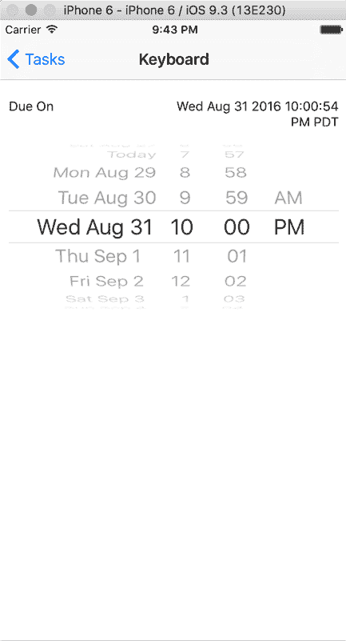
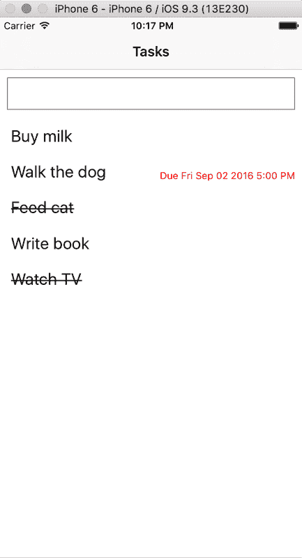

# 第二章：高级功能与待办事项应用程序的样式设计

在为 `Tasks` 应用程序构建了 MVP（最小可行产品）之后，现在是时候深入构建高级功能，并对应用程序进行样式设计，使其看起来更美观。本章将探讨以下主题：

+   利用 `NavigatorIOS` 组件构建一个编辑屏幕，以便添加任务的详细信息

+   使用 `DatePickerIOS` 捕获任务截止日期和时间

+   为我们的应用程序创建一个自定义可折叠组件，并利用 `LayoutAnimation` 来实现流畅的过渡

+   为我们的 UI 构建一个 `Button` 组件，以清除待办事项的截止日期

+   保存已编辑任务的资料，如果适用，则渲染截止日期

+   将应用程序移植到 Android，用 `DatePickerAndroid` 和 `TimePickerAndroid` 替换 `DatePickerIOS`，用 `Navigator` 替换 `NavigatorIOS`，并探索在决定使用哪个组件时的控制流程

# 导航器和 NavigatorIOS

在移动应用程序中实现导航有助于我们控制用户如何与我们的应用程序互动和体验。它让我们为那些原本没有任何上下文的情况赋予上下文——例如，在 `Tasks` 中，向用户展示一个尚未选择的任务的编辑视图是没有意义的；只有当用户选择编辑任务时，才向用户展示此视图，这样可以构建情境上下文和意识。

React Native 的 `Navigator` 组件负责处理应用程序中不同视图之间的转换。浏览文档时，您可能会注意到存在一个 `Navigator` 和 `NavigatorIOS` 组件。`Navigator` 在 iOS 和 Android 上都可用，并使用 JavaScript 实现。另一方面，`NavigatorIOS` 仅适用于 iOS，并且是 iOS 原生 `UINavigationController` 的包装器，它动画化并按照您从任何 iOS 应用程序中期望的方式表现。

在本章的后面部分，我们将更详细地探讨 Navigator。

关于 NavigatorIOS 的重要说明

虽然 `NavigatorIOS` 支持 UIKit 动画，并且是构建 `Tasks` iOS 版本的绝佳选择，但需要记住的是，`NavigatorIOS` 事实上是 React Native SDK 的一个社区驱动组件。Facebook 从一开始就公开表示，它在自己的应用程序中大量使用了 `Navigator`，但 `NavigatorIOS` 组件未来改进和添加的所有支持都将直接来自开源贡献。

# 查看 NavigatorIOS

`NavigatorIOS` 组件在您的 React Native 应用程序的最顶层设置。我们将提供至少一个对象，标识为 `routes`，以便识别我们应用程序中的每个视图。此外，`NavigatorIOS` 会查找一个 `renderScene` 方法，该方法负责渲染我们应用程序中的每个场景。以下是一个使用 `NavigatorIOS` 渲染基本场景的示例：

```js
import React, { Component } from 'react'; 
import { 
  NavigatorIOS, 
  Text 
} from 'react-native'; 

export default class ExampleNavigation extends Component { 
  render () { 
    return ( 
      <NavigatorIOS 
        initialRoute={{ 
          component: TasksList, 
          title: 'Tasks' 
        }} 
        style={ styles.container } 
      /> 
 ); 
  } 
} 

```

这只是一个基本的示例。我们正在初始化 `NavigatorIOS` 组件，并以一个简单的 `text` 组件作为基本路由进行渲染。我们真正感兴趣的是在 `routes` 之间切换以编辑任务。让我们将这个目标分解成一系列更容易处理的子任务：

+   创建一个新的 `EditTask` 组件。它可以从一个带有一些填充信息的简单屏幕开始。

+   设置 `NavigatorIOS` 以在任务长按时路由到 `EditTask`。

+   为 `EditTask` 构建逻辑，使其能够接受作为组件属性的精确任务以渲染特定于任务的数据。添加适当的输入字段，以便此组件可以从编辑屏幕标记为完成，以及具有设置截止日期和标签的能力。

+   当编辑保存时，添加逻辑将编辑后的数据保存到 `AsyncStorage`。

我们将花一些时间来完成每个步骤，并在必要时进行回顾。花几分钟时间构建一个简单的 `EditTask` 组件，然后参考我是如何构建的。

# 一个简单的 EditTasks 组件

在我的应用程序文件夹结构中，我的 `EditTasks` 组件嵌套如下：

```js
|Tasks 
|__android 
|__app 
|____components 
|______EditTask 
|______TasksList 
|______TasksListCell 
|__ios 
|__node_modules 
|__... 

```

这是一个基本的组件，只是为了在屏幕上显示一些内容：

```js
// Tasks/app/components/EditTask/index.js 

import React, { Component } from 'react'; 

import { 
  Text, 
  View 
} from 'react-native'; 

import styles from './styles'; 

export default class EditTask extends Component { 
  render () { 
    return ( 
      <View style={ styles.editTaskContainer }> 
        <Text style={ styles.editTaskText }>Editing Task</Text> 
      </View> 
    ); 
  } 
} 

```

之前的代码现在返回要渲染到屏幕上的文本。

现在是时候设置 `NavigatorIOS` 以与 `TasksList` 顺利协作了：

```js
// Tasks/app/components/EditTask/styles.js 

import { Navigator, StyleSheet } from 'react-native'; 

const styles = StyleSheet.create({ 
  editTaskContainer: { 
    flex: 1, 
    paddingTop: Navigator.NavigationBar.Styles.General.TotalNavHeight 
  }, 
  editTaskText: { 
    fontSize: 36 
  } 
}) 

export default styles; 

```

首先，我们应该修改 `TasksList` 以使其：

+   添加一个名为 `_editTask` 的函数，将 `EditTask` 组件推送到 Navigator

+   将 `_editTask` 函数作为名为 `onLongPress` 的属性传递给 `TasksListCell`

然后，我们应该修改 `EditTask` 以确保其 `render` 方法中的 `TouchableHighlight` 组件在其自己的 `onLongPress` 回调期间调用此属性：

```js
// Tasks/app/components/TasksList/index.js 

... 
import EditTask from '../EditTask'; 
... 
export default class TasksList extends Component { 
  ... 
  render () { 
    ... 
    return ( 
      <View style={ styles.container }> 
        ... 
        <ListView 
          ... 
          automaticallyAdjustContentInsets={ false } 
          style={ styles.listView } 
        /> 
      </View> 
    ); 
  } 

```

我们添加了一个布尔值，用于禁用内容内边距的自动调整。默认设置为 `true`，我们在 `Input` 和 `ListView` 组件之间看到了 `~55px` 的内边距。在我们的组件和 `EditTask` 的样式设置中，我们开始导入 `Navigator` 组件。

这样我们就可以设置容器 `paddingTop` 属性，考虑到导航栏的高度，以便内容不会被留在导航栏后面。这种情况发生的原因是导航栏在组件加载完成后被渲染。

调用 `NavigatorIOS` 的 `push` 方法，渲染我们刚刚导入的 `EditTask` 组件：

```js
  ... 
  _editTask (rowData) { 
    this.props.navigator.push({ 
      component: EditTask, 
      title: 'Edit' 
    }); 
  } 

```

将 `TasksListCell` 分配一个名为 `onLongPress` 的回调，执行我们刚刚定义的 `_editTask` 方法：

```js
  _renderRowData (rowData, rowID) { 
    return ( 
      <TasksListCell 
        ... 
        onLongPress={ () => this._editTask() } 
      /> 
    ) 
  } 
  ... 
} 

```

将 `paddingTop` 属性设置为 Navigator 的高度，解决了我们的导航栏隐藏其后面的应用内容的问题：

```js
// Tasks/app/components/TasksList/styles.js 

import { Navigator, StyleSheet } from 'react-native'; 

const styles = StyleSheet.create({ 
  container: { 
    ... 
    paddingTop: Navigator.NavigationBar.Styles.General.TotalNavHeight 
... 
}); 

export default styles; 

```

# 使用 DatePickerIOS

在`Tasks`中，一个关键特性是能够为任务到期时设置提醒。理想情况下，我们的用户可以为任务完成设定日期和时间，以便他们能够被提醒到期日期。为了实现这一点，我们将使用一个名为`DatePickerIOS`的 iOS 组件。这是一个可以用于我们应用程序中的日期和时间选择器组件。

这里列出了我们将与`DatePickerIOS`组件一起使用的两个属性。如果你感兴趣，React Native 文档中还有其他属性：

+   `date`: 这是两个必需属性之一，用于跟踪当前选定的日期。理想情况下，此信息存储在渲染`DatePickerIOS`组件的状态中。`date`应该是 JavaScript 中的`Date`对象实例。

+   `onDateChange`: 这是另一个必需的属性，当用户在组件中更改`日期`或`时间`时触发。它接受一个参数，即表示新日期和时间的`Date`对象。

下面是一个简单的`DatePicker`组件的示例：

```js
// Tasks/app/components/EditTask/index.js 

... 
import { 
  DatePickerIOS, 
  ... 
} from 'react-native';  
...  
export default class EditTask extends Component { 
  constructor (props) { 
    super (props); 

    this.state = { 
      date: new Date() 
    } 
  } 

```

它创建一个新的 JavaScript `Date`对象实例并将其保存到状态中。

```js
  render () { 
    return ( 
      <View style={ styles.editTaskContainer }> 
        <DatePickerIOS 
          date={ this.state.date } 
          onDateChange={ (date) => this._onDateChange(date) } 
          style={ styles.datePicker } 
        /> 
      </View> 
    ); 
  } 

```

这会导致使用组件状态中的`date`值作为同名的属性来渲染`DatePickerIOS`组件。

当用户与`DatePickerIOS`组件交互时，在组件状态中更改`date`的回调：

```js
  _onDateChange (date) { 
    this.setState({ 
      date 
    }); 
  } 
} 

```

这就是渲染后的`DatePicker`的外观：


这还有许多不足之处。首先，`DatePickerIOS`组件始终可见！通常，当我们在 iOS 应用程序中与这类选择器交互时，它是折叠的，只有当点击时才会展开。我们想要复制的正是这种确切的经验，即渲染一个可触摸的行，显示当前设置的到期日期或类似*未设置到期日期*的内容，当行被点击时，动画展开`DatePickerIOS`。

# 编写可折叠组件

我们的可折叠组件应实现以下目标：

+   当点击时，它应显示和隐藏传递给它的其他组件

+   这个组件将伴随动画，增强我们应用程序的用户体验

+   组件不应对其显示和隐藏的数据类型做出任何假设；它不应严格特定于`DatePickerIOS`，以防我们将来想要将组件用于其他目的

我们需要利用 React Native 的出色`LayoutAnimation` API，该 API 旨在让我们创建流畅且富有意义的动画。

首先，我在项目的`components`文件夹中创建了一个名为`ExpandableCell`的组件，如下所示：

```js
|Tasks 
|__android 
|__app 
|____EditTask 
|____ExpandableCell 
|____TasksList 
|____TasksListCell 
|__ios 
|__... 

```

# 布局动画 API

我们的目标是在`EditTask`中点击`date`/`time`组件，然后使其向下展开以显示隐藏的`DatePickerIOS`组件。React Native 有一个名为`LayoutAnimation`的 API，允许我们创建自动动画布局。

`LayoutAnimation` 包含三个表示默认动画曲线的方法：`easeInEaseOut`、`linear` 和 `spring`。这些决定了动画在其过渡过程中的行为。你可以在 `componentWillUpdate` 生命周期方法下简单地调用这三个方法之一，如果组件状态的变化触发了重新渲染，`LayoutAnimation` 将将其动画添加到你的更改中。

要隐藏和显示传递给 `ExpandableCell` 的子组件，我可以根据组件是否应该显示或隐藏来操作其 `maxHeight` 样式。此外，我可以通过将 `overflow` 属性设置为 `hidden` 来在不需要时隐藏组件。

花些时间隐藏传递给 `ExpandableCell` 的子组件，并设置一些逻辑来根据需要显示和隐藏此内容。准备好后，查看我的实现。

# 基本 ExpandableCell 实现

这是我们开始构建 `ExpandableCell` 的方法：

```js
// Tasks/app/components/ExpandableCell/index.js 

import React, { Component, PropTypes } from 'react'; 

import { 
  LayoutAnimation, 
  Text, 
  TouchableHighlight, 
  View 
} from 'react-native'; 

import styles from './styles'; 

export default class ExpandableCell extends Component {

```

这将 `title` 设置为组件期望的 `PropTypes` 字符串：

```js
  static propTypes = { 
    title: PropTypes.string.isRequired 
  } 

```

现在我们跟踪组件 `state` 中的布尔值 `expanded`。默认情况下，我们的子组件不应可见：

```js
  constructor (props) { 
    super (props); 

    this.state = { 
      expanded: false 
    } 
  } 

```

设置此组件更改时的 `LayoutAnimation` 样式：

```js
  componentWillUpdate () { 
    LayoutAnimation.linear(); 
  } 

```

将 `TouchableHighlight` 组件包裹在 `ExpandableCell` 的 `Text` 组件周围。当按下时，它会调用 `_onExpand` 方法：

```js
  render () { 
    return ( 
      <View style={ styles.expandableCellContainer }> 
        <View> 
          <TouchableHighlight 
            onPress={ () => this._expandCell() } 
            underlayColor={ '#D3D3D3' } 
          > 

```

在组件未展开的情况下，向此 `View` 的样式添加一个 `maxHeight` 属性，使用三元运算符：

```js
            <Text style={ styles.visibleContent }>
            { this.props.title}</Text> 
          </TouchableHighlight> 
        </View> 
        <View style={ [styles.hiddenContent, 
        this.state.expanded ? {} : {maxHeight: 0}]}> 

```

这将渲染组件本身嵌套的任何子组件：

```js
          { this.props.children } 
        </View> 
      </View> 
    ) 
  }

```

以下是一个回调，用于在组件状态中切换 `expanded` 布尔值：

```js
  _expandCell () { 
    this.setState({ 
      expanded: !this.state.expanded 
    }); 
  } 
} 

```

这是 `ExpandableCell` 的样式：

```js
// Tasks/app/components/ExpandableCell/styles.js 

import { StyleSheet } from 'react-native'; 

const styles = StyleSheet.create({ 
  expandableCellContainer: { 
    flex: 1, 
    padding: 10, 
    paddingTop: 0 
  }, 
  hiddenContent: { 
    overflow: 'hidden' 
  }, 
  visibleContent: { 
    fontSize: 24 
  } 
}) 

```

在 `EditTask` 中的基本实现如下所示：

```js
// Tasks/app/components/EditTask/index.js 

... 
import ExpandableCell from '../ExpandableCell'; 

export default class EditTask extends Component { 
  ... 

```

渲染一个带有标题的 ExpandableCell 组件：

```js
render () { 
    return ( 
      <View style={ styles.editTaskContainer }> 
        <ExpandableCell title={ 'Due On' }> 

```

在 `ExpandableCell` 内嵌套 `DatePickerIOS` 以使其最初保持隐藏：

```js
          <DatePickerIOS 
            ... 
          /> 

        </ExpandableCell> 
      </View> 
    ); 
  } 
  ... 
} 

```

理想情况下，此组件将显示以下之一：

+   如果存在，则选择任务的截止日期

+   如果不存在截止日期，则选择日期的空白占位符

我们将在稍后处理诸如清除截止日期等问题，但现在，我们应该修改 `EditTask`，使其传递给 `ExpandableCell` 的 `title` 属性取决于任务是否分配了截止日期。组件当前应该看起来是这样的：


这是解决这个问题的方法。自上一个示例以来，唯一更改的文件是 `EditTask` 组件：

```js
// Tasks/app/components/EditTask/index.js 

... 
import moment from 'moment'; 
... 
export default class EditTask extends Component { 
  ...  
  render () { 
 const noDueDateTitle = 'Set Reminder'; 
    const dueDateSetTitle = 'Due On ' + this.state.formattedDate; 

```

设置两个字符串以显示 `ExpandableCell` 的 `title` 属性。

```js
return ( 
      <View style={ styles.editTaskContainer }> 
        <ExpandableCell 
          title={ this.state.dateSelected ? 
          dueDateSetTitle : noDueDateTitle }> 

```

使用三元运算符来决定传递给 `ExpandableCell` 的字符串。

```js
          ... 
        </ExpandableCell> 
      </View> 
    ); 
  } 

  _formatDate (date) { 
    return moment(date).format('lll'); 
  } 

```

我还从 `npm` 导入了 `moment` 以使用其强大的日期格式化功能。Moment 是一个非常流行、广泛使用的库，它允许我们使用 JavaScript 操作日期。安装它就像打开项目根目录的终端并输入以下内容一样简单：

```js
npm install --save moment      

```

MomentJS 库有很好的文档，其主页位于 [` momentjs.com`](https://www.momentjs.com)，将展示你如何使用它的所有方法。对于这个文件，我使用了 Moment 的格式化方法，并设置为显示缩写月份名称，后跟数字日期和年份，以及时间。

使用 `'lll'` 标志格式化的 Moment 日期示例如下：

```js
Dec 25, 2016 12:01 AM 

```

使用 Moment 格式化日期有不同的方式，我鼓励你玩一玩这个库，找到最适合你的日期格式。

将 `dateSelected` 设置为 `true`，并将日期的 Moment 格式版本添加到状态中，这将反过来触发此组件的 `render` 方法再次更新传递给 `ExpandableCell` 的 `title` 字符串：

```js
  _onDateChange (date) { 
    this.setState({ 
      ... 
      dateSelected: true, 
      formattedDate: this._formatDate(date) 
    }); 
  } 
} 

```

到本节结束时，你的应用应该看起来像以下截图：


# 使用 onLayout

在我们前面的例子中，我们不需要指定 `DatePickerIOS` 组件在展开时的高度。然而，可能存在需要手动获取组件尺寸的场景。

为了计算组件的高度，我们可以利用其 `onLayout` 属性来触发一个回调，然后使用该回调保存传递给回调的属性。`onLayout` 属性是一个在挂载和布局更改时被调用的事件，它给事件对象一个 `nativeEvent` 对象，该对象嵌套了组件的布局属性。以 `DatePickerIOS` 为例，你可以像这样将其 `onLayout` 属性传递一个回调：

```js
<DatePickerIOS 
  date={ this.state.date } 
  onDateChange={ (date) => this._onDateChange(date) } 
  onLayout={ (event) => this._getComponentDimensions(event) } 
  style={ styles.datePicker }  
/> 

```

`onLayout` 事件提供了以下属性：

```js
event: { 
  nativeEvent: { 
    layout: { 
      x: //some number 
      y: //some number 
      width: //some number 
      height: //some number 
    } 
  } 
} 

```

# 按钮

让我们为 `EditTask` 组件构建一个 *清晰的截止日期* 按钮，并且只有当待办事项已选择截止日期时才选择性地启用它。React Native 中的 `Button` 组件应该能帮助我们快速渲染。

`Button` 组件接受一些属性；以下四个将在我们的应用程序中使用：

+   `color`：这是一个字符串（或字符串化的十六进制值），用于设置 iOS 上的文本颜色或 Android 上的背景颜色

+   `disabled`：这是一个布尔值，如果设置为 `true`，则禁用按钮；默认为 `false`

+   `onPress`：这是一个在按钮被按下时触发的回调

+   `title`：这是要在按钮内显示的文本

一个示例 `Button` 组件可以渲染如下：

```js
<Button 
  color={ 'blue' } 
  disabled={ this.state.buttonDisabled } 
  onPress={ () => alert('Submit button pressed') } 
  title={ 'Submit' }  
/> 

```

修改 `EditTask` 以使其具有以下功能：

+   它在其状态中包含一个布尔值，标题为 `expanded`，用于控制 `ExpandableCell` 的打开/关闭状态。

+   它修改了 `ExpandableCell` 的渲染，以接受 `expanded` 和 `onPress` 属性。`expanded` 属性应指向 `EditTask` 状态中的 `expanded` 布尔值，而 `onPress` 属性应触发一个翻转 `expanded` 布尔值的方法。

+   将 `onLayout` 回调添加到 `DatePickerIOS` 以计算其高度，并将其保存到状态中。

+   包含一个具有`title`属性的`Button`组件，提示用户清除截止日期。给它一个`onPress`属性，当按下时会清除状态中的`dateSelected`布尔值。如果`dateSelected`布尔值设置为`false`，则选择性地禁用它。

# 清除截止日期示例

下面是我为了使按钮能够清除选定的日期并展开/折叠我们的单元格以良好地工作所做的事情：

```js
// Tasks/app/components/EditTask/index.js 

... 
import { 
  Button, 
  ... 
} from 'react-native'; 
... 
export default class EditTask extends Component { 
  constructor (props) { 
    ... 
    this.state = { 
      ... 
      expanded: false 
    } 
  } 

  render () { 
    ... 
    return ( 
      <View style={ styles.editTaskContainer }> 
        <View style={ [styles.expandableCellContainer,
        { maxHeight: this.state.expanded ? 
        this.state.datePickerHeight : 40 }]}> 

```

我在`ExpandableCell`周围包裹了一个新的`View`。其样式根据`EditTask`状态中的展开`Boolean`进行修改。如果组件被展开，则其`maxHeight`属性设置为子组件的高度。否则，它被设置为`40`像素。

然后，将`expanded`和`onPress`属性传递给此组件：

```js
          <ExpandableCell 
            ... 
            expanded={ this.state.expanded } 
            onPress={ () => this._onExpand() } 
          > 

```

在`onLayout`事件期间调用`_getDatePickerHeight`：

```js
            <DatePickerIOS 
              ... 
              onLayout={ (event) => this._getDatePickerHeight(event) } 
            /> 
          </ExpandableCell> 
        </View>

```

`Button`组件也被封装在其自己的`View`中。这样做是为了使`Button`和`ExpandableCell`堆叠在一起：

```js
        <View style={ styles.clearDateButtonContainer }> 
          <Button 
            color={ '#B44743' } 
            disabled={ this.state.dateSelected ? false : true } 
            onPress={ () => this._clearDate() } 
            title={ 'Clear Date' } 
          /> 
        </View> 
      </View> 
    ); 
  } 

```

将状态中的`dateSelected`布尔值设置为`false`，更改`ExpandableCell`传递的`title`：

```js
  _clearDate () { 
    this.setState({ 
      dateSelected: false 
    }); 
  } 

```

这将`DatePickerIOS`组件的宽度保存到状态中：

```js
  _getDatePickerHeight (event) { 
    this.setState({ 
      datePickerHeight: event.nativeEvent.layout.width 
    }); 
  } 

  _onExpand () { 
    this.setState({ 
      expanded: !this.state.expanded 
    }); 
  } 
} 

```

我向此组件的`StyleSheet`添加了`clearDateButtonContainer`样式：

```js
// Tasks/app/components/EditTask/styles.js 

import { Navigator, StyleSheet } from 'react-native'; 

const styles = StyleSheet.create({ 
  ... 
  clearDateButtonContainer: { 
    flex: 1 
  } 
}) 

export default styles; 

```

让我们继续工作并在这个屏幕上添加一些更多功能。接下来，我们应该有一个字段来编辑任务名称，紧随其后的是一个用于切换任务完成或不完成状态的`Switch`组件。

# 开关

`Switch`是一个渲染布尔输入并允许用户切换的组件。

使用`Switch`，我们将使用以下属性：

+   `onValueChange`: 这是一个回调，当开关的值改变时，会使用新的开关值被调用

+   `value`: 这是一个布尔值，用于确定开关是否设置为'开启'位置；默认为`false`

一个简单的`Switch`组件可能看起来像这样：

```js
<Switch 
  onValueChange={ (value) =? this.setState({ toggled: value })} 
  value={ this.state.toggled } 
/> 

```

如前所述，`Switch`有两个必需的属性：其`value`和一个当切换时更改其值的回调。

使用这些知识，让我们对`TasksList`组件进行修改，使其将每行的`completed`、`due`、`formattedDate`和`text`属性传递给`EditTask`组件以供使用。

然后，向`EditTask`组件添加一些修改，使其：

+   期望其`propTypes`声明中包含`completed`、`due`、`formattedDate`和`text`属性。

+   包含一个预加载待办事项列表项名称的`TextInput`字段，并允许用户编辑名称。

+   添加一个预加载待办事项列表项完成状态的`Switch`组件。当切换时，其完成状态应改变。

这是我想出的解决方案：

```js
// Tasks/app/components/TasksList/index.js 

...  
export default class TasksList extends Component { 
  ... 
  _editTask (rowData) { 
    this.props.navigator.push({ 
      ... 
      passProps: { 
        completed: rowData.completed, 
        due: rowData.due, 
        formattedDate: rowData.formattedDate, 
        text: rowData.text 
      }, 
      ... 
    }); 
  } 
  ... 
} 

```

将`EditTask`所需的四个字段传递进去，以便视图可以访问渲染待办事项列表项的现有详细信息。如果行不包含这些字段之一或多个，它将传递`undefined`。

声明此组件期望的四个`propTypes`。由于当应用程序创建待办事项列表项时，只有`completed`和`text`是设置的，因此它们被标记为必需属性。

```js
// Tasks/app/components/EditTask/index.js 

import React, { Component, PropTypes } from 'react'; 
... 
import { 
  ... 
  Switch, 
  TextInput, 
  ... 
} from 'react-native'; 
... 
export default class EditTask extends Component { 
  static propTypes = { 
    completed: PropTypes.bool.isRequired, 
    due: PropTypes.string, 
    formattedDate: PropTypes.string, 
    text: PropTypes.string.isRequired 
  } 

  constructor (props) { 
    super (props); 

    this.state = { 
      completed: this.props.completed, 
      date: new Date(this.props.due), 
      expanded: false, 
      text: this.props.text 
    } 
  } 

```

在状态中使用`props`被认为是一种反模式，但在这里我们有很好的理由，因为我们将会作为组件的一部分修改这些属性。

在下一节中，我们还将创建一个保存按钮，以便我们可以保存待办事项的更新详情，因此我们需要在状态中有一个本地可用的数据副本来反映`EditTask`组件的更改。

渲染一个`TextInput`组件来处理更改待办事项列表项的名称：

```js
  render () { 
    ... 
    return ( 
      <View style={ styles.editTaskContainer }> 
        <View> 
          <TextInput 
            autoCorrect={ false } 
            onChangeText={ (text) => this._changeTextInputValue(text) } 
            returnKeyType={ 'done' } 
            style={ styles.textInput } 
            value={ this.state.text } 
          /> 
        </View> 

```

在`ExpandableCell`下方但在清除截止日期`Button`上方渲染`Switch`：

```js
        ... 
        <View style={ styles.switchContainer } > 
          <Text style={ styles.switchText } > 
            Completed 
          </Text> 
          <Switch 
            onValueChange={ (value) => this._onSwitchToggle(value) } 
            value={ this.state.completed } 
          /> 
        </View> 
        ... 
      </View> 
    ); 
  } 

```

以下回调方法更改`TextInput`和`Switch`的值：

```js
  _changeTextInputValue (text) { 
    this.setState({ 
      text 
    }); 
  } 
  ...  
  _onSwitchToggle (completed) { 
    this.setState({ 
      completed 
    }); 
  } 
} 

```

为新组件添加一些样式改进：

```js
// Tasks/app/components/EditTask/styles.js 

import { Navigator, StyleSheet } from 'react-native'; 

const styles = StyleSheet.create({ 
  ... 
  switchContainer: { 
    flex: 1, 
    flexDirection: 'row', 
    justifyContent: 'space-between', 
    maxHeight: 50, 
    padding: 10 
  }, 
  switchText: { 
    fontSize: 16 
  }, 
  textInput: { 
    borderColor: 'gray', 
    borderWidth: 1, 
    height: 40, 
    margin: 10, 
    padding: 10 
  } 
}) 

export default styles; 

```

# 保存按钮

在本节中，我们将在导航栏的右上角创建一个标签为`Save`的按钮。当它被点击时，必须发生以下两件事：

+   用户对待办事项所做的更改（如名称、完成状态和截止日期）必须保存到`AsyncStorage`，覆盖其以前的详细信息

+   `TasksList`必须更新，以便用户能够立即看到他们所做的更改

使用 React Native 渲染`Save`按钮很容易。将被推送到`NavigatorIOS`的对象需要接收以下两个键/值对：

+   `rightButtonTitle`：这是一个字符串，用于显示该区域的文本

+   `onRightButtonPress`：这是一个在按下该按钮时触发的回调

从表面上看，这似乎很简单。然而，我们不能从渲染的子组件传递任何信息到`NavigatorIOS`的`onRightButtonPress`方法。相反，我们必须在我们的`TasksList`组件内部保留我们做出的更改的副本，并在`DatePickerIOS`、`TextInput`和`EditTask`中的`Switch`组件更新时更新它们。

```js
// Tasks/app/components/TasksList/index.js 

... 
export default class TasksList extends Component { 
  constructor (props) { 
    ... 
    this.state = { 
      currentEditedTaskObject: undefined, 
      ... 
    }; 
  } 
  ... 
  _completeTask (rowID) { 
    const singleUpdatedTask = { 
      ...this.state.listOfTasks[rowID], 
      completed: !this.state.listOfTasks[rowID].completed 
    }; 

    this._saveAndUpdateSelectedTask(singleUpdatedTask, rowID); 
  } 

```

这不再是一个异步函数。利用`async`/`await`的部分被拆分为`_saveAndUpdateSelectedTask`。

将当前编辑的任务对象设置为状态：

```js
  _editTask (rowData, rowID) { 
    this.setState({ 
      currentEditedTaskObject: rowData 
    }); 

```

为右按钮添加一个`onRightButtonPress`回调和字符串：

```js
    this.props.navigator.push({ 
      ... 
      onRightButtonPress: () => this._saveCurrentEditedTask(rowID), 
      rightButtonTitle: 'Save', 

```

向`EditTask`传递四个新函数来处理项目的详细信息：

```js
      passProps: { 
        changeTaskCompletionStatus: (status) =>
        this._updateCurrentEditedTaskObject('completed', status), 
        changeTaskDueDate: (date, formattedDate) => 
        this._updateCurrentEditedTaskDueDate
        (date, formattedDate), 
        changeTaskName: (name) => 
        this._updateCurrentEditedTaskObject('text', name), 
        clearTaskDueDate: () => 
        this._updateCurrentEditedTaskDueDate(undefined, undefined), 
      } 
    }); 
  } 

```

为`_editTask`添加参数以接受：

```js
  _renderRowData (rowData, rowID) { 
    return ( 
      <TasksListCell 
        ... 
        onLongPress={ () => this._editTask(rowData, rowID) } 
        ... 
      /> 
    ) 
  } 

```

这是之前在`componentDidMount`中找到的逻辑。由于`_saveCurrentEditedTask`需要调用它，因此将其拆分为自己的函数：

```js
  async _saveAndUpdateSelectedTask (newTaskObject, rowID) { 
    const listOfTasks = this.state.listOfTasks.slice(); 
    listOfTasks[rowID] = newTaskObject; 

    await AsyncStorage.setItem('listOfTasks', 
    JSON.stringify(listOfTasks)); 

    this._updateList(); 
  } 

```

要保存当前编辑的任务，我们将对象和`rowID`传递给`_saveAndUpdateSelectedtask`，然后对导航器调用`pop`：

```js
_saveCurrentEditedTask (rowID) { 
this._saveAndUpdateSelectedTask(this.state.currentEditedTaskObject,
rowID); 
  this.props.navigator.pop(); 
} 

```

此函数更新当前编辑的任务对象的`date`和`formattedDate`：

```js
  _updateCurrentEditedTaskDueDate (date, formattedDate) { 
    this._updateCurrentEditedTaskObject ('due', date); 
    this._updateCurrentEditedTaskObject ('formattedDate', 
    formattedDate); 
  } 

```

以下函数接受一个键和一个值，创建一个带有新值的`currentEditedTaskObject`的克隆，并将其设置在状态中：

```js
  _updateCurrentEditedTaskObject (key, value) { 
    let newTaskObject = Object.assign({}, 
    this.state.currentEditedTaskObject); 

    newTaskObject[key] = value; 

    this.setState({ 
      currentEditedTaskObject: newTaskObject 
    }); 
  } 
  ... 
} 

```

最后两个函数的目的是更新正在编辑的对象的 `TasksList` 本地状态副本。这是出于两个原因：

+   我们对 `EditTask` 所做的任何更新，例如更改名称、完成状态和截止日期，目前都不会传播到其父组件

+   此外，我们不能仅仅将 `EditTask` 中的值指向作为 props 传递的内容，因为 `EditTask` 组件不会在传递给它的 props 发生变化时重新渲染。

`EditTask` 获得了几个更改，包括组件预期的新 `propTypes`：

```js
// Tasks/app/components/EditTask/index.js 

... 
export default class EditTask extends Component { 
  static propTypes = { 
    changeTaskCompletionStatus: PropTypes.func.isRequired, 
    changeTaskDueDate: PropTypes.func.isRequired, 
    changeTaskName: PropTypes.func.isRequired, 
    clearTaskDueDate: PropTypes.func.isRequired, 
    ... 
  } 

```

`EditTask` 收到的更改涉及调用作为 props 传递给它的函数来更新父组件的数据以保存：

```js
  ... 
  render () { 
    ... 
        const dueDateSetTitle = 'Due On ' + 
        this.state.formattedDate || this.props.formattedDate;
    ... 
  } 

  _changeTextInputValue (text) { 
    ...  
    this.props.changeTaskName(text); 
  } 

  _clearDate () { 
    ...  
    this.props.clearTaskDueDate(); 
  } 
  ... 
  _onDateChange (date) { 
    ...  
    this.props.changeTaskDueDate(date, formattedDate); 
  } 
  ... 
  _onSwitchToggle (completed) { 
    ...  
    this.props.changeTaskCompletionStatus(completed); 
  } 
} 

```

# `TasksListCell` 修改

最后，我们希望编辑由我们的 `ListView` 渲染的每一行，以显示截止日期（如果存在）。

为了做到这一点，我们将不得不编写一些条件逻辑来显示格式化的日期，如果分配给我们要渲染的任务项，这将也是一个创建自定义 `styles` 文件夹的好时机，因为我们将需要它。

花些时间创建您版本的此功能。我的解决方案如下：

```js
// Tasks/app/components/TasksListCell/index.js 

... 
import styles from './styles'; 

```

您可能会注意到上面的导入语句中，`TasksListCell` 现在导入了它的 `StyleSheet`。

将 `formattedDate` 添加到 `propTypes` 中作为可选字符串：

```js
export default class TasksListCell extends Component { 
  static propTypes = { 
    ... 
    formattedDate: PropTypes.string, 
  } 

... 
  render () { 
    ... 
    return ( 
      <View style={ styles.tasksListCellContainer }> 
        <TouchableHighlight 
          ... 
        > 
          <View style={ styles.tasksListCellTextRow }> 
            <Text style={ [styles.taskNameText, 
            { textDecorationLine: isCompleted }] }> 
              { this.props.text } 
            </Text>

```

调用 `_getDueDate` 来渲染截止日期的字符串，如果存在：

```js
            <Text style={ styles.dueDateText }> 
              { this._getDueDate() } 
            </Text> 
          </View> 
        </TouchableHighlight> 
      </View> 
    ) 
  } 

_getDueDate () { 
    if (this.props.formattedDate && !this.props.completed) { 
      return 'Due ' + this.props.formattedDate; 
    } 

    return ''; 
  } 
} 

```

此组件已被修改以支持显示截止日期的第二行文本，但前提是它存在。

逻辑设置为仅在任务未标记为完成时显示截止日期，这样用户就不会在看到他们已经完成的任务的截止日期时感到困惑。

此外，还添加了样式以使两行显示在同一行：

```js
// Tasks/app/components/TasksListCell/styles.js 

import { StyleSheet } from 'react-native'; 

const styles = StyleSheet.create({ 
  dueDateText: { 
    color: 'red', 
    flex: 1, 
    fontSize: 12, 
    paddingTop: 0, 
    textAlign: 'right' 
  }, 
  taskNameText: { 
    fontSize: 20 
  }, 
  tasksListCellContainer: { 
    flex: 1 
  }, 
  tasksListCellTextRow: { 
    flex: 1 
  } 
}); 

export default styles;  

```

这就是它的样子：



到目前为止，这是一个相当不错的应用程序，您将能够使用我们在下一个项目中获得的技能对其进行更多改进。随着我们结束这个项目，我想将您的注意力转向我经常收到的问题：

我们如何在 Android 上做这件事？

这是一个很好的问题，我们将在本书每个项目的末尾进行探索。我将假设您已经设置了您的开发环境，以便在 React Native 中开发 Android 应用。如果没有，请在继续之前先做这件事。如果您对开发 Android 没有兴趣，请随意跳过这部分内容，继续下一章！

# 修改 Android 任务

首先，我们需要在我们的应用的 `Android` 文件夹下创建一个新的 `local.properties` 文件，并指向 Android SDK 目录。添加以下行，其中 `USERNAME` 是您的机器用户名：

```js
// Tasks/android/local.properties 

sdk.dir = /Users/USERNAME/Library/Android/sdk 

```

如果您的 Android SDK 安装在与前一个示例不同的位置，您需要修改此文件以指向正确的位置。

然后，启动一个**Android 虚拟设备**（**AVD**），在项目根目录下执行`react-native run-android`命令。您将看到以下屏幕，这与我们最初为 iOS 构建`Tasks`时的默认模板看起来几乎一样：



在 Android 上工作时，按`RR`重新加载应用，并使用*Command* + *M*进入开发者菜单。

您可能会发现，当远程 JS 调试开启时，从简单事物（如`TouchableHighlight`阴影和导航）的动画可能会非常缓慢。在撰写本文时，一些技术解决方案正在被提出以解决这个问题，但在此期间，强烈建议您根据需要启用和禁用远程 JS 调试。

# 导航器

`Navigator`组件的工作方式与其原生 iOS 组件略有不同，但它仍然非常强大。使用`Navigator`的一个变化是，您的路由应该明确定义。我们可以通过设置路由数组并根据我们访问的路由渲染特定的场景来实现这一点。以下是一个示例：

```js
export default class Tasks extends Component { 
  render () { 
    const routes = [ 
      { title: 'First Component', index: 0 }, 
      { title: 'Second Component', index: 1 } 
    ]; 

```

创建一个`routes`数组，如前述代码所示。

您可能会注意到，我们从一开始就明确定义了我们的路由，设置了一个初始路由，然后在这里将属性传递给每个路由的组件：

```js
    return ( 
      <Navigator 
        initialRoute={{ index: 0 }} 
        renderScene={ (routes, navigator) => 
        this._renderScene(routes, navigator) } /> 
    ) 
  } 

```

传递给`_renderScene`的路由对象包含一个`passProps`对象，我们可以在推送导航时设置它。

在将组件推送到`Navigator`时，我们不传递组件，而是传递一个`index`；这是`Navigator`的`_renderScene`方法确定要向用户显示哪个场景的地方。以下是推送`Navigator`的方式：

```js
    _renderScene (route, navigator) { 
      if (route.index === 0) { 
        return ( 
          <FirstComponent 
            title={ route.title } 
            navigator={ navigator } /> 
        ) 
    } 

    if (route.index === 1) { 
      return ( 
        <SecondComponent 
         navigator={ navigator } 
         details={ route.passProps.details } /> 
      ) 
    } 
  } 
} 

```

这是我们使用导航器组件推送不同路由的方式。请注意，与`NavigatorIOS`中传递组件的方式不同，我们传递的是路由的索引：

```js
  _renderAndroidNavigatorView () { 
    this.props.navigator.push({ 
      index: 1, 
      passProps: { 
        greeting: 'Hello World' 
      } 
    }); 
  } 

```

如果您将此与我们在 iOS 中渲染`EditTask`的方式进行比较，您会注意到我们根本就没有设置导航栏。Android 应用通常通过`Drawer`和`ToolbarAndroid`组件的组合来处理导航，我们将在稍后的项目中解决这些问题。这将帮助我们的应用看起来和感觉就像任何 Android 应用一样。

# 导航器示例

以下代码是导航器的示例：

```js
// index.android.js

import React, { Component } from 'react'; 
import { 
  AppRegistry, 
  Navigator, 
} from 'react-native'; 

import TasksList from './app/components/TasksList'; 
import EditTask from './app/components/EditTask'; 

class Tasks extends Component { 

  render () { 
    const routes = [ 
      { title: 'Tasks', index: 0 }, 
      { title: 'Edit Task', index: 1 } 
    ]; 

```

再次，为我们的应用建立路由。

```js
    return ( 
      <Navigator 
        initialRoute={{ index: 0}} 
        renderScene={ (routes, navigator) =>
        this._renderScene(routes, navigator) }/> 
    ); 
  } 

```

导入`Navigator`组件并为用户渲染它。它从`index:``0`开始，返回`TasksList`组件。

如果索引是`0`，则返回`TasksList`。这是默认的`route`：

```js
  _renderScene (route, navigator) { 
    if (route.index === 0) { 
      return ( 
        <TasksList 
          title={ route.title } 
          navigator={ navigator } /> 
      ) 
    } 

```

如果路由索引是 1，则返回`EditTask`。它将通过`passProps`方法接收上述属性：

```js
    if (route.index === 1) { 
      return ( 
        <EditTask 
          navigator={ navigator } 
          route={ route } 
          changeTaskCompletionStatus={ 
          route.passProps.changeTaskCompletionStatus } 
          changeTaskDueDate={ route.passProps.changeTaskDueDate } 
          changeTaskName={ route.passProps.changeTaskName } 
          completed={ route.passProps.completed } 
          due={ route.passProps.due } 
          formattedDate={ route.passProps.formattedDate } 
          text={ route.passProps.text } 
        /> 
      ) 
    } 
  } 
} 

AppRegistry.registerComponent('Tasks', () => Tasks); 

```

在这个阶段，无需进行进一步修改，我们就可以创建新的待办事项并将它们标记为已完成。然而，由于`Navigator`组件的推送方法接受的参数与 iOS 的推送方法不同，我们将在`TasksList`文件中创建一些条件逻辑来适应它。

# 平台

当你的文件在 iOS 和 Android 功能之间的差异很小，使用相同的文件是可以的。利用`Platform` API，我们可以识别用户所使用的移动设备类型，并条件性地将他们引导到特定的路径。

与你的其他 React Native 组件一起导入`Platform` API：

```js
import { Platform } from 'react-native';  

```

然后在组件中调用其`OS`属性：

```js
  _platformConditional () { 
    if (Platform.OS === 'ios') { 
      doSomething(); 
    } 

    if (Platform.OS === 'android') { 
      doSomethingElse(); 
    } 
  } 

```

这使我们能够控制应用所走的路径，并允许进行一些代码复用。

Android 特定文件如果需要创建一个仅在 Android 设备上运行的文件，只需将其命名为`<FILENAME>.android.js`，就像两个索引文件一样。React Native 将确切知道要构建哪个文件，这让我们能够在需要添加大量逻辑而一个通用的`index.js`文件无法处理时创建特定平台的组件。将文件命名为`<FILENAME>.ios.js`以设置 iOS 特定文件。

使用`Platform` API，我们可以创建条件逻辑来决定`Navigator`应根据用户的平台如何推送下一个组件。导入`Platform` API：

```js
// Tasks/app/components/TasksList/index.js 

... 
import { 
  ... 
  Platform, 
  ... 
} from 'react-native'; 

```

根据用户的平台修改`TextInput`的样式，使其具有与其平台相呼应的设计语言。在 Android 上，它通常显示为没有边框的单条下划线；因此，我们在该组件的 Android 特定样式中消除了边框：

```js
... 
export default class TasksList extends Component { 
  ... 
  render () { 
  ... 
    return ( 
      <View style={ styles.container }> 
        <TextInput 
          ... 
          style={ Platform.os === 'IOS' ? styles.textInput :
          styles.androidTextInput } 
          ... 
        /> 
        ... 
      </View> 
    ); 
  } 

```

我将`_editTask`函数改为运行条件逻辑。如果我们的平台是 iOS，我们调用`_renderIOSEditTaskComponent`；否则，我们的平台必须是 Android，我们调用`_renderAndroidEditTaskComponent`代替：

```js
  _editTask (rowData, rowID) { 
    ...  
    if (Platform.OS === 'ios') { 
      return this._renderIOSEditTaskComponent(rowID); 
    } 

    return this._renderAndroidEditTaskComponent(rowID); 
  } 

  _renderAndroidEditTaskComponent (rowID) { 
    this.props.navigator.push({ 
      index: 1, 
      passProps: { 
        changeTaskCompletionStatus: (status) => 
        this._updateCurrentEditedTaskObject('completed', status), 
        changeTaskDueDate: (date, formattedDate) =>
        this._updateCurrentEditedTaskDueDate(date, formattedDate), 
        changeTaskName: (name) => 
        this._updateCurrentEditedTaskObject('text', name), 
        clearTaskDueDate: () => 
        this._updateCurrentEditedTaskDueDate(undefined, undefined), 
        completed: this.state.currentEditedTaskObject.completed, 
        due: this.state.currentEditedTaskObject.due, 
        formattedDate: 
        this.state.currentEditedTaskObject.formattedDate, 
        text: this.state.currentEditedTaskObject.text 
      } 
    }) 
  } 

```

上述代码将`EditTask`的`index`推送到导航器。它传递了 iOS 版本的应用之前传递的相同属性。

`_renderIOSEditTaskComponent`的内容与`_editTask`之前包含的内容相同：

```js
  _renderIOSEditTaskComponent (rowID) { 
    this.props.navigator.push({ 
      ... 
    }); 
  } 
  ... 
} 

```

在以下代码中，我们为`TextInput`添加了一个自定义的 Android 样式，省略了边框：

```js
// Tasks/app/components/EditTask/styles.js 

... 
const styles = StyleSheet.create({ 
  androidTextInput: { 
    height: 40, 
    margin: 10, 
    padding: 10 
  }, 
  ... 
}); 

```

# DatePickerAndroid 和 TimePickerAndroid

在 Android 上设置时间和日期与 iOS 大不相同。在 iOS 上，你有一个包含日期和时间的`DatePickerIOS`组件。在 Android 上，这被分为两个原生模态，`DatePickerAndroid`用于日期，`TimePickerAndroid`用于时间。它不是一个用于渲染的组件，而是一个异步函数，它打开模态并等待自然结束，然后再应用逻辑。

要打开其中一个，将其包裹在一个异步函数中：

```js
async renderDatePicker () { 
  const { action, year, month, day } = await DatePickerAndroid.open({ 
    date: new Date() 
  }); 

  if (action === DatePickerAndroid.dismissedAction) { 
    return; 
  } 

  // do something with the year, month, and day here 
} 

```

`DatePickerAndroid`和`TimePickerAndroid`组件都返回一个对象，我们可以通过使用 ES6 解构赋值来获取每个对象的属性，如前一个片段所示。

由于这些组件默认将渲染为模态，所以我们也没有必要使用为 iOS 版本的应用构建的`ExpandableCell`组件。为了实现 Android 特定的日期和时间选择器，我们应该创建一个处理此功能的 Android 特定`EditTask`组件。

而不是扩展单元格，我们应该创建另一个 `Button` 组件来打开和关闭对话框。

在下一节给出的示例中，我克隆了 `EditTask` 的 iOS `index.js` 文件，并将其重命名为 `index.android.js`，然后再对其进行修改。省略了未从 iOS 版本更改的任何代码。已删除的内容也已注明。

# DatePickerAndroid 和 TimePickerAndroid 示例

从导入语句中移除 `DatePickerIOS` 和 `ExpandableCell`：

```js
// Tasks/app/components/EditTask/index.android.js 

... 
import { 
  ... 
  DatePickerAndroid, 
  TimePickerAndroid, 
} from 'react-native'; 
... 

```

我已从该组件的 `constructor` 函数中移除了状态中的 `expanded` 布尔值：

```js
export default class EditTask extends Component { 
  ... 

```

这个新的 `DatePicker` 按钮在按下时会调用 `_showAndroidDatePicker`。它放置在 `TextInput` 下方并替换了 `ExpandableCell`：

```js
  render () { 
    ... 
    return ( 
      <View style={ styles.editTaskContainer }> 
        ... 
        <View style={ styles.androidButtonContainer }> 
          <Button 
            color={ '#80B546' } 
            title={ this.state.dateSelected ? dueDateSetTitle : 
            noDueDateTitle } 
            onPress={ () => this._showAndroidDatePicker() } 
          /> 
        </View> 

```

清除截止日期的 `Button` 没有发生变化，但其样式已更改：

```js
        <View style={ styles.androidButtonContainer }> 

        </View> 
      </View> 
    ); 
  }

```

一个异步函数在 `DatePickerAndroid` 上调用 `open`，提取 `action`、`year`、`month` 和 `day`，将它们设置为状态，然后调用 `_showAndroidTimePicker`：

```js
  async _showAndroidDatePicker () { 
    const options = { 
      date: this.state.date 
    }; 

    const { action, year, month, day } = await 
    DatePickerAndroid.open(options); 

    if (action === DatePickerAndroid.dismissedAction) { 
      return; 
    } 

    this.setState({ 
      day, 
      month, 
      year 
    }); 

    this._showAndroidTimePicker(); 
  } 

```

以下是我们之前用于 `_showAndroidDatePicker` 的相同策略，但在最后调用 `_onDateChange`：

```js
  async _showAndroidTimePicker () { 
    const { action, minute, hour } = await TimePickerAndroid.open(); 

    if (action === TimePickerAndroid.dismissedAction) { 
      return; 
    } 

    this.setState({ 
      hour, 
      minute 
    }); 

    this._onDateChange(); 
  } 

```

使用 `DatePickerAndroid` 和 `TimePickerAndroid` 返回的五个组合值创建一个新的 `Date` 对象：

```js
  ... 
  _onDateChange () { 
    const date = new Date(this.state.year, this.state.month, 
    this.state.day, this.state.hour, this.state.minute); 
    ... 
  }
  ... 
} 

```

我已移除 `_getDatePickerHeight` 和 `_onExpand`，因为它们与 `EditTask` 的部分相关，这些部分在 `Android` 版本的 app 中不可用。我还为此组件添加了一些样式更改：

```js
// Tasks/app/components/EditTask/styles.js 

... 
const styles = StyleSheet.create({ 
  androidButtonContainer: { 
    flex: 1, 
    maxHeight: 60, 
    margin: 10 
  }, 
  ... 
  textInput: { 
    height: 40, 
    margin: 10, 
    padding: 10 
  } 
}); 

```

# 保存更新

由于我们不在 Android 版本的 app 中使用导航栏，我们应该创建一个处理相同保存逻辑的保存按钮。

首先，我们应该修改 `index.android.js` 以将 `saveCurrentEditedTask` 属性从 `TasksList` 组件传递给 `EditTask`：

```js
// index.android.js

... 
class Tasks extends Component { 
  ... 
  _renderScene (route, navigator) { 
    ... 
    if (route.index === 1) { 
      return ( 
        <EditTask 
          ... 
          saveCurrentEditedTask={ route.passProps
          .saveCurrentEditedTask } 
          ... 
        /> 
      ) 
    } 
  } 
} 

```

然后，修改 `TasksList` 以在 `_renderAndroidEditTaskComponent` 中将 `_saveCurrentEditedTask` 方法传递给 `EditTask`：

```js
// Tasks/app/components/TasksList/index.js 

... 
export default class TasksList extends Component { 
  ... 
  _renderAndroidEditTaskComponent (rowID) { 
    this.props.navigator.push({ 
      ... 
      passProps: { 
        ... 
        saveCurrentEditedTask: () => 
        this._saveCurrentEditedTask(rowID), 
        ... 
      } 
    }) 
  } 
  ... 
} 

```

在此之后，修改 `EditTask` 的 Android 版本以包含一个新按钮，当按下时会调用其 `saveCurrentEditedTask` 方法：

```js
// Tasks/app/components/EditTask/index.android.js 

... 
export default class EditTask extends Component { 
  static propTypes = { 
    ... 
    saveCurrentEditedTask: PropTypes.func.isRequired, 
    ... 
  } 

  render () { 
    ... 
    return ( 
      <View style={ styles.editTaskContainer }> 
        ... 
        <View style={ styles.saveButton }> 
          <Button 
            color={ '#4E92B5' } 
            onPress={ () => this.props.saveCurrentEditedTask() } 
            title={ 'Save Task' } 
          /> 
        </View> 
      </View> 
    ); 
  } 
  ... 
} 

```

最后，使用新的 `saveButton` 属性添加一些样式：

```js
// Tasks/app/components/EditTask/styles.js 

import { Navigator, StyleSheet } from 'react-native'; 

const styles = StyleSheet.create({ 
  ... 
  saveButton: { 
    flex: 1, 
    marginTop: 20, 
    maxHeight: 70, 
  }, 
  ... 
}); 

```

# BackAndroid

我们需要处理的最后一件事是返回按钮。每个 Android 设备上都有一个通用的返回按钮，无论是硬件还是软件实现。我们需要使用 `BackAndroid` API 来检测返回按钮的按下并设置我们自己的自定义功能。如果我们不这样做，每次按下返回按钮时，应用程序都会自动关闭。

要使用它，我们可以在 `componentWillMount` 生命周期事件中添加一个事件监听器，当检测到返回按钮按下时会弹出导航器。我们还可以在组件卸载时移除监听器。

在 `componentWillMount` 期间，向 `BackAndroid` API 添加一个 `hardwareButtonPress` 事件的事件监听器，当触发时调用 `_backButtonPress`：

```js
// Tasks/app/components/EditTask/index.android.js 

... 
import { 
  BackAndroid, 
  ... 
} from 'react-native'; 
... 
export default class EditTask extends Component { 
  ... 
  componentWillMount () { 
    BackAndroid.addEventListener('hardwareButtonPress', () => 
    this._backButtonPress()); 
  } 

```

如果组件被卸载，则移除相同的监听器：

```js
  componentWillUnmount () { 
    BackAndroid.removeEventListener('hardwareButtonPress', () => 
    this._backButtonPress()) 
  } 

```

使用 `_backButtonPress` 在导航器上调用 `pop`：

```js
  ... 
  _backButtonPress () { 
    this.props.navigator.pop(); 
    return true; 
  } 
  ... 
} 

```

# 摘要

这是一章很长的内容！我们完成了很多事情。首先，我们使用`NavigatorIOS`来建立自定义路由，并创建了一个组件来编辑待办事项的详细信息，包括将其标记为已完成和添加截止日期。

然后，我们构建了一个具有流畅动画的自定义、可重用组件，用于展开和折叠子组件，使得`DatePickerIOS`可以根据需要展开和折叠。之后，我们实现了逻辑，以便使用导航栏保存我们对任务所做的更改。

我们还将我们的应用程序移植到支持 Android 操作系统！我们首先将`NavigatorIOS`替换为`Navigator`，使用`Platform` API 根据用户所使用的移动设备类型触发条件逻辑，并通过在每个索引文件后附加`.android`和`.ios`来创建 iOS 和 Android 特定的组件。

我们通过在 Android 上渲染日期和时间选择器完成了对 Android 的移植，这两个选择器是两个独立的弹出窗口，并在我们特定的`EditTask`组件内创建了一个保存按钮，以便我们的用户可以保存他们所做的更改。最后，通过使用`BackAndroid` API 监听返回按钮的点击，允许我们的用户从编辑待办事项返回到待办事项列表屏幕，而不是完全离开应用程序。
