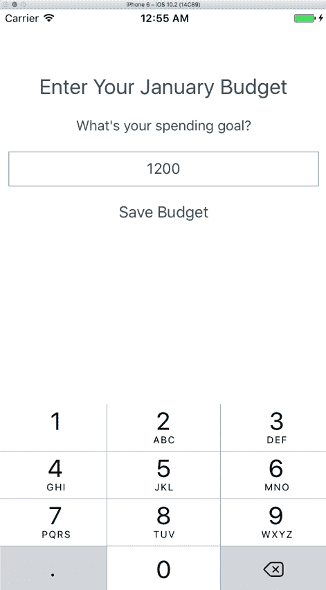
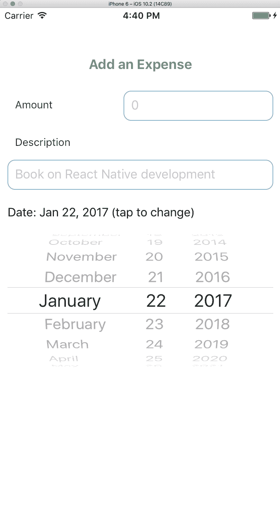
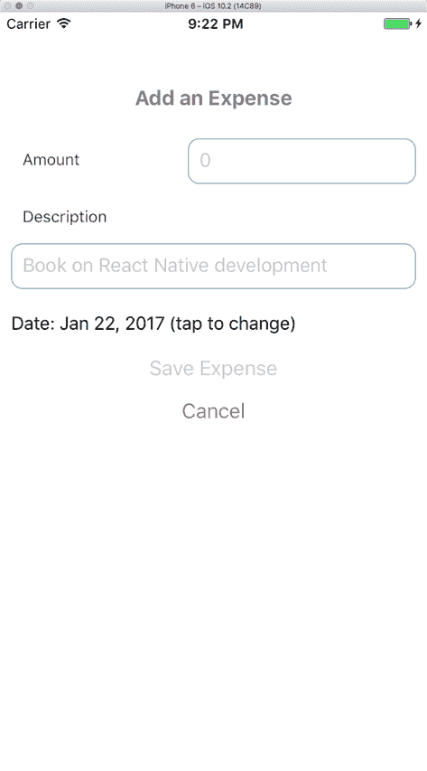

# 第三章：我们的第二个项目 - 预算应用

在过去，我发现保持月度预算是一件困难的事情。对于我们的第二个项目，我们将构建一个应用程序，通过让我们设定一个月内希望花费的目标来跟踪我们的预算，然后允许我们进入应用程序并按简单标签分类支出。在任何时候，我们都可以查看我们这个月的进度并查看我们前几个月的结果。

在本章中，我们将涵盖以下主题：

+   规划我们的第二个应用程序，`Expenses`

+   为 React Native 安装流行的矢量图标库

+   构建一系列将在我们的应用中使用的辅助方法

+   创建一个允许我们输入支出的模态窗口

+   渲染当前月份的列表，显示月份的进度

# 开始

像往常一样，让我们通过在命令行中使用以下语句来初始化一个新的 React Native 项目：

```js
    react-native init Expenses

```

当 React Native CLI 在构建我们的项目时，我们应该规划出应用程序的功能。

# 应用程序规划

一旦这个应用完成，我们希望它能够以下方式运行：

+   当应用程序启动时，如果尚未设置该月的预算，它应该要求用户输入他们的月度目标并将其保存在`AsyncStorage`中。

+   一旦设置了该月的预算，用户应看到一个包含添加该月支出按钮的屏幕。

+   点击该按钮后，用户应看到一个模态窗口，允许他们输入支出的详细信息：名称、金额、购买日期以及一个用于分类项目的图标。该模态窗口应允许用户取消或保存他们所做的条目。

+   如果保存了支出，它应该在主屏幕上的列表中渲染，该列表包含添加更多支出的按钮。

+   此列表还应突出显示用户为该月设定的预算，以及一个进度指示器，显示他们离达到预算有多近。

+   应用程序还应包含一个第二个标签页，用户可以在其中查看他们前几个月的历史记录。

+   用户应能够向任何月份添加支出，并删除任何支出。

在这个项目的第一部分，我们将处理列表的上半部分。

让我们先安装矢量图标库，因为我们将在这个应用中使用它。

# 安装矢量图标

React Native 最受欢迎的矢量图标库之一是`react-native-vector-icons`。它包含来自不同来源的大量图标，包括 FontAwesome 和谷歌的 Material 图标库。

安装这个矢量图标库需要几个步骤，但我们将首先将其下载：

```js
    npm install react-native-vector-icons --save

```

现在它已经作为一个模块安装，但我们仍然需要将其链接到我们的项目，以便这个应用知道在哪里查找文件。这是因为我们构建的每个应用程序都不会利用 iOS 和 Android 平台的所有原生功能。包括支持所有可想象的原生功能的二进制文件将增加我们应用程序的大小；相反，任何依赖于原生 iOS 和 Android 代码的组件都必须手动链接到我们的应用程序，从而让我们的应用程序能够访问这些代码片段。

链接这个矢量图标库的简单方法是以下命令行：

```js
    react-native link

```

之前的命令将自动将具有原生依赖关系的库链接到您的项目。

# 文件夹结构

以下结构包括我们将在这个章节中构建的组件：

```js
|Expenses 
|__app 
|____components 
|______AddExpenses 
|______AddExpensesModal 
|______CurrentMonthExpenses 
|______EnterBudget 
|______ExpandableCell 
|______ExpenseRow 
|____utils 
|______dateMethods.js 
|______storageMethods.js 
|____App.js 
|____styles.js 
|__ios 
|__index.ios.js 

```

# 工具

`utils` 文件夹存储了我们将要在我们的应用程序中使用的辅助方法。`dateMethods` 处理我们将要使用以获取日期不同部分的不同方法，而 `storageMethods` 处理对 `AsyncStorage` 的访问。

我们从应用程序规划中的第一个要点开始，当应用程序启动时，如果尚未设置本月的预算，应该提示用户输入他们的月度目标并将其保存到 `AsyncStorage`。

根据前面的意图，我们想要做以下事情：

+   获取当前月份和年份

+   从 `AsyncStorage` 中检索存储我们费用的对象，并检查月份和年份以检查是否已设置预算

+   如果还没有，那么提示用户输入本月的预算并将其保存到 `AsyncStorage`

让我们创建一些处理日期的辅助方法。

# 日期方法

这些是 `dateMethods.js` 文件应该包含的内容：

+   一个将月份数字映射到其名称的对象

+   四个方法获取日期的不同部分。每个方法都应该接受一个可选的日期对象，如果没有传入，则创建一个新的 `Date` 对象实例：

    +   `getYear`: 这个方法获取年份数字并返回其字符串形式

    +   `getMonth`: 这个方法获取月份数字并将其作为字符串返回

    +   `getDay`: 这个方法获取天数字并将其作为字符串返回

    +   `getMonthString`: 这个方法使用之前创建的对象返回月份的名称

这就是我的 `dateMethods` 文件在完成前面的要点后的样子。这是一个将月份数字映射到月份字符串名称的对象：

```js
// Expenses/app/utils/dateMethods.js

const monthNames = { 
  1: 'January', 
  2: 'February', 
  3: 'March', 
  4: 'April', 
  5: 'May', 
  6: 'June', 
  7: 'July', 
  8: 'August', 
  9: 'September', 
  10: 'October', 
  11: 'November', 
  12: 'December' 
} 

```

下一个方法获取当前年份并将其作为字符串返回：

```js
export const getYear = (date) => { 
  date = date || new Date(); 
  return date.getFullYear().toString(); 
}

```

这个方法获取当前月份（零索引）并返回它是第几个月：

```js
export const getMonth = (date) => { 
  date = date || new Date(); 
  const zeroIndexedMonth = date.getMonth(); 
  return (zeroIndexedMonth + 1).toString(); 
}

```

下一个方法获取天并将其作为字符串返回：

```js
export const getDay = (date) => { 
  date = date || new Date(); 
  return date.getDate().toString(); 
}

```

这个方法根据月份的数字返回月份的名称：

```js
export const getMonthString = (monthInt) => { 
  if (typeof monthInt === 'string') { 
    monthInt = parseInt(monthInt); 
  } 

  return monthNames[monthInt]; 
} 

```

现在，是时候创建一些方法来访问 `AsyncStorage`。

# 存储方法

我们将在应用程序中存储的 `listOfExpenses` 将是一个多层对象。

从视觉上看，我们将构建成这样：

```js
listOfExpenses = { 
  2017: { 
    01: { 
      budget: 500, 
      expenses: [ 
        { 
          amount: '4', 
          category: 'Coffee', 
          date: 'Jan 12, 2017' 
          description: 'Latte @ Coffeeshop' 
        }, 
        { 
          amount: '1.50', 
          category: 'Books', 
          date: 'Jan 17, 2017' 
          description: 'Sunday Newspaper' 
        } 
      ] 
    } 
  } 
} 

```

我们想要为存储创建的方法涉及以下内容：

+   `getAsyncStorage`: 这将检索`AsyncStorage`中的支出列表

+   `setAsyncStorage`: 接受一个对象并将其保存到`AsyncStorage`中作为支出列表

+   `checkCurrentMonth`: 这个方法允许我们接受一个月份和年份作为字符串化的数字，并找出是否为该月份和年份设置了预算，如果没有设置，则返回`false`，如果设置了，则返回预算

+   `saveMonthlyBudget`: 接受一个月份和年份作为字符串化的数字和一个预算作为数字，然后创建该`month`对象并将其存储在我们的支出列表中的正确年份，最后将其保存到`AsyncStorage`中

+   `saveExpenseToMonth`: 接受一个月份和年份作为字符串化的数字以及一个单独的`expense`对象，然后将其保存到该月份和年份的预算中

+   `resetAsyncStorage`: 这是一个特定于开发的方法，它将清除`AsyncStorage`中的数据，这样我们就可以在我们需要的时候清除我们的列表

+   `logAsyncStorage`: 这是一个特定于开发的方法，用于记录当前存储在`AsyncStorage`中的对象，这样我们就可以在需要时查看它

从 React Native 导入`AsyncStorage` API 和`dateMethods`实用文件：

```js
// Expenses/app/utils/storageMethods.js

import { AsyncStorage } from 'react-native'; 

import * as dateMethods from './dateMethods';

```

获取存储中键为`expenses`的对象并返回它：

```js
 export const getAsyncStorage = async () => { 
  let response = await AsyncStorage.getItem('expenses'); 
  let parsedData = JSON.parse(response) || {}; 

  return parsedData; 
}

```

用作为参数传递的对象覆盖存储中的`expenses`对象：

```js
 export const setAsyncStorage = (expenses) => { 
  return AsyncStorage.setItem('expenses', JSON.stringify(expenses)); 
}

```

从`dateMethods`获取`month`和`year`，然后从存储中获取`expenses`对象。如果该对象不存在或没有给定年份和/或月份的数据，则返回`false`，否则返回预算：

```js
export const checkCurrentMonthBudget = async () => {
  let year = dateMethods.getYear();
  let month = dateMethods.getMonth();

  let response = await getAsyncStorage();

  if (response === null || !response.hasOwnProperty(year) || 
  !response[year].hasOwnProperty(month)) {
    return false;
  }

  return response[year][month].budget;
}

```

在`saveMonthlyBudget`中，我们获取`expenses`对象，然后检查结果是否存在；这样我们就可以在需要时用默认的空对象初始化`AsyncStorage`，这对于之前还没有在应用中输入数据的用户来说很重要：

```js
 export const saveMonthlyBudget = async (month, year, budget) => { 
  let response = await getAsyncStorage(); 

  if (!response.hasOwnProperty(year)) { 
    response[year] = {}; 
  } 

  if (!response[year].hasOwnProperty(month)) { 
    response[year][month] = { 
      budget: undefined, 
      expenses: [], 
      spent: 0 
    } 
  } 

  response[year][month].budget = budget; 

  await setAsyncStorage(response); 

  return; 
} 

```

我们还沿途进行检查，看我们的`expenses`对象是否有与传递给它的特定年份相关的对象，然后是否该`year`对象指向我们指向的特定`month`；如果没有，我们创建它。在设置包含输入的`budget`、`expenses`数组和已花费的金额（默认为零）的`month`对象后，我们将其直接保存回`AsyncStorage`。

以下代码调用`setAsyncStorage`并传递一个空对象，从而清除`expenses`对象：

```js
export const resetAsyncStorage = () => { 
  return setAsyncStorage({}); 
}

```

从存储中获取`expenses`对象并将其记录到控制台：

```js
export const logAsyncStorage = async () => { 
  let response = await getAsyncStorage(); 

  console.log('Logging Async Storage'); 
  console.table(response); 
}

```

# App.js 和 index.ios.js

`App.js`将作为我们应用导航的初始路由。它将处理决定是否显示当前月份的支出或提示输入该月预算的逻辑

根目录下的`index.ios.js`文件将按照与本书第一个项目`Tasks`中结构化的方式修改：

```js
// Expenses/index.ios.js 

import React, { Component } from 'react'; 
import { 
  AppRegistry, 
  NavigatorIOS, 
  StyleSheet 
} from 'react-native'; 

import App from './app/App'; 

export default class Expenses extends Component { 
  render() { 
    return ( 
      <NavigatorIOS 
        initialRoute={{ 
          component: App, 
          title: 'Expenses' 
        }} 
        style={ styles.container } 
      /> 
    ); 
  } 
} 

const styles = StyleSheet.create({ 
  container: { 
    flex: 1, 
  } 
}); 

AppRegistry.registerComponent('Expenses', () => Expenses); 

```

现在，让我们创建`App.js`文件，并在其`componentDidMount`生命周期中执行以下操作：

+   在加载时，我们应该使用我们的`storageMethods`文件来找出当前月份是否设置了预算：

    +   如果当前月份的预算已经设置，我们应该使用`Text`组件将其渲染到屏幕上，让用户可以看到

    +   如果尚未设置，让我们抛出一个基本的警告，让用户看到相同的内容

这就是我构建`App`组件的方式：

```js
// Expenses/app/App.js

import React, { Component } from 'react'; 

import styles from './styles'; 

import { 
  Text, 
  View 
} from 'react-native'; 

import * as storageMethods from './utils/storageMethods'; 

export default class App extends Component { 
  constructor (props) { 
    super (); 

    this.state = { 
      budget: undefined 
    } 
  }

```

检查当前月份的预算并将其设置在状态中。如果没有预算，提醒用户：

```js
async componentWillMount () { 
    let response = await storageMethods.checkCurrentMonthBudget(); 

    if (response !== false) { 
      this.setState({ 
        budget: response 
      }); 

      return; 
    } 

    alert('You have not set a budget for this month!'); 
  } 

```

如果设置了，渲染一个显示当前月份预算的`Text`元素：

```js
  render () { 
    return ( 
      <View style={ styles.appContainer }> 
        <Text> 
          Your budget is { this.state.budget || 'not set' }! 
        </Text> 
      </View> 
    ) 
  } 
} 

```

`marginTop`属性抵消了导航栏的高度：

```js
// Expenses/app/styles.js

import { Navigator, StyleSheet } from 'react-native';

const styles = StyleSheet.create({ 
  appContainer: { 
    flex: 1, 
    marginTop: Navigator.NavigationBar.Styles.General.TotalNavHeight
  }
}); 

export default styles;

```

接下来，让我们创建一个组件，让用户知道他们这个月的预算。

# `EnterBudget`组件

输入预算的组件应该执行以下操作：

+   提示用户使用数字输入输入他们这个月的预算

+   包含一个按钮，允许他们保存预算。保存后，我们将执行以下操作：

    +   让父`App.js`组件使用在`storageMethods`文件中创建的`saveMonthlyBudget`来保存输入的预算

    +   更新父`App.js`组件以反映输入的预算

    +   从`EnterBudget`组件中退出并返回到`App.js`组件

我们还应该修改`App.js`组件，使其执行以下操作：

+   如果尚未设置预算，将`EnterBudget`组件推送到导航器中。这应该替换当前提醒用户他们尚未设置预算的调用。这个组件不应该包含返回按钮，这样用户就必须输入这个月的预算。

+   将当前月份的名称以字符串形式传递给`EnterBudget`组件。

+   将当前月份和年份以数字形式存储在其本地状态中，以便在需要时引用它们

+   包含一个方法，在用户在`EnterBudget`组件中保存一个数字后，用新的预算更新自己。这应该以传递给它的 prop 的形式出现。

和往常一样，花些时间自己构建这个组件。当你完成时，继续阅读并查看我提出的解决方案。

# `EnterBudget`组件示例

构建和链接这个组件涉及到更改`App.js`文件。让我们先看看这个文件，因为它将属性传递给`EnterBudget`组件：

```js
// Expenses/app/App.js

... 
import EnterBudget from './components/EnterBudget'; 

export default class App extends Component { 
  ...

```

在状态中设置`month`和`year`，然后调用`_updateBudget`：

```js
  componentWillMount () { 
    this.setState({ 
      month: dateMethods.getMonth(), 
      year: dateMethods.getYear() 
    }); 

    this._updateBudget(); 
  }

```

将`EnterBudget`推送到导航器并传递两个 props。隐藏导航栏，这样用户就不能不输入这个月的预算就离开：

```js
  ... 
  _renderEnterBudgetComponent () { 
    this.props.navigator.push({ 
      component: EnterBudget, 
      navigationBarHidden: true, 
      passProps: { 
        monthString: dateMethods.getMonthString( this.state.month), 
        saveAndUpdateBudget: (budget) => 
        this._saveAndUpdateBudget(budget) 
      } 
    }); 
  } 

```

将预算保存到存储中。这个参数是从`EnterBudget`组件传递过来的：

```js
  async _saveAndUpdateBudget (budget) { 
    await storageMethods.saveMonthlyBudget(this.state.month, 
    this.state.year, budget); 

    this._updateBudget(); 
  }

```

在`componentWillMount`中找到的，如果存在，则在状态中设置`budget`并渲染`EnterBudget`，如果不存在：

```js
   async _updateBudget () { 
    let response = await storageMethods.checkCurrentMonthBudget(); 

    if (response !== false) { 
      this.setState({ 
        budget: response 
      }); 

      return; 
    } 

    this._renderEnterBudgetComponent(); 
  } 
} 

```

接下来，让我们看看新的`EnterBudget`组件。

```js
// Expenses/app/components/EnterBudget/index.js 

import React, { Component, PropTypes } from 'react'; 

import { 
  Text, 
  TextInput, 
  Button, 
  View 
} from 'react-native'; 

import styles from './styles'; 

import * as dateMethods from '../../utils/dateMethods'; 

export default class EnterBudget extends Component { 

```

明确定义这个组件期望的`props`：

```js
  static propTypes = { 
    monthString: PropTypes.string.isRequired, 
    saveAndUpdateBudget: PropTypes.func.isRequired 
  }

   constructor (props) { 
    super(props); 

    this.state = { 
      budget: undefined 
    } 
  } 

```

将`TextInput`字段的值存储在状态中。使用数字`TextInput`提示用户输入他们这个月的预算：

```js
  render () { 
    let month = dateMethods.getMonthString(dateMethods.getMonth()); 

    return ( 
      <View style={ styles.enterBudgetContainer }> 
        <Text style={ styles.enterBudgetHeader }> 
          Enter Your { this.props.monthString } Budget 
        </Text> 
        <Text style={ styles.enterBudgetText }> 
          What's your spending goal? 
        </Text> 
        <TextInput 
          style={ styles.textInput } 
          onChangeText={ (budget) => this._setBudgetValue(budget) } 
          value={ this.state.budget } 
          placeholder={ '0' } 
          keyboardType={ 'numeric' } 
        />

```

`Button` 在按下时调用 `_saveAndUpdateBudget`，如果 `TextInput` 为空则禁用：

```js
        <View> 
          <Button 
            color={ '#3D4A53' } 
            disabled={ !this.state.budget } 
            onPress={ () => this._saveAndUpdateBudget() } 
            title={ 'Save Budget' } 
          /> 
        </View> 
      </View> 
    ) 
  } 

```

以下代码从 `App` 组件调用 `saveAndUpdateBudget` 和 `pop`：

```js
  _saveAndUpdateBudget () { 
    this.props.saveAndUpdateBudget(this.state.budget); 
    this.props.navigator.pop(); 
  }

```

最后，`_setBudgetValue` 设置 `TextInput` 的值：

```js
  _setBudgetValue (budget) { 
    this.setState({ 
      budget 
    }); 
  } 
} 

```

此组件还接收了一些如下所示的样式：

```js
// Expenses/app/components/EnterBudget/styles.js 

import { Navigator, StyleSheet } from 'react-native'; 

const styles = StyleSheet.create({

```

与之前的容器一样，我们导入 `Navigator` 以通过其 `height` 来偏移顶部边距：

```js
enterBudgetContainer: { 
    flex: 1, 
    marginTop: Navigator.NavigationBar.Styles.General.TotalNavHeight 
  }, 

```

`EnterBudget` 中的标题、文本和输入字段的样式如下：

```js
  enterBudgetHeader: { 
    color: '#3D4A53', 
    fontSize: 24, 
    margin: 10, 
    textAlign: 'center' 
  }, 
  enterBudgetText: { 
    color: '#3D4A53', 
    fontSize: 16, 
    margin: 10, 
    textAlign: 'center' 
  }, 
  textInput: { 
    height: 40, 
    borderColor: '#86B2CA', 
    borderWidth: 1, 
    color: '#3D4A53', 
    margin: 10, 
    padding: 10, 
    textAlign: 'center' 
  } 
}); 

export default styles; 

```

到本节结束时，你应该有一个看起来是这样的 `EnterBudget` 组件：



干得好！在下一节中，我们将对 `App.js` 进行样式设计并添加一个打开模态框的按钮。

# 添加支出的容器和模态框

在规划此应用程序时，我写道一旦设置了月份的预算，用户应该看到一个包含添加当月支出按钮的屏幕。

按钮的行为也得到了详细说明，我们说当点击该按钮时，用户应该看到一个模态框，允许他们输入支出的详细信息——名称、金额、购买日期以及用于分类的图标。模态框应允许用户取消或保存他们所做的条目。

我们可以创建一个组件来添加支出，该组件将包含 `Button` 和 `Modal`，其中 `Modal` 默认为隐藏状态，除非由 `Button` 激活。

让我们从创建一个名为 `AddExpenses` 的组件开始，它将首先执行以下操作：

+   接受 `month` 和 `year` 作为属性

+   渲染一个 `Button`，当按下时，现在将提醒用户

此外，我们应在 `App.js` 中渲染 `AddExpenses` 组件：

```js
// Expenses/app/components/AddExpenses/index.js 

import React, { Component, PropTypes } from 'react'; 

import { 
  Button, 
  View 
} from 'react-native'; 

export default class AddExpenses extends Component { 
  static propTypes = { 
    month: PropTypes.string.isRequired, 
    year: PropTypes.string.isRequired 
  }

```

我们渲染的 `Modal` 将利用以下属性。我还渲染了一个 `Button`，最终将启动此模态框：

```js
  constructor (props) { 
    super (props); 
  } 

  render () { 
    return ( 
      <View> 
        <Button 
          color={ '#86B2CA' } 
          onPress={ () => alert('Add Expenses Button pressed!') } 
          title={ 'Add Expense' } 
        /> 
      </View> 
    ) 
  } 
} 

```

这些是 `App` 组件的更改：

```js
// Expenses/app/App.js 

... 
import AddExpenses from './components/AddExpenses'; 
... 
export default class App extends Component { 
  ... 
  render () { 
    return ( 
      <View style={ styles.appContainer }> 

```

将 `month` 和 `year` 传递给 `AddExpenses`：

```js
        <AddExpenses 
          month={ this.state.month } 
          year={ this.state.year } 
        /> 
      </View> 
    ) 
  } 
  ... 
} 

```

到目前为止，屏幕上应该有一个按钮被渲染：


干得好！接下来，我们将创建一个当按钮被按下时打开的模态框。

# 查看模态框

模态框让我们能够在另一个视图上呈现内容。在 React Native 中，我们可以使用 `Modal` 标签来渲染一个模态框。任何在 `Modal` 标签内的子元素都将被渲染在其中。

模态框有几个属性我们可以利用。以下列出的属性将用于本项目，尽管 React Native 文档中还有更多可用：

+   `animationType`：这控制模态框出现时对用户的动画方式。有三个选项：从底部滑动、淡入和没有动画。

+   `onRequestClose`：这是一个回调，当模态框被关闭时触发。

+   `transparent`：这是一个布尔值，用于确定模态框的透明度。

+   `visible`：这是一个布尔值，用于确定模态框是否可见。

由于这个模态将封装大量逻辑，让我们创建一个新的`AddExpensesModal`组件，该组件将返回此模态。它应该执行以下操作：

+   包含一个初始时隐藏的`Modal`组件

+   从`AddExpenses`组件接受`month`和`year`属性

+   从`AddExpenses`接受一个作为属性的`modalVisible`布尔值

+   渲染一个包含当前月份和年份的字符串

我们还应该更新现有的`AddExpenses`组件以执行以下操作：

+   当按下`AddExpenses`按钮时渲染`AddExpensesModal`组件，传递`month`、`year`和`modalVisible`属性

+   修改现有的按钮以切换模态的可见性

让我们从查看`AddExpenses`开始：

```js
// Expenses/app/components/AddExpenses/index.js

... 
import AddExpensesModal from '../AddExpensesModal'; 

export default class AddExpenses extends Component { 
  ... 
  constructor (props) { 
    super (props);

```

在状态中跟踪`modalVisible`布尔值：

```js
    this.state = { 
      modalVisible: false 
    } 
  }

```

将布尔值、`month`和`year`传递给`AddExpensesModal`：

```js
  render () { 
    return ( 
      <View> 
        <AddExpensesModal 
          modalVisible={ this.state.modalVisible } 
          month={ this.props.month } 
          year={ this.props.year } 
        />

```

修改`Button`以调用`_toggleModal`而不是`alert`：

```js
        <Button 
          color={ '#86B2CA' } 
          onPress={ () => this._toggleModal() } 
          title={ 'Add Expense' } 
        /> 
      </View> 
    ) 
  }

```

在状态中翻转`modalVisible`布尔值：

```js
  _toggleModal () { 
    this.setState({ 
      modalVisible: !this.state.modalVisible 
    }); 
  } 
} 

```

这是构建`AddExpensesModal`的方法：

```js
// Expenses/app/components/AddExpensesModal/index.js 

import React, { Component, PropTypes } from 'react'; 

import { 
  Modal, 
  Text, 
  View 
} from 'react-native'; 

import styles from './styles'; 

export default class AddExpensesModal extends Component {

```

明确声明预期的`props`及其数据类型：

```js
  static propTypes = { 
    modalVisible: PropTypes.bool.isRequired, 
    month: PropTypes.string.isRequired, 
    year: PropTypes.string.isRequired 
  }

  constructor (props) { 
    super (props); 
  }

```

渲染一个带有`slide`动画的模态框。可见性由`modalVisible`布尔值控制：

```js
  render () { 
    return ( 
      <Modal 
        animationType={ 'slide' } 
        transparent={ false } 
        visible={ this.props.modalVisible } 
      >

```

在`Modal`中渲染一个包含`Text`的`View`：

```js
        <View style={ styles.modalContainer }> 
          <Text> 
            This is a modal to enter your { this.props.month + ' ' + 
            this.props.year } budget. 
          </Text> 
        </View> 
      </Modal>
    )
  }
}

```

这是`AddExpensesModal`的样式：

```js
// Expenses/app/components/AddExpensesModal/styles.js 

import { Navigator, StyleSheet } from 'react-native'; 

const styles = StyleSheet.create({ 
  modalContainer: { 
    flex: 1, 
    marginTop: Navigator.NavigationBar.Styles.General.TotalNavHeight 
  } 
}); 

export default styles; 

```

# 标题和`TextInput`字段

您可能会注意到，我们目前还没有关闭此模态或添加任何数据以创建我们列表中新费用的方法。让我们通过添加以下内容来改变这一点：

+   一个提示用户添加费用的标题

+   一个提示用户输入费用名称的正常`TextInput`字段

+   一个设置为数字键盘的数字`TextInput`字段，提示用户输入费用的金额

这里是我对`AddExpensesModal`所做的更改：

```js
// Expenses/app/components/AddExpensesModal/index.js 

... 
import { 
  ... 
  TextInput, 
  ... 
} from 'react-native'; 
... 
export default class AddExpensesModal extends Component { 
...

```

存储两个`TextInput`字段的`amount`和`description`值：

```js
  constructor (props) { 
    super (props); 

    this.state = { 
      amount: '', 
      description: '', 
    } 
  } 

```

`AddExpensesModal`的`render`方法将其显示的任何组件作为其子组件包裹：

```js
  render () { 
    return ( 
      <Modal 
        animationType={ 'slide' } 
        transparent={ false } 
        visible={ this.props.modalVisible } 
      > 
        <View style={ styles.modalContainer }> 
          <Text style={ styles.headerText }> 
            Add an Expense 
          </Text> 
          <View style={ styles.amountRow }> 
            <Text style={ styles.amountText }> 
              Amount 
            </Text>

```

创建一个专门用于数字`amount`输入的`TextInput`字段：

```js
            <TextInput 
              keyboardType={ 'numeric' } 
              onChangeText={ (value) => this._changeAmount(value) } 
              placeholder={ '0' } 
              style={ styles.amountInput } 
              value={ this.state.amount } 
            />
          </View>

```

创建一个专门用于描述的`TextInput`字段：

```js
          <Text style={ styles.descriptionText }> 
            Description 
          </Text> 
          <TextInput 
            onChangeText={ (value) => this._changeDescription(value) } 
            placeholder={ 'Book on React Native development' } 
            style={ styles.descriptionInput } 
            value={ this.state.description } 
          />
        </View> 
      </Modal> 
    ) 
  } 

```

这两个方法在状态中设置`amount`和`description`值：

```js
  _changeAmount(amount) { 
    this.setState({ 
      amount 
    }); 
  } 

  _changeDescription(description) { 
    this.setState({ 
      description 
    }); 
  } 
} 

```

此组件已添加新的样式：

```js
// Expenses/app/components/AddExpensesModal/styles.js 

... 
const styles = StyleSheet.create({

```

三个与金额相关的样式用于输入费用金额的行。

```js
  amountInput: { 
    borderColor: '#86B2CA', 
    borderRadius: 10, 
    borderWidth: 1, 
    color: '#3D4A53', 
    height: 40, 
    margin: 10, 
    padding: 10, 
    width: 200 
  },

```

`amountRow`具有`justifyContent`属性为`space-between`，以均匀地分隔`Text`和`TextInput`组件：

```js
  amountRow: { 
    flexDirection: 'row', 
    justifyContent: 'space-between' 
  }, 
  amountText: { 
    color: '#3D4A53', 
    margin: 10, 
    marginLeft: 20, 
    paddingTop: 10 
  }, 

```

这些样式处理`description`和`header`元素：

```js
  descriptionInput: { 
    borderColor: '#86B2CA', 
    borderRadius: 10, 
    borderWidth: 1, 
    color: '#3D4A53', 
    height: 40, 
    margin: 10, 
    padding: 10 
  }, 
  descriptionText: { 
    color: '#3D4A53', 
    marginBottom: 5, 
    marginLeft: 20, 
    marginRight: 10, 
    marginTop: 10 
  }, 
  headerText: { 
    color: '#7D878D', 
    fontSize: 18, 
    fontWeight: 'bold', 
    marginBottom: 15, 
    textAlign: 'center' 
  }, 
  ... 
}); 

```

您的`AddExpensesModal`现在应该看起来像这样：


# DatePickerIOS plus ExpandableCell

在下一步中，您应该修改`AddExpensesModal`组件以包含以下内容：

+   一个仅设置日期（不包含时间）的`DatePickerIOS`组件，即在该日期发生的费用。如果没有指定，则默认为今天的日期：

    +   您应该导入并将`DatePickerIOS`包裹在我们为`Tasks`构建的`ExpandableCell`组件周围。

+   一行文本，解释了费用发生的日期。

这是我将`ExpandableCell`添加到`AddExpensesModal`的方式：

```js
// Expenses/app/components/AddExpensesModal/index.js 

... 
import { 
  DatePickerIOS, 
  ... 
} from 'react-native'; 

import moment from 'moment'; 
import ExpandableCell from '../ExpandableCell'; 
... 
export default class AddExpensesModal extends Component { 
  ... 
  constructor (props) { 
    super (props);

```

现在在状态中保存了两个新属性：当前的`date`和`expanded`布尔值：

```js
    this.state = { 
      ... 
      date: new Date(), 
      expanded: false 
    } 
  } 

```

在第二章的`ExpandableCell`模块中，没有新增代码，*高级功能与待办事项应用样式设置*。

```js
 render () { 
    const expandableCellTitle = 'Date: ' + moment(this.state.date).
    format('ll') + ' (tap to change)'; 

    return ( 
      <Modal 
        animationType={ 'slide' } 
        transparent={ false } 
        visible={ this.props.modalVisible } 
      > 
        ... 
          <View style={ [styles.expandableCellContainer,
          { maxHeight: this.state.expanded ?
          this.state.datePickerHeight : 40 }]}>

```

`ExpandableCell`组件的位置紧接在开支描述的`TextInput`之后：

```js
            <ExpandableCell 
              expanded={ this.state.expanded } 
              onPress={ () => this._onExpand() } 
              title={ expandableCellTitle }>

```

`DatePickerIOS`组件的`mode`设置为`date`，这样就不能选择时间：

```js
              <DatePickerIOS 
                date={ this.state.date } 
                mode={ 'date' } 
                onDateChange={ (date) => this._onDateChange(date) } 
                onLayout={ (event) => this._getDatePickerHeight(event) 
                } 
              /> 
            </ExpandableCell> 
          </View> 
        </View> 
      </Modal> 
    ) 
  } 

```

获取`DatePickerIOS`高度的逻辑与第二章：*高级功能与待办事项应用样式设置*中的逻辑相同：

```js
  ... 
  _getDatePickerHeight (event) { 
    this.setState({ 
      datePickerHeight: event.nativeEvent.layout.width 
    }); 
  }

```

在此组件中可以找到三个新方法，它们都来自我们早期的项目`Tasks`，由`ExpandableCell`及其`DatePickerIOS`子组件处理。

```js
  _onDateChange (date) { 
    this.setState({ 
      date 
    }); 
  } 

  _onExpand () { 
    this.setState({ 
      expanded: !this.state.expanded 
    }); 
  } 
} 

```

为此组件的样式设置仅涉及一个新属性：

```js
// Expenses/app/components/AddExpensesModal/styles.js 

expandableCellContainer: { 
    flex: 1 
}, 

```

到目前为止，你的应用看起来将如下截图所示：



更新做得很好！`AddExpensesModal`将最终拥有许多供用户交互的字段。

你可能已经注意到，当与`ExpandableCell`交互时，键盘不会自动关闭，这可能导致用户无法访问的信息。

是时候查看`ScrollView`组件，学习如何关闭键盘。

# ScrollView

默认情况下，软件键盘上的*回车*键处理我们应用的关闭操作。然而，在数字键盘上不存在*回车*键。相反，我们可以用`ScrollView`组件替换我们的顶级`View`。

`ScrollView`组件围绕你的其他组件包裹，提供滚动功能。

需要注意的一个重要事项是`ScrollView`要求其所有子元素在样式中都拥有`height`属性。如果没有，则子元素将不会渲染。

让我们快速将`AddExpensesModal`围绕其`Modal`组件封装的`View`替换为`ScrollView`。

# ScrollView 示例

这是更新`AddExpensesModal`以包含`ScrollView`的方式：

```js
// Expenses/app/components/AddExpensesModal/index.js 

... 
import { 
  ... 
  ScrollView, 
  ... 
} from 'react-native'; 
... 
export default class AddExpensesModal extends Component { 
  ...

```

将模态框的`View`替换为`ScrollView`。现在`View`内部的`maxHeight`现在是`height`：

```js
  render () { 
    ... 
    return ( 
      <Modal 
        animationType={ 'slide' } 
        transparent={ false } 
        visible={ this.props.modalVisible } 
      > 
        <ScrollView style={ styles.modalContainer }> 
          ... 
          <View style={ [styles.expandableCellContainer, 
            { height: this.state.expanded ? 
            this.state.datePickerHeight : 40 }]}> 
            ... 
          </View> 
        </ScrollView>
      </Modal> 
    ) 
  } 

```

之前是`Modal`组件直接子元素的`View`容器已被替换为`ScrollView`。

封装`ExpandableCell`的`View`中的`maxHeight`属性已被更改为`height`属性，以便在`ScrollView`中渲染。

# 保存开支

下一步是允许将条目保存到应用中。让我们再次修改`AddExpensesModal`并添加以下功能；你还需要将一些方法添加到`storageMethods`以及`AddExpenses`组件中：

+   一个用于保存开支的按钮，以下条件：

    +   只有当模态框的所有字段都已填写时，才应启用。

    +   当按下时，开支名称、金额和日期应保存到`AsyncStorage`。

    +   日期应该使用 Moment 以与 `ExpandableCell` 标题相同的方式格式化。

    +   当此逻辑完成时，模态应该关闭，输入的信息应该被清除。模态的关闭应该作为从父 `AddExpenses` 组件传递的 prop，因为它已经有一个方法可以切换模态：

        +   在 `storageMethods` 中应该创建一个新的辅助方法来处理将支出保存到 `AsyncStorage` 的逻辑。

        +   在 `storageMethods` 中应该编写另一个辅助方法来计算每月的每一项支出并将其设置为该特定月份的 `spent` 属性。当向该月的 `expenses` 数组添加新的支出时，应该触发此方法，然后在将支出保存到 `AsyncStorage` 之前修改该月的 `spent` 属性。

        +   另一个用于取消支出、关闭 `AddExpensesModal` 并清除之前输入的任何信息的按钮。它还应该能够访问来自 `AddExpenses` 的相同方法来切换模态。

作为提醒，在本章的早期，我们以以下方式可视化了我们支出列表中的单个对象：

```js
        { 
          amount: '4', 
          category: 'Coffee', 
          date: 'Jan 12, 2017' 
          description: 'Latte @ Coffeeshop' 
        }, 

```

目前不必担心 `category` 键；这将在下一章中介绍。

我首先做了的是去 `storageMethods` 中创建两个新的方法：`getTotalSpentForMonth` 和 `saveItemToBudget`。第一个函数 `getTotalSpentForMonth` 接收一个数组并遍历它。它通过使用 `parseInt` 将字符串转换为数字来返回总支出金额：

```js
// Expenses/app/utils/storageMethods.js 

... 
const getTotalSpentForMonth = (array) => { 
  let total = 0; 

  array.forEach((elem) => { 
    total += parseInt(elem.amount) 
  }); 

  return total; 
} 

```

第二个函数 `saveItemToBudget` 是一个异步函数，它首先接收 `month`、`year` 和 `expenseObject` 作为参数：

```js
export const saveItemToBudget = async (month, year, expenseObject) 
=> { 
  let response = await getAsyncStorage(); 

  let newExpensesArray = [ 
    ...response[year][month].expenses, 
    expenseObject 
  ]; 

  let newTotal = getTotalSpentForMonth(newExpensesArray); 

  response[year][month].expenses = newExpensesArray; 
  response[year][month].spent = newTotal; 

  await setAsyncStorage(response); 

  return true; 
} 
... 

```

它获取存储在 `AsyncStorage` 中的 `expenses` 对象，使用数组扩展运算符 (`...`) 创建一个新的数组，并将新的 `expenseObject` 参数添加到其中，然后使用新数组调用 `getTotalSpentForMonth`。

之后，它将新数组分配给该月的 `expenses` 属性，并计算新的总支出金额。最后，它将其保存到 `AsyncStorage`。

我修改的下一个文件是 `AddExpenses`：

```js
// Expenses/app/components/AddExpenses/index.js 

... 
export default class AddExpenses extends Component { 
  ... 
  render () { 
    return ( 
      <View> 
        <AddExpensesModal 
          modalVisible={ this.state.modalVisible } 
          month={ this.props.month } 
          toggleModal={ () => this._toggleModal() } 
          year={ this.props.year } 
        /> 
        ... 
      </View> 
    ) 
  } 
  ... 
} 

```

在前面的代码中，我将 `_toggleModal` 传递给 `AddExpensesModal` 组件，以便它可以切换模态的可见和不可见状态。

```js
// Expenses/app/components/AddExpensesModal/index.js 

... 
import { 
  Button, 
  ... 
} from 'react-native'; 

... 
export default class AddExpensesModal extends Component { 
  static propTypes = { 
    ... 
    toggleModal: PropTypes.func.isRequired, 
  } 
  ... 
  render () { 
    ... 
    return ( 
      <Modal 
        ... 
      >

```

两个 `按钮` 在封装 `ExpandableCell` 的 `View` 之后渲染。只有当每个字段都包含一个值时，保存按钮才可用：

```js
        <ScrollView style={ styles.modalContainer }> 
          ... 
          <Button 
            color={ '#86B2CA' } 
            disabled={ !(this.state.amount && this.state.description) } 
            onPress={ () => this._saveItemToBudget() } 
            title={ 'Save Expense' } 
          /> 
          <Button 
            color={ '#E85C58' } 
            onPress={ () => this._clearFieldsAndCloseModal() } 
            title={ 'Cancel' } 
          /> 
        </ScrollView> 
      </Modal> 
    ) 
  } 
  ... 

```

以下代码将 `amount` 和 `description` 值设置为空字符串，以清除它们：

```js
  _clearFieldsAndCloseModal () { 
    this.setState({ 
      amount: '', 
      description: '' 
    });

```

以下代码创建一个 `expense` 对象并从 `storageMethods` 中调用 `saveItemToBudget`，将其传递进去。然后，它清除 `amount` 和 `description`。

```js
  ... 
  async _saveItemToBudget () { 
    const expenseObject = { 
      amount: this.state.amount, 
      date: moment(this.state.date).format('ll'), 
      description: this.state.description 
    };
    let month = this.state.date.getMonth() + 1;
    let year = this.state.date.getFullYear();
    await storageMethods.saveItemToBudget(month, year, 
    expenseObject); 

    this._clearFieldsAndCloseModal(); 
  } 
} 

```

到目前为止，你的 `AddExpensesModal` 应该几乎完成了：



你做得很好！让我们转换一下思路，开始处理我们月份支出的渲染。我们将在下一章中重新访问这个组件，以便我们可以添加通过图标对支出进行分类的功能。

# 显示当前月份的支出

在本章中我们之前提到的下一个特性是，如果支出被保存，它应该随后在主屏幕上的列表中渲染，该列表包含添加更多支出的按钮。

在本节中，我们将创建这个列表。我们应该创建一个名为 `CurrentMonthExpenses` 的组件，并对现有文件进行修改以支持它。

你应该在 `storageMethods` 中添加一个新函数，该函数接受月份和年份，返回该月份和年份的预算、支出列表和支出金额。

`CurrentMonthExpenses` 组件应该执行以下操作：

+   渲染一个显示当前月份名称和预算的标题。

+   显示从 `AsyncStorage` 中检索的月份支出 `ListView`，并添加一些样式和格式。至少，它应该包括支出的描述以及金额。

    +   正在渲染的 `ListView` 应该是其自己的组件，这样我们就可以在下一章中重用它来显示前几个月的数据。

    +   在 `ListView` 中渲染的行应该也作为其组件来编写。

然后，你的 `App.js` 文件应该执行以下操作：

+   在 `AddExpenses` 组件之前渲染 `CurrentMonthExpenses`。

+   当组件挂载时加载此列表。

+   当 `AddExpenses` 添加新的支出时，更新 `CurrentMonthExpenses` 中的 `ListView`。

因此，你可能需要修改 `AddExpenses` 以执行以下操作：

+   接受一个回调作为属性，当模态框被切换时，该回调将传播到 `App.js`。

当你完成前面的程序后，回来查看我写的代码。

# CurrentMonthExpenses 示例

我首先做的事情是将一个名为 `getMonthObject` 的函数添加并导出到 `storageMethods.js` 文件中：

```js
// Expenses/app/utils/storageMethods.js 

... 
export const getMonthObject = async (month, year) => { 
  let response = await getAsyncStorage(); 

  if (response[year] && response[year][month]) { 
    return response[year][month]; 
  } 
} 
... 

```

`getMonthObject` 方法从 `AsyncStorage` 中获取 `expenses` 对象，检查 `year` 和 `month` 对象的存在性，如果可能的话返回它。以下是如何在新的 `currentMonthExpenses` 组件中使用该方法的示例：

```js
// Expenses/app/components/CurrentMonthExpenses/index.js 

import React, { Component, PropTypes } from 'react'; 

import { 
  ListView, 
  Text, 
  View 
} from 'react-native'; 

import styles from './styles'; 
import * as dateMethods from '../../utils/dateMethods'; 
import * as storageMethods from '../../utils/storageMethods'; 

import ExpenseRow from '../ExpenseRow'; 

export default class CurrentMonthExpenses extends Component { 
  static propTypes = { 
    budget: PropTypes.string.isRequired, 
    expenses: PropTypes.array.isRequired, 
    month: PropTypes.string.isRequired, 
    spent: PropTypes.number.isRequired, 
    year: PropTypes.string.isRequired, 
  }

```

我首先设置一个 `ListView.DataSource` 实例，以期待 `ListView` 被渲染：

```js
  constructor (props) { 
    super (props); 

    this.state = { 
      ds: new ListView.DataSource({ 
        rowHasChanged: (r1, r2) => r1 !== r2 
      }), 
    } 
  } 

```

`CurrentMonthExpenses` 的 `render` 方法为我们的 `month` 和 `budget` 创建一个标题，然后创建一个 `ListView`。这个 `ListView` 也使用了 `renderSeparator` 属性，它渲染一条水平线来分隔列表中的项目。

```js
  render () { 
    const dataSource = this.state.ds.cloneWithRows
    (this.props.expenses || []);

```

与 `expenses` 数组和 `budget` 相关的数据作为属性从其父组件 `App.js` 传递到该组件：

```js
    return (
      <View style={ styles.currentMonthExpensesContainer }> 
        <View style={ styles.currentMonthExpensesHeader }> 
          <Text style={ styles.headerText }> 
            Your { dateMethods.getMonthString(this.props.month)
            + ' ' + this.props.year } budget: 
          </Text> 
          <Text style={ styles.subText }> 
            { this.props.budget } 
          </Text> 
        </View> 
        <ListView 
          automaticallyAdjustContentInsets={ false } 
          dataSource={ dataSource } 
          enableEmptySections={ true } 
          renderRow={ (rowData, sectionID, rowID) =>
            this._renderRowData(rowData, rowID) } 
          renderSeparator={ (sectionID, rowID) =>
            this._renderRowSeparator(sectionID, rowID) } 
        /> 
      </View> 
    ) 
  } 

```

`_renderRowData` 函数使用 `ExpenseRow` 组件渲染单个支出行，我们将在下一节中查看该组件。然后，`_renderRowSeparator` 返回一个包含分隔线样式的简单视图。请在此处查看：

```js
  _renderRowData (rowData, rowID) { 
    if (rowData) { 
      return ( 
        <ExpenseRow 
          amount={ rowData.amount } 
          description={ rowData.description } 
        /> 
      ) 
    } 
  } 

  _renderRowSeparator (sectionID, rowID) { 
    return ( 
      <View 
        key={ rowID } 
        style={ styles.rowSeparator } 
      /> 
    ) 
  } 
}; 

```

这是`CurrentMonthExpenses`的样式：

```js
// Expenses/app/components/CurrentMonthExpenses/styles.js 

import { StyleSheet } from 'react-native'; 

const styles = StyleSheet.create({ 
  currentMonthExpensesContainer: { 
    flex: 1, 
  }, 
  currentMonthExpensesHeader: { 
    height: 80, 
  }, 
  headerText: { 
    color: '#7D878D', 
    fontSize: 24, 
    marginBottom: 10, 
    marginTop: 10, 
    textAlign: 'center' 
  }, 
  rowSeparator: { 
    backgroundColor: '#7D878D', 
    flex: 1, 
    height: StyleSheet.hairlineWidth, 
    marginLeft: 15, 
    marginRight: 15 
  }, 
  subText: { 
    color: '#3D4A53', 
    fontSize: 18, 
    fontWeight: 'bold', 
    textAlign: 'center' 
  }, 
}); 

export default styles; 

```

我们组件的样式是标准的，尽管`rowSeparator`是一个新的属性。这个组件的高度被设置为`StyleSheet`的`hairlineWidth`属性。这就是我们在`ListView`中渲染分隔每一行个体的细线的做法。

```js
// Expenses/app/components/ExpenseRow/index.js 

import React from 'react'; 

import { 
  Text, 
  View 
} from 'react-native'; 

import styles from './styles'; 

export default (props) => { 
  return ( 
    <View style={ styles.expenseRowContainer }> 
      <Text style={ styles.descriptionText }> 
        { props.description } 
      </Text> 
      <Text style={ styles.amountText }> 
        { props.amount } 
      </Text> 
    </View> 
  ) 
} 

```

这种语法可能对你来说看起来很新，花点时间来了解它是有价值的。你在这里看到的是一个**无状态函数组件**。这是一个接受任何数量的传入 props 的函数，并返回一个可以在 React 应用中使用组件的函数。

`ExpenseRow`被编写为无状态函数组件的原因是我们不打算向其中添加任何复杂的逻辑或使用任何 React 生命周期事件。

`App.js`的`render`方法有两个重大变化：首先，我们在`AddExpenses`之前渲染`CurrentMonthExpenses`，其次，我们向`AddExpenses`传递一个回调，标题为`updateCurrentMonthExpenses`，指向这个组件中同名的`_updateCurrentMonthExpenses`方法。我们很快就会看到它：

```js
// Expenses/app/App.js 

... 
import CurrentMonthExpenses from './components/CurrentMonthExpenses'; 
... 
export default class App extends Component { 
  ... 
  render () { 
    return ( 
      <View style={ styles.appContainer }> 
        <CurrentMonthExpenses 
          budget={ this.state.budget || '0' } 
          expenses={ this.state.expenses } 
          month={ this.state.month } 
          spent={ this.state.spent || 0 } 
          year={ this.state.year } 
        /> 
        <AddExpenses 
          month={ this.state.month } 
          updateCurrentMonthExpenses={ () => 
          this._updateCurrentMonthExpenses() } 
          year={ this.state.year } 
        /> 
      </View> 
    ) 
  } 

```

`_updateBudget`的主要变化是我们正在触发`_updateCurrentMonthExpenses`，这样当用户打开应用时，我们可以填充支出列表：

```js
  ... 
  async _updateBudget () { 
    let response = await storageMethods.checkCurrentMonthBudget(); 

    if (response !== false) { 
      this.setState({ 
        budget: response 
      }); 

      this._updateCurrentMonthExpenses(); 
      return; 
    } 

    this._renderEnterBudgetComponent(); 
  } 

```

下面是执行大部分工作的函数。作为一个异步函数，它开始使用我们在本节早期构建的`storageMethods`中的`getMonthObject`函数，然后检查它是否存在。如果存在，它将设置`budget`、`expenses`数组以及已花费的`amount`到状态中。这反过来又触发了重新渲染，将任何更改的值传递到`CurrentMonthExpenses`组件。

```js
  async _updateCurrentMonthExpenses () { 
    let responseObject = await 
    storageMethods.getMonthObject(this.state.month, this.state.year); 

    if (responseObject) { 
      this.setState({ 
        budget: responseObject.budget, 
        expenses: responseObject.expenses, 
        spent: responseObject.spent 
      }); 
    } 
  } 
} 

```

在`AddExpense`组件中，`_toggleModal`方法现在触发`updateCurrentMonthExpenses`回调，这样当模态框切换时，最新的支出列表会被传递给`CurrentMonthExpenses`组件：

```js
// Expenses/app/components/AddExpense/index.js 

... 
export default class AddExpenses extends Component { 
  static propTypes = { 
    ... 
    updateCurrentMonthExpenses: PropTypes.func.isRequired 
  } 
  ... 
  _toggleModal (boolean) { 
    this.setState({ 
      modalVisible: !this.state.modalVisible 
    }); 
    this.props.updateCurrentMonthExpenses(); 
  } 
} 

```

下面是`CurrentExpenses`模态框现在的样子：


你到目前为止的进步做得很好！这只是我们构建这个应用的开始，我们将在下一章做更多的事情。

# 摘要

在这一章中，我们开始构建我们的预算应用。我们安装了一个流行的矢量图标库，发现了如何在 Xcode 中链接这个库到我们的项目，然后编写了我们应用的基本版本。

这包括了一个基本的辅助库，用于管理日期方法，另一个用于管理存储。

在应用中，我们创建了一个提示让用户输入他们这个月的预算，并确保在让他们添加支出之前收集了这些数据。然后，我们使用模态框来显示和隐藏用户添加新支出到应用的字段，并更新了`ListView`组件以反映新添加的支出。

下一章将更加深入。我们将最终充分利用那个矢量图标库，让用户通过图标对他们的支出进行分类，然后通过创建我们应用的第二个部分来查看过去几个月的数据，这个部分由标签栏控制。此外，我们还将创建一个进度视图来跟踪用户在本月已经花费的总金额，以便他们能更好地跟踪自己的支出。
