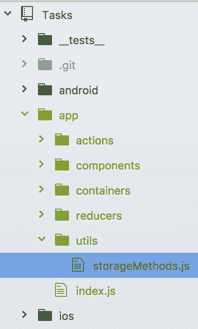

# 第七章：Redux

现在我们已经有机会尝试 React Native，是时候深入研究一些严肃的架构了。你可能会遇到我们之前应用程序的一些问题是，我们的组件最终封装了大量的逻辑，有些文件运行了数百行。在本章中，我们将介绍一种新的应用程序架构，以减少组件中的冗余。在本章中，我们将做以下几件事：

+   了解 Redux，该架构将帮助我们管理 React Native 应用程序的状态和数据流

+   在我们的应用程序中安装 Redux 的依赖项

+   重构 `Tasks`，我们的待办事项列表应用程序，以使用 Redux

# 介绍 Redux

Redux 是一个非常受欢迎的库，许多开发者使用它来帮助编写他们的 React 应用程序。在其 GitHub 仓库中，Redux 将自己定位为 *JavaScript 应用的可预测状态容器*。而不是让每个组件管理自己的独立状态，Redux 建议整个 React 应用程序由一个单一的状态来管理。这个单一的状态随后通过每个组件传播，并允许大多数应用程序的逻辑存在于可重用的函数中。

# Redux 的三个原则

你可以通过引用关于状态的三个关键原则来描述 Redux：它需要成为你应用程序的唯一真相来源，它是只读的，并且只能由纯函数修改。

# 单一状态树

在 Redux 中，而不是让每个组件管理自己的状态，我们处理一个包含我们应用程序中所有逻辑的单个状态树。例如，对于我们在前两章中构建的 `Tasks` 应用程序，你可以将其可视化如下：

```js
{ 
  cellExpanded: false, 
  tasks: [ 
    { 
      title: 'Buy Milk', 
      completed: false, 
      dueDate: undefined 
    }, 
    { 
      title: 'Walk Dog', 
      completed: true, 
      dueDate: undefined 
    } 
  ], 
} 

```

这有助于使我们的应用程序更容易调试，因为我们只处理一个对象树，当我们查看它包含的信息时。

# 状态是只读的

应用程序的状态永远不应该被直接修改。相反，它应该只作为动作分发和还原器与之交互的结果进行修改。

# 使用纯函数进行更改

纯函数的概念来自函数式编程，可以总结如下：

+   给定相同的参数，纯函数总是返回相同的结果

+   无论我们的应用状态如何，纯函数都能够执行

+   纯函数作用域之外的外部变量不能被它修改

这三个原则与 Redux 生态系统的三个主要部分相关联：actions（动作）、reducers（还原器）和 store（存储）。

Actions（动作）是我们间接修改只读状态的方式。Reducers（还原器）是执行这种修改的纯函数。Redux 中的单一 store（存储）是我们状态存在的地方。

# Actions（动作）

Actions（动作）是包含信息的简单对象，它将数据从你的应用程序发送到应用程序的存储。你应用程序处理的所有逻辑都将通过动作传递 - 你的存储永远不会从不是动作的来源接收任何数据。

一个动作需要一个`type`属性，它定义了已发生的用户动作的类型。动作类型以字符串形式表示。它们可以硬编码到对象本身中，或作为常量传入。例如：

```js
export function addTask(taskName) { 
  return { 
    type: 'ADD_TASK', 
    taskName: taskName 
  } 
} 

// With constants 

const ADD_TASK = 'ADD_TASK'; 

export function addTask(taskName) { 
  return { 
    type: ADD_TASK, 
    taskName: taskName 
  } 
} 

```

这些函数将作为属性提供给你的应用程序中的所有组件，并且可以在任何时候调用。当调用一个动作时，商店会将该动作分发给应用程序中的每个减少器。只有正确选择的减少器，通过条件逻辑选择，此时才会触发，并执行更改应用程序状态的代码。

# 减少器

在纯 JavaScript 中，有一个名为`reduce`的数组原型方法。这个本地减少函数的目的是在运行回调和初始值通过整个数组的所有内容后返回一个单一减少值。

在 Redux 中，减少器是一个函数，它接收你的应用程序状态以及从动作传递给它的相关信息，然后在执行代码后返回一个单一减少值作为你应用程序的状态。

作为良好实践，减少器应该限制在每个文件中只有一个，以保持清晰。

关于 Redux 中的减少器，我们需要了解两个非常重要的事情：

+   应用程序状态永远不会被修改。相反，返回一个带有任何更改值的副本。

+   由于每个减少器在动作发生时都会触发，以决定该动作是否与其相关，因此如果发生任何未知（对该特定减少器）的动作，我们必须返回前一个应用程序状态。

从前面的示例来看，这是一个`ADD_TASK`动作的减少器看起来：

```js
const task = (state = [], action) => { 

```

使用 ES6 的默认参数语法，如果状态不存在，则提供一个空数组，`action`对象由动作创建者传入：

```js
switch(action.type) { 
    case 'ADD_TASK': 
      return [ 
        ...state, 
        { 
          taskName: action.taskName 
        } 
      ] 
    default: 
      return state; 
  } 
} 

```

# 存储

商店是一个将动作和减少器结合在一起的对象。它为我们做以下事情：

+   包含应用程序状态

+   通过名为`getState`的方法提供对状态的访问

+   分发动作，然后减少器使用这些动作来修改该状态

关于 Redux 需要注意的一点是，在给定应用程序中，你将只有一个商店。如果我们想将逻辑拆分成多个处理程序，实际上我们会通过名为**减少器组合**的方法来拆分减少器，这是我们一旦需要就会查看的内容。

下面是一个 Redux 中示例商店的样貌。假设我们之前有任务减少器，还有一个如下所示：

```js
import { combineReducers, createStore, compose } from 'redux'; 

const defaultState = { 
  task, 
  dueDate 
} 

```

这些是动作的示例：

```js
const addTask = function(taskName) { 
  return { 
    type: 'ADD_TASK', 
    taskName: taskName 
  } 
} 

const changeDueDate = function(dueDate) { 
  return { 
    type: 'CHANGE_DUE_DATE', 
    dueDate: dueDate 
  } 
}

```

这些是我们放置减少器的地方：

```js
const task = // Reducer to add a new task to the list 
const dueDate = // Reducer to modify a task's due date 

const rootReducer = combineReducers(task, dueDate); 

const store = createStore(rootReducer, defaultState); 

```

在一个组件内部，我们可以简单地按照以下方式调用一个动作：

```js
this.props.addTask('Buy Milk') 

```

但是等等，我们的组件如何知道这个动作是可用的？我们究竟在哪里暴露属性？我们使用一个名为`React-Redux`的库来完成这个任务，它包含我们想要利用的两个东西。

第一个是 `connect` 方法，它将我们的 React Native 应用程序连接到 Redux 存储。我们感兴趣传递给 `connect` 的两个参数是 `mapStateToProps` 和 `mapDispatchToProps`。

如果指定了 `mapStateToProps`，它是一个订阅状态树更新的函数。每当状态树更新时，`mapStateToProps` 都会被调用，并将它的返回值合并到组件的 props 中。返回值需要是一个对象。下面是一个快速示例：

```js
const mapStateToProps = (state) => { 
  return { 
    tasks: state.tasks 
  } 
} 

```

`mapDispatchToProps` 将我们的 dispatch 方法映射到组件的 props。作为一个函数，我们可以调用 `bindActionCreators` 并传入我们的 action creators 以及一个 dispatch 调用，这样它们就可以直接被调用。下面是它的样子：

```js
import { bindActionCreators } from 'redux'; 
import { connect } from 'react-redux'; 
import * as actionCreators from '../actions'; 

const mapDispatchToProps = (dispatch) => { 
  return bindActionCreators(actionCreators, dispatch); 
} 

```

然后，假设 `Main` 是我们应用程序的入口点，我们将使用 `connect` 将它们组合起来：

```js
import Main from './Main'; 

const App = connect(mapStateToProps, mapDispatchToProps)(Main) 

```

为了传播我们的存储（以及与之相关的所有 actions 和 reducers），我们将使用 `React-Redux` 的 `Provider` 来包装我们的应用程序，并将我们的存储作为 props 传递给它。这允许我们的 React 应用程序中的组件自然地继承这些 props。它发生在根级别，如下所示：

```js
return ( 
  <Provider store={ store }> 
    <App /> 
  </Provider> 
) 

```

这是一个相当多的设置，如果你对其有效性有所怀疑，我强烈建议你继续阅读本章的其余部分：Redux 非常有用，因为它将让我们编写更干净、更容易维护的组件，并有助于未来的贡献者更好地理解我们的代码库。

我们的下一步是安装 Redux，让我们开始吧。

# 安装 Redux

我们将使用 `npm` 来安装 Redux。它还需要一些依赖项，我们将一次性安装所有这些依赖项。确保你位于项目文件夹的根目录中，然后执行以下操作：

```js
npm install --save redux react-redux redux-thunk 

```

下面是我们将要安装到项目中的三个包的简要概述：

+   `Redux`：这是库本身。

+   `React-Redux`：这是一个提供 React 绑定的库。Redux 并非专门绑定到 React，这个库将使我们能够轻松地访问 `Provider` 组件，在父级传递我们的 props。

+   `Redux-Thunk`：这是一个中间件，它将帮助我们使用 actions 进行异步调用，并且由于我们将调用 `AsyncStorage`，因此它非常有用。

现在我们已经安装了这三个包，是时候开始设置我们的架构了。

# Redux 架构

当我们使用 Redux 时，我们应用程序的架构将与之前略有不同。目前，我们的项目中的 `app` 目录看起来是这样的：

```js
|app 
|__components 
|____DatePickerDialogue 
|____EditTask 
|____ExpandableCell 
|____TasksList 
|____TasksListCell 

```

Redux 要求我们以不同的方式思考我们如何接近应用程序的架构，我们将在 `app` 目录中添加一些新的文件夹：

```js
|app 
|__containers 
|__components 
|__reducers 
|__index.js 

```

# Redux 中的容器

容器是我们将要映射 dispatch 方法以及与应用程序状态连接的方法，这些方法连接到组件和 Redux。`components` 文件夹仍然存在，但我们将重构其中的内容，使其不依赖于基于组件的状态。

从现在开始，每次我们通常渲染一个组件时，我们都会渲染其容器。

# 剩余的文件夹结构

`reducers`文件夹将包含一个单独的 reducer 文件，它处理所有修改我们应用程序状态的逻辑。

应用文件夹中找到的`index.js`文件将处理我们的 Redux 设置，并由 iOS 和 Android 的根`index`文件渲染。

在我们的根`index.ios.js`和`index.android.js`文件中，你将看到以下内容：

```js
// TasksRedux/index.js 

import Tasks from './app'; 
import { AppRegistry } from 'react-native'; 

AppRegistry.registerComponent('Tasks', () => Tasks); 

```

# 规划 Redux 转换

我们将采取的将我们的应用转换为 Redux 的方法将涉及多个步骤：

1.  首先，我们应该开始搭建一个 Redux 项目，创建一个 store，将`AppContainer`包裹在一个`Provider`中，并创建一些基本的操作和 reducer 来处理非常基本的功能--我们可以稍后考虑持久化存储。

1.  然后，我们将开始将`TasksList`组件转换为 Redux，通过创建`TasksListContainer`并将我们的操作和状态树映射到`TasksList`组件。在我们第一章，“第一个项目 - 创建基本待办事项应用”和第二章，“高级功能与美化待办事项应用”中构建的`Tasks`组件的其他组件将暂时保持不变。

1.  之后，我们将修改`TasksList`组件，利用其容器，通过从中移除所有组件无关的逻辑来实现。

1.  我们将对`EditTask`组件重复这一系列步骤。

1.  最后，我们应该解决对`AsyncStorage` API 的异步调用问题。

1.  在旅途中，我们应该抓住每一个机会对`Tasks`的 Android 版本进行修改，将其转换为 Redux 架构。

# 创建入口点

位于`app/index.js`的`index`文件将作为我们应用的入口点。iOS 和 Android 版本的`Tasks`都将调用它，它将设置我们的 Redux 架构。首先，我们将导入所有必要的依赖项。如果我们还没有为这些项目创建任何适用的文件或文件夹，不要担心；我们很快就会这样做：

```js
// TasksRedux/app/index.js 

import React from 'react'; 
import AppContainer from './containers/AppContainer'; 
import { createStore, applyMiddleware } from 'redux'; 
import { Provider } from 'react-redux'; 
import thunk from 'redux-thunk'; 
import listOfTasks from './reducers';  

```

接下来，让我们设置我们的 store。

# 设置我们的 store

要设置我们的 store，我们需要使用 Redux 的`createStore`方法，然后传递一个 reducer。从高层次来看，它看起来是这样的：

```js
let store = createStore(task) 

```

此外，由于我们知道我们将在应用中处理异步调用，我们还应该设置`Redux-Thunk`以支持它。

要这样做，将`applyMiddleware`函数作为`createStore`的第二个参数传递。将`thunk`作为`applyMiddleware`的参数传递：

```js
let store = createStore(listOfTasks, applyMiddleware(thunk)); 

```

最后，我们将导出一个无状态的函数，该函数返回被`Provider`包裹的应用容器：

```js
export default function Tasks (props) { 
  return ( 
    <Provider store={ store }> 
      <AppContainer /> 
    </Provider> 
  ) 
} 

```

在设置完成后，我们的`index.js`文件将看起来如下：

```js
// TasksRedux/app/index.js 

import React from 'react'; 
import AppContainer from './containers/AppContainer'; 
import { createStore, applyMiddleware } from 'redux'; 
import { Provider } from 'react-redux'; 
import thunk from 'redux-thunk'; 
import listOfTasks from './reducers'; 

let store = createStore(listOfTasks, applyMiddleware(thunk)); 

export default function Tasks (props) { 
  return ( 
    <Provider store={ store }> 
      <AppContainer /> 
    </Provider> 
  ) 
} 

```

现在我们已经创建了此文件，让我们构建应用容器。如果您还没有创建，请在`app`文件夹内创建一个`containers`文件夹，然后为 Android 和 iOS 创建单独的`AppContainer`文件。

# 构建应用容器

应用容器将提供一个基本的`NavigatorIOS`路由，渲染我们的`TasksList`容器。它看起来与我们之前在根索引文件中的类似：

```js
// TasksRedux/app/containers/AppContainer.ios.js 

import React, { Component } from 'react'; 

import { 
  NavigatorIOS, 
  StyleSheet 
} from 'react-native'; 

import TasksListContainer from '../containers/TasksListContainer'; 

export default class App extends Component { 
  render () { 
    return ( 
      <NavigatorIOS 
        initialRoute={{ 
          component: TasksListContainer, 
          title: 'Tasks' 
        }} 
        style={ styles.container } 
      /> 
    ) 
  } 
} 

const styles = StyleSheet.create({ 
  container: { 
    flex: 1, 
    backgroundColor: '#F5FCFF' 
  } 
}); 

```

`AppContainer`和根索引文件之间的主要区别是它没有调用`AppRegistry.registerComponent`。这部分仍然由根索引文件处理。

导入我们将用于`Navigator`的两个路由：

```js
// TasksRedux/app/containers/AppContainer.android.js 

import React, { Component } from 'react'; 
import { 
  Navigator, 
} from 'react-native'; 

import TasksListContainer from './TasksListContainer'; 
import EditTaskContainer from './EditTaskContainer'; 

```

设置`routes`数组：

```js
class Tasks extends Component { 

  render () { 
    const routes = [ 
      { title: 'Tasks', index: 0 }, 
      { title: 'Edit Task', index: 1 } 
    ]; 

```

此函数处理渲染不同路由的逻辑：

```js
    return ( 
      <Navigator 
        initialRoute={{ index: 0}} 
        renderScene={ (routes, navigator) =>
        this._renderScene(routes, navigator) }/> 
    ); 
  } 

  _renderScene (route, navigator) { 
    if (route.index === 0) { 
      return ( 
        <TasksListContainer 
          title={ route.title } 
          navigator={ navigator } 
        /> 
      ) 
    } 

    if (route.index === 1) { 
      return ( 
        <EditTaskContainer 
          title={ route.title } 
          navigator={ navigator } 
        /> 
      ) 
    } 
  } 
} 

AppRegistry.registerComponent('Tasks', () => Tasks); 

```

接下来，我们将开始创建动作和 reducers，以期待构建`TasksList`容器。

# 创建动作

让我们创建一些有助于我们应用程序的动作。在`Tasks`应用程序中，我们有以下动作的功能：

+   从`AsyncStorage`获取任务

+   创建新任务

+   编辑任务名称

+   标记/取消标记任务为完成

+   显示/隐藏可展开组件

+   保存对任务的更改

+   清除对任务的更改

+   添加截止日期

+   删除截止日期

这是一个编辑任务名称的动作示例：

```js
export function editTaskName (title, index) { 
  return { 
    type: 'EDIT_TASK_NAME', 
    title: title, 
    index: index 
  } 
}; 

```

当命名一个动作时，我们希望将动作类型与用户交互导致的确切事件相关联。在这种情况下，用户编辑了任务名称。此动作还将传递给我们的 reducer 一个`title`和`index`，以便 reducer 可以搜索状态以找到提供的`index`的任务，并编辑其`title`。

初始时，我们有三项动作我们想要确保在`TasksList`中工作：添加任务，更改其完成状态，以及修改`TextInput`的值：

```js
// TasksRedux/app/actions/index.js  

let currentIndex = 0; 

const ADD_TASK = 'ADD_TASK'; 
const CHANGE_COMPLETION_STATUS = 'CHANGE_COMPLETION_STATUS'; 
const CHANGE_INPUT_TEXT = 'CHANGE_INPUT_TEXT'; 

export function addTask (text) { 
  return { 
    type: ADD_TASK, 
    index: currentIndex++, 
    text, 
. } 
} 

```

每个动作都是一个导出的函数，它返回一个对象，其中包含动作类型以及任何其他键值对，这些键值对包含我们 reducers 交互的数据：

```js
export function changeCompletionStatus (index) { 
  return { 
    type: CHANGE_COMPLETION_STATUS, 
    index 
  } 
} 

export function changeInputText (text) { 
  return { 
    type: CHANGE_INPUT_TEXT, 
    text 
  } 
} 

```

这些现在就足够了——随着我们将越来越多的应用程序转换为支持 Redux，我们将逐步构建其他动作。接下来，让我们为这三个动作构建 reducers。

# 构建 reducers

让我们看看我们如何构建 reducers 来处理创建新任务并将其保存到我们的任务列表中。

假设我们正在处理以下状态树：

```js
{ 
  tasks: [ 
    { 
      title: 'Buy Milk', 
      completed: false, 
      dueDate: undefined 
    }, 
    { 
      title: 'Walk Dog', 
      completed: true, 
      dueDate: undefined 
    } 
  ], 
} 

```

为了编写一个纯函数，我们想要确保我们不是修改状态，而是重新分配我们的状态以包含更新的更改。

在一个不纯的函数中，我们可能会这样做：

不要这样做！

```js
function addTask (state, action) { 
  switch(action.type) { 
    case 'ADD_TASK': 
      state.tasks.push({ 
        title: action.title, 
        completed: false 
      }); 
      return state; 
    default: 
      return state; 
  } 
}; 

```

我们在这里所做的是修改我们状态树的 tasks 数组，将其中的新任务推入。这可能导致后续调试时出现问题。相反，我们想要做的事情可以分解成一系列可执行步骤：

1.  创建当前状态的副本。

1.  创建我们复制的状态的任务的副本。

1.  将我们的新任务添加到这个副本的末尾。

1.  将此复制的数组分配为新任务的复制的状态值。

1.  将复制的状态分配为我们的新当前状态。

`singleTask` 减少器处理影响列表中单个任务的逻辑。此减少器的结果立即被主 `listOfTasks` 减少器访问：

```js
// TasksRedux/app/reducers/index.js 

const singleTask = (state = {}, action) => { 

```

在此事件中，我们返回一个包含新任务详情的对象。

```js
  switch(action.type) { 
    case 'ADD_TASK': 
      return { 
        completed: false, 
        due: undefined, 
        index: action.index, 
        text: action.text 
      } 

```

`singleTask` 减少器在 `listOfTasks` 减少器中的迭代期间被调用。在这里，如果单个任务的索引与我们要交互的索引相匹配，我们使用扩展运算符返回现有对象，并切换其完成状态：

```js
    case 'CHANGE_COMPLETION_STATUS': 
      if (state.index !== action.index) { 
        return state; 
      } 
      return { 
        ...state, 
        completed: !state.completed 
      } 

```

这设置了一个默认状态，将其传递给 `listOfTasks`：

```js
    default: 
      return state; 
  } 
} 

let defaultState = { 
  listOfTasks: [], 
  text: '' 
} 

```

`listOfTasks` 减少器是所有动作首先触发的地方。然后它使用 `switch` 语句来确定正在调用的动作类型，并根据该动作类型返回一个新的状态对象：

```js
const listOfTasks = (state = defaultState, action) => { 

```

如果我们要添加一个任务，通过包含使用扩展运算符构建的更新后的 `listOfTasks` 数组的扩展运算符返回状态对象，调用 `singleTask` 减少器并传递一个空对象和最初传递给那里的动作对象：

```js
  switch(action.type) { 
    case 'ADD_TASK': 
      return { 
        ...state, 
        listOfTasks: [...state.listOfTasks, singleTask({}, action)], 
        text: '' 
      } 

```

如果我们更改任务的完成状态，我们在状态中的 `listOfTasks` 数组上调用 map，然后对任务中的每个元素调用 `singleTask`，传递当前任务对象和动作对象给它：

```js
    case 'CHANGE_COMPLETION_STATUS': 
      return { 
        ...state, 
        listOfTasks: state.listOfTasks.map((element) => { 
          return singleTask(element, action); 
        }) 
      } 

```

更新状态树中 `TextInput` 组件的 `text` 属性：

```js
    case 'CHANGE_INPUT_TEXT': 
      return { 
        ...state, 
        text: action.text 
      } 

    default: 
      return state; 
  } 
} 

export default listOfTasks; 

```

总结来说，`listOfTasks` 是我们的父级减少器，处理我们应用程序的整体逻辑，而 `singleTask` 处理列表中单个项目的相关信息。

# 创建 `TasksList` 容器

现在我们已经有了动作和减少器，我们将创建一个容器，将我们的分发方法和状态连接到 `TasksList` 组件。

首先，我们将从 `react-redux` 中导入 `connect` 模块，以及我们在 `TasksList` 中打算分发的任何动作，以及 `TasksList` 组件本身：

```js
// TasksRedux/app/containers/TasksListContainer/index.js 

import { connect } from 'react-redux'; 

import { 
  addTask, 
  changeCompletionStatus, 
  changeInputText, 
} from '../../actions'; 

import TasksList from '../../components/TasksList'; 

```

然后，我们将创建三个方法，这些方法将导致使用 `mapDispatchToProps` 向我们的状态树分发函数：

```js
const mapDispatchToProps = (dispatch) => { 
  return { 
    addTask: (text) => { 
      dispatch(addTask(text)); 
    }, 
    changeCompletionStatus: (rowID) => { 
      dispatch(changeCompletionStatus(rowID)) 
    }, 
    onChangeText: (text) => { 
      dispatch(changeInputText(text)); 
    }, 
  } 
} 

```

之后，我们将映射我们打算传递给 `TasksList` 的 prop 的状态，包括我们从顶级中已有的 `Navigator`：

```js
const mapStateToProps = (state, { navigator }) => { 
  return { 
    listOfTasks: state.listOfTasks || [], 
    navigator: navigator, 
    text: state.text || '' 
  } 
} 

```

最后，我们将 `mapStateToProps` 和 `mapDispatchToProps` 函数连接到 `TasksList` 组件并导出它：

```js
export default connect(mapStateToProps, mapDispatchToProps)(TasksList); 

```

现在，让我们看看我们如何重构 `TasksList` 组件。

# Redux 连接的 `TasksList` 组件

在 Redux 中，组件将保留其 JSX 标记，但任何不属于该特定组件的逻辑都由我们的状态树保持，并通过动作和减少器进行修改：

```js
// TasksRedux/app/components/TasksList/index.js 

import React, { Component } from 'react'; 
import { 
  ListView, 
  Platform, 
  TextInput, 
  View 
} from 'react-native'; 

```

由于未来任何对存储方法的调用都将由我们的动作和减少器处理，因此已从该组件中移除了 React Native API 和组件，如 `AsyncStorage`。

创建一个新的 `ListView.DataSource` 实例，因为它特定于该组件：

```js
import TasksListCell from '../TasksListCell'; 
import styles from './styles'; 

export default class TasksList extends Component { 
  constructor (props) { 
    super (props); 

    this.state = { 
      ds: new ListView.DataSource({ 
        rowHasChanged: (r1, r2) => r1 !== r2 
      }), 
    }; 
  } 

```

为我们状态树中的 `ListView` 创建 `dataSource` 常量，包含 `listOfTasks` 数组：

```js
  render () { 
    const dataSource = 
    this.state.ds.cloneWithRows(this.props.listOfTasks); 

```

`onChangeText` 和 `onSubmitEditing` 等回调现在调用映射到 `TasksListContainer` 的动作：

```js
    return ( 
      <View style={ styles.container }> 
        <TextInput 
          autoCorrect={ false } 
          onChangeText={ (text) => this.props.onChangeText(text) } 
          onSubmitEditing={ () => this.props.addTask(this.props.text) } 
          returnKeyType={ 'done' } 
          style={ Platform.OS === 'ios' ? styles.textInput : 
          styles.androidTextInput } 
          value={ this.props.text } 
        /> 

```

这将传递 `TasksListCell` 所需的 `onLongPress` 回调一个占位符：

```js
        <ListView 
          automaticallyAdjustContentInsets={ false } 
          dataSource={ dataSource } 
          enableEmptySections={ true } 
          renderRow={ (rowData, sectionID, rowID) => 
          this._renderRowData(rowData, rowID) } 
          style={ styles.listView } 
        /> 
      </View> 
    ); 
  } 

  _renderRowData (rowData, rowID) { 
    return ( 
      <TasksListCell 
        completed={ rowData.completed } 
        formattedDate={ rowData.formattedDate } 
        id={ rowID } 
        onLongPress={ () => alert('placeholder') } 
        onPress={ () => 
        this.props.changeCompletionStatus(rowData.index) } 
        text={ rowData.text } 
      /> 
    ) 
  } 
}} 

```

# 将 EditTasks 转换为 Redux

在 `EditTasks` 中，我们引入了一些新的动作和减少器。这些包括：

+   将当前所选任务设置为在 `TasksList` 中按下的任务

+   处理在 `EditTask` 屏幕中按下取消或保存按钮时的更改

+   切换所选任务为完成状态

+   更改所选任务的名字

+   添加、修改和删除截止日期

+   展开可展开的单元格以显示和隐藏 `DatePicker` 组件

对于前两个项目，这些修改将以三种新动作的形式出现，放置在 `TasksList` 容器中，因为这是这些事件将发生或定义并传递给 EditTask 导航器的组件。

我们的状态树还需要包含以下新属性：

+   DatePicker 组件中格式化和未格式化的日期，指向所选的任务

+   一个与 `EditTask` 屏幕中当前所选任务相关的对象

+   一个指示 `ExpandableCell` 是否可见的指示

+   在 EditScreen 视图中选择日期的指示

有了这个想法，让我们从我们的行动开始转换！

# 为 `EditTask` 添加动作

这里是针对 `EditTask` 的动作文件中的新增内容：

```js
// TasksRedux/app/actions/index.js  

... 
const CHANGE_CURRENTLY_EDITED_TASK = 'CHANGE_CURRENTLY_EDITED_TASK'; 
const CHANGE_SELECTED_TASK_COMPLETED = 'CHANGE_SELECTED_TASK_COMPLETED'; 
const CHANGE_SELECTED_TASK_DUE_DATE = 'CHANGE_SELECTED_TASK_DUE_DATE'; 
const SAVE_SELECTED_TASK_DETAILS = 'SAVE_SELECTED_TASK_DETAILS'; 
const EDIT_SELECTED_TASK_NAME = 'EDIT_SELECTED_TASK_NAME'; 
const EXPAND_CELL = 'EXPAND_CELL'; 
const REMOVE_SELECTED_TASK_DUE_DATE = 'REMOVE_SELECTED_TASK_DUE_DATE'; 
const RESET_SELECTED_TASK = 'RESET_SELECTED_TASK'; 

```

这些是新常量，描述了 `EditTask` 组件将带给应用的不同的动作。

这些函数很简单，因为它们在零到两个值之间传递所需的动作类型，以便我们的减少器处理：

```js
... 
export function changeCurrentlyEditedTask (selectedTaskObject) { 
  return { 
    type: CHANGE_CURRENTLY_EDITED_TASK, 
    selectedTaskObject: selectedTaskObject 
  } 
} 

export function changeSelectedTaskCompleted (value) { 
  return { 
    type: CHANGE_SELECTED_TASK_COMPLETED, 
    value 
  } 
} 

export function changeSelectedTaskDueDate (date) { 
  return { 
    type: CHANGE_SELECTED_TASK_DUE_DATE, 
    date 
  } 
} 

```

`saveSelectedTaskDetails` 动作比其他动作更复杂。它从 `EditTask` 组件中获取一个对象，然后将其分解为不同的属性，以便我们的减少器可以处理。

```js
export function editSelectedTaskName (text) { 
  return { 
    type: EDIT_SELECTED_TASK_NAME, 
    text 
  } 
} 

export function expandCell (currentlyExpanded) { 
  return { 
    type: EXPAND_CELL, 
    expanded: currentlyExpanded 
  } 
} 

export function resetSelectedTask () { 
  return { 
    type: RESET_SELECTED_TASK 
  } 
} 

export function removeSelectedTaskDueDate () { 
  return { 
    type: REMOVE_SELECTED_TASK_DUE_DATE 
  } 
} 

export function saveSelectedTaskDetails (object) { 
  return { 
    type: SAVE_SELECTED_TASK_DETAILS, 
    completed: object.completed, 
    date: object.due || undefined, 
    formattedDate: object.formattedDate || undefined, 
    index: object.index, 
    text: object.text 
  } 
} 

```

# `EditTask` 的减少器

我们还应该更新我们的减少器以处理这些新引入的动作。我们应该做以下事情：

+   扩展 `defaultState` 对象，包括 `date`、`dateSelected`、`expanded`、`formattedDate` 和 `selectedTaskObject` 属性

+   添加一个辅助函数以使用 MomentJS 格式化日期

+   为 `singleTask` 减少器创建一个新的 switch 情况以处理 `SAVE_SELECTED_TASK_DETAILS` 动作

+   为用户正在编辑的 `selectedTaskObject` 建立一个新的 `selectedTask` 减少器以临时存储和修改

+   扩展 `listOfTasks` 减少器以处理每个新动作，在必要时将其委派给 `singleTask` 或 `selectedTask` 减少器

`defaultState` 对象已扩大以容纳 `EditTask` 将使用的新信息，例如 `ExpandableCell` 的 `expanded` 状态：

```js
// TasksRedux/app/reducers/index.js 

import moment from 'moment'; 

const defaultState = { 
  ... 
  date: undefined, 
  dateSelected: false, 
  expanded: false, 
  formattedDate: undefined, 
  selectedTaskObject: undefined, 
} 

```

使用 MomentJS 格式化日期：

```js
const _formatDate = (date) => { 
  if (date) { 
    return moment(date).format('lll'); 
  } 
} 

```

这两个方法没有进行任何更改：

```js
const singleTask = (state = {}, action) => { 
  switch(action.type) { 
    case 'ADD_TASK': 
      ... 
    case 'CHANGE_COMPLETION_STATUS': 
      ... 

```

这是为了保存用户已选用于编辑的任务的详细信息：

```js
    case 'SAVE_SELECTED_TASK_DETAILS': 
      if (state.index !== action.index) { 
        return state; 
      } 
      return { 
        ...state, 
        completed: action.completed, 
        due: action.date, 
        formattedDate: action.formattedDate, 
        text: action.text 
      } 

```

这是一个新创建的红 ucer，用于处理用户当前正在编辑的任务对象：

```js
    default: 
      return state; 
  } 
} 

const selectedTask = (state = {}, action) => { 

```

我们的 Redux 状态存储用户正在编辑的对象，因为用户在任何时候都可以简单地决定取消任何更改。将更改保存在临时对象中，只有在用户按下保存按钮后才会将它们保存到状态中，这样我们就可以避免撤销用户所做的任何更改：

```js
  switch(action.type) { 
    case 'CHANGE_SELECTED_TASK_COMPLETED': 
      return { 
        ...state, 
        completed: action.value 
      } 
    case 'CHANGE_SELECTED_TASK_DUE_DATE': 
      return { 
        ...state, 
        due: action.date || undefined, 
        formattedDate: action.date ?
        _formatDate(action.date) : undefined 
      } 

```

与 `singleTask` 红 ucer 类似，`selectedTask` 通过主 `listOfTasks` 红 ucer 访问：

```js
    case 'EDIT_SELECTED_TASK_NAME': 
      return { 
        ...state, 
        text: action.text 
      } 
    case 'REMOVE_SELECTED_TASK_DUE_DATE': 
      return { 
      ...state, 
      due: undefined, 
      formattedDate: undefined 
      } 
    default: 
      return state; 
  } 
} 

const listOfTasks = (state = defaultState, action) => { 
  switch(action.type) { 
    case 'ADD_TASK': 
      ... 
    case 'CHANGE_COMPLETION_STATUS': 
      ... 

```

以下两个情况没有进行更改。

```js
    case 'CHANGE_CURRENTLY_EDITED_TASK': 
      const date = action.selectedTaskObject.due || new Date(); 
      const formattedDate = _formatDate(date); 

      const hasDueDate = action.selectedTaskObject.due ? true : false 
      return { 
        ...state, 
        date: date, 
        dateSelected: hasDueDate, 
        formattedDate: formattedDate, 
        selectedTaskObject: action.selectedTaskObject 
      } 

```

这是设置我们 Redux 状态中的 `selectedTaskObject` 属性的代码。它还设置了 `DatePicker` 组件的日期、`dateSelected` 和 `formattedDate` 属性。

此情况也没有更改：

```js
    case 'CHANGE_INPUT_TEXT': 
      ... 

```

这是第一次从 `listOfTasks` 调用 `selectedTask` 红 ucer。它更改了当前正在编辑的任务的完成状态：

```js
    case 'CHANGE_SELECTED_TASK_COMPLETED': 
      return { 
        ...state, 
        selectedTaskObject: selectedTask
        (state.selectedTaskObject, action) 
      } 

```

此情况更改了所选任务的截止日期，以及 `date`、`dateSelected` 和 `formattedDate` 属性：

```js
    case 'CHANGE_SELECTED_TASK_DUE_DATE': 
      return { 
        ...state, 
        date: action.date, 
        dateSelected: action.date ? true : false, 
        formattedDate: action.date ? _formatDate(action.date) : 
        undefined, 
        selectedTaskObject: selectedTask
        (state.selectedTaskObject, action) 
      } 

```

更改所选任务的名字：

```js
    case 'EDIT_SELECTED_TASK_NAME': 
      return { 
        ...state, 
        selectedTaskObject: selectedTask(state.selectedTaskObject,
        action) 
      } 

```

处理 `ExpandableCell` 的 `expanded` 属性：

```js
    case 'EXPAND_CELL': 
      return { 
        ...state, 
        expanded: !action.expanded 
      } 

```

如果用户在 `EditTask` 屏幕上按下 `Cancel`，则会执行以下操作：

```js
    case 'RESET_SELECTED_TASK': 
      return { 
        ...state, 
        expanded: false, 
        selectedTask: undefined, 
      } 

```

从所选任务中移除截止日期：

```js
    case 'REMOVE_SELECTED_TASK_DUE_DATE': 
      return { 
        ...state, 
        dateSelected: false, 
        selectedTaskObject: selectedTask(state.selectedTaskObject, 
        action) 
      } 

```

最后，这会将所选任务永久保存到 `listOfTasks` 数组中：

```js
    case 'SAVE_SELECTED_TASK_DETAILS': 
      return { 
        ...state, 
        expanded: false, 
        listOfTasks: state.listOfTasks.map((element) => { 
            return singleTask(element, action) 
          }) 
      } 

    default: 
      ... 
  } 
} 

export default listOfTasks;export default listOfTasks; 

```

# 更新 TasksListContainer 以适应 EditTask

现在我们应该更新 `TasksListContainer` 和 `TasksList` 组件。首先，`TasksListContainer` 应该执行以下操作：

+   导入 `changeCurrentlyEditedTask`、`resetSelectedTask` 和 `saveSelectedTaskDetails` 动作并将它们添加到 `mapDispatchToProps` 方法。

+   将 Redux 状态中的 `date`、`formattedDate` 和 `selectedTaskObject` 属性导入并添加到 `mapStateToProps` 方法。

看看以下代码：

```js
// TasksRedux/app/containers/TasksListContainer 

... 
import { 
  ... 
  changeCurrentlyEditedTask, 
  resetSelectedTask, 
  saveSelectedTaskDetails 
} from '../../actions'; 

```

如上所述，我导入了三个新动作。

```js
... 
const mapDispatchToProps = (dispatch) => { 
  return { 
    ... 
    changeCompletionStatus: (index) => { 
      dispatch(changeCompletionStatus(index)); 
    }, 
    resetSelectedTask: () => { 
      dispatch(resetSelectedTask()); 
    }, 
    saveSelectedTaskDetails: (selectedTaskObject) => { 
      dispatch(saveSelectedTaskDetails(selectedTaskObject)); 
    } 
  } 
} 

```

将三个新动作映射到 `TasksList` 的调度方法。

```js
const mapStateToProps = (state, { navigator }) => { 
  return { 
    ... 
    date: state.date, 
    formattedDate: state.formattedDate, 
    selectedTaskObject: state.selectedTaskObject, 
  } 
} 
... 

```

将 Redux 状态中的三个新值映射到 `TasksList` 的 props。

# 更新 TasksList 组件

接下来，让我们对 `TasksList` 进行修改，以便它支持 `EditTask`。它应该执行以下操作：

1.  为我们导入 `EditTaskContainer` 以推送到导航器。

1.  添加 `Platform` API 以支持 Android 设备。

1.  修改 `TasksListCell` 的 `onLongPress` 回调以调用一个函数，该函数首先将当前选定的任务添加到 Redux 状态，然后导航用户到 `EditTaskContainer`。它应包含一个 `Cancel` 和 `Save` 按钮。

1.  `Cancel` 按钮应触发一个函数，该函数 `pops` 导航器并重置 Redux 状态中的 `selectedTaskObject` 值。

1.  `Save` 按钮应触发一个函数，该函数 `pops` 导航器并将 `selectedTaskObject` 保存到 Redux 状态中的 `listOfTasks` 数组。

这里是我的对 `TasksList` 组件的修改：

```js
// TasksRedux/app/components/TasksList/index.js 

... 
import { 
  ... 
  Platform, 
} from 'react-native'; 

import EditTaskContainer from '../../containers/EditTaskContainer'; 
... 
export default class TasksList extends Component { 
  ...

```

以下代码将 `_cancelEditingTask` 函数添加到在导航器上调用 `pop` 并然后触发 `resetSelectedTask` 动作：

```js
  _cancelEditingTask () { 
    this.props.navigator.pop(); 
    this.props.resetSelectedTask(); 
  } 

```

将 `TasksListCell` 的 `onLongPress` 回调函数改为调用以下 `_onLongPress` 函数：

```js
  _renderRowData (rowData, rowID) { 
    return ( 
      <TasksListCell 
        ... 
        onLongPress={ () => this._onLongPress(rowData) } 
      /> 
    ) 
  } 

```

如果用户使用的是 iOS 设备，将 `EditTaskContainer` `push` 到导航器，并传递一个字符串给左右按钮，并给它们按下时触发的回调：

```js
  _onLongPress (rowData) { 
    this.props.changeCurrentlyEditedTask(rowData); 

    if (Platform.OS === 'ios') { 
      this.props.navigator.push({ 
        component: EditTaskContainer, 
        title: this.props.selectedTaskText, 
        leftButtonTitle: 'Cancel', 
        rightButtonTitle: 'Save', 
        onLeftButtonPress: () => this._cancelEditingTask(), 
        onRightButtonPress: () => this._saveEditedTask() 
      }); 
      return; 
    } 

```

在 Android 设备上，只需 `push` `AppContainer.android.js` 中指定的路由索引：

```js
    this.props.navigator.push({ 
      index: 1 
    }); 
  }

```

保存编辑后的任务时，首先 `pop` 导航器，然后触发 `saveSelectedTaskDetails` 动作：

```js
  _saveEditedTask () { 
    this.props.navigator.pop(); 
    this.props.saveSelectedTaskDetails(this.props.selectedTaskObject); 
  } 
} 

```

# 创建 EditTask 容器

`EditTaskContainer` 将以与 TasksListContainer 相同的方式组合。它将执行以下操作：

1.  从你的动作文件中导入与 `EditTask` 组件相关的动作：

1.  导入 `EditTask` 和 `connect` 模块。

1.  包含一个 `mapDispatchToProps` 方法来映射你导入的动作。

1.  在 Redux 状态的任何部分调用 `mapStateToProps`，以便 `EditTask` 可以访问：

1.  在 `mapDispatchToProps`、`mapStateToProps` 和 `EditTask` 组件上调用 `connect`：

这些是 `EditTask` 将要使用的动作：

```js
// TasksRedux/app/containers/EditTaskContainer 

import { connect } from 'react-redux'; 

import { 
  changeSelectedTaskCompleted, 
  changeSelectedTaskDueDate, 
  editSelectedTaskName, 
  expandCell, 
  removeSelectedTaskDueDate, 
  resetSelectedTask, 
  saveSelectedTaskDetails 
} from '../../actions'; 

```

`resetSelectedTask` 和 `saveSelectedTaskDetails` 动作专门映射到 Android 版本应用的 `EditTaskContainer`：

```js
import EditTask from '../../components/EditTask'; 

const mapDispatchToProps = (dispatch) => { 
  return { 
    changeCompletedStatus: (value) => { 
      dispatch(changeSelectedTaskCompleted(value)); 
    }, 
    changeTextInputValue: (text) => { 
      dispatch(editSelectedTaskName(text)) 
    }, 
    clearDate: () => { 
      dispatch(removeSelectedTaskDueDate()); 
    }, 
    onDateChange: (date) => { 
      dispatch(changeSelectedTaskDueDate(date)); 
    }, 
    onExpand: (currentlyExpanded) => { 
      dispatch(expandCell(currentlyExpanded)) 
    }, 
    resetSelectedTask: () => { 
      dispatch(resetSelectedTask()); 
    }, 
    saveSelectedTaskDetails: (selectedTaskObject) => { 
      dispatch(saveSelectedTaskDetails(selectedTaskObject)); 
    } 
  } 
} 

```

`EditTask` 应该能够从状态树访问以下数据：

```js
const mapStateToProps = (state) => { 
  return { 
    date: state.date, 
    dateSelected: state.dateSelected, 
    expanded: state.expanded, 
    formattedDate: state.formattedDate, 
    selectedTaskObject: state.selectedTaskObject, 
  } 
}

```

最后，将所有东西连接起来：

```js
export default connect(mapStateToProps, mapDispatchToProps)(EditTask);  

```

# 修改 iOS 版本的 EditTask 组件

接下来，我们将修改 `EditTask` 组件。它应该：

+   几乎与我们在 第二章 的 *高级功能与美化待办事项应用* 末尾所拥有的 `EditTask` 组件相同，具有 Android 和 iOS 特定版本：

+   用我们可以向状态树分发的动作替换任何操作数据的方法：

由于 `datePickerHeight` 是在 `DatePickerIOS` 的 `onLayout` 事件中设置的，我们将将其保留在本地状态中：

```js
// TasksRedux/app/components/EditTask/index.ios.js  

import React, { Component } from 'react'; 

import { 
  Button, 
  DatePickerIOS, 
  Switch, 
  Text, 
  TextInput, 
  View 
} from 'react-native'; 

import ExpandableCell from '../ExpandableCell'; 
import styles from './styles'; 

export default class EditTask extends Component { 
  constructor (props) { 
    super (props); 

    this.state = { 
      datePickerHeight: undefined 
    } 
  } 

```

`TextInput` 在文本改变时触发 `changeTextInputValue` 动作，并从我们状态树中的 `selectedTaskObject` 获取其值：

```js
  render () { 
    const noDueDateTitle = 'Set Reminder'; 
    const dueDateSetTitle = 'Due On ' + 
    this.props.selectedTaskObject.formattedDate; 

    return ( 
      <View style={ styles.editTaskContainer }> 
        <View> 
          <TextInput 
            autoCorrect={ false } 
            onChangeText={ (text) => 
            this.props.changeTextInputValue(text) } 
            returnKeyType={ 'done' } 
            style={ styles.textInput } 
            value={ this.props.selectedTaskObject.text } 
          /> 

```

在这里，`ExpandableCell` 组件保持不变，但它将 `expanded` 布尔值和 `title` 确定逻辑委托给我们的 Redux 状态，并在按下时触发 `onExpand` 动作：

```js
        </View> 
        <View style={ [styles.expandableCellContainer, 
        { maxHeight: this.props.expanded ? 
        this.state.datePickerHeight : 40 }]}> 
          <ExpandableCell 
            childrenHeight={ this.state.datePickerHeight } 
            expanded={ this.props.expanded } 
            onPress={ () => this.props.onExpand(this.props.expanded) } 
            title={ this.props.due ? dueDateSetTitle : noDueDateTitle }> 

```

如您所见，唯一剩余的基于组件的逻辑是与 `_getDatePickerHeight` 相关。所有其他函数都由状态树处理：

```js
            <DatePickerIOS 
              date={ this.props.date } 
              onDateChange={ (date) => this.props.onDateChange(date) } 
              onLayout={ (event) => this._getDatePickerHeight(event) } 
            /> 
          </ExpandableCell> 
        </View> 
        <View style={ styles.switchContainer } > 
          <Text style={ styles.switchText } > 
            Completed 
          </Text> 
          <Switch 
            onValueChange={ (value) => 
            this.props.changeCompletedStatus(value) } 
            value={ this.props.selectedTaskObject.completed } 
          /> 
        </View> 
        <View style={ styles.clearDateButtonContainer }> 
          <Button 
            color={ '#B44743' } 
            disabled={ this.props.dateSelected ? false : true } 
            onPress={ () => this.props.clearDate() } 
            title={ 'Clear Date' } 
          /> 
        </View> 
      </View> 
    ); 
  } 

  _getDatePickerHeight (event) { 
    this.setState({ 
      datePickerHeight: event.nativeEvent.layout.width 
    }); 
  } 
} 

```

# 修改 Android 版本的 EditTask 组件

对于我们来说，从 第二章 的 `EditTask` 组件，即 *高级功能与美化待办事项应用*，取来并对其进行修改最为简单。此外，在修改过程中参考此组件更新的 iOS 版本也可以有所帮助。

特别地，对于 Android 版本的 `EditTask`，我们想要做以下操作：

+   用通过 `props` 提供的状态树替换任何对本地状态的引用

+   替换任何不必要的本地方法调用，改为分发动作

+   保持本地方法以保存任务和打开日期和时间选择器

+   更新按返回按钮触发的回调，除了在导航器上调用 `pop` 外，还重置 `selectedTaskObject`

我所做的修改显示了 `EditTask/index.android.js` 和 `EditTask/index.ios.js` 之间的差异。

我从导入语句中移除了 `ExpandableCell`：

```js
// TasksRedux/app/components/EditTask/index.android.js 

... 
import { 
  ... 
  BackAndroid, 
  DatePickerAndroid, 
  TimePickerAndroid, 
} from 'react-native'; 

```

我从状态中移除了 `datePickerHeight` 值，因为 Android 组件不处理 `ExpandableCell`：

```js
... 
export default class EditTask extends Component { 
  constructor (props) { 
    super (props); 
  } 

```

添加和删除 Android 返回按钮的事件监听器与第二章 Chapter 2，*高级功能与美化待办事项应用* 相同：

```js
  componentWillMount () { 
    BackAndroid.addEventListener('hardwareButtonPress', () => 
    this._backButtonPress()); 
  } 

  componentWillUnmount () { 
    BackAndroid.removeEventListener('hardwareButtonPress', () => 
    this._backButtonPress()) 
  } 

```

对 `TextInput` 组件没有进行任何更改。

```js
  render () { 
    ... 
    return ( 
      <View style={ styles.editTaskContainer }> 
        <View> 
          ... 
        </View> 

```

打开 `DatePickerAndroid` 的 `Button` 被修改为引用 `selectedTaskObject` 的 due 属性以确定要渲染的文本：

```js
        <View style={ styles.androidButtonContainer }> 
          <Button 
            color={ '#80B546' } 
            title={ this.props.selectedTaskObject.due ? 
            dueDateSetTitle : noDueDateTitle } 
            onPress={ () => this._showAndroidDatePicker() } 
          /> 
        </View> 

```

对 `Switch` 组件、清除日期 `Button` 或保存 `Button` 没有进行任何更改。保存 `Button` 专属于此应用的 Android 版本，因为保存编辑任务的逻辑在 iOS 的导航栏中处理：

```js
        <View style={ styles.switchContainer } > 
          ... 
        </View> 
        <View style={ styles.androidButtonContainer }> 
          ... 
        </View> 
        <View style={ styles.saveButton }> 
          <Button 
            color={ '#4E92B5' } 
            onPress={ () => this._saveSelectedTaskDetails() } 
            title={ 'Save Task' } 
          /> 
        </View> 
      </View> 
    ); 
  } 

```

修改 `_backButtonPress` 方法，使其也分发 `resetSelectedTask` 动作：

```js
  _backButtonPress () { 
    this.props.navigator.pop(); 
    this.props.resetSelectedTask(); 
    return true; 
  } 

```

我还修改了 `_saveSelectedTaskDetails` 方法，以分发 `saveSelectedTasks` 动作：

```js
  _saveSelectedTaskDetails () { 
    this.props.navigator.pop(); 
    this.props.saveSelectedTaskDetails(this.props.selectedTaskObject); 
  } 

```

将 `_showAndroidDatePicker` 修改为不在状态中保留 `day`、`month` 和 `year` 值。相反，它直接将数据传递给 `_showAndroidTimePicker` 以立即使用：

```js
  ... 
  async _showAndroidDatePicker () { 
    const options = { 
      date: this.props.date 
    }; 

    const { action, year, month, day } = await 
    DatePickerAndroid.open(options); 

    this._showAndroidTimePicker (day, month, year); 
  } 

```

同样，`_showAndroidTimePicker` 被修改为接受那些 `day`、`month` 和 `year` 值。然后它立即使用这三个值以及 `TimePickerAndroid` 返回的 `hour` 和 `minute` 创建一个新的 `Date` 对象，并分发带有新 `Date` 对象的 `onDateChange` 动作：

```js
  async _showAndroidTimePicker (day, month, year) { 
    const { action, minute, hour } = await TimePickerAndroid.open(); 

    if (action === TimePickerAndroid.dismissedAction) { 
      return; 
    } 

    const date = new Date(year, month, day, hour, minute); 

    this.props.onDateChange(date); 
  } 
} 

```

到目前为止，我们几乎完成了对 Redux 的迁移！唯一剩下的是像以前一样持久化我们的任务列表。

# 创建一个用于异步保存的 `StorageMethods` 文件

目前，任何刷新或退出应用程序都会清除我们的任务列表。这并不适合一个非常有用的应用程序，因此我们现在将修改我们的动作以从 `AsyncStorage` 存储和检索我们的任务列表。

让我们在 `app` 中创建一个 `utils` 文件夹，然后在 `utils` 中创建一个名为 `storageMethods.js` 的文件：



此文件将包含两个函数：

+   `getAsyncStorage`：此方法从 `AsyncStorage` 中获取 `listOfTasks` 项目并返回它

+   `saveAsyncStorage`：接受一个数组并将其保存到 `AsyncStorage` 中的 `listOfTasks` 键下

如果你在这本书的前几个项目中工作过，这部分对你来说会很熟悉：

```js
// TasksRedux/app/utils/storageMethods.js 

import { AsyncStorage } from 'react-native'; 

export const getAsyncStorage = async () => { 
  let response = await AsyncStorage.getItem('listOfTasks'); 
  let parsedData = JSON.parse(response) || []; 

  return parsedData; 
} 

```

这使用了异步函数以提高可读性，从 `AsyncStorage` 中获取 `listOfTasks` 的值，将其解析以将其转换回数组，然后返回它。

```js
export const saveAsyncStorage = async (listOfTasks) => { 
  return AsyncStorage.setItem('listOfTasks', 
  JSON.stringify(listOfTasks)); 
} 

```

同样，接受一个数组，然后将`AsyncStorage`中的`listOfTasks`键设置为该数组的字符串化版本。

# 订阅存储的变化。

为了在状态树发生变化时更新`AsyncStorage`中的`listOfTasks`键，我们将调用存储的`subscribe`方法。这创建了一个变化监听器，在每次分派动作并且状态树可能发生变化时被调用。

它接受一个回调作为其参数，并且在这个参数内部，我们可以调用存储的`getState`方法来访问状态树并从中检索我们想要的任何值。

让我们修改应用文件夹中找到的索引文件，以便它订阅存储的变化，触发一个回调，该回调调用`saveAsyncStorage`并传递我们状态树中最新的`listOfTasks`数组版本：

```js
// TasksRedux/app/index.js 

... 
import { saveAsyncStorage } from './utils/storageMethods'; 
... 
store.subscribe(() => { 
  saveAsyncStorage(store.getState().listOfTasks); 
}); 
... 

```

由于我们的应用程序状态的其他部分没有持久化的需求，`listOfTasks`是唯一被保存到`AsyncStorage`中的项。

# 创建一个 thunk。

`Redux-Thunk`库是围绕你的动作创建器的包装器，允许它们在将预期的动作分派到 Redux 存储以由还原器处理之前执行异步任务。

这是我们创建 thunk 的方式：在创建动作的文件中，我们将导出一个函数，该函数返回一个自定义的异步函数，并将现有的`dispatch`方法传递给它。在这个自定义函数中，我们将获取对`getAsyncStorage`方法的调用结果。

然后，在同一个方法内部，我们将分派一个私有函数，我们也在同一个文件中创建这个私有函数。这个私有函数将返回动作类型，以及我们希望传递的任何参数：

```js
// TasksRedux/app/actions/index.js 

import { getAsyncStorage } from '../utils/storageMethods'; 

```

我已经从该文件中移除了`currentIndex`变量，因为我们不再依赖于硬编码的数字来设置任务的索引。

首先，创建一个用于设置任务列表和索引的动作常量：

```js
const SET_LIST_OF_TASKS_AND_INDEX = 'SET_LIST_OF_TASKS_AND_INDEX'; 

```

创建`getListOfTasksAndIndex`动作。

```js
export function getListOfTasksAndIndex () { 
  return async (dispatch) => { 
    let response = await getAsyncStorage(); 

    dispatch(setListOfTasksAndIndex(response, response.length)); 
  } 
} 

```

这个`setListOfTasksAndIndex`函数没有被导出，因为它只被`getListOfTasksAndIndex`调用。我们使用数组的长度来为新添加的任务设置索引：

```js
function setListOfTasksAndIndex (listOfTasks, index) { 
  return { 
    type: SET_LIST_OF_TASKS_AND_INDEX, 
    index, 
    listOfTasks, 
  } 
} 

```

# 修改我们的还原器。

我们需要修改我们的还原器文件，以便它执行以下操作：

+   将`currentIndex`属性添加到其`defaultState`对象中。

+   当任务被添加到我们的状态树时设置任务的`index`。

+   在添加新任务时增加我们状态树中`currentIndex`属性的值。

+   包含一个用于`SET_LIST_OF_TASKS_AND_INDEX`动作的 switch 情况，将我们的状态树中的`currentIndex`和`listOfTasks`属性设置为我们的`getListOfTasksAndIndex`thunk 的结果。

```js
// TasksRedux/app/reducers/index.js 

const defaultState = { 
  currentIndex: undefined, 
  ... 
} 
... 
const singleTask = (state = {}, action) => { 
  switch(action.type) { 
    case 'ADD_TASK': 
      return { 
        ... 
        index: action.index, 
      } 
    ... 
  } 
} 

```

在`singleTask`子还原器中的`ADD_TASK`情况设置了添加的任务的索引。

对`selectedTask`子还原器没有进行任何更改。

```js
... 
const listOfTasks = (state = defaultState, action) => { 
  switch(action.type) { 
    case 'ADD_TASK': 
      ... 
      return { 
        currentIndex: ++state.currentIndex, 
        ... 
      } 

```

在前面的代码中，`listOfTasks`还原器中的`ADD_TASK`情况将状态树的`currentIndex`增加一个，并将其设置为新的`currentIndex`。

```js
    ... 
    case 'SET_LIST_OF_TASKS_AND_INDEX': 
      return { 
        ...state, 
        currentIndex: action.index, 
        listOfTasks: action.listOfTasks 
      } 
  } 
} 

export default listOfTasks; 

```

在前面的代码中，`SET_LIST_OF_TASKS_AND_INDEX`情况将`currentIndex`和`listOfTasks`属性设置在我们的状态树中，这些属性是通过在`getListOfTasksAndIndex`thunk 中调用`getAsyncStorage`返回的结果。

# 更新 TasksListContainer

接下来，我们需要更新`TasksListContainer`，使其执行以下操作：

+   将`getListOfTasksAndIndex`操作和`currentIndex`值映射到其属性

+   修改`addTask`操作以期望和发送一个`index`参数

这些是我最终得到的更改：

```js
// TasksRedux/containers/TasksListContainer/index.js 

... 
import { 
  ... 
  getListOfTasksAndIndex, 
} from '../../actions'; 

import TasksList from '../../components/TasksList'; 

const mapDispatchToProps = (dispatch) => { 
  return { 
    addTask: (text, index) => { 
      dispatch(addTask(text, index)); 
    }, 
    ... 
    getListOfTasksAndIndex: () => { 
      dispatch(getListOfTasksAndIndex()); 
    }, 
    ... 
  } 
} 

const mapStateToProps = (state, { navigator }) => { 
  return { 
    currentIndex: state.currentIndex, 
    ... 
  } 
} 
... 

```

# 修改 TasksList 组件

最后，我们将编辑`TasksList`，使其执行以下操作：

+   在`componentWillMount`生命周期事件期间派发`getListOfTasksAndIndex`操作

+   将状态树的`currentIndex`传递给`TextInput`的`onSubmitEditing`回调作为第二个参数

在`componentWillMount`生命周期事件期间调用`getListOfTasksAndIndex`，确保当用户打开应用时`TasksList`具有最新的`listOfTasks`数组版本：

```js
// TasksRedux/app/components/TasksList/index.js 

... 
export default class TasksList extends Component { 
  ... 
  componentWillMount () { 
    this.props.getListOfTasksAndIndex(); 
  } 

```

将`this.props.currentIndex`作为调用`addTask`方法的第二个参数添加，这样我们就可以明确地为每个任务提供一个唯一的索引：

```js
  render () { 
    ... 
    return ( 
      <View style={ styles.container }> 
        <TextInput 
          onSubmitEditing={ () => this.props.addTask
          (this.props.text, this.props.currentIndex) } 
          ... 
        /> 
        ... 
      </View> 
    ); 
  } 
  ... 
} 

```

就这样！我们已经成功地将我们的待办事项列表应用`Tasks`转换为支持 Redux。

# 摘要

在本章中，我们学习了使用 Redux 的 React 开发基础！我们首先创建操作，将意图分发给我们的 Redux 存储。然后，我们编写了减少器来处理那个意图并更新我们的状态树。我们还构建了一个存储，它整合了我们的减少器和中间件。

之后，我们使用 Connect 方法将一个容器包裹在 React 组件周围，使其能够访问我们选择的任何操作和状态树的部分。

我们还将现有的`EditTask`和`TasksList`组件转换为更少依赖于本地状态，并使用状态树中的逻辑。

在本章的后面部分，我们发现了如何通过使用`Redux-Thunk`暂时延迟动作的派发，首先执行必要的异步调用。这，结合订阅我们的存储以获取任何更新，使我们能够拥有一个完全持久的应用，该应用使用`AsyncStorage`来保持其数据。

最后，我们确保了每一步都保留了我们在本章开始时引入的 Android 支持。

在下一章中，我们将做一些改变。我们花了所有这些时间构建应用程序，但没有时间考虑如何将它们分享给世界。在下一章中，我们将学习如何将你制作的应用程序上传到 Apple App Store 和 Google Play Store。
