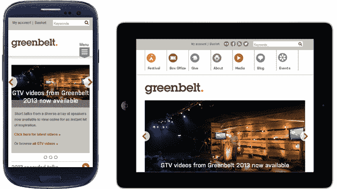
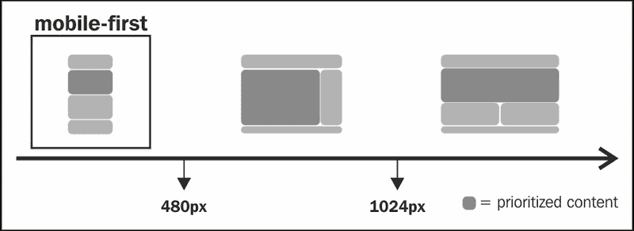
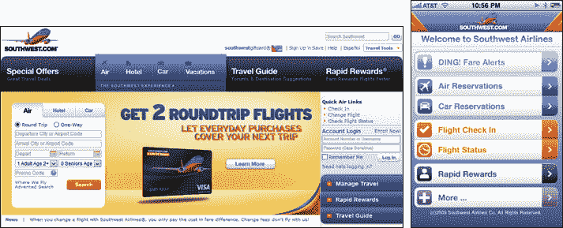
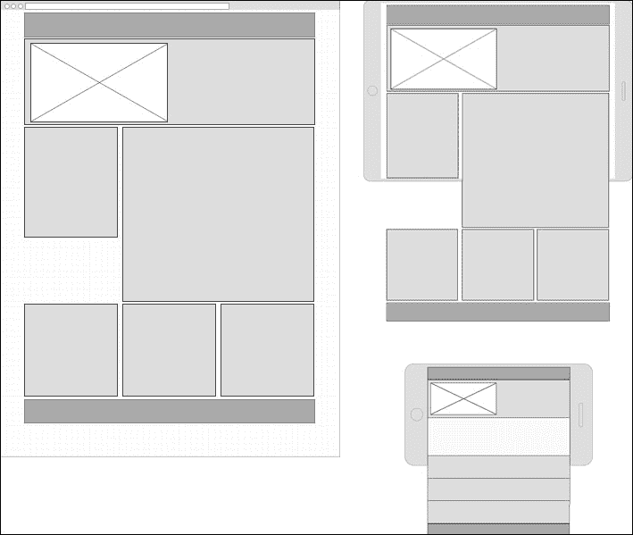

# 第一章：探索响应式网页设计

近来，在网站开发环境中，我们经常听到“响应式”这个词，不是吗？别担心，我们将一起看到它的真正含义及其对我们的网站开发的影响。

当开始开发过程时，影响决策的一个因素（有时被忽视）是我们需要用不同的设备和屏幕尺寸来预览网站布局的响应性。一些时间以前，我们习惯于使用一些网站尺寸的定义，例如 1024 像素。这是因为我们认为唯一访问内容的方式是在台式机上。但是，正如你所知，技术给我们带来了越来越多的设备（可以显示网站），改善了我们与网站互动的方式，比如大型台式机显示器、平板电脑、智能手机、智能电视、户外显示屏等等。

移动技术的这些进步和网站导航和查看技术的快速演变，推动大家重新审视网站的有限尺寸的概念，开始考虑一个可以自适应自身并为每种情况提供合适内容的结构。

在本章中，我们将学习：

+   理解响应式网页设计的概念

+   比较响应式、流动和自适应网站

+   使用媒体查询适应屏幕

+   移动优先概念和技巧

+   使用线框工具

+   在线框架中实践移动优先开发

# 理解响应式网页设计的概念

我不能在没有引用**伊桑·马科特**的情况下开始这个主题，他在 2011 年出版了《响应式网页设计》一书，这本书已成为前端社区许多其他书籍和文章的参考。

在我对马科特的书的理解中，响应式网页设计的含义是根据可用的屏幕区域为用户提供查看同一网站的不同体验。从技术上讲，它涉及以下三种主要技术的使用：

+   灵活的基于网格的布局

+   弹性图片和视频

+   聪明地使用 CSS 分割网站行为（媒体查询）

关于每种技术的更多细节将在稍后展示，但只是为了直观地澄清这个概念，让我们看看下面的例子，它在小设备（智能手机）上显示网站的左侧，中等设备（平板电脑）在中间，并在大屏幕（台式机）上显示网站的右侧：



### 注意

还有许多挑战，不仅仅是创建流动的尺寸和应用一些媒体查询。

我们将在整本书中讨论许多次要和主要的挑战。其中一些是：

+   用触摸事件替换鼠标悬停事件

+   方便在表单字段中填充数据

+   优先考虑内容

+   网站加载优化

# 比较响应式、流动和自适应网站

响应式网页设计与流式设计有些不同。流式设计是自动调整网站的结构和尺寸（通过使用相对单位来设置宽度，如 em 或百分比），但并不为用户提供看到内容布局的多样化方法。

此外，可以说响应式网页设计并不是对所有移动设备挑战的唯一解决方案。正如我们之前所看到的，响应式网页设计只是一个想法，当实现正确时可以让用户获得更好的体验，但它可能并不适用于每个人或每种设备。这就是为什么我们应该提高对新技术的了解。

我非常喜欢的一句话是由*Aaron Gustafson*写的，《自适应网页设计》一书的作者：

> *"自适应网页设计是指创建适应用户能力（在形式和功能上）的界面。"*

### 注意

自适应网页设计只为新设备实现新的 HTML5 功能，以提供增强的体验。它在旧设备上缺少这些功能，确保基本设置仍然适用于它们。

有许多方法可以实现自适应特性。以下是实现它们的最常见做法：

+   使用 jQuery 插件在移动设备上启用触摸事件交互（更多内容请参见第六章,"构建响应式图像轮播")

+   将常见表格结构转换为响应式表格（更多内容请参见第七章,"设计响应式表格")

+   仅为桌面定制表单元素的视觉（更多内容请参见第八章,"实现响应式表单")

+   使用地理位置功能为用户提供更相关的内容

+   更改信息结构，设置正确的内容优先级

*Diego Eis*，一位巴西人，以传播一些最佳实践而享有盛誉，也是[Tableless.com.br](http://Tableless.com.br)网站的创始人，在他的一篇文章中对响应式网页设计和非响应式网页设计进行了精彩的比较。想象一下，如果我们计划前往两个或更多目的地，你肯定会准备许多服装组合，比如夹克、裤子、短裤和衬衫，这会导致一个大大的沉重的行李。这是因为你无法知道每个地方的气候情况。同样，为了应对所有情况，有时这可能会稍微降低网站的性能。

# 用媒体查询调整屏幕

*Luke Wroblewski*，知名网页设计书籍的作者，在许多文章中是很好的参考，最近发布了由技术公司宣布的设备尺寸分类：

+   4"-5"的智能手机

+   5"-6"的手机/平板混合设备

+   7"-8"的平板电脑

+   9"-10"的平板电脑

+   11"-17"的笔记本电脑和可转换设备（平板电脑/笔记本电脑）

+   20"-30"的台式电脑

例如智能手机等标签只是友好的标签，只要我们知道响应式网页设计使结构响应设备的屏幕分辨率，而不是设备类型。但是，我们必须分析是否最好为特定宽度提供不同的方法。这是此模块的改进功能，其中 CSS2.1 着重于媒体类型，如打印、屏幕和手持设备；在 CSS3 中，重点是媒体特性。

媒体查询大多数被使用，大多数浏览器原生支持（Firefox 3.6 及以上，Safari 4 及以上，Chrome 4 及以上，Opera 9.5 及以上，iOS Safari 3.2 及以上，Opera Mobile 10 及以上，Android 2.1 及以上，以及 Internet Explorer 9 及以上）。现在，问题来了：IE6-IE8 呢？对于这些浏览器，有一个被称为 **Respond** 的已知轻量级解决方案，在需要支持旧浏览器时非常有用（更多信息请参见 第十章 *，确保浏览器支持*）。

在这个主题上保持简洁，以下是我们在指定媒体查询时主要使用的特性：

+   宽度：`min-width` / `max-width`

+   高度：`min-height` / `max-height`

+   方向：它检查设备是纵向还是横向。

+   分辨率：例如，`min-resolution: 300dpi`

检查下面的 CSS 代码，以更好地理解媒体查询的使用和语法：

```js
/* Standard desktop screens */
@media only screen and (min-width:1025px) {
 CSS GOES HERE
}
/* Tablets */
@media only screen and (min-width:481px) and (max-width:1024px) {
 CSS GOES HERE
}
/* Smartphones */
@media only screen and (max-width:480px) {
 CSS GOES HERE
}
```

为了澄清这段代码，下图是对这段代码的视觉解释，其中显示布局可以根据设备屏幕的不同方式显示：



### 提示

**下载示例代码**

你可以从你在 [Packt 出版社](http://www.packtpub.com) 购买的所有 Packt 图书的账户中下载示例代码文件。如果你在其他地方购买了本书，你可以访问 [Packt 出版社的支持页面](http://www.packtpub.com/support) 并注册，直接将文件通过电子邮件发送给你。

# 移动优先

让我们从分析此项目的用例开始这一节：



当项目以桌面优先开始时，通常会出现这种结果，而网页设计则会用横幅或图片、不太相关的链接、动画等填充空白。我们可能忽略了用户遵循的明显和基本流程。我们知道有时这些其他项目看起来对项目很重要，但显然这个项目设计需要进行信息架构审查。

在上一个例子中，我们可以注意到（在右侧）与用户的简单沟通可以是多么的简单，减少视觉混乱可能会更有效。这就是趋势：简化。下面 *Bill DeRouchey* 的一句话概括了这一点：

> "首先设计移动应用程序迫使我们剥离至关重要的内容。"

### 注意

换句话说，移动优先对业务很有好处，因为客观性带来金钱。您将添加到您的网站的内容对最终用户来说是有价值的，是重要的。这些新功能的实施将允许访问者在移动时更快速、更直观地访问内容，从而获得更好的用户体验。

在这种情况下，当应用移动优先概念时，一个特定的链接只能在内部页面中找到。然而，主页的目标是引导用户到正确的页面，按照网站流量信息。对于不相关的链接，在这种情况下是可以接受的。

看一下以下屏幕截图，并注意桌面版本中关于信息组织和重要链接焦点的许多差异：


# 使用线框工具

线框是一个视觉指南，帮助构建网站结构，其主要焦点在于功能、行为和内容的优先级。它应该是任何项目的第一步，因为它能更容易地分析信息架构和视觉元素的安排。

Wireframe.cc ([`wireframe.cc/`](http://wireframe.cc/)) 是开始我们项目的简单方式。这个工具非常适合快速创建低保真版本。对于详细的作品，有更好的工具，比如 Balsamiq Mockups 或 Pencil。

Wireframe.cc 的使用非常简单。进入工具的网站后，执行以下操作：

1.  在左上角选择设备。

1.  然后点击设置重新定义我们的容器宽度（如果有必要）。

1.  现在点击并拖动来绘制。

1.  在这之后，选择适当的样板。

1.  如果你选择了一个错误的样板，只需双击它进行编辑。

### 提示

当您完成使用线框时，不要忘记点击**保存**按钮，这将生成一个 URL 供进一步访问。

# 练习 1 - 在线框中练习移动优先开发

访问[`mediaqueri.es/`](http://mediaqueri.es/)，花点时间获得灵感。让我们通过应用移动优先概念为这些尺寸创建三个网站线框：智能手机、平板和台式机。

以下三个线框将被用作*练习 1*的参考：



# 总结

在本章中，我们回顾了响应式网页设计的概念。我们还学习了什么是移动优先。我们学习了媒体查询以及它们在我们网站实现中的不同之处。我们还创建了一个展示我们网站的线框。这将把我们连接到下一章，该章将对这个线框进行编码。

现在，通过学习如何使用三种不同的响应式网格系统：流体基准网格，1140 网格和我最喜欢的 Foundation4 网格，我们继续进行项目。同时，我们也会探讨如何通过使用 JavaScript 来调整网站的行为。所有这些主题将在下一章中进行解释。
