# 第二章：设计响应式布局/网格

> “考虑网页响应式设计意味着考虑比例，而不是像素。”

*特伦特·沃尔顿*之前的引用总结了本章的思想，因为当我们在进行响应式设计时，我们必须考虑流动性、适应性，而不是追求像素完美。这就是检查每个像素的习惯正在快速衰落的原因。

但是，有两种方法可以解决这个问题并保持我们的网站响应性：

+   进行网站转换时使用一些数学方法以确保良好的结果

+   使用响应式网格系统，在其中选择一堆列，并使用相对尺寸保持代码在此列中

移动技术的这些进步以及网站技术的快速发展已经推动了每个人重新审视网站的有限尺寸概念，并开始考虑一个能够自适应并为每种情况提供所需内容的结构。

在本章中，我们将学习以下内容：

+   使用 JavaScript 调整网站

+   如何以百分比格式查看对象给结构带来的灵活性

+   如何吸收响应式网格系统的特点

+   如何编写三种不同的响应式网格

+   如何使用 Photoshop 网格模板

+   如何在开始之前设置`viewport`的`meta`标签

+   如何使用 Foundation4 Grid 实现线框

# 使用 JavaScript 调整网站

正如我们在前一章中看到的，我们可以使用媒体查询来识别当前可用的区域并呈现特定的设计自定义。这个属性非常有用，但在旧版浏览器中不起作用，比如 Internet Explorer 8 及更早版本。有两个主要解决方案我们将会深入了解，它们能很好地处理媒体查询：**Adapt.js** 和 **Respond.js**。

让我们进一步分析每种解决方案的特点，看看它提供了哪些功能，除了动态捕获设备尺寸（非常类似于`@media`查询）作为对需要支持旧版浏览器的项目的替代方案。

## Adapt.js

以下是 Adapt.js 的特点：

+   捕获浏览器的尺寸后，Adapt.js 仅在需要时提供所需的 CSS。

+   它拥有非常轻量级的文件

在采用之前应考虑以下几点：

+   这个分析浏览器窗口大小的过程是按需进行的，可能会出现短暂延迟，以渲染正确的 CSS。

+   脚本必须插入到代码的开头（在`head`标签中），页面的初始加载可能需要更长的时间。

Adapt.js 提供了一些默认的 CSS 文件和媒体查询作为建议，可以在我们的网站上使用。以下是[`adapt.960.gs/`](http://adapt.960.gs/)默认提供的文件：

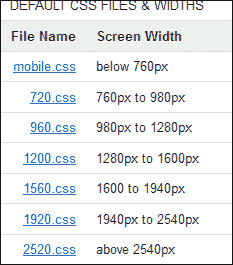

### 如何做

在您下载并将文件放置在项目中之后，将以下代码片段添加到`<head>`标签中。在下面的代码中，我们能够更改 CSS 文件的默认路径，动态适应的频率（一次或每次窗口更改时），以及基于范围的 CSS 文件：

```js
<noscript>
  <link rel="stylesheet" href="assets/css/mobile.min.css" />
</noscript>
<script>
  var ADAPT_CONFIG = {
    path: 'assets/css/',
    dynamic: true,
       range: [
    '0px    to 760px  = mobile.min.css',
    '760px  to 980px  = 720.min.css',
    '980px  to 1280px = 960.min.css',
    '1280px to 1600px = 1200.min.css',
    '1600px to 1940px = 1560.min.css',
    '1940px to 2540px = 1920.min.css',
    '2540px = 2520.min.css'
    ]
  };
</script>
<script src="img/adapt.min.js" />
```

## Respond.js

Respond.js 文件可以从[`github.com/scottjehl/Respond`](https://github.com/scottjehl/Respond)下载。以下是 Respond.js 的特点：

+   这种解决方案似乎比 Adaptive.js 更容易

+   它有一个轻量级文件

+   您需要首先检查浏览器是否真的需要此脚本，仅在需要时才执行它

+   有两个有用的 API 帮助我们调试

缺点如下：

+   它还在正确的时间执行正确的 CSS 选择方面存在一定的延迟

### 如何操作

在您下载并将文件放置在我们的项目中之后，只需在`head`标签中添加以下代码，它就会执行解决方案：

```js
<script src="img/respond.min.js">
```

### 提示

Respond.js 使用我们已经应该在代码中使用的`@media`查询，并动态应用样式。没有额外的工作！

# 百分比如何给结构提供灵活性

一些老网站，甚至是最近的网站，都不关心灵活的结构，仍然使用像素作为测量单位。像素为我们提供了更大的结构控制和精度。但是，现在，我们不再控制网站将在何处显示（正如我们在第一章中看到的，*探索响应式网页设计*），这引发了构建灵活结构的需求，其中元素可以拉伸并适应尺寸。

百分比始终按照其父元素中声明的值运行。因此，如果一个`div`标签的大小为 50%，其父元素的大小为 600 像素，则`div`标签的大小将为 300 像素，如下图所示：

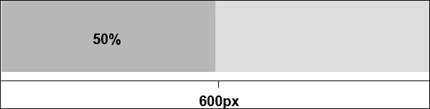

同样适用于百分比，其中其父元素的大小为对象的实际大小的 50%，则大小为 50%的`div`标签看起来像是 25%，保持比例。让我们看下面的图：

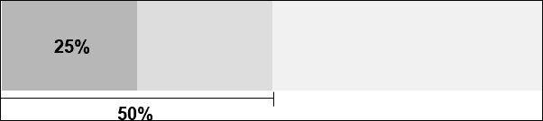

但是，问题是：如果我们不设置父元素的宽度会怎样呢？*Maurício Samy Silva*在他的博客[`www.maujor.com/blog/2013/03/08/por-que-height-100-nao-funciona/`](http://www.maujor.com/blog/2013/03/08/por-que-height-100-nao-funciona/)中对此进行了很好的解释。在这种情况下，父元素会采用当前视口的默认宽度。换句话说，随着浏览器窗口的调整，此宽度会自动更改，这一事件正是赋予我们灵活结构的力量。

回到之前的例子，其中`div`设置为 50%，在可用区域内的视觉上看起来是一半大小，如下图所示：

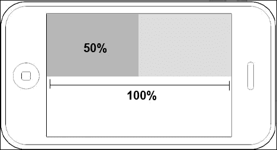

现在您已经了解了结构的流动性的重要性，另一个重要任务是将填充和边距以及百分比转换。例如，当我们需要在大屏幕上显示大的水平填充时，它会产生影响，因为如果同一个网站在智能手机上看到，并且填充已经定义为像素，它将在屏幕上占据大量空间。

我们可以为手机制定一个例外规则，减少这个空白空间。但是，试想一下，为所有元素做这项工作将需要多少努力！最好的选择是将此间距从像素转换为百分比。

## 将像素转换为百分比

将像素转换为百分比的主题很重要，因为这是魔法开始展现的地方；换句话说，我们将通过一个例子看到如何放弃像素的绝对大小并将其转换为百分比。如果我们的项目的目的是更好地控制元素的灵活性，那么应该特别使用将像素转换为百分比的过程。

让我们练习将以下基于像素的结构转换为百分比：

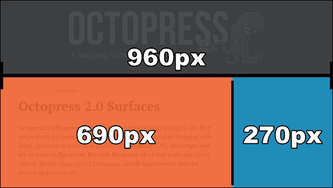

以下代码是前一个屏幕截图中详细信息的 CSS 代码示例：

```js
#wrap {
 width:960px;
}
#content {
 width:690px;
 float:left;
}
#right-sidebar {
 width:270px;
 float:left;
}
```

### 注意

让我们来看看这个神奇的公式：*目标 / 上下文 = 结果*。

在前述公式中，*目标* 是以像素为单位的原始元素宽度，在以下代码中为 `690`，*上下文* 是其容器的宽度，在此为 `960`，*结果* 是灵活的值：

```js
#wrap {
 width:100%; /* container 960 */
}
#content {
 width:71.875%; /* 690 ÷ 960 */
 float:left;
}
#right-sidebar {
 width:28.125%; /* 270 ÷ 960 */
 float:left;
}
```

### 提示

分享一点我的经验，我建议在结果之前放置原始值。当我们想再次转换大小并且忘记了原始像素值时，这将产生差异。

我还想强调不要四舍五入数学结果的重要性。这对于元素的灵活性至关重要，可以防止不希望的断裂。

以下图是转换为灵活结构的结果：

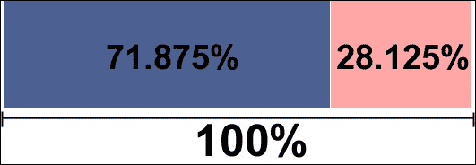

为了帮助简化此转换，有一个名为**Flexible Math**的工具，可以在 [`responsv.com/flexible-math/`](http://responsv.com/flexible-math/) 找到。只要基于父元素大小进行转换的像素计算（正如我们在前一节中看到的）。

还有另一种转换方式，即从 em 转换为字体大小和行高的像素，但我们将在第四章*设计响应式文本*中更详细地学习。虽然我们正在谈论 EM，但使用的神奇公式将是相同的，需要在其他确定的点上留意一些。

我们将在第五章中看到，*准备图像和视频*，不指定 `` 标签的大小只是缩放图像的第一步。后来，我们将详细了解如何使图像流动，并且还有一些在每种情况下最适合显示图像和视频的方法。

如果我们在数学转换上有很多工作，并且它花费了很多时间，我们应该考虑另一种方法。有一种更方便和更快速的方法来获得这种灵活的结构，其名称是响应式网格系统，我们将在以下部分中看到。

# 什么是响应式网格系统？

网格系统本身可以被标记为开发工具包或一小组 CSS 文件，这些文件将帮助我们快速开发网站。其中一些具有固定宽度的列（可能会根据使用的工具而变化）。列是网格系统的最小度量单位。大多数网格系统包含 12-16 列。间隔是用于在列之间创建空间的边距。

此外，如果设计基于网格，网格系统会节省开发时间。有时，布局创建可能会受到列的限制，但这并不太常见。网格系统的优势在于它们帮助我们实现更好的可读性，并平衡视觉权重、灵活性和整体页面的凝聚性。

为了更好地理解网格系统的工作原理，请查看以下截图，并注意可以将标题区域的宽度测量为 12 列（全宽），而**侧边栏**区域仅为 3 列：

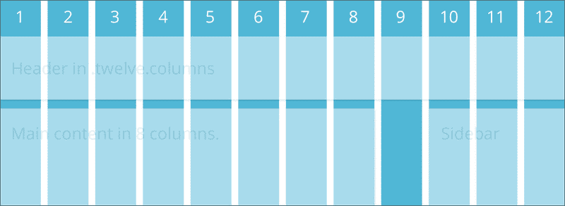

何时不应该使用网格？如果您的网站布局使用不规则的列尺寸和不规则的间距，则可能无法实现网格的实施。

现在问题来了：响应式网格系统和非响应式网格系统之间的主要区别是什么？

以下是响应式网格系统的特点：

+   它必须在不同尺寸下具有不同的特征

+   它必须在断点之间流动

+   它必须具有足够的控制权来决定哪些列会在哪一点转换

+   类应该在所有断点上都能理想地有意义

## 响应式网格系统

现在，我们将看到三种不同的应用系统，但为了我们渐进的理解，我想从描述较不复杂的系统开始，然后再描述具有更多选项和资源的系统。

### 提示

在选择最适合您项目的网格之前，请阅读所有这些网格系统。此外，还有其他类型的响应式网格，我尚未尝试在实际项目中实施。

### 流动基线网格系统

此开发工具包的目标是为响应式网站的开发提供便捷和灵活性。Fluid Baseline Grid 代码（[`fluidbaselinegrid.com/`](http://fluidbaselinegrid.com/)）简单、轻量、非侵入性，并且可以根据项目的需求进行定制。

此网格系统基于三列折叠布局：移动设备一列，平板电脑两列，桌面及以上三列。让我们看看它的用法。

要这样设置代码，我们只需在想要内容填充的结构中使用类 `g1`，然后对于两列使用 `g2`，三列使用 `g3`。看下面的代码示例：

```js
<div id="content">
    <div class="g2">
        ...
    </div>
    <div class="g3">
        ...
    </div>
    <div class="g1">
        ...
    </div>
</div>
```

以下是该代码的预览：

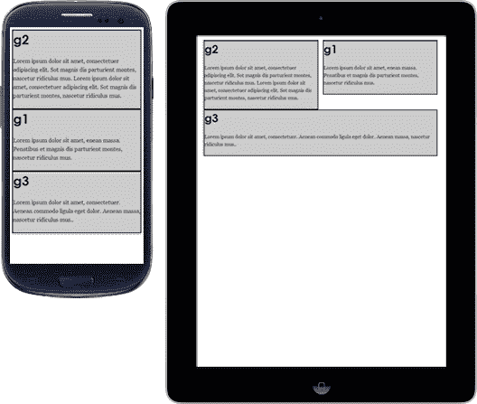

现在，让我们先看一个网站示例，然后尝试使用类来编写结构：

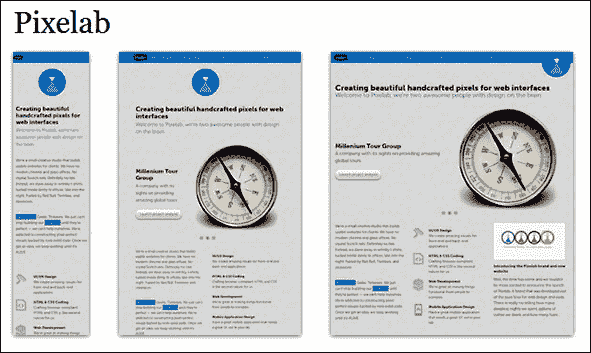

HTML 结果应该如下：

```js
<div id="content">
    <div class="g3">
        ...
    </div>
    <div class="g1">
        ...
    </div>
    <div class="g1">
        ...
    </div>
    <div class="g1">
        ...
    </div>
</div>
```

你注意到指南针图像在手机屏幕上是隐藏的吗？在这种情况下，解决方案是在手机 CSS 上隐藏轮播图，然后在平板电脑 CSS 上显示它（以及桌面）。

使用 Fluid Baseline Grid 的主要优势如下：

+   流式列

+   具有美观排版标准的基线网格

+   **响应式设计行为**

+   使用 Normalize.css 修复常见的浏览器不一致性

+   包含了开始所需的最少文件的简单文件结构

+   对 IE6/7/8 的 Polyfills 支持：Respond.js（媒体查询）和 html5shim（HTML5 元素）

**流式列**默认为最小三列折叠网格，列宽约为 31%，列之间的间隔为 2%。如果网站设计需要更多列，那也没问题，因为可以在 CSS 代码中进行更改。

**基线网格**为排版带来了跨浏览器的解决方案，改善了可读性，并在文本内部创建了更好的和谐。主要使用的字体是 Georgia 和 Futura，它们可以轻松更改以匹配项目的需求。

**Fluid Baseline Grid** 设计为移动优先，为我们的响应式设计实现提供了常见的断点。CSS 代码准备从小屏幕开始定制，并根据设备的可用区域在内容显示上建议差异。只要它基于列，Fluid Baseline Grid 就被分为：移动设备一列，平板电脑两列，桌面及其他设备三列。

### 1140 网格

1140 Grid（[`cssgrid.net/`](http://cssgrid.net/)）有一个简单的结构。它的目标是在定义每个主要元素的宽度时提供更高的代码开发效率。它被分为 12 列，这些列将根据您的偏好合并或不合并。但是，当设计这个项目时，宽度尺寸被限制在最大 1280 px。如果项目不需要在大设备上显示，1140 Grid 对于所有其他较小的尺寸都非常有效。

为了澄清，以下代码显示了您实际上可以这样做：

```js
<div class="container">
   <div class="row">
       <div class="onecol">
           ...
       </div>
       <div class="twocol">
           ...
       </div>
       <div class="threecol">
           ...
       </div>
       <div class="threecol last">
           ...
       </div>
   </div>
</div>
```

下面的图示展示了结果：

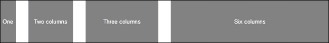

作为我们知识吸收过程的一部分，让我们回到 Pixelab 示例并使用 1140 Grid 进行编码：

```js
<div id="container">
   <div class="row">
        ...
   </div>
   <div class="row">
        <div class="fourcol">
          ...
        </div>
        <div class="fourcol">
          ...
        </div>
        <div class="fourcol last">
          ...
        </div>
   </div>
</div>
```

行类将内部列居中，并将`1140px`定义为`max-width`。

类`.onecol`，`.twocol`，`.threecol`，`.fourcol`，`.fivecol`，`.sixcol`，`.sevencol`，`.eightcol`，`.ninecol`，`.tencol`，`.elevencol`和`.twelvecol`可用于每个列。此外，它们将在任何组合中使用，以便在行内添加的列总和为十二列或更少。在最后一个元素中，请记得也添加一个类`last`；这将去除额外的边距。

与 Fluid Baseline Grid 相比，其中一些少许不同之处是 1140 Grid 已经实现了更多的列（为开发者提供更多的选项），但是 Fluid Baseline Grid 的开发者们可以自由地在那里实现它。

除了简单的结构之外，1140 Grid 还因以下特点而备受关注：

+   准备好缩放图像的 CSS 代码。

+   百分比间距。

+   浏览器支持（除 IE6 外）

+   最小文件结构

+   可下载的 PS 模板

### Foundation4

Foundation4，[`foundation.zurb.com`](http://foundation.zurb.com)，是一个完整的框架，内含许多组件。它们是预定义的，并且被专业地样式化，将作为我们项目的基础。仅关注 Foundation4 的网格组件会让我们惊讶，因为它提供了许多选项。

由于下载区域的存在，这个框架是与众不同的，它展示了下面的截图所示的屏幕，因为它给了开发者们以最适合他们的方式开始他们的项目的自由（如果他们已经对网格有一些通用知识）：

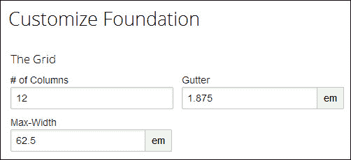

但是，不用担心；如果你仍然在学习，它默认使用最常用的值，如 12 列和 62.5 em（1000 px）的最大屏幕尺寸。

Foundation4 中还有其他好的功能，如下所示：

+   预定义的 HTML 类。

+   小网格和大网格。

+   嵌套我们的网格。

+   偏移。

+   居中的列。

+   源顺序。

+   面向移动端。

+   支持浏览器的 Normalize 和 Modernizr 脚本。

+   不支持像 Internet Explorer 7 及更早版本的浏览器。此外，Internet Explorer 8 对网格和一些 UI 组件（如输入切换器）的支持有限。

+   要在 Internet Explorer 8 中使用 Foundation4，它推动开发者使用其之前版本的补充解决方案，该解决方案可在[`foundation.zurb.com/docs/support.html`](http://foundation.zurb.com/docs/support.html)找到。

该框架值得更多的关注，因为它有更多的选项和优势。这就是我们详细了解它们的原因。在接下来的例子中，我们将使用工具建议的 12 列作为参考。

Foundation4 拥有一堆预定义的 HTML 类，这些类对我们的开发很有帮助，因为所有的代码都已经创建好了，我们只需要通过类名来调用它。在下面的例子中，我们看到一个小类和元素将占据的列数：

```js
<div class="row">
 <div class="small-3 columns">...</div>
 <div class="small-6 columns">...</div>
 <div class="small-3 columns">...</div>
</div>
```

下图显示结果：

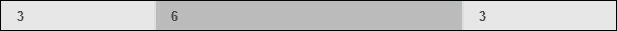

注意到 3、6 和 3 的和等于 12。另外，还有一个选项可以将类从`small`更改为`large`。如果我们交换这些类，当我们减小浏览器宽度达到 768 像素时，每个`<div>`标签将占据最大宽度。这两个类可能会同时出现——在小于 768 像素的小屏幕上显示内容——而在大屏幕上，宽度就像前面的示例中给出的那样。

在这种情况下，代码将如下所示：

```js
<div class="row">
 <div class="small-6 large-5 columns">...</div>
 <div class="small-6 large-7 columns">...</div>
</div>
```

Foundation4 Grid 允许我们嵌套到任何深度。这个技术通常用于执行相当复杂的设计实现，或者更好地定位表单元素。以下代码是其用法的一个示例：

```js
<div class="row">
 <div class="small-8 columns">8
   <div class="row">
     <div class="small-3 columns">3 Nested</div>
     <div class="small-9 columns">9 Nested</div>
   </div>
 </div>
 <div class="small-4 columns">4</div>
</div>
```

以下图显示结果：

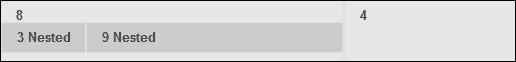

我们可以使用`offset`在行中的列之间创建额外的间距。通过调整这个参数，我们可以对齐列的位置。记住，所有的 offset 都位于元素的左侧。同样，数字的和应该等于 12。让我们在下面的例子中看一下这个，第一个`div`标签填充了两列，然后有两列的偏移，然后另一个`div`标签填充了八列：

```js
<div class="row">
 <div class="large-2 columns">2</div>
 <div class="large-8 large-offset-2 columns">8, offset 2</div>
</div>
```

结果如下所示：

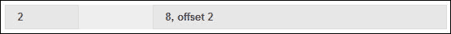

`centered column`类是用来将特定列（而不是内部内容）定位在行的中间的。Foundation4 提供了两个类：`large-centered`和`small-centered`。就像我们之前看到的，小版本将显示为前面没有被大版本覆盖的样子。例如，如果我们想要显示一个占据六列并且居中（适用于小屏幕和大屏幕）的`div`标签，我们应该在之前使用以下代码：

```js
<div class="row">
 <div class="small-6 small-centered columns">6 centered</div>
</div>
```

结果如下：

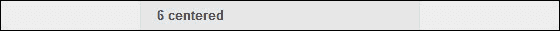

也许以下功能有点令人困惑，但当我们想要将源代码放置在相关内容的顶部时非常有用。要做到这一点，我们只需要使用`push`和`pull`类。以下功能也会分别影响每个版本（在函数前使用`small`或`large`，即`large-push-8`）或两个版本一起使用：

```js
<div class="row">
 <div class="small-4 push-8 columns">4</div>
 <div class="small-8 pull-4 columns">8, last</div>
</div>
```

以下是结果：

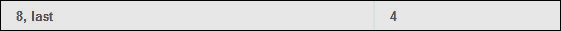

# Photoshop 网格模板

为了在创建设计时方便查看列，有一个名为 Guideguide 的 Photoshop 插件。

Guideguide 插件([`guideguide.me/`](http://guideguide.me/))支持一些版本的 Photoshop，包括：CS5、CS6 和 CC。但是，如果你使用 Photoshop CS4，该插件的 2.03 版本将可用，但不会再更新新功能。这是一个指导我们为 Photoshop 文档创建自定义参考线的工具。

安装 Guideguide 插件并创建一个空白文件后，当我们在 Photoshop 中进行访问时，它将打开下面截图中显示的窗口；我建议使用所示的初始值填充，如果您对网格不太熟悉的话：

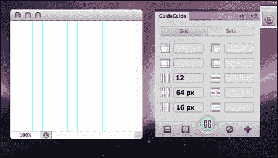

然后，点击**GG**按钮，它会在我们的文档中创建参考线，在布局创建中非常有用。

# 在开始之前设置 viewport 的 meta 标签

`viewport`的`meta`标签通过显示可视区域的一部分来工作。这种配置在我们设计响应式网站时非常重要，因为如果没有它，移动设备浏览器将向用户显示网站的缩小版本。对于它的使用，没有标准的语法，但是所有常见的移动浏览器都支持以下标签：

```js
<meta name="viewport" content="width=device-width">
```

其他功能，比如`initial-scale`可以用来定义`viewport`的`meta`标签，可以阻止用户在网站中以放大模式打开，并且 `maximum-scale`会限制用户放大内容。以下代码是`viewport`限制用户体验的一个例子，不允许使用缩放功能：

```js
<meta content="width=device-width, initial-scale=1, maximum-scale=1" name="viewport">
```

# 2a 练习 - 为线框创建布局设计

现在，我们已经有了线框并了解如何操作网格的列，我们需要根据列中的主要元素调整线框，如下截图所示：

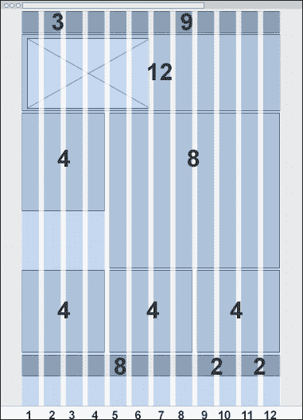

在那之后，该是时候给它上色，并设想为所有设备提供最佳的用户体验。

根据第一章中*练习 1*的线框，*探索响应式网站设计*，以下截图显示了布局设计的建议：

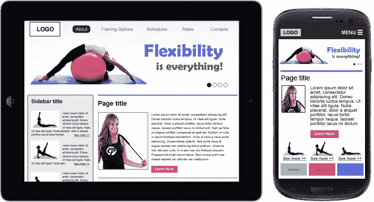

当我们正在自定义主要元素时，请记住将其保持在指导方针内，这将使下一步更容易。否则，我们将花费比预期更多的时间来编码它。

下图显示了主要元素如何适应列：

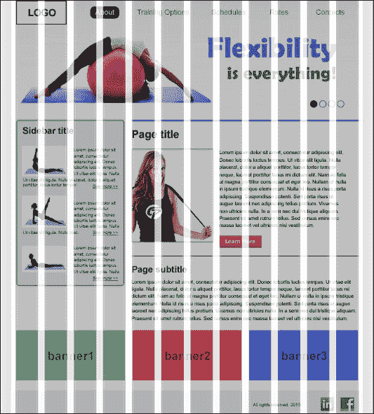

# 练习 2b – 使用 Foundation4 Grid 结构化我们的网站

在看到了一些响应式网格系统的使用（从简单解决方案开始，然后进入更完整的解决方案），让我们使用 Foundation4 Grid 来结构化我们的代码，快速创建响应，并且不需要编写一行 CSS 代码来完成。同时，请记得在 `<head>` 标签中配置视口。

使用 Foundation4 Grid，执行以下推荐步骤：

1.  开始编写 HTML 脚本。

1.  确定结构中的行并将 `row` 类添加到现有元素或新的 `div` 标记中。

1.  测量每个主要元素将填充多少列，并将此值设置为类中。

让我们看看以下 HTML 是如何完成的：

```js
<!DOCTYPE html>
<html lang="en">
<head>
 <meta charset="utf-8" />
 <meta name="viewport" content="width=device-width" />
 <title>Responsive Web Design using jQuery & CSS3</title>
 <link rel="stylesheet" href="css/foundation.css" />
</head>
<body>
 <header class="row">
   <a class="large-3 columns" href="#">LOGO</a>
   <nav class="large-9 columns">
     <ul>
       <li><a href="#">About</a></li>
       <li><a href="#">Training Options</a></li>
       <li><a href="#">Schedules</a></li>
       <li><a href="#">Rates</a></li>
       <li><a href="#">Contacts</a></li>
     </ul>
   </nav>
 </header>
 <div class="row">
   <section class="small-12 columns">
     
   </section>
 </div>

 <div class="row">
   <section id="content" class="large-8 push-4 small-12 columns">
     <article>
         <h2>Page title</h2>
         <p>FPO text: Lorem ipsum dolor sit amet...</p>
         <p><a href="#" class="button learn-more">Learn more</a></p>
     </article>
     <article class="subcontent">
         <h2>Page subtitle</h2>
         <p>FPO text: Lorem ipsum dolor...</p>
     </article>
   </section>
   <aside class="large-4 pull-8 columns">
     <h2>Sidebar title</h2>

     <div class="row">
       <div class="small-4 large-12 columns">

     <span>FPO text: Lorem ipsum dolor...</span> <a href="#">See more</a></div>
       <div class="small-4 large-12 columns">

<span>FPO text: Lorem ipsum dolor...</span> <a href="#">See more</a></div>
       <div class="small-4 large-12 columns">

     <span>FPO text: Lorem ipsum dolor...</span> <a href="#">See more</a></div>
     </div>
   </aside>
 </div>

 <section id="banners" class="row">
   <div class="small-4 columns">Banner1</div>
   <div class="small-4 columns">Banner2</div>
   <div class="small-4 columns">Banner3</div>
 </section>

 <footer class="row">
   <p class="large-2 small-9 large-offset-8 columns">All rights reserved. 2013</p>
   <p class="large-2 small-3 columns">icons</p>
 </footer>
</body>
</html>
```

在这段代码中，我折断了一行额外的内容，使每一行都容易看到，并且还突出显示了网格使用的类。让我们观察每行的列之和：

1.  `small` = 12 列

1.  `small` = 12 列（4 + 4 + 4）和 `large` = 12 列（每行一个列）

1.  `small` = 12 列（4 + 4 + 4）

1.  `small` = 12 列和 `large` = 12 列（2 + 8 + 2）

以下截图显示了在大于 768 px 宽度的设备上没有编写任何 CSS 代码的结果：

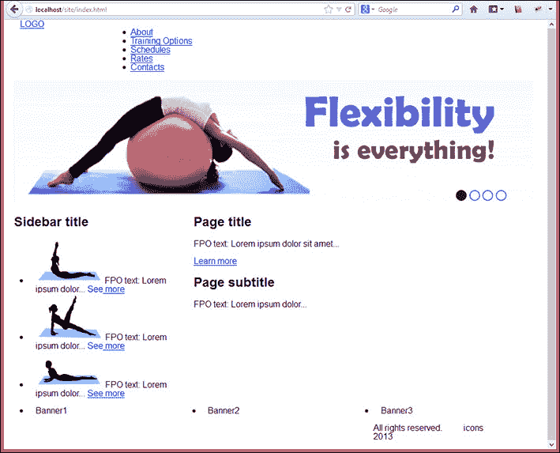

下图显示了在宽度小于 768 px 的设备上相同站点的屏幕截图：

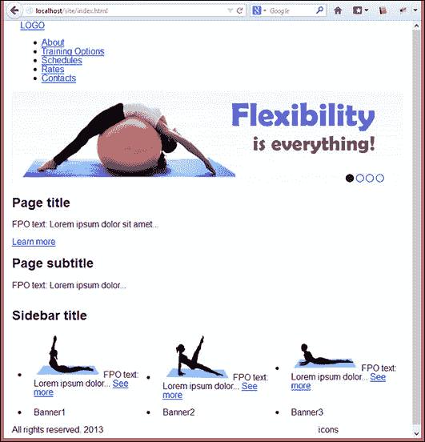

请放心；网站看起来仍然很糟糕，因为这只是项目的第一步。我们需要做一些视觉调整来完成我们的任务。

### 提示

我建议你搜索一些漂亮的图片来使用在你的网站上，改善它的外观和感觉。否则，您可以转到[`placehold.it/`](http://placehold.it/) 创建一个占位符来保留图片的空间。

这是一种很好的方法，可以避免修改解决方案附带的 CSS。在这种情况下，我们将创建一个新的 CSS 文件并将其包含在我们的网站上。在 `header` 部分，在 Zurb Foundation CSS 文件之后，包含您自己的 CSS 代码：

```js
<link rel="stylesheet" href="css/mystyle.css" />
```

在这个 CSS 中，我们将自定义分成三个部分，应用级联样式，并避免重复代码的部分：

+   两个版本

+   小版本（小于 768 px）

+   大版本（大于 768 px）

下面的代码用于从我们的网站开始定制。随意使用它，只要它只是匹配布局的建议。

```js
#banners div {
  text-align: center;
  height: 100px;
  line-height: 100px;
  background: #f65050;
}
#banners div:first-child {
  background: #7ddda3;
}
#banners div:last-child {
  background: #506ff6;
}
@media only screen and (max-width: 48em) {
  .subcontent,
  aside span {
    display: none;
  }
  aside .img-aside {
    display: block;
    margin: 0 auto;
  }
  aside div {
    text-align: center;
  }
}
@media only screen and (min-width: 48em) {
 aside .img-aside {
    float: left;
  }
}
```

# 摘要

在本章中，我们学习了三种使用 JavaScript 解决方案呈现特定 CSS 代码的不同方法：Adapt.js、Respond.js 和 Breakpoints.js。现在，我们也明白了如何通过数学运算将像素转换为百分比，并发现结果。我们还学习了什么是响应式网格系统，以及如何使用每种类型的响应式网格系统。

最后，我们开始使用网格（基于来自第一章的线框图，*探索响应式 Web 设计*），编写我们的网站，这与下一章相连接，下一章我们将涵盖不同的方法来实现响应式菜单导航，例如切换菜单、侧栏菜单（如 Facebook 等）等。
