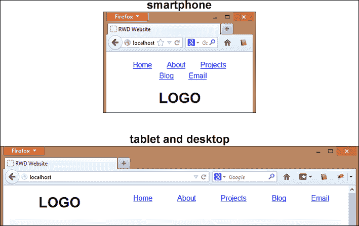
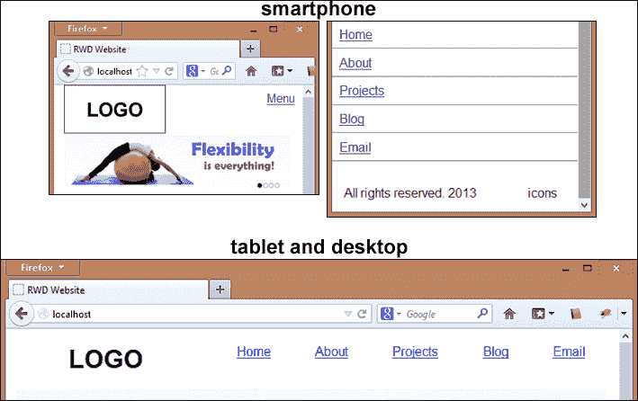
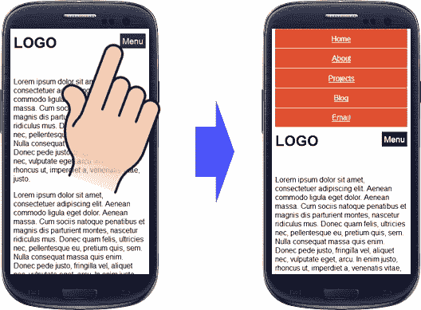
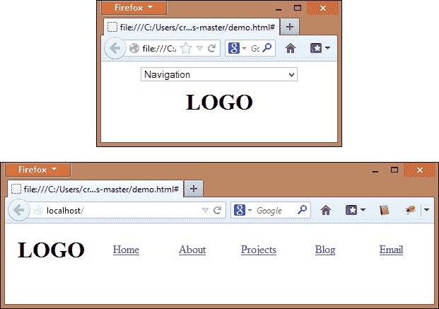
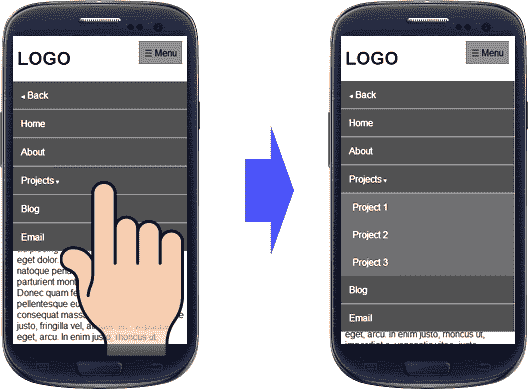
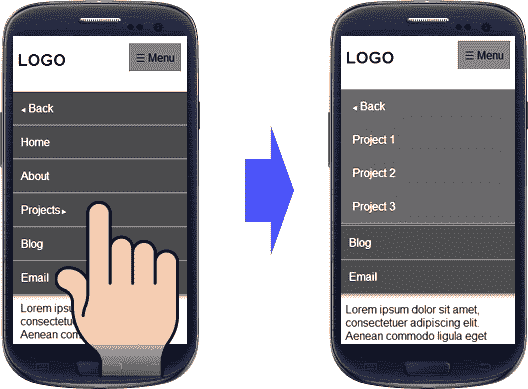
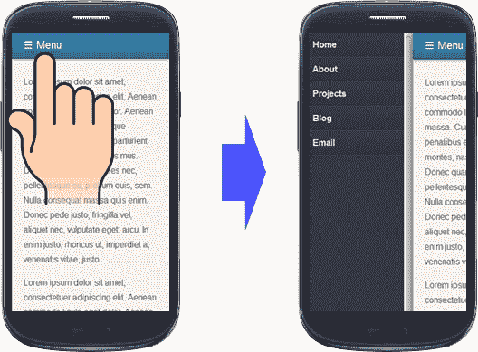

# 第三章：构建响应式导航菜单

当网站正在建设时，`header` 部分是一个重要的部分。在这个区域有一些常见的元素，如徽标、登录、导航选项、注册选项和搜索字段。但规划这个区域并不太容易，因为如果我们把所有元素放在一起，我们会给用户一个杂乱的导航。另一个选择是为我们的头部保留大量的空间，但这可能会在智能手机上遮挡更多的屏幕上方内容。预期的结果是占用少量的空间来处理您的标题，并有效地处理那个空间以显示这些元素。

在这一章中，我们将分析一些类型的导航菜单，在何种情况下以一种清晰直观的方式使用每种类型，并避免使用户感到沮丧。这就是为什么我们设计我们的导航菜单的方式，让用户能够轻松清晰地看到其中的主要和子项对我们很重要。

在这一章中，我们将：

+   设计一个改善可用性的菜单

+   查看最常用的响应式导航模式以及如何编写每种类型的代码

+   通过做练习来应用我们最近获得的知识

# 通过改善其可用性来设计一个菜单

在响应式网站上，特别是对于那些使用移动优先概念的网站，内容是用户访问我们网站的主要原因，所以我们必须提供一个合理的空间在屏幕上展示内容之前。

为了提供这个空间，我们需要更好地处理菜单的显示方式，以便根据设备提供另一种视图。

无论如何，目标都是相同的：使用户更容易找到他们正在寻找的内容，而不会对有用的区域产生重大影响。当菜单被组织好时，我们给了用户自由选择通过我们的网站导航到哪里的权利。

事实上，关于这两种界面之间的决斗（顶部和左侧导航菜单）没有一个答案。有时导航在一个上下文中运作良好；然而，在另一个上下文中可能不那么有效。要找出哪种导航最适合我们的站点，了解顶部和左侧导航菜单在哪些不同的上下文中效果最好是很重要的。让我们在五轮比赛中分析这场战斗：

+   **扫描**：在这方面，左侧导航菜单获胜，因为它占用更少的空间来显示所有项目，并且促进了垂直扫描（对用户更自然）。

+   **页面空间**：在这方面，顶部导航获胜，因为它使用最小的垂直空间，将内容区域保留给内容。

+   **项目优先级**：在这一轮中，顶部和左侧导航菜单之间打成平手。顶部导航的项目没有相同的权重，因为最左边的项目将在其他项目之前被阅读，但这取决于内容类型。

+   **可见性**：在这一轮中，顶部和左侧导航菜单之间存在一种平衡。顶部导航菜单更容易看到，因为它通常靠近标志。在左侧导航中，一些项目可能隐藏在折叠下面。

+   **主题和兴趣**：在这一轮中，顶部和左侧导航菜单之间存在一种平衡。如果我们的网站针对广泛的受众提供各种内容（例如电子商务网站），左侧导航菜单对这些用户更好，因为他们拥有各种兴趣，并且是选择要查看的项目的人。然而，对于特定主题，顶部导航菜单更合适，因为快速找到高优先级项目更为重要。

# 最常用的响应式导航模式

规划移动导航并不是一件容易的事情，因为我们需要以响应式的方式提供不显眼且快速访问特定内容，这取决于网站的目标。经过长时间的研究，*布拉德·弗罗斯特* 在他对流行菜单技术的研究中总结了一些趋势，并建立了菜单类型概念的模式。

根据他的文章（[`bradfrostweb.com/blog/web/responsive-nav-patterns/`](http://bradfrostweb.com/blog/web/responsive-nav-patterns/)），导航模式有：

+   顶部导航

+   底部锚点

+   切换菜单

+   选择菜单

+   仅底部

+   多重切换

+   切换和滑动

+   侧边栏

让我们检查每个，看看它们的样子，并了解哪种方法更适合你的项目。

## 顶部导航

顶部导航模式是因为它需要一点额外的工作而成为互联网上最受欢迎的模式。要实现这个解决方案，我们只需要保持菜单在顶部，正如我们在下面的截图中所看到的那样：



### 如何做…

在这种情况下，如前面的截图所示，在智能手机上显示菜单位于标志的上方。因此，让我们编写这个 HTML 脚本来理解这些变化：

```js
<nav id="site-nav">
  <ul>
    <li><a href="#">Home</a></li>
    <li><a href="#">About</a></li>
    <li><a href="#">Projects</a></li>
    <li><a href="#">Blog</a></li>
    <li><a href="#">Email</a></li>
  </ul>
</nav>
<h1 id="logo">LOGO</h1>
```

如果你喜欢重新排列这些元素（将标志显示在顶部然后是菜单），你需要反转元素的顺序，在代码中将 `<h1>` 标签移到 `<nav>` 标签之前。

不幸的是，`<nav>` 标签不受 Internet Explorer 8 及更低版本的支持。然而，这个标签有很好的语义含义，我推荐使用它。我们将在第十章中看到，*Ensuring Browser Support*，如何使用 `Html5shiv with Modernizr` 处理它。通过采用移动优先的概念，并在 CSS 中使用这个第一个代码块，我们可以自定义菜单的显示方式，通过填充水平区域来填充水平边距，并将菜单对齐到中心：

```js
/* mobile-first */
#site-nav ul {
  list-style: none;
  text-align: center;
  padding: 0;
}
#site-nav li {
  display: inline-block;
  margin: 0 5%;
  line-height: 1.5;
}
#logo {
  text-align: center;
  clear: both;
}
```

对于大于 768 像素的屏幕，菜单宽度减小到 70%，并向右浮动。此外，标志现在向左浮动，宽度为 30%，如下面的代码所示：

### 提示

这些百分比只是示例的一部分。

```js
/* desktop */
@media only screen and (min-width: 768px) {
 #site-nav ul {
   width: 70%;
   float: right;
 }
 #logo {
   float: left;
   width: 30%;
   clear: none;
 }
}
```

### 提示

实施起来非常简单，但是当菜单项超过三行时要小心，因为它将耗费大量重要区域。

## 页脚锚点

页脚锚点是一个聪明的解决方案，其主要目标是在不影响移动用户在小区域中看到我们的网站的情况下，为内容保留更多有用的空间。为此，需要将主菜单重新分配到页脚，并只在页眉中保留一个锚点链接，用户点击它时将聚焦于菜单。

以下截图表示了这种导航模式仅应用于智能手机，空间较小：



### 如何做到这一点

让我们从第一个导航模式使用相同的 HTML 代码开始。但是现在我们将菜单移动到 DOM 的底部，就在`</body>`标签之前插入下面的链接，因为当用户点击它时，网站将聚焦于导航菜单：

```js
<a id="link-to-menu" href="#site-nav">☰ Menu</a>
```

### 注意

十进制代码`☰`是代表菜单的符号，因为它显示了一个有三条线的符号。

在智能手机的 CSS 代码中，我们需要：

+   为菜单项创建一个样式。一些开发人员喜欢逐行列出这些项目（便于触摸），但这取决于你。

+   为页眉按钮创建一个样式（将用户转到菜单）。

CSS 代码如下所示：

```js
/* mobile-first */
#site-nav ul {
  list-style: none;
  text-align: center;
  padding: 0;
}
#site-nav li a {
  display: block;
  border-top: 1px solid #CCC;
  padding: 3%;
}
#site-nav li:last-child a {
  border-bottom: 1px solid #CCC;
}
#link-to-menu {
  position: absolute;
  top: 10px;
  right: 10px;
}
```

对于平板电脑和桌面（屏幕宽度大于 768 px 的设备），最好的方法是隐藏此页眉按钮。现在，我们需要在页眉上展示菜单，而不对 HTML 做任何更改（我们只是将其移到页脚区域）。

让我们通过设置菜单位置在顶部并隐藏页眉按钮来实现以下代码：

```js
/* tablet and desktop */
@media only screen and (min-width: 768px) {
 #site-nav {
   position: absolute;
   top: 0;
   left: 30%;
   width: 70%;
 }
 #link-to-menu {
   display: none;
 }
 #site-nav li {
   display: inline-block;
   margin: 0 5%;
   padding: 0;
   width: 18%;
   border: none;
   line-height: 1.5;
 }
 #site-nav li a {
   display: inline;
   border: none;
   padding: 0;
 }
 #site-nav li a,
 #site-nav li:last-child a {
   border: none;
 }
}
```

## 切换菜单

切换导航模式与以前的模式比几乎具有相同的行为。真正的区别在于当用户点击页眉上的链接时，而不是将用户引导到锚定菜单，菜单会在页眉之后滑下来，从而为用户提供令人印象深刻的效果和快速访问主链接。它的实现相对容易，我们很快就会看到。

### 提示

为了提高动画性能，尝试使用`max-height`属性

### 响应式导航插件

响应式导航插件，[`responsive-nav.com/`](http://responsive-nav.com/)，是为小屏幕创建切换导航的轻量级解决方案。我们喜欢三个主要特点，它们是：

+   使用触摸事件（我们稍后会更好地理解它）和 CSS3 过渡效果

+   构建此插件时要考虑到无障碍，并与禁用 JavaScript 一起使用。该插件不需要任何外部库

+   适用于所有主要桌面和移动浏览器，包括 IE 6 及更高版本

### 如何做到这一点

下载此解决方案的文件后，让我们将以下代码插入到我们的 HTML 的`<head>`标签中：

```js
<link rel="stylesheet" href="css/responsive-nav.css">
<script src="img/responsive-nav.js"></script>
```

我们还将使用第一个示例的相同 HTML 代码，但是在 DOM 的`</body>`闭合标签之前，我们需要插入执行脚本的函数：

```js
<script>
var navigation = responsiveNav("#site-nav");
</script>
```

现在，让我们从页脚锚点模式中插入相同的菜单样式：

```js
nav ul {
  list-style: none;
  text-align: center;
  padding: 0;
}
.menu-item a {
  display: block;
  border-top: 1px solid #CCC;
  padding: 3%;
}
.menu-item:last-child a {
  border-bottom: 1px solid #CCC;
}
```

就是这样了。我们完成了。有一些可自定义的选项，可以增强我们的功能实现。随意测试其他选项，但默认情况下已设置为 CSS3 动画，显示时间为 400 毫秒，在自动生成的切换按钮之前显示，或者您可以按照以下方式定义您自己的设置：

```js
<script>
var navigation = responsiveNav("#site-nav", {
  customToggle: "#mybutton"
});
</script>
```

在下面的截图中，我们将看到**响应式导航**窗口正在使用，它在智能手机上更改菜单样式，并以不显眼的方式显示菜单：



### 提示

切换按钮的定制和菜单中的橙色默认情况下不显示。这只是插件创建者在其演示中提出的建议之一。

## 选择菜单

一种显著减少菜单占用空间的方法是使用此模式，其中所有菜单项都包装在`<select>`标签中。它避免了一些对齐问题，并确保了跨浏览器解决方案。

然而，该方法存在影响可用性、可访问性和 SEO 的问题。乍一看，主导航菜单的选择菜单看起来不正确，因为它与设计不协调。也许用户会觉得这很尴尬，或者可能会与`select`表单元素混淆。

### TinyNav.js jQuery 插件

TinyNav.js jQuery 插件，[`tinynav.viljamis.com/`](http://tinynav.viljamis.com/)，非常有用，可以将`<ul>`或`<ol>`导航转换为小屏幕的选择下拉菜单，当用户选择一个选项时，它会自动导航到正确的页面，而无需额外努力。它还可能选择当前页面，并自动为该项目添加`selected="selected"`。

### 操作方法

让我们开始使用第一个导航模式的相同 HTML 代码。下载 TinyNav 插件后，我们将在`<head>`标签中包含以下代码：

```js
<script src="img/jquery-1.9.1.min.js"></script>
<script src="img/tinynav.min.js"></script>
```

并在`</body>`闭合标签之前包含以下代码：

```js
<script>
$(function () {
  $("#site-nav ul").tinyNav()
});
</script>
```

在我们的 CSS 文件中添加以下代码，该代码隐藏了此导航模式，并在平板电脑和台式机上设置了常见的菜单样式。此外，它还专门为宽度小于 767 px 的设备显示了解决方案：

```js
/* styles for desktop */
.tinynav {
  display: none;
}
#site-nav {
  float: right;
  width: 80%;
  padding: 0;
}
#site-nav li {
  display: inline-block;
  margin: 0 2%;
  padding: 0;
  width: 15%;
  text-align: center;
  line-height: 1.5;
}
/* styles for mobile */
@media screen and (max-width: 767px) {
  .tinynav {
    display: block;
  }
  #site-nav {
    display: none;
  }
}
```

TinyNav 还提供了一些选项，例如在`<select>`元素之前插入标签，将菜单选项设置为“活动”的当前页面，正如我之前提到的，并定义在之前未选择其他选项时`<select>`的起始值。在这里，我们可以看到如何使用这三个选项：

```js
$('#site-nav ul').tinyNav({
  active: 'selected',
  label: 'Menu',
  header: 'Navigation'
});
```

此导航模式可以在所有设备上实现，无需额外工作。在以下截图中显示的示例中，请注意插件仅影响小型设备：



## 仅页脚

仅页脚导航类似于页脚锚点方法，除了`header`部分中的`link`锚点之外。

在使用此导航模式时要小心，因为用户可能找不到页脚上的菜单，每当他们想要访问其他菜单选项时，他们可能必须滚动到末尾。这种导航模式可能适用于内容较少且需要较少用户努力滚动的网站。

### 如何操作

简单地将菜单移到 DOM 的底部。

### 提示

请记住，如果我们像这样更改代码，它将直接影响所有设备上菜单的视觉定位。在应用此技术之前，请确保您的网站不会太长，因为大多数用户希望它位于网站顶部。

## 多重切换

多重切换模式几乎与切换菜单相同，因为它在头部之后也会滑动下来，但它是为复杂菜单而设计的，其中至少有一个嵌套子菜单。当用户点击头部按钮时，菜单就会弹出到内容上。如果用户点击父类别，则子菜单将滑动下来显示其子项。

### 如何操作

这是本示例中将使用的 HTML 代码。我们将使用`<input type="checkbox">`元素作为菜单的状态控制器（打开或关闭），并且用户不会看到它。稍后我将更详细地解释这个技术。

```js
<h1 id="logo">LOGO</h1>
<label class="link-to-menu" for="toggle" onclick>☰ Menu</label>
<input id="toggle" type="checkbox" />
<nav>
 <ul id="site-nav">
   <li><a href="" id="back" class="before"> Back</a></li>
   <li><a href="#">Home</a></li>
   <li><a href="#">About</a></li>
   <li class="current">
     <a href="#" class="contains-sub after">Projects</a>
   <ul class="submenu">
     <li><a href="#">Project 1</a></li>
     <li><a href="#">Project 2</a></li>
     <li><a href="#">Project 3</a></li>
   </ul></li>
   <li><a href="#">Blog</a></li>
   <li><a href="#">Email</a></li>
 </ul>
</nav>
```

下一步是自定义菜单样式。由于它需要大量代码，我强烈建议下载本书提供的整个 CSS 源代码作为此模式的建议。

让我解释一下可能会使您困惑的两段代码。在 CSS 文件的开头有带有值“ `\0025Bc`”（向下箭头）和“ `\0025C0`”（之前的箭头）的属性，它可能会呈现为箭头字符而不是此代码。此外，`#toggle`复选框应保留在页面中（我们不能只将其设置为 display:none），但不在可见区域内：

```js
.after:after {
  content: " \0025Bc";
  font-size: 0.5em;
}
.before:before {
  content: " \0025C0";
  font-size: 0.5em;
}
.link-to-menu {
  display: block;
  position: absolute;
  right: 0;
  top: 0;
  z-index: 100;
}
#toggle {
  left: -9999px;
  position: absolute;
  top: -9999px;
}
#site-nav ul {
  left: 0;
  list-style: none;
  position: absolute;
  right: 0;
  top: 4em;
  z-index: 10;
}
#site-nav a {
  display: block;
  height: 0;
  line-height: 0;
  overflow: hidden;
  text-decoration: none;
  transition: all 0.5s ease 0s;
}
```

在 CSS 代码中稍微中断一下，因为我想更详细地解释一下子菜单的`#toggle`复选框的功能。

当单击`link-to-menu`标签时，`<a>`标签将其高度设置为`3em`。此外，我们需要准备样式以增加链接的高度，因为 jQuery 将在具有`submenu`的`<li>`元素中输入`open`类：

```js
#toggle:checked ~ nav #site-nav a {
  line-height: 3em; height: 3em; border-bottom: 1px solid #999;
  position: relative; z-index: 1; }
  #toggle:checked ~ nav #site-nav .submenu li,
#toggle:checked ~ nav #site-nav .submenu a {
  height: 0; line-height: 0; transition: 0.5s; }
  #toggle:checked ~ nav #site-nav .submenu a {
  padding-left: 7%; background: #555; }
#toggle:checked ~ nav #site-nav .submenu.open li,
#toggle:checked ~ nav #site-nav .submenu.open a {
  height: 3em; line-height: 3em; }
```

还要记得在`<head>`标签中包含`jquery`库：

```js
<script src="img/jquery-1.9.1.min.js"></script>
```

几乎在 DOM 的末尾（`</body>`结束标记之前），我们将执行以下脚本来管理仅对子菜单插入`open`类的操作，以控制将显示哪个子菜单：

```js
<script>
$(document).ready(function() {
  $('a.contains-sub').click(function() {
    if($(this).siblings('ul').hasClass('open')){
      $(this).siblings('ul').removeClass('open');
    } else {
      $(this).siblings('ul').addClass('open');
    }
  return false;
  });
});
</script>
```

期望的视觉效果如下截图所示：



## 切换和滑动

这种模式类似于多重切换模式，但不仅仅是切换子菜单，而且在单击顶级链接时，子菜单会从左向右滑动。有一个`back`链接以便用户导航。我真的很欣赏这种交互效果，它肯定会给用户留下深刻的印象。

### 如何做

让我们使用与多重切换模式相同的 HTML 代码进行此示例（包括从 `<head>` 标签调用 jQuery 脚本）。

关于 CSS 代码，我们将使用多重切换模式的相同代码，但在文件末尾插入以下代码。切换模式和滑动模式与多重切换模式的主要区别是子菜单的新箭头字符（右箭头）；子菜单显示在但不在可见区域上：

```js
.after:after {
  content: " \0025B6";
  font-size: 0.5em;
}
.submenu {
  position: absolute;
  left: -100%;
  top: 0;
  height: 100%;
  overflow: hidden;
  width: 100%;
  transition: all 0.75s ease 0s;
  z-index: 10;
}
.submenu.open {
  left: 0;
}
```

使用相同的建议，以下屏幕截图显示了在点击 **Projects** 链接之前和之后的确切时刻（在这种情况下，仅在智能手机上实现）：



在 DOM 几乎结束时（就在 `</body>` 结束标签之前），我们将执行几乎与之前看到的相同的脚本，但现在添加了一个功能。

以下是我们在之前的示例中使用的相同代码，用于菜单显示控制

```js
<script>
$(document).ready(function() {
  $('a.contains-sub').click(function() {
    if($(this).siblings('ul').hasClass('open')){
      $(this).siblings('ul').removeClass('open');
    } else {
      $(this).siblings('ul').addClass('open');
    }
    return false;
  });
```

以下代码的一部分处理添加/移除子菜单的`open`类的功能。每当通过点击父元素在元素中设置此类时，子菜单可能会水平滑动在屏幕上。

```js
  $('ul.submenu a.contains-sub').click(function() {
    if($(this).offsetParent('ul').hasClass('open')){
      $(this).offsetParent('ul').removeClass('open');
    } else {
      $(this).offsetParent('ul').addClass('open');
    }
    return false;
  });
});
</script>
```

## 侧栏菜单

如果你使用过 iPhone 应用或现在遵循侧栏菜单约定的任何其他应用，你就会在原生应用上看到一个侧栏面板。如果你点击菜单按钮，面板将滑动并占用部分有用的设备区域。

### jPanelMenu jQuery 插件

jPanelMenu 插件，[`jpanelmenu.com/`](http://jpanelmenu.com/)，是一个轻量级的 JavaScript 解决方案，它隐藏了您指定的菜单，并在我们单击头部按钮触发操作时显示它。jPanelMenu 有一些有趣的选项可供附加，例如带有持续时间和效果的动画、键盘快捷键和选择方向。我们很快将看到具有这些功能的示例。

所以，下面的屏幕截图是仅针对智能手机实现的侧栏菜单样式建议。像往常一样，我们保留原始的顶部菜单供平板电脑和台式机使用：



### 如何做

让我们从 `<head>` 标签中开始包含以下 CSS：

```js
<link rel="stylesheet" href="css/style.css">
```

然后，我们将使用几乎与页脚导航模式相同的 HTML 代码，我们将菜单移动到 HTML 结构的最后部分（页脚区域），并在页面标题中插入以下链接，因为当用户点击它时，网站将专注于导航菜单：

```js
<header class="main">
  <a id="link-to-menu" href="#menu">☰ Menu</a>
  <nav id="site-nav">
    <ul>
      <li><a href="#">Home</a></li>
      <li><a href="#">About</a></li>
      <li><a href="#">Projects</a></li>
      <li><a href="#">Blog</a></li>
      <li><a href="#">Email</a></li>
    </ul>
  </nav>
</header>
```

下载 jPanelMenu 后，让我们在 `<head>` 标签中包含以下代码：

```js
<script src="img/jquery-1.9.1.min.js"></script>
<script src="img/jquery.jpanelmenu.min.js"></script>
```

也在`</body>`结束标签之前包括以下代码。此外，该插件还提供一些很酷的选项，如定义菜单出现时使用的效果、方向和持续时间，键盘快捷键以及一些回调函数：

```js
<script>
$(document).ready(function() {
  var jPM = $.jPanelMenu({
    menu: '#site-nav',
    openPosition: '33%',
    duration: '300',
    direction: 'left',
    openEasing: 'easy-in',
    trigger: '#link-to-menu'
  });
  jPM.on();
});
</script>
```

对于这种模式，不需要特定的 CSS 代码，但仍然需要创建我们自己的 CSS 样式来美观地显示菜单。

# 练习 3 - 使用切换菜单解决方案自定义菜单

在了解了八种响应式菜单及如何实现它们后，让我们选择切换菜单来在我们的网站上实现。

如果您正在建立自己的网站，请随意分析考虑每种菜单导航模式的所有功能，然后选择最佳选项。

# 总结

在本章中，我们学习了如何根据不同情况使顶部和左侧导航更有效。我们还学习了使用 CSS3 或 JavaScript 插件来实现八种不同的导航模式。

在下一章中，我们将介绍处理文本的响应式字体大小的方法。此外，我们将使用 CSS3 和三个很棒的 JavaScript 插件来自定义字体系列，为标题添加更多创意。
