# 第六章：构建响应式图片轮播器

图片轮播器被广泛使用，已经成为非常受欢迎的网络元素。在网站上，通过美丽的过渡和动画、标题和描述以及使用自定义时间，可以在线呈现出一个吸引人的业务展示。此外，一个好的图片轮播器可以展示产品橱窗，吸引用户的注意力，并提高其销售额。

在这一章中我们将学习以下内容：

+   不同类型的响应式图片轮播器

+   引入触摸手势在用户体验中

+   使用 JavaScript 插件实现触摸事件

# 响应式图片轮播器

打开一个网站并在头部区域看到一个图片轮播器是很常见的现象。图片轮播器显示突出内容，在有限的空间内确实非常有用。虽然当通过移动设备查看网站时可用空间更加有限，但轮播器元素仍然能够吸引客户的注意力。

如果与桌面相比，可以用于显示突出内容的区域和用于呈现它的资源的差异真的很大，通常情况下我们不会遇到脚本性能问题，并且每个转换的交互是通过使用箭头标志来切换图片。

当响应式时代开始时，观察了人们通常与图片轮播器互动的方式，并根据渐进增强的概念确定了变化，例如改变每个幻灯片的方式。解决方案是为移动设备的用户提供类似的体验：在支持的设备上对图片轮播器元素进行手势和触摸操作，而不是显示回退。

随着浏览器和技术的不断发展，有许多具有响应特性的图片轮播器插件。我个人最喜欢的插件是 Elastislide、FlexSlider2、ResponsiveSlides、Slicebox 和 Swiper。有很多可用的，找到真正喜欢的一个的唯一方法是尝试它们！

让我们详细了解它们的工作原理。

## Elastislide 插件

Elastislide 是一个响应式图片轮播器，它会根据 jQuery 在任何屏幕尺寸上工作的大小和行为进行调整。这个 jQuery 插件处理了轮播器的结构，包括内部百分比宽度的图片，水平或垂直显示它，以及预定义的最小显示图片数量。

Elastislide 使用 MIT 许可证，可以从 [`github.com/codrops/Elastislide`](https://github.com/codrops/Elastislide) 下载。

当我们实现一个图片轮播器时，仅仅减小容器的尺寸并显示一个水平滚动条并不能优雅地解决小设备的问题。建议是也要调整内部项目的大小。Elastislide 很好地解决了这个调整大小的问题，并定义了我们想要显示的最小元素，而不是仅仅使用 CSS 隐藏它们。

此外，Elastislide 使用了一种名为 jQuery++ 的补充和定制版本的 jQuery 库。jQuery++ 是另一个处理 DOM 和特殊事件非常有用的 JavaScript 库。在这种情况下，Elastislide 使用了一个定制版本的 jQuery++，这使得插件能够在触摸设备上处理**滑动事件**。

### 如何操作

由于我们将在同一个轮播图中看到此插件的四个不同应用，我们将使用相同的 HTML 轮播图结构，只需在执行插件之前修改 JavaScript，指定参数即可：

```js
<ul id="carousel" class="elastislide-list">
  <li><a href="#"></a></li>
  <li><a href="#"></a></li>
  <li><a href="#"></a></li>
  <li><a href="#"></a></li>
  <li><a href="#"></a></li>
  <li><a href="#"></a></li>
  <li><a href="#"></a></li>
</ul>
```

在 DOM 底部（在 `</body>` 结束标签之前），我们需要包含 jQuery 和 jQuery++ 库（此解决方案所需），然后再包含 ElastiSlide 脚本：

```js
<script src="img/jquery-1.9.1.min.js"></script>
<script src="img/jquerypp.custom.js"></script>
<script src="img/modernizr.custom.17475.js"></script>
<script src="img/jquery.elastislide.js"></script>
```

然后，在 `<head>` 标签内包含 CSS 样式表：

```js
<link rel="stylesheet" type="text/css" href="css/elastislide.css" />
```

好了，现在我们已经有了展示四个不同示例的基础。对于每个示例，当执行插件脚本时，必须添加不同的参数，以便根据项目需求获得不同的渲染效果。

#### 示例 1 – 至少显示三张图片（默认）

在第一个示例中，我们将看到默认的视觉效果和行为，以及是否在其后放置以下代码，包括 ElastiSlide 插件：

```js
<script type="text/javascript">
$('#carousel').elastislide();
</script>
```

此解决方案提供的默认选项包括：

+   至少显示三个项目

+   滚动效果的速度为 0.5 秒

+   水平方向

+   缓动效果定义为 ease-in-out

+   轮播图将开始显示列表中的第一张图片

下面的截图显示了此代码的实现效果。注意在平板电脑和智能手机上显示的版本之间的差异：

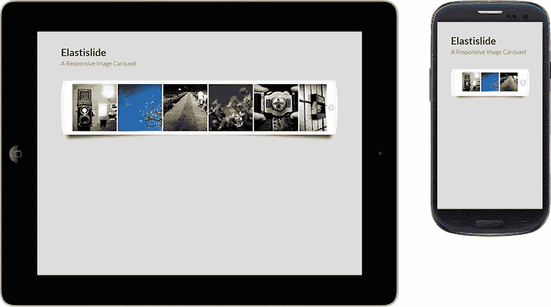

#### 示例 2 – 垂直方向，至少显示三张图片

有一个选项可以使轮播图以垂直方向呈现，只需更改一个参数。此外，我们可以加快滚动效果。请记得包含与示例 1 中使用的相同文件，并在 DOM 中插入以下代码：

```js
<script type="text/javascript">
$('#carousel').elastislide({
  orientation: 'vertical',
  speed: 250
});
</script>
```

默认情况下，至少显示三张图片。但是，这个最小值可以根据我们将在下一个示例中看到的情况进行修改：

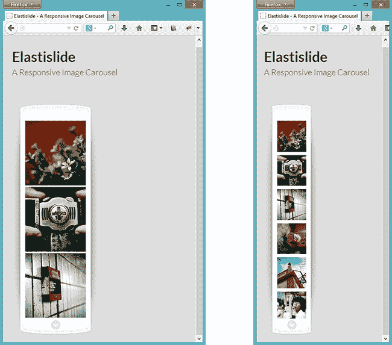

#### 示例 3 – 固定包装器，至少显示两张图片

在此示例中，我们将定义轮播图中可见项目的最小值，当在小屏幕上查看轮播图时，可以注意到差异，并且图片不会缩小太多。此外，我们还可以定义从第三张图片开始显示的图片。

请记得包含与示例 1 中使用的相同文件，并在包含 ElastiSlide 插件之后执行脚本，提供以下参数并将其定位：

```js
<script>
$('#carousel').elastislide({
  minItems: 2,
  start: 2
});
</script>
```

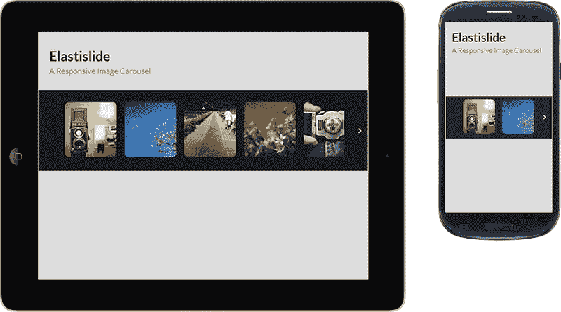

#### 示例 4 – 图片库中至少显示四张图片

在第四个示例中，我们可以看到许多 JavaScript 实现。然而，此示例的主要目标是展示此插件为我们提供的可能性。通过使用插件回调函数和私有函数，我们可以跟踪点击和当前图像，然后通过创建图像画廊按需处理此图像更改：

```js
<script>
var current = 0;
var $preview = $('#preview');
var $carouselEl = $('#carousel');
var $carouselItems = $carouselEl.children();
var carousel = $carouselEl.elastislide({
  current: current,
  minItems: 4,
  onClick: function(el, pos, evt){
    changeImage(el, pos);
    evt.preventDefault();
  },
  onReady: function(){
    changeImage($carouselItems.eq(current), current);
  }
});
function changeImage(el, pos) {
  $preview.attr('src', el.data('preview'));
  $carouselItems.removeClass('current-img');
  el.addClass('current-img');
  carousel.setCurrent(pos);
}
</script>
```

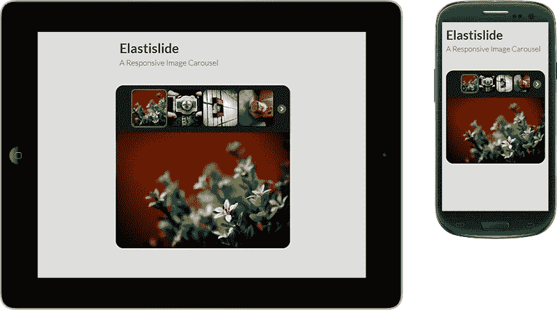

为此，与其他插件相比，ElastiSlide 可能没有太大优势，因为它依赖于我们的额外开发来完成这个画廊。因此，让我们看看下一个插件提供了什么来解决这个问题。

## FlexSlider2 – 完全响应式滑块

FlexSlider2 是一个轻量级的 jQuery 图像滑块插件，包括淡入淡出和滑动动画、移动设备的触摸手势以及一堆可定制的选项。

自从 2011 年发布以来，FlexSlider2 在开发者社区中一直展示着持续的信心，并且一些已知的**CMS**（**内容管理系统**），如 Drupal 和 WordPress，已经导入了此插件以在其系统中使用。

稳定的版本 2.0 也支持使用旧浏览器的用户，自 Safari 4、Chrome 4、Firefox 3.6、Opera 10 和 IE7 开始。同时也支持 Android 和 iOS 设备。

### 如何做

为了查看此插件提供的各种选项，我们将看到以下三个应用示例中最常用的插件选项。我们将从显示滑块的默认布局开始。然后，我们将看到一个使用导航来支持显示大量图像的情况的滑块，最后一个示例中我们将看到另一种配置 FlexSlider2 提供的图像轮播的方式。

您可以在 [`github.com/woothemes/FlexSlider`](https://github.com/woothemes/FlexSlider) 找到可下载的文件；对于附加的插件选项，我们建议您阅读插件官方网站上的完善文档 [`www.woothemes.com/flexslider/`](http://www.woothemes.com/flexslider/) 。

#### 示例 1 – 基本滑块（默认）

让我们从在`<head>`标签内包含 CSS 样式表开始：

```js
<link rel="stylesheet" href="css/flexslider.css" type="text/css">
```

在 DOM 底部（在`</body>`结束标记之前），我们需要包含两个文件：jQuery 库和 FlexSlider2 脚本。

```js
<script src="img/jquery-1.9.1.min.js"></script>
<script src="img/jquery.flexslider.js"></script>
```

到目前为止，第一个示例从这里开始，我们正在定义一个简单的无序列表来定义轮播结构。对此只有两个要求，即将`flexslider`类定义为包装 `<div>` 和将`slides`类定义为`<ul>`。

```js
<div class="flexslider">
  <ul class="slides">
    <li></li>
    <li></li>
    <li></li>
    <li></li>
  </ul>
</div>
```

在包含 FlexSlider2 库后，让我们添加以下代码来执行脚本。我们将只显示轮播中普通图像元素的默认外观和行为：

```js
$(document).ready(function() {
  $('.flexslider').flexslider({
    animation: "slide"
  });
});
```

此插件附带的样式在智能手机和桌面版本上看起来很漂亮：

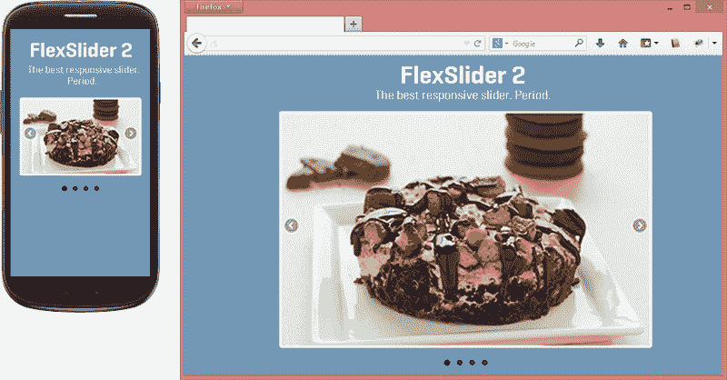

#### 示例 2 – 使用轮播滑块作为导航控制器

初始 HTML 结构几乎相同，但现在我们必须为轮播复制幻灯片结构。通过执行 JavaScript 函数，识别这两个元素之间的关系，并连接到期望的行为。

记得包含示例 1 中使用的相同文件，然后将以下代码插入 HTML 代码中。

```js
<div id="slider" class="flexslider">
  <ul class="slides">
    <li></li>
    <li></li>
    <li></li>
    <li></li>
  </ul>
</div>
<div id="carousel" class="flexslider">
  <ul class="slides">
    <li></li>
    <li></li>
    <li></li>
    <li></li>
  </ul>
</div>
```

要创建这个图片画廊，我们必须通过使用 ID 来识别插件将影响的元素，避免任何行为冲突。将此示例与示例 1 进行比较，在示例 1 中，FlexSlider2 只实例化了一次，我们对插件脚本进行了两次调用。

在以下代码的第一部分中，正在创建图片幻灯片，并补充一些插件提供的其他选项，比如`animation`、`itemWidth`、`itemMargin`和`asNavFor`。

在此代码的第二部分中，正在创建导航控制器：

```js
$(document).ready(function() {
  $('#carousel').flexslider({
    animation: 'slide',
    controlNav: false,
    animationLoop: false,
    slideshow: false,
    itemWidth: 210,
    itemMargin: 5,
    asNavFor: '#slider'
  });
  $('#slider').flexslider({
    animation: "slide",
    controlNav: false,
    animationLoop: false,
    slideshow: false,
    sync: "#carousel"
  });
});
```

### 提示

`asNavFor`选项将`#slider`转换为`#carousel`的缩略图导航。而`sync`选项则创建了一个镜像，将在`#slider`上执行的操作同步到`#carousel`上。例如，如果用户通过滑块导航，轮播项目将跟随操作，显示相同的活动滑块，反之亦然。

非常简单、专业、且实用！因此，让我们看看这个响应式滑块在小设备和桌面上的带导航控制的视觉效果：

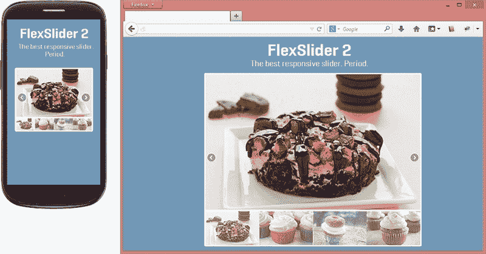

#### 示例 3 – 轮播设置最小和最大范围

记得包含示例 1 中使用的相同文件，然后将以下代码插入 HTML 代码中。请注意，它使用与第一个示例相同的 HTML 结构：

```js
<div id="slider" class="flexslider">
  <ul class="slides">
    <li></li>
    <li></li>
    <li></li>
    <li></li>
  </ul>
</div>
```

然而，为了构建它，我们需要更改 JavaScript 代码，在那里我们会通知不同的参数，如`itemWidth`、`itemMargin`、`minItems`和`maxItems`，如我们将在以下代码中看到的那样：

```js
$(document).ready(function() {
  $('.flexslider').flexslider({
    animation: "slide",
    animationLoop: false,
    itemWidth: 210,
    itemMargin: 5,
    minItems: 2,
    maxItems: 4
  });
});
```

### 注意

`itemWidth`和`itemMargin`选项应该用像素进行度量和定义，但不用担心，插件会处理这个固定单位得很好。

此外，`minItems`和`maxItems`被用来定义根据设备宽度在屏幕上显示的最小/最大元素数量值。在下一个屏幕截图中，我们将看到前面的代码在移动设备和桌面两个版本中的实际应用：

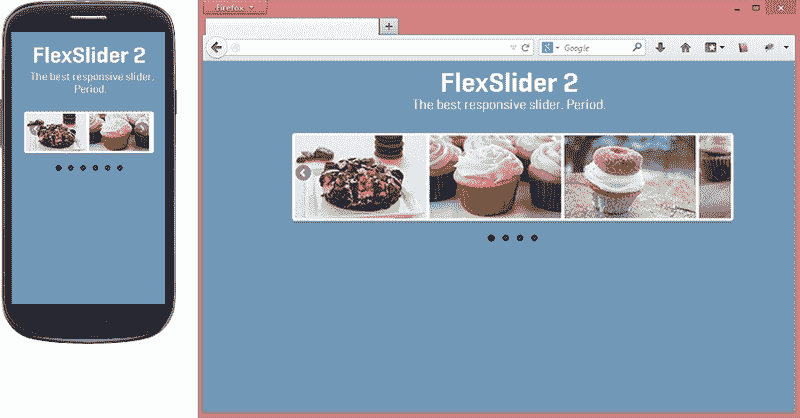

## ResponsiveSlides – 基本幻灯片中的最佳解决办法

ResponsiveSlides 是一个 jQuery 插件，是一个非常轻量级的解决方案，基本上处于两种不同的模式。它可以自动淡化图像，或者作为具有分页和/或导航以在幻灯片之间淡化的响应式图像容器。

ResponsiveSlides 可以在各种浏览器上执行，包括旧版 IE 和 Android 版本 2.3 及以上。它还为不本地支持的 IE6 和其他浏览器添加了 CSS `max-width`支持。这个属性有助于使其在小屏幕上响应。

这个插件有两个依赖项，分别是 jQuery 库和所有图片必须具有相同的尺寸。

您可以在[`github.com/viljamis/ResponsiveSlides.js`](https://github.com/viljamis/ResponsiveSlides.js)找到可下载的文件以及关于插件选项的更多详细信息。

### 如何做到这一点

在接下来的部分中，您将找到三个示例，其中我们可以看到这个插件提供的主要功能。在第一个示例中，我们将看到哪些文件是必要的，并且 ResponsiveSlides 的默认选项是什么。

在第二个示例中，我们将添加各种参数来检查这个插件如何可以定制化并满足我们项目的需求。

在第三个示例中，我们将通过图片实现额外的导航，方便用户访问并查看他们想要的特定幻灯片。

#### 示例 1

因此，我们将首先在`<head>`标签内包含 ResponsiveSlides 主题的 CSS 文件：

```js
<link rel="stylesheet" href="responsiveslides.css">
```

之后，插件支持使用简单的 HTML 无序列表来制作我们的幻灯片。但是，我们需要为这个`<ul>`定义一个类名，确保插件能够检测到哪个`<ul>`必须被转换：

```js
<ul class="rslides">
  <li></li>
  <li></li>
  <li></li>
  <li></li>
</ul>
```

然后，在 DOM 底部（在`</body>`结束标签之前），我们应该包含 jQuery 库和 ResponsiveSlides 脚本。

```js
<script src="img/jquery-1.9.1.min.js"></script>
<script src="img/responsiveslides.min.js"></script>
```

现在，我们只需在网站加载后为带有`rslides`类的`<ul>`执行 ResponsiveSlides 脚本。让我们在包含 ResponsiveSlides 的代码之后放置这段代码：

```js
<script>
$(function() {
  $(".rslides").responsiveSlides();
});
</script>
```

### 提示

在附带插件文件的`demo.css`文件中，有一堆 CSS 样式表，这些可能帮助我们自定义幻灯片。这个文件不是必需的，但对视觉有很大的区别，可能对进一步的参考有用。

这是插件的默认视觉效果：

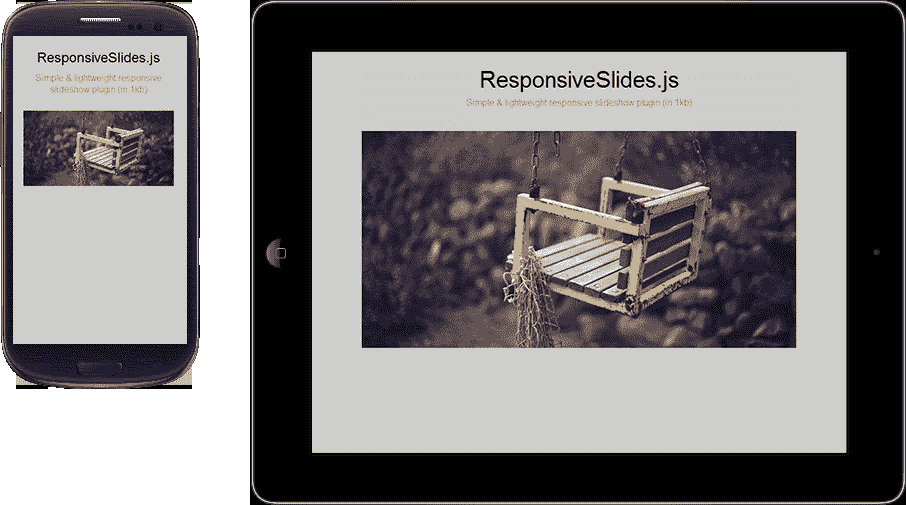

#### 示例 2

因此，我们将像之前的示例一样开始，先在`<head>`标签内包含 CSS 文件，然后在 DOM 代码底部（在`</body>`结束标签之前）包含 jQuery 库和 ResponsiveSlides 脚本。

对于这个示例，我们添加了一个包裹幻灯片`slider_container`的 div，帮助我们定位箭头和每个幻灯片的标题文本。如果某些项目需要这个标题文本来解释幻灯片，ResponsiveSlides 可以很好地处理这个特性。

所以，让我们在下一个幻灯片上测试一下：

```js
<div class="slider_container">
  <ul class="rslides" id="slider-example2">
    <li>
      <p class="caption">This is a caption</p>
    </li>
    <li>
      <p class="caption"><strong>Other</strong> caption here</p>
    </li>
    <li>
      <p class="caption">The <u>third</u> caption</p>
    </li>
    <li>
      <p class="caption">The fourth caption</p>
    </li>
  </ul>
</div>
```

然后，请记得在网站加载后为带有`slider-example2` ID 的`<div>`执行 ResponsiveSlides 脚本，将这段代码放在包含 ResponsiveSlides 的代码之后：

```js
<script>
  $(function() {
    $('#slider-example2').responsiveSlides({
        auto: false,
        pager: false,
        nav: true,
        maxwidth: 540,
        speed: 500,
        namespace: "callbacks",
        before: function () {
          /* before event fired */
        },
        after: function () {
          /* after event fired */
        }
    });
  });
</script>
```

### 提示

也可以通过将 `pager` 选项设置为 `false` 并将 `nav` 选项设置为 `true` 来通知插件仅呈现下一个/上一个箭头而无需分页导航。

在下面的屏幕截图中，我们将看到这个示例的标题和导航箭头样式，这些样式来自于与插件一起提供的 `demo.css`：

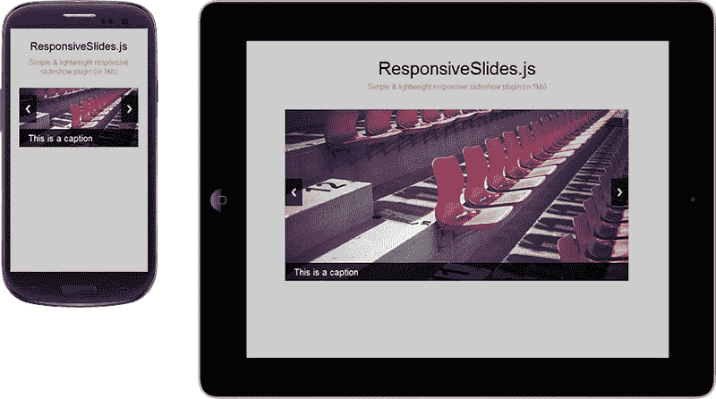

#### 示例 3

此示例侧重于创建一个基于缩略图图像和我们之前创建的图像的自定义导航，为用户提供另一种显示幻灯片库的方式。为了构建它，我们将插入其他简单的无序列表，显示缩略图图像并设置一个 ID，以后向插件提供信息：

```js
<ul class="rslides" id="slider-example3">
  <li></li>
  <li></li>
  <li></li>
  <li></li>
</ul>
<ul id="pager-example3">
  <li><a href="#"></a></li>
  <li><a href="#"></a></li>
  <li><a href="#"></a></li>
  <li><a href="#"></a></li>
</ul>
```

同样，我们必须确保 CSS 文件将被包含在 `<head>` 标签内，然后在 HTML 代码底部包含 jQuery 库和 ResponsiveSlides 脚本。当我们对 `#slider-example3` 执行 ResponsiveSlides 时，我们将设置 `manualControls` 选项，并指定我们自定义的缩略图图像结构的分页导航 ID，如下所示：

```js
<script>
$("#slider-example3").responsiveSlides({
  manualControls: '#pager-example3'
});
</script>
```

以下截图描述了实现此导航功能的视觉效果：

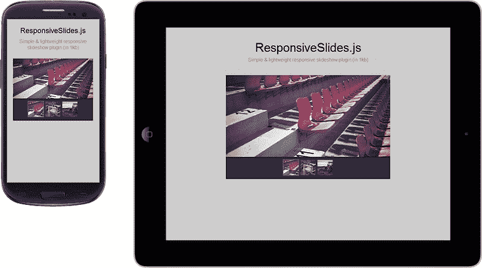

## Swiper – 高性能触摸图片滑块

Swiper 是一个轻量级的移动触摸滑块，具有硬件加速转换（在支持的情况下）和惊人的本机行为。它旨在用于移动网站，但在现代桌面浏览器上也非常出色。

这个插件成为我最喜欢的两个原因是：它的性能真的很好，特别是在智能手机上，而且它还可以让桌面用户几乎感受到在浏览器中导航时体验到的触摸手势。

您可以从 [`github.com/nolimits4web/Swiper/`](https://github.com/nolimits4web/Swiper/) 下载此解决方案。有关插件选项的更多信息，请访问 [`www.idangero.us/sliders/swiper/api.php`](http://www.idangero.us/sliders/swiper/api.php)。

### 如何实现

因此，我们将从在 `<head>` 标签中引入 JS 和 CSS 文件开始：

```js
<script src="img/jquery-1.9.1.min.js"></script>
<script src="img/idangerous.swiper-2.2.min.js"></script>
<link rel="stylesheet" href=" css/idangerous.swiper.css">
```

现在，我们将执行 Swiper 脚本，指定 `container` 和 `pagination` 类：

```js
<script>
$(function(){
  var mySwiper = $('.swiper-container').swiper({
    pagination: '.pager',
    paginationClickable: true
  });
});
</script>
```

注意，这个 CSS 文件只是定制了幻灯片动画。即便如此，我们需要添加以下代码来定制幻灯片结构，以满足我们的需求，补充来自 Swiper 的样式：

```js
<style>
.swiper-container {
  width: 70%;
  height: 300px;
}
.pager {
  position: absolute;
  z-index: 20;
  left: 10px;
  bottom: 10px;
}
.swiper-pagination-switch {
  display: inline-block;
  width: 1em;
  height: 1em;
  background: #222;
  margin-right: 5px;
}
</style>
```

然后，该插件支持使用简单的 HTML 无序列表来制作我们的幻灯片。此外，我们需要为该结构定义一些类名，以确保插件的正常运行：

```js
<div class="swiper-container">
  <div class="swiper-wrapper">
    <div class="swiper-slide slide-1">
      <p>Slide 1</p>
    </div>
    <div class="swiper-slide slide-2">
      <p>Slide 2</p>
    </div>
    <div class="swiper-slide slide-3">
      
    </div>
    <div class="swiper-slide slide-4">
      
    </div>
  </div>
  <div class="pager"></div>
</div>
```

所有滑块结构都由 `swiper-container` 和 `swiper-wrapper` 类包裹。此外，`swiper-slide` 类定义 div 作为幻灯片项，而 `pager` 类指定将显示幻灯片分页的 div。 

插件开发者提供的网站演示采用的视觉效果很漂亮；但是，这些样式不包括在`idangerous.swiper.css`中。它仍然依赖于我们对整个幻灯片的自定义，接下来我们将在以下截图中看到：

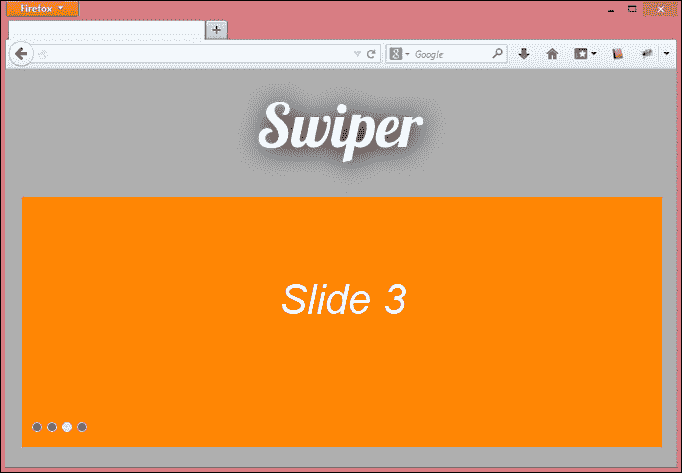

#### 特色选项

通过分析代码，该插件似乎非常聪明，并且可以快速地渲染到浏览器上。另一个重要的考虑是社区的不断更新，修复了主要和次要的错误。它与其他插件的当前差异是：

+   垂直/水平滑动

+   丰富的 API

+   灵活的配置

+   嵌套的 Swipers

+   3D 流

在插件版本 1.8.5 中，他们引入了 3D 流补充到 Swiper 中。它简单地提供了一个带动态阴影的惊人真实的 3D 画廊，相比其他幻灯片插件有很大的优势。让我们看看如何实现它。

### 在 Swiper 上使用 3D 流样式

由于它是 Swiper 的补充，我们需要包括与前面示例相同的文件，先从`<head>`中的 CSS 开始。然后，追加下面这些新的 JS 和 CSS 文件，用于引用 3D 流样式：

```js
<script src="img/idangerous.swiper.3dflow-2.0.js"></script>
<link rel="stylesheet" href="css/idangerous.swiper.3dflow.css">
```

现在，让我们改变我们之前用于执行 Swiper 的代码。以下代码具有许多参数，这些参数默认情况下附带它，并且它将执行我们的 3D 流脚本：

```js
<script>
$(function(){
  var mySwiper = $('.swiper-container').swiper({
    slidesPerView: 3,
    loop: true,
       tdFlow: {
      rotate: 10,
      stretch: -50,
      depth: 400,
      modifier: 1,
      shadows: true
    }
  });
});
</script>
```

好吧，看看这个补充可能带给幻灯片视觉上的巨大差异。仅仅通过使用 CSS3 Transform，Swiper 插件就可以为我们提供一种自动显示不同幻灯片效果的方式：

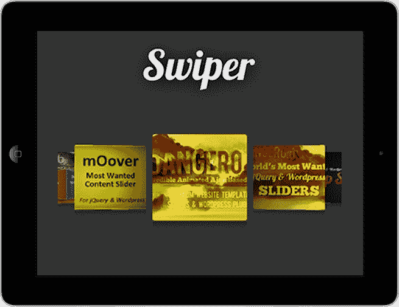

通过访问网站 [`www.idangero.us/sliders/swiper/plugins/3dflow.php`](http://www.idangero.us/sliders/swiper/plugins/3dflow.php)，我们将找到更多示例和其他 3D 流的用法选项。

## Slicebox - 当使用幻灯片图像时进行切片动画

Slicebox 是一个 jQuery 插件，用于具有优雅回退（用于不支持新 CSS 属性的旧浏览器）的响应式 3D 图像幻灯片。

该插件的视觉效果真的很酷。一旦幻灯片改变，图像就被切成三到五个部分，并且旋转，呈现出令人难以置信的效果。

### 如何做

因此，在从[`github.com/codrops/Slicebox`](https://github.com/codrops/Slicebox)下载插件后，我们将首先在`<head>`标签内包含 CSS 文件：

```js
<link rel="stylesheet" type="text/css" href="css/slicebox.css" />
<link rel="stylesheet" type="text/css" href="css/custom.css" />
```

然而，在插件中有一个缺少的 CSS 包装配置，这需要我们自己来完成：

```js
<style>
.wrapper {
  position: relative;
  max-width: 840px;
  width: 100%;
  padding: 0 50px;
  margin: 0 auto;
}
</style>
```

之后，我们将使用一个简单的 HTML 无序列表来制作我们的幻灯片，并为这个结构定义一些必需的 ID，比如`sb-slider`，`shadow`，`nav-arrows`和`nav-dots`，以及插件用于阅读的命名代码部分：

```js
<div class="wrapper">
  <ul id="sb-slider" class="sb-slider">
  <li>
    <a href="#"></a>
    <div class="sb-description"><h3>Creative Lifesaver</h3></div>
  </li>
  <li>
    <a href="#"></a>
    <div class="sb-description"><h3>Honest Entertainer</h3></div>
  </li>
  <li>
    <a href="#"></a>
    <div class="sb-description"><h3>Brave Astronaut</h3></div>
  </li>
  <li>
    <a href="#"></a>
    <div class="sb-description"><h3>Faithful Investor</h3></div>
  </li>
  </ul>
  <div id="shadow" class="shadow"></div>
  <div id="nav-arrows" class="nav-arrows">
    <a href="#">Next</a>
    <a href="#">Previous</a>
  </div>
  <div id="nav-dots" class="nav-dots">
    <span class="nav-dot-current"></span>
    <span></span>
    <span></span>
    <span></span>
  </div>
</div>
```

此外，还有一些辅助类来补充代码，比如`wrapper`（用于包装幻灯片）和`sb-description`（用于显示幻灯片描述）。

在 DOM 的底部（在`</body>`结束标签之前），包括 jQuery 和 Slicebox 库：

```js
<script src="img/jquery-1.9.1.min.js"></script>
<script src="img/jquery.slicebox.js"></script>
```

之后，我们将通过插入下一行代码来执行 Slicebox 脚本。

### 提示

然而，在我看来，这个插件的主要问题是有许多行的代码向我们暴露了。

下面的代码太庞大了，避免出现打字错误，你会发现可以从[`www.packtpub.com/support`](http://www.packtpub.com/support)下载该代码。

这是移动设备和桌面的效果截图：

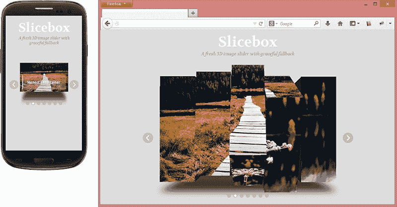

# 引入触摸手势到用户体验

触摸屏设备如今统治着移动平台。大多数智能手机和平板电脑都有许多使用触摸手势的元素，现在这也逐渐应用到我们的桌面开发中。在他的文章*跨设备优化触摸*中，*Luke Wroblewski*说：

> “那么，考虑到所有屏幕尺寸的触摸意味着什么？两个东西：触摸目标尺寸和控件的放置。”

*Luke Wroblewski*强调了响应式触摸设计中要考虑的两个最重要的要点：触摸目标尺寸和控件的放置：

+   **触摸目标尺寸**：它们相对容易实现，任何需要与触摸交互的导航系统都需要有菜单选项，可以被手指不精确的人舒适地使用，以防止意外触碰和错误。一些提到可触摸区域最小尺寸应为 44 像素的文章。

+   **控件的放置**：控件需要以与人们拿着和使用触摸设备的方式相一致的方式放置。智能手机屏幕的底部区域是我们想要放置应用程序的最常见和重要的交互的地方，以便它们可以快速轻松地到达，如下网站示例所示：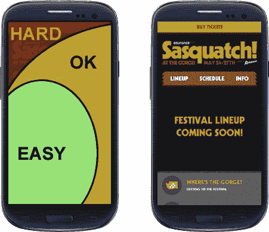

同样地，我们可以看一下平板电脑的姿势，或者人们通常是如何拿着平板电脑的。人们用两只手沿着两侧拿着它们，或者只是在大腿上敲击屏幕：

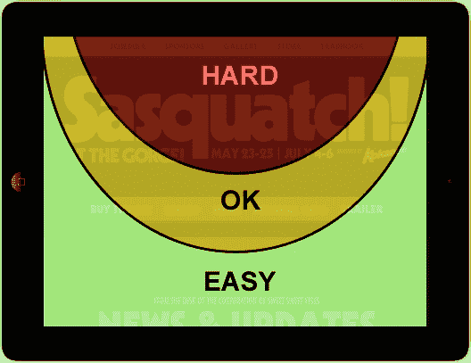

# 使用 JavaScript 插件实现触摸事件

有一些重要的 JavaScript 扩展和插件，允许我们将触摸手势集成到我们的响应式网站中，改善用户交互体验。一些例子包括 QuoJS 和 Hammer。

## QuoJS – 简单的触摸交互库

这是一个微型、模块化、面向对象和简洁的 JavaScript 库，简化了 HTML 文档的遍历、事件处理和 Ajax 交互，用于快速的移动 Web 开发。

请注意，QuoJS 不需要 jQuery 来工作；然而，它是一个简单而好的插件。

这个轻量级插件，在 gzip 压缩后仅有 5-6 KB，使我们能够拥有强大的写作、灵活性和适应性的代码。你可以在[`github.com/soyjavi/QuoJS`](https://github.com/soyjavi/QuoJS)找到可下载的文件，并在[`quojs.tapquo.com/`](http://quojs.tapquo.com/)找到有关一些额外选项的更多详细信息。

QuoJS 有这些手势来帮助我们：

+   单击

+   长按（650ms+）

+   双击

其代码包中还包括了不同类型的滑动、捏和旋转。

### 怎么做

在 DOM 底部（在 `</body>` 结束标签之前），包含 QuoJS 脚本；只有这样，我们才能通过创建事件监听器执行脚本。

在下面的例子中，如果用户将手指放在与工具箱 ID 相等的元素上，我们将实现一个动作。

```js
<script src="img/quo.js"></script>
<script src="img/jquery-1.9.1.min.js"></script>
<script>
$(document).ready(function() {
  $('#toolbox').hold(function() {
    $(this).toggleClass('open-box');
  });
});
</script>
```

QuoJS 在语法中使用`$$`符号，避免与我们可能在网站上使用的`$`jQuery 符号发生冲突。

## Hammer – 一个不错的多点触控库

Hammer 是一个 jQuery 轻量级的多点触控手势库，压缩后只有 3 KB。

Hammer 支持这些手势：

+   轻触

+   双击

+   滑动

+   拖拽

+   捏

+   旋转

每个手势触发有用的事件和插件提供的事件数据。

### 怎么做

首先，让我们从[`github.com/EightMedia/hammer.js`](https://github.com/EightMedia/hammer.js)下载库。在 DOM 底部（在 `</body>` 结束标签之前），包含 Hammer 脚本，然后我们将能够通过创建事件监听器执行脚本：

```js
<script src="img/jquery-1.9.1.min.js"></script>
<script src="img/jquery.hammer.min.js"></script>
```

### 提示

有时，不需要 jQuery 的版本似乎更快，但在所有浏览器中可能不起作用。要切换版本，只需用`hammer.min.js`替换`jquery.hammer.min.js`文件。

让我们看一个例子：

```js
<script>
$(document).ready(function() {
  var hammertime = $(".toucharea").hammer();   
  hammertime.on("touch", "#toolbox", function(ev) {
   $(this).toggleClass('open-box');
  });
});
  </script>
```

在这个例子中，它捕捉了触摸交互，并在对象上应用了`open-box`类。然而，还有许多其他的触摸事件需要处理，更多关于其用法的细节可以在[`github.com/EightMedia/hammer.js/wiki`](https://github.com/EightMedia/hammer.js/wiki)找到。

# 练习 6 – 使用 Swiper 插件创建一个图片幻灯片

只是为了提醒我们，这是我们最初设计的一个截图：

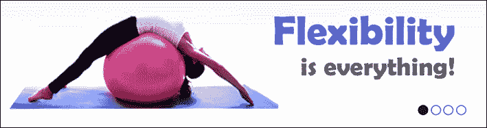

### 提示

这张图片只是一个建议。你可以找到任何图片来替换它。这里的重点是在一个响应式标签内创建一个响应式图片幻灯片。

现在，只需选择每个幻灯片一张图片，并使用 Swiper 解决方案，在每个幻灯片上插入一个标语：

+   灵活性就是一切

+   一些设计良好的动作

+   肌肉控制使身体均匀发展

+   身体健康是幸福的首要条件

正如我们在第四章中所看到的，*设计响应式文本*，高度建议在响应式网站中使用`@font-face`。因此，为了补充这个练习，使用 Google Fonts 提供的免费字体 Titan One 进行标语的自定义。

### 提示

记得在必要时使用 FontSquirrel 工具包。

# 摘要

在本章中，我们已经学习了为响应式网站准备的滑块插件，如 Elastislide、FlexSlider、ResponsiveSlides、Swiper 和 Slicebox。我们还学习了如何构建它们，它们的优点和效果特性。尽管许多这些滑块插件已经实现了手势触摸，正如我们在本章中所见，我们还向您展示了如何使用 QuoJS 和 Hammer 库来整合触摸功能。

在下一章中，我们将看到如何在小宽度设备上处理表格。我们将了解如何实现经常使用的每种技术，例如水平滚动、减少可见列和转换为堆叠表格。
