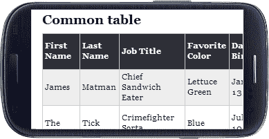
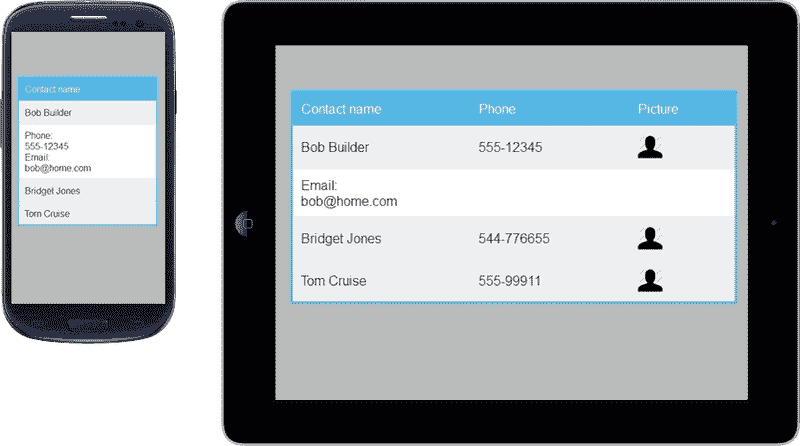
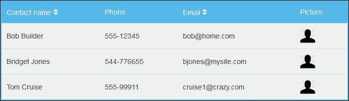
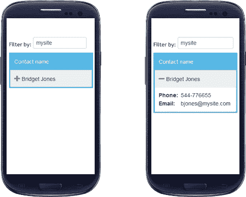
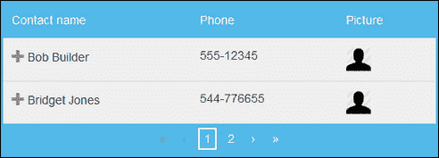
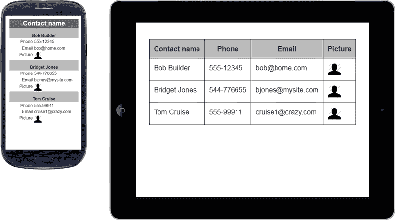
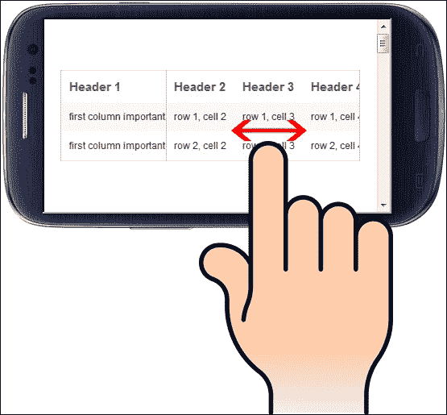
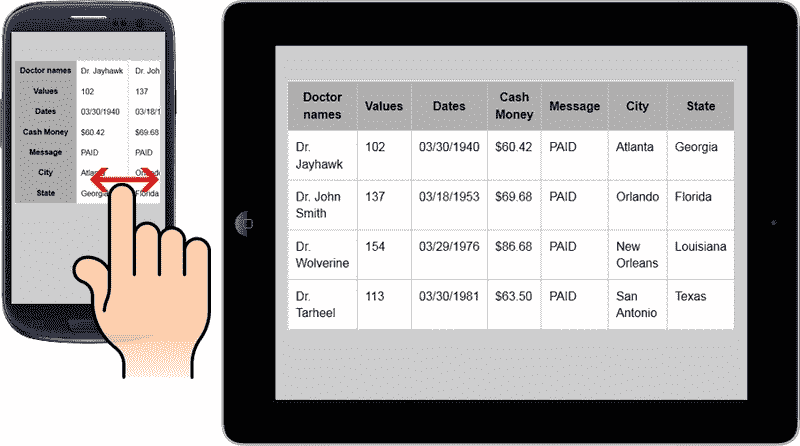
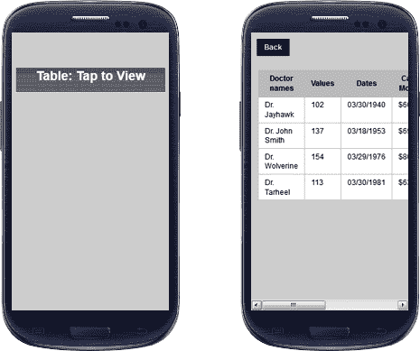
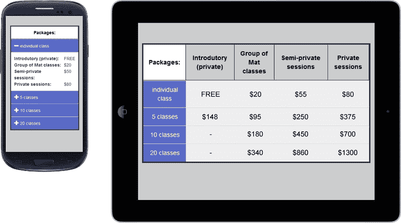

# 第七章：设计响应式表格

HTML 元素表格可能相当宽以显示结构化内容。有时需要将整行数据保留在一起才能使表格有意义。表格默认可以弹性伸缩，但如果它们变得太窄，单元格内容将开始换行；这通常不太干净！

*Garrett Dimon* 提到了一个有趣的话题，关于调整表格宽度以适应不同屏幕尺寸并确保表格内容的含义的难度：

> “数据表在响应式设计方面表现不佳。只是说说而已。”

在本章中，我们将学习创建响应式表格的四种不同方法：

+   可扩展的响应式表格

+   堆叠表格

+   水平溢出

+   完整表格链接

# 响应式表格

下图显示了关于响应式表格的最常见问题，包括：最小表格宽度超过屏幕尺寸和整个表格尺寸（包括文本大小）的减小：



然而，让我们看看解决这个响应式问题的不同方法。

# 可扩展的响应式表格

通过 FooTable，我们可以将 HTML 表格转换为可扩展的响应式表格，允许具有小屏幕尺寸的设备保持相同的内容，唯一的变化是您将不得不优先考虑将要显示的内容。其功能是根据断点隐藏您认为不太重要的列。因此，只有在单击/触摸行时才会显示隐藏的数据。

如果我们更深入地研究这个 jQuery 插件，我们将注意到两个重要特性为良好的代码和开发的便利做出了贡献：**即时定制**（通过来自 DOM 的数据属性）和 **断点设置**（可能与已在网站上使用的断点设置不同）。

接下来的示例中让我们看看如何在 DOM 中定义它。

## 如何做

从 [`github.com/bradvin/FooTable/`](https://github.com/bradvin/FooTable/) 下载插件后，我们将在 `<head>` 标签中包含 CSS 样式表：

```js
<link href="css/themes/footable.metro.css" rel="stylesheet" type="text/css" />
```

默认情况下，FooTable 仅使用两个断点：`phone` 设置为 `480` px，`tablet` 设置为 `1024` px。这些断点值不需要与您可能使用的值相同，因为它取决于表格需要多少空间。此外，如果必要，稍后我们将看到如何更改它。

让我们将以下代码作为示例插入到 HTML 代码中，以便练习插件资源：

```js
<table class="expandable-table">
  <thead>
    <tr>
      <th data-class="expand-icon">Contact name</th>
      <th data-hide="phone">Phone</th>
      <th data-hide="phone,tablet">Email</th>
      <th data-hide="phone" data-ignore="true">Picture</th>
    </tr>
  </thead>
  <tbody>
    <tr>
      <td>Bob Builder</td>
      <td>555-12345</td>
      <td>bob@home.com</td>
      <td></td>
    </tr>
    <tr>
      <td>Bridget Jones</td>
      <td>544-776655</td>
      <td>bjones@mysite.com</td>
      <td></td>
    </tr>
    <tr>
      <td>Tom Cruise</td>
      <td>555-99911</td>
      <td>cruise1@crazy.com</td>
      <td></td>
    </tr>
  </tbody>
</table>
```

数据属性有助于理解 FooTable 的功能，只需查看 DOM 就可以知道哪些列会在手机或平板电脑上隐藏。

以下是 FooTable 使用的基本数据属性及其功能：

+   `data-class`：这指定要应用于列中所有单元格的 CSS 类。

+   `data-hide`：定义将在列中隐藏哪些断点。可以通过逗号分隔指定多个断点。

+   `data-ignore`：仅在查看详细信息时隐藏内容。通常与`data-hide`类一起使用，此选项的可接受值可以是`true`或`false`。

有关所有数据属性列表的更多信息，您可以访问[`fooplugins.com/footable/demos/data-attributes.htm`](http://fooplugins.com/footable/demos/data-attributes.htm)。

### 提示

如果我们使用这些数据属性，应该将它们应用在`<th>`元素上，插件将在内部单元格中反映其更改。

在 DOM 的底部（在`</body>`结束标记之前），我们需要包含两个文件：jQuery 和 FooTable 库。之后，插入以下代码来执行脚本：

```js
<script src="img/jquery-1.9.1.min.js"></script>
<script src="img/footable.min.js"></script>
<script>
  $(function() {
    $(".expandable-table").footable();
  });
</script>
```

如果我们想要更改 FooTable 的断点，只需在执行前面的脚本时指定自己的值，如下面的代码所示：

```js
<script>
  $(function() {
    $(".expandable-table").footable({
 breakpoints: {
 tablet: 768,
 smartphone: 480,
 mini: 320
 }
    });
  });
</script>
```

在下面的屏幕截图中，我们将看到如果单击 Bob 的表行会发生什么。让我们比较一下我们在智能手机和平板电脑上的响应式表格：



在此示例中，每个设备上都有一些字段，只有在单击查看特定联系人的更多详细信息时才可见。虽然这种方法可以避免大量数据，但可能很难找到一个联系人，例如，通过电子邮件，因为这需要单击所有联系人才能显示信息。

有一些插件扩展可以解决这个问题。让我们来看看它们。

## 扩展插件

使用 FooTable 作为解决方案的另一个优点是其可扩展性。该插件是模块化的，允许您通过使用插件增加功能，例如排序、过滤和分页。

排序插件提供对表格列中包含的数据进行排序的功能。为此，我们将包含以下脚本文件：

```js
<script src="img/footable.sort.js"></script>
```

然后，我们将为想要启用排序的项目设置`data-sort-initial="true"`，并为不适合排序的项目设置`data-sort-ignore="true"`，例如图像和电话：

```js
<th data-sort-initial="true">Contact name</th>
<th data-sort-ignore="true">Phone</th>
```

在下面的屏幕截图中，我们可以看到箭头图标的插入，这是插件用来对特定表头进行排序的：



过滤插件添加了一个搜索字段，允许用户查找他们正在寻找的数据。搜索结果为我们带来了正确的数据，即使它们对观众是隐藏的。为此，让我们在脚本文件中包含以下内容：

```js
<script src="img/footable.filter.js"></script>
```

在页面上添加一个文本输入框（在表格之前或之后），其 ID 为`#filter`，然后在表格元素的`data-filter=#filter`数据属性上指定它。以下是此筛选器的代码：

```js
Filter by: <input id="filter" type="text">
```

在下面的屏幕截图中，筛选内容，仅显示一个项目，即使找到的值被隐藏：



此外，分页附加组件可以帮助显示总内容的一部分，默认创建含有 10 个项目的分页。为此，我们需要在脚本文件中包含以下代码：

```js
<script src="img/footable.paginate.js"></script>
```

因此，在上一个表格示例中，在`</tbody>`之后，我们将添加以下代码，用于接收分页。以下 div 中的`pagination`类是必需的，其他类如`pagination-centered`和`hide-if-no-paging`仅为补充：

```js
<tfoot>
<tr>
  <td colspan="4">
    <div class="pagination-centered hide-if-no-paging pagination"></div>
  </td>
</tr>
</tfoot>
```

此外，对于此示例，让我们限制每页两个项目，以查看分页的使用，只需在`table`元素上添加`data-page-size="2"`。效果如下：



有关这些附加组件和更多插件选项的详细信息，请参阅[`fooplugins.com/footable-demos/`](http://fooplugins.com/footable-demos/)的完整文档。

尽管此插件看起来非常完善，但在某些情况下，内容需要其他界面。让我们看看堆叠表解决方案。

# 堆叠表

Stackedtable 是一个 jQuery 插件，为我们的响应式表格提供了另一种选项，可从[`johnpolacek.github.io/stacktable.js/`](http:// http://johnpolacek.github.io/stacktable.js/)下载。

此解决方案将创建表格的副本，并将宽表格转换为在小屏幕上效果更好的两列键/值格式。

### Tip

建议仅用于少量行的表格，因为它会大大增加垂直内容。

通过使用简单的媒体查询，我们可以隐藏原始表格并显示堆叠表。让我们看看如何将其付诸实践。

## 如何使用上一个示例中的表格

我们将首先在`<head>`标签内包含 CSS 样式表：

```js
<link href="stacktable.css" rel="stylesheet" />
```

如果我们想要更改断点，目的是将此解决方案用于智能手机，只需进入`stacktable.css`文件并更改`max-width`属性：

```js
@media (max-width: 480px) {
  .large-only { display: none; }
  .stacktable.small-only { display: table; }
}
```

之后，我们将添加上一个解决方案中看到的表格的基础，只需添加一个 ID 和类：

```js
<table id="stack-table" class="large-only">
  <thead>
    <tr>
      <th>Contact name</th>
      <th>Phone</th>
      <th>Email</th>
      <th>Picture</th>
    </tr>
  </thead>
  <tbody>
    <tr>
      <td>Bob Builder</td>
      <td>555-12345</td>
      <td>bob@home.com</td>
      <td></td>
    </tr>
    <tr>
      <td>Bridget Jones</td>
      <td>544-776655</td>
      <td>bjones@mysite.com</td>
      <td></td>
    </tr>
    <tr>
      <td>Tom Cruise</td>
      <td>555-99911</td>
      <td>cruise1@crazy.com</td>
      <td></td>
    </tr>
  </tbody>
</table>
```

在 DOM 的底部（在`</body>`闭合标签之前），我们需要包含两个文件：`jquery`和`stacktable`库。然后，插入以下代码执行脚本，并指定表格 ID 和一个类来限制堆叠表仅适用于智能手机，如下所需：

```js
<script src="img/jquery-1.9.1.min.js"></script>
<script src="img/stacktable.js"></script>
<script>
$('#stack-table').stacktable({myClass:'stacktable small-only'});
</script> 
```

以下是两个视图的屏幕截图—用于小设备和桌面：



# 水平溢出

此技术通过冻结第一列来实现，使您可以在其下滚动其他列。这样我们保持每行看到第一列的内容，从而允许左滚动，以查看其余内容，以便更容易进行数据比较。

推荐这种表格用于有更多列的表格，并且第一列的内容比其他列更重要。让我们通过在下一个示例中练习来澄清它将是什么样子。

## 如何做

我们将从[`zurb.com/playground/responsive-tables`](http://zurb.com/playground/responsive-tables)下载解决方案。然后创建一个新的 HTML 文件，并在`<head>`标签内包含 CSS 样式表：

```js
<link rel="stylesheet" href="css/responsive-tables.css">
```

现在插入以下 HTML 表格代码，使用比之前更多的列，并添加一个名为`responsive`的类：

```js
<table class="responsive">
<tr>
  <th>Header 1</th>
  <th>Header 2</th>
  <th>Header 3</th>
  <th>Header 4</th>
  <th>Header 5</th>
  <th>Header 6</th>
</tr>
<tr>
  <td>first column important data</td>
  <td>row 1, cell 2</td>
  <td>row 1, cell 3</td>
  <td>row 1, cell 4</td>
  <td>row 1, cell 5</td>
  <td>row 1, cell 6</td>
</tr>
<tr>
  <td>first column important data</td>
  <td>row 2, cell 2</td>
  <td>row 2, cell 3</td>
  <td>row 2, cell 4</td>
  <td>row 2, cell 5</td>
  <td>row 2, cell 6</td>
</tr>
</table>
```

在 DOM 的底部（在`</body>`结束标签之前），我们只需要包含 jQuery 和响应式表格库：

```js
<script src="img/jquery-1.9.1.min.js"></script>
<script src="img/responsive-tables.js"></script>
```

让我们看一下下面的屏幕截图，显示了这张表格在智能手机和平板电脑上的情况：



### 小贴士

当可用屏幕宽度超过 767 像素时，我们的表格开始发生变化。如果我们想修改这个默认值，需要打开`responsive-tables.js`文件，查找数值 767，并进行更改。

从技术上讲，这很容易做到。然而，我们不能低估它在响应式网站上的效率，因为它有助于在小设备上更好地理解表格信息。

## 表头方向翻转

如果您发现我们表格的标题行比第一列更重要，并且在使用小设备时需要保持显示标题行，*David Bushell*通过仅使用 CSS 代码创建了一个有趣的解决方案。

这个 CSS 解决方案将第一列移到另一个地方，不需要任何 JavaScript 库，只需要 CSS3。

让我们从在`<head>`标签内包含 CSS 样式表开始：

```js
<style>
@media only screen and (max-width: 767px) {

.responsive {
  display: block; position: relative; 
}
.responsive thead {
  display: block; float: left;
}
.responsive tbody { 
  display: block; width: auto; position: relative;
  overflow-x: auto; white-space: nowrap;
}
.responsive thead tr {
  display: block;
}
.responsive th {
  display: block; border: 0; border-top: 1px solid #AAA;   
  background: #CCC; border-right: 1px solid #ccc;
  padding: 8px 10px !important;
}
.responsive tbody tr {
  display: inline-block; vertical-align: top;
  border-right: 1px solid #ccc;
}
.responsive td {
  display: block; min-height: 1.25em; border: 0;
}
table.responsive th:first-child, table.responsive td:first-child,
table.responsive td:first-child, table.responsive.pinned td {  
  display: block;
}

}
</style>
```

使用更真实的内容，让我们在 HTML 代码中创建这个表格：

```js
<table class="responsive" cellspacing="0" border="1">
  <thead>
    <tr>
      <th>Doctor names</th>
      <th>Values</th>
      <th>Dates</th>
      <th>Cash Money</th>
      <th>Message</th>
      <th>City</th>
      <th>State</th>
    </tr>
  </thead>
  <tbody>
    <tr>
      <td>Dr. Jayhawk</td>
      <td>102</td>
      <td>03/30/1940</td>
      <td>$60.42</td>
      <td>PAID</td>
      <td>Atlanta</td>
      <td>Georgia</td>
    </tr>
    <tr>
      <td>Dr. John Smith</td>
      <td>137</td>
      <td>03/18/1953</td>
      <td>$69.68</td>
      <td>PAID</td>
      <td>Orlando</td>
      <td>Florida</td>
    </tr>
    <tr>
      <td>Dr. Wolverine</td>
      <td>154</td>
      <td>03/29/1976</td>
      <td>$86.68</td>
      <td>PAID</td>
      <td>New Orleans</td>
      <td>Louisiana</td>
    </tr>
    <tr>
      <td>Dr. Tarheel</td>
      <td>113</td>
      <td>03/30/1981</td>
      <td>$63.50</td>
      <td>PAID</td>
      <td>San Antonio</td>
      <td>Texas</td>
    </tr>
  </tbody>
</table>
```

让我们看一下智能手机和平板电脑上的结果：



# 链接到全表

链接到全表是一种不太常用的技术，因为它并不能完全解决情况。它的工作原理是用一个小模拟表来替换原表，然后只创建一个链接以查看完整的表格。

问题仍然存在，但这次用户可以在屏幕上向左/向右滑动以查看所有内容。有一个媒体查询来处理这种机制，只在小屏幕上显示它。

## 如何做

首先，让我们从可下载的代码文件中下载`full-table.css`文件。然后将其插入到 HTML 代码的`<head>`标签内。尽管这是一个 CSS 解决方案，但这段代码太长了，增加了打错字的机会。

让我们重复使用从上一个示例中复制的表格代码，但对表格元素进行修改，如下所示：

```js
<table id="responsive" class="full-table">
```

在 DOM 的底部（在`</body>`结束标签之前），我们需要包含`jquery`库并插入以下代码，根据一个类名来显示/隐藏解决方案：

```js
<script src="img/jquery-1.9.1.min.js"></script>
<script>
$(function(){
  $("#responsive").click(function(){
    $("html").toggleClass($(this).attr("class"));
  });
});
</script>
```

在下面的屏幕截图中，我们将看到针对小屏幕的被压缩表格，在点击后将用户引导至完整表格可视化。当屏幕尺寸小于或等于 520 像素时，会出现此效果（如果需要使用 CSS 文件，可以修改此值）。



### 注意

插件在点击后生成水平滚动条，以查看完整宽度的表格。

# 练习 6 – 使用 FooTable jQuery 插件创建响应式价格表格

让我们使用 FooTable jQuery 插件和下面屏幕截图中表格的内容创建一个响应式表格。

### 注意

这个表格的内容并非真实，我们只是用它来练习。

在下面的屏幕截图中，我们可以看到该表格在智能手机和平板电脑上的显示，每个设备使用不同的设计：



您可以首先基于平板电脑的设计创建表格结构，然后使用 FooTable 插件自动化为智能手机实现紧凑的可视化效果。

# 总结

在本章中，我们学习了处理小设备宽度下宽表的四种不同方式。我们重点关注如何实现每种技术，因为它们的使用取决于表格内容的类型。我们刚刚看到的技术有：可扩展响应式表格（FooTable）、堆叠表格、水平溢出和链接到完整表格。

在下一章中，我们将学习如何使用表单，并学习如何实现自动完成、日期选择器和工具提示等功能。
