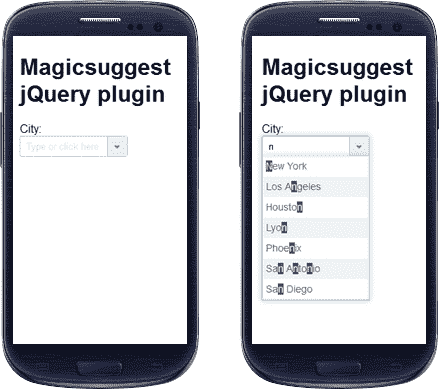
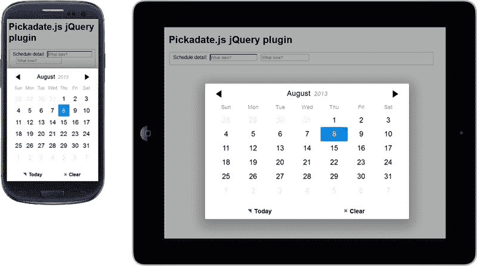
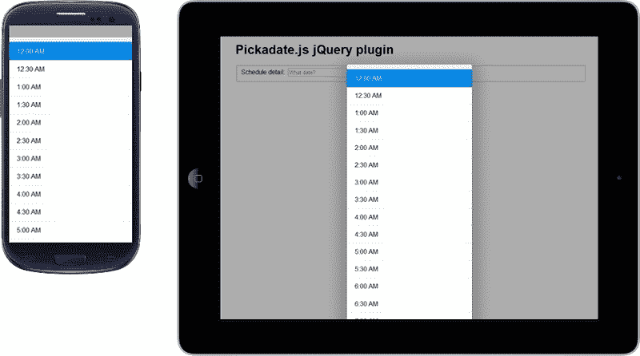
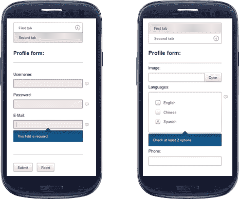
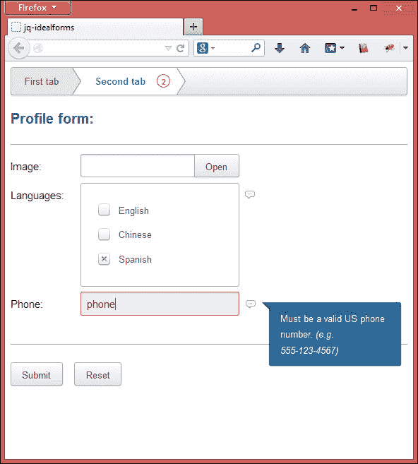
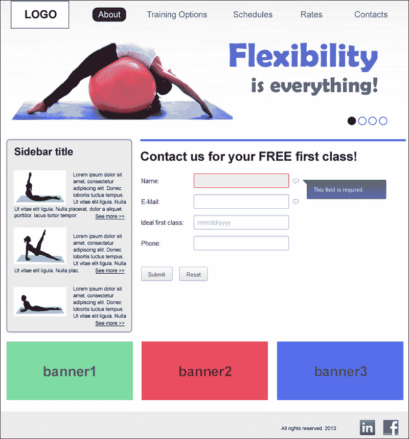

# 第八章：实现响应式表单

使用 HTML5 编码在前端网页开发中的景观发生了巨大变化。通过使用适当的字段类型和本地验证，构建更好的表单的机会更多了，这是 SEO 的最佳情况。所有这些功能正在逐步被所有现代网络浏览器采用。

通过使用 jQuery，我们可以增强页面上的 HTML5 体验，增加补充功能以改善用户体验。

在本章中，我们将学习以下内容：

+   表单输入的类型和属性

+   `autocomplete` 特性

+   `datepicker` 特性

+   `tooltips` 特性

+   使用 IdealForms 的响应式框架

# 表单输入的类型和属性

使用 HTML5 输入类型带来了开发的两个主要优势：减少开发时间和改善用户体验。许多现代浏览器已经采用了这些新的输入类型和属性，整个网络社区都受益于此，促进了其使用的传播。

最常用的 HTML5 输入类型包括`email`、`date`、`tel`、`number`和`time`。此外，HTML5 自带的最常见属性包括`placeholder`、`required`、`autocomplete`和`multiple`。我们将在第十章中看到，*确保浏览器支持*，并不是所有的网络浏览器都以相同的方式支持 HTML5 特性，并且需要 jQuery 的干预来提供适当的支持。

但是，它仍然依赖于 jQuery 技术来显示诸如`autocomplete`等更复杂的验证。通常情况下，jQuery 插件与新的 HTML5 输入类型非常配合，几乎对响应式网站来说是必不可少的。在开始实现功能之前，让我们创建一个基本的表单；这是第一步，将在后续示例中使用。创建一个带有基本标签的空 HTML 站点结构，然后保留 jQuery 包含，很快就会用到它：

```js
<!DOCTYPE html>
<html lang="en">
<head>
<meta name="viewport" content="width=device-width, initial-scale=1" />
<title>Responsive form</title>
</head>
<body>
<script src="img/jquery-1.9.1.min.js"></script>
</body>
</html>
```

为了逐步学习，每个特性都将独立呈现；只有之前的基本代码将被重复使用。

我们将看到的这些插件并不是服务器端验证的替代品；它们只会让用户体验更好，减少服务器请求，并提供更好的交互界面。

# 带有 Magicsuggest 的自动完成特性

Magicsuggest 是一个灵活的自动建议下拉框，在用户开始在字段中输入时提供建议。使用这个特性将减少打字的必要性，特别是在移动设备上，每输入一个字母都很麻烦。

默认情况下，Magicsuggest 具有一些很好的功能，例如按住 *Ctrl* 键选择多个项目，并在输入文本后使用 *Enter* 键添加新输入。

JSON 数据源用于填充下拉框。这里有一些可用的选项：

+   **没有数据源**：当设置为`null`时，下拉框将不会提供任何建议。如果允许`FreeEntries`设置为`true`（默认值），它仍然可以使用户输入多个条目。

+   **静态源**：它使用 JSON 对象数组、字符串数组甚至单个 CSV 字符串作为数据源。

+   **URL**：我们可以传递组件将获取其 JSON 数据的 URL。数据将使用`POST` AJAX 请求获取，该请求将输入的文本作为查询参数。

+   **函数**：我们可以设置一个返回 JSON 对象数组的函数。函数只需要一个回调函数或返回值就可以成功。

## 如何实现它

让我们从[`nicolasbize.github.io/magicsuggest/`](http://nicolasbize.github.io/magicsuggest/)下载文件。下载后，我们将在已创建的基本代码内的`<head>`标签中包含 JavaScript 和 CSS 文件：

```js
<script src="img/magicsuggest-1.3.1.js"></script>
<link rel="stylesheet" href="css/magicsuggest-1.3.1.css">
```

然后，插入以下代码片段来创建具有这些城市的 JSON 数据，然后执行 Magicsuggest 脚本，如果必要的话，同时给予一些选项：

```js
<script type="text/javascript">
$(document).ready(function() {
  var jsonData = [];
  var cities = 'New York,Los Angeles,Chicago,Houston,Paris,
Marseille,Toulouse,Lyon,Bordeaux, Philadelphia,Phoenix,
San Antonio,San Diego,Dallas'.split(',');
  for(var i=0;i<cities.length;i++) jsonData.push({id:i,name:cities[i]});
  var city = $('#field-city').magicSuggest({
    data: jsonData,
    resultAsString: true,
    maxSelection: 1,
    maxSelectionRenderer: function(){}
  })
});
</script>
```

下一步是在`<body>`标签内添加`city`字段。

```js
<label for="field-city">City: </label>
<input id="field-city" type="text"/>
```

如下截图所示，当点击选择字段时，我们将立即看到建议功能的出现：



在前面的例子中，我们只实现了基本用法。然而，此插件还有其他有趣的实现方式，可能会在未来符合您的需求，例如：

+   右侧标签选择

+   Gmail 风格组合

+   列过滤器组合

+   使用图像的自定义模板下拉框

# 日期和时间选择器功能

移动用户已经有一个非常熟悉的日期和时间输入界面。然而，我们将学习一个 jQuery 插件，它可能有助于通过在所有设备上显示相同的功能来保持网站的身份。

## Pickadate – 响应式日期/时间选择器

Pickadate 是一个响应式的 jQuery 插件，非常有趣，同时也适用于移动设备，并且轻量级。无论是什么浏览器或设备，都可以提供自定义界面。

这是一种在填写表单时方便插入正确日期的好方法，因为它可以避免打字错误，并向用户提供更好的指导，显示月份的完整日历。

### 怎么做

从[`amsul.ca/pickadate.js/`](http://amsul.ca/pickadate.js/)下载文件后，我们将从已创建的基本代码内的`<head>`标签中开始包含 JavaScript 和 CSS 文件：

```js
<script src="img/picker.js"></script>
<script src="img/picker.date.js"></script>
<script src="img/picker.time.js"></script>
<link rel="stylesheet" href="lib/themes/default.css" id="theme_base">
<link rel="stylesheet" href="lib/themes/default.date.css" id="theme_date">
<link rel="stylesheet" href="lib/themes/default.time.css" id="theme_time">
```

### 提示

如果需要支持旧浏览器，建议包含`legacy.js`文件。

之后，我们需要执行`datepicker`和`timepicker`的脚本。

```js
<script>
$('.js__datepicker').pickadate();
$('.js__timepicker').pickatime();
</script>  
```

下一步是在`<body>`标签内插入一个日期字段和另一个时间字段。插件要求类名需要被突出显示。

```js
<fieldset class="fieldset js__fieldset">
  <div class="fieldset__wrapper">
    <label>Schedule detail:</label>&nbsp;
    <input class="fieldset__input js__datepicker" type="text" placeholder="What date?">&nbsp;&nbsp;
    <input class="fieldset__input js__timepicker" type="text" placeholder="What time?">
  </div>
</fieldset>
```

以下是在智能手机和平板电脑上激活`datepicker`插件的屏幕截图：



以下是用户点击`时间`字段时的屏幕截图：



`pickadate`插件非常完善，提供了其扩展以添加对以下支持：

+   翻译（包括从右到左的语言）

+   不同的格式

+   日期/时间限制

您可以在[`amsul.ca/pickadate.js/date.htm#options`](http://amsul.ca/pickadate.js/date.htm#options)找到关于这些扩展的更多信息。

# 工具提示功能

`tooltip`是在网页上元素的标签和输入字段之间常见的一种方式，用于呈现有关元素的附加上下文信息。其作用是提供有关特定字段的更多信息。

随着工具提示作为用户与网页元素交互的一种常见方式，设计和交互良好的工具提示变得更加重要。

通常，将鼠标指针放在元素上即可显示工具提示，并显示消息。由于大多数移动设备没有指针，因此必须通过显示触摸时的工具提示的插件来处理此问题。

## Tooltipster - 现代工具提示功能

Tooltipster 是一个强大而灵活的 jQuery 插件，可让您轻松创建语义化和现代化的工具提示。

### 如何操作

我们将从[`calebjacob.com/tooltipster/`](http://calebjacob.com/tooltipster/)下载 tooltipster 文件，并将 JavaScript 和 CSS 文件包含在已创建的基本代码的`<head>`标签中：

```js
<script src="img/jquery.tooltipster.min.js"></script>
<link rel="stylesheet" href="css/tooltipster.css" />
```

要激活插件，我们将添加`tooltipster`库并将其配置为对具有`.tooltip`类的所有元素执行（在本例中，只有一个实例，但您可以在页面中使用多个）：

```js
<script>
$(function() {
  $('.tooltip').tooltipster();
});
</script>
```

之后，我们将添加一个问号图像，并在我们想要在其上显示工具提示的每个元素上定义`tooltip`类：

```js

```

以下是点击/触摸元素后插件的屏幕截图：


我们还可以通过编辑`tooltipster.css`文件来修改默认插件主题，或者通过在`script`调用中指定类来覆盖现有主题。

```js
<script>
$(function() {
  $('.tooltip').tooltipster({
    theme: '.my-custom-theme'
  });
});
</script>
```

# 使用 IdealForms 创建响应式表单

IdealForms，位于[`github.com/elclanrs/jq-idealforms`](https://github.com/elclanrs/jq-idealforms)，是一个用于构建和验证响应式 HTML5 表单的框架。此外，它具有键盘支持，在用户转到下一个字段时快速验证，并为大多数浏览器提供占位符支持。

IdealForms 框架还具有分页选项，可在填写大型表单时大大改善用户体验。让我们逐步练习以了解其用法。

## 如何实现它

创建一个新的 HTML 文件，并复制我们在本章开头已经编写的基本代码。然后，我们将在 `<head>` 标签中包含 CSS 样式表。

```js
<link rel="stylesheet" href="css/jquery.idealforms.min.css"/>
```

让我们将以下示例代码插入 HTML 结构中，其界面使用 `<section>` 标签分为两个标签页：

```js
<form id="form">
  <div><h2>Profile form:</h2></div>
```

在第一个标签页中，我们将添加`用户名`、`密码`和`电子邮件`字段：

```js
<section name="First tab">
  <div><label>Username:</label>
  <input id="username" name="username" type="text" /></div>
  <div><label>Password:</label>
  <input id="pass" name="password" type="password" /></div>
  <div><label>E-Mail:</label>
  <input id="email" name="email" data-ideal="required email" type="email" /></div>
</section>
```

在第二个标签页中，我们将添加`文件`、`语言`和`电话`字段。

```js
<section name="Second tab">

  <div><label>Image:</label>
  <input id="file" name="file" multiple type="file" /></div>
  <div id="languages">
  <label>Languages:</label>
  <label><input type="checkbox" name="langs[]" value="English"/>English</label>
  <label><input type="checkbox" name="langs[]" value="Chinese"/>Chinese</label>
  <label><input type="checkbox" name="langs[]" value="Spanish"/>Spanish</label>
  </div>
  <div><label>Phone:</label>
  <input type="tel" name="phone" data-ideal="phone" /></div>
</section>
```

最后，我们将添加一个`提交`按钮。

```js
  <div><hr/></div>
  <div><button type="submit">Submit</button>
</form>
```

在 DOM 底部（在 `</body>` 结束标记之前），我们需要包含 `jquery` 和 `idealforms` 库。

```js
<script src="img/jquery.idealforms.js"></script>
```

然后，插入以下代码，这将执行开始创建一个函数的脚本，该函数在用户填写不正确值时会弹出警告。

```js
<script>
  var options = {
    onFail: function() {
      alert( $myform.getInvalid().length +' invalid fields.' )
    },
```

在这里，我们将设置哪个表单元素将被验证。

```js
    inputs: {
      'password': {
        filters: 'required pass',
      },
      'username': {
        filters: 'required username',
        data: { //ajax: { url:'validate.php' } }
      },
      'file': {
        filters: 'extension',
        data: { extension: ['jpg'] }
      },      'langs[]': {
        filters: 'min max',
        data: { min: 2, max: 3 },
        errors: {
          min: 'Check at least <strong>2</strong> options.',
          max: 'No more than <strong>3</strong> options allowed.'
        }
      }
    }
  };
```

完成验证后，我们将执行`idealforms` JavaScript，加载之前设置的所有验证。

```js
  var $myform = $('#form').idealforms(options).data('idealforms');
</script>
```

就这样！客户端验证已经实现。

以下是在智能手机设备上查看时该框架运行情况的截图：



同一页面可能在桌面上查看，并且默认布局非常适配。



# 练习 8 – 使用 IdealForms 框架创建联系表单

让我们基于先前完整的逐步示例并使用 IdealForms 框架作为此表单基础来创建一个响应式联系表单项目。

所以，和以往一样，让我们开始包括 CSS 文件和以下字段：**姓名**、**电子邮件**、**理想的第一课**（日期），以及如下截图所示的**电话**：



日期字段未在 IdealForms 中提及，因为默认情况下，它使用 jQueryUI 解决方案。然而，我建议使用 Pickadate 插件，因为与 jQueryUI 相比，它更轻量级，并且还有助于强化我们之前学到的示例。

# 摘要

在本章中，我们学习了如何通过使用一些 jQuery 插件来完善代码与 HTML5 表单元素很好地配合，例如`autocomplete`的 Magicsuggest，`datepicker`的 Pickadate，以及在必要时的`tooltips`的 Tooltipster。此外，我们还体验了如何使用 IdealForms，一个响应式表单框架，来构建联系表单界面。

在下一章中，我们将使用工具和脚本来测试网站，以确保其在所有设备上的响应性。彻底理解下一章对于检查我们在旧浏览器或移动设备上实现可能出现的错误并进一步修复它们至关重要。此外，测试阶段对于避免客户报告的未来意外非常重要。
