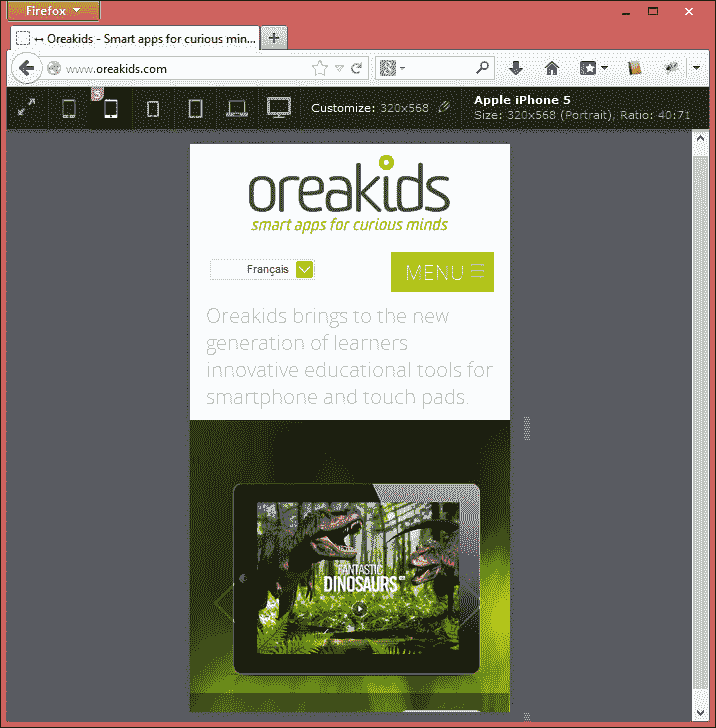
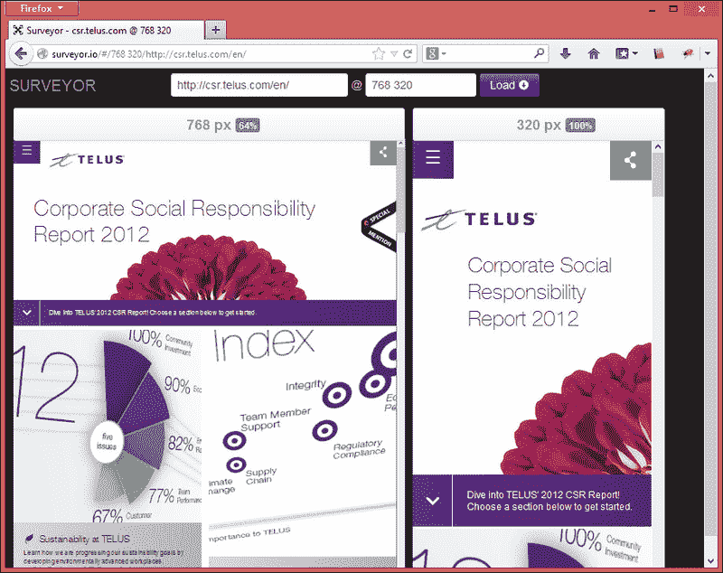
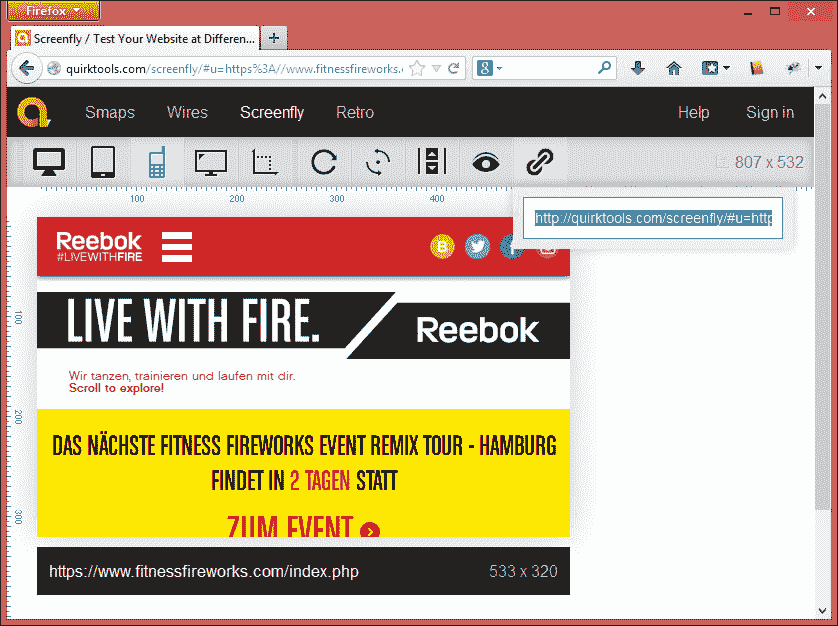
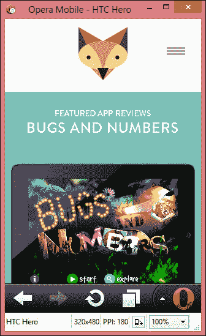
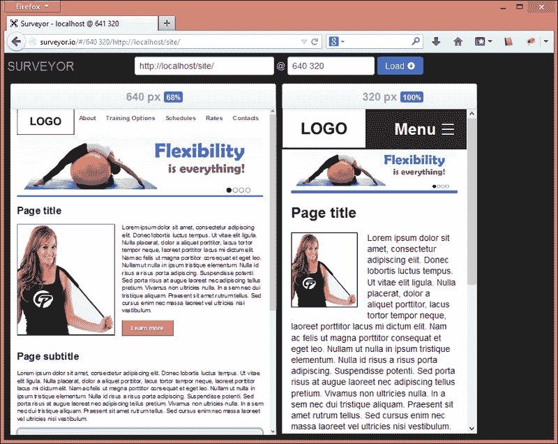

# 第九章：测试响应性

事实证明，在设备本身上检查设计没有比在我们的测试模拟器中消耗更多的时间，浏览器工具是使测试变得更快的解决方案，但不会能够复制一个与真实情况完全相同的网站。

尽管它们会非常接近，但我们可以将这种类型的测试定义为仅作为初始测试过程，然后在真实设备上进行测试，以确保所有功能都运行良好。

在本章中，我们将学习以下内容：

+   使用浏览器工具模拟设备

+   在设备模拟器上测试

+   响应式网站单元测试的提示

# 使用浏览器工具模拟设备

浏览器工具将无法模拟我们通常在设备上看到的方式，但它们有助于 CSS 断点测试，并显示您的响应式网站在 iPad、iPhone 或任何基于屏幕尺寸测量的 Android 手机等最流行设备上的外观。

屏幕调整大小不会捕捉浏览器及其渲染引擎之间的不一致性。例如，使用 Chrome 调整浏览器大小并不会告诉您仅在 Safari 移动浏览器上发生的 CSS 问题。

让我们来看看几个网站，这将帮助您作为开发人员确定您的网站在特定设备上的表现如何。

## 使用 Viewport Resizer 网站工具

Viewport Resizer 是一个网站工具，它在开发或发布网站后测试响应式网站时提供了便利。

在工具网站上列出的优点中，我们想要强调一些：

+   在运行时添加自定义屏幕尺寸

+   设备指标的视觉预览（鼠标悬停）

+   视口信息（大小、纵横比、方向和用户代理）

+   打印支持：仅 WebKit（Chrome 和 Safari）

不幸的是，这个工具在任何版本的 Internet Explorer 浏览器中仍然无法工作，这对于查找 Windows 手机上的视觉问题会很有帮助。

无需下载或安装它。您只需要访问 [`lab.maltewassermann.com/viewport-resizer`](http://lab.maltewassermann.com/viewport-resizer) 并将标有 **点击或收藏** 按钮的链接保存到您的收藏链接列表中。

以下是我们的网站在智能手机上使用此工具时的呈现示例：

## 使用调查者网站工具

调查者是一个网站工具，它遵循了上一个工具的基础，并使得在正在开发的网站和已经发布的网站上测试响应性成为可能。

您可以通过访问 [`surveyor.io`](http://surveyor.io) 并指定要查看的 URL 和屏幕尺寸来测试网站（没有预定义的值可供选择）。

然后，您可以在所有断点上并排测试您的响应式设计，帮助您更好地了解正在使用的断点设计，促进所有比较。

### 提示

有时，此浏览器工具显示的滚动条可能会误导我们对网站分析，显示出实际上不存在的问题。在这种情况下，值得检查网站以及接下来的这个工具。

观察这个网站，并比较该网站被调整到平板电脑和智能手机版本之间的区别：

## 使用 ScreenFly 网站工具

这个工具也遵循了我们之前看到的网站调整大小的模式，在这种模式下，开发者输入 URL（它也适用于开发项目），并选择我们想要在网站上检查的分辨率。

这个工具为开发者提供了一些精确的屏幕尺寸模板供选择，以及市场上最常见的设备型号。而且它不需要记住所有模板，这让使用更加方便。或者，如果您想自定义自己的尺寸，只需点击**自定义屏幕尺寸**按钮即可。

访问网站[`quirktools.com/screenfly`](https://quirktools.com/screenfly)，您可以提供要测试的网站。默认情况下，它会在 Netbook 10 预览中显示您的网站，模拟设备宽度。您可以通过点击标题按钮并选择特定型号来选择其他设备。

ScreenFly 工具还有另一个有趣的功能，即共享链接，以便更轻松地进行客户和开发人员之间的沟通（仅适用于已经发布的网站）。

这对于改善客户和开发人员之间的沟通非常有用，展示某些功能或问题。为了做到这一点，只需点击**共享**按钮，并将链接发送给其他人。通过访问此链接，对方将看到类似于这样的屏幕：

# Opera 移动模拟器

尽管 Opera 移动浏览器已经不再处于巅峰时期，但根据[StatCounter.com](http://StatCounter.com)网站的数据，它仍然占移动设备访问量的 16.62％。这也是为什么在这个移动浏览器中至少检查我们网站的主要基本功能仍然很重要的原因。

Opera Software 公司为开发人员提供了良好的支持，他们提供了一个内置 Mobile Opera 浏览器的模拟器。其浏览器也构成了模拟器的基础，您可以使用它来测试各种不同的移动设备。您可以在[`www.opera.com/developer/mobile-emulator`](http://www.opera.com/developer/mobile-emulator)下载该应用程序。

安装好后，只需选择所需的设备，如下面的屏幕截图所示，并点击**启动**按钮：

# 响应式网站设计测试技巧

有了这些响应式设计工具，我们已经准备好创建适用于任何设备的灵活设计。

但在测试时，注意以下提示很重要：

+   不要在没有进行测试的情况下完成整个网站。最好的方法是在每个功能实施后立即进行测试，这样可以更容易找到问题所在。

+   回归测试非常重要，以防止级联错误。在测试完实现的功能后，请检查之前所做的内容是否没有在网站的其他部分引入新问题。

    ### 注意

    回归测试在对网站的现有区域进行增强之后寻找软件 bug。

+   检查图像和图标质量以及网站内容在结构上的流畅性。

+   对响应式网站进行性能分析，特别是在移动设备上查看时（我们将在下一章中专门看到这一点）。

# 练习 9 - 让我们在不同的屏幕尺寸下测试我们的网站

我们将选择我们之前看到的工具之一来测试我们的网站。

这是使用 Surveyor 工具模拟智能手机和平板电脑断点的屏幕截图：

在测试时，首先记录下所有发现的视觉问题，以及已实现的功能，然后立即开始修复它们。这个过程可以确保你不会失去注意力和浪费时间。

# 总结

在本章中，我们已经专注于通过使用工具和脚本来测试网站，以确保其在所有设备上的响应性。我们已经了解了通过使用网站工具，如 Viewport Resizer、Surveyor 和 ScreenFly 来检查我们的实现中可能存在的错误的重要性。此外，我们通过在原生 Opera Mobile 浏览器中打开网站来模拟许多移动设备并测试 Opera Mobile 模拟器。

在下一章中，我们将确保跨浏览器解决方案提供回退。我们将学习如何处理旧的浏览器，并通过展示优雅降级来呈现正确的设计。
