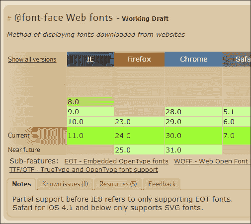
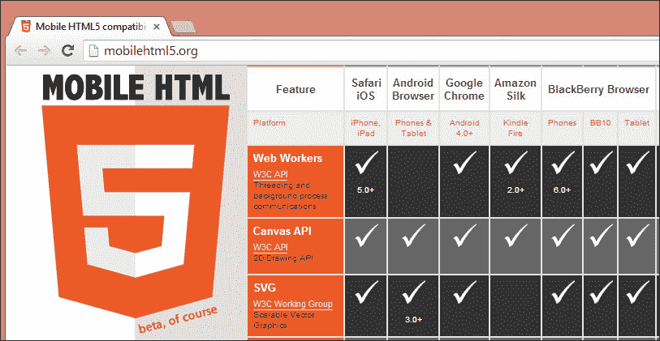
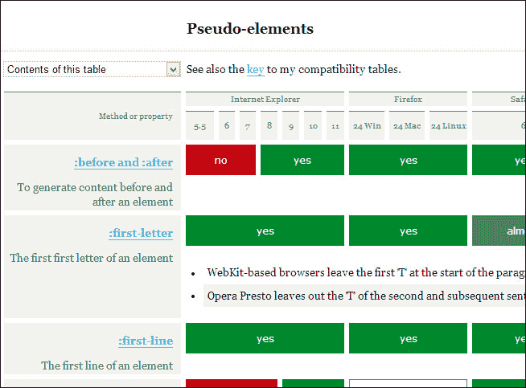
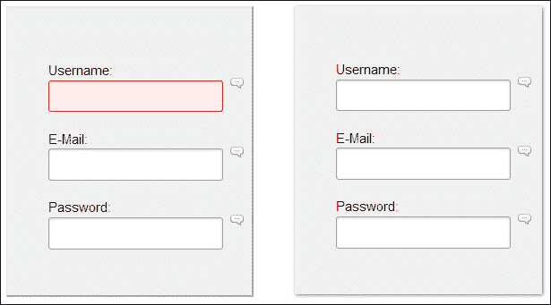
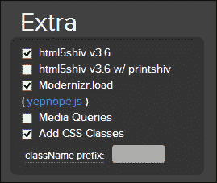

# 第十章：确保浏览器支持

不同的浏览器具有自己的专有功能以及以自己的方式实现的标准功能的子集，这给我们带来了很多工作，以使这些功能适用于所有浏览器。

这些差异的原因是 W3C 规范不断更新，而且随着浏览器之间的不断竞争，它们始终试图将自己的产品推广为具有更好的功能性。

然而，jQuery 具有良好的跨浏览器兼容性，并且具有灵活性，可以弥补每个浏览器中功能实现的差距。这些桥梁被称为**Polyfills**。

Polyfills 是本章的主要内容，我们还将了解到：

+   检查浏览器支持的功能

+   polyfill 的含义

+   了解特性检测工具

+   用于 HTML5 和 CSS3 的 Polyfill 实现

# 检查浏览器支持的功能

在网站开发中，经验确实为程序员带来了很大的灵活性。虽然这些知识很快就会过时，但我们必须及时了解新的功能、选择器和增强功能，一旦它们与浏览器兼容。

根据我们的浏览器和设备，检查技术和功能的兼容性的三个主要网站是：[CanIUse.com](http://CanIUse.com), [MobileHTML5.org](http://MobileHTML5.org), 和 [QuirksMode.org](http://QuirksMode.org)。

## CanIUse.com

[CanIUse.com](http://CanIUse.com) 网站是这些参考网站中最著名的网站，我们可以在其中检查支持 HTML5、CSS3、SVG 等在桌面和移动浏览器中的兼容性表。

如果您访问 [`caniuse.com`](http://caniuse.com)，您将会看到它的数据是基于 StatCounter GlobalStats 收集的统计数据，而且数据是不断更新的。

阅读**注释**和**已知问题**选项也是很重要的（如下面的屏幕截图中所示），因为我们是社区的一部分，对整个开发网站的演进做出了很大的贡献。这些选项突出了应该考虑的例外情况或报告问题以及在特定场景中他们必须使用的技术。



## MobileHTML5.org

[MobileHTML5.org](http://MobileHTML5.org) 网站专注于移动和平板浏览器上 HTML5 功能的兼容性，通过在真实设备上进行测试来进行区分。这很重要，因为正如我们在前一章中所看到的，模拟的桌面浏览器视图与在移动设备上测试网站之间的视觉差异很小。

但是，当涉及到硬件和设备操作系统时，这些差异会显著增加，只有在真实设备上测试网站时，我们才可能发现潜在问题。

所列设备的种类令人印象深刻。以下截图展示了一些市场份额不再很大的旧设备的功能，甚至显示了最近推出的操作系统，如 FirefoxOS。

请自行访问网站 [`mobilehtml5.org`](http://mobilehtml5.org)，并检查更新的列表。



## QuirksMode.org

在 [QuirksMode.org](http:// QuirksMode.org) 网站上，我们可以通过在使用之前检查指定的选择器或伪类是否被浏览器接受，来防止在开发过程中出现未来的坏惊喜。否则，我们必须在一开始定义的每个浏览器上进行检查。

[QuirksMode.org](http://QuirksMode.org) 网站仅专注于存储和更新几乎每个 CSS 选择器和属性的浏览器支持信息。正如我们在 [`www.quirksmode.org/css/selectors`](http://www.quirksmode.org/css/selectors) 上看到的，此信息分为以下几类：

+   组合器

+   属性选择器

+   伪元素

+   伪类

以下是 [QuirksMode.org](http://QuirksMode.org) 网站上检查伪元素技术的一部分：



# 定义回退

回退是在开发网站时的支持流程的一部分。其目标是为我们应用于网站的技术提供替代方案，但并非所有浏览器都支持此特定功能。

此术语可以分为 polyfills 和 webshims。

**Polyfill** 是一种特定的代码，用于模拟不原生支持某项特性的浏览器。Polyfills 总是尝试模仿原始浏览器特性，但有几种情况下可能会导致轻微的副作用，如增加加载时间或降低性能。

一个 polyfill 的例子是 html5shiv 脚本，我们只需将其放入代码中，它就会像没有任何变化一样起作用。我们稍后会谈论 html5shiv。

**Shims** 提供了一个回退，但通常具有自己的 API，并且可能需要修改代码以使 shim 起作用。这就是为什么我们有像 `yepnope.js` 这样的库来加载这些内容（如果需要的话）。我们稍后会看到使用 `yepnope.js` 的示例。

让我们看看两个功能检测工具，在我们提供回退时可能会有用。

# 功能检测工具

功能检测是我们能够为网站用户提供的渐进增强的第一步。

然后，我们必须测试浏览器是否已经实现了给定的功能。如果是这样，我们就不需要重新实现已经存在的任何东西，但如果浏览器确实缺少该功能，则建议为其提供正确的支持。

有时我们必须支持尚未完全实现特定功能的浏览器。然而，新功能在查看网站时会产生影响，并且网站的流行度通常会增加。

## CSS Browser Selector +

与 Modernizr 相比，跨浏览器响应式设计助手更简单，因为它的唯一功能是在网站加载时检测功能，并将其标记在代码中，使用放置在`<html>`标签中的类。

它易于实现，因此允许我们编写特定的 CSS 代码，并解决仅限于某些操作系统或浏览器的视觉问题，这是 CSS hacks 的终结！

此 JavaScript 库主要识别的主要项目是：

+   浏览器及其版本

+   渲染引擎

+   平台和操作系统

+   设备

+   屏幕检测的`max-width`和`min-width`

+   浏览器方向检测

+   语言检测

通过访问[`ridjohansen.github.io/css_browser_selector/`](http://ridjohansen.github.io/css_browser_selector/)网站自己尝试这个工具，并通过检查`<html>`元素来查看类。

这样，就可以解决特定浏览器的问题，甚至帮助创建类似这样的回退。考虑以下示例：

```js
.orientation_landscape .div-example {
  border: 2px solid red;
}
```

### 提示

我们拥有的用于创建异常的自定义代码越少，实施未来更新和更改就越好。如果可能的话，最好是确定错误的根本原因，而不仅仅是修复浏览器之间的视觉差异。

### 如何操作

下载后，我们只需在`<head>`标签内的代码中包含`css_browser_selector.js`文件：

```js
<script src="img/css_browser_selector.js"></script>
```

通过检测，可以加载脚本或不同的功能，但这不包括在此解决方案中。为了解决这个问题并访问更多类型的功能检测，建议使用更完整的解决方案：Modernizr。

## Modernizr

Modernizr 是一个 JavaScript 库，用于检测用户浏览器中的 HTML5 和 CSS3 功能，使得为每种情况编写条件化的 JavaScript 和 CSS 变得容易，无论浏览器是否支持某个功能。

它通过向`html`元素添加类来实现我们将来在 CSS 中选择的目的。此外，它创建了一个 JavaScript 对象，其中包含稍后用于支持数十个测试的结果。当从[`modernizr.com`](http://modernizr.com)下载 Modernizr 时，我们可以选择下载完整开发版本或只包含我们打算使用的部分的定制构建版本。

### 提示

Modernizr 的网站建议下载一个定制版本，该版本具有适合项目的功能，而不是使用来自 CDN 的完整版本，因为大多数情况下定制版本比完全开发的版本要小。

之后，我们可以像这样在头部部分的代码中包含`the modernizr.custom.85330.js`文件：

```js
<script src="img/modernizr.custom.85330.js"></script>
```

让我们观察一下在 Firefox 上查看时 `<html>` 标签中所有检测到并准备使用的功能的类是如何排列的：

```js
<html lang="en" class=" js no-flexbox flexboxlegacy canvas canvastext webgl no-touch geolocation postmessage no-websqldatabase indexeddb hashchange history draganddrop websockets rgba hsla multiplebgs backgroundsize borderimage borderradius boxshadow textshadow opacity cssanimations csscolumns cssgradients no-cssreflections csstransforms csstransforms3d csstransitions fontface generatedcontent video audio localstorage sessionstorage webworkers applicationcache svg inlinesvg smil svgclippaths">Now, let's look at the features detected, but this time viewed on Internet Explorer 8:<HTML class="ie8 js no-flexbox no-flexboxlegacy no-canvas no-canvastext no-webgl no-touch no-geolocation postmessage no-websqldatabase no-indexeddb hashchange no-history draganddrop no-websockets no-rgba no-hsla no-multiplebgs no-backgroundsize no-borderimage no-borderradius no-boxshadow no-textshadow no-opacity no-cssanimations no-csscolumns no-cssgradients no-cssreflections no-csstransforms no-csstransforms3d no-csstransitions fontface generatedcontent no-video no-audio localstorage sessionstorage no-webworkers no-applicationcache no-svg no-inlinesvg no-smil no-svgclippaths" lang=en xmlns:html5shiv>
```

这样，我们可以编写这种代码，在这种情况下，我们可以确保如果您的浏览器不支持`boxshadow`属性，我们可以制作两个边框模拟阴影效果：

```js
.box {
  border:1px solid #DDD;
  border-bottom: 1px solid #AAA;
  border-right: 1px solid #AAA;
}
.boxshadow div.box {
   border: none;
   -webkit-box-shadow: 1px 1px 3px #777;
      -moz-box-shadow: 1px 1px 3px #777;
           box-shadow: 1px 1px 3px #777;
}
```

下面的代码示例演示了如何在边框上创建阴影效果：



现在，让我们看看当解决方案需要在需求网站上添加另一个库时，我们可以使用 YepNope.js 做些什么。

### YepNope.js

YepNope.js 是一个用于异步条件加载外部 JavaScript 和 CSS 资源的 JavaScript 库。

以下是一个示例，说明了如何使用 Modernizr 测试 CSS 动画，以及在浏览器不支持`CSSTransforms`时使用 YepNope 作为回退：

```js
<script>
  Modernizr.load({
    test: Modernizr.csstransforms,
    yep : 'css/cssTransform.css',
    nope: ['css/noTransform.css','js/jQuery.pseudoTransforms.js ']
  }); 
</script>
```

### html5shiv

html5shiv 库可以在较旧版本的 IE 浏览器中启用对 HTML5 元素的支持，特别是 6 到 8，并为 IE9 提供了一些基本支持。

另外，这个解决方案还有另一个名为`html5shiv-printshiv.js`的文件，其中包含了一个可打印版本。它还允许通过 IE6 到 IE8 打印使用 HTML5 元素及其子元素时进行样式设置。

您可以通过简单地选择 Modernizr 下载页面上显示的选项来使用此功能，当该库包含在项目中时，如果浏览器不支持该 html5 元素，它将应用该 polyfill：



# Polyfill 实现

已经开发了数百种 polyfills 和 shims。并且随着新功能、元素或增强功能的创建，这个列表会不断增长。

现在我们将看到一些 polyfill 的实现，但是重要的是在开始创建新的 polyfill 之前，你要检查[`github.com/Modernizr/Modernizr/wiki/HTML5-Cross-Browser-Polyfills`](https://github.com/Modernizr/Modernizr/wiki/HTML5-Cross-Browser-Polyfills)网站，看看是否已经开发了一个 polyfill。

## MediaElements.js

MediaElements 是一个 polyfill，用于在旧版本浏览器中使用 Flash 技术模拟本机 HTML5 MediaElement API，从而为正在查看的`<video>`和`<audio>`元素创建一致的播放器设计。

在下面的示例中，我们将应用此库来改善浏览器在显示视频时的一致性。然而，要使每个浏览器都能播放您的音频/视频，还有很多工作要做，因为它们需要在不同格式（如`.mp4`、`.webm`和`.ogg`）的文件中托管多个版本。

### 如何做到

从[`www.mediaelementjs.com`](http://www.mediaelementjs.com)下载最新版本后，我们可以在`<head>`标签内包含 JavaScript 库和`stylesheet`文件：

```js
<script src="img/jquery-1.9.1.min.js"></script>
<script src="img/mediaelement-and-player.min.js"></script>
<link rel="stylesheet" href="../build/mediaelementplayer.min.css" />
```

以下代码用于为不同的浏览器提供更多的可访问性：

```js
<video width="640" height="360" id="player2" poster="../media/echo-hereweare.jpg" controls="controls" preload="none">
  <!-- MP4 source must come first for iOS and webkit browsers -->
  <source type="video/mp4" src="img/echo-hereweare.mp4" />

  <!-- WebM for Firefox and Opera -->
  <source type="video/webm" src="img/echo-hereweare.webm" />
  <source type="video/ogg" src="img/echo-hereweare.ogv" />

  <!-- Fallback flash player -->
  <object width="640" height="360" type="application/x-shockwave-flash" data="../build/flashmediaelement.swf">    
    <param name="movie" value="../build/flashmediaelement.swf" /> 
    <param name="flashvars" value="controls=true&amp;file=../media/echo-hereweare.mp4" />     
    
  </object>   
</video>
```

然后，你可以通过以下方式为文档中的任何`<video>`或`<audio>`元素初始化播放器：

```js
<script>
$('video').mediaelementplayer({
  success: function(player, node) {
    $('#' + node.id + '-mode').html('mode: ' + player.pluginType);
  }
});
</script>
```

在下面的截图中，显示了其默认视频播放器 UI 的示例：


当执行播放器时，有许多选项可供配置。这些选项可以在[`mediaelementjs.com/#options`](http://mediaelementjs.com/#options)找到。

## SVG

**可缩放矢量图形**（**SVG**）是一种用于矢量图形的图像格式。它的使用具有许多优点，如文件大小压缩良好，可在不失清晰度的情况下缩放到任何大小，在视网膜显示屏上显示效果良好，并通过为设计师提供更多控制权来实现更多交互性。

然而，浏览器对其的接受尚不完整，需要备用方案。 *Alexey Ten* 制定了一种非常有趣的技术，因为它解决了诸如 Internet Explorer 8 和 Android 2.3 等浏览器的问题。

让我们了解一种更好的覆盖 SVG 实现的方法。

### 如何实现

有一些不同的方法可以在网站上放置 SVG 文件。我们将使用以下方法来处理它们：背景图像，作为 `svg` 标签和作为 `img` 标签。

#### 将 SVG 作为背景图像

Modernizr 具有 SVG 测试。因此，您可以声明具有 Modernizr 注入到 HTML 元素中的类名的备用方案：

```js
.my-element {
  background-image: url(image.svg);
}
.no-svg .my-element {
  background-image: url(image.png);
}
```

#### 将 SVG 作为 <svg> 标签

这是一种新技术，在旧浏览器中无法很好地理解突出显示的术语，并显示 `.svg` 文件的地方显示 `.png` 文件：

```js
<svg width="96" height="96">
  <image xlink:href="svg.svg" src="img/svg.png" width="96" height="96" />
</svg>
```

#### 将 SVG 作为简单的  标签

通过使用 Modernizr，我们将测试浏览器是否支持 SVG，然后再插入代码。如果不支持，则脚本将查找具有相同名称的 `.png` 文件，并显示该文件而不是 `.svg` 文件。

```js


<script>
if (!Modernizr.svg) {
  $('img[src$=svg]').each(function(index, item) {
    imagePath = $(item).attr('src');
    $(item).attr('src',imagePath.slice(0,-3)+'png');
  });
}
</script>
```

然而，为了保持网站的正常运行，需要一致的 URL 和文件名模式，否则脚本将无法定位到正确的资源。

## Respond.js

Respond.js 是一个快速且轻量级的 `min-width` / `max-width` 的 polyfill，它使媒体查询得以支持，它将样式表重新解释为 Internet Explorer 6 到 8 浏览器可以理解的格式，加载完成后。

我们的所有媒体查询不需要任何额外的更改。我们只需确保我们的 `@media` 语句编写正确即可。

### 小贴士

如果您有一些 CSS 文件，请确保在 CSS 文件之后包含 `respond.min.js`。

如果我们的 CSS 使用 `@import` 或以内联方式编码，则 Respond.js 无法读取它。相反，请使用典型的 `<link>` 方法。例如：

```js
<link rel="stylesheet" href="css/style.css" media="screen and (max-width:480px)" />
```

### 如何实现

在 DOM 底部（在 `</body>` 结束标记之前），我们需要包含 Respond.js 库，可以从 [`github.com/scottjehl/Respond`](https://github.com/scottjehl/Respond) 下载。如果您有 CSS 文件，请确保在 CSS 文件之后包含 `respond.min.js`：

```js
<script src="img/respond.min.js"></script>
```

已经完成。

# 总结

在本章中，我们确保为观众提供了备用方案以确保可访问性。我们学习了如何通过使用 CSS 浏览器选择器和 Modernizr 来检测浏览器特性和支持的功能。这些库通过提供支持来执行渐进增强给我们带来了很大的帮助。此外，我们还学习了有关 HTML5 的有趣的 polyfill，例如 html5shiv、MediaElements，以及 `SVG` 和 `FileAPI` 的技术。本章还包括了对 CSS 的有用 polyfill Respond。

在下一章中，我们将看到成千上万个插件，用于创建一个良好的响应式网站，这些插件补充了我们迄今为止阅读过的所有章节。
