# 第十一章：有用的响应式插件

随着技术和趋势的不断发展，每天都会出现新的插件，这些插件对于开发响应式网站变得越来越有帮助。通过诸如[`www.smashingmagazine.com/`](http://www.smashingmagazine.com/)、[`bradfrostweb.com/blog/`](http://bradfrostweb.com/blog/) 和 [`www.lukew.com/ff/`](http://www.lukew.com/ff/)等博客及时了解它们非常重要。

在本章中，我们将重点介绍不同的插件，涵盖以下主题：

+   网站结构的插件，例如 Columns、Equalize 和 Packery

+   用于菜单导航的插件，例如 Sidr、EasyResponsiveTabstoAccordion、FlexNav 和其他杂项插件

# 网站结构的插件

在第二章中，我们已经看到了 Fluid Baseline Grid System、1140 Grid 和 Foundation 4 等插件，它们构成了一个开发工具包，将帮助我们快速开发网站。我们需要记住的目标是创建一个连贯的网站，并且避免浪费时间重新创建已经完成的事情。

还有一些其他的额外插件，例如 Columns、Equalize 和 Packery，之前没有提及，为了集中精力构建我们的网站，但它们非常有用。

## 使用 Columns 创建简单的响应式结构

让我们从 Columns 插件开始，它的目标是提供一种快速创建响应式布局的方式，就像网格系统一样。它的简单性使其轻巧，并且学习曲线非常快。Columns 使用 MIT 许可证，在 IE9 和现代浏览器上运行良好。如果要使用 IE8，将需要为 HTML5 和媒体查询提供 polyfills。

此插件建议用于只需要简单且快速的响应式结构实现的小型网站。这并不意味着它不适用于中型和大型网站，但在这种情况下，其他框架可能提供更多的选项和解决方案，这些网站可能需要。

此外，还有一个选项可以根据屏幕尺寸自动调整字体大小的最小和最大值。

实现这个功能，我们需要从[`github.com/elclanrs/jquery.columns/`](https://github.com/elclanrs/jquery.columns/)访问该网站并下载这个解决方案的文件。

然后，让我们将以下代码插入到我们 DOM 的 `<head>` 标签中：

```js
<link rel="stylesheet" href="css/jquery.columns.css">
```

现在，让我们使用这个 HTML 代码作为一个示例来说明插件的使用，但随意尝试在您当前的 HTML 结构上使用这个插件。请注意，类似 `row-1` 和 `col` 这样的类以及类似 `content-1` 和 `content-2` 这样的 ID 将根据断点定义结构将如何显示：

```js
<section id="slider" class="row-1">
  <div class='col'>
    
  </div>
</section>
<section id="content-1" class="row-2">
  <div class='col'>
    <h2>Maui waui</h2>
    <p>Lorem ipsum dolor sit amet...</p>
  </div>
  <div class='col'>
    <h2>Super duper</h2>
    <p>Lorem ipsum dolor sit amet...</p>
  </div>
</section>
<section id="content-2" class="row-4">
  <div class='col'>
    <h3>Something</h3>
    <p>Lorem ipsum dolor sit amet...</p>
  </div>
  <div class='col'>
    <h3>Nothing</h3>
    <p>Lorem ipsum dolor sit amet...</p>
  </div>
  <div class="col">
    <h3>Everything</h3>
    <p>Lorem ipsum dolor sit amet...</p>
  </div> 
  <div class="col">
    <h3>All of it</h3>
    <p>Lorem ipsum dolor sit amet...</p>
  </div> 
</section>
```

通过定义类，例如 `row-2` 或 `row-4`，我们正在定义该部分内有多少列，并且 ID 将在稍后更改这些列的显示时提供更多的控制。

基本上，对于这个例子，我们将使用两个断点：480（插件的标准）和 1024。在 DOM 底部（在 `</body>` 结束标签之前），我们需要包含 jQuery 代码和 Columns 脚本。然后，我们将通过调用 `quickSetup` 函数并配置列和断点来运行插件。

```js
<script src="img/jquery-1.9.1.min.js"></script>
<script src="img/jquery.columns.js"></script>
<script>
$.columns.quickSetup({
  fontSize: [14, 16]
});
$.columns.setCols({
  'content-1': [ [1024, 1] ],
  'content-2': [ [1024, 2] ]
});
</script>
```

在此示例中，当屏幕尺寸大于 1024 像素时，`content-2` 部分从每行四列开始。然后，当屏幕尺寸小于 1024 像素时，我们设置每行 2 列，并且当尺寸小于 480 像素时，设置每行 1 列。

让我们看看应用于父元素在桌面和平板电脑屏幕上的插件的可视结果：

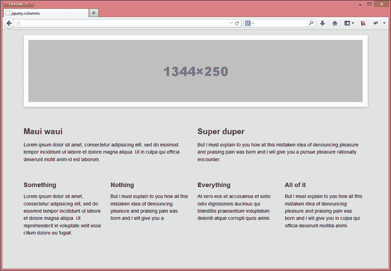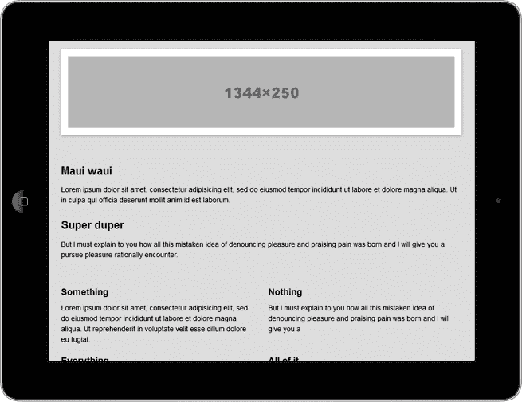

此外，该插件允许动态添加列。但是，要反映此更改，需要在添加到 DOM 后的代码中调用 `$.columns.refresh()`。

## 使用 Equalize 调整元素尺寸

当将页面自定义为看起来像卡片时，当加载动态内容时可能会出现一个常见问题，即尺寸可能会变化。我们希望保持所有项目的外观相同。

如果我们将列表项元素浮动到左侧，则每个项的内容将影响到断行，并且而不是从左侧开始的第二行将开始缩进。因此，不良布局卡片断裂的问题将如下所示：

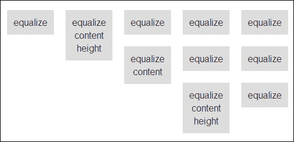

或者如果我们定义了所有项目的相同尺寸，我们将失去动态尺寸。类似的情况也发生在元素的宽度上。

Equalize 用于使元素的高度或宽度相等。它是一个轻量级且非常有用的 jQuery 插件，只需要指定父元素的 ID 或类即可执行。基本上，它通过计算更大元素的尺寸并将其定义为其他元素来工作，避免了任何浮动问题。

此外，它接受所有以下 jQuery 尺寸方法来调整元素的大小：`height`、`outerHeight`、`innerHeight`、`width`、`outerWidth` 和 `innerWidth`。最常用的是 `height`，它是插件的默认设置。

让我们尝试重现之前看到的相同例子，以查看这个插件的运行情况。目标是实现 Equalize 插件，调整所有项为较大元素的相同尺寸，并保持浮动工作的响应性，而没有不必要的断点。

从 [`github.com/tsvensen/equalize.js/`](https://github.com/tsvensen/equalize.js/) 下载后，我们将从源代码中添加以下 HTML 代码开始：

```js
<ul id="equalize-height">
  <li>equalize</li>
  <li>equalize content height</li>
  <li>equalize</li>
  <li>equalize</li>
  <li>equalize</li>
  <li>equalize content</li>
  <li>equalize</li>
  <li>equalize</li>
  <li>equalize content height </li>
  <li>equalize</li>
</ul>
```

然后，在 DOM 底部（在 `</body>` 结束标签之前），我们需要包含 jQuery 和 Equalize 库。之后，我们将执行用于 `equalize-height` ID（`<li>` 元素的父元素）的脚本。

```js
<script src="img/jquery-1.9.1.min.js"></script>
<script src="img/equalize.min.js"></script>
<script>
$(function() {
  $('#equalize-height').equalize();
});
</script>
```

查看以下图中的预期情况：

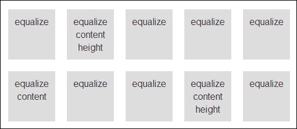

## 使用 Packery 实现卡片网站布局

Packery 是一个使用算法在基于卡片的网站布局上填充空白间隙，优雅地调整它们的 jQuery 插件。基于卡片的布局趋势随 Google+而来，正在赢得全球粉丝。

### 注意

Packery 插件有一个针对非商业、个人或开源项目的 GPL v3 许可证。如果你想在公共网站上使用它，需要支付$25。

它的实现并不太困难，正如我们将在它的使用示例中看到的那样。但是为了做到这一点，我们首先需要从[`github.com/metafizzy/packery`](https://github.com/metafizzy/packery)下载它。

让我们从创建一个空的 HTML 文件开始。打包的源文件包括了你使用 Packery 所需的一切。所以，在下载后，让我们在`<head>`标签中包含建议的自定义 CSS，以更好地处理卡片的尺寸：

```js
<style>
img {max-width: 100%; height: auto;}
@media screen and (min-width: 1024px) and (max-width: 1280px) {
  /* DESKTOP - 4 columns */
  #container > div { width: 25%; }
  #container > div.w2 { width: 50%; }
  #container > div.w4 { width: 100%; }
}
@media screen and (min-width: 768px) and (max-width: 1023px) { 
  /* TABLET - 3 columns */
  #container > div { width: 33%; }
  #container > div.w2 { width: 66%; }
  #container > div.w4 { width: 100%; }
}
@media screen and (max-width: 767px) {
  /* SMARTPHONE - 1 column */
  #container > div { width: 100%; }
}
</style>
```

之后，让我们使用这段`HTML`代码，其中每个项目代表一张卡片：

```js
<div id="container" class="js-packery">
  <div class="w4"></div>
  <div class="w2"></div>
  <div></div>
  <div></div>
  <div></div>
  <div></div>
  <div class="w2"></div>
  <div></div>
  <div></div>
</div>
```

在 DOM 的底部（在`</body>`结束标签之前），我们需要包含 jQuery 和 Packery 库。此外，我们将初始化 Packery 脚本，告知容器 ID，用于重新定位的子元素的类，以及列（或间距）之间所需的空间。

```js
<script src="img/jquery-1.9.1.min.js"></script>
<script src="img/packery.pkgd.min.js"></script>
<script>
var $container = $('#container');
$container.packery({
  itemSelector: '#container > div',
  gutter: 0
});
</script>
```

这是平板电脑和台式机的视觉结果：

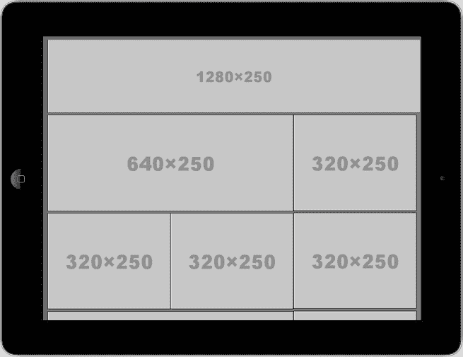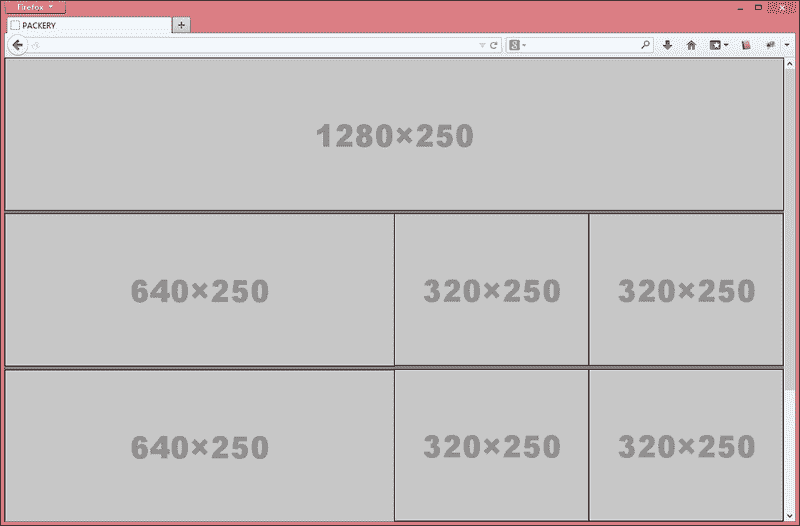

# 菜单导航的插件

在第三章*建立响应式导航菜单*中，我们已经看到了八种不同的流行菜单技术，每种都用于自己的目的。不幸的是，没有一种"万金油"菜单可以在所有情况下很好地工作。

为了始终与渐进的用户体验紧密相连，我们必须研究如何通过新的 JavaScript/jQuery 插件来改进我们的网站作为一个产品，常常可以找到。

我们将看到三个补充插件，与我们之前见过的插件相比，它们在方法上带来了一些小的差异。它们是 Sidr、EasyResponsiveTabstoAccordion 和 FlexNav。

## 使用 Sidr 创建侧边菜单

Sidr 是一个用于创建侧边菜单的 jQuery 插件，在响应式网站上非常常见。它还允许多个 Sidr 菜单（在两侧），以及与外部内容一起使用。

让我们尝试通过创建一个标准的 HTML 文件，并添加插件中包含的 CSS 文件来实现以下示例，可以从[`github.com/artberri/sidr`](https://github.com/artberri/sidr)下载。我们会发现两种显示菜单的选项，一种是暗色调（`jquery.sidr.dark.css`），一种是浅色调（`jquery.sidr.light.css`）。我们可以使用它们或扩展它们来覆盖一些样式。

所以，在`<head>`标签中包含其中一个后，我们可能会设置初始样式，以在屏幕大小高于 767 像素时隐藏菜单标题。

```js
<link rel="stylesheet" href="css/jquery.sidr.light.css">
<style>
  #mobile-header {
    display: none;
  }
  @media only screen and (max-width: 767px){
    #mobile-header {
      display: block;
    }
  }
</style>
```

现在，让我们使用以下 HTML 代码作为示例来说明插件的使用方法：

```js
<div id="mobile-header">
  <a id="responsive-menu-button" href="#sidr-main">Menu</a>
</div>
<div id="navigation">
  <nav>
    <ul class="nav-bar"> 
      <li><a href="#">Menu item1</a></li>
      <li><a href="#">Menu item2</a></li>
      <li><a href="#">Menu item3</a></li>
      <li><a href="#">Menu item4</a></li>
      <li><a href="#">Menu item5</a></li>
      <li><a href="#">Menu item6</a></li>
    </ul>
  </nav>
</div>
```

在 DOM 底部（在 `</body>` 结束标签之前），我们需要包含 jQuery 和 Sidr 库。之后，我们将通过将 Sidr 的执行与负责打开侧边菜单的菜单按钮绑定来绑定 Sidr 的执行。

```js
<script src="img/jquery-1.9.1.min.js"></script>
<script src="img/jquery.sidr.js"></script>
<script>
$('#responsive-menu-button').sidr({
  name:   'sidr-main',
  source: '#navigation'
});
</script>
```

我们定义的 `#sidr-main` ID 将是侧边栏菜单 `<div>` 的 ID，而 `#navigation` 是我们选择在此侧边栏内显示的菜单的 ID。

在下面的截图中，我们将看到此实现的结果。单击**菜单**链接后，将在小于 767 像素的屏幕上显示浅色主题菜单（此值由我们自定义）：

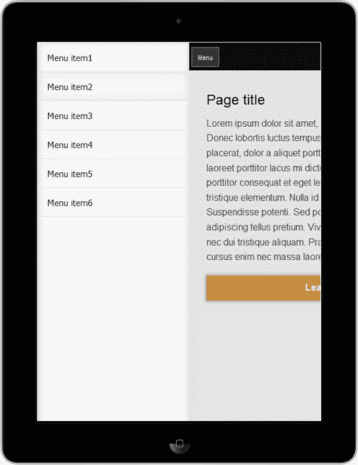

## 了解 EasyResponsiveTabstoAccordion

EasyResponsiveTabstoAccordion 是一个轻量级的 jQuery 插件，特别是在小型设备（如平板电脑和智能手机）上显示时，可以优化普通、水平或垂直选项卡为手风琴。

此插件的目标是根据屏幕尺寸调整元素。此外，它通过首先显示第一个选项卡的内容，然后显示其他选项卡的内容，优先显示内容阅读。此插件实现的效果完全使用 jQuery 实现，有助于提供跨浏览器兼容性。

更好地理解其工作方式的方法是实践。从 [`github.com/samsono/Easy-Responsive-Tabs-to-Accordion/`](https://github.com/samsono/Easy-Responsive-Tabs-to-Accordion/) 下载后，让我们创建一个标准的 HTML 文档，并将 CSS 文件添加到 `<head>` 标签内：

```js
<link rel="stylesheet" href="css/responsive-tabs.css">
```

现在，我们将使用以下 HTML 代码作为选项卡内容的样本：

```js
<div id="mytab">          
  <ul class="resp-tabs-list">
    <li>Tab-1</li>
    <li>Tab-2</li>
    <li>Tab-3</li>
  </ul> 
  <div class="resp-tabs-container">                  
    <div>Lorem ipsum dolor sit amet…</div>
    <div>Integer laoreet placerat suscipit…</div>
    <div>Nam porta cursus lectus…</div>
  </div>
</div>
```

然后，在 DOM 底部（在 `</body>` 结束标签之前），我们需要包含 `jquery` 和 `easyResponsiveTabs` 库。然后，我们将通过提供容器元素的 ID 来执行脚本：

```js
<script src="img/jquery-1.9.1.min.js"></script>
<script src="img/easyResponsiveTabs.js"></script>
<script>
$(document).ready(function () {
  $('#mytab').easyResponsiveTabs({
    type: 'default', //Types: default, vertical, accordion
    width: 'auto',
    fit: true,
    closed: 'accordion',
    activate: function(event) {
      // Callback function if tab is switched if need
    }
  });
});
</script>
```

当在智能手机和屏幕尺寸大于 768 像素时，此插件的可视结果如下：

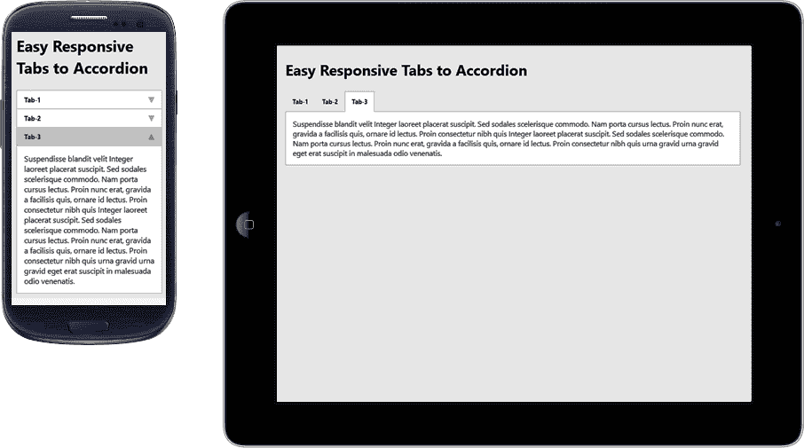

当执行脚本时，会有一些可选参数需要提供，例如：

+   `type: 'default'`：可以设置为 `default`、`vertical`、`accordion`

+   `width: 'auto'`：可以设置为 `auto` 或任何自定义宽度

+   `fit: true`：它有助于将整个内容适配到容器中

+   `closed: false`：它在启动时关闭面板

+   `activate: function(){}`：这是一个回调函数，用于包含一些在选项卡更改时触发的自定义代码

## 使用 FlexNav 为您的菜单增加灵活性

FlexNav 是一个 jQuery 插件，可以简化复杂且响应式的导航菜单的创建，而无需编写大量代码。它采用了首先适配移动端的方法，只需轻触目标即可在触摸屏上显示子菜单。

除了以设备无关的方式控制这些嵌套子项之外，该插件还改进了通过键盘 tab 支持导航的可访问性，并为旧浏览器提供了回退。

有关其实现，您将在 [`github.com/indyplanets/flexnav`](https://github.com/indyplanets/flexnav) 中找到可下载的文件。从标准 HTML 文档开始，需要在包含 CSS 文件的 `<head>` 标签中添加此代码：

```js
<link href="css/flexnav.css" rel="stylesheet" type="text/css" />
```

现在，我们将在简单的无序列表中包含以下 HTML 代码，添加类和数据属性：

```js
<ul class="flexnav" data-breakpoint="800">
  <li><a href="#">Item 1</a></li>
  <li><a href="#">Item 2</a>
    <ul>
      <li><a href="#">Sub 1 Item 1</a></li>
      <li><a href="#">Sub 1 Item 2</a></li>
    </ul>
  </li>
  <li><a href="#">Item 3</a>
    <ul>
      <li><a href="#">Sub 1 Item 1</a></li>
      <li><a href="#">Sub 1 Item 2</a></li>
      <li><a href="#">Sub 1 Item 3</a></li>
    </ul>
  </li>
</ul>
<div class="menu-button">Menu</div>
```

然后，在 DOM 底部（`</body>` 结束标记之前），我们将包含 jQuery 和 FlexNav 库。之后，我们将通过通知要转换为响应式的菜单元素的 ID 或类来执行脚本。

```js
<script src="img/jquery-1.9.1.min.js"></script>
<script src="img/jquery.flexnav.min.js"></script>
<script>
$(".flexnav").flexNav();
</script>
```

这是在智能手机和平板电脑上查看时该插件可能提供的视觉示例：

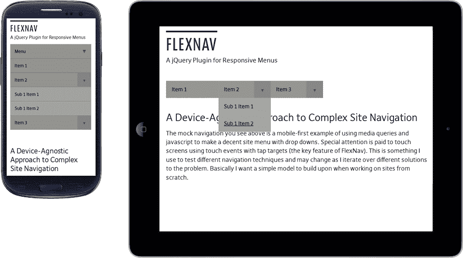

当我们执行脚本时，也可以向插件提供一些选项，例如：

+   `'animationSpeed':'250'`: 这设置了接受 fast/slow 的动画速度

+   `'transitionOpacity': true`: 这指定了默认的不透明度动画

+   `'buttonSelector': '.menu-button'`: 这指定了默认菜单按钮类

+   `'hoverIntent': false`: 仅用于 hoverIntent 插件

+   `'hoverIntentTimeout': 150`: 仅用于 hoverIntent 插件

例如：

```js
<script>
$(".flexnav").flexNav({
  'buttonSelector': '.exclusive-button'
});
</script>
```

# 杂项

我们将看到的以下插件没有特定的类别。它们是 SVGeezy、Prefix free、Magnific Popup、Riloadr 和 Calendario。

## SVGeezy

SVGeezy 是一个 JavaScript 插件，用于处理 IE8 及更早版本以及 Android 2.3 及更早版本等浏览器的 SVG 图像。它的工作非常简单，因为它只会在我们的网站上检测到 SVG 图像，并自动搜索另一种图像（例如 PNG 格式）作为其回退。

回退图像必须具有相同的文件名。更改仅涉及文件格式。此格式可以在初始化脚本时指定。

如果您需要为这些旧浏览器提供支持，我们将看看如何做。首先，让我们访问并从 [`github.com/benhowdle89/svgeezy`](https://github.com/benhowdle89/svgeezy) 下载解决方案。

然后，创建一个新的标准 HTML 文档，并在 `` 标签内添加 SVG 图像，如下所示：

```js

```

稍后，在 DOM 底部（`</body>` 结束标记之前），我们将包含 jQuery 和 SVGeezy 库。然后，我们将通过提供两个参数来执行插件：

+   第一个定义了一个类名，如果我们没有 SVG 回退图像或者根本不想为该特定图像提供回退，我们可以使用该类名。

+   第二个意味着如果浏览器不支持显示 SVG 图像，则会提供图像的扩展名。PNG 扩展名是最常见的。

```js
<script src="img/svgeezy.js"></script>
<script>
svgeezy.init('nocheck', 'png');
</script>
```

### 注意

我们还可以将 `nocheck` 改为 `false`，让插件检查所有图片。

## Prefix free

Prefix free 为我们提供了只使用无前缀的 CSS 属性的便利；插件会在必要时为 CSS 代码添加当前浏览器的前缀，从而使前缀代码独立存在。这样，我们就不需要再记住哪些属性需要前缀了，而且可能还可以避免以后重构代码，只是为了去掉或添加新的前缀。

### 注意

这个插件不一定具有响应性，但是由于它的目标是让现代浏览器更易访问，所以要防止使用旧的前缀，并在需要时不要忘记使用它们。

开始使用它并不难。首先，让我们从 [`github.com/LeaVerou/prefixfree`](https://github.com/LeaVerou/prefixfree) 下载它。

对于这个例子，让我们重新使用一些你已经有的 HTML，并在 DOM 的 `<head>` 标签中包含 `prefixfree.js`：

```js
<script src="img/prefixfree.js"></script>
```

### 提示

这个插件建议将其包含在头部，以减少出现的闪烁效果（也称为 FOUC 效果）。

这是之前和之后的比较，我们可以注意到我们节省了多少行代码。

这就是我们通常编写代码的方式：

```js
#element {
  margin: 0;
  -webkit-box-shadow: 1px 2px 3px #999;
  box-shadow: 1px 2px 3px #999;
  border-radius: 10px;

  -webkit-transition: all 1s;
  -moz-transition: all 1s;
  -o-transition: all 1s;
  -ms-transition: all 1s;
  transition: all 1s;

  background: -webkit-linear-gradient(to top, orange 50%, #eee 70%);
  background: -moz-linear-gradient(to top, orange 50%, #eee 70%);
  background: -o-linear-gradient(to top, orange 50%, #eee 70%);
  background: -ms-linear-gradient(to top, orange 50%, #eee 70%);
  background: linear-gradient(to top, orange 50%, #eee 70%);
}
```

这个也显示了，当使用 Prefix free 时，我们如何编写相同跨浏览器的代码：

```js
#element {
  margin: 0;
  box-shadow: 1px 2px 3px #999;
  border-radius: 10px;
  transition: all 1s;
  background: linear-gradient(to top, orange 50%, #eee 70%);
}
```

我们节省了很多行代码。难以置信，不是吗？在你的文档上试试，看看有哪些好处。

## Magnific Popup

Magnific Popup 是一个用于创建可响应的弹出窗口的 jQuery 插件，可以有多种用途，比如：

+   在叠加窗口中显示单个图像/图片库

+   带视频或地图的弹出窗口

+   模态弹出窗口

+   具有 CSS 动画的对话框

它专注于性能，并为任何设备的用户提供最佳体验。关于 Internet Explorer 浏览器，Magnific Popups 与版本 8 及更早期兼容。它通过提供一个轻量且模块化的解决方案来实现这一点，可以从 [`dimsemenov.com/plugins/magnific-popup/`](http://dimsemenov.com/plugins/magnific-popup/) 下载，并点击 **构建工具** 链接。

使用 CSS3 过渡而不是 JavaScript 动画显著改善了动画的性能。此外，这个插件有一种可扩展的微模板引擎，可以重用现有的元素，从而在使用相同模式的弹出窗口时加快弹出窗口的加载速度（例如图片库）。

让我们通过实践尝试这个例子。首先，我们将创建一个新的标准 HTML 文档。下载解决方案后，让我们将 CSS 文件添加到 `<head>` 标签中。这个文件不是它的工作所需，但里面有一些有用的样式，负责良好效果：

```js
<link rel="stylesheet" href="css/magnific-popup.css">
```

现在，我们将在代码中添加这两个链接，显示一个简单的图片弹出窗口和一个视频弹出窗口。

```js
<p><a class="image-link" href="image-sample.jpg">Open popup</a></p>
<p><a class="popup-youtube" href="http://www.youtube.com/watch?v=0O2aH4XLbto">Open video</a></p>
```

然后，在 DOM 的底部（在`</body>`关闭标签之前），我们需要包含`jquery`和`magnificPopup`库。之后，我们将执行脚本两次，并为每个目的通知类（我们先前指定了一个链接）：

```js
<script src="img/jquery-1.9.1.min.js"></script>
<script src="img/jquery.magnific-popup.min.js"></script>
<script>
$(document).ready(function() {
  $('.image-link').magnificPopup({type:'image'});
  $('.popup-youtube').magnificPopup({
    type: 'iframe',
    mainClass: 'mfp-fade'
  });
});
</script>
```

下面是在智能手机和平板电脑上查看的简单图像弹出实现的可视化：


在插件文档中可以详细了解到许多使用类型，位于[`dimsemenov.com/plugins/magnific-popup/documentation.html`](http://dimsemenov.com/plugins/magnific-popup/documentation.html)。

## Riloadr

Riloadr 是一个响应式图像加载器插件。在本节中，我们将看到它与 jQuery 一起使用的工作方式，尽管这并不是必需的，因为它与框架无关。

该插件是在响应式布局中传送上下文图像的替代解决方案，该布局在不同分辨率下使用不同大小的图像以改善页面加载时间和用户体验。

Riloadr 在图像标记元素中使用`data-src`和`data-base`属性，而不是常见的`src`属性。因此，这样我们就能在浏览器渲染网站之前处理图像元素并选择最佳图像进行显示。

有一些突出的特点使其与其他竞争对手区分开来，例如：

+   对图像加载过程的绝对控制

+   可以使用 CSS 属性（例如，`minWidth`，`maxWidth`和`minDevicePixelRatio`）设置无限断点

+   Riloadr 不会为相同的图像发出多个请求

+   您可以创建不同的 Riloadr 对象（命名组），并根据需要对每个对象进行配置

+   带宽测试，只有设备具有足够快的连接才能下载高分辨率图像

从[`github.com/tubalmartin/riloadr`](https://github.com/tubalmartin/riloadr)下载后，该插件的建议是将 CSS 和 JavaScript 文件放在`<head>`标签内：

```js
<script src="img/jquery-1.9.1.min.js"></script>
<script src="img/riloadr.jquery.min.js"></script>
```

一旦加载了 Riloadr，我们可以设置其图像组：

```js
<script>
var group1 = new Riloadr({
  breakpoints: [
    {name: '320', maxWidth: 320},
    {name: '640', maxWidth: 320, minDevicePixelRatio: 2},
    {name: '640', minWidth: 321, maxWidth: 640},
    {name: '1024', minWidth: 641}
  ]
});
</script>
```

### 注意

`minDevicePixelRatio`的配置与支持高 DPI 图像的设备有关，并加载用于 640 像素的图像（尺寸是正常尺寸的两倍）。

现在，我们只需在 HTML 代码中添加这个``标签，使用`data-src`和`data-base`。

注意，在`data-base`上，我们将使用`{breakpoint-name}`作为 Riloadr 捕获的动态值，并在先前定义的断点上标识该值。这个名称可以用作按尺寸存储图像的地方，而不会搞乱：

```js
<div>
  
  <noscript>
    
  </noscript>
</div>
```

渲染上述代码时，浏览器将检测屏幕大小并选择正确的断点以适合其尺寸。然后，它将被我们之前定义的变量名称的内容替换，本例中为 320。如果浏览器识别到变量名称的内容是 640，则会发生同样的事情，这更适合。

### 注意

如果浏览器不支持 JavaScript 或发生了错误，`<noscript>` 标记将显示我们定义的图像。

以下截图显示了 Riloadr 的效果，仅在浏览器需要时加载具有不同尺寸的图像（取决于分辨率为 320 和 640 像素的断点）：

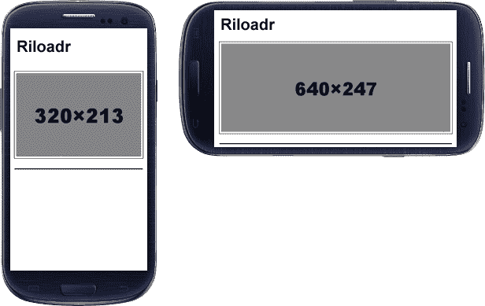

## Calendario

Calendario 是一个 jQuery 响应式插件，旨在提供适合改善用户与日历交互的布局，保持日历结构流动，以便轻松适应不同的屏幕。

在大屏幕上，它显示基于网格的布局，而在较小的屏幕上，它将其转换为垂直的月份天数堆叠，大大简化了其可视化。

### 注意

这个解决方案目前不适用于所有浏览器，因为其中一些浏览器不支持新的 CSS 属性，比如 `calc()`。这些浏览器包括 Internet Explorer 8、Opera Mini 和 Android 浏览器。

Calendario 可在 [`github.com/codrops/Calendario`](https://github.com/codrops/Calendario) 获得。

让我们首先添加插件中包含的 CSS 文件：

```js
<link rel="stylesheet" type="text/css" href="css/calendar.css" />
<link rel="stylesheet" type="text/css" href="css/custom_1.css" />
```

现在，我们将包含这个结构化的 HTML，稍后添加类和 ID 以供 JavaScript 处理：

```js
<div class="custom-calendar-wrap custom-calendar-full">
  <div class="custom-header clearfix">
    <h2>Calendario</h2>
    <div class="custom-month-year">
      <span id="custom-month" class="custom-month"></span>
      <span id="custom-year" class="custom-year"></span>
      <nav>
        <span id="custom-prev" class="custom-prev"></span>
        <span id="custom-next" class="custom-next"></span>
      </nav>
    </div>
  </div>
  <div id="calendar" class="fc-calendar-container"></div>
</div>
```

然后，在 DOM 的底部（在 `</body>` 结束标记之前），我们将需要包含 jQuery 和 Calendario 库。然后，我们将通过设置容器 ID 来初始化脚本，并创建两个有用的函数，用于通过日历进行月份导航：

```js
<script src="img/jquery-1.9.1.min.js"></script>
<script src="img/jquery.calendario.js"></script>
<script> 
$(function() {
  var cal = $('#calendar').calendario(),
    $month = $('#custom-month').html(cal.getMonthName()),
    $year = $('#custom-year').html(cal.getYear());

  $('#custom-next').on('click', function() {
    cal.gotoNextMonth( updateMonthYear );
  });
  $('#custom-prev').on('click', function() {
    cal.gotoPreviousMonth(updateMonthYear);
  } );

  function updateMonthYear() {        
    $month.html(cal.getMonthName());
    $year.html(cal.getYear());
  }
});
</script>
```

以下是在智能手机/平板电脑和桌面上查看此日历的屏幕截图：

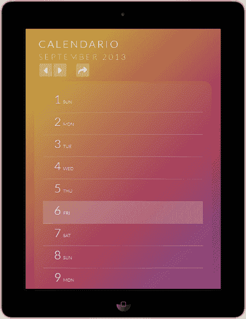

以及它在桌面上的显示方式：

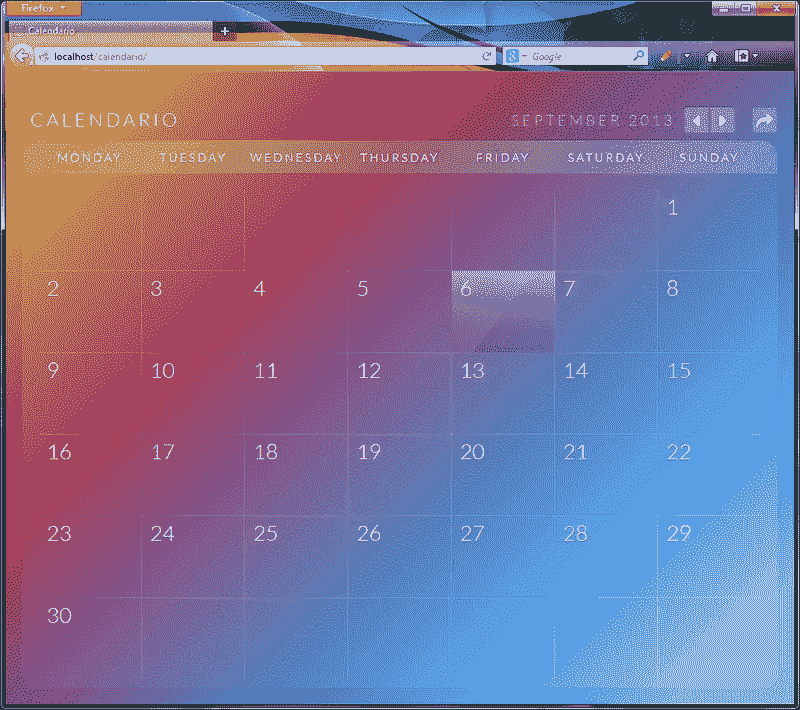

# 总结

在本章中，我们学习了三个类别的补充插件，这些插件补充了前几章的内容。对于结构插件，我们学习了如何使用 Columns 来创建简单的响应式结构，使用 Equalize 更好地分配页面上浮动元素的位置，以及使用 Packery 来创建卡片布局网站。我们还学习了使用 Sidr、EasyResponsiveTabstoAccordion 和 FlexNav 来显示菜单和选项卡的不同方法。在 *杂项* 部分，我们看到了如何使用 SVGeezy、Prefix free、MagnificPopup 插件、Riloadr 和 Calendario。

在最后一章中，我们将看到不同的技术来检测网站加载速度。性能主题非常广泛，但由于有效处理这一指标非常重要，因此在创建响应式网站时，我们将看到一些提高性能的技术。
