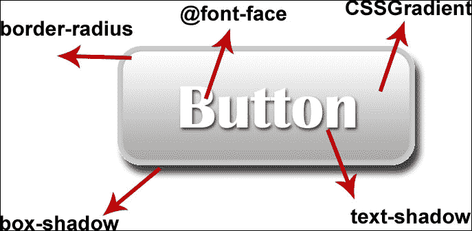
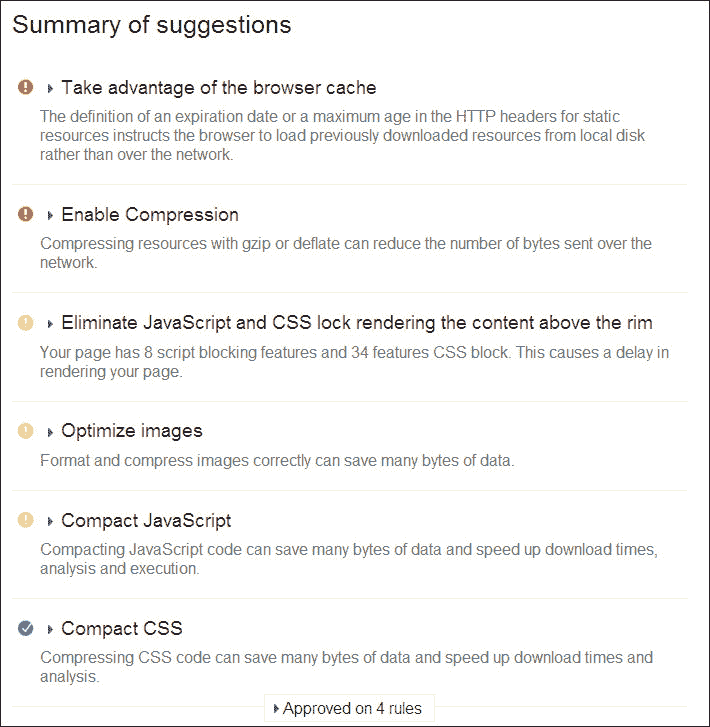
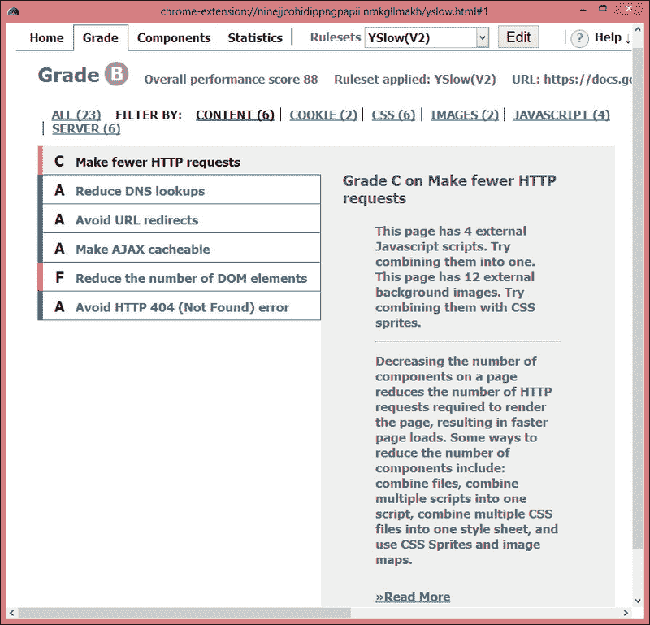
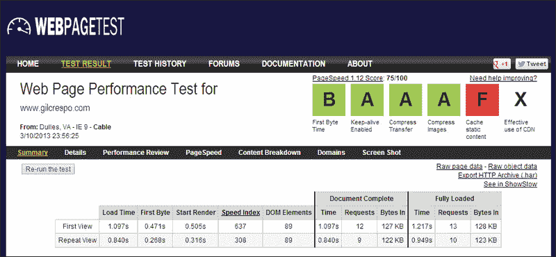
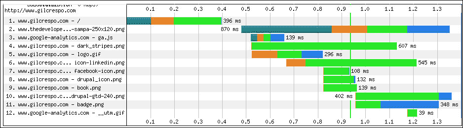

# 第十二章：提高网站性能

加载时间是导致用户放弃页面的主要因素。如果页面加载时间超过 3-4 秒，用户会转到其他地方。

对于移动设备上的页面，需要快速加载的需求更加迫切，因为用户觉得页面加载时间比桌面设备上更长，这也是当前大多数网站（根据 KISSmetrics 的文章 *加载时间* 数据显示为 73%）的情况。

加载时间的一大部分被花在执行客户端处理和加载资源，如样式表、脚本文件和图像上。

在本章中，我们将学习通过以下方式改进响应式网站的性能:

+   使用内容交付网络

+   减少 HTTP 请求

+   缩小有效负荷的大小

+   优化客户端处理

+   使用工具检查网站性能

# 使用内容交付网络

**内容交付网络**（**CDN**）是分布在多个位置的一组网络服务器，从用户的角度来看，可以加快页面加载速度。

用于向特定用户传递内容的服务器通常是基于网络接近性的，并且此内容传递是以最快的响应时间完成的。此外，它会将内容缓存到浏览器中，以便下次不必再次检索，从而节省向服务器发出请求。

使用 CDN 服务提供商是一种具有成本效益的方法，一些已知的服务提供商包括 Akamai Technologies、Mirror Image Internet 和 Limelight Networks。

# 减少 HTTP 请求

减少页面包含的组件数量，从而减少加载网站所需的 HTTP 请求数量，这不仅与每个文件的 KB 数量有关。还有一个问题是每个 HTTP 连接在将文件返回给浏览器之前，服务器处理每个请求所消耗的短时间。

我们将看到一些减少请求数量的技术:

+   使用条件加载器

+   将多个脚本合并成一个脚本

+   将多个 CSS 文件合并成一个样式表

+   使用 CSS 精灵

## 使用条件加载器

条件加载器，如 RequireJS 或 yepnope.js，在本书之前我们已经谈到过，它们只会加载所需的代码。

## 合并和缩小资源（JavaScript 和 CSS）

理想的结果是在生产中整个网站将只有一个 CSS 文件和一个 JavaScript 文件。

解决这个问题的方法是将一堆 JavaScript 文件**合并**成一个，减少请求并加快页面首次加载速度，尽管在移动设备上可能无法有效缓存。

**缩小**是消除不必要字符的最佳做法，如额外空格、换行符、缩进和注释。根据我的个人测试，这种改进可以平均减少文件大小 20%。

### 提示

这个值并不准确，因为它取决于文件的大小、白色空间的数量等。

这种组合可以很好地提高性能，主要是因为它通常在网站显示内容之前执行。

有几个在线工具可以执行这项任务。我个人最喜欢的是 YUI 压缩器，你可以通过访问 [`refresh-sf.com/yui/`](http://refresh-sf.com/yui/) 和 Google Minify（[`code.google.com/p/minify/`](https://code.google.com/p/minify/)）来执行。

使用 YUI 压缩器的步骤非常简单。你只需要选择将要合并和压缩的文件，然后点击**压缩**按钮即可。

## CSS 精灵

正如我们所知，使用 CSS 精灵是图像合并的一种做法，因为它涉及将主题图像合并到一个图像中。通过合并（背景）图像，我们可以减少图像文件的总体大小，从而减少向服务器发出的 HTTP 请求数量。

### 提示

如果你使用 Photoshop 来创建图像精灵，一旦你创建了这些精灵，请保存 PSD 源文件以便进行进一步的更改。稍后，如果你想要在这个图像精灵中包含新的图标，可以在此图像的空白区域展开并/或右键单击。

以下是 Google 图像精灵的示例：

有两个在线工具我认为最好用来创建精灵图像：Stitches ([`draeton.github.io/stitches/`](http://draeton.github.io/stitches/)) 和 SpriteCow ([`www.spritecow.com/`](http://www.spritecow.com/))。

### 如何使用 SpriteCow 创建精灵

这个工具会生成你需要放在 CSS 文件中的初始 CSS 代码。

首先，你需要创建带有所有按钮和图标的图像（正如我们在前面的图像中看到的）。然后，在 [`www.spritecow.com/`](http://www.spritecow.com/)，有一个名为**打开图像**的按钮，将上传这个精灵。

然后点击**选择精灵**工具，并用它包围你想要自定义的图标的正方形进行选择。如果你的选择不太接近图标，不要担心，因为有一个自动调整可以改善这个选择。试试吧！

# 减小负载大小

在去除额外的 HTTP 请求之后，现在是尽可能减少剩余文件大小的时候了。这不仅可以加快页面加载速度，还有助于节省带宽消耗。

减少动态和静态资源的负载大小可以显著减少网络延迟。

我们将看看一些实现这一目标的做法，比如渐进式 JPEG、自适应图像、图像优化，以及更好地使用 HTML5 和 CSS3。

## 渐进式 JPEG

渐进式 JPEG 并不新鲜。它曾被认为是最佳实践之一。然而，随着互联网速度的提高，这个功能一度变得不明显。但是，现在，在移动设备上带宽有限的情况下，这个做法又浮出水面了。

将普通 JPEG 图像保存为基线和使用渐进选项之间的区别在以下截图中表示：

就尺寸而言，与普通 JPEG 图像相比，中等图像的渐进式尺寸大约增加了 10%。加载时间几乎相同或稍微增加了一些毫秒。

但是，与自适应图像相比，渐进式 JPEG 的预览效果使访问者感觉页面加载更快。

在移动设备上，加载不必要的高分辨率图像是对带宽、处理时间和缓存空间的巨大浪费。为了加快页面呈现速度并减少带宽和内存消耗，应该用较小版本的图像替换图像。

然而，正如我们在第五章中所学到的那样，*准备图像和视频*，强烈建议使用诸如 Foresight 或 Picturefill 等解决方案，因为它们首先检查请求设备是什么，然后允许浏览器下载任何图像。

## 图像优化

图像通常包含一定量的无用数据，这些数据在保持质量的同时也可以安全地移除。图像优化有两种方法：无损和有损压缩。

无损压缩可能会删除额外信息，例如嵌入的缩略图、数据中的注释、关于照片的元数据、相机型号、ISO 速度、闪光灯是否打开或关闭、镜头类型和焦距，可能会节省 5 到 20% 的文件大小。

优化图像的过程非常简单，因为它只需要选择哪些图像需要更改。

有很多在线工具可用于实现这一点。就我个人而言，我更喜欢使用离线工具来移除这些信息，因为它在图像的法律权利上提供了更多的安全性。

对于 PNG 图像，我推荐使用 PngGauntlet ([`pnggauntlet.com`](http://pnggauntlet.com))；对于 Mac，使用 Imageoptim ([`imageoptim.com`](http://imageoptim.com))。

Imageoptim 也适用于 JPEG，但对于 Windows，我们可以使用 RIOT ([`luci.criosweb.ro/riot/`](http://luci.criosweb.ro/riot/)) 来优化 JPEG 图像，这几乎和 Imageoptim 一样好。然而，如果图像看起来太大，比如高分辨率图片，最好的选择是 JPEGmini 工具 ([`www.jpegmini.com/`](http://www.jpegmini.com/))。

## 使用 HTML5 和 CSS3 简化页面

HTML5 规范包括新的结构元素，如`header`、`nav`、`article`和`footer`。使用这些语义元素比使用通用的嵌套`div`和`span`标签得到更简单和更高效的解析页面。

当使用 CSS3 功能时，几乎会出现与使用图像相同的情况，这些功能可以帮助创建轻量级页面，为视觉元素提供动态艺术支持，例如渐变、圆角边框、阴影、动画和转换。我们知道，在 CSS3 之前，每个提到的效果都需要一个代表该效果的图像，并且需要加载许多图像。考虑以下示例：

# 测试网站性能

我们将看到两个专注于分析网页并提出改进性能建议的浏览器工具，PageSpeed Insights 和 YSlow，基于一套极其专业且在不断发展的高性能网页规则。

此外，还有两个我推荐使用的在线工具，可以运行简单测试或进行高级测试，包括多步事务、视频捕获、内容阻止等功能——WebPageTest 和 Mobitest。

### 提示

测试网站性能是维护快速站点的关键；尽管这超出了本书的范围，但如果您想进一步探索这一问题，可以参考*Sanjeev Jaiswal*的*Instant PageSpeed Optimization*和*Steve Sounders*的*Even Faster Web Sites*，了解更多信息。

## PageSpeed Insights

PageSpeed Insights 是由谷歌开发的在线工具，旨在帮助开发人员优化网站性能。它评估页面对多种不同规则的符合性，这些规则涵盖了前端最佳实践。

PageSpeed Insights 提供了描述如何最佳实施规则并将其纳入开发流程的提示和建议。

您可以尝试访问[`developers.google.com/speed/pagespeed/insights/`](http://developers.google.com/speed/pagespeed/insights/)网站，自行使用此工具。

您可以在以下截图中注意到，每个显示的通知都有一个摘要内容，并且可以展开以获取更多详细信息和进一步的链接：

## YSlow

YSlow 是由 Yahoo!开发的浏览器插件，也专注于分析网页并提出改进性能的建议。它的一些特性如下：

+   根据预定义规则集或用户定义的规则集对网页进行评分

+   建议如何提高页面的性能并详细解释原因

+   总结页面的组件，便于更快地搜索关键问题

+   显示页面的整体统计信息

+   提供性能分析工具，包括 Smush.it™（用于图像优化的在线工具）和 JSLint（查找脚本中常见错误的代码检查器）

这个插件的网站可以从[`developer.yahoo.com/yslow/`](http://developer.yahoo.com/yslow/)访问，显示了每个最佳实践规则的默认权重的表格，这样我们就可以在其他问题之前优先处理关键问题([`yslow.org/faq/#faq_grading`](http://yslow.org/faq/#faq_grading))。

让我们看一下它的界面以及每个规则是如何描述的。通常，在开始修复之前，关于规则的简要解释（如下面的截图所示）就足够了：

## WebPagetest

WebPagetest 是一个最初由 AOL 开发的工具，现在由 Google 支持。我们可以通过访问[`www.webpagetest.org/`](http://www.webpagetest.org/)来使用它，并进行简单测试或执行高级测试，包括多步事务、视频捕获和内容阻止。

丰富的诊断信息包括资源加载的瀑布图、页面速度优化检查，并提供改进建议，这些建议可能在我们输入网站 URL 后实现。然后我们将通知我们想要测试的站点，我们想要测试的语言环境，以及我们想要使用的浏览器。以下是 WebPagetest 的测试结果截图：

## Mobitest

Mobitest 是一个很棒的工具，模拟了真实的移动设备加载网站，捕获页面大小、总加载时间和其他与性能相关的统计数据。虽然它是一个很好的检查工具，但它不能替代您从带宽有限的手机连接获得的真实统计数据。

访问[`mobitest.akamai.com/`](http://mobitest.akamai.com/)后，运行性能测试只需一个步骤，即输入网站 URL，选择设备/位置选项并提交。

有时候完成报告需要很长时间，所以这个工具取决于队列中排在我们前面的测试数量。

以下是一个生成的报告示例：

尽管这个站点很轻量，但仍然有可以实施的改进。让我们看看加载活动过程的生成图表，即瀑布图示例：

Mobitest 提供的瀑布图（水平条形图）演示了每个资源逐步请求、服务器处理和返回的过程。

因此，在第二行中，加载在另一个网站托管的静态图像需要很长时间，可以通过添加`expires`头部和使用 CDN 来改进。

# 摘要

在本章中，我们学习了一些最佳实践，比如使用 CDN 来改善内容传递和缓存静态图片，通过条件加载、文件合并、CSS 精灵减少 HTTP 请求，通过优化图片来减小载荷大小，将 JPEG 图像保存为渐进式，并且使用 HTML5 和 CSS3 简化页面结构。此外，我们还学习了如何使用 PageSpeed，YSlow，WebpageTest 和 Mobitest 等工具进行性能测试。
