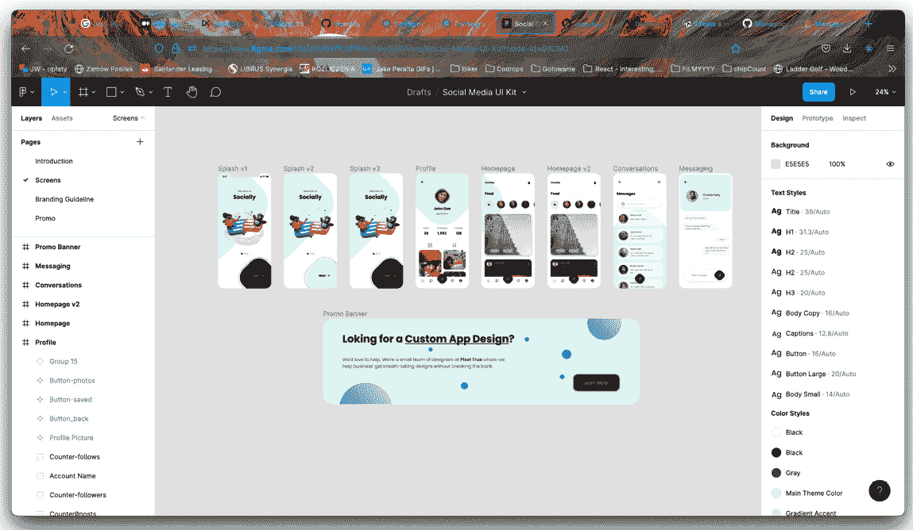
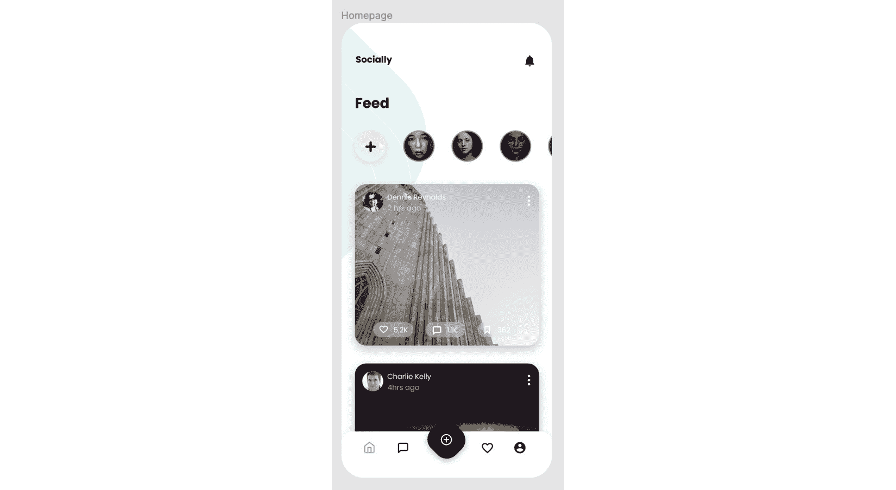
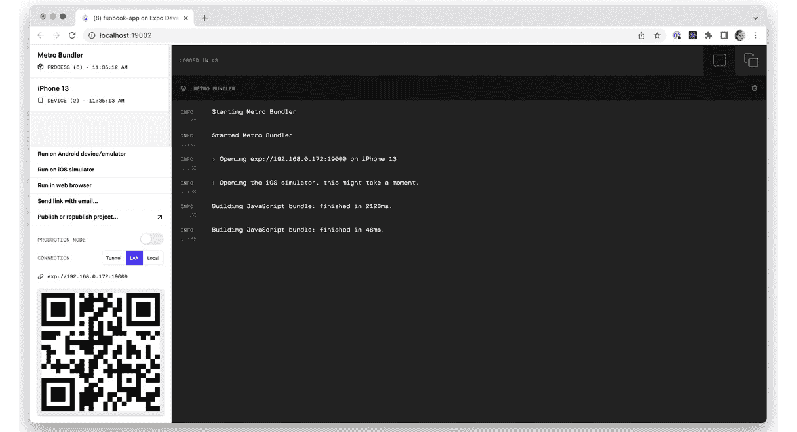
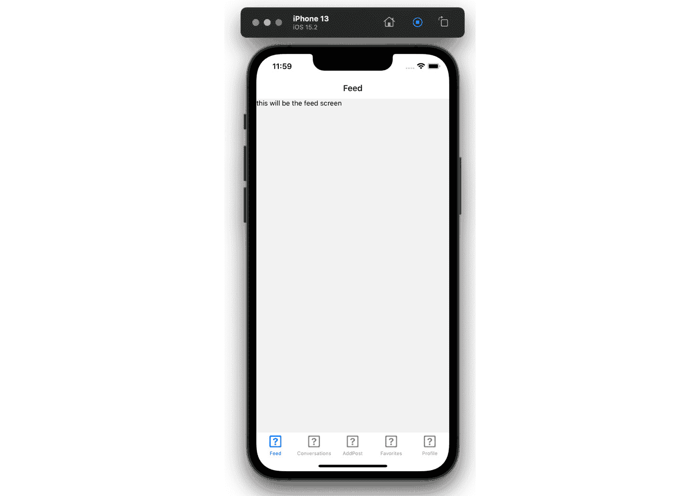
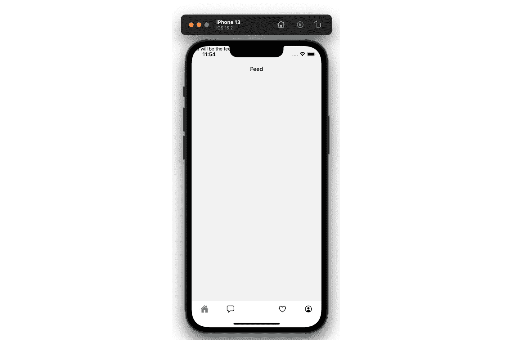
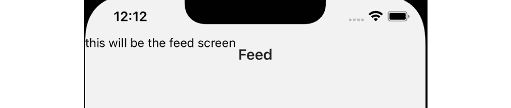
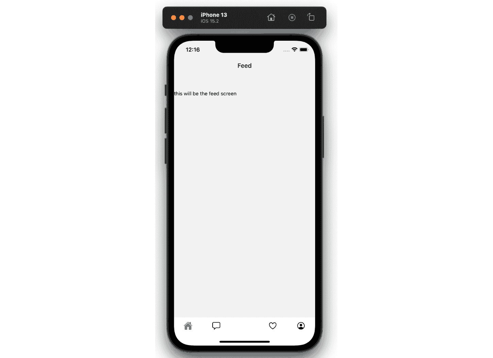
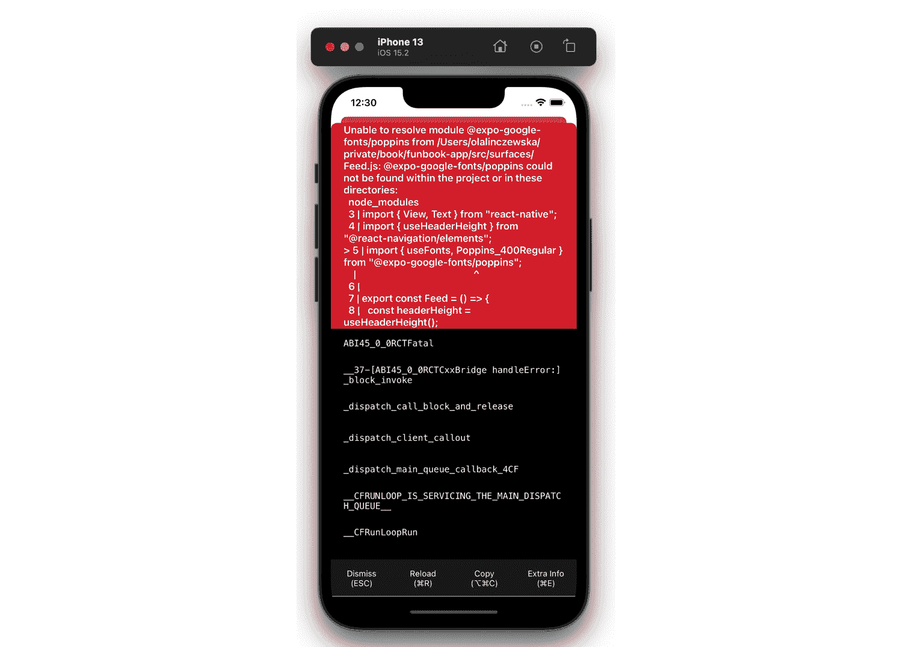
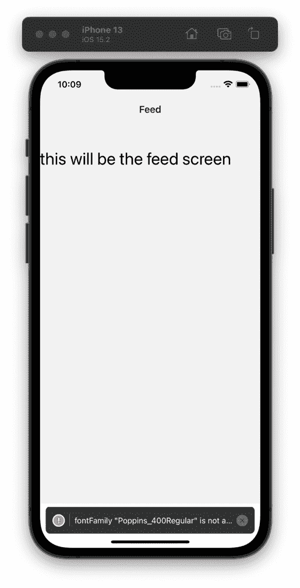
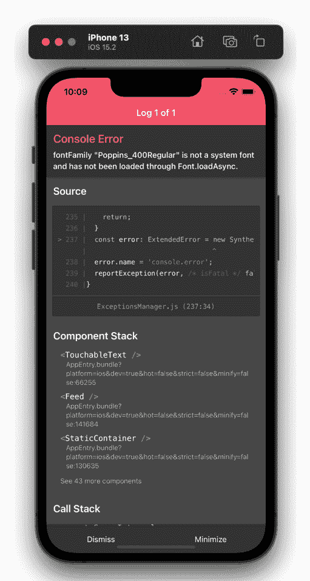

# 第三章：规划和设置 Funbook 应用

在上一章中，我们学习了如何设置 React Native 应用。我们遵循的步骤，安装依赖项、构建和运行应用，对于您可能想要构建的大多数应用都是通用的。现在，是时候关注我们将在这本书中构建的应用的具体细节了。我们想要创建一个社交媒体克隆应用，以便我们可以比较该应用中不同的状态管理解决方案。在本章中，我们将仅使用 React Native 内置解决方案（状态、属性、钩子和上下文）规划和构建我们的示例应用。我们将采取以下步骤：

+   规划所需界面和组件

+   在应用中规划数据流

+   舒适地预览和调试应用

到本章结束时，您将很好地了解如何规划 Funbook 应用的开发工作。您还将了解到如何舒适地与 React Native 应用一起工作。

# 技术要求

为了跟随本章内容，您需要具备一些 JavaScript 和 ReactJS 的知识。如果您已经跟随了本书的前两章，您应该能够无任何问题地继续前进。

您可以自由选择您喜欢的 IDE，因为 React Native 不需要任何特定功能。目前，前端开发者中最受欢迎的 IDE 是微软的 VSCode、Atom、Sublime Text 和 WebStorm。

您可能已经遵循了上一章中的设置指南。如果您没有设置自己的应用，您可以从以下地址克隆为本书专设的存储库：

https://github.com/PacktPublishing/Simplifying-State-Management-in-React-Native.

在这个存储库中，您将找到一个非常基础的应用，正如它在上一章中设置的那样。您还将找到以章节名称命名的文件夹。不出所料，每个文件夹都包含一个描述在给定章节中所述的 Funbook 应用的版本。

# 规划所需界面和组件

正如我之前提到的，我们可以将我们的应用分为界面，然后将界面分解成更小、可重用的组件。我们的应用将需要以下界面：

+   **登录**

+   **动态**（这同样是我们的**主页**界面）

+   **添加帖子**

+   **收藏**

+   **个人资料**

我们将这些界面作为项目中的文件设置。让我们快速查看我们将为应用使用的免费设计文件。您可以在以下位置找到文件：[`www.pixeltrue.com/free-ui-kits/social-media-app`](https://www.pixeltrue.com/free-ui-kits/social-media-app)。

您可以下载此文件并在 Figma 中打开它，或者将其导入到[`www.figma.com`](https://www.figma.com)。如果您还没有 Figma 账户，请不要担心，它们是免费的。您现在可以花点时间查看实际文件，或者如果您对截图就足够了，我们就一起看看：



图 3.1 – Figma 网站上的设计模板

让我们放大查看主页：



图 3.2 – 主页表面的设计

你可能已经注意到设计底部标签栏中有五个项目。我们遗漏了哪一个？聊天气泡。让我们继续将这个表面添加到我们的应用中。我鼓励你亲自添加这个文件，然后回到这里对照我的例子进行检查。以下是我的`Conversations`表面目前的样子：

```js
import React from "react";
import { View, Text } from "react-native";
export const Conversations = () => {
  return (
    <View>
      <Text>this will be the chat screen</Text>
    </View>
  );
};
```

下面是带有新添加屏幕的`App.js`文件：

```js
import "react-native-gesture-handler";
import React, { useState } from "react";
import { NavigationContainer } from "@react-navigation/native";
import { createStackNavigator } from "@react-navigation/stack";
import { createBottomTabNavigator } from "@react-navigation/  bottom-tabs";
import { Login } from "./src/surfaces/Login";
import { Feed } from "./src/surfaces/Feed";
import { Profile } from "./src/surfaces/Profile";
import { Favorites } from "./src/surfaces/Favorites";
import { AddPost } from "./src/surfaces/AddPost";
import { Conversations } from "./src/surfaces/Conversations";
const Stack = createStackNavigator();
const Tab = createBottomTabNavigator();
function Home() {
  return (
    <Tab.Navigator>
      <Tab.Screen name='Feed' component={Feed} />
        <Tab.Screen name='Conversations'          component={Conversations} />
      <Tab.Screen name='AddPost' component={AddPost} />
      <Tab.Screen name='Favorites' component={Favorites} />
      <Tab.Screen name='Profile' component={Profile} />
    </Tab.Navigator>
  );
}
[…]
```

好的！到目前为止看起来不错！

现在我们已经设置了主要表面，让我们尝试分析哪些元素是可重复使用的组件的良好候选者。

回顾设计文件，让我们从**主页**表面开始。在顶部，我们看到一个横向的头像列表和下面的重复卡片列表。每个卡片都有一个作者图像、标题、收藏数量和对话数量。因此，主页组件应该由头像和卡片组件构建。

接下来是**对话**屏幕：它由一个搜索栏和一张显示对话中人的名字和最后一条交换的消息的卡片列表组成。当点击消息时，我们将进入 Figma 文件中名为**消息**的屏幕，在那里我们将看到一个更大的头像、一条消息列表和一个输入框。记住我们已经在主页上有头像了；让我们看看我们是否可以重用头像组件。也许只能在一定程度上，因为主页头像、对话头像和消息头像的样式并不相同。它们都是圆形图像，但它们的边框和大小不同。也许我们可以创建一个接受大小和边框样式作为属性的头像组件。这是一个相当不错的想法！当我们开始编写代码时，我们将尝试实现这一点。

在我们的免费设计文件中，我们将要详细设计的最后一个表面是**个人资料**。这里还有一个头像；这个头像甚至不是圆形的。它后面跟着用户名、一些统计数据和一个两列的图片和书签列表。由于我们不会实现书签功能，我们将用收藏夹替换设计中的书签。你可能注意到两列是用两种不同样式的元素构建的，我们可能也应该这样创建我们的组件：一个用于图片列的卡片组件，一个用于**收藏夹**卡片列的组件。

最后但同样重要的是：底部的标签栏。我们的设计文件包括四个常规图标和一个不同风格的图标。对 React Navigation 组件进行样式化是一个完全不同的任务，因为我们需要阅读文档来找出如何实现自定义图标、激活和未激活样式，以及自定义样式。

由于我们使用的是免费的设计文件，它并没有涵盖我们想要创建的所有表面。我很高兴我们手头有这个免费资源，我们将尝试使用通用样式和组件来确定剩余的两个表面应该是什么样子。

**登录**表面当然应该包括两个输入：用户名和密码。我们将重用 Figma 上**消息**屏幕上的可见输入和启动屏幕的背景。至于添加帖子的表面所需的表面，我们将有一个与**主页**表面匹配的圆形方形图像，以及帖子标题的输入。

让我们总结一下我们的计划：我们已经创建了所有表面。接下来，我们将创建为表面所需的组件。我们将创建一个头像组件，用于**主页**、**对话**和**消息**表面。我们将为**主页**表面创建一个卡片组件。然后，我们将为**对话**表面创建另一个卡片组件，以及一个搜索框组件。我们需要将导航连接起来，以便正确地从**对话**切换到**消息**。在**消息**表面上，我们将重用头像组件、用于显示消息的组件以及一个可重用的输入组件。接下来，我们将转到**个人资料**屏幕，创建个人资料头像组件、个人资料统计数据组件以及图像卡片组件和收藏物品卡片组件的不同组件。然后，我们将使用之前为消息屏幕创建的输入框组件来组合**登录**屏幕。最后，我们将完成**添加帖子**表面，使用**主页**表面卡片和输入的版本。我不建议事先创建所有文件，因为在创建实际组件的过程中，很多东西可能会发生变化。

在开始编写组件之前，让我们尝试分析我们的应用需要哪些数据。

# 在应用中规划数据流

这通常是前端开发者职责之外的应用开发部分。客户通常会确定他们想要的数据，这些数据由后端开发者组织。然而，如果您能参与数据流组织的规划，您将使您未来的工作更加容易。鉴于我们只使用示例数据构建应用的前端，我们可以自由地组织它。

我们将再次使用设计文件，作为确定需要完成的工作的基础。从**主页**屏幕开始，我们知道我们需要一个用户列表和一个要在**主页**表面上显示的项目列表。至于**对话**表面，我们需要一个包含相应用户名和消息的对话列表。我们还需要每个对话的数据，以便我们可以在**消息**表面上显示它。在**个人资料**表面上，我们需要与用户相关的数据列表（姓名、头像图像、统计数据），以及两个图像列表：添加的图像和喜欢的图像。至于设计中缺失的表面，我们需要**登录**屏幕的登录名和密码。对于**添加帖子**表面，我们不需要任何示例数据。

使用真实数据工作可以更容易地可视化应用和特定组件的未来形态。这就是为什么我设置了书籍仓库的 GitHub 页面来保存我们的示例数据。您可以在 GitHub Pages（https://packtpublishing.github.io/Simplifying-State-Management-in-React-Native/）或主书库的`docs/`文件夹中找到它们：[`github.com/PacktPublishing/Simplifying-State-Management-in-React-Native/tree/main/docs`](https://github.com/PacktPublishing/Simplifying-State-Management-in-React-Native/tree/main/docs)。

浏览示例数据

您可以在任何时候查看应用中使用的示例数据。请查看主仓库的数据分支：[`github.com/PacktPublishing/Simplifying-State-Management-in-React-Native/blob/data/docs/index.md`](https://github.com/PacktPublishing/Simplifying-State-Management-in-React-Native/blob/data/docs/index.md)，并在`docs/`文件夹中查找。您可以复制任何您想要的内容到您自己的项目中。

我们需要的数据拼图中最大、最明显的一部分是用户列表。您可以在 GitHub 上查看该文件：[`github.com/PacktPublishing/Simplifying-State-Management-in-React-Native/blob/main/docs/users.json`](https://github.com/PacktPublishing/Simplifying-State-Management-in-React-Native/blob/main/docs/users.json)。我们的应用将消费原始 JSON 文件，可以通过以下链接访问：[`raw.githubusercontent.com/PacktPublishing/Simplifying-State-Management-in-React-Native/main/docs/users.json`](https://raw.githubusercontent.com/PacktPublishing/Simplifying-State-Management-in-React-Native/main/docs/users.json)。

您可能会想知道，如果我们正在构建一个使用示例数据的简单应用，为什么还要添加用户 ID。原因是我们将使用用户数据作为`key`属性上的头像列表。从理论上讲，我们可以使用图片 URL 作为我们的唯一键，然后尝试记住不要为多个人使用相同的图片。然而，使用 ID 是一个更干净、更接近真实世界应用的做法。

现在我们有了用户列表，让我们看看一个特定用户配置文件可能是什么样子。我们的用户需要一个 ID，这个 ID 应该与`users.json`文件中他们名字的记录相匹配。他们还有一个名字和头像图片 URL。我们需要知道给定用户有多少帖子、关注者和被关注者。最后，我们需要两个图片列表：添加的和喜欢的图片。看看`john_doe.json`文件——这就是我们的示例用户配置数据的样子。

接下来，我们转到`users.json`文件，以显示头像列表，因此我们在这里不需要添加任何额外的头像列表数据。接下来将是一个以卡片形式显示的物品列表，其中包含图片。示例数据可以在`home.json`文件中找到。

让我们为对话创建一个示例数据集。它并不复杂；它包括用户名、用户头像 URL、消息和 ID。我们需要对话 ID 来正确地在**消息**界面显示对话详情。

最后，我们应该为`messages`创建示例数据。在这个文件夹中，我们将为对话创建几个文件。每个文件都按对话 ID 命名，这将使数据检索更容易、更易读。

至于**登录**界面，我们将使用一个非常小的 JSON 文件，其中将包含用户名和密码。当**登录**表单正确或错误地填写时，我们将使用这些数据来创建用户流程。

查看 JSON 文件，你会注意到一些数据在几个文件中重复；具体来说，是用户 ID、用户名和头像图像 URL。在现实世界的应用程序中，这可能会在未来引起问题，即更新应用程序中的数据将不会正确更新或在其他地方可用。这就是为什么我们将删除对用户名和头像图像的所有引用，只留下用户 ID，我们将使用它从`users.json`文件中获取其他数据。

就这样！我们有一个大型的用户列表，我们将在应用程序的不同部分使用，包括**主页**界面的数据、**个人资料**界面和**对话**。我们准备好创建我们的组件了！对吧？对！然而，我们首先需要熟悉预览和调试我们的应用程序。

# 熟悉预览和调试应用程序

你是否在查看你的代码是否在设备或模拟器上正确运行？如果不是，让我们看看你如何查看它。你需要做的第一件事是在你的终端中运行这个命令：

```js
$ yarn start
```

当`expo`完成设置你的开发服务器后，你可以按“*i*”为 iPhone 模拟器（如果你在 Mac 电脑上工作），按“*a*”为 Android 模拟器（如果你已安装 Android Studio），或者你可以拿起你的手机并使用 Expo Go 应用程序。

无论你选择哪个，你都会在你的设备上自动打开一个浏览器窗口。这个浏览器窗口看起来是这样的：



图 3.3 – 浏览器中的 Expo 开发者工具

如果你想在手机上查看你的应用程序，你将在这里找到 Expo Go 应用程序中的扫描二维码。你将在这里看到错误消息；你甚至可以使用这个页面来发布你的应用程序。

我喜欢在 iPhone 模拟器打开的情况下工作。这是我电脑上设置的应用程序的外观：



图 3.4 – iPhone 13 与 iOS 15.2 模拟器截图

希望你能看到类似的东西。如果你没有，你总是可以克隆 GitHub 仓库，或者比较你的代码与已发布的代码。你前面截图中所看到的 app 状态应该是位于此处仓库的`main`分支上应看到的状态：[`github.com/PacktPublishing/Simplifying-State-Management-in-React-Native`](https://github.com/PacktPublishing/Simplifying-State-Management-in-React-Native)。

花些时间在应用上玩玩。尝试创建一些明显的错误，比如在`<Text />`组件外写入纯文本，可能使用`<div>`标签，或者没有关闭标签。

我们将在底部标签导航上进行代码更改练习。我们不会为那个创建任何组件。

通过在设置导航器时设置属性，可以自定义标签导航的外观。我们还可以添加一些特定的屏幕选项。我们的底部标签导航将使用图标作为标签，因此我们需要首先将图标库导入到主`App.js`文件中。我们将使用名为`@expo/vector-icons`的库。这个库默认安装在所有使用`expo`初始化的项目中。

添加库

在添加任何额外的依赖和库之前，请确保检查 Expo 文档，看看你想要的库是否已经安装。如果你确实需要添加某些内容，请确保添加与 Expo 工作流程兼容的库。

Expo 已经为我们做了所有繁重的工作；我们手头有一个庞大的图标库。我们所需做的就是使用它来为我们的导航器添加图标。我们将从为五个项目中的四个添加简单图标开始：

```js
import Ionicons from "@expo/vector-icons/Ionicons";
// …
function Home() {
  return (
    <Tab.Navigator
      screenOptions={({ route }) => ({
        tabBarIcon: ({ focused, color, size }) => {
          let iconName;
          if (route.name === "Feed") {
            iconName = focused ? "md-home" : "md-home-outline";
          } else if (route.name === "Conversations") {
            iconName = focused ? "chatbox" : "chatbox-outline";
          } else if (route.name === "Favorites") {
            iconName = focused ? "heart" : "heart-outline";
          } else if (route.name === "Profile") {
              iconName = focused ? "person-circle" :                "person-circle-outline";
          }
          return <Ionicons name={iconName} size={size} color={color} />;
        },
        tabBarActiveTintColor: "#25A0B0",
        tabBarInactiveTintColor: "#000000",
      })}
    >
      <Tab.Screen name='Feed' component={Feed} />
        <Tab.Screen name='Conversations'          component={Conversations} />
      <Tab.Screen name='AddPost' component={AddPost} />
      <Tab.Screen name='Favorites' component={Favorites} />
      <Tab.Screen name='Profile' component={Profile} />
    </Tab.Navigator>
  );
}
```

我们在`<Tab.Navigator>`中添加了一个简单的`if`语句，其中我们给出了关于应该显示哪个组件的特定指令。然而，每次我们显示来自`@expo/vector-icons`库的`<Ionicons>`组件时，我们都在给它提供不同的属性。现在我们将保留`AddPost`项。一旦我们创建了一个可重用的按钮组件，我们就会回到这里并添加它。

我们现在可以进一步自定义的是`tabBar`标签。根据设计，标签不应显示。我们需要向`<Tab.Navigator>`添加另一个属性：

```js
// …
tabBarInactiveTintColor: "#000000",
tabBarShowLabel: false,
// …
```

看起来不错！现在，关于头部呢？我们的应用有一个非常通用的头部，背景为白色，标题为给定表面的标题。正如你在设计中所看到的，一些表面没有标题（例如`<Tab.Navigator>`）：

```js
// …
tabBarInactiveTintColor: "#000000",
tabBarShowLabel: false,
headerTransparent: true,
// …
```

哈哈！这成功了——但是等等，屏幕上显示的文本现在在固定的透明头部后面！



图 3.5 – iPhone 模拟器显示 UI 问题

我们需要确保我们应用的内容永远不会像这样飞离屏幕。这是一个不容易完成的任务，尤其是在有这么多屏幕形状、凹口和数字按钮的情况下。幸运的是，React Navigation 的制作者添加了一个名为 `<SafeAreaView>` 的包装组件。我们必须在 `<NavigationContainer>` 周围添加 `SafeAreaProvider` 组件。该组件在“幕后”使用 React Context。为了使用此上下文，我们需要在每个表面周围添加 `<SafeAreaView>`。主应用组件将看起来是这样的：

```js
export default function App() {
  const [userLoggedIn, setIsUserLoggedIn] = useState(true);
  return (
    <SafeAreaProvider>
      <NavigationContainer>
        <Stack.Navigator>
         // …
        </Stack.Navigator>
      </NavigationContainer>
    </SafeAreaProvider>
  );
}
```

让我们在 `<Feed>` 组件周围添加 `<SafeAreaView>`。您看到有任何改进吗？没有？那是因为还有一个需要注意的地方：我们需要在包装组件中添加 `{{flex: 1}}` 样式。好吧，表面看起来更好了——文本被包含在屏幕上——但它仍然在标题后面…



图 3.6 – iPhone 模拟器 UI 变更的特写

我们希望给表面的顶部添加填充，这样我们的内容就会在标题下方开始。我们希望确定标题的高度，而无需硬编码任何像素值。使用 `useHeaderHeight()`。现在的 `Feed` 组件看起来是这样的：

```js
import React from "react";
import { SafeAreaView } from "react-native-safe-area-context";
import { View, Text } from "react-native";
import { useHeaderHeight } from "@react-navigation/elements";
export const Feed = () => {
  const headerHeight = useHeaderHeight();
  return (
      <SafeAreaView style={{ flex: 1, paddingTop: headerHeight         }}>
      <View>
        <Text>this will be the feed screen</Text>
      </View>
    </SafeAreaView>
  );
};
```

应用应该看起来像这样：



图 3.7 – 固定 UI 的 iPhone 模拟器

确保在跟随本书学习时，将 `<SafeAreaView>` 添加到所有表面。如果您更喜欢在 GitHub 上查看代码更改，您可以在名为 `chapter-3` 的分支上找到它们：[`github.com/PacktPublishing/Simplifying-State-Management-in-React-Native/tree/main/chapter-3`](https://github.com/PacktPublishing/Simplifying-State-Management-in-React-Native/tree/main/chapter-3).

如果您想知道为什么我们要在 `<Tab.Navigator>` 中添加标题样式而不是根组件，我邀请您查看我们应用根部的 `<Stack.Navigator>`，为 `<Stack.Screen>` 组件做准备，您会注意到以下选项：

```js
options={{ headerShown: false }}
```

我们正在告诉 React Navigation 隐藏 `<Stack.Navigator>` 的标题并显示嵌套的 `<Tab.Navigator>` 的标题。这个嵌套的 `<Tab.Navigator>` 也是我们需要样式的。继续更改您项目中的 `headerShown` 选项并观察会发生什么。您应该在应用中看到另一个带有“主页”标题的标题！那是因为我们将 `Home` 命名为主要父组件，用于创建 `<Tab.Navigator>`。确保在回到我们的应用工作之前，将 `headerShown` 选项改回 `false`。

我希望你在应用中修改和预览更改方面感到越来越舒适。让我们通过添加自定义字体来完成本节。我们再次使用 Expo 提供的库：Expo Google Fonts。如果你快速查看设计文件，你会找到所使用的字体名称，它是一个名为 Poppins 的 Google 字体。

我们将把字体导入到`Feed`组件中，将其作为`style`属性添加到`<Text>`组件中，然后……哦不！问题！



图 3.8 – iPhone 模拟器显示错误

尽管这个巨大的红色框似乎在向我们尖叫，但无需担心。我们只需要阅读错误信息。它指出`@expo-google-fonts/poppins`未定义。当然！我们需要在我们的项目中安装这个字体。让我们在终端中运行以下命令：

```js
$ expo install expo-font
$ expo install @expo-google-fonts/poppins
```

错误应该已经消失了。现在，我们可以安全地将我们的字体家族添加到`<Text>`组件中。或者我们可以吗？



图 3.9 – iPhone 模拟器显示错误提示消息和详细信息

字体尚未加载……让我们回到 Expo 文档中，确保我们正确地加载了所有内容。

根据文档说明，我们首先需要在根组件周围使用带有`AppLoading`包装器的`useFont`钩子！以下是我们需要添加到`App.js`文件中的内容：

```js
export default function App() {
  const [userLoggedIn, setIsUserLoggedIn] = useState(true);
  let [fontsLoaded] = useFonts({
    Poppins_400Regular,
  });
  if (!fontsLoaded) {
    return <AppLoading />;
  }
  return (
// …
```

现在我们就完成了。现在，应用可以正确运行，我们可以在任何我们想要的地方添加`fontFamily`样式：

```js
<Text style={{ fontFamily: "Poppins_400Regular"}}>
```

在本节中，我们熟悉了修改代码、预览我们的应用和处理错误。现在，我们准备好在下一章中编写和样式化组件。

# 摘要

在本章中，我们规划了我们的应用并熟悉了预览和调试它。这两个步骤对于创建良好的开发者体验至关重要。首先，我们不希望遇到任何重大惊喜——这就是为什么我们要提前规划。你可以将这比作建筑物的建造过程。没有自尊的施工工人会在制作或至少查看蓝图之前开始搭建墙壁和门。我们作为软件开发者，正在构建一个数字产品而不是建筑物，但我们使用“构建”这个词是非常有原因的。

其次，我们需要了解如何检查我们所写的代码是否真的在起作用。你的代码可能在你看来逻辑清晰，但这并不意味着在 JavaScript 尝试理解你的逻辑后它仍然会工作。这就是为什么每个网页开发者都会在工作的同时打开浏览器窗口，以及为什么移动应用开发者需要查看手机或手机模拟器。由于我们将花费相当多的时间在手机上查看我们的应用，所以让自己感到舒适是很重要的。

现在，亲爱的读者，我们准备好继续深入 React Native 的细节之旅了！在下一章中，我们将构建我们上面计划中的组件。我们还将添加样式以匹配我们的美丽设计。我们将遇到一些 React Native 的经典问题以及一些怪癖——最终我们将拥有一个看起来很棒的 App！

# 进一步阅读

+   [`docs.expo.dev/guides/icons/`](https://docs.expo.dev/guides/icons/) – Expo 图标指南.

+   [`reactjs.org/docs/context.html`](https://reactjs.org/docs/context.html) – React 上下文。

+   [`github.com/expo/google-fonts`](https://github.com/expo/google-fonts) – Expo Google Fonts.
