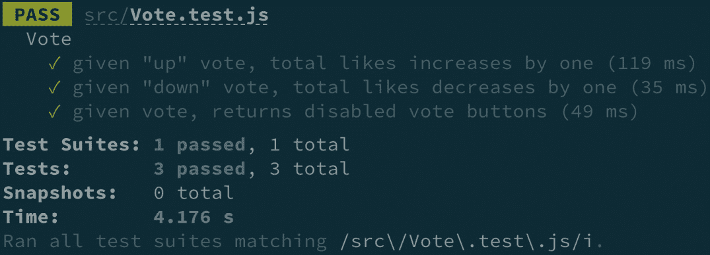
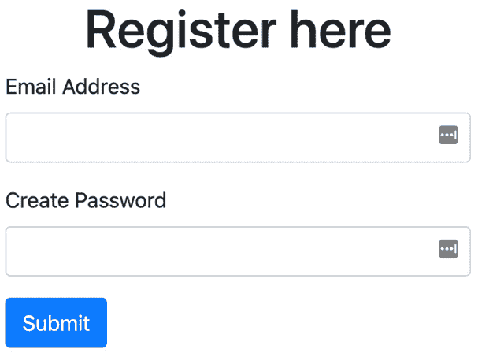
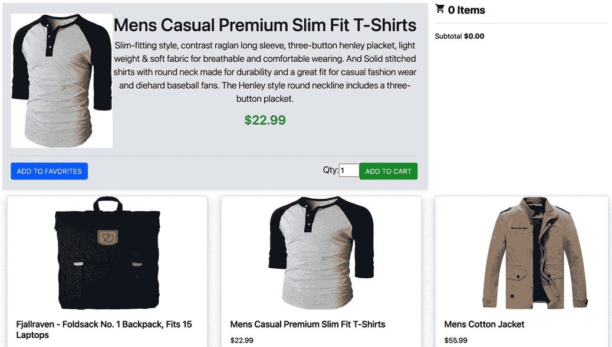
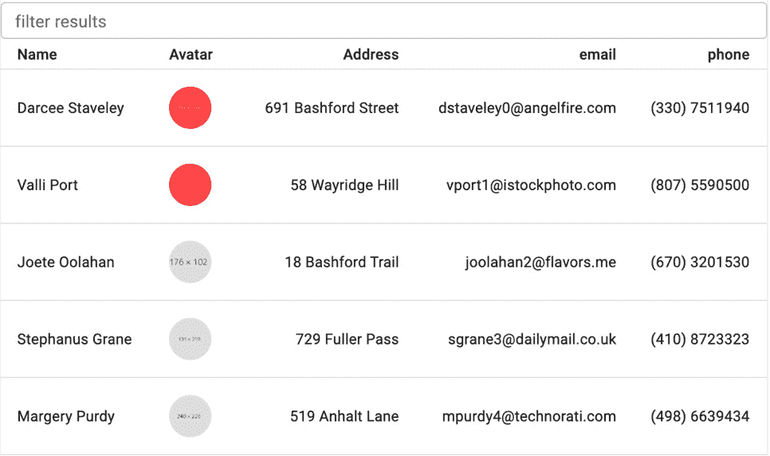
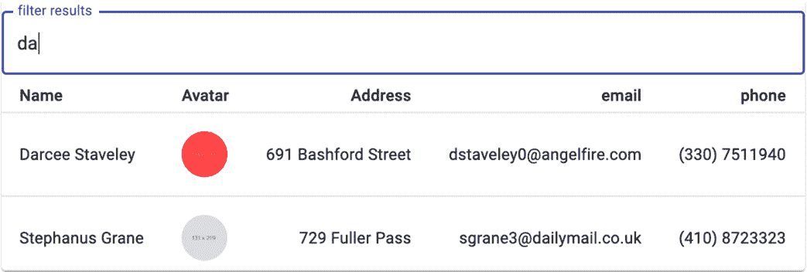
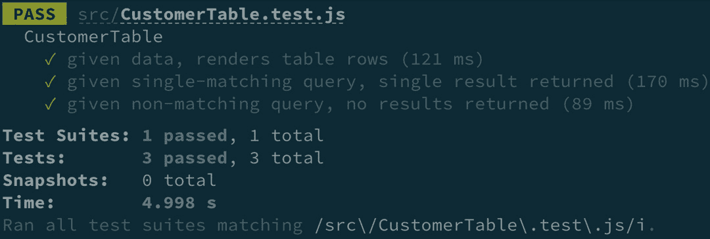

# 第四章：在您的应用程序中使用集成测试和第三方库

在前面的章节中，我们学习了如何测试与依赖项隔离的组件，以及如何测试管理状态的组件。在许多应用程序中，团队可以通过引入第三方工具来管理状态和构建组件来提高速度。到本章结束时，你将了解使用集成测试方法的好处。你将了解如何配置测试，以使用高级状态管理工具对组件进行断言。你将学习如何测试应用程序中渲染的错误。你将测试与 API 服务器交互的组件，这些服务器以与传统 **表示状态传输**（**REST**）API 不同的方式结构化数据，允许你描述并接收前端应用程序所需的具体数据。最后，你将学习如何测试使用流行的 React 组件库的组件。

在本章中，我们将涵盖以下主要主题：

+   通过集成测试获得价值

+   测试使用 Context API 的组件

+   测试使用 Redux 的组件

+   测试使用 GraphQL 的组件

+   测试使用 Material-UI 构建的组件

本章中获得的知识将加深我们对在各种场景下测试 React 组件的理解。

# 技术要求

对于本章的示例，您需要在您的机器上安装 Node.js。我们将使用 `create-react-app` CLI 工具来展示所有代码示例。如果需要，请在开始本章之前熟悉该工具。此外，您还需要对 Redux 和 React Context API 有基本的了解。本章将提供代码片段以帮助您理解要测试的代码，但目标是理解如何测试代码。您可以在以下位置找到本章的代码示例：[`github.com/PacktPublishing/Simplify-Testing-with-React-Testing-Library/tree/master/Chapter04`](https://github.com/PacktPublishing/Simplify-Testing-with-React-Testing-Library/tree/master/Chapter04)。

# 测试集成组件

在上一章中，我们学习了如何测试与依赖项（包括其他组件）隔离的组件。隔离测试有其优点，但也有缺点，因为真实依赖项被测试替身所取代。在本节中，我们将学习如何测试与其他组件集成的组件。在许多场景中，集成测试可以比隔离测试带来更多的价值，因为我们可以在更接近其生产使用的方式下测试代码。我们还可以更快地为组件添加测试覆盖率，因为一个测试可以同时覆盖多个组件。在本节中，我们将通过几个示例使用集成测试。

## 使用投票组件进行集成测试

在上一章中，我们测试了`Vote`组件，允许用户点击按钮来增加或减少总点赞数。在本节中，我们将将实现拆分为单独的组件，并编写集成测试。该组件包含两个`button`元素：

```js
<button
        onClick={handleLikeVote}
        disabled={hasVoted}
        style={clickedLike ? { background: 'green' } : null}
      >
        
      </button>
      <div>{totalLikes}</div>
      <button
        onClick={handleDislikeVote}
        disabled={hasVoted}
        style={clickedDislike ? { background: 'red' } : null}
      >
        
      </button>
```

在之前的代码中，两个按钮元素的属性非常相似，可以提取到它们自己的组件文件中，以便在其他应用部分重复使用：

```js
const VoteBtn = props => {
  return (
    <button onClick={props.handleVote} disabled={props.       hasVoted}>
      
    </button>
  )
}
```

在之前的代码中，我们创建了一个`VoteBtn`组件，它可以在整个应用中任何地方重复使用。`VoteBtn`可以在`Vote`组件中使用，以替换硬编码的`button`元素：

```js
return (
    <div className="h1">
      <h5>Note: You are not allowed to change your vote once          selected!</h5>
      <VoteBtn
        handleVote={handleVoteLike}
        hasVoted={hasVoted}
        imgSrc={thumbsUp}
        altText="thumbs up"
      />
      <div>{totalLikes}</div>
      <VoteBtn
        handleVote={handleVoteDislike}
        hasVoted={hasVoted}
        imgSrc={thumbsDown}
        altText="thumbs down"
      />
    </div>
  )
```

在之前的代码中，两个`VoteBtn`实例被集成到`Vote`组件中。我们可以从`Vote`组件中单独测试`VoteBtn`，但通过一起测试这两个组件的集成，我们可以获得更多的价值。对于第一个测试，我们可以验证一个`"up"`投票会增加总点赞数一个：

```js
  test('given "up" vote, total likes increases by one', () => {
    render(<Vote totalGlobalLikes={10} />)
    user.click(screen.getByRole('button', { name: /thumbs up/i    }))
    expect(screen.getByText(/11/i)).toBeInTheDocument()
  })
```

在之前的代码中，首先，我们将`Vote`组件渲染到 DOM 中，并将`10`这个值传递给`totalGlobalLikes`属性。接下来，我们点击 DOM 中的`11`。对于下一个测试，我们将验证一个`"down"`投票会减少总点赞数一个：

```js
  test('given "down" vote, total likes decreases by one', () => {
    render(<Vote totalGlobalLikes={10} />)
    user.click(screen.getByRole('button', { name: /thumbs        down/i }))
    expect(screen.getByText(/9/i)).toBeInTheDocument()
  })
```

在之前的例子中，代码与第一个例子相似。唯一的区别是，我们没有点击 DOM 中的`9`。最后一个我们将要编写的测试将验证用户只能投票一次：

```js
  test('given vote, returns disabled vote buttons', () => {
    render(<Vote totalGlobalLikes={10} />)
    const thumbsUpBtn = screen.getByRole('button', { name: /       thumbs up/i })
    const thumbsDownBtn = screen.getByRole('button', { name: /       thumbs down/i })
    user.click(thumbsUpBtn)
    user.click(thumbsUpBtn)
    user.click(thumbsDownBtn)
    user.click(thumbsDownBtn)
    expect(screen.getByText(/11/i)).toBeInTheDocument()
  })
```

在之前的代码中，首先，我们将`Vote`组件渲染到 DOM 中，并将`10`这个值传递给`totalGlobalLikes`属性。接下来，我们在 DOM 中抓取了`11`。这个数字`11`是预期的，因为首先点击了**点赞**按钮，这会禁用其他按钮。通过使用集成测试方法，我们能够在同一个测试中验证屏幕上显示的总点赞数以及模拟点击事件后的按钮状态。

当我们运行所有的`Vote`组件测试时，我们得到以下输出：



图 4.1 – Vote 组件测试结果

上述截图显示了`Vote.test.js`测试文件。

现在你已经理解了与依赖项集成测试组件的优势。然而，在某些情况下，使用集成方法可能不是最佳策略。在下一节中，我们将探讨一个场景，其中单独测试组件比集成测试更有价值。

## 规划更适合单独测试的测试场景

在前面的章节中，我们学习了测试与依赖项集成组件的优势。然而，有些情况下使用隔离测试方法更为合适。在*第三章*的*实现测试驱动开发*部分，[*《使用 React 测试库测试复杂组件》*]中，我们构建了一个注册表单。作为参考，组件的输出如下：



图 4.2 – 注册表单

在前面的屏幕截图中，我们看到注册组件允许用户提交电子邮件地址和密码。测试使用了隔离方法，并验证了在表单提交时调用 `handleRegister` 方法的快乐路径。假设添加了一个新功能，其中成功消息从服务器发送到前端，并在注册成功时替换屏幕上的表单：


图 4.3 – 注册成功

在前面的屏幕截图中，在成功提交表单后，显示消息**注册成功！**验证表单提交后屏幕上显示的消息可以使用集成方法进行测试，但可能是一个运行缓慢的测试。我们可以通过创建模拟服务器响应来创建一个运行速度更快的隔离测试。那么，当表单验证错误显示并阻止用户提交表单时会发生什么情况？例如，当用户输入无效的电子邮件或尝试提交空白字段时，会显示表单验证错误。密码字段也可能呈现几个测试场景，例如当密码长度不足或密码中不包含特殊字符时显示错误。

上述场景都是隔离测试方法的良好用例。屏幕上显示的错误不依赖于组件外的任何代码。我们可以在表单中测试各种组合和边缘情况，这些情况将运行得非常快，并迅速增加大量价值。一般来说，考虑在集成方法设置测试会显得繁琐或集成方法产生运行缓慢的测试时创建隔离测试。同时，记住在创建隔离测试时需要模拟多少依赖项。模拟多个依赖项提供的价值不如包含依赖项的测试。

现在你已经知道了如何测试与依赖项集成的组件。你理解了集成测试与单独测试相比的优势。你还知道在某些情况下，使用隔离方法测试组件可能比仅使用集成方法为你的测试计划带来更好的结果。是否单独测试组件或与依赖项集成将取决于你的测试计划。在下一节中，我们将探讨更多使用隔离和集成测试方法的示例，并学习如何测试使用 Context API 进行状态管理的组件。

# 测试使用 Context API 的组件

在本节中，我们将学习如何测试使用 React 库的`Context Provider`组件的组件：

```js
import { LikesProvider } from './LikesContext'
import Vote from './Vote'
const App = () => (
  <LikesProvider initialLikes={10}>
    <Vote />
  </LikesProvider>
)
```

在上述代码中，负责向 Context 消费者提供 Context 状态的`LikesProvider`组件以`Vote`作为子组件进行渲染。`LikesProvider`为所有消费组件提供了一个`initialLikes`计数为`10`。由于`Vote`在`LikesProvider`内部渲染，它可以查看和更新`LikesProvider`提供的状态。为了测试`Context` `Provider`组件的消费者，我们需要一种方法在测试中访问`Context Provider`。我们将使用零售应用程序来演示如何实现这些要求。

## 测试使用 Context 的`Retail`组件

在本节中，我们将测试一个`Retail`组件，该组件使用由`RetailContext`组件提供的状态。`Retail`组件的 UI 如下所示：


图 4.4 – `Retail`组件 UI

上述截图显示了`Retail`组件的初始屏幕输出。显示了一列服装产品和购物车。还有一个带有文本**Retail Store**的板块，点击后会显示产品详情：



图 4.5 – 产品详情

上述截图显示了用户点击后的**男士休闲高级修身 T 恤**的详情。用户可以点击**添加到收藏**按钮来**收藏**该商品：


图 4.6 – 收藏的产品详情

上述截图显示，一旦点击按钮，文本**添加到收藏**会变为**已添加到收藏**。最后，用户可以输入数量并点击**添加到购物车**按钮将产品添加到购物车中：


图 4.7 – 已添加到购物车的产品

上述截图显示了购物车中添加了**3**件**男士休闲高级修身 T 恤**。购物车显示了**1 Items**，代表购物车中的总商品数。购物车还显示了所有添加到购物车的商品的**小计**。

在代码实现中，`Retail`组件作为`App`内部的`RetailProvider`的子组件进行渲染：

```js
 import retailProducts from './api/retailProducts'
import Retail from './Retail'
import { RetailProvider } from './RetailContext'
const App = () => (
  <RetailProvider products={retailProducts}>
    <Retail />
  </RetailProvider>
)
```

在前面的代码中，`RetailProvider` 通过 `retailProducts` 接收产品数组。`retailProducts` 数据是来自 `Fake Store API` ([`fakestoreapi.com`](https://fakestoreapi.com)) API 的本地数据子集，这是一个免费的开放源代码 REST API，提供示例产品。`Retail` 组件包括三个独立的子组件 – `ProductList`、`ProductDetail` 和 `Cart` – 它们集成在一起以消费和管理 `RetailContext` 状态：

```js
const Retail = () => {
  return (
    <div className="container-fluid">
      <div className="row mt-3">
        <ProductDetail />
        <Cart />
      </div>
      <ProductList />
    </div>
  )
}
```

`Retail` 组件在前面代码中的 `div` 元素内渲染 `ProductList`、`ProductDetail` 和 `Cart` 组件作为子组件。

我们将使用隔离单元测试和集成测试的组合来验证 `Retail` 代码按预期工作。

## 独立测试购物车组件

在本节中，我们将验证 `Cart` 组件的初始状态。我们将使用单元测试方法，因为初始状态依赖于 `RetailContext` 而不是其他 `Retail` 组件：

```js
test('Cart, given initial render, returns empty cart', () => {
  render(
    <RetailProvider products={testProducts}>
      <Cart />
    </RetailProvider>
  )
  expect(screen.getByText(/0 items/i)).toBeInTheDocument()
  expect(screen.getByText(/\$0\.00/i)).toBeInTheDocument()
})
```

在前面的代码中，我们首先将 `Cart` 组件作为 `RetailProvider` 的子组件进行渲染。然后，我们进行两个断言。首先，我们断言文本 `0 items` 在 DOM 中。然后，我们断言文本 `$0.00` 在 DOM 中。当我们为 `Cart` 组件运行测试时，我们得到以下输出：


图 4.8 – 购物车组件测试结果

前面的截图显示了测试的 `Cart` 组件。

在下一节中，我们将测试 `Product` 组件。

## 独立测试产品组件

在本节中，我们将验证 `Product` 组件能否将传入的产品数据显示到 DOM 中。我们将使用流行的库 `faker` 生成测试数据。我们可以编写以下测试：

```js
test('Product, given product properties, renders to screen', () => {
  const product = {
    title: faker.commerce.productName(),
    price: faker.commerce.price(),
    image: faker.image.fashion()
  }
```

在前面的代码片段中，我们使用 `faker` 为我们的测试生成随机的 `productName`、`price` 和 `fashion image` 数据。使用 `faker` 自动生成我们的测试数据，我们可以消除新团队成员查看我们的代码学习测试组件时的任何困惑。新团队成员可能会看到硬编码的数据，并认为组件必须具有特定的数据才能正常工作。由 `faker` 创建的随机数据可以使它更清晰，即组件不需要被特别硬编码才能按预期工作。接下来，我们为测试编写剩余的代码：

```js
   render(
    <RetailProvider products={testProducts}>
      <Product
        title={product.title}
        price={product.price}
        image={product.image}
      />
    </RetailProvider>
  )
  expect(screen.getByText(product.title)).toBeInTheDocument()
  expect(screen.getByText(`$${product.price}`)).     toBeInTheDocument()
})
```

在前面的代码片段中，我们将 `Product` 组件包裹在 `RetailProvider` 中，将测试数据作为 props 传入，并渲染 DOM 组件。最后，断言产品 `title` 和 `price` 在 DOM 中。现在我们已经验证了 `Product` 组件能够按预期接受并渲染 prop 数据到 DOM 中。当我们为 `Product` 组件运行测试时，我们得到以下输出：


图 4.9 – 产品组件测试结果

前面的截图显示了测试的 `Product` 组件正确地将传入的数据显示到屏幕上。

接下来，我们将测试 `ProductDetail` 组件。

## 独立测试 ProductDetail 组件

本节将验证 `ProductDetail` 组件最初将文本 **Retail Store** 渲染到 DOM 中。**Retail Store** 文本作为占位符，直到用户点击其中一个产品。我们可以按照以下方式测试组件：

```js
test('ProductDetail, given initial render, displays Placeholder   component', () => {
  render(
    <RetailProvider products={testProducts}>
      <ProductDetail />
    </RetailProvider>
  )
  expect(
    screen.getByRole('heading', { name: /retail store/i })
  ).toBeInTheDocument()
})
```

在前面的代码中，我们将 `ProductDetail` 包裹在 `RetailProvider` 中。然后，我们断言文本 **Retail Store** 在 DOM 中。运行测试会产生以下输出：


图 4.10 – `ProductDetail` 组件测试结果

上一张截图显示了测试中 `ProductDetail` 在初始渲染时正确显示了文本。

接下来，我们将验证当消费者在 `Context Provider` 之外使用时显示的错误。

## 使用错误边界测试上下文错误

在本节中，我们将验证在使用 `Retail` 组件进行第一次测试之前，必须将其包裹在 `RetailProvider` 中。这个测试很重要，因为如果没有 `RetailContext` 提供的状态数据，`Retail` 组件无法按预期工作。在 `RetailContext` 代码内部，我们有一个检查来确保用于访问 `RetailContext` 的方法是在 `Provider` 内部使用的：

```js
function useRetail() {
  const context = React.useContext(RetailContext)
  if (!context) {
    throw new Error('useRetail must be used within the        RetailProvider')
  }
```

在之前的代码片段中，如果用户尝试在 `RetailProvider` 之外使用 `useRetail` 方法访问 `RetailContent` 的状态数据，将会抛出一个 *错误* 并停止应用程序的运行。我们可以按照以下方式编写测试：

```js
test('Retail must be rendered within Context Provider', () => {
  jest.spyOn(console, 'error').mockImplementation(() => {})
  const ErrorFallback = ({ error }) => error.message
  render(
    <ErrorBoundary FallbackComponent={ErrorFallback}>
      <Retail />
    </ErrorBoundary>
  )
```

在前面的代码中，我们使用 `jest.spyOn` 方法在整个测试过程中监视 `console.log` 方法。我们还附加了一个空的回调方法作为 `mockImplementation`。我们使用 `mockImplementation` 来控制 `console.error` 被调用时会发生什么。我们不想在我们的测试结果中记录任何与 `test.error` 执行相关的特定内容，所以我们传递了一个空的回调函数。

接下来，我们创建 `ErrorFallback` 组件，这是我们用来接收 `RetailContext` 抛出的错误信息的组件。然后，我们将 `Retail` 组件包裹在 `ErrorBoundary` 中，这样我们可以控制组件抛出的错误。我们可以手动创建一个错误边界组件，但 `react-error-boundary` ([`github.com/bvaughn/react-error-boundary`](https://github.com/bvaughn/react-error-boundary)) 提供了一个易于使用的错误边界组件。我们将 `ErrorFallback` 作为 `FallbackComponent` 的值。当 `Retail` 组件渲染时，如果抛出错误，`ErrorBoundary` 组件会将错误传递给 `ErrorFallback`。

接下来，我们执行断言：

```js
const errorMessage = screen.getByText(/must be used within the   RetailProvider/i)
  expect(errorMessage).toBeInTheDocument()
  expect(console.error).toHaveBeenCalled()
  console.error.mockRestore()
})
```

在前面的代码中，首先，我们在 DOM 中查询错误消息 `必须在使用 RetailProvider 时使用`。然后，我们期望 `console.error` 被调用。最后，作为测试清理步骤，我们将 `console.error` 恢复到其原始状态，允许它在后续测试中必要时被调用。现在你知道如何验证消耗上下文的组件不能在 `Context Provider` 之外渲染。

## 使用集成测试来测试查看产品详情

对于我们的下一个测试，我们将验证用户能否点击产品并查看产品详情。查看产品详情的步骤是一个用户工作流程，使用集成方法进行测试会很好。我们可以这样编写测试：

```js
  test('A user can view product details', () => {
    render(
      <RetailProvider products={testProducts}>
        <Retail />
      </RetailProvider>
    )
    const firstProduct = testProducts[0]
    user.click(
      screen.getByRole('heading', {
        name: firstProduct.title
      })
    )
```

在前面的代码中，我们在 DOM 中包装了 `Retail` 组件并在其中渲染。接下来，我们获取 `testProducts` 数组中的第一个项目并将其分配给变量 `firstProduct`。然后，我们点击屏幕上第一个产品的 `title`。最后，我们断言输出：

```js
    expect(
      screen.getAllByRole('heading', { name: firstProduct.title          }).length
    ).toEqual(2)
    expect(screen.getByText(firstProduct.description)).       toBeInTheDocument()
    expect(
      screen.getByRole('heading', { name: `$${firstProduct.         price}` })
    ).toBeInTheDocument()
  })
```

在前面的代码中，我们断言第一个产品的标题在屏幕上显示两次。最后，我们断言产品的 `description` 和 `price` 数据在屏幕上显示。

对于我们的下一个测试，我们将验证用户能否将产品添加到购物车。我们可以编写以下测试代码：

```js
   function addFirstItemToCart() {
    const firstProduct = testProducts[1]
    const firstProductTitle = screen.getByRole('heading', {
      name: firstProduct.title
    })
    user.click(firstProductTitle)
    user.click(screen.getByRole('button', { name: /add to        cart/i }))
  }
```

在前面的代码片段中，我们创建了一个 `addFirstItemToCart` 函数来执行连续测试中的相同测试步骤并避免代码重复。接下来，我们编写主要的测试代码：

```js
  test('A user can add a product to the cart', () => {
    render(
      <RetailProvider products={testProducts}>
        <Retail />
      </RetailProvider>
    )
    addFirstItemToCart()
    expect(screen.getByText(/1 items/i)).toBeInTheDocument()
  })
```

在前面的代码中，我们在 `RetailProvider` 内部渲染了 `Retail` 组件。接下来，我们执行 `addFirstItemToCart` 方法。最后，我们断言文本 `1 items` 出现在 DOM 中。现在我们确信用户可以使用 `Retail` 与 `Product`、`ProductDetail` 和 `Cart` 组件集成来添加商品到购物车。

作为挑战，尝试编写以下测试场景的代码：**用户可以更新购物车中商品的数量**、**用户不能提交大于 10 的数量**、**用户不能提交小于 1 的数量**，以及**用户可以将商品添加到收藏夹**。这些测试场景的解决方案可以在*第四章* *代码示例*中找到（[`github.com/PacktPublishing/Simplify-Testing-with-React-Testing-Library/tree/master/Chapter04/ch_04_context`](https://github.com/PacktPublishing/Simplify-Testing-with-React-Testing-Library/tree/master/Chapter04/ch_04_context)）。现在你知道如何编写使用 Context API 的组件的集成测试。你通过多个示例更好地理解了如何单独测试组件。你还知道如何使用错误边界测试抛出的错误。

本节的学习内容将在下一节中受益，那时我们将学习如何使用 Redux 测试管理状态组件。会有一些差异，但本节中的相似策略将普遍使用。

# 测试使用 Redux 的组件

本节将教你如何测试使用流行的 `Context Provider` 的组件。

要使用 Redux 测试组件，组件必须在 Redux 状态提供上下文中使用：

```js
ReactDOM.render(
  <Provider store={store}>
    <App />
  </Provider>,
  document.getElementById('root')
)
```

在前面的代码中，我们有一个作为 Redux `Provider` 组件子组件传递的顶层 `App`。将顶层 `App` 组件包裹起来是 Redux 中的一种常见模式，它允许应用程序中的任何子组件访问 Redux 提供的状态数据。状态数据和修改状态的方法通过传递给 Provider 的 `store` 属性。通常，你将在单独的文件中创建此代码，使用 Redux 的 API 方法将所有内容连接起来，并将组合结果传递给 `store` 属性。

在设计消耗 Redux 的组件测试时，我们需要传递测试数据，我们可以将其用作 Redux 状态。仅仅将测试数据传递给 Redux Provider 的 `store` 属性是不够的，因为我们还需要包括用于消耗和更新状态数据的 Redux 方法：

```js
test('Cart, given initial render, displays empty cart', () => {
  render(
    <Provider store={'some test data'}>
      <Cart />
    </Provider>
  )
```

在前面的代码片段中，我们有一个 `Cart` 组件测试，它将字符串 **一些测试数据** 作为测试数据传递给 Redux 存储。当我们运行测试时，我们收到以下输出：


图 4.11 – 失败的购物车 Redux 组件测试

前面的截图显示了测试 `TypeError: store.getState is not a function` 被输出到控制台。测试失败是因为当被测试的组件渲染时，它试图访问 Redux 提供的用于访问 Redux 存储状态的方法，但该方法不可用。我们需要一种方法来传递所有相关的 Redux 状态方法和可控制测试数据到测试中。我们将在下一节中学习一种策略。

## 为测试消耗 Redux 组件创建自定义的 `render` 方法

在本节中，我们将学习如何为我们的测试创建一个自定义的 `render` 函数。在 *第一章*，*探索 React 测试库* 中，我们了解到 React 测试库的 `render` 方法用于将组件放置在待测试的 DOM 中。自定义 `render` 方法使用 React 测试库 `render` 方法的 `wrapper` 选项，将组件放置在包含 Redux Provider 组件的 DOM 中，该组件提供对 Redux API 方法的访问。自定义 `render` 方法还将允许我们为每个测试传递独特的可控制测试数据。要开始，我们将为我们的方法创建一个文件并导入多个模块：

```js
import { configureStore } from '@reduxjs/toolkit'
import { render as rtlRender } from '@testing-library/react'
import faker from 'faker'
import { Provider } from 'react-redux'
import retailReducer from '../retailSlice'
```

在前面的代码中，我们从 Redux Toolkit 库中导入 `configureStore` 方法。`configureStore` 方法是对标准 Redux `createStore()` 的抽象，用于设置 Redux 存储。接下来，我们导入 React Testing Library 的 `render` 方法，并将其命名为 `rtlRender`。`rtlRender` 名称是 `React Testing Library Render` 的简称。稍后在该文件中，我们将创建一个自定义的 `render` 方法，以消除使用相同方法名引起的问题。

接下来，我们导入 `faker` 模块。我们将使用 `faker` 自动生成初始状态的数据，并将其传递到我们的组件中。然后，我们从 `React-redux` 中导入 `Provider` 方法，以接受并将 `store` 传递给组件。最后，我们导入 `retailReducer`，它提供了组件可以用来访问和修改状态的方法。

接下来，我们将创建一个对象，作为 Redux 存储的 `initialState` 值：

```js
const fakeStore = {
  retail: {
    products: [
      {
        id: faker.random.uuid(),
        title: faker.commerce.productName(),
        price: faker.commerce.price(),
        description: faker.commerce.productDescription(),
        category: faker.commerce.department(),
        image: faker.image.fashion()
      }, 
    ],
    cartItems: [],
    favorites: [],
    showProductDetails: null
  }
}
```

在前面的代码中，变量 `fakeStore` 包含了 `products`、`cartItems`、`favorites` 和 `showProductDetails` 的所有初始状态值。产品数据是由 `faker` 创建的值的对象数组。接下来，我们将创建一个自定义的 `render` 方法，以替代 React Testing Library 的 `render` 方法：

```js
function render(
  ui,
  {
    initialState,
    store = configureStore({
      reducer: { retail: retailReducer },
      preloadedState: initialState
    }),
    ...renderOptions
  } = {}
) {
```

在前面的代码片段中，该方法接受两个参数作为参数。首先，`ui` 参数接受要测试的组件作为子组件，并将其包裹在自定义方法中。下一个参数是一个具有许多属性的对象。首先，`initialState` 接受我们可以传递到测试文件中的组件内的自定义测试数据。接下来，`store` 使用 `configureStore` 方法设置 Redux 存储，包括 `reducer` 和 `preloadedState`。`reducer` 属性是一个对象，它接受我们创建的 `reducers` 来管理应用程序状态。`preloadedState` 属性接受传递到测试文件组件中的 `initialState`。最后，任何其他传入的参数都由 `renderOptions` 处理。

接下来，我们将创建 `Wrapper` 方法：

```js
  function Wrapper({ children }) {
    return <Provider store={store}>{children}</Provider>
  }
  return rtlRender(ui, { wrapper: Wrapper, ...renderOptions })
}
```

在前面的代码中，`Wrapper` 接受 `children`，它将是被测试的组件。接下来，该方法返回带有 `store` 和 `children` 传入的 `Provider`。最后，`render` 方法返回对 `rtlRender` 的调用，其中包含 `ui` 和一个包含 `Wrapper` 方法和其他 `renderOptions` 传入的对象。

最后一步是将自定义代码导出，以便在测试文件中导入和使用：

```js
export * from '@testing-library/react'
export { render, fakeStore }
```

在前面的代码中，首先，我们导出 React Testing Library 的所有内容。最后，我们导出一个包含自定义 `render` 方法（该方法覆盖 React Testing Library 的 `render` 方法）和 `fakeStore`（作为自定义测试数据，用于任何测试）的对象。现在你已了解如何创建一个用于测试 Redux 消费组件的自定义 `render` 方法。

接下来，我们将在测试中使用自定义方法。

## 在测试中使用测试 Redux Provider

在本节中，我们将使用自定义的 `render` 方法来测试一个组件。在本章的“测试一个上下文消费的零售组件”部分，我们测试了一个 `Retail` 组件及其子组件。开发团队可能决定使用 Redux 来构建组件状态。`Retail` 组件包括我们可以用自定义 `render` 方法测试的 `Cart`：

```js
import Cart from './Cart'
import { render, screen, fakeStore } from './utils/test-utils'
```

在前面的代码中，首先，我们在测试文件中导入要测试的 `Cart` 组件。接下来，我们从自定义方法文件中导入 `render`、`screen` 和 `fakeStore` 方法。`render` 方法是在文件中创建的自定义方法。`screen` 方法是来自 React Testing Library 的真实 `screen` 方法。`fakeStore` 方法是我们自定义方法文件中创建的自定义测试数据。接下来，我们将编写主要的测试代码：

```js
test('Cart, given initial render, displays empty cart', () => {
  render(<Cart />, { initialState: fakeStore })
  expect(screen.getByText(/0 items/i)).toBeInTheDocument()
  expect(screen.getByText(/\$0\.00/i)).toBeInTheDocument()
})
```

在前面的代码中，首先，我们使用自定义的 `render` 方法在 DOM 中渲染 `Cart` 组件。作为 `render` 方法的第二个参数，我们将一个对象和 `fakeStore` 作为 `initialState` 的值传递。`fakeStore` 是我们可以使用的默认测试数据，但我们可以创建并传递特定于测试的不同数据。自定义 `render` 方法使我们的代码更简洁，因为我们看不到测试代码的 `Provider` 方法。最后，我们断言文本 `0 件` 和 `$0.00` 在 DOM 中。当我们运行测试时，我们得到以下输出：


图 4.12 – 通过 Redux 组件测试购物车 Redux 组件

上述截图显示了预期的测试 `render` 方法。请参阅 *第四章* 的 *代码示例* ([`github.com/PacktPublishing/Simplify-Testing-with-React-Testing-Library/tree/master/Chapter04/ch_04_redux`](https://github.com/PacktPublishing/Simplify-Testing-with-React-Testing-Library/tree/master/Chapter04/ch_04_redux)) 以获取更多测试 Redux 消费组件的示例。现在您知道了如何创建一个自定义的 `render` 方法来测试消费 Redux 状态的组件。这个自定义方法可以用来测试几乎任何消费 Redux 的 React 组件。

在下一节中，我们将学习如何测试通过 GraphQL 消费 API 数据的组件。

# 测试使用 GraphQL 的组件

在本节中，您将学习如何测试使用我们在本章“测试集成组件”部分测试过的 `Table` 组件的组件，但现在该组件将被重构以通过 `Apollo Client`（[`www.apollographql.com/docs/react/`](https://www.apollographql.com/docs/react/)) 从 GraphQL 服务器接收数据。

我们可以查看 `Table` 组件的实现细节，以了解它如何与 GraphQL 交互：

```js
export const EMPLOYEES = gql`
  query GetEmployees {
    employees {
      id
      name
      department
      title
    }
  }
`
```

在前面的代码中，我们创建了一个`employees` GraphQL 查询，用于访问组件中渲染在`table`行元素内的`employees`数据。当组件渲染时，查询将自动与 GraphQL 服务器通信，并返回组件可用的`employee`数据。我们将在稍后的测试文件中使用此查询。

`App`组件在与 GraphQL 服务器通信中扮演着重要的角色：

```js
client = new ApolloClient({
  uri: 'http://localhost:4000',
  cache: new InMemoryCache()
})
const App = () => {
  return (
    <ApolloProvider client={client}>
      <Table />
    </ApolloProvider>
  )
}
```

在前面的代码中，创建了一个名为`client`的变量，并将其设置为从`ApolloClient`导入的新实例。`ApolloClient`有一个`uri`属性，我们可以将其设置为运行中的 GraphQL 服务器的 URL，在代码片段中是`http://localhost:4000`。`ApolloClient`还将`cache`属性设置为`InMemoryCache`方法。

`InMemoryCache`方法是一个出色的性能增强特性，因为它将存储从 GraphQL 接收到的数据本地存储，并且只有在数据需要更新时才会向 GraphQL 服务器发出额外的调用。`App`组件还使用来自 Apollo 库的`ApolloProvider`来渲染`Table`作为子组件。现在`Table`组件可以查询 GraphQL 服务器。`ApolloProvider`的行为与我们在本章的*测试使用 Redux 的组件*部分中学习的 Redux `Provider`组件类似。现在我们理解了 GraphQL 与消费`Table`组件之间的联系，我们可以开始编写测试。

我们将要编写的第一个测试将验证当`Table`组件首次渲染时，屏幕上会显示一个加载消息：

```js
import { MockedProvider } from '@apollo/client/testing'
import { act, render, screen } from '@testing-library/react'
import faker from 'faker'
import Table, { EMPLOYEES } from './Table'
```

在前面的代码中，我们导入了`MockedProvider`。`MockedProvider`是 Apollo 的一个特定方法，我们可以用于测试。使用`MockedProvider`，我们不需要创建任何自定义的`Provider`组件，就像我们在本章的*测试使用 Redux 的组件*部分中所做的那样。

接下来，我们从 React Testing Library 中导入`act`、`render`和`screen`。`act`方法将让 React 知道我们正在显式执行它不期望的操作。我们将在相关的测试中详细说明这一点。然后，我们导入`faker`以帮助生成测试数据。最后，我们导入要测试的`Table`组件和`EMPLOYEES` GraphQL 查询。

接下来，我们可以创建一个模拟的 GraphQL 响应：

```js
const mocks = [
  {
    request: {
      query: EMPLOYEES
    },
    result: {
```

在前面的代码中，我们创建了一个`mocks`变量，并将其设置为包含一个数组的实例，其中`request`属性设置为我们的`EMPLOYEES`查询。`mocks`变量将用我们用于测试的版本替换实际的 GraphQL 查询。接下来，我们可以创建测试将响应的测试数据：

```js
      data: {
        employees: [
          {
            id: faker.random.uuid(),
            name: faker.fake('{{name.firstName}} {{name.               lastName}}'),
            department: faker.commerce.department(),
            title: faker.name.jobTitle()
          },
          {
            id: faker.random.uuid(),
            name: faker.fake('{{name.firstName}} {{name.               lastName}}'),
            department: faker.commerce.department(),
            title: faker.name.jobTitle()
          }
        ]
```

在前面的代码中，我们为`Table`组件创建了一个`data`属性，将其设置为`employees`数组的实例，以便组件可以消费并在屏幕上显示。使用`faker`模块可以消除创建硬编码值的需要。现在我们可以编写主要的测试代码：

```js
  test('given initial render, returns loading message', () => {
    render(
      <MockedProvider mocks={mocks}>
        <Table />
      </MockedProvider>
    )
    expect(screen.getByText(/Loading.../)).toBeInTheDocument()
  })
```

在之前的代码中，我们在`MockedProvider`内部渲染了`Table`组件，并传递了`mocks`数据。然后，我们断言文本**加载中…**在 DOM 中。加载文本是组件渲染时首先显示的内容，直到前端 React 应用程序从 GraphQL 服务器接收数据。

对于下一次测试，我们将验证是否达到了`完成`状态，这意味着组件已接收并渲染了员工数据：

```js
  test('given completed state, renders employee data', async ()      => {
    render(
      <MockedProvider mocks={mocks}>
        <Table />
      </MockedProvider>
    )
        await act(() => new Promise(resolve =>            setTimeout(resolve, 0)))
    screen.debug()
    expect(screen.getAllByTestId('row').length).toEqual(2)
  })
```

在之前的代码中，我们在`MockedProvider`内部渲染了`Table`组件，并传递了`mocks`数据。然后，我们将`Promise`设置为`resolved`状态，并用`act`方法包裹。尽管我们没有访问真实的 GraphQL 服务器，但我们使用的 Apollo 方法都是异步的，需要一些时间来完成。我们在`0`秒后显式完成异步过程，以继续测试步骤。

`0`秒的值可能看起来很奇怪，但强制`resolved`状态是必要的，因为异步 JavaScript 操作会在完成之前等待一段时间，然后继续执行下一个操作。如果我们不使用`act`方法，我们的测试将通过，但也会在屏幕上渲染一个错误消息：


图 4.13 – 未包裹在 act 中的错误

上一张截图显示了当我们不使用`act`方法处理 React 不知道的显式组件更新时，在控制台显示的错误消息。最后，我们断言在 DOM 中找到了两个`row`元素。

对于最后一个测试，我们将验证错误状态会导致错误消息在屏幕上显示：

```js
  test('given error state, renders error message', async () =>     {
    const mocks = [{ request: { query: EMPLOYEES }, error: new        Error() }]
    render(
      <MockedProvider mocks={mocks}>
        <Table />
      </MockedProvider>
    )
    await act(() => new Promise(resolve => setTimeout(resolve,        0)))
    expect(screen.getByText(/Error/i)).toBeInTheDocument()
  })
```

在之前的代码中，我们在`MockedProvider`内部渲染了`Table`组件，并传递了`mocks`数据。然而，与之前的测试不同，我们将`error`属性设置为`Error`对象的新实例。当设置`error`属性时，意味着发生了某些事情，阻止了从 GraphQL 服务器到前端的数据发送和接收过程。

接下来，我们将`Promise`设置为`resolved`状态，并用`act`方法包裹，就像之前的测试一样。最后，我们断言文本`Error`在文档中。当我们运行测试时，我们得到以下输出：


图 4.14 – 表组件测试结果

现在，你已经知道了如何使用 Apollo Client 测试消耗 GraphQL 服务器数据的组件。随着 GraphQL 继续获得人气，将我们讨论的测试策略放入你的工具箱中，以快速验证预期行为将是有帮助的。

在下一节中，我们将学习如何测试使用流行的 Material-UI 组件库进行前端开发的组件。

# 测试使用 Material-UI 的组件

在本节中，我们将学习如何测试使用 Material-UI 组件库的组件。在大多数情况下，您可以使用 React Testing Library 直接选择 Material-UI 组件渲染的 DOM 元素。然而，有时添加作为结果 DOM 元素属性渲染的组件属性是有帮助的。我们将学习如何添加属性以测试 `Vote` 和 `Customer Table` 组件。

## 添加 ARIA 标签以测试投票组件

在本章的 *测试一个使用上下文的投票组件* 部分，我们测试了一个 `Vote` 组件。

我们可以使用 Material-UI 的组件来重建该组件：

```js
    <div>
      <Box display="flex" flexDirection="column" css={{ width:         100 }}>
        <Button
          onClick={() => voteLike()}
          disabled={hasVotedLike}
          variant="contained"
          color="primary"
        >
          <ThumbUpIcon />
        </Button>
```

在前面的代码中，我们使用了 Material-UI 的 `Box`、`Button` 和 `ThumbUpIcon` 组件来快速构建一个带有 **CSS**（**层叠样式表**）样式的 **点赞** 按钮，使其看起来很漂亮。

接下来，我们将构建组件的其余部分：

```js
        <Typography variant="h3" align="center">
          {totalLikes}
        </Typography>
        <Button
          onClick={() => voteDislike()}
          disabled={hasVotedDislike}
          variant="contained"
          color="primary"
        >
          <ThumbDownAltIcon />
        </Button>
      </Box>
    </div>
```

在前面的代码中，我们使用了 Material-UI 的 `Typography`、`Button` 和 `ThumbDownAltIcon` 组件来构建点赞按钮，并在屏幕上显示总点赞数。当我们将在浏览器中渲染组件时，我们得到以下输出：


图 4.15 – Material-UI 投票组件

上述截图显示了我们在本章前面的部分测试的 `Vote` 组件，用户可以通过点赞或点踩来改变总点赞数。然而，使用 React Testing Library 抓取按钮会有困难，因为当前的组件实现没有可访问的方式，例如标签。

为了解决这个问题，我们可以在 `Button` 组件中添加 `aria-label` 属性。`aria-label` 将为元素添加一个可见的标签，使用屏幕阅读器的用户可以理解元素的目的。我们可以这样给组件添加 `aria-label`：

```js
<Button
  aria-label="thumbs up"
```

我们在之前的代码片段中为第一个 `Button` 组件添加了 `aria-label`。接下来，我们将为另一个 `Button` 组件添加 `aria-label`：

```js
<Button
  aria-label="thumbs down"
```

在前面的代码中，我们为第二个 `Button` 组件添加了 `aria-label`。Material UI 将将 `Button aria-label` 属性转发到将在 DOM 中渲染的按钮元素。由于 `aria-label` 属性对所有用户都是可访问的，包括使用辅助设备导航屏幕的用户，React Testing Library 可以通过这些属性抓取元素。现在我们可以选择元素，我们可以编写测试并断言结果行为。

对于第一个测试，我们将验证用户只能将总点赞数减少一个：

```js
  test('given multiple "down" votes, total likes only decrease      by one', () => {
    render(<Vote totalGlobalLikes={10} />)
    const thumbsUpBtn = screen.getByRole('button', { name: /       thumbs up/i })
    user.click(thumbsUpBtn)
    user.click(thumbsUpBtn)
    user.click(thumbsUpBtn)
    expect(screen.getByText(/11/i)).toBeInTheDocument()
  })
```

在前面的代码中，我们使用 `totalGlobalLikes` 的值为 `10` 渲染 `Vote` 组件。接下来，我们抓取我们添加的 `aria-label` 属性并将其分配给 `thumbsUpBtn` 变量。然后，我们点击 DOM 中的 `11`。

对于下一个测试，我们将验证用户可以移除他们的 **"up"** 投票：

```js
  test('given retracted "up" vote, returns original total       likes', () => {
    render(<Vote totalGlobalLikes={10} />)
    const thumbsUpBtn = screen.getByRole('button', { name: /       thumbs up/i })
    const thumbsDownBtn = screen.getByRole('button', { name: /       thumbs down/i })
    user.click(thumbsUpBtn)
    user.click(thumbsDownBtn)
    expect(screen.getByText(/10/i)).toBeInTheDocument()
  })
```

在之前的代码中，我们使用 `totalGlobalLikes` 的值为 `10` 渲染了 `Vote` 组件。接下来，我们抓取添加到两个 `Buttons` 上的 `aria-label` 属性并将它们分配给变量。

接下来，我们点击屏幕上的 `10`。当我们运行测试时，我们得到以下结果：


图 4.16 – Material-UI 投票测试结果

上一张截图显示，测试 **给定多个 "down" 投票，总喜欢数只减少一个**，以及 **给定撤回的 "up" 投票，返回原始总喜欢数** 如预期通过。

作为挑战，尝试为以下场景编写测试：**给定 "up" 投票，总喜欢数增加一个**；**给定多个 "up" 投票，总喜欢数只增加一个**；以及**给定撤回的 "down" 投票，返回原始总喜欢数**。这些测试场景的解决方案可以在 *第四章代码示例* 中找到。现在你知道了如何通过添加 aria-labels 来使 Material-UI 组件可测试。

在下一节中，我们将学习如何添加一个特定于 React Testing Library 的属性，以便使组件可测试。

## 为 CustomerTable 组件添加测试 ID 进行测试

在上一节中，我们学习了如何通过添加 `aria-labels` 来使 Material-UI 组件可测试。在本节中，我们将学习如何添加 `data-testid` 来使组件可测试。`data-testid` 是 React Testing Library 查询 DOM 元素时的另一种选项。`data-testid` 查询是在无法使用其他首选方法（如 `*byText` 或 `*byRole`）且我们希望避免使用 `class` 或 `ID` 选择器时的一种最后手段。我们可以通过将 `data-testid` 作为属性附加到 DOM 元素上来使用它：

```js
<h5 data-testid="product-type">Electronics</h5>
```

我们在之前的代码片段中添加了一个 `"product-type"` `data-testid`，以唯一选择标题元素。在本节中，我们将测试一个接受客户数据并渲染以下内容的 `CustomerTable` 组件：



图 4.17 – Material-UI 表格组件

上一张截图显示了一个包含多行客户数据的表格。用户可以使用 `da`，以下结果将被显示：



图 4.18 – Material-UI 表格过滤结果

上一张截图显示了两个结果行。这两行被显示为匹配结果，因为文本 **da** 在行相关列中可见。我们将为该组件编写三个测试。

对于第一个测试，我们将验证组件是否可以接收并渲染传入的客户数据：

```js
  const fakeCustomers = [
    {
      id: 1,
      name: 'John Doe',
      email: 'john@mail.com',
      address: '123 John Street',
      phone: '(111) 1111111',
      avatar: 'http://dummyimage.com/235x233.jpg/ff4444/ffffff'
    },
    // two additional objects
  ]
```

在前面的代码中，我们创建了一个测试对象数组，将其传递到组件中。需要注意的是，代码片段只显示了单个客户对象。`CustomerTable` 测试文件的代码示例将包含三个。

接下来，我们可以编写主要的测试代码：

```js
 test('given data, renders table rows', () => {
    render(<CustomerTable data={fakeCustomers} />)
    expect(screen.getAllByTestId('row').length).toEqual(3)
  })
```

在之前的代码中，首先，我们通过将`fakeCustomers`传递给`data`属性来渲染`CustomerTable`。最后，我们断言行数等于`3`。我们使用`getAllByTestId`查询来访问所有行。`*allBy`查询允许我们获取多个相似 DOM 元素。在`CustomerTable`的代码实现中，`data-testid`被添加为每个为每个客户数据对象创建的`TableRow`组件的属性：

```js
<TableRow data-testid="row" key={customer.id}>
```

在之前的代码中，向`TableRow`组件添加了`data-testid`属性。使用`data-testid`是因为在此场景中不能使用首选的查询方法来选择所有行。对于第二个测试，我们验证返回单个匹配的查询返回一个结果：

```js
  test('given single-matching query, single result returned', () => {
    render(<CustomerTable data={testData} />)
    const searchBox = screen.getByRole('textbox')
    user.type(searchBox, 'john')
    expect(screen.queryAllByTestId('row').length).toEqual(1)
  })
```

在之前的代码中，首先，我们通过将`testData`传递给`data`属性来渲染`CustomerTable`。然后，我们获取文本框并将其存储在`searchBox`变量中。最后，我们断言 DOM 中的行数为 1。

对于最终测试，我们将验证非匹配查询不会向屏幕返回任何`row`元素：

```js
  test('given non-matching query, no results returned', () => {
    render(<CustomerTable data={testData} />)
    const searchBox = screen.getByRole('textbox')
    user.type(searchBox, 'zzz')
    expect(screen.queryAllByTestId('row').length).toEqual(0)
  })
```

之前的代码与之前的测试类似，有两个不同之处。首先，我们在`searchBox`中输入`zzz`。然后，我们断言在 DOM 中找到`0 row`元素。当我们运行测试时，我们得到以下输出：



图 4.19 – Material-UI 表格测试结果

之前的截图显示，测试**给定数据，渲染表格行**、**给定单个匹配查询，返回单个结果**和**给定非匹配查询，没有返回结果**都按预期通过。作为挑战，尝试编写一个针对场景**给定多匹配查询，返回多个结果**的测试。之前的测试场景解决方案可以在*第四章*的*代码示例*中找到([`github.com/PacktPublishing/Simplify-Testing-with-React-Testing-Library/tree/master/Chapter04/ch_04_mui`](https://github.com/PacktPublishing/Simplify-Testing-with-React-Testing-Library/tree/master/Chapter04/ch_04_mui))。

本节内容已为您提供技能，通过添加`aria-label`和`data-testid`属性，在需要时使用 React Testing Library 获取特定 Material-UI 组件。

# 摘要

在本章中，您已经学习了如何使用集成测试方法测试组件，而不是使用带有模拟依赖项的单元测试方法。您知道如何测试使用 Context API 管理应用程序状态的组件。您还学习了如何在使用第三方 Redux 库的项目中创建自定义方法来测试组件。最后，您学习了如何向使用流行的 Material-UI 库构建的组件添加属性。

在下一章中，我们将学习如何重构遗留项目的测试。

# 问题

1.  解释测试集成组件与独立测试的优点。

1.  你应该在何时使用 `data-testid` 属性来获取组件？

1.  你应该在何时使用 React Testing Library 中的 `act` 方法？
