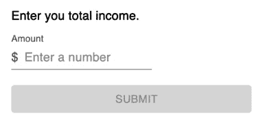
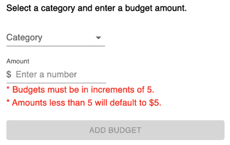
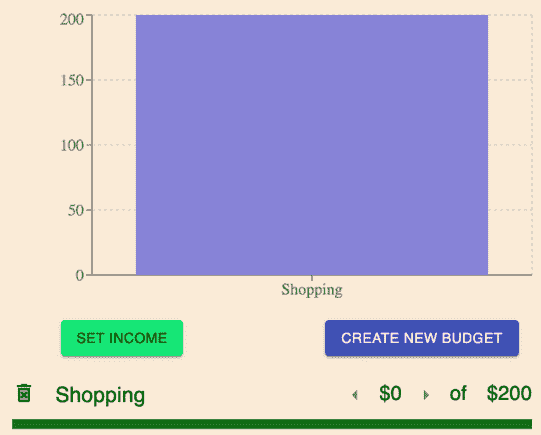
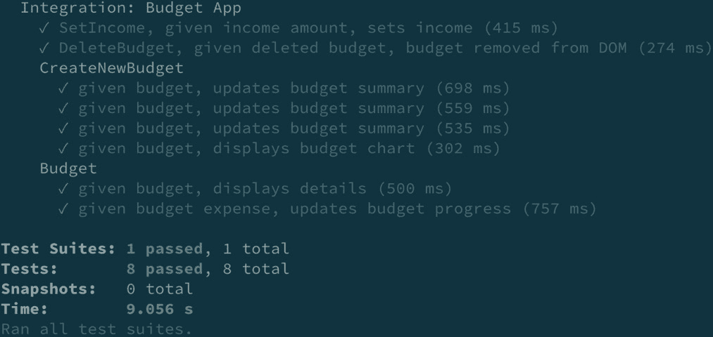
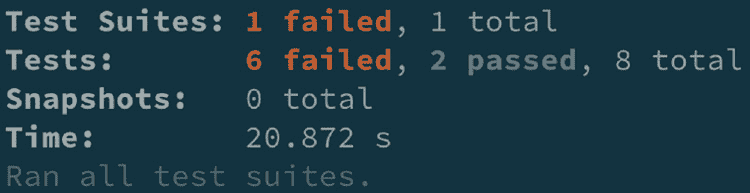
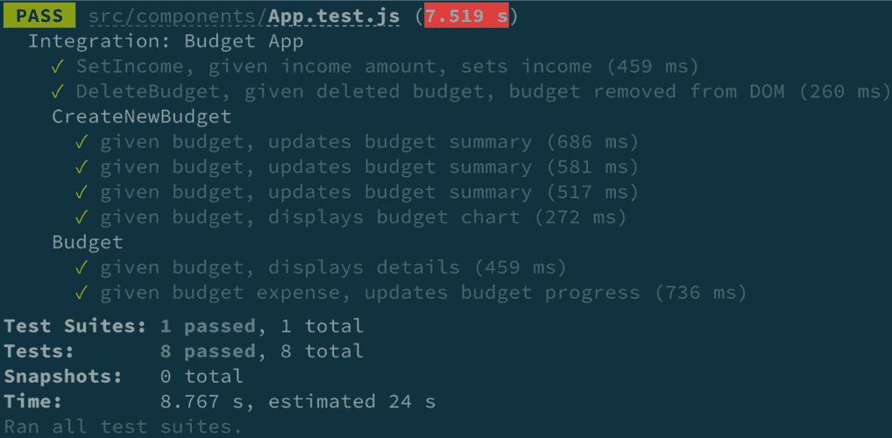
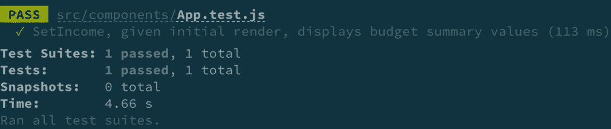
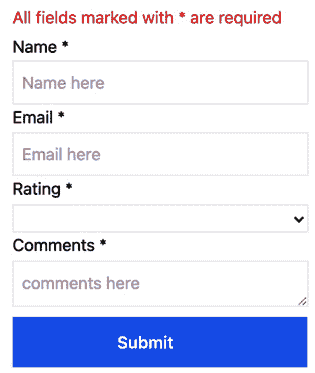
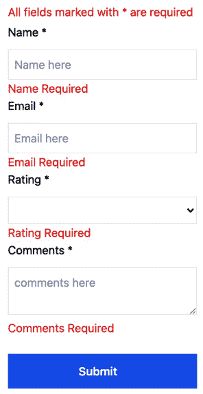
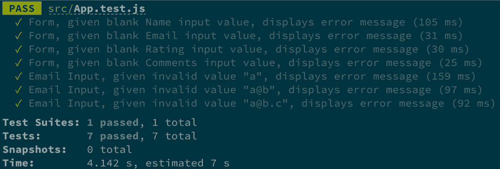

# 第五章：使用 React Testing Library 重构遗留应用程序

在上一章中，我们学习了如何测试与依赖项分离的独立组件。我们学习了测试组件的好处如何与其他组件集成。我们还学习了如何测试使用流行的第三方 **用户界面** （**UI**） 和状态管理工具的组件。在本章结束时，您将学习处理重构遗留 React 应用程序时断开更改的策略。您将学习如何在更新生产包的同时使用 React Testing Library 测试来引导您解决断开更改。您还将学习如何将使用 Enzyme 或 ReactTestUtils 编写的测试转换为 React Testing Library。

在本章中，我们将涵盖以下主要主题：

+   使用测试来捕捉更新依赖项时的回归

+   重构使用 Enzyme 编写的测试

+   重构使用 ReactTestUtils 编写的测试

+   重构测试以符合常见的测试最佳实践

本章获得的技术将使您能够减轻重构遗留应用程序的负担。

# 技术要求

对于本章的示例，您需要在您的机器上安装 Node.js。我们将使用 `create-react-app` CLI 工具来处理所有代码示例。如果需要，请在开始本章之前熟悉该工具。此外，对 Material UI 库的基本了解将有所帮助。

本章将提供代码片段，以帮助您理解待测试的代码，但目标是理解如何测试代码。您可以在以下位置找到本章的代码示例：[`github.com/PacktPublishing/Simplify-Testing-with-React-Testing-Library/tree/master/Chapter05`](https://github.com/PacktPublishing/Simplify-Testing-with-React-Testing-Library/tree/master/Chapter05)。

# 使用测试来捕捉更新依赖项时的回归

在本节中，我们将学习如何使用测试来驱动应用程序依赖项的更新。这些测试将帮助验证应用程序代码是否继续按预期工作，并在更新依赖项后快速捕捉到回归。当应用程序运行时，预算应用程序将渲染以下内容：


图 5.1 – 预算应用

上一张截图显示了一个包含基于用户输入的 **收入**、**支出** 和 **剩余** 金额的摘要部分。用户可以点击 **设置收入** 按钮来更新 **收入** 的值：



图 5.2 – 设置预算收入

上一张截图显示了一个允许用户输入并提交数字以更新 **收入** 值的模型。用户还可以为各种类别创建预算：



图 5.3 – 添加预算类别

前面的截图显示了一个允许用户选择**类别**和**金额**并添加新预算的模型。该模型还显示了一条消息，告知用户预算的可接受值。一旦用户创建了一个新的预算，该预算就会被添加到屏幕上：



图 5.4 – 预算类别详情

前面的截图显示了一个屏幕上添加了**购物**预算**$200**。预算中添加了相关的条形图和支出进度条。用户可以点击三角形按钮向预算中添加金额，或者点击垃圾桶图标删除预算。

预算应用程序有以下生产依赖项：

```js
  "dependencies": {
    "@material-ui/core": "¹.4.2",
    "@material-ui/icons": "².0.1",
    "react": "¹⁶.4.2",
    "react-dom": "¹⁶.4.2",
    "recharts": "¹.1.0",
    "uuid": "³.3.2"
  },
```

前面的代码显示了所有项目依赖项的当前版本。我们将更新`"@material-ui/core"`到版本`"4.11.3"`，`"@material-ui/icons"`到版本`"4.11.2"`，以及`"recharts"`到版本`"2.0.4"`，以便应用程序具有最新的依赖项代码。我们将使用的更新依赖项的方法将涉及运行一系列自动化测试，以帮助在更新每个依赖项后捕捉任何回归。预算应用程序没有现有的测试。

在没有现有测试的遗留应用程序的情况下，一个很好的开始方式是在其他测试级别添加测试之前，为关键工作流程编写自动化的 UI 端到端测试。请参阅*第七章*，*使用 Cypress 进行端到端 UI 测试*，了解相关内容。

本章将教会你如何在开始依赖项重构任务之前，使用 React Testing Library 编写自动化的组件测试。请参阅*第二章*，*使用 React Testing Library 工作*，了解安装说明。现在你已经了解了应用程序和更新依赖项的方法，我们将在下一节中着手编写回归测试。

## 创建回归测试套件

在本节中，我们将使用 React Testing Library 编写几个集成测试，以增加我们在更新应用程序依赖项时能够捕捉回归的信心。请参阅*第四章*，*在您的应用程序中编写集成测试和第三方库*，了解相关内容。我们将为以下主要功能编写测试：设置收入、删除预算、创建预算和预算详情。对于第一个测试，我们将针对*设置收入*功能，通过验证用户是否可以输入`income`的金额来进行测试：

```js
  function setOneDollarIncome() {
    user.click(screen.getByText(/set income/i));
    user.type(screen.getByRole('spinbutton'), '1');
    user.click(screen.getByText(/submit/i));
  }
```

在前面的代码中，我们创建了一个名为`setOneDollarIncome`的函数，用于设置`income`金额为**$1**。`setOneDollarIncome`函数将减少后续测试中的重复代码。接下来，我们将编写主要的测试代码：

```js
  test('SetIncome, given income amount, sets income', () => {
    render(<App />);
    setOneDollarIncome();
    const leftOverBudget = screen.getByText(/left over:/i);
    const leftOverBudgetAmount = within(leftOverBudget).       getByText(/\$1/i);
    expect(leftOverBudgetAmount).toBeInTheDocument();
    expect(
      screen.getByRole('heading', { name: /income: \$1/i })
    ).toBeInTheDocument();
  });
```

在前面的代码中，首先，我们在 DOM 中渲染`App`组件。接下来，我们通过`setOneDollarIncome`函数设置`income`金额为*$1*。然后，我们获取`left over`文本并使用 React Testing Library 的`within`方法访问金额文本。`within`方法可用于我们想要访问父元素子元素的情况。当我们运行应用程序时，屏幕上**Left Over**部分的最终 HTML 元素输出如下：

```js
<p class="MuiTypography-root BudgetSummary-leftoverText-4   MuiTypography-body1">
  Left over: <span class="BudgetSummary-profit-6">$1</span>
</p>
```

在前面的代码中，一个`p`元素作为子内容拥有文本`Left over`。在测试代码中，我们通过`Left Over`文本获取`p`元素并将其存储在`leftOverBudget`变量中。然后，我们使用`within`获取文本为`$1`的`span`元素并将其存储在`leftOverBudgetAmount`变量中。

最后，我们断言`leftOverBudgetAmount`在 DOM 中。对于下一个测试，我们将针对*创建预算*功能，通过验证用户设置预算后*预算摘要*部分的结果金额：

```js
  function createCarBudget(amount = '5') {
    user.click(screen.getByText(/create new budget/i));
    user.selectOptions(screen.getByRole('combobox', { name: /       category/i }), [
      screen.getByText('Auto'),
    ]);
    user.type(screen.getByRole('spinbutton'), amount);
    user.click(screen.getByText(/add budget/i));
  }
```

在前面的代码中，我们创建了一个函数`createCarBudget`，以减少在多个测试用例中使用的创建预算的重复步骤。如果没有为函数的`amount`参数传递值，将使用默认值`5`。接下来，我们将编写主要测试代码：

```js
    test.each`
      budgetAmount | spending           | leftOver
      ${'4'}       | ${'Spending: $5'}  | ${'$-4'}
      ${'5'}       | ${'Spending: $5'}  | ${'$-4'}
      ${'6'}       | ${'Spending: $10'} | ${'$-9'}
    `(
      'given budget, updates budget summary',
      ({ budgetAmount, spending, leftOver }) => {
```

在前面的代码中，我们使用 Jest 的`each`方法允许相同的测试在多个不同的值上多次运行。`budgetAmount`、`spending`和`leftOver`变量代表每个测试迭代的测试值。我们在变量下有三行数据，用于传递给每个测试运行中的变量。接下来，我们在测试中安排和执行操作：

```js
        render(<App />);
        setOneDollarIncome();
        createCarBudget(budgetAmount);
        const leftOverBudget = screen.getByText(/left over:/i);
        const leftOverBudgetAmount = within(leftOverBudget).           getByText(leftOver);
```

在前面的代码中，首先我们在 DOM 中渲染应用并调用`setOneDollarIncome`函数。接下来，我们调用`createCarBudget`函数并传入当前测试迭代的`budgetAmount`值。然后，我们获取与`leftOverBudget`变量关联的元素，类似于之前的测试。最后，我们进行以下断言：

```js
        expect(leftOverBudgetAmount).toBeInTheDocument();
        expect(
          screen.getByRole('heading', { name: spending })
        ).toBeInTheDocument();
      }
    );
```

在前面的代码中，首先，我们断言`leftOverBudgetAmount`在 DOM 中。最后，我们断言当前`name`值的标题元素在 DOM 中。作为一个挑战，编写一个测试来验证创建的预算是否显示预算图表。

之前场景的解决方案可以在*第五章*的代码示例中找到，*使用 React Testing Library 重构遗留应用程序*。

对于下一个测试，我们将针对*删除预算*功能，通过验证已删除的预算是否已从屏幕上移除：

```js
  test('DeleteBudget, given deleted budget, budget removed from      DOM', () => {
    render(<App />);
    setOneDollarIncome();
    createCarBudget();
    user.click(screen.getByLabelText(/trash can/i));
    expect(screen.queryByRole('listitem')).not.       toBeInTheDocument();
  });
```

在前面的代码中，首先，我们通过在 DOM 中渲染 `App` 组件并调用 `setOneDollarIncome` 和 `createCarBudget` 函数来安排我们的测试。然后，我们点击垃圾桶图标。最后，我们断言 DOM 中没有 `listitem` 元素。

由于 `listitem` 元素在屏幕上渲染预算，我们可以确信如果没有在 DOM 中找到任何元素，功能将按预期工作。对于最后一个测试，我们将通过验证添加支出是否更新预算进度来针对 *预算详细信息* 功能：

```js
    test('given budget expense, updates budget progress', async        () => {
      render(<App />);
      setOneDollarIncome();
      createCarBudget();
      user.click(screen.getByRole('button', { name: /         arrowright/i }));
      expect(
        screen.getByRole('heading', { name: /\$5 of \$5/i })
      ).toBeInTheDocument();
    });
```

在前面的代码中，首先，我们通过在 DOM 中渲染 `App` 组件并调用与上一个测试类似的 `setOneDollarIncome` 和 `createCarBudget` 函数来安排我们的测试。然后，我们点击右箭头图标。最后，我们断言屏幕上存在文本 `$5 of $5`。

作为一项挑战，尝试编写以下测试场景的代码：`Budget，给定预算，显示详细信息`。此测试场景的解决方案可以在 *第五章*，*使用 React 测试库重构遗留应用程序* 的代码示例中找到。

当我们运行我们的测试时，我们收到以下输出：



图 5.5 – 预算应用测试结果

前面的屏幕截图显示所有测试都通过。现在我们有一个通过回归测试套件，我们将在下一节中升级应用程序的生产依赖项。需要注意的是，我们的测试自动设置为在 **观察模式** 下运行，这是一个 Jest 功能，在关联的组件文件更改时自动重新运行测试。

观察模式功能为您提供信心，我们可以在代码更改实施时快速发现回归。对于未自动设置在观察模式下运行 Jest 的项目，只需在命令行执行 Jest 时传递 `--watch` 标志。

## 升级 Material UI 依赖项

在上一节中，我们创建了一个回归测试套件。在本节中，我们将删除所有突出显示的文本，并通过升级 `@material-ui/icons` 和 `@material-ui/core` 依赖项来获取最新的依赖项代码。`@material-ui/icons` 包依赖于 `@material-ui/core`，因此我们将同时更新这两个依赖项。

在 `package.json` 文件中，将 `@material-ui/icons` 的当前版本 `2.0.1` 替换为 `4.11.2`，将 `@material-ui/core` 替换为 `4.11.3`，并重新安装所有依赖项。现在，当我们运行我们的测试时，我们收到以下输出：



图 5.6 – 预算应用失败的测试结果

在前面的屏幕截图中，测试结果表明依赖项更新破坏了我们的测试。结果提供了有关为什么每个测试失败的相关详细信息。以下是在控制台显示的测试结果信息的概述：

```js
Integration: Budget App › SetIncome, given income amount, sets income
    TestingLibraryElementError: Unable to find an accessible       element with the role "heading" and name `/income: \$1/i`
Integration: Budget App › Budget › given budget, displays details
    TestingLibraryElementError: Unable to find an accessible       element with the role "heading" and name `/\$0 of \$5/i`
Integration: Budget App › Budget › given budget expense, updates budget progress
    TestingLibraryElementError: Unable to find an accessible       element with the role "heading" and name `/\$5 of \$5/i`
Integration: Budget App › CreateNewBudget › given budget, updates budget summary
    TestingLibraryElementError: Unable to find an accessible       element with the role "heading" and name "Spending: $10"
    TestingLibraryElementError: Unable to find an accessible       element with the role "heading" and name "Spending: $5"
```

在先前的控制台输出中，测试结果告诉我们由于无法在 DOM 中找到目标 `heading` 元素而失败的特定测试。当我们更新依赖项时，我们的源代码中发生了回归。控制台中也显示了错误信息，提供了定位源代码中问题的信息。以下是在控制台中显示的错误信息的概要版本：

```js
Warning: Failed prop type: Invalid prop `spacing` of value `24` supplied to `ForwardRef(Grid)`, expected one of [0,1,2,3,4,5,6,7,8,9,10].
Warning: Failed prop type: Invalid prop `variant` of value `title` supplied to `ForwardRef(Typography)`, expected one of ["h1","h2","h3","h4","h5","h6","subtitle1","subtitle2","body1","body2","caption","button","overline","srOnly","inherit"].
Warning: Failed prop type: Invalid prop `variant` of value `subheading` supplied to `ForwardRef(Typography)`, expected one of ["h1","h2","h3","h4","h5","h6","subtitle1","subtitle2","body1","body2","caption","button","overline","srOnly","inherit"].
Material-UI: theme.spacing.unit usage has been deprecated.
It will be removed in v5.
You can replace `theme.spacing.unit * y` with `theme.spacing(y)`.
```

错误信息告诉我们，我们的源代码现在正在使用来自先前控制台输出的材料 UI 依赖项中的过时属性值，这导致我们的测试无法找到特定的 `heading` 元素并失败。错误信息输出还告诉我们每个错误信息下错误发生的确切组件文件。例如，错误来源 `Material-UI: theme.spacing.unit 使用已被弃用。` 可以在这里找到：

```js
(src/components/SetIncome.js:27:26)
```

上述控制台输出告诉我们错误来源位于 `SetIncome` 组件文件的第 27 行的第 26 个空格。现在我们知道了每个测试失败的具体原因，我们可以相应地更新源代码。

在更新源代码以添加信心，确保我们会捕捉到由于更新代码可能发生的任何新回归时，我们将保持测试在监视模式下运行。一旦我们根据错误信息在我们的组件文件中更新了代码，当我们运行测试时，我们会收到以下输出：



图 5.7 – 预算应用更新依赖测试结果

上述截图显示，在根据错误信息更新源代码后，所有测试现在都已通过。现在你知道了如何更新生产依赖项并向旧应用程序添加测试。在使用 React Testing Library 完成此任务时的好处是，我们知道在更新源代码时我们永远不需要更新我们的测试代码。

我们的测试代码不依赖于组件的实现细节，只要最终的 DOM 输出和行为不改变，我们就可以自由地更改源代码。在下一节中，我们将学习如何重构使用 Enzyme 的旧代码的测试。

# 重构使用 Enzyme 编写的测试

在上一节中，我们学习了如何更新生产依赖项并向旧应用程序添加组件测试。在本节中，我们将学习如何用 React Testing Library 替换现有用 **Enzyme** 编写的旧测试。在 React Testing Library 创建之前，Enzyme 是一个流行的库，用于测试 React 组件的 UI。Enzyme 是一个伟大的工具，但 API 的设计允许测试组件的实现细节，导致开发者在更新源代码时必须频繁更新测试代码。我们将用 React Testing Library 替换旧 Enzyme 测试，以解决需要不断更新关注实现细节的测试的问题。

我们将使用这种方法重构遗留的 Enzyme 测试，以保留当前测试，并在安装和逐步重构它们的同时使用 React Testing Library。请参阅*第二章*，*使用 React Testing Library*，以获取安装说明。一旦我们完成遗留代码的重构并且所有测试都通过，我们将从应用程序中移除 Enzyme。测试将被重构为本章*创建回归测试套件*部分中创建的测试。我们将重构的第一个测试是验证用户可以设置收入金额：

```js
  test('SetIncome, given income amount, sets income', () => {
    const wrapper = mount(<App />);
    wrapper.find('SetIncome').props().setIncome(1);
    expect(wrapper.find('h3#income').text()).toEqual('Income:       $1');
  });
```

在前面的代码中，使用了 Enzyme 的`mount`方法来在 DOM 中渲染`App`组件。接下来，使用`find`方法定位到`SetIncome`组件，并使用值`1`调用`setIncome`方法。最后，进行断言以验证具有`id`为`income`的`h3`元素的文本值等于`Income: $1`。

存在许多实现细节，如果更改这些细节将破坏测试。例如，如果`SetIncome`组件或`setIncome`方法的名称更改，测试将失败。对`income id`的更改也会破坏测试。我们可以重构测试，使其从用户的角度出发，如下所示：

```js
test('SetIncome, given income amount, sets income', () => {
    render(<App />);
    setOneDollarIncome();
    const leftOverBudget = screen.getByText(/left over:/i);
    const leftOverBudgetAmount = within(leftOverBudget).      getByText(/\$1/i);
    expect(leftOverBudgetAmount).toBeInTheDocument();
```

在前面的代码中，我们重构了使用 React Testing Library 验证用户可以使用 React Testing Library 设置收入金额的 Enzyme 测试代码。接下来，我们将重构的测试验证当用户创建预算时，*预算摘要*部分是否更新：

```js
      test('given budget, updates budget summary', () => {
        const wrapper = mount(<App />);
        const budgetAmount = Math.ceil(parseInt(5, 10) / 5) * 5;
        wrapper.find('CreateNewBudget').props().addNewBudget({
          id: '1',
          category: 'Auto',
          amount: budgetAmount,
          amtSpent: 0,
        });
  wrapper.find('CreateNewBudget').props().     setTotalSpending(budgetAmount);
```

在前面的代码中，首先我们在 DOM 中渲染了`App`组件。接下来，使用`Math`对象中的`ceil`方法和`parseInt`方法将传入的预算金额`5`四舍五入到最接近的`5`的倍数。然后，使用`find`方法调用`CreateNewBudget`组件内部的`addNewBudget`方法，并传入一个表示预算的对象。

然后，我们在同一组件中调用`setTotalSpending`方法，并传入`budgetAmount`变量的结果。接下来，我们将进行断言：

```js
expect(wrapper.find('h3#spending').text()).toEqual('Spending:   $5');
expect(wrapper.find('span#leftover').text()).toEqual("$-5");
```

在之前的代码中，我们断言具有`id`为`spending`的`h3`元素的文本值等于`Spending: $5`。最后，我们断言具有`id`为`leftover`的`span`元素的文本值等于`$-5`。我们可以使用 React Testing Library 重构之前的代码，如下所示：

```js
test('given budget, updates budget summary', () => {
  render(<App />);
  setOneDollarIncome();
  createCarBudget(5);
  const leftOverBudget = screen.getByText(/left over:/i);
  const leftOverBudgetAmount = within(leftOverBudget).     getByText('df');
  expect(leftOverBudgetAmount).toBeInTheDocument();
  expect(screen.getByRole('heading', { name: 'Spending: $5'
})).toBeInTheDocument();
});
```

在前面的代码中，我们重构了使用 React Testing Library 验证当用户使用 React Testing Library 创建预算时，*预算摘要*部分是否更新的 Enzyme 测试代码。接下来，我们将重构的测试验证当用户创建预算时是否显示图表：

```js
    test('given budget, displays budget chart', () => {
      const wrapper = mount(<App />);
      const budgetAmount = Math.ceil(parseInt(5, 10) / 5) * 5;
      wrapper.find('CreateNewBudget').props().addNewBudget({
        id: '1',
        category: 'Auto',
        amount: budgetAmount,
        amtSpent: 0,
      });
      wrapper.find('CreateNewBudget').props().         setTotalSpending(budgetAmount);
      wrapper.update();
```

在前面的代码中，我们使用`mount`方法在 DOM 中渲染`App`组件，并创建一个`budgetAmount`变量将预算转换为与之前测试中类似的五的倍数。接下来，我们使用`find`方法在`CreateNewBudget`组件内部调用`addNewBudget`方法，并传入一个`budget`对象。

然后，我们在 `CreateNewBudget` 中调用 `setTotalSpending` 方法并传入预算金额。接下来，我们调用 `update` 方法以同步我们的测试与 `Chart` 组件创建的代码。接下来，我们可以进行断言：

```js
      expect(wrapper.find('div#chart')).toBeTruthy();
    });
```

在前面的代码中，我们断言具有 `id` 为 `chart` 的 `div` 元素是 `truthy`，这意味着它在 DOM 中被找到。正如我们在本章的 *创建回归测试套件* 部分中看到的，使用 React 测试库编写的预算应用程序的所有测试用例在运行时都将按预期通过。

现在所有酶测试都已重构为 React 测试库，我们可以从 `package.json` 文件中移除 `enzyme` 和 `enzyme-adapter-react-16` 依赖。我们还可以从 `setupTests.js` 文件中移除以下代码：

```js
import Enzyme from 'enzyme';
import Adapter from 'enzyme-adapter-react-16';
Enzyme.configure({ adapter: new Adapter() });
```

前面的代码用于配置 Enzyme 在测试文件中工作。在从应用程序中移除 Enzyme 之后，这段代码就不再需要了。现在你知道如何将使用 Enzyme 创建的遗留测试重构为 React 测试库。React 测试库的测试提供了更大的信心，并减少了在重构源代码时测试中断的风险。

在下一节中，我们将学习如何重构使用 `ReactTestUtils` 创建的测试。

# 重构使用 ReactTestUtils 编写的测试

在上一节中，我们学习了如何将使用 Enzyme 编写的测试转换为 React 测试库。这个过程涉及重构现有测试然后卸载 Enzyme 库。在本节中，我们将使用类似的过程，只是我们不需要卸载现有的测试库。`ReactTestUtils` 模块包含在 React 中，因此当我们不想使用它时，我们只需在测试文件中不导入该模块即可。由于重构过程与上一节类似，我们本节将只查看一个示例。我们将重构的测试用于验证用户可以设置收入金额：

```js
import React from 'react';
import ReactDOM from 'react-dom';
import { act } from 'react-dom/test-utils';
import App from './App';
```

在前面的代码中，我们导入了 `React`、`ReactDOM` 和 `act` 方法。从 `test-utils` 模块导入的 `act` 方法用于同步组件更新并确保我们的测试行为与 React 在浏览器中的行为相似。接下来，我们将安排测试所需的代码：

```js
  it('SetIncome, given initial render, displays budget summary       values', () => {
    let container = document.createElement('div');
    document.body.appendChild(container);
    act(() => {
      ReactDOM.render(<App />, container);
    });
```

在前面的代码中，我们创建一个 `div` 元素以在 DOM 中渲染并将其分配给 `container` 变量。接下来，我们将 `container` 变量附加到 DOM 的 `body` 元素上。然后，我们在 `container` 中渲染 `App` 组件，并用 `act` 方法包裹。接下来，我们将获取 DOM 元素并对其文本值进行断言：

```js
    const income = container.querySelector('h3#income');
    const spending = container.querySelector('#spending');
    const leftover = container.querySelector('#leftover');
    expect(income.textContent).toBe('Income: $0');
    expect(spending.textContent).toBe('Spending: $0');
    expect(leftover.textContent).toBe('$0');
```

在前面的代码中，我们使用 `querySelector` 方法访问 DOM 中的 `income`、`spending` 和 `leftover` 元素。然后，我们使用 `textContent` 属性断言前三个元素的值。最后，我们将添加代码来清理测试：

```js
    document.body.removeChild(container);
```

在前面的代码中，我们从 DOM 中移除了容器元素。移除容器将确保我们可以从一张干净的纸开始连续的测试。我们可以使用 React Testing Library 对之前的测试进行重构：

```js
it('SetIncome, given initial render, displays budget summary   values', () => {
  render(<App />);
  const income = screen.getByRole('heading', { name: /income:     \$0/i });
  const spending = screen.getByRole('heading', { name: /    spending: \$0/i });
  const leftover = screen.getByText(/left over:/i);
  expect(income).toHaveTextContent('Income: $0');
  expect(spending).toHaveTextContent('Spending: $0');
  expect(leftover).toHaveTextContent('$0');
});
```

在前面的代码中，我们使用 React Testing Library 对 `SetIncome, given initial render, displays budget summary values` 测试进行了重构。React Testing Library 版本的测试更简洁，并且对源代码更改更具弹性，因为它不使用实现细节选择 DOM 元素。当我们运行测试时，会得到以下输出：



图 5.8 – 通过设置收入测试

结果显示，`SetIncome, given initial render, displays budget summary values` 测试在之前的代码中按预期通过。现在你已了解如何使用 `ReactTestUtils` 模块重构测试。本节学到的技能将帮助你将遗留的测试代码重构为使用现代测试工具。

# 重构测试以符合常见的测试最佳实践

在上一节中，我们学习了如何使用 ReactTestUtils 重构测试。在本节中，我们将介绍一些场景，其中我们可以重构现有的测试代码，使其更健壮和易于维护。我们将使用以下反馈表单应用程序来展示示例：



图 5.9 – 反馈表单

在前面的屏幕截图中，我们有一个表单，用户可以填写 **姓名** 和 **电子邮件** 字段，以及选择评分、输入评论，最后提交他们的信息。如果用户尝试提交包含必填字段空白值的表单，则会显示错误消息：



图 5.10 – 反馈表单错误验证

在前面的屏幕截图中，每个带有空值的输入下都显示了表单验证错误。最后，当用户提交包含有效输入数据的表单时，会显示一条**感谢**信息：


图 5.11 – 提交反馈表单

在前面的屏幕截图中，显示了消息 **我们感谢您的回复，John Doe！** 消息中的 **John Doe** 部分是表单中 **姓名** 输入元素的输入值。我们将重构的第一个测试是验证当输入无效电子邮件时，会显示错误消息：

```js
test.each`
  value
  ${'a'}
  ${'a@b'}
  ${'a@b.c'}
`('displays error message', async ({ value }) => {
```

在前面的代码中，首先，使用了 Jest 的`each`方法用不同的值运行相同的测试：`a`、`a@b`和`a@b.c`。接下来，我们看到测试名称，`displays error message`。测试名称比较模糊，因为它没有提供足够的细节来描述测试的上下文。使用测试命名约定来消除模糊测试名称的问题是很常见的。有许多流行的命名约定，例如`when_stateUnderTest_expect_expectedBehavior`和`given_preconditions_when_stateUnderTest_then_expectedBehavior`，它们描述了被测试的代码、对代码执行的操作以及最终的预期结果。重要的是要记住使用与您的项目团队一致的命名约定。

在我们的重构工作中，我们将使用以下约定，`组件，给定先决条件，预期结果`。我们可以像这样重构当前的测试名称：

```js
  'Form, given invalid email value "$value", displays error       message',
```

在前面的代码中，我们将当前的测试名称重构为`Form, given invalid email value "$value", displays error message`。当阅读测试名称时，现在很清楚我们正在测试一个`Form`组件，给定的先决条件是无效的值，预期的结果是屏幕上显示错误消息。注意测试名称中的`$value`变量。该变量将在每个测试迭代中替换为当前值的名称，从而进一步提供上下文以理解特定的测试代码。

接下来，我们将分析和重构主要测试代码：

```js
  async ({ value }) => {
    const { getByRole, getByText } = render(<App />)
    const emailInput = getByRole('textbox', { name: /email/i })
    user.click(emailInput)
    user.tab()
    user.type(emailInput, value)
    await waitFor(() => {
      const errorMessage = getByText(/invalid email address/i)
      expect(errorMessage).toBeInTheDocument()
    })
  }
)
```

在前面的代码中，使用了对象解构方法来访问`getByRole`和`getByText`查询方法。然而，解构方法需要您手动跟踪在构建测试代码时添加或删除哪些查询。如*第一章*中提到的，*探索 React 测试库*，从 React 测试库的**9**版本开始，我们可以使用`screen`对象来访问查询方法。

使用`screen`对象访问查询方法比解构方法更容易维护，并产生更简洁的代码。`waitFor`方法也用于异步抓取和验证错误消息是否在 DOM 中显示。然而，`screen`对象的`findBy*`查询也是异步的，并且当您需要查询在屏幕上需要时间才能出现元素时，它们是比`waitFor`更容易使用的选项。我们可以像这样重构当前的测试代码：

```js
  async ({ value }) => {
    render(<App />)
    const emailInput = screen.getByRole('textbox', { name: /      email/i })
    user.click(emailInput)
    user.tab()
    user.type(emailInput, value)
    const errorMessage = await screen.findByText(/invalid email       address/i)
    expect(errorMessage).toBeInTheDocument()
  }
)
```

在前面的代码中，我们将解构查询替换为通过屏幕对象访问。我们还用异步的`findByText`查询替换了`waitFor`方法。现在测试代码更简洁，更容易维护。

下一个我们将重构的测试验证了当用户未为任何必填表单输入输入值时，会显示错误消息：

```js
test('Form, given blank input value, displays error message',   async () => {
  render(<App />)
  const nameInput = screen.getByRole('textbox', { name: /name/i })
  const emailInput = screen.getByRole('textbox', { name: /    email/i })
  const ratingSelect = screen.getByRole('combobox', { name: /    rating/i })
  const commentsInput = screen.getByRole('textbox', { name: /    comments/i })
```

在前面的代码中，首先，应用程序被渲染到 DOM 中。接下来，通过获取所有表单 `input` 元素并将它们存储在相应的值中，对测试进行了安排。接下来，对表单元素执行以下操作：

```js
  user.click(nameInput)
  user.click(emailInput)
  user.click(ratingSelect)
  user.click(commentsInput)
  user.tab()
```

在前面的代码中，每个 `input` 元素都被点击。然后，按键盘上的 *Tab* 键模拟将焦点从活动选择的 `ratingSelect` 元素移开。最后，进行了四个断言：

```js
  expect(await screen.findByText(/name required/i)).    toBeInTheDocument()
  expect(await screen.findByText(/email required/i)).    toBeInTheDocument()
  expect(await screen.findByText(/rating required/i)).    toBeInTheDocument()
  expect(await screen.findByText(/comments required/i)).    toBeInTheDocument()
```

在前面的代码中，有一个断言用于验证在表单值为空时显示特定的错误消息。然而，例如，如果对于**姓名必填**错误消息的第一个断言失败，测试将失败，并且不会执行其他任何断言。在同一个测试中进行多个断言的方法不是一种好的实践，因为我们无法知道剩余断言的代码是否按预期工作。

测试中的每个断言都是独立的，因此应该位于它们自己的单独测试中。我们可以这样重构测试：

```js
  test.each`
  inputLabel
  ${'Name'}
  ${'Email'}
  ${'Rating'}
  ${'Comments'}
`(
  'Form, given blank $inputLabel input value, displays error message',
```

在前面的代码中，首先，我们使用 `each` 方法为 `input` 元素名称创建单独的测试。输入名称将传递给每个测试运行的 `inputLabel` 变量。接下来，我们将编写主要的测试代码：

```js
  async ({ inputLabel }) => {
    render(<App />)
    user.click(screen.getByText(`${inputLabel} *`))
    user.tab()
    const errorMessage = await screen.findByText(`${inputLabel}         Required`)
    expect(errorMessage).toBeInTheDocument()
  }
)
```

在前面的代码中，首先，我们在 DOM 中渲染 `App` 组件。接下来，我们使用 `getByText` 点击输入标签。然后，我们模拟按下 *Tab* 键将焦点从 `input` 元素移开。最后，我们获取带有错误消息的元素，将其存储在 `errorMessage` 变量中，并验证它是否在 DOM 中。当我们运行重构后的测试时，我们得到以下输出：



图 5.12 – 反馈表单测试结果

在前面的屏幕截图中，所有重构的测试用例都按预期通过。现在你知道如何重构测试以使用命名约定和将多个断言从单个测试中拆分到单独测试中的测试最佳实践。你还学习了如何将用 React 测试库编写的遗留测试重构为现代方法。

# 摘要

在本章中，你学习了如何减轻遗留应用程序更新生产依赖项的负担。你学习了如何使用现代 React 测试库工具重构遗留测试。你还学习了一些测试最佳实践。本章获得的知识应该让你有信心，你可以成功重构过时的代码到当前版本而不会出现重大问题。你也应该能够重构测试代码以使其更易于维护。

在下一章中，我们将学习关于测试的额外工具和插件。

# 问题

1.  解释与 Enzyme 或 `ReactTestUtils` 等工具相比使用 React 测试库的好处。

1.  解释在 Jest 的监视模式下运行测试的好处。

1.  当你在编写测试时应该何时使用 Jest 的 `each` 方法？
