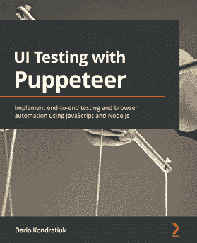
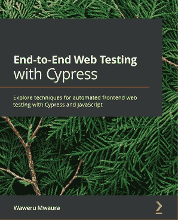

[Packt.com](http://Packt.com)

订阅我们的在线数字图书馆，全面访问超过 7,000 本书籍和视频，以及领先的行业工具，帮助您规划个人发展并推进职业生涯。更多信息，请访问我们的网站。

# 第九章：为什么订阅？

+   使用来自超过 4,000 位行业专业人士的实用电子书和视频，花更少的时间学习，更多的时间编码

+   通过为您量身定制的 Skill Plans 提高您的学习效果

+   每月免费获得一本电子书或视频

+   完全可搜索，便于快速访问关键信息

+   复制粘贴、打印和收藏内容

您知道 Packt 为每本书都提供电子书版本，包括 PDF 和 ePub 文件吗？您可以在[packt.com](http://packt.com)升级到电子书版本，并且作为印刷书客户，您有权获得电子书副本的折扣。有关更多信息，请联系我们 customercare@packtpub.com。

在[www.packt.com](http://www.packt.com)，您还可以阅读一系列免费的技术文章，订阅各种免费通讯，并享受 Packt 书籍和电子书的独家折扣和优惠。

# 其他您可能喜欢的书籍

如果您喜欢这本书，您可能对 Packt 出版的这些其他书籍也感兴趣：

(https://www.packtpub.com/product/ui-testing-with-puppeteer/9781800206786)

**使用 Puppeteer 进行 UI 测试**

Dario Kondratiuk

ISBN: 978-1-80020-678-6

+   理解浏览器自动化的基础知识

+   探索使用 Puppeteer 进行端到端测试及其最佳实践

+   将 CSS 选择器和 XPath 表达式应用于网络自动化

+   了解作为开发者如何利用网络自动化的力量

+   模拟 Puppeteer 的不同用例，例如网络速度测试和地理位置

+   掌握网络抓取和网络内容生成的技术和最佳实践

(https://www.packtpub.com/product/end-to-end-web-testing-with-cypress/9781839213854)

**端到端 Web 测试与 Cypress**

Waweru Mwaura

ISBN: 978-1-83921-385-4

+   掌握 Cypress 并了解其相对于 Selenium 的优势

+   探索用于编写完整 Web 应用测试的常见 Cypress 命令、工具和技术

+   设置和配置 Cypress 进行跨浏览器测试

+   理解如何与元素和动画一起工作，编写非故障测试

+   了解在测试中实现和处理导航请求的技术

+   使用 Applitools eyes 实现视觉回归测试

# Packt 正在寻找像您这样的作者

如果你有兴趣成为 Packt 的作者，请访问[authors.packtpub.com](http://authors.packtpub.com)并今天申请。我们与成千上万的开发者和技术专业人士合作，就像你一样，帮助他们将见解分享给全球技术社区。你可以提交一个一般性申请，申请我们正在招募作者的特定热门话题，或者提交你自己的想法。

# 留下评论 - 让其他读者了解你的想法

请通过在购买书籍的网站上留下评论的方式，与大家分享你对这本书的看法。如果你是从亚马逊购买的这本书，请在本书的亚马逊页面上留下一个诚实的评论。这对其他潜在读者来说至关重要，他们可以通过你的客观意见来做出购买决定，我们也可以了解客户对我们产品的看法，我们的作者也可以看到他们对与我们合作创作的书籍的反馈。这只需你几分钟的时间，但对其他潜在客户、我们的作者和 Packt 来说都是宝贵的。谢谢！
