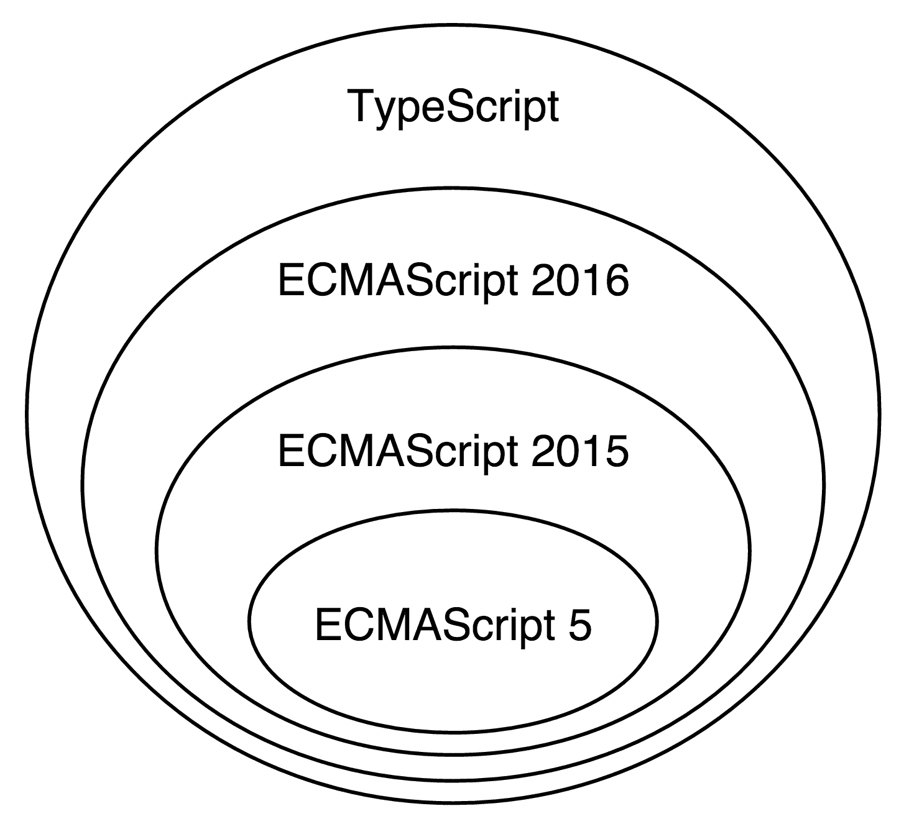

# 第二章：开始使用 Angular

2014 年 9 月 18 日，Google 将第一个公开提交推送到包含 Angular 的存储库。几周后，在 ng-europe 上，核心团队的 Igor 和 Tobias 给出了一个简短的概述，介绍了新框架预期的功能。当时的愿景远未最终确定；然而，有一点是肯定的：Angular 将与 AngularJS 完全不同的框架。

这项公告引发了许多疑问和争议。这些巨大变化的背后原因相当明确：AngularJS 已无法充分利用演进的 Web 技术以及大规模 JavaScript 应用程序的需求需要得到完全满足。一个新的框架将让 Angular 开发者以更简单、更高效、更富有成效的方式利用 Web 技术的发展。然而，人们仍然担忧。对于开发者来说，向后不兼容的最大噩梦之一就是将他们当前的代码库迁移到他们使用的第三方软件的新版本。在 Angular 的情况下，在那次首次公告之后，迁移看起来令人畏惧，甚至不可能。后来，在 2015 年的 **ng-conf** 和 **ng-vegas** 上，介绍了不同的迁移策略。Angular 社区团结起来，分享了额外的想法，预计新版本的框架将带来好处，同时保留从 AngularJS 中学到的经验。

本书是该项目的一部分。将升级到 Angular 现在变得顺利且值得。Angular 2 中巨大变化及其向后不兼容的主要驱动因素是 Web 的演变以及从野外的 AngularJS 使用中学到的经验教训。本书将帮助你通过让你了解我们是如何到达这里的以及为什么 Angular 的新功能对现代 Web 来说在构建高性能、可扩展的单页应用程序方面具有直观的意义来学习新框架。

本章我们将讨论的一些主题如下：

+   使用 TypeScript 并了解它如何扩展 JavaScript

+   使用基于组件的架构构建 Angular 应用程序的用户界面

+   使用 Angular 的依赖注入机制并将业务逻辑委托给服务

+   深入探索 Angular 的路由器和表单模块

+   查看即时编译以构建闪电般快速的应用程序

# Web 的演变——是时候推出新框架了

在过去几年中，Web 技术经历了巨大的演变。在实施 ECMAScript 5 的过程中，ECMAScript 6 标准开始了其开发（现在称为 **ECMAScript 2015** 或 **ES2015**）。ES2015 在 JavaScript 中引入了许多变化，例如添加内置语言支持模块、块作用域变量定义以及许多语法糖，如类和结构赋值。

同时，**Web 组件**被发明了。Web 组件允许我们定义自定义 HTML 元素并将行为附加到它们上。由于很难通过添加新元素（如对话框、图表和网格）来扩展现有的 HTML 元素集，这主要是因为它们 API 的整合和标准化需要时间，因此一个更好的解决方案是允许开发者以他们想要的方式扩展现有元素。Web 组件为我们提供了许多好处，包括更好的封装、我们生成的标记的更好语义、更好的模块化以及开发者与设计师之间更易沟通。

如我们所知，JavaScript 是一种单线程语言。最初，它是为了简单的客户端脚本而开发的，但随时间推移，它的角色发生了很大变化。现在，随着 HTML5 的出现，我们有不同的 API 允许音频和视频处理、通过双向通信通道与外部服务通信、传输和处理大量原始数据等。所有这些在主线程中的重计算可能会创建一个糟糕的用户体验。它们可能会在执行耗时计算时导致用户界面冻结。这导致了**Web Workers**的发展，它允许在后台执行与主线程通过消息传递通信的脚本。这样，多线程编程就被带到了浏览器中。

其中一些 API 是在 AngularJS 开发开始之后引入的；这就是为什么框架没有考虑到大多数这些 API。利用这些 API 为开发者带来了许多好处，例如以下内容：

+   显著的性能提升

+   开发具有更好质量特性的软件

现在，让我们简要讨论这些技术是如何成为 Angular 核心的一部分以及为什么。

# ECMAScript 的演变

现在，浏览器厂商正以短周期迭代的方式发布新功能，用户经常收到更新。这有助于开发者利用前沿的 Web 技术。ES2015 已经标准化。该语言最新版本的实现已经在主要浏览器中开始。学习新语法并利用它不仅能提高我们的开发效率，而且还能为不久的将来所有浏览器都将完全支持它做好准备。这使得现在开始使用最新语法变得至关重要。

一些项目的需求可能迫使我们支持旧版浏览器，这些浏览器不支持任何 ES2015 功能。在这种情况下，我们可以直接编写 ECMAScript 5，它具有不同的语法，但其语义与 ES2015 等效。另一方面，一个更好的方法将是利用**转译**过程。在我们的构建过程中使用转译器允许我们通过编写 ES2015 并将其转换为浏览器支持的目标语言来利用新语法。

Angular 自 2009 年以来一直存在。当时，大多数网站的前端由 ECMAScript 3 提供动力——ECMAScript 5 之前的最后一个主要版本。这自动意味着用于框架实现的编程语言是 ECMAScript 3。利用语言的新版本需要将 AngularJS 的全部内容移植到 ES2015。

从一开始，Angular 就通过引入框架中的最新语法来考虑网络的当前状态。Angular 是用 ES2016 的超集 TypeScript 编写的，我们将在第四章“TypeScript 快速入门”中对其进行探讨。类型注解使我们能够获得额外的性能提升，因为它们为称为**即时编译**（**AOT**）的过程打开了大门，该过程作为构建过程的一部分，为变更检测、渲染和依赖注入生成高效的代码。你可以在第九章“工具和开发体验”中找到更多关于 AOT 编译的信息。

# 网页组件

网页组件的第一个公开草案于 2012 年 5 月 22 日发布，距离 AngularJS 发布大约 3 年后。正如所述，网页组件标准允许我们创建自定义元素并将行为附加到它们上。这听起来很熟悉，因为我们已经在 AngularJS 开发用户界面时使用过类似的概念。网页组件听起来像是 Angular 指令的替代品；然而，它们具有更直观的 API 和内置浏览器支持。它们引入了一些其他好处，例如更好的封装，这在处理 CSS 样式冲突时非常重要。

在 AngularJS 中添加网页组件支持的可能策略是更改指令实现，并在 DOM 编译器中引入新标准的基本元素。作为 Angular 开发者，我们知道指令 API 是多么强大和复杂。它包括许多属性，如`postLink`、`preLink`、`compile`、`restrict`、`scope`和`controller`，当然还有我们最喜欢的`transclude`。一旦被批准为标准，网页组件将在浏览器中实现得更加底层，这带来了许多好处，如更好的性能和原生 API。

在实现 Web 组件的过程中，许多 Web 专家遇到了 AngularJS 团队在开发指令 API 时遇到的问题，并提出了类似的想法。Web 组件背后的良好设计决策包括**内容**元素，它解决了 AngularJS 中臭名昭著的转译问题。由于指令 API 和 Web 组件以不同的方式解决了类似的问题，因此在 Web 组件之上保留指令 API 将是冗余的，并增加了不必要的复杂性。这就是为什么 Angular 核心团队决定从头开始，构建一个与 Web 组件兼容的框架，并充分利用新的标准。Web 组件涉及新的功能；其中一些功能尚未被所有浏览器实现。如果我们的应用程序在不支持这些功能的浏览器中运行，Angular 将模拟它们。一个例子是使用`ng-content`指令填充的`content`元素。

# Web Workers

JavaScript 以其事件循环而闻名。通常，JavaScript 程序在单个线程中执行，不同的事件通过被推入队列并按到达顺序依次处理来安排。然而，当计划中的某个事件需要大量的计算时间时，这种计算策略并不有效。在这种情况下，事件的处理将阻塞主线程，并且所有其他事件将不会处理，直到耗时的计算完成并将执行传递到队列中的下一个事件。一个简单的例子是鼠标点击触发的事件，其中回调使用 HTML5 音频 API 进行一些音频处理。如果处理的音频轨道很大，并且运行在其上的算法很重，这将通过冻结 UI 直到执行完成来影响用户体验。

Web Workers API 的引入是为了防止这样的陷阱。它允许在另一个线程的上下文中执行重计算，从而释放主线程的执行，使其能够处理用户输入和渲染用户界面。

我们如何在 Angular 中利用这一点呢？为了回答这个问题，让我们思考一下 AngularJS 中的工作方式。如果我们有一个企业应用程序，它处理大量需要通过数据绑定在屏幕上渲染的数据，会怎样呢？对于每个绑定，框架将创建一个新的观察者。一旦运行了消化循环，它将遍历所有观察者，执行与它们相关的表达式，并将返回的结果与上一次迭代中获得的结果进行比较。在这里我们有几个减速点：

+   遍历大量观察者

+   在给定上下文中表达式的评估

+   返回结果的副本

+   表达式评估的当前结果与之前的结果之间的比较

所有这些步骤可能会相当慢，具体取决于输入的大小。如果消化循环涉及到繁重的计算，为什么不将其移动到 Web Worker 中呢？为什么不在 Web Worker 中运行消化循环，获取已更改的绑定，然后将它们应用到 DOM 上？

社区进行了一些实验，旨在实现这一结果。然而，将它们集成到框架中并不简单。

导致不满意结果的主要原因之一是框架与 DOM 的耦合。通常，在观察者的回调中，AngularJS 直接操作 DOM，这使得无法将观察者移动到 Web Worker 中，因为 Web Worker 在一个隔离的上下文中执行，没有访问 DOM 的权限。在 AngularJS 中，我们可能在不同观察者之间存在隐式或显式的依赖关系，这需要多次迭代消化循环才能得到稳定的结果。结合最后两点，在其他执行线程（除了主线程）中计算变化是非常困难的。

在 AngularJS 中修复这个问题给内部实现引入了大量的复杂性。框架根本就没有考虑到这一点。由于 Web Worker 在 Angular 设计过程开始之前就已经引入，核心团队从一开始就考虑了它们。

# 从野外的 AngularJS 中学到的经验

虽然上一节列出了很多关于响应最新趋势所需重新实现框架的论点，但重要的是要记住，我们并不是从头开始。我们带着从 AngularJS 中学到的知识前进。自 2009 年以来，不仅仅是网络在发展。我们还开始构建越来越多地复杂的应用程序。如今，单页应用程序不再是某种异类，而是所有解决业务问题的网络应用程序的严格要求，它们追求高性能和良好的用户体验。

AngularJS 帮助我们高效地构建大规模的单页应用程序。然而，通过在各种用例中应用它，我们也发现了其中的一些陷阱。从社区的经验中学习，Angular 的核心团队致力于新的想法，旨在满足新的需求。

# 控制器

AngularJS 遵循 **模型-视图-控制器**（**MVC**）的微架构模式。有些人可能会认为它更像 **模型-视图-视图模型**（**MVVM**），因为视图模型作为属性附加到作用域或当前上下文中，在 *控制器语法* 的情况下。如果我们使用 **模型-视图-表示者**（**MVP**），它可能又有不同的处理方式。由于我们可以在应用程序中结构化逻辑的不同变体，核心团队将 AngularJS 称为 **模型-视图-任何**（**MVW**）框架。

在任何 AngularJS 应用程序中，视图应该是由指令组成的。这些指令协同工作，以提供功能齐全的用户界面。服务负责封装应用程序的业务逻辑。这就是我们在其中放置通过 HTTP 与 RESTful 服务通信、通过 WebSockets 进行实时通信以及甚至 WebRTC 的地方。服务是我们应该实现应用程序领域模型和业务规则的基本构建块。还有一个组件，它主要负责处理用户输入并将执行委托给服务：控制器。

尽管服务和指令有明确的角色，但我们经常可以看到反模式“大量视图控制器”，这在 iOS 应用程序中很常见。有时，开发者会诱使从他们的控制器直接访问或甚至操作 DOM。最初，这发生在你想要实现一些简单的事情时，比如改变元素的大小，或者快速而肮脏地改变元素样式。另一个值得注意的反模式是在控制器之间重复业务逻辑。通常，开发者倾向于复制和粘贴应该封装在服务内部的逻辑。

构建 AngularJS 应用程序的最佳实践指出，控制器不应操纵 DOM；相反，所有 DOM 访问和操作都应隔离在指令中。如果我们有一些在控制器之间的重复逻辑，我们很可能希望将其封装到服务中，并通过 Angular 的依赖注入机制将此服务注入到所有需要该功能的所有控制器中。

这是我们从 AngularJS 出发的。所有这些话，似乎控制器的功能可以被移动到指令的控制器中。由于指令支持依赖注入 API，在接收到用户输入后，我们可以直接将执行委托给已经注入的特定服务。这就是为什么 Angular 现在采用不同方法的主要原因，通过移除使用 `ng-controller` 指令将控制器放在任何地方的能力。我们将在第五章“使用 Angular 组件和指令入门”中查看如何从新的组件和指令中提取 AngularJS 控制器的职责。第五章。

# 作用域

AngularJS 中的数据绑定是通过使用 `scope` 对象实现的。我们可以将其属性附加到它上面，并在模板中明确声明我们想要绑定到这些属性（单向或双向）。尽管作用域的概念似乎很清晰，但它还有两个额外的职责，包括事件分派和与变更检测相关的行为。

Angular 初学者很难理解作用域（scope）究竟是什么以及应该如何使用。AngularJS 1.2 引入了一种称为**控制器作为语法（controller as syntax**）的概念。它允许我们在给定的控制器（`this`）内部添加属性，而不是显式地注入`scope`对象并在之后添加属性。这种简化的语法可以通过以下代码片段来演示：

```js
<div ng-controller="MainCtrl as main"> 
  <button ng-click="main.clicked()">Click</button> 
</div>
function MainCtrl() { 
  this.name = 'Foobar'; 
} 
MainCtrl.prototype.clicked = function () { 
  alert('You clicked me!'); 
}; 
```

最近的 Angular 版本更进一步，移除了`scope`对象。所有表达式都在给定的 UI 组件的上下文中进行评估。移除整个作用域 API 引入了更高的简洁性；我们不再需要显式地注入它，相反，我们向 UI 组件添加属性，这些属性我们可以稍后绑定。这个 API 感觉更加简单和自然。

我们将在第五章，《Angular 组件和指令入门》中更详细地探讨 Angular 的组件和变更检测机制。

# 依赖注入

可能是市场上第一个在 JavaScript 世界中通过**依赖注入（DI**）实现**控制反转（IoC**）的框架是 AngularJS。DI 提供了一系列好处，如更易于测试、更好的代码组织和模块化，以及简洁性。尽管 AngularJS 中的 DI 做得非常出色，但 Angular 更进一步。由于 Angular 基于最新的网络标准，它使用 ECMAScript 2016 装饰器的语法来注释使用 DI 的代码。装饰器与 Python 中的装饰器或 Java 中的注解非常相似。它们允许我们使用反射来**装饰**给定对象的行为，或向其添加元数据。由于装饰器尚未标准化且不被主流浏览器支持，它们的用法需要中间的转译步骤。

新的依赖注入（DI）机制更加灵活且功能丰富。它还修复了 AngularJS 的一些缺陷，例如不同的 API；在框架的第一版本中，一些对象是通过位置注入的（例如，在指令的链接函数中注入的 scope、element、attributes 和 controller），而其他对象则是通过名称注入的（在控制器、指令、服务和过滤器中使用参数名称）。

我们将在第六章，《Angular 依赖注入》中进一步探讨 Angular 的依赖注入 API。

# 服务器端渲染

网络需求越大，Web 应用程序就越复杂。构建一个真实的单页应用程序需要编写大量的 JavaScript，并且包含所有必需的外部库可能会使页面上的脚本大小增加到几兆字节。在移动设备上，应用程序的初始化可能需要几秒钟甚至几十秒钟，直到所有资源从服务器获取，JavaScript 被解析和执行，页面被渲染，以及所有样式被应用。在低端移动设备上，使用移动互联网连接时，这个过程可能会让用户放弃访问我们的应用程序。尽管有一些做法可以加快这个过程，但在复杂的应用程序中，并没有一劳永逸的解决方案。

在尝试改善用户体验的过程中，开发者发现了一种名为**服务器端渲染**的技术。它允许我们在服务器上渲染单页应用程序的请求视图，并直接将 HTML 提供给用户。一旦所有资源都处理完毕，脚本文件可以添加事件监听器和绑定。这听起来像是一种提升我们应用程序性能的好方法。在这方面，React 是先驱之一，它允许使用 Node.js DOM 实现进行服务器端用户界面的预渲染。不幸的是，AngularJS 的架构不允许这样做。主要障碍是框架与浏览器 API 之间的强耦合，这是我们运行 web workers 中的更改检测时遇到的问题。

服务器端渲染的另一个典型用例是构建**搜索引擎优化**（**SEO**）友好的应用程序。过去为了使 AngularJS 应用程序可由搜索引擎索引，使用了一些黑客技巧。例如，其中一种做法是使用无头浏览器遍历应用程序，在每个页面上执行脚本并将渲染输出缓存到 HTML 文件中，使其可由搜索引擎访问。

尽管这种构建 SEO 友好应用程序的解决方案是有效的，但服务器端渲染解决了上述两个问题，提高了用户体验，并使我们能够更轻松、更优雅地构建 SEO 友好应用程序。

将 Angular 与 DOM 解耦使我们能够在浏览器之外运行 Angular 应用程序。我们将在第九章工具和开发体验中进一步探讨这一点。

# 可扩展的应用程序

自从 Backbone.js 出现以来，MVW（模型-视图-控制器）一直是构建单页应用的首选。它通过将业务逻辑与视图隔离来分离关注点，使我们能够构建设计良好的应用。利用观察者模式，MVW 允许在视图中监听模型变化，并在检测到变化时更新它。然而，这些事件处理器之间存在一些显式和隐式的依赖关系，这使得我们应用中的数据流不明显且难以推理。在 AngularJS 中，我们允许不同观察者之间存在依赖关系，这要求消化循环迭代它们几次，直到表达式结果稳定。Angular 使数据流向一个方向；这带来了一系列好处：

+   更明确的数据流

+   绑定之间没有依赖关系，因此没有**存活时间**（**TTL**）的消化

+   框架的性能更好

+   消化循环只运行一次

+   我们可以创建对不可变或可观察模型友好的应用，这使我们能够进行进一步的优化

数据流的变化在 AngularJS 架构中引入了另一个根本性的变化。

当我们需要维护用 JavaScript 编写的庞大代码库时，我们可能对可扩展性问题有另一种看法。尽管 JavaScript 的鸭子类型使语言非常灵活，但它也使得 IDE 和文本编辑器的分析和支持变得更加困难。大型项目的重构变得非常困难且容易出错，因为在大多数情况下，静态分析和类型推断是不可能的。缺乏编译器使得错误拼写变得过于容易，直到我们运行测试套件或运行应用程序，这些错误才难以察觉。

Angular 核心团队决定使用 TypeScript，因为它提供了更好的工具和编译时类型检查，这有助于我们提高生产力并减少错误。如图所示，TypeScript 是 ECMAScript 的超集；它引入了显式类型注解和编译器：



图 1

TypeScript 语言被编译成普通 JavaScript，受到今天浏览器的支持。自 1.6 版本以来，TypeScript 实现了 ECMAScript 2016 装饰器，这使得它成为 Angular 的完美选择。

TypeScript 的使用允许 IDE 和文本编辑器提供更好的支持，包括静态代码分析和类型检查。所有这些通过减少我们犯的错误和简化重构过程，显著提高了我们的生产力。TypeScript 的另一个重要好处是通过静态类型，我们隐式地获得了性能提升，这允许 JavaScript 虚拟机进行运行时优化。

我们将在第四章“TypeScript 快速入门”中详细讨论 TypeScript。

# 模板

模板是 AngularJS 的关键特性之一。它们是简单的 HTML，并且不需要任何中间转换，与大多数模板引擎，如 mustache 不同。AngularJS 中的模板通过允许我们在其中创建内部 **领域特定语言**（**DSL**），结合了简单性和强大功能，这些内部元素和属性是自定义的。

这也是 Web 组件的主要目的之一。我们已经提到了 Angular 如何利用这项新技术以及为什么这样做。尽管 AngularJS 模板很棒，但它们仍然可以变得更好！新的 Angular 模板吸取了过去的精华，并通过修复一些令人困惑的部分来增强它。

例如，假设我们有一个指令，我们想要允许用户通过属性传递一个属性给它。在 AngularJS 中，我们可以以下三种不同的方式来处理这个问题：

```js
<user name="literal"></user> 
<user name="expression"></user> 
<user name="{{interpolate}}"></user> 
```

在 `user` 指令中，我们可以通过三种不同的方法传递 `name` 属性。我们可以传递一个字面量（在这种情况下，是 `"literal"` 字符串），一个字符串，它将被评估为一个表达式（在我们的例子中是 `"expression"`），或者一个内部的 `{{ }}` 中的表达式。应该使用哪种语法完全取决于指令的实现，这使得它的 API 复杂且难以记忆。

每天处理大量具有不同设计决策的组件是一项令人沮丧的任务。通过引入一个共同约定，我们可以处理这些问题。然而，为了获得良好的结果和一致的 API，整个社区都需要同意它。

Angular 通过提供一种特殊的语法来处理这个问题，该语法用于属性的值，这些值需要在当前组件的上下文中进行评估，以及用于传递字面量的不同语法。

另一件我们习惯的事情，基于我们的 AngularJS 经验，是模板指令中的微语法，例如 `ng-if` 和 `ng-for`。例如，如果我们想在 AngularJS 中遍历用户列表并显示他们的名字，我们可以这样做：

```js
<div ng-for="user in users">{{user.name}}</div> 
```

虽然这种语法对我们来说看起来直观，但它只允许有限的工具支持。然而，Angular 通过引入更丰富的语义的更多显式语法来采取了不同的方法：

```js
<ng-template ngFor let-user [ngForOf]="users"> 
  {{user.name}} 
</ng-template> 
```

前面的代码片段明确定义了属性，该属性必须在当前迭代（`user`）的上下文中创建，以及我们迭代的（`users`）。

由于这种语法在键入时过于冗长，开发者可以使用以下语法，它后来会被转换成更冗长的形式：

```js
<li *ngFor="let user of users"> 
  {{user.name}} 
</li> 
```

新模板的改进也将允许更好的工具支持，这些工具支持高级功能。我们将在 第五章 中讨论 Angular 的模板，*开始使用 Angular 组件和指令*。

# 变更检测

在“Web Workers”部分，我们已经提到了在作为 Web Worker 实例化的不同线程上下文中运行 digest 循环的机会。然而，AngularJS 中 digest 循环的实现并不那么内存高效，并阻止 JavaScript 虚拟机进行进一步的代码优化，这允许实现显著的性能提升。其中一种优化是内联缓存（[`mrale.ph/blog/2012/06/03/explaining-js-vms-in-js-inline-caches.html`](http://mrale.ph/blog/2012/06/03/explaining-js-vms-in-js-inline-caches.html)）。

Angular 团队进行了大量研究，以发现提高变更检测性能和效率的不同方法。这导致了全新的变更检测机制的诞生。

因此，Angular 在框架直接从组件模板生成的代码中执行变更检测；该代码由**Angular 编译器**生成。Angular 编译器是框架的一个模块，它可以处理 Angular 应用程序，然后在其之上执行不同的优化，最终生成比我们编写的源代码性能更好的代码。

有两种内置的代码生成（也称为编译）策略：

+   **即时编译（JIT）**：在运行时，Angular 生成在整个应用程序上执行变更检测的代码。生成的代码针对 JavaScript 虚拟机进行了优化，提供了巨大的性能提升。

+   **预编译（AOT）**：这与 JIT 类似，不同之处在于代码是作为应用程序构建过程的一部分生成的。它可以用于通过不在浏览器中执行编译来加快渲染速度，也可以用于不允许 `eval()` 的环境，例如具有严格**内容安全策略（CSP**）和 Chrome 扩展的环境。我们将在本书的下一节中进一步讨论。

我们将在第五章“使用 Angular 组件和指令入门”中查看新的变更检测机制以及如何配置它。

# 摘要

在本章中，我们考虑了 AngularJS 和 Angular 之间缺乏向后兼容性的主要原因。我们了解到，Angular 中实施的设计决策是由两件事推动的：Web 的发展以及前端开发的发展，以及从 AngularJS 应用程序开发中学到的经验教训。

在第一部分，你学习了为什么我们需要使用 JavaScript 语言的最新版本，为什么利用 Web 组件和 Web Workers，以及为什么在 AngularJS 中集成所有这些强大的工具不值得。

我们观察了前端开发的当前方向和过去几年中吸取的教训。我们描述了为什么控制器和作用域被从 Angular 中移除，以及为什么为了允许 SEO 友好的高性能单页应用进行服务器端渲染，AngularJS 的架构发生了变化。我们还关注了一个基本主题，即构建大规模应用，以及这是如何激励框架中的单向数据流以及选择静态类型语言 TypeScript 的。

在下一章中，我们将探讨 Angular 应用的主要构建块，它们如何被使用，以及它们之间的关系。Angular 重用了 AngularJS 引入的一些概念名称，但通常完全改变了我们的单页应用的构建块。我们将快速介绍模块、指令、组件、新的路由器、管道和服务，并描述它们如何结合用于构建优雅的单页应用。

下载示例代码

您可以从[`www.packtpub.com`](http://www.packtpub.com)的账户下载本书的示例代码文件。如果您在其他地方购买了这本书，您可以访问[`www.packtpub.com/support`](http://www.packtpub.com/support)并注册，以便将文件直接通过电子邮件发送给您。
