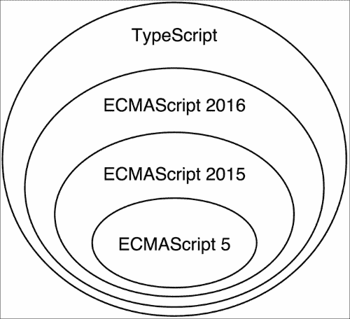

# 第一章：开始使用 Angular 2

2014 年 9 月 18 日，第一个公共提交被推送到 Angular 2 存储库。几周后，在 ng-europe 上，核心团队的 Igor 和 Tobias 简要概述了 Angular 2 的预期。当时的愿景远非最终；然而，有一件事是确定的——新版本的框架将与 AngularJS 1.x 完全不同。

这一公告引发了许多问题和争议。变化背后的原因非常明确——AngularJS 1.x 不再能充分利用发展中的 Web，并且无法完全满足大规模 JavaScript 应用程序的要求。一个新的框架将让 Angular 开发人员以更简单、更直接的方式利用 Web 技术的发展。然而，人们感到担忧。对于开发人员来说，与第三方软件的新版本进行迁移是最大的噩梦之一。在 Angular 的情况下，宣布后，迁移看起来令人生畏，甚至不可能。后来，在 ng-conf 2015 和 ng-vegas 上，引入了不同的迁移策略。Angular 社区汇聚在一起，分享额外的想法，预期 Angular 2 的好处，同时保留了从 AngularJS 1.x 中学到的东西。

这本书是该项目的一部分。升级到 Angular 2 并不容易，但是很值得。Angular 2 背后的主要驱动因素是 Web 的发展，以及从在野外使用 AngularJS 1.x 中所学到的经验。切换到 Angular 2 将帮助您通过了解我们是如何到达这里以及为什么 Angular 的新特性对于构建高性能、可扩展的单页应用程序在现代 Web 中具有直观意义来学习新框架。

# Web 的发展——是时候使用新框架了

在过去的几年里，网络发展迅速。在实施 ECMAScript 5 的同时，ECMAScript 6 标准开始了开发（现在被称为 ECMAScript 2015 或 ES2015）。ES2015 在语言中引入了许多变化，例如为模块添加内置语言支持，块作用域变量定义，以及许多语法糖，如类和解构。

与此同时，**Web Components**被发明了。Web Components 允许我们定义自定义 HTML 元素并为其附加行为。由于扩展现有 HTML 元素（如对话框、图表、网格等）很难，主要是因为需要时间来巩固和标准化它们的 API，更好的解决方案是允许开发人员按照他们的意愿扩展现有元素。Web Components 为我们提供了许多好处，包括更好的封装性，我们生成的标记的更好语义，更好的模块化，以及开发人员和设计人员之间更容易的沟通。

我们知道 JavaScript 是一种单线程语言。最初，它是为了简单的客户端脚本而开发的，但随着时间的推移，它的作用发生了很大变化。现在有了 HTML5，我们有了不同的 API，允许音频和视频处理，通过双向通信渠道与外部服务通信，传输和处理大块原始数据等。主线程中的所有这些繁重计算可能会导致用户体验不佳。当执行耗时计算时，可能会导致用户界面冻结。这导致了**WebWorkers**的开发，它允许在后台执行脚本，并通过消息传递与主线程通信。这样，多线程编程被引入到了浏览器中。

其中一些 API 是在 AngularJS 1.x 的开发之后引入的；这就是为什么框架并没有考虑大部分 API。然而，利用这些 API 给开发人员带来了许多好处，比如：

+   显著的性能改进。

+   开发具有更好质量特征的软件。

现在让我们简要讨论这些技术如何成为新的 Angular 核心的一部分，以及原因。

# ECMAScript 的发展

如今，浏览器供应商以短迭代的方式发布新功能，用户经常收到更新。这有助于推动 Web 前进，使开发人员能够利用尖端技术，旨在改进 Web。ES2015 已经标准化。最新版本的语言已经在主要浏览器中开始实现。学习新的语法并利用它不仅会提高我们作为开发人员的生产力，还会为我们在不久的将来当所有浏览器都完全支持它时做好准备。这使得现在开始使用最新的语法至关重要。

一些项目的要求可能要求我们支持不支持任何 ES2015 功能的旧浏览器。在这种情况下，我们可以直接编写 ECMAScript 5，它具有不同的语法，但与 ES2015 具有等效的语义。然而，我们可以利用**转译**的过程。在我们的构建过程中使用转译器可以让我们通过编写 ES2015 并将其转换为浏览器支持的目标语言来利用新的语法。

AngularJS 自 2009 年以来就存在。当时，大多数网站的前端都是由 ECMAScript 3 驱动的，这是 ECMAScript 5 之前的最后一个主要版本。这自动意味着框架实现所使用的语言是 ECMAScript 3。利用新版本的语言需要将整个 AngularJS 1.x 移植到 ES2015。

从一开始，Angular 2 就考虑到了 Web 的当前状态，引入了框架中的最新语法。虽然 Angular 2 是用 ES2016 的超集（TypeScript）编写的（我们马上会看一下），但它允许开发人员使用他们自己喜欢的语言。我们可以使用 ES2015，或者，如果我们不想对我们的代码进行任何中间预处理并简化构建过程，甚至可以使用 ECMAScript 5。

## Web 组件

Web Components 的第一个公开草案于 2012 年 5 月 22 日发布，大约在发布 AngularJS 1.x 三年后。正如前面提到的，Web Components 标准允许我们创建自定义元素并为其附加行为。听起来很熟悉；我们已经在 AngularJS 1.x 应用程序的用户界面开发中使用了类似的概念。Web Components 听起来像是 Angular 指令的替代品；然而，它们具有更直观的 API、更丰富的功能和内置的浏览器支持。它们引入了一些其他好处，比如更好的封装，这在处理 CSS 样式冲突方面非常重要。

在 AngularJS 1.x 中添加 Web Components 支持的一种可能策略是改变指令的实现，并在 DOM 编译器中引入新标准的原语。作为 Angular 开发人员，我们知道指令 API 是多么强大但也复杂。它包括许多属性，如`postLink`、`preLink`、`compile`、`restrict`、`scope`、`controller`等等，当然还有我们最喜欢的`transclude`。作为标准，Web Components 将在浏览器中以更低的级别实现，这带来了许多好处，比如更好的性能和本机 API。

在实现 Web Components 时，许多网络专家遇到了与 Angular 团队在开发指令 API 时遇到的相同问题，并提出了类似的想法。Web Components 背后的良好设计决策包括**content**元素，它解决了 AngularJS 1.x 中臭名昭著的 transclusion 问题。由于指令 API 和 Web Components 以不同的方式解决了类似的问题，将指令 API 保留在 Web Components 之上将是多余的，并增加了不必要的复杂性。这就是为什么 Angular 核心团队决定从头开始，构建在 Web Components 之上，并充分利用新标准的原因。Web Components 涉及新功能，其中一些尚未被所有浏览器实现。如果我们的应用程序在不支持这些功能的浏览器中运行，Angular 2 会模拟它们。一个例子是使用指令`ng-content`来模拟 content 元素。

## WebWorkers

JavaScript 以其事件循环而闻名。通常，JavaScript 程序在单个线程中执行，并且不同的事件被推送到队列中并按顺序依次处理，按照它们到达的顺序。然而，当计划的事件之一需要大量的计算时间时，这种计算策略就不够有效了。在这种情况下，事件的处理将阻塞主线程，并且直到耗时的计算完成并将执行传递给队列中的下一个事件之前，所有其他事件都不会被处理。一个简单的例子是鼠标点击触发一个事件，在回调中我们使用 HTML5 音频 API 进行一些音频处理。如果处理的音轨很大，算法运行的负担很重，这将影响用户体验，直到执行完成为止，界面会被冻结。

WebWorker API 的引入是为了防止这种陷阱。它允许在不同线程的上下文中执行重型计算，这样可以使主执行线程空闲，能够处理用户输入和渲染用户界面。

我们如何在 Angular 中利用这一点？为了回答这个问题，让我们想一想在 AngularJS 1.x 中的工作原理。假设我们有一个企业应用程序，需要处理大量数据，并且需要使用数据绑定在屏幕上呈现这些数据。对于每个绑定，都会添加一个新的观察者。一旦 digest 循环运行，它将遍历所有观察者，执行与它们相关的表达式，并将返回的结果与上一次迭代获得的结果进行比较。我们在这里有一些减速：

+   对大量观察者进行迭代。

+   在给定上下文中评估表达式。

+   返回结果的副本。

+   表达式评估的当前结果与先前结果之间的比较。

所有这些步骤可能会相当慢，具体取决于输入的大小。如果 digest 循环涉及重型计算，为什么不将其移动到 WebWorker 中呢？为什么不在 WebWorker 中运行 digest 循环，获取更改的绑定，并将其应用于 DOM？

社区进行了试验，旨在达到这一目标。然而，它们与框架的整合并不是简单的。令人不满意的结果背后的主要原因之一是框架与 DOM 的耦合。在监视器的回调函数中，Angular 经常直接操作 DOM，这使得将监视器移动到 WebWorkers 中变得不可能，因为 WebWorkers 在隔离的上下文中被调用，无法访问 DOM。在 AngularJS 1.x 中，我们可能存在不同监视器之间的隐式或显式依赖关系，这需要多次迭代 digest 循环才能获得稳定的结果。结合最后两点，很难在除执行主线程之外的线程中实现实际结果。

在 AngularJS 1.x 中修复这个问题会在内部实现中引入大量的复杂性。这个框架根本就没有考虑到这一点。由于 WebWorkers 是在 Angular 2 设计过程开始之前引入的，核心团队从一开始就考虑到了它们。

# 在野外学到的 AngularJS 1.x 的教训

尽管前一部分介绍了需要重新实现框架以响应最新趋势的许多论点，但重要的是要记住我们并不是完全从零开始。我们将从 AngularJS 1.x 中学到的东西带到了现在。自 2009 年以来，Web 不是唯一发展的东西。我们还开始构建越来越复杂的应用程序。如今，单页应用程序不再是什么奇特的东西，而更像是解决业务问题的所有 Web 应用程序的严格要求，它们旨在实现高性能和良好的用户体验。

AngularJS 1.x 帮助我们构建了高效和大规模的单页应用程序。然而，通过在各种用例中应用它，我们也发现了一些缺点。从社区的经验中学习，Angular 的核心团队致力于新的想法，旨在满足新的需求。当我们看着 Angular 2 的新特性时，让我们以 AngularJS 1.x 的当前实现为背景来考虑它们，并思考我们作为 Angular 开发人员在过去几年中所挣扎和修改的事情。

## 控制器

AngularJS 1.x 遵循**模型视图控制器**（**MVC**）微架构模式。有人可能会认为它看起来更像**模型视图视图模型**（**MVVM**），因为视图模型作为作用域或当前上下文附加到作用域或控制器的属性。如果我们使用**模型视图呈现器模式**（**MVP**），它可能会以不同的方式进行处理。由于我们可以在应用程序中构造逻辑的不同变体，核心团队将 AngularJS 1.x 称为**模型视图任何**（**MVW**）框架。

在任何 AngularJS 应用程序中，视图应该是指令的组合。指令共同协作，以提供完全功能的用户界面。服务负责封装应用程序的业务逻辑。这是我们应该与 RESTful 服务通过 HTTP 进行通信，与 WebSockets 进行实时通信甚至 WebRTC 的地方。服务是我们应该实现应用程序的领域模型和业务规则的构建模块。还有一个组件，主要负责处理用户输入并将执行委托给服务 - 控制器。

尽管服务和指令有明确定义的角色，但我们经常会看到**大型视图控制器**的反模式，这在 iOS 应用程序中很常见。偶尔，开发人员会尝试直接从他们的控制器访问甚至操作 DOM。最初，这是为了实现一些简单的事情，比如更改元素的大小，或者快速而肮脏地更改元素的样式。另一个明显的反模式是在控制器之间复制业务逻辑。开发人员经常倾向于复制和粘贴应该封装在服务中的逻辑。

构建 AngularJS 应用程序的最佳实践是，控制器不应该在任何情况下操作 DOM，而是所有 DOM 访问和操作应该在指令中进行隔离。如果在控制器之间有一些重复的逻辑，很可能我们希望将其封装到一个服务中，并使用 AngularJS 的依赖注入机制在所有需要该功能的控制器中注入该服务。

这是我们在 AngularJS 1.x 中的出发点。尽管如此，似乎控制器的功能可以移动到指令的控制器中。由于指令支持依赖注入 API，在接收用户输入后，我们可以直接将执行委托给特定的服务，已经注入。这是 Angular 2 使用不同方法的主要原因，通过使用`ng-controller`指令来阻止在任何地方放置控制器。我们将在第四章中看看如何从 Angular 2 组件和指令中取代 AngularJS 1.x 控制器的职责，*开始使用 Angular 2 组件和指令*。

## 作用域

在 AngularJS 中，数据绑定是通过`scope`对象实现的。我们可以将属性附加到它，并在模板中明确声明我们要绑定到这些属性（单向或双向）。尽管 scope 的概念似乎很清晰，但 scope 还有两个额外的责任，包括事件分发和与变更检测相关的行为。Angular 初学者很难理解 scope 到底是什么，以及应该如何使用它。AngularJS 1.2 引入了**controller as 语法**。它允许我们向给定控制器内的当前上下文（`this`）添加属性，而不是显式注入`scope`对象，然后再向其添加属性。这种简化的语法可以从以下片段中演示：

```ts
<div ng-controller="MainCtrl as main">
  <button ng-click="main.clicked()">Click</button>
</div>

function MainCtrl() {
  this.name = 'Foobar';
}
MainCtrl.prototype.clicked = function () {
  alert('You clicked me!');
};
```

Angular 2 更进一步，通过移除`scope`对象来实现。所有表达式都在给定 UI 组件的上下文中进行评估。移除整个 scope API 引入了更高的简单性；我们不再需要显式注入它，而是将属性添加到 UI 组件中，以便稍后绑定。这个 API 感觉更简单和更自然。

我们将在第四章中更详细地了解 Angular 2 组件和变更检测机制，*开始使用 Angular 2 组件和指令*。

## 依赖注入

也许在 JavaScript 世界中，市场上第一个包括**控制反转**（**IoC**）和**依赖注入**（**DI**）的框架是 AngularJS 1.x。DI 提供了许多好处，比如更容易进行测试，更好的代码组织和模块化，以及简单性。尽管 1.x 中的 DI 做得很出色，但 Angular 2 更进一步。由于 Angular 2 建立在最新的 web 标准之上，它使用 ECMAScript 2016 装饰器语法来注释代码以使用 DI。装饰器与 Python 中的装饰器或 Java 中的注解非常相似。它们允许我们通过反射来*装饰*给定对象的行为。由于装饰器尚未标准化并且得到主要浏览器的支持，它们的使用需要一个中间的转译步骤；但是，如果你不想这样做，你可以直接使用更加冗长的 ECMAScript 5 语法编写代码，并实现相同的语义。

新的 DI 更加灵活和功能丰富。它也修复了 AngularJS 1.x 的一些缺陷，比如不同的 API；在 1.x 中，一些对象是按位置注入的（比如在指令的链接函数中的作用域、元素、属性和控制器），而其他对象是按名称注入的（在控制器、指令、服务和过滤器中使用参数名称）。

我们将在第五章中进一步了解 Angular 2 的依赖注入 API，*Angular 2 中的依赖注入*。

## 服务器端渲染

Web 的需求越大，web 应用程序就变得越复杂。构建一个真实的单页面应用程序需要编写大量的 JavaScript，并且包括所有必需的外部库可能会增加页面上脚本的大小达到几兆字节。应用程序的初始化可能需要几秒甚至几十秒，直到所有资源从服务器获取，JavaScript 被解析和执行，页面被渲染，所有样式被应用。在使用移动互联网连接的低端移动设备上，这个过程可能会让用户放弃访问我们的应用程序。尽管有一些加速这个过程的做法，在复杂的应用程序中，并没有一种万能的解决方案。

在努力改善用户体验的过程中，开发人员发现了一种称为**服务器端渲染**的东西。它允许我们在服务器上渲染单页应用程序的请求视图，并直接向用户提供页面的 HTML。稍后，一旦所有资源都被处理，事件监听器和绑定可以由脚本文件添加。这听起来像是提高应用程序性能的好方法。在这方面的先驱之一是 ReactJS，它允许使用 Node.js DOM 实现在服务器端预渲染用户界面。不幸的是，AngularJS 1.x 的架构不允许这样做。阻碍因素是框架与浏览器 API 之间的强耦合，这与在 WebWorkers 中运行变更检测时遇到的问题相同。

服务器端渲染的另一个典型用例是构建**搜索引擎优化**（**SEO**）友好的应用程序。过去有一些技巧用于使 AngularJS 1.x 应用程序可以被搜索引擎索引。例如，一种做法是使用无头浏览器遍历应用程序，执行每个页面上的脚本并将渲染输出缓存到 HTML 文件中，使其可以被搜索引擎访问。

尽管构建 SEO 友好的应用程序的这种变通方法有效，但服务器端渲染解决了上述两个问题，改善了用户体验，并使我们能够更轻松、更优雅地构建 SEO 友好的应用程序。

Angular 2 与 DOM 的解耦使我们能够在浏览器之外运行我们的 Angular 2 应用程序。社区利用这一点构建了一个工具，允许我们在服务器端预渲染我们单页应用程序的视图并将其转发到浏览器。在撰写本文时，该工具仍处于早期开发阶段，不在框架的核心之内。我们将在第八章, *开发体验和服务器端渲染*中进一步了解它。

## 可以扩展的应用程序。

自 Backbone.js 出现以来，MVW 一直是构建单页应用程序的默认选择。它通过将业务逻辑与视图隔离，允许我们构建设计良好的应用程序。利用观察者模式，MVW 允许在视图中监听模型的变化，并在检测到变化时进行更新。然而，这些事件处理程序之间存在一些显式和隐式的依赖关系，这使得我们应用程序中的数据流不明显且难以推理。在 AngularJS 1.x 中，我们允许在不同的监视器之间存在依赖关系，这要求摘要循环多次迭代，直到表达式的结果稳定。Angular 2 使数据流单向化，这带来了许多好处，包括：

+   更明确的数据流。

+   绑定之间没有依赖关系，因此没有摘要的**生存时间**（**TTL**）。

+   更好的性能：

+   摘要循环仅运行一次。

+   我们可以创建友好于不可变/可观察模型的应用程序，这使我们能够进行进一步的优化。

数据流的变化在 AngularJS 1.x 架构中引入了一个更根本的变化。

当我们需要维护用 JavaScript 编写的大型代码库时，我们可能会从另一个角度看待这个问题。尽管 JavaScript 的鸭子类型使语言非常灵活，但它也使得 IDE 和文本编辑器对其分析和支持更加困难。在大型项目中进行重构变得非常困难和容易出错，因为在大多数情况下，静态分析和类型推断是不可能的。缺乏编译器使得拼写错误变得非常容易，直到我们运行测试套件或运行应用程序之前都很难注意到。



Angular 核心团队决定使用 TypeScript，因为它具有更好的工具，并且具有编译时类型检查，这有助于我们更加高效和减少出错。正如前面的图所示，TypeScript 是 ECMAScript 的超集；它引入了显式类型注解和编译器。TypeScript 语言被编译为纯 JavaScript，受到今天浏览器的支持。自 1.6 版本以来，TypeScript 实现了 ECMAScript 2016 装饰器，这使其成为 Angular 2 的完美选择。

TypeScript 的使用允许更好的 IDE 和文本编辑器支持，具有静态代码分析和类型检查。所有这些都通过减少我们的错误和简化重构过程，显著提高了我们的生产力。TypeScript 的另一个重要好处是通过静态类型，我们隐含地获得了性能改进，这允许 JavaScript 虚拟机进行运行时优化。

我们将在第三章中详细讨论 TypeScript，*TypeScript Crash Course*。

## 模板

模板是 AngularJS 1.x 中的关键特性之一。它们是简单的 HTML，不需要任何中间处理和编译，不像大多数模板引擎（如 mustache）。AngularJS 中的模板通过创建内部的**领域特定语言**（**DSL**）来将简单性与强大性相结合，通过自定义元素和属性来扩展 HTML。

然而，这也是 Web 组件的主要目的之一。我们已经提到了 Angular 2 如何以及为什么利用了这项新技术。尽管 AngularJS 1.x 的模板很棒，但它们仍然可以变得更好！Angular 2 模板继承了框架先前版本中最好的部分，并通过修复其中一些令人困惑的部分来增强它们。

例如，假设我们构建了一个指令，并且我们希望允许用户通过使用属性将属性传递给它。在 AngularJS 1.x 中，我们可以以三种不同的方式来处理这个问题：

```ts
<user name="literal"></user>
<user name="expression"></user>
<user name="{{interpolate}}"></user>
```

如果我们有一个指令`user`，并且我们想传递`name`属性，我们可以以三种不同的方式来处理。我们可以传递一个字面量（在这种情况下是字符串`"literal"`），一个字符串，它将被评估为一个表达式（在我们的例子中是`"expression"`），或者一个在`{{ }}`中的表达式。应该使用哪种语法完全取决于指令的实现，这使得其 API 复杂且难以记忆。

每天处理大量具有不同设计决策的组件是一项令人沮丧的任务。通过引入一个共同的约定，我们可以解决这些问题。然而，为了取得良好的结果和一致的 API，整个社区都需要同意。

Angular 2 也解决了这个问题，提供了特殊的属性语法，其值需要在当前组件的上下文中进行评估，并为传递字面量提供了不同的语法。

我们还习惯于根据我们的 AngularJS 1.x 经验，在模板指令中使用微语法，比如`ng-if`、`ng-for`。例如，如果我们想在 AngularJS 1.x 中遍历用户列表并显示他们的名字，我们可以使用：

```ts
<div ng-for="user in users">{{user.name}}</div>
```

尽管这种语法对我们来说看起来很直观，但它允许有限的工具支持。然而，Angular 2 通过引入更加显式的语法和更丰富的语义来处理这个问题：

```ts
<template ngFor var-user [ngForOf]="users">
  {{user.name}}
</template>
```

前面的代码片段明确定义了必须在当前迭代的上下文中创建的属性（`user`），以及我们要迭代的对象（`users`）。

然而，这种语法对于输入来说太冗长了。开发人员可以使用以下语法，稍后会被转换为更冗长的语法：

```ts
<li *ngFor="#user of users">
  {{user.name}}
</li>
```

新模板的改进也将允许文本编辑器和 IDE 更好地支持高级工具。我们将在第四章中讨论 Angular 2 的模板，*开始使用 Angular 2 组件和指令*。

## 变更检测

在*WebWorkers*部分，我们已经提到了在不同线程的上下文中运行 digest 循环的机会，即作为 WebWorker 实例化。然而，AngularJS 1.x 中 digest 循环的实现并不是非常节省内存，并且阻止了 JavaScript 虚拟机进行进一步的代码优化，这可以实现显著的性能改进。其中一种优化是内联缓存（[`mrale.ph/blog/2012/06/03/explaining-js-vms-in-js-inline-caches.html`](http://mrale.ph/blog/2012/06/03/explaining-js-vms-in-js-inline-caches.html)）。Angular 团队进行了大量研究，发现了改进 digest 循环的性能和效率的不同方法。这导致了全新的变更检测机制的开发。

为了进一步提高灵活性，Angular 团队将变更检测抽象化，并将其实现与框架的核心解耦。这使得可以开发不同的变更检测策略，从而在不同的环境中赋予不同的功能更多的权力。

因此，Angular 2 具有两种内置的变更检测机制：

+   **动态变更检测**：这类似于 AngularJS 1.x 使用的变更检测机制。它用于不允许`eval()`的系统，如 CSP 和 Chrome 扩展程序。

+   **JIT 变更检测**：这会生成执行运行时变更检测的代码，允许 JavaScript 虚拟机执行进一步的代码优化。

我们将看看新的变更检测机制以及如何在第四章中配置它们，*开始使用 Angular 2 组件和指令*。

# 总结

在本章中，我们考虑了 Angular 核心团队做出决定背后的主要原因，以及框架的最后两个主要版本之间缺乏向后兼容性。我们看到这些决定是由两个因素推动的——Web 的发展和前端开发的进化，以及从开发 AngularJS 1.x 应用程序中学到的经验教训。

在第一部分中，我们了解了为什么需要使用最新版本的 JavaScript 语言，为什么要利用 Web 组件和 WebWorkers，以及为什么不值得在 1.x 版本中集成所有这些强大的工具。

我们观察了前端开发的当前方向以及过去几年所学到的经验教训。我们描述了为什么在 Angular 2 中移除了控制器和作用域，以及为什么改变了 AngularJS 1.x 的架构，以便允许服务器端渲染，以便创建 SEO 友好、高性能的单页面应用程序。我们还研究了构建大型应用程序的基本主题，以及这如何激发了框架中的单向数据流和静态类型语言 TypeScript 的选择。

在下一章中，我们将看看 Angular 2 应用程序的主要构建模块——它们如何被使用以及它们之间的关系。Angular 2 重新使用了一些由 AngularJS 1.x 引入的组件的命名，但通常完全改变了我们单页面应用程序的构建模块。我们将窥探新组件，并将它们与框架先前版本中的组件进行比较。我们将快速介绍指令、组件、路由器、管道和服务，并描述它们如何结合起来构建优雅的单页面应用程序。

### 提示

**下载示例代码**

您可以从[`www.packtpub.com`](http://www.packtpub.com)的帐户中下载本书的示例代码文件。如果您在其他地方购买了这本书，您可以访问[`www.packtpub.com/support`](http://www.packtpub.com/support)并注册，以便文件直接通过电子邮件发送给您。

您可以按照以下步骤下载代码文件：

+   使用您的电子邮件地址和密码登录或注册到我们的网站。

+   将鼠标指针悬停在顶部的**SUPPORT**选项卡上。

+   单击**代码下载和勘误**。

+   在**搜索**框中输入书名。

+   选择您要下载代码文件的书籍。

+   从下拉菜单中选择您购买本书的地方。

+   单击**代码下载**。

下载文件后，请确保使用最新版本的以下工具解压或提取文件夹：

+   WinRAR / 7-Zip for Windows

+   Zipeg / iZip / UnRarX for Mac

+   7-Zip / PeaZip for Linux
