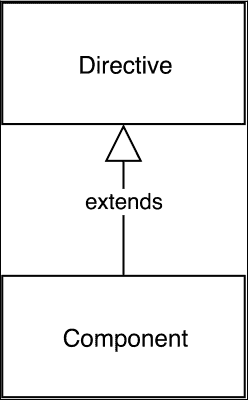
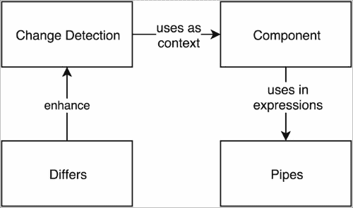
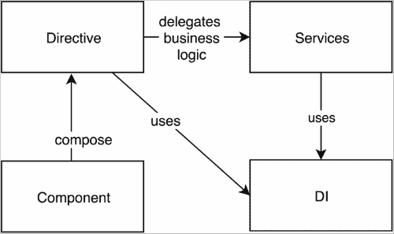
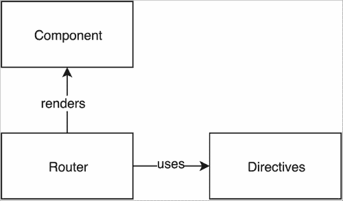
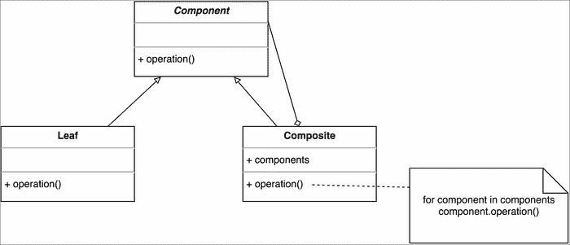
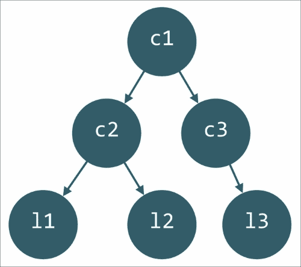

# 第二章：Angular 2 应用程序的构建模块

在上一章中，我们看了 Angular 2 设计决策背后的驱动因素。我们描述了导致开发全新框架的主要原因；Angular 2 利用了 Web 标准，同时牢记过去的经验教训。尽管我们熟悉主要的驱动因素，但我们仍未描述核心 Angular 2 概念。框架的上一个主要版本与 AngularJS 1.x 走了不同的道路，并在用于开发单页面应用程序的基本构建模块中引入了许多变化。

在本章中，我们将研究框架的核心，并简要介绍 Angular 2 的主要组件。本章的另一个重要目的是概述这些概念如何组合在一起，以帮助我们为 Web 应用程序构建专业的用户界面。接下来的几节将概述我们将在本书后面更详细地研究的所有内容。

在本章中，我们将看到：

+   一个框架的概念概述，展示不同概念之间的关系。

+   我们如何将用户界面构建为组件的组合。

+   Angular 2 中指令的路径以及它们与框架先前主要版本相比的接口发生了怎样的变化。

+   导致指令分解为两个不同组件的关注点分离的原因。为了更好地理解这两个概念，我们将演示它们定义的基本语法。

+   改进的变化检测概述，以及它如何涉及指令提供的上下文。

+   什么是 zone，以及为什么它们可以使我们的日常开发过程更容易。

+   管道是什么，以及它们与 AngularJS 1.x 的过滤器有什么关系。

+   Angular 2 中全新的**依赖注入**（**DI**）机制以及它与服务组件的关系。

# Angular 2 的概念概述

在我们深入研究 Angular 2 的不同部分之前，让我们先概述一下它们如何相互配合。让我们看一下下面的图表：



图 1

*图 1*至*图 4*显示了主要的 Angular 2 概念及它们之间的连接。这些图表的主要目的是说明使用 Angular 2 构建单页面应用程序的核心模块及其关系。

**组件**是我们将用来使用 Angular 2 创建应用程序用户界面的主要构建块。组件是指令的直接后继，指令是将行为附加到 DOM 的原始方法。组件通过提供进一步的功能（例如附加模板的视图）来扩展**指令**，该模板可用于呈现指令的组合。视图模板中可以包含不同的表达式。



图 2

上述图表概念上说明了 Angular 2 的**变更检测**机制。它运行`digest`循环，评估特定 UI 组件上下文中注册的表达式。由于 Angular 2 中已经移除了作用域的概念，表达式的执行上下文是与其关联的组件的控制器。

**变更检测**机制可以通过**Differs**进行增强；这就是为什么在图表中这两个元素之间有直接关系的原因。

**管道**是 Angular 2 的另一个组件。我们可以将管道视为 AngularJS 1.x 中的过滤器。管道可以与组件一起使用。我们可以将它们包含在在任何组件上下文中定义的表达式中：



图 3

现在让我们看一下上述图表。**指令**和**组件**将业务逻辑委托给**服务**。这强化了关注点的分离、可维护性和代码的可重用性。**指令**使用框架的**DI**机制接收特定服务实例的引用，并将与它们相关的业务逻辑执行委托给它们。**指令**和**组件**都可以使用**DI**机制，不仅可以注入服务，还可以注入 DOM 元素和/或其他**组件**或**指令**。



图 4

最后，基于组件的路由器用于定义应用程序中的路由。由于**指令**没有自己的模板，因此只有**组件**可以由路由器呈现，代表应用程序中的不同视图。路由器还使用预定义的指令，允许我们在不同视图和应该呈现它们的容器之间定义超链接。

现在我们将更仔细地看看这些概念，看看它们如何共同工作以创建 Angular 2 应用程序，以及它们与其 AngularJS 1.x 前身有何不同。

# 更改指令

AngularJS 1.x 在单页应用程序开发中引入了指令的概念。指令的目的是封装与 DOM 相关的逻辑，并允许我们通过扩展 HTML 的语法和语义来构建用户界面的组合。最初，像大多数创新概念一样，指令被认为是有争议的，因为当使用自定义元素或属性而没有`data-`前缀时，它们会使我们倾向于编写无效的 HTML。然而，随着时间的推移，这个概念逐渐被接受，并证明它是值得留下的。

AngularJS 1.x 中指令实现的另一个缺点是我们可以使用它们的不同方式。这需要理解属性值，它可以是文字，表达式，回调或微语法。这使得工具基本上不可能。

Angular 2 保留了指令的概念，但从 AngularJS 1.x 中吸取了精华，并增加了一些新的想法和语法。Angular 2 指令的主要目的是通过在 ES2015 类中定义自定义逻辑来将行为附加到 DOM。我们可以将这些类视为与指令关联的控制器，并将它们的构造函数视为类似于 AngularJS 1.x 中指令的链接函数。然而，新的指令具有有限的可配置性。它们不允许定义模板，这使得大多数用于定义指令的已知属性变得不必要。指令 API 的简单性并不限制它们的行为，而只是强化了更强的关注点分离。为了补充这种更简单的指令 API，Angular 2 引入了一个更丰富的界面来定义 UI 元素，称为组件。组件通过`Component`元数据扩展了指令的功能，允许它们拥有模板。我们稍后会更深入地研究组件。

Angular 2 指令的语法涉及 ES2016 装饰器。然而，我们也可以使用 TypeScript、ES2015 甚至**ECMAScript** 5 (**ES5**)来实现相同的结果，只是需要多打一些字。以下代码定义了一个简单的指令，使用 TypeScript 编写：

```ts
@Directive({
  selector: '[tooltip]'
})
export class Tooltip {
  private overlay: Overlay;
  @Input()
  private tooltip: string;
  constructor(private el: ElementRef, manager: OverlayManager) {
    this.overlay = manager.get();
  }
  @HostListener('mouseenter')
  onMouseEnter() {
    this.overlay.open(this.el.nativeElement, this.tooltip);
  }
  @HostListener('mouseleave')
  onMouseLeave() {
    this.overlay.close();
  }
}
```

指令可以在我们的模板中使用以下标记：

```ts
<div tooltip="42">Tell me the answer!</div>
```

一旦用户指向标签“告诉我答案！”，Angular 将调用指令定义中的`@HostListener`装饰器下定义的方法。最终，将执行覆盖管理器的 open 方法。由于我们可以在单个元素上有多个指令，最佳实践规定我们应该使用属性作为选择器。

用于定义此指令的替代 ECMAScript 5 语法是：

```ts
var Tooltip = ng.core.Directive({
  selector: '[tooltip]',
  inputs: ['tooltip'],
  host: {
    '(mouseenter)': 'onMouseEnter()',
    '(mouseleave)': 'onMouseLeave()'
  }
})
.Class({
  constructor: [ng.core.ElementRef, Overlay, function (tooltip, el, manager) {
    this.el = el;
    this.overlay = manager.get();
  }],
  onMouseEnter() {
    this.overlay.open(this.el.nativeElement, this.tooltip);
  },
  onMouseLeave() {
    this.overlay.close();
  }
});
```

前面的 ES5 语法演示了 Angular 2 提供的内部 JavaScript**领域特定语言**（**DSL**），以便让我们编写代码而不需要语法，这些语法尚未得到现代浏览器的支持。

我们可以总结说，Angular 2 通过保持将行为附加到 DOM 的概念来保留了指令的概念。1.x 和 2 之间的核心区别是新的语法，以及通过引入组件引入的进一步关注点分离。在第四章中，*了解 Angular 2 组件和指令的基础*，我们将进一步查看指令的 API。我们还将比较使用 ES2016 和 ES5 定义语法的指令。现在让我们来看一下 Angular 2 组件的重大变化。

# 了解 Angular 2 组件

**模型视图控制器**（**MVC**）是最初用于实现用户界面的微架构模式。作为 AngularJS 开发人员，我们每天都在使用此模式的不同变体，最常见的是**模型视图视图模型**（**MVVM**）。在 MVC 中，我们有模型，它封装了我们应用程序的业务逻辑，以及视图，它负责呈现用户界面，接受用户输入，并将用户交互逻辑委托给控制器。视图被表示为组件的组合，这正式称为**组合设计模式**。

让我们看一下下面的结构图，它展示了组合设计模式：



图 5

这里有三个类：

+   一个名为`Component`的抽象类。

+   两个具体的类称为`Leaf`和`Composite`。`Leaf`类是我们即将构建的组件树中的简单终端组件。

`Component`类定义了一个名为`operation`的抽象操作。`Leaf`和`Composite`都继承自`Component`类。然而，`Composite`类还拥有对它的引用。我们甚至可以进一步允许`Composite`拥有对`Component`实例的引用列表，就像图示中所示。`Composite`内部的组件列表可以持有对不同`Composite`或`Leaf`实例的引用，或者持有对扩展了`Component`类或其任何后继类的其他类的实例的引用。在`Composite`内部的`operation`方法的实现中，循环中不同实例的调用操作可能会有不同的行为。这是因为面向对象编程语言中多态性实现的后期绑定机制。

## 组件的作用

够了理论！让我们基于图示的类层次结构构建一个组件树。这样，我们将演示如何利用组合模式来使用简化的语法构建用户界面。我们将在第四章中看到一个类似的例子，*开始使用 Angular 2 组件和指令*：

```ts
Composite c1 = new Composite();
Composite c2 = new Composite();
Composite c3 = new Composite();

c1.components.push(c2);
c1.components.push(c3);

Leaf l1 = new Leaf();
Leaf l2 = new Leaf();
Leaf l3 = new Leaf();

c2.components.push(l1);
c2.components.push(l2);

c3.components.push(l3);
```

上面的伪代码创建了三个`Composite`类的实例和三个`Leaf`类的实例。实例`c1`在组件列表中持有对`c2`和`c3`的引用。实例`c2`持有对`l1`和`l2`的引用，`c3`持有对`l3`的引用：



图 6

上面的图示是我们在片段中构建的组件树的图形表示。这是现代 JavaScript 框架中视图的一个相当简化的版本。然而，它说明了我们如何组合指令和组件的基本原理。例如，在 Angular 2 的上下文中，我们可以将指令视为上面`Leaf`类的实例（因为它们不拥有视图，因此不能组合其他指令和组件），将组件视为`Composite`类的实例。

如果我们更抽象地思考 AngularJS 1.x 中的用户界面，我们会注意到我们使用了相似的方法。我们的视图模板将不同的指令组合在一起，以便向我们应用程序的最终用户提供完全功能的用户界面。

## Angular 2 中的组件

Angular 2 采用了这种方法，引入了称为**组件**的新构建块。组件扩展了我们在上一节中描述的指令概念，并提供了更广泛的功能。这是一个基本的`hello-world`组件的定义：

```ts
@Component({
  selector: 'hello-world',
  template: '<h1>Hello, {{this.target}}!</h1>'
})
class HelloWorld {
  target: string;
  constructor() {
    this.target = 'world';
  }
}
```

我们可以通过在视图中插入以下标记来使用它：

```ts
<hello-world></hello-world>
```

根据最佳实践，我们应该使用一个元素作为组件的选择器，因为我们可能每个 DOM 元素只有一个组件。

使用 Angular 提供的 DSL 的替代 ES5 语法是：

```ts
var HelloWorld = ng.core.
  Component({
    selector: 'hello-world',
    template: '<h1>Hello, {{target}}!</h1>'
  })
  .Class({
    constructor: function () {
      this.target = 'world';
    }
  });
```

我们将在本书的后面更详细地看一下前面的语法。然而，让我们简要描述一下这个组件提供的功能。一旦 Angular 2 应用程序已经启动，它将查看我们 DOM 树中的所有元素并处理它们。一旦找到名为`hello-world`的元素，它将调用与其定义相关联的逻辑，这意味着组件的模板将被呈现，并且花括号之间的表达式将被评估。这将导致标记`<h1>Hello, world!</h1>`。

因此，Angular 核心团队将 AngularJS 1.x 中的指令分成了两个不同的部分——**组件**和**指令**。指令提供了一种简单的方法来将行为附加到 DOM 元素而不定义视图。Angular 2 中的组件提供了一个强大而简单易学的 API，使我们更容易定义应用程序的用户界面。Angular 2 组件允许我们做与 AngularJS 1.x 指令相同的惊人的事情，但输入更少，学习更少。组件通过向其添加视图来扩展 Angular 2 指令概念。我们可以将 Angular 2 组件和指令之间的关系看作是我们在*图 5*中看到的`Composite`和`Leaf`之间的关系。

如果我们开始阐述 Angular 2 提供的构建块的概念模型，我们可以将指令和组件之间的关系呈现为继承。第四章*开始使用 Angular 2 组件和指令*更详细地描述了这两个概念。

# 管道

在业务应用中，我们经常需要对相同的数据进行不同的可视化表示。例如，如果我们有数字 100,000，并且想要将其格式化为货币，很可能我们不想将其显示为普通数据；更可能的是，我们想要类似$100,000 这样的东西。

在 AngularJS 1.x 中，格式化数据的责任被分配给了过滤器。另一个数据格式化需求的例子是当我们使用项目集合时。例如，如果我们有一个项目列表，我们可能想要根据谓词（布尔函数）对其进行过滤；在数字列表中，我们可能只想显示素数。AngularJS 1.x 有一个名为`filter`的过滤器，允许我们这样做。然而，名称的重复经常导致混淆。这也是核心团队将过滤器组件重命名为**管道**的另一个原因。

新名称背后的动机是管道和过滤器所使用的语法：

```ts
{{expression | decimal | currency}}
```

在前面的例子中，我们将管道`decimal`和`currency`应用到`expression`返回的值上。花括号之间的整个表达式看起来像 Unix 管道语法。

## 定义管道

定义管道的语法类似于指令和组件的定义所使用的语法。为了创建一个新的管道，我们可以使用 ES2015 装饰器`@Pipe`。它允许我们向类添加元数据，声明它为管道。我们所需要做的就是为管道提供一个名称并定义数据格式化逻辑。还有一种替代的 ES5 语法，如果我们想跳过转译的过程，可以使用它。

在运行时，一旦 Angular 2 表达式解释器发现给定表达式包含对管道的调用，它将从组件内分配的管道集合中检索出它，并使用适当的参数调用它。

下面的例子说明了我们如何定义一个简单的管道叫做`lowercase1`，它将传递给它的字符串转换为小写表示：

```ts
@Pipe({ name: 'lowercase1' })
class LowerCasePipe1 implements PipeTransform {
  transform(value: string): string {
    if (!value) return value;
    if (typeof value !== 'string') {
      throw new Error('Invalid pipe value', value);
    }
    return value.toLowerCase();
  }
}
```

为了保持一致，让我们展示定义管道的 ECMAScript 5 语法：

```ts
var LowercasePipe1 = ng.core.
  Pipe({
    name: 'lowercase'
  })
  .Class({
    constructor: function () {},
    transform: function (value) {
      if (!value) return value;
      if (typeof value === 'string') {
        throw new Error('Invalid pipe value', value);
      }
      return value.toLowerCase();
    }
  });
```

在 TypeScript 语法中，我们实现了`PipeTransform`接口，并定义了其中声明的`transform`方法。然而，在 ECMAScript 5 中，我们不支持接口，但我们仍然需要实现`transform`方法以定义一个有效的 Angular 2 管道。我们将在下一章中解释 TypeScript 接口。

现在让我们演示如何在组件中使用`lowercase1`管道：

```ts
@Component({
  selector: 'app',
  pipes: [LowercasePipe1],
  template: '<h1>{{"SAMPLE" | lowercase1}}</h1>'
})
class App {}
```

而且，这个的 ECMAScript 5 的替代语法是：

```ts
var App = ng.core.Component({
  selector: 'app',
  pipes: [LowercasePipe1],
  template: '<h1>{{"SAMPLE" | lowercase1}}</h1>'
})
.Class({
  constructor: function () {}
});
```

我们可以使用以下标记来使用`App`组件：

```ts
   <app></app>
```

我们将在屏幕上看到的结果是`h1`元素中的文本示例。

通过将数据格式化逻辑保持为一个独立的组件，Angular 2 保持了强大的关注点分离。我们将在第七章中看看如何为我们的应用程序定义有状态和无状态管道，*在探索管道和 http 的同时构建一个真实的应用程序*。

# 更改检测

正如我们之前所看到的，MVC 中的视图会根据从模型接收到的更改事件进行更新。许多**Model View Whatever**（**MVW**）框架采用了这种方法，并将观察者模式嵌入到了它们的更改检测机制的核心中。

## 经典的更改检测

让我们看一个简单的例子，不使用任何框架。假设我们有一个名为`User`的模型，它有一个名为`name`的属性：

```ts
class User extends EventEmitter {
  private name: string;
  setName(name: string) {
    this.name = name;
    this.emit('change');
	}
  getName(): string {
    return this.name;}
}
```

前面的片段使用了 TypeScript。如果语法对你来说不太熟悉，不用担心，我们将在下一章中对这种语言进行介绍。

`user`类扩展了`EventEmitter`类。这提供了发出和订阅事件的基本功能。

现在让我们定义一个视图，显示作为其`constructor`参数传递的`User`类实例的名称：

```ts
class View {
  constructor(user: User, el: Element /* a DOM element */) {
    el.innerHTML = user.getName();
	}
}
```

我们可以通过以下方式初始化视图元素：

```ts
let user = new User();
user.setName('foo');
let view = new View(user, document.getElementById('label'));
```

最终结果是，用户将看到一个带有内容`foo`的标签。但是，用户的更改不会反映在视图中。为了在用户更改名称时更新视图，我们需要订阅更改事件，然后更新 DOM 元素的内容。我们需要以以下方式更新`View`定义：

```ts
class View {
  constructor(user:User, el:any /* a DOM element */) {
    el.innerHTML = user.getName();
    user.on('change', () => {
      el.innerHTML = user.getName();
	  });
  }
}
```

这是大多数框架在 AngularJS 1.x 时代实现它们的更改检测的方式。

## AngularJS 1.x 更改检测

大多数初学者都对 AngularJS 1.x 中的数据绑定机制着迷。基本的 Hello World 示例看起来类似于这样：

```ts
function MainCtrl($scope) {
  $scope.label = 'Hello world!';
}

<body ng-app ng-controller="MainCtrl">
  {{label}}
</body>
```

如果你运行这个，`Hello world!`神奇地出现在屏幕上。然而，这甚至不是最令人印象深刻的事情！如果我们添加一个文本输入，并将它绑定到作用域的`label`属性，每次更改都会反映出插值指令显示的内容：

```ts
<body ng-controller="MainCtrl">
  <input ng-model="label">
  {{label}}
</body>
```

这是 AngularJS 1.x 的主要卖点之一——极其容易实现数据绑定。我们在标记中添加了两个（如果计算`ng-controller`和`ng-app`则为四个）属性，将属性添加到一个名为`$scope`的神秘对象中，这个对象被神奇地传递给我们定义的自定义函数，一切都很简单！

然而，更有经验的 Angular 开发人员更好地理解了幕后实际发生的事情。在前面的例子中，在指令`ng-model`和`ng-bind`（在我们的例子中，插值指令`{{}}`）内部，Angular 添加了具有不同行为的观察者，关联到相同的表达式`label`。这些观察者与经典 MVC 模式中的观察者非常相似。在某些特定事件（在我们的例子中，文本输入内容的更改）上，AngularJS 将循环遍历所有这样的观察者，评估它们关联的表达式在给定作用域的上下文中的结果，并存储它们的结果。这个循环被称为`digest`循环。

在前面的例子中，表达式`label`在作用域的上下文中的评估将返回文本`Hello world!`。在每次迭代中，AngularJS 将当前评估结果与先前结果进行比较，并在值不同时调用关联的回调。例如，插值指令添加的回调将设置元素的内容为表达式评估的新结果。这是两个指令的观察者的回调之间的依赖关系的一个例子。`ng-model`添加的观察者的回调修改了插值指令添加的观察者关联的表达式的结果。

然而，这种方法也有其自身的缺点。我们说`digest`循环将在一些特定事件上被调用，但如果这些事件发生在框架之外呢？例如，如果我们使用`setTimeout`，并且在作为第一个参数传递的回调函数内部更改了我们正在监视的作用域附加的属性，那会怎么样？AngularJS 将不知道这个变化，并且不会调用`digest`循环，所以我们需要使用`$scope.$apply`来显式地做这件事。但是，如果框架知道浏览器中发生的所有异步事件，比如用户事件、`XMLHttpRequest`事件、`WebSockets`相关事件等，会怎样呢？在这种情况下，AngularJS 将能够拦截事件处理，并且可以在不强制我们这样做的情况下调用`digest`循环！

### 在 zone.js 中

在 Angular 2 中，情况确实如此。这种功能是通过使用`zone.js`来实现的。

在 2014 年的 ng-conf 上，Brian Ford 谈到了 zone。Brian 将 zone 呈现为浏览器 API 的元猴补丁。最近，Miško Hevery 向 TC39 提出了更成熟的 zone API 以供标准化。`Zone.js`是由 Angular 团队开发的一个库，它在 JavaScript 中实现了 zone。它们代表了一个执行上下文，允许我们拦截异步浏览器调用。基本上，通过使用 zone，我们能够在给定的`XMLHttpRequest`完成后或者当我们接收到新的`WebSocket`事件时立即调用一段逻辑。Angular 2 利用了`zone.js`，通过拦截异步浏览器事件，并在合适的时机调用`digest`循环。这完全消除了使用 Angular 的开发人员需要显式调用`digest`循环的需要。

### 简化的数据流

交叉观察者依赖关系可能在我们的应用程序中创建纠缠不清的数据流，难以跟踪。这可能导致不可预测的行为和难以发现的错误。尽管 Angular 2 保留了脏检查作为实现变更检测的一种方式，但它强制了单向数据流。这是通过不允许不同观察者之间的依赖关系，从而使`digest`循环只运行一次。这种策略极大地提高了我们应用程序的性能，并减少了数据流的复杂性。Angular 2 还改进了内存效率和`digest`循环的性能。有关 Angular 2 的变更检测和其实现所使用的不同策略的更多详细信息，可以在第四章中找到，《开始使用 Angular 2 组件和指令》。

## 增强 AngularJS 1.x 的变更检测

现在让我们退一步，再次思考一下框架的变更检测机制。

我们说在`digest`循环内，Angular 评估注册的表达式，并将评估的值与上一次循环中与相同表达式关联的值进行比较。

比较所使用的最优算法可能取决于表达式评估返回的值的类型。例如，如果我们得到一个可变的项目列表，我们需要循环遍历整个集合，并逐个比较集合中的项目，以验证是否有更改。然而，如果我们有一个不可变的列表，我们可以通过比较引用来执行具有恒定复杂度的检查。这是因为不可变数据结构的实例不能改变。我们不会应用意图修改这些实例的操作，而是会得到一个应用了修改的新引用。

在 AngularJS 1.x 中，我们可以使用几种方法添加监视器。其中两种是`$watch(exp, fn, deep)`或`$watchCollection(exp, fn)`。这些方法让我们在改变检测的执行上有一定程度的控制。例如，使用`$watch`添加一个监视器，并将`false`值作为第三个参数传递将使 AngularJS 执行引用检查（即使用`===`比较当前值与先前值）。然而，如果我们传递一个真值（任何`true`值），检查将是深层的（即使用`angular.equals`）。这样，根据表达式值的预期类型，我们可以以最合适的方式添加监听器，以便允许框架使用最优化的算法执行相等性检查。这个 API 有两个限制：

+   它不允许您在运行时选择最合适的相等性检查算法。

+   它不允许您将改变检测扩展到第三方以适应其特定的数据结构。

Angular 核心团队将这一责任分配给了差异，使它们能够扩展改变检测机制并根据我们在应用程序中使用的数据进行优化。Angular 2 定义了两个基类，我们可以扩展以定义自定义算法：

+   `KeyValueDiffer`：这允许我们在基于键值的数据结构上执行高级差异。

+   `IterableDiffer`：这允许我们在类似列表的数据结构上执行高级差异。

Angular 2 允许我们通过扩展自定义算法来完全控制改变检测机制，而在框架的先前版本中是不可能的。我们将进一步研究改变检测以及如何在第四章中配置它，*开始使用 Angular 2 组件和指令*。

# 理解服务

服务是 Angular 为定义应用程序的业务逻辑提供的构建块。在 AngularJS 1.x 中，我们有三种不同的方式来定义服务：

```ts
// The Factory method
module.factory('ServiceName', function (dep1, dep2, …) {
  return {
    // public API
  };
});

// The Service method
module.service('ServiceName', function (dep1, dep2, …) {
  // public API
  this.publicProp = val;
});

// The Provider method
module.provider('ServiceName', function () {
  return {
    $get: function (dep1, dep2, …) {
      return {
        // public API
      };
    }
  };
});
```

尽管前两种语法变体提供了类似的功能，但它们在注册指令实例化的方式上有所不同。第三种语法允许在配置时间进一步配置注册的提供者。

对于 AngularJS 1.x 的初学者来说，有三种不同的定义服务的方法是相当令人困惑的。让我们想一想是什么促使引入这些注册服务方法。为什么我们不能简单地使用 JavaScript 构造函数、对象文字或 ES2015 类，而 Angular 不会意识到呢？我们可以像这样在自定义 JavaScript 构造函数中封装我们的业务逻辑：

```ts
function UserTransactions(id) {
  this.userId = id;
}
UserTransactions.prototype.makeTransaction = function (amount) {
  // method logic
};

module.controller('MainCtrl', function () {
  this.submitClick = function () {
    new UserTransactions(this.userId).makeTransaction(this.amount);
  };
});
```

这段代码是完全有效的。然而，它没有利用 AngularJS 1.x 提供的一个关键特性——DI 机制。`MainCtrl`函数使用了构造函数`UserTransaction`，它在其主体中可见。上述代码有两个主要缺点：

+   我们与服务实例化的逻辑耦合在一起。

+   这段代码无法进行测试。为了模拟`UserTransactions`，我们需要对其进行 monkey patch。

AngularJS 如何处理这两个问题？当需要一个特定的服务时，通过框架的 DI 机制，AngularJS 解析所有的依赖关系，并通过将它们传递给`factory`函数来实例化它。`factory`函数作为`factory`和`service`方法的第二个参数传递。`provider`方法允许在更低级别定义服务；在那里，`factory`方法是提供者的`$get`属性下的方法。

就像 AngularJS 1.x 一样，Angular 2 也容忍这种关注点的分离，所以核心团队保留了服务。与 AngularJS 1.x 相比，这个框架的最新主要版本通过允许我们使用纯粹的 ES2015 类或 ES5 构造函数来定义服务，提供了一个更简单的接口。我们无法逃避这样一个事实，即我们需要明确声明哪些服务应该可用于注入，并以某种方式指定它们的实例化指令。然而，Angular 2 使用 ES2016 装饰器的语法来实现这一目的，而不是我们从 AngularJS 1.x 熟悉的方法。这使我们能够像 ES2015 类一样简单地在我们的应用程序中定义服务，并使用装饰器来配置 DI：

```ts
import {Inject, Injectable} from 'angular2/core';

@Injectable()
class HttpService {
  constructor() { /* … */ }
}

@Injectable()
class User {
  constructor(private service: HttpService) {}
  save() {
    return this.service.post('/users')
      .then(res => {
        this.id = res.id;
        return this;
      });
  }
}
```

ECMAScript 5 的替代语法是：

```ts
var HttpService = ng.core.Class({
  constructor: function () {}
});
var User = ng.core.Class({
  constructor: [HttpService, function (service) {
    this.service = service;
  }],
  save: function () {
    return this.service.post('/users')
      .then(function (res) {
        this.id = res.id;
        return this;
      });
  }
});
```

服务与前面章节中描述的组件和指令相关联。为了开发高度一致和可重用的 UI 组件，我们需要将所有与业务相关的逻辑移动到我们的服务中。为了开发可测试的组件，我们需要利用 DI 机制来解决它们的所有依赖关系。

Angular 2 和 AngularJS 1.x 中服务之间的一个核心区别是它们的依赖项是如何被解析和内部表示的。AngularJS 1.x 使用字符串来标识不同的服务和用于实例化它们的相关工厂。然而，Angular 2 使用键。通常，这些键是不同服务的类型。在实例化中的另一个核心区别是注入器的分层结构，它封装了具有不同可见性的不同依赖项提供者。

Angular 2 和框架的最后两个主要版本之间的另一个区别是简化的语法。虽然 Angular 2 使用 ES2015 类来定义业务逻辑，但您也可以使用 ECMAScript 5 的`constructor`函数，或者使用框架提供的 DSL。Angular 2 中的 DI 具有完全不同的语法，并通过提供一种一致的方式来注入依赖项来改进行为。前面示例中使用的语法使用了 ES2016 装饰器，在第五章中，我们将看一下使用 ECMAScript 5 的替代语法。您还可以在第五章中找到有关 Angular 2 服务和 DI 的更详细解释，*Angular 2 中的依赖注入*。

# 理解基于组件的新路由器

在传统的 Web 应用程序中，所有页面更改都与完整页面重新加载相关，这会获取所有引用的资源和数据，并将整个页面呈现到屏幕上。然而，随着时间的推移，Web 应用程序的要求已经发生了变化。

我们使用 Angular 构建的**单页应用程序**（**SPA**）模拟桌面用户体验。这经常涉及按需加载应用程序所需的资源和数据，并且在初始页面加载后不进行完整的页面重新加载。通常，SPA 中的不同页面或视图由不同的模板表示，这些模板是异步加载并在屏幕上的特定位置呈现。稍后，当加载了所有所需资源的模板并且路由已更改时，将调用附加到所选页面的逻辑，并使用数据填充模板。如果用户在加载了我们的 SPA 中的给定页面后按下刷新按钮，则在视图完成刷新后需要重新呈现相同的页面。这涉及类似的行为——查找请求的视图，获取所有引用资源的所需模板，并调用与该视图相关的逻辑。

需要获取哪个模板，以及在页面成功重新加载后应调用的逻辑，取决于用户在按下刷新按钮之前选择的视图。框架通过解析页面 URL 来确定这一点，该 URL 包含当前选定页面的标识符，以分层结构表示。

与导航、更改 URL、加载适当模板和在视图加载时调用特定逻辑相关的所有责任都分配给了路由器组件。这些都是相当具有挑战性的任务，为了跨浏览器兼容性而需要支持不同的导航 API，使得在现代 SPA 中实现路由成为一个非平凡的问题。

AngularJS 1.x 在其核心中引入了路由器，后来将其外部化为`ngRoute`组件。它允许以声明方式定义 SPA 中的不同视图，为每个页面提供模板和需要在选择页面时调用的逻辑。然而，路由器的功能有限。它不支持诸如嵌套视图路由之类的基本功能。这是大多数开发人员更喜欢使用由社区开发的`ui-router`的原因之一。AngularJS 1.x 的路由器和`ui-router`的路由定义都包括路由配置对象，该对象定义了与页面关联的模板和控制器。

如前几节所述，Angular 2 改变了它为开发单页应用程序提供的构建模块。Angular 2 移除了浮动控制器，而是将视图表示为组件的组合。这需要开发一个全新的路由器，以赋予这些新概念力量。

AngularJS 1.x 路由器和 Angular 2 路由器之间的核心区别是：

+   Angular 2 路由器是基于组件的，而`ngRoute`不是。

+   现在支持嵌套视图。

+   ES2016 装饰器赋予了不同的语法。

## Angular 2 路由定义语法

让我们简要地看一下 Angular 2 路由器在我们应用程序中定义路由时使用的新语法：

```ts
import {Component} from 'angular2/core';
import {bootstrap} from 'angular2/platform/browser';
import {RouteConfig, ROUTER_DIRECTIVES, ROUTER_BINDINGS} from 'angular2/router';

import {Home} from './components/home/home';
import {About} from './components/about/about';

@Component({
  selector: 'app',
  templateUrl: './app.html',
  directives: [ROUTER_DIRECTIVES]
})
@RouteConfig([
  { path: '/', component: Home, name: 'home' },
  { path: '/about', component: About, name: 'about' }
])
class App {}

bootstrap(App, [ROUTER_PROVIDERS]);
```

我们不会在这里详细介绍，因为第六章、*Angular 2 表单和基于组件的新路由器*和第七章、*在探索管道和 http 的同时构建一个真实的应用程序*专门讨论了新路由器，但让我们提到前面代码片段中的主要要点。

路由器位于模块`angular2/router`中。在那里，我们可以找到它定义的指令，用于配置路由的装饰器和`ROUTER_PROVIDERS`。

### 注意

我们将在第七章中进一步了解`ROUTER_PROVIDERS`，*在探索管道和 http 的同时构建一个真实的应用程序*。

`@RouteConfig`装饰器传递的参数显示了我们如何在应用程序中定义路由。我们使用一个包含对象的数组，它定义了路由和与其关联的组件之间的映射关系。在`Component`装饰器内部，我们明确说明我们要使用`ROUTER_DIRECTIVES`中包含的指令，这些指令与模板中的路由器使用相关。

# 总结

在本章中，我们快速概述了 Angular 2 提供的开发单页应用程序的主要构建模块。我们指出了 AngularJS 1.x 和 Angular 2 中这些组件之间的核心区别。

虽然我们可以使用 ES2015，甚至 ES5 来构建 Angular 2 应用程序，但 Google 的建议是利用用于开发框架的语言—TypeScript。

在下一章中，我们将看一下 TypeScript 以及如何在您的下一个应用程序中开始使用它。我们还将解释如何利用 JavaScript 库和框架中的静态类型，这些库和框架是用原生 JavaScript 编写的，带有环境类型注释。
