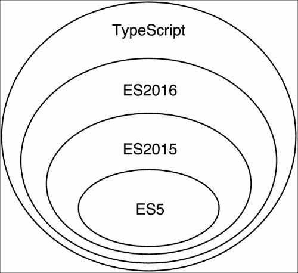

# 第三章：TypeScript Crash Course

在本章中，我们将开始使用 TypeScript，这是 Angular 2 推荐的脚本语言。ECMAScript 2015 和 ECMAScript 2016 提供的所有功能，如函数、类、模块和装饰器，已经在 TypeScript 中实现或添加到路线图中。由于额外的类型注解，与 JavaScript 相比，有一些语法上的补充。

为了更顺畅地从我们已经了解的语言 ES5 过渡，我们将从 ES2016 和 TypeScript 之间的一些共同特性开始。在 ES 语法和 TypeScript 之间存在差异的地方，我们将明确提到。在本章的后半部分，我们将为我们到目前为止学到的所有内容添加类型注解。

在本章的后面，我们将解释 TypeScript 提供的额外功能，如静态类型和扩展语法。我们将讨论基于这些功能的不同后果，这将帮助我们更加高效和减少出错。让我们开始吧！

# TypeScript 简介

TypeScript 是一种由微软开发和维护的开源编程语言。它最初是在 2012 年 10 月公开发布的。TypeScript 是 ECMAScript 的超集，支持 JavaScript 的所有语法和语义，还有一些额外的功能，如静态类型和更丰富的语法。

图 1 显示了 ES5、ES2015、ES2016 和 TypeScript 之间的关系。



图 1

由于 TypeScript 是静态类型的，它可以为我们作为 JavaScript 开发人员提供许多好处。现在让我们快速看一下这些好处。

## 编译时类型检查

我们在编写 JavaScript 代码时常犯的一些常见错误是拼错属性或方法名。当我们遇到运行时错误时，我们会发现这个错误。这可能发生在开发过程中，也可能发生在生产环境中。希望在部署代码到生产环境之前我们能知道错误并不是一种舒适的感觉！然而，这不是 JavaScript 特有的问题；这是所有动态语言共有的问题。即使有很多单元测试，这些错误也可能会漏掉。

TypeScript 提供了一个编译器，通过静态代码分析来为我们处理这些错误。如果我们利用静态类型，TypeScript 将意识到给定对象具有的现有属性，如果我们拼错了其中任何一个，编译器将在编译时警告我们。

TypeScript 的另一个巨大好处是它允许大型团队合作，因为它提供了正式的、可验证的命名。这样，它允许我们编写易于理解的代码。

## 文本编辑器和集成开发环境提供更好的支持

有许多工具，如 Tern 或 Google Closure Compiler，它们试图为文本编辑器和集成开发环境提供更好的 JavaScript 自动补全支持。然而，由于 JavaScript 是一种动态语言，没有任何元数据，文本编辑器和集成开发环境无法提出复杂的建议。

用这些元数据注释代码是 TypeScript 的内置特性，称为类型注解。基于它们，文本编辑器和集成开发环境可以对我们的代码进行更好的静态分析。这提供了更好的重构工具和自动补全，这增加了我们的生产力，使我们在编写应用程序源代码时犯更少的错误。

## TypeScript 甚至更多

TypeScript 本身还有许多其他好处：

+   它是 JavaScript 的超集：所有 JavaScript（ES5 和 ES2015）程序已经是有效的 TypeScript 程序。实质上，您已经在编写 TypeScript 代码。由于它基于 ECMAScript 标准的最新版本，它允许我们利用语言提供的最新的前沿语法。

+   支持可选类型检查：如果出于任何原因，我们决定不想明确定义变量或方法的类型，我们可以跳过类型定义。然而，我们应该意识到这意味着我们不再利用静态类型，因此放弃了前面提到的所有好处。

+   由微软开发和维护：语言实现的质量非常高，不太可能会突然停止支持。TypeScript 基于世界上一些最优秀的编程语言开发专家的工作。

+   **它是开源的**：这允许社区自由地为语言做出贡献并提出功能，这些功能是以开放的方式讨论的。TypeScript 是开源的事实使得第三方扩展和工具更容易开发，从而进一步扩展了其使用范围。

由于现代浏览器不支持 TypeScript 本地，因此有一个编译器将我们编写的 TypeScript 代码转换为预定义版本的 ECMAScript 可读的 JavaScript。一旦代码编译完成，所有类型注释都将被移除。

# 使用 TypeScript

让我们开始编写一些 TypeScript！

在接下来的章节中，我们将看一些展示 TypeScript 功能的不同片段。为了能够运行这些片段并自己玩耍，您需要在计算机上安装 TypeScript 编译器。让我们看看如何做到这一点。

最好使用**Node Package Manager**（**npm**）安装 TypeScript。我建议您使用 npm 版本 3.0.0 或更新版本。如果您尚未安装 node.js 和 npm，可以访问[`nodejs.org`](https://nodejs.org)并按照那里的说明进行操作。

## 使用 npm 安装 TypeScript

一旦您安装并运行了 npm，请通过打开终端窗口并运行以下命令来验证您是否拥有最新版本：

```ts
**$ npm –v**

```

要安装 TypeScript 1.8，请使用：

```ts
**$ npm install -g typescript@1.8**

```

上述命令将安装 TypeScript 编译器，并将其可执行文件（`tsc`）添加为全局路径。

为了验证一切是否正常工作，您可以使用：

```ts
**$ tsc –v**
**Version 1.8.0**

```

输出应该类似于上面的输出，尽管可能使用不同的版本。

## 运行我们的第一个 TypeScript 程序

### 注意

您可以在以下 URL 找到本书的代码：[`github.com/mgechev/switching-to-angular2`](https://github.com/mgechev/switching-to-angular2)。在大多数代码片段中，您会找到一个相对于`app`目录的文件路径，您可以在那里找到它们。

现在，让我们编译我们的第一个 TypeScript 程序！创建一个名为`hello.ts`的文件，并输入以下内容：

```ts
// ch3/hello-world/hello-world.ts
console.log('Hello world!');
```

由于您已经安装了 TypeScript 编译器，您应该有一个名为`tsc`的全局可执行命令。您可以使用它来编译文件：

```ts
**$ tsc hello.ts**

```

现在，你应该在`hello.ts`所在的同一目录中看到文件`hello.js`。`hello.js`是 TypeScript 编译器的输出；它包含了你编写的 TypeScript 的 JavaScript 等价物。你可以使用以下命令运行这个文件：

```ts
**$ node hello.js**

```

现在，你会在屏幕上看到字符串`Hello world!`。为了结合编译和运行程序的过程，你可以使用`ts-node`包：

```ts
**$ npm install -t ts-node**

```

现在你可以运行：

```ts
**$ ts-node hello.ts**

```

你应该看到相同的结果，但是没有存储在磁盘上的`ts-node`文件。

# TypeScript 语法和特性是由 ES2015 和 ES2016 引入的。

由于 TypeScript 是 JavaScript 的超集，在我们开始学习它的语法之前，先介绍 ES2015 和 ES2016 中的一些重大变化会更容易一些；要理解 TypeScript，我们首先必须理解 ES2015 和 ES2016。在深入学习 TypeScript 之前，我们将快速浏览这些变化。

本书不涵盖 ES2015 和 ES2016 的详细解释。为了熟悉所有新特性和语法，我强烈建议你阅读*Exploring ES6: upgrade to the next version of JavaScript* by *Dr. Axel Rauschmayer*。

接下来的几页将介绍新的标准，并让你利用大部分你在开发 Angular 2 应用程序中需要的特性。

## ES2015 箭头函数

JavaScript 具有一级函数，这意味着它们可以像其他值一样传递：

```ts
// ch3/arrow-functions/simple-reduce.ts
var result = [1, 2, 3].reduce(function (total, current) {
  return total + current;
}, 0); // 6
```

这种语法很棒；但是有点太啰嗦了。ES2015 引入了一种新的语法来定义匿名函数，称为箭头函数语法。使用它，我们可以创建匿名函数，就像下面的例子中所示：

```ts
// ch3/arrow-functions/arrow-functions.ts

// example 1
var result = [1, 2, 3]
  .reduce((total, current) => total + current, 0);

console.log(result);

// example 2
var even = [3, 1, 56, 7].filter(el => !(el % 2));

console.log(even);

// example 3
var sorted = data.sort((a, b) => {
  var diff = a.price - b.price;
  if (diff !== 0) {
    return diff;
  }
  return a.total - b.total;
});
```

在第一个例子中，我们得到了数组`[1, 2, 3]`中元素的总和。在第二个例子中，我们得到了数组`[3, 1, 56, 7]`中所有的偶数。在第三个例子中，我们按照属性`price`和`total`的升序对数组进行了排序。

箭头函数还有一些我们需要看看的特性。其中最重要的一个是它们会保持周围代码的上下文(`this`)。

```ts
// ch3/arrow-functions/context-demo.ts
function MyComponent() {
  this.age = 42;
  setTimeout(() => {
    this.age += 1;
    console.log(this.age);
  }, 100);
}
new MyComponent(); // 43 in 100ms.
```

例如，当我们使用`new`操作符调用函数`MyComponent`时，`this`将指向调用实例化的新对象。箭头函数将保持上下文(`this`)，在`setTimeout`的回调中，屏幕上会打印**43**。

这在 Angular 2 中非常有用，因为给定组件的绑定上下文是其实例（即其`this`）。如果我们将`MyComponent`定义为 Angular 2 组件，并且我们有一个绑定到`age`属性，前面的代码将是有效的，并且所有绑定将起作用（请注意，我们没有作用域，也没有显式调用`$digest`循环，尽管我们直接调用了`setTimeout`）。

## 使用 ES2015 和 ES2016 类

当初次接触 JavaScript 的开发人员听说语言赋予了**面向对象**（**OO**）范式的能力时，当他们发现没有类的定义语法时，他们通常会感到困惑。这种看法是由于一些最流行的编程语言，如 Java、C#和 C++，具有用于构建对象的类的概念。然而，JavaScript 以不同的方式实现了面向对象范式。JavaScript 具有基于原型的面向对象编程模型，我们可以使用对象字面量语法或函数（也称为构造函数）来实例化对象，并且我们可以利用所谓的原型链来实现继承。

虽然这是一种实现面向对象范式的有效方式，语义与经典面向对象模型中的方式类似，但对于经验不足的 JavaScript 开发人员来说，他们不确定如何正确处理这一点，这是 TC39 决定提供一种替代语法来利用语言中的面向对象范式的原因之一。在幕后，新的语法与我们习惯的语法具有相同的语义，比如使用构造函数和基于原型的继承。然而，它提供了一种更方便的语法，以减少样板代码来增强面向对象范式的特性。

ES2016 为 ES2015 类添加了一些额外的语法，例如静态和实例属性声明。

以下是一个示例，演示了 ES2016 中用于定义类的语法：

```ts
// ch3/es6-classes/sample-classes.ts

class Human {
  static totalPeople = 0;
  _name; // ES2016 property declaration syntax
  constructor(name) {
    this._name = name;
    Human.totalPeople += 1;
  }
  get name() {
    return this._name;
  }
  set name(val) {
    this._name = val;
  }
  talk() {
    return `Hi, I'm ${this.name}!`;
  }
}

class Developer extends Human {
  _languages; // ES2016 property declaration syntax
  constructor(name, languages) {
    super(name);
    this._languages = languages;
  }
  get languages() {
    return this._languages;
  }
  talk() {
    return `${super.talk()} And I know
${this.languages.join(',')}.`;
  }
}
```

在 ES2015 中，不需要显式声明`_name`属性；然而，由于 TypeScript 编译器在编译时应该知道给定类的实例的现有属性，我们需要将属性的声明添加到类声明本身中。

前面的片段既是有效的 TypeScript 代码，也是 JavaScript 代码。 在其中，我们定义了一个名为`Human`的类，它向由它实例化的对象添加了一个属性。 它通过将其值设置为传递给其构造函数的参数名称来实现这一点。

现在，打开`ch3/es6-classes/sample-classes.ts`文件并进行操作！ 您可以以与使用构造函数创建对象相同的方式创建类的不同实例：

```ts
var human = new Human("foobar");
var dev = new Developer("bar", ["JavaScript"]);
console.log(dev.talk());
```

为了执行代码，请运行以下命令：

```ts
**$ ts-node sample-classes.ts**

```

类通常在 Angular 2 中使用。 您可以使用它们来定义组件，指令，服务和管道。 但是，您还可以使用替代的 ES5 语法，该语法利用构造函数。 在幕后，一旦 TypeScript 代码被编译，两种语法之间将没有太大的区别，因为 ES2015 类最终被转译为构造函数。

## 使用块作用域定义变量

JavaScript 对具有不同背景的开发人员来说另一个令人困惑的地方是语言中的变量作用域。 例如，在 Java 和 C ++中，我们习惯于块词法作用域。 这意味着在特定块内定义的给定变量只在该块内以及其中的所有嵌套块内可见。

然而，在 JavaScript 中，情况有些不同。 ECMAScript 定义了一个具有类似语义的函数词法作用域，但它使用函数而不是块。 这意味着我们有以下内容：

```ts
// ch3/let/var.ts

var fns = [];
for (var i = 0; i < 5; i += 1) {
  fns.push(function() {
    console.log(i);
  })
}
fns.forEach(fn => fn());
```

这有一些奇怪的含义。 一旦代码被执行，它将记录五次数字`5`。

ES2015 添加了一种新的语法来定义具有块作用域可见性的变量。 语法与当前的语法类似。 但是，它使用关键字`let`而不是`var`：

```ts
// ch3/let/let.ts

var fns = [];
for (let i = 0; i < 5; i += 1) {
  fns.push(function() {
    console.log(i);
  })
}
fns.forEach(fn => fn());
```

# 使用 ES2016 装饰器进行元编程

JavaScript 是一种动态语言，允许我们轻松修改和/或改变行为以适应我们编写的程序。 装饰器是 ES2016 的一个提案，根据设计文档[`github.com/wycats/javascript-decorators`](https://github.com/wycats/javascript-decorators)：

> *“…使注释和修改类和属性在设计时成为可能。”*

它们的语法与 Java 中的注解非常相似，甚至更接近 Python 中的装饰器。ES2016 装饰器在 Angular 2 中通常用于定义组件、指令和管道，并利用框架的依赖注入机制。基本上，装饰器的大多数用例涉及改变行为以预定义逻辑或向不同的结构添加一些元数据。

ES2016 装饰器允许我们通过改变程序的行为来做很多花哨的事情。典型的用例可能是将给定的方法或属性标注为已弃用或只读。一组预定义的装饰器可以提高我们所生成的代码的可读性，可以在*Jay Phelps*的名为*core-decorators.js*的项目中找到。另一个用例是利用基于代理的面向方面编程，使用声明性语法。提供此功能的库是`aspect.js`。

总的来说，ES2016 装饰器只是另一种语法糖，它转换成我们已经熟悉的来自 JavaScript 之前版本的代码。让我们看一个来自提案草案的简单示例：

```ts
// ch3/decorators/nonenumerable.ts

class Person {
  @nonenumerable
  get kidCount() {
    return 42;
  }
}

function nonenumerable(target, name, descriptor) {
  descriptor.enumerable = false;
  return descriptor;
}

var person = new Person();

for (let prop in person) {
  console.log(prop);
}
```

在这种情况下，我们有一个名为`Person`的 ES2015 类，其中有一个名为`kidCount`的单个 getter。在`kidCount` getter 上，我们应用了`nonenumerable`装饰器。装饰器是一个接受目标（`Person`类）、我们打算装饰的目标属性的名称（`kidCount`）和`target`属性的描述符的函数。在我们改变描述符之后，我们需要返回它以应用修改。基本上，装饰器的应用可以用以下方式转换成 ECMAScript 5：

```ts
descriptor = nonenumerable (Person.prototype, 'kidCount', descriptor) || descriptor;
Object.defineProperty(Person.prototype, 'kidCount', descriptor);
```

## 使用可配置的装饰器

以下是使用 Angular 2 定义的装饰器的示例：

```ts
@Component({
  selector: 'app',
  providers: [NamesList],
  templateUrl: './app.html',
  directives: [RouterOutlet, RouterLink]
})
@RouteConfig([
  { path: '/', component: Home, name: 'home' },
  { path: '/about', component: About, name: 'about' }
])
export class App {}
```

当装饰器接受参数（就像前面示例中的`Component`、`RouteConfig`和`View`一样），它们需要被定义为接受参数并返回实际装饰器的函数：

```ts
function Component(config) {
  // validate properties
  return (componentCtrl) => {
    // apply decorator
  };
}
```

在这个例子中，我们定义了一个可配置的装饰器，名为`Component`，它接受一个名为`config`的单个参数并返回一个装饰器。

# 使用 ES2015 编写模块化代码

JavaScript 专业人士多年来经历的另一个问题是语言中缺乏模块系统。最初，社区开发了不同的模式，旨在强制执行我们生产的软件的模块化和封装。这些模式包括模块模式，它利用了函数词法作用域和闭包。另一个例子是命名空间模式，它将不同的命名空间表示为嵌套对象。AngularJS 1.x 引入了自己的模块系统，不幸的是它不提供懒加载模块等功能。然而，这些模式更像是变通办法，而不是真正的解决方案。

**CommonJS**（在 node.js 中使用）和**AMD**（**异步模块定义**）后来被发明。它们仍然广泛使用，并提供功能，如处理循环依赖，异步模块加载（在 AMD 中），等等。

TC39 吸收了现有模块系统的优点，并在语言级别引入了这个概念。ES2015 提供了两个 API 来定义和消费模块。它们如下：

+   声明式 API。

+   使用模块加载器的命令式 API。

Angular 2 充分利用了 ES2015 模块系统，让我们深入研究一下！在本节中，我们将看一下用于声明性定义和消费模块的语法。我们还将窥探模块加载器的 API，以便了解如何以显式异步方式编程加载模块。

## 使用 ES2015 模块语法

让我们来看一个例子：

```ts
// ch3/modules/math.ts

export function square(x) {
  return Math.pow(x, 2);
};
export function log10(x) {
  return Math.log10(x);
};
export const PI = Math.PI;
```

在上面的片段中，我们在文件`math.ts`中定义了一个简单的 ES2015 模块。我们可以将其视为一个样本数学 Angular 2 实用模块。在其中，我们定义并导出了函数`square`和`log10`，以及常量`PI`。`const`关键字是 ES2015 带来的另一个关键字，用于定义常量。正如你所看到的，我们所做的不过是在函数定义前加上`export`关键字。如果我们最终想要导出整个功能并跳过重复显式使用`export`，我们可以：

```ts
// ch3/modules/math2.ts

function square(x) {
  return Math.pow(x, 2);
};
function log10(x) {
  return Math.log10(x);
};
const PI = Math.PI;
export { square, log10, PI };
```

最后一行的语法只不过是 ES2015 引入的增强对象文字语法。现在，让我们看看如何消费这个模块：

```ts
// ch3/modules/app.ts

import {square, log10} from './math';
console.log(square(2)); // 4
console.log(log10(10)); // 1
```

作为模块的标识符，我们使用了相对于当前文件的路径。通过解构，我们导入了所需的函数——在这种情况下是`square`和`log10`。

## 利用隐式的异步行为

重要的是要注意，ES2015 模块语法具有隐式的异步行为。

假设我们有模块`A`，`B`和`C`。模块`A`使用模块`B`和`C`，所以它依赖于它们。一旦用户需要模块`A`，JavaScript 模块加载器就需要在能够调用模块`A`中的任何逻辑之前加载模块`B`和`C`，因为我们有依赖关系。然而，模块`B`和`C`将被异步加载。一旦它们完全加载，JavaScript 虚拟机将能够执行模块`A`。

## 使用别名

另一种典型的情况是当我们想要为给定的导出使用别名。例如，如果我们使用第三方库，我们可能想要重命名其任何导出，以避免名称冲突或只是为了更方便的命名：

```ts
import {bootstrap as initialize} from 'angular2/platform/browser';
```

## 导入所有模块导出

我们可以使用以下方式导入整个`math`模块：

```ts
// ch3/modules/app2.ts

import * as math from './math';
console.log(math.square(2)); // 4
console.log(math.log10(10)); // 1
console.log(math.PI); // 3.141592653589793
```

这个语法背后的语义与 CommonJS 非常相似，尽管在浏览器中，我们有隐式的异步行为。

## 默认导出

如果给定模块定义了一个导出，这个导出很可能会被任何消费模块使用，我们可以利用默认导出语法：

```ts
// ch3/modules/math3.ts

export default function cube(x) {
  return Math.pow(x, 3);
};
export function square(x) {
  return Math.pow(x, 2);
};
```

为了使用这个模块，我们可以使用以下`app.ts`文件：

```ts
// ch3/modules/app3.ts

import cube from './math3';
console.log(cube(3)); // 27
```

或者，如果我们想要导入默认导出以及其他一些导出，我们可以使用：

```ts
// ch3/modules/app4.ts

import cube, { square } from './math3';
console.log(square(2)); // 4
console.log(cube(3)); // 27
```

一般来说，默认导出只是一个用保留字`default`命名的命名导出：

```ts
// ch3/modules/app5.ts

import { default as cube } from './math3';
console.log(cube(3)); // 27
```

# ES2015 模块加载器

标准的新版本定义了一个用于处理模块的编程 API。这就是所谓的模块加载器 API。它允许我们定义和导入模块，或配置模块加载。

假设我们在文件`app.js`中有以下模块定义：

```ts
import { square } from './math';
export function main() {
  console.log(square(2)); // 4
}
```

从文件`init.js`中，我们可以以编程方式加载`app`模块，并使用以下方式调用其`main`函数：

```ts
System.import('./app')
  .then(app => {
    app.main();
  })
  .catch(error => {
    console.log('Terrible error happened', error);
  });
```

全局对象`System`有一个名为`import`的方法，允许我们使用它们的标识符导入模块。在前面的片段中，我们导入了在`app.js`中定义的`app`模块。`System.import`返回一个 promise，该 promise 在成功时可以解析，或在发生错误时被拒绝。一旦 promise 作为传递给`then`的回调的第一个参数解析，我们将得到模块本身。在拒绝的情况下注册的回调的第一个参数是发生的错误。

最后一段代码不存在于 GitHub 存储库中，因为它需要一些额外的配置。我们将在本书的下一章中更明确地应用模块加载器在 Angular 2 示例中。

# ES2015 和 ES2016 回顾

恭喜！我们已经超过学习 TypeScript 的一半了。我们刚刚看到的所有功能都是 TypeScript 的一部分，因为它实现了 JavaScript 的超集，并且所有这些功能都是当前语法的升级，对于有经验的 JavaScript 开发人员来说很容易掌握。

在接下来的章节中，我们将描述 TypeScript 的所有令人惊奇的功能，这些功能超出了与 ECMAScript 的交集。

# 利用静态类型

静态类型是可以为我们的开发过程提供更好工具支持的。在编写 JavaScript 时，IDE 和文本编辑器所能做的最多就是语法高亮和基于我们代码的复杂静态分析提供一些基本的自动补全建议。这意味着我们只能通过运行代码来验证我们没有犯任何拼写错误。

在前面的章节中，我们只描述了 ECMAScript 提供的新功能，这些功能预计将在不久的将来由浏览器实现。在本节中，我们将看看 TypeScript 提供了什么来帮助我们减少错误，并提高生产力。在撰写本文时，尚无计划在浏览器中实现静态类型的内置支持。

TypeScript 代码经过中间预处理，进行类型检查并丢弃所有类型注释，以提供现代浏览器支持的有效 JavaScript。

## 使用显式类型定义

就像 Java 和 C++一样，TypeScript 允许我们明确声明给定变量的类型：

```ts
let foo: number = 42;
```

前一行使用`let`语法在当前块中定义变量`foo`。我们明确声明要将`foo`设置为`number`类型，并将`foo`的值设置为`42`。

现在让我们尝试更改`foo`的值：

```ts
let foo: number = 42;
foo = '42';
```

在这里，在声明`foo`之后，我们将其值设置为字符串`'42'`。这是完全有效的 JavaScript 代码；然而，如果我们使用 TypeScript 的编译器编译它，我们将得到：

```ts
$ tsc basic.ts
basic.ts(2,1): error TS2322: Type 'string' is not assignable to type 'number'.
```

一旦`foo`与给定类型关联，我们就不能为其分配属于不同类型的值。这是我们可以跳过显式类型定义的原因之一，如果我们为给定变量分配一个值：

```ts
let foo = 42;
foo = '42';
```

这段代码背后的语义将与显式类型定义的代码相同，因为 TypeScript 的类型推断。我们将在本章末进一步研究它。

### 任意类型

TypeScript 中的所有类型都是称为 `any` 的类型的子类型。我们可以使用 `any` 关键字声明属于 `any` 类型的变量。这样的变量可以保存 `any` 类型的值：

```ts
let foo: any;
foo = {};
foo = 'bar ';
foo += 42;
console.log(foo); // "bar 42"
```

上述代码是有效的 TypeScript 代码，在编译或运行时不会抛出任何错误。如果我们对所有变量使用类型 `any`，基本上就是使用动态类型编写代码，这会丧失 TypeScript 编译器的所有优势。这就是为什么我们必须小心使用 `any`，只有在必要时才使用它。

TypeScript 中的所有其他类型都属于以下类别之一：

+   **原始类型**：这包括 Number、String、Boolean、Void、Null、Undefined 和 Enum 类型。

+   **联合类型**：联合类型超出了本书的范围。您可以在 TypeScript 规范中查看它们。

+   **对象类型**：这包括函数类型、类和接口类型引用、数组类型、元组类型、函数类型和构造函数类型。

+   **类型参数**：这包括将在 *使用类型参数编写通用代码* 部分中描述的泛型。

## 理解原始类型

TypeScript 中大多数原始类型都是我们在 JavaScript 中已经熟悉的类型：Number、String、Boolean、Null 和 Undefined。因此，我们将跳过它们的正式解释。另一组在开发 Angular 2 应用程序时很方便的类型是用户定义的枚举类型。

### 枚举类型

枚举类型是原始用户定义类型，根据规范，它们是 Number 的子类。`enums` 的概念存在于 Java、C++ 和 C# 语言中，在 TypeScript 中具有相同的语义——由一组命名值元素组成的用户定义类型。在 TypeScript 中，我们可以使用以下语法定义 `enum`：

```ts
enum STATES {
  CONNECTING,
  CONNECTED,
  DISCONNECTING,
  WAITING,
  DISCONNECTED	
};
```

这将被翻译为以下 JavaScript：

```ts
var STATES;
(function (STATES) {
    STATES[STATES["CONNECTING"] = 0] = "CONNECTING";
    STATES[STATES["CONNECTED"] = 1] = "CONNECTED";
    STATES[STATES["DISCONNECTING"] = 2] = "DISCONNECTING";
    STATES[STATES["WAITING"] = 3] = "WAITING";
    STATES[STATES["DISCONNECTED"] = 4] = "DISCONNECTED";
})(STATES || (STATES = {}));
```

我们可以如下使用 `enum` 类型：

```ts
if (this.state === STATES.CONNECTING) {
  console.log('The system is connecting');
}
```

## 理解对象类型

在这一部分，我们将看一下数组类型和函数类型，它们属于更通用的对象类型类。我们还将探讨如何定义类和接口。元组类型是由 TypeScript 1.3 引入的，它们的主要目的是允许语言开始对 ES2015 引入的新功能进行类型化，比如解构。我们不会在本书中描述它们。想要进一步阅读可以查看语言规范[`www.typescriptlang.org`](http://www.typescriptlang.org)。

### 数组类型

在 TypeScript 中，数组是具有共同元素类型的 JavaScript 数组。这意味着我们不能在给定数组中有不同类型的元素。我们为 TypeScript 中的所有内置类型以及我们定义的所有自定义类型都有不同的数组类型。

我们可以定义一个数字数组如下：

```ts
let primes: number[] = [];
primes.push(2);
primes.push(3);
```

如果我们想要一个看起来杂种的数组，类似于 JavaScript 中的数组，我们可以使用类型引用`any`：

```ts
let randomItems: any[] = [];
randomItems.push(1);
randomItems.push("foo");
randomItems.push([]);
randomItems.push({});
```

这是可能的，因为我们推送到数组的所有值的类型都是`any`类型的子类型，我们声明的数组包含类型为`any`的值。

我们可以在 TypeScript 数组类型中使用我们熟悉的 JavaScript 数组方法：

```ts
let randomItems: any[] = [];
randomItems.push("foo");
randomItems.push("bar");
randomItems.join(''); // foobar
randomItems.splice(1, 0, "baz");
randomItems.join(''); // foobazbar
```

我们还有方括号运算符，它给我们提供对数组元素的随机访问：

```ts
let randomItems: any[] = [];
randomItems.push("foo");
randomItems.push("bar");
randomItems[0] === "foo"
randomItems[1] === "bar"
```

### 函数类型

函数类型是一组具有不同签名的所有函数，包括不同数量的参数、不同参数类型或不同返回结果类型。

我们已经熟悉如何在 JavaScript 中创建新函数。我们可以使用函数表达式或函数声明：

```ts
// function expression
var isPrime = function (n) {
  // body
};
// function declaration
function isPrime(n) {
  // body
};
```

或者，我们可以使用新的箭头函数语法：

```ts
var isPrime = n => {
  // body
};
```

TypeScript 唯一改变的是定义函数参数类型和返回结果类型的功能。语言编译器执行类型检查和转译后，所有类型注释都将被移除。如果我们使用函数表达式并将函数分配给变量，我们可以按照以下方式定义变量类型：

```ts
let variable: (arg1: type1, arg2: type2, …, argn: typen) => returnType
```

例如：

```ts
let isPrime: (n: number) => boolean = n => {
  // body
};
```

在`函数声明`的情况下，我们将有：

```ts
function isPrime(n: number): boolean {
  // body
}
```

如果我们想在对象字面量中定义一个方法，我们可以按照以下方式处理它：

```ts
let math = {
  squareRoot(n: number): number {
    // …
  },
};
```

在前面的例子中，我们使用了 ES2015 语法定义了一个对象字面量，其中定义了方法`squareRoot`。

如果我们想定义一个产生一些副作用而不是返回结果的函数，我们可以将其定义为`void`函数：

```ts
let person = {
  _name: null,
  setName(name: string): void {
    this._name = name;
  }
};
```

## 定义类

TypeScript 类与 ES2015 提供的类似。然而，它改变了类型声明并创建了更多的语法糖。例如，让我们把之前定义的`Human`类变成一个有效的 TypeScript 类：

```ts
class Human {
  static totalPeople = 0;
  _name: string;
  constructor(name) {
    this._name = name;
    Human.totalPeople += 1;
  }
  get name() {
    return this._name;
  }
  set name(val) {
    this._name = val;
  }
  talk() {
    return `Hi, I'm ${this.name}!`;
  }
}
```

当前的 TypeScript 定义与我们已经介绍的定义没有区别，然而，在这种情况下，`_name`属性的声明是必需的。以下是如何使用这个类的方法：

```ts
let human = new Human('foo');
console.log(human._name);
```

## 使用访问修饰符

类似于大多数支持类的传统面向对象语言，TypeScript 允许定义访问修饰符。为了拒绝在类外部直接访问`_name`属性，我们可以将其声明为私有：

```ts
class Human {
  static totalPeople = 0;
  private _name: string;
  // …
}
```

TypeScript 支持的访问修饰符有：

+   **公共**：所有声明为公共的属性和方法可以在任何地方访问。

+   **私有**：所有声明为私有的属性和方法只能从类的定义内部访问。

+   **受保护**：所有声明为受保护的属性和方法可以从类的定义内部或扩展拥有该属性或方法的任何其他类的定义中访问。

访问修饰符是实现具有良好封装和明确定义接口的 Angular 2 服务的好方法。为了更好地理解它，让我们看一个使用之前定义的类层次结构的示例，该类层次结构已转换为 TypeScript：

```ts
class Human {
  static totalPeople = 0;
  constructor(protected name: string, private age: number) {
    Human.totalPeople += 1;
  }
  talk() {
    return `Hi, I'm ${this.name}!`;
  }
}

class Developer extends Human {
  constructor(name: string, private languages: string[], age: number) {
    super(name, age);
  }
  talk() {
    return `${super.talk()} And I know ${this.languages.join(', ')}.`;
  }
}
```

就像 ES2015 一样，TypeScript 支持`extends`关键字，并将其解析为原型 JavaScript 继承。

在前面的示例中，我们直接在构造函数内部设置了`name`和`age`属性的访问修饰符。这种语法背后的语义与前面示例中使用的语法不同。它的含义是：定义一个受保护的名为`name`的属性，类型为`string`，并将传递给构造函数调用的第一个值赋给它。私有的`age`属性也是一样的。这样可以避免我们在构造函数中显式设置值。如果我们看一下`Developer`类的构造函数，我们可以看到我们可以在这些语法之间使用混合。我们可以在构造函数的签名中明确定义属性，或者只定义构造函数接受给定类型的参数。

现在，让我们创建`Developer`类的一个新实例：

```ts
let dev = new Developer("foo", ["JavaScript", "Go"], 42);
dev.languages = ["Java"];
```

在编译过程中，TypeScript 将抛出一个错误，告诉我们**属性 languages 是私有的，只能在类"Developer"内部访问**。现在，让我们看看如果创建一个新的`Human`类并尝试从其定义外部访问其属性会发生什么：

```ts
let human = new Human("foo", 42);
human.age = 42;
human.name = "bar";
```

在这种情况下，我们将得到以下两个错误：

**属性 age 是私有的，只能在类"Human"内部访问**和**属性 name 是受保护的，只能在类"Human"及其子类内部访问**。

然而，如果我们尝试在`Developer`的定义内部访问`_name`属性，编译器不会抛出任何错误。

为了更好地了解 TypeScript 编译器将从类型注释的类产生什么，让我们看一下以下定义产生的 JavaScript：

```ts
class Human {
  constructor(private name: string) {}
}
```

生成的 ECMAScript 5 将是：

```ts
var Human = (function () {
    function Human(name) {
        this.name = name;
    }
    return Human;
})();
```

通过使用`new`运算符调用构造函数实例化的对象直接添加了定义的属性。这意味着一旦代码编译完成，我们就可以直接访问创建的对象的私有成员。为了总结一下，访问修饰符被添加到语言中，以帮助我们强制实现更好的封装，并在我们违反封装时获得编译时错误。

## 定义接口

编程语言中的**子类型**允许我们根据它们是通用对象的专门化版本这一观察来以相同的方式对待对象。这并不意味着它们必须是相同类的实例，或者它们的接口之间有完全的交集。这些对象可能只有一些共同的属性，但在特定上下文中仍然可以以相同的方式对待。在 JavaScript 中，我们通常使用鸭子类型。我们可以根据这些方法的存在假设，在函数中为所有传递的对象调用特定的方法。然而，我们都曾经历过 JavaScript 解释器抛出的*undefined is not a function*错误。

面向对象编程和 TypeScript 提供了一个解决方案。它们允许我们确保如果它们实现了声明它们拥有属性子集的接口，那么我们的对象具有类似的行为。

例如，我们可以定义我们的接口`Accountable`：

```ts
interface Accountable {
  getIncome(): number;
}
```

现在，我们可以通过以下方式确保`Individual`和`Firm`都实现了这个接口：

```ts
class Firm implements Accountable {
  getIncome(): number {
    // …
  }
}
class Individual implements Accountable {
  getIncome(): number {
    // …
  }
}
```

如果我们实现了一个给定的接口，我们需要为其定义的所有方法提供实现，否则 TypeScript 编译器将抛出错误。我们实现的方法必须与接口定义中声明的方法具有相同的签名。

TypeScript 接口还支持属性。在`Accountable`接口中，我们可以包含一个名为`accountNumber`的字段，类型为字符串：

```ts
interface Accountable {
  accountNumber: string;
  getIncome(): number;
}
```

我们可以在我们的类中定义它作为一个字段或一个 getter。

### 接口继承

接口也可以相互扩展。例如，我们可以将我们的`Individual`类转换为一个具有社会安全号码的接口：

```ts
interface Accountable {
  accountNumber: string;
  getIncome(): number;
}
interface Individual extends Accountable {
  ssn: string;
}
```

由于接口支持多重继承，`Individual`也可以扩展具有`name`和`age`属性的`Human`接口：

```ts
interface Accountable {
  accountNumber: string;
  getIncome(): number;
}
interface Human {
  age: number;
  name: number;
}
interface Individual extends Accountable, Human {
  ssn: string;
}
```

### 实现多个接口

如果类的行为是在几个接口中定义的属性的并集，它可以实现它们所有：

```ts
class Person implements Human, Accountable {
  age: number;
  name: string;
  accountNumber: string;
  getIncome(): number {
    // ...
  }
}
```

在这种情况下，我们需要提供类实现的所有方法的实现，否则编译器将抛出编译时错误。

# 使用 TypeScript 装饰器进一步增强表达能力

在 ES2015 中，我们只能装饰类、属性、方法、getter 和 setter。TypeScript 通过允许我们装饰函数或方法参数来进一步扩展了这一点：

```ts
class Http {
  // …
}
class GitHubApi {
  constructor(@Inject(Http) http) {
    // …
  }
}
```

然而，参数装饰器不应该改变任何额外的行为。相反，它们用于生成元数据。这些装饰器最典型的用例是 Angular 2 的依赖注入机制。

# 使用类型参数编写通用代码

在使用静态类型的部分开头，我们提到了类型参数。为了更好地理解它们，让我们从一个例子开始。假设我们想要实现经典的数据结构`BinarySearchTree`。让我们使用一个类来定义它的接口，而不应用任何方法实现：

```ts
class Node {
  value: any;
  left: Node;
  right: Node;
}

class BinarySearchTree {
  private root: Node;
  insert(any: value): void { /* … */ }
  remove(any: value): void { /* … */ }
  exists(any: value): boolean { /* … */ }
  inorder(callback: {(value: any): void}): void { /* … */ }
}
```

在前面的片段中，我们定义了一个名为`Node`的类。这个类的实例代表了我们树中的个别节点。每个`node`都有一个左子节点和一个右子节点，以及一个`any`类型的值；我们使用`any`来能够在我们的节点和相应的`BinarySearchTree`中存储任意类型的数据。

尽管先前的实现看起来是合理的，但我们放弃了 TypeScript 提供的最重要的特性——静态类型。通过将`Node`类内的值字段的类型设置为`any`，我们无法充分利用编译时类型检查。这也限制了 IDE 和文本编辑器在访问`Node`类的实例的`value`属性时提供的功能。

TypeScript 提供了一个优雅的解决方案，这在静态类型世界中已经广泛流行——类型参数。使用泛型，我们可以使用类型参数对我们创建的类进行参数化。例如，我们可以将我们的`Node`类转换为以下形式：

```ts
class Node<T> {
  value: T;
  left: Node<T>;
  right: Node<T>;
}
```

`Node<T>`表示这个类有一个名为`T`的单一类型参数，在类的定义中的某个地方使用。我们可以通过以下方式使用`Node`：

```ts
let numberNode = new Node<number>();
let stringNode = new Node<string>();
numberNode.right = new Node<number>();
numberNode.value = 42;
numberNode.value = "42"; // Type "string" is not assignable to type "number"
numberNode.left = stringNode; // Type Node<string> is not assignable to type Node<number>
```

在前面的片段中，我们创建了三个节点：`numberNode`，`stringNode`和另一个类型为`Node<number>`的节点，将其值分配给`numberNode`的右子节点。请注意，由于`numberNode`的类型是`Node<number>`，我们可以将其值设置为`42`，但不能使用字符串`"42"`。对其左子节点也是适用的。在定义中，我们明确声明了希望左右子节点的类型为`Node<number>`。这意味着我们不能将类型为`Node<string>`的值分配给它们；这就是为什么我们会得到第二个编译时错误。

## 使用泛型函数

泛型的另一个典型用途是定义操作一组类型的函数。例如，我们可以定义一个接受类型为`T`的参数并返回它的`identity`函数：

```ts
function identity<T>(arg: T) {
  return arg;
}
```

然而，在某些情况下，我们可能只想使用具有特定属性的类型的实例。为了实现这一点，我们可以使用扩展语法，允许我们声明应该是类型参数的类型的子类型：

```ts
interface Comparable {
  compare(a: Comparable): number;
}
function sort<T extends Comparable>(arr: Comparable[]): Comparable[] {
  // …
}
```

例如，在这里，我们定义了一个名为`Comparable`的接口。它有一个名为`compare`的操作。实现接口`Comparable`的类需要实现操作`compare`。当使用给定参数调用`compare`时，如果目标对象大于传递的参数，则返回`1`，如果它们相等，则返回`0`，如果目标对象小于传递的参数，则返回`-1`。

## 具有多个类型参数

TypeScript 允许我们使用多个类型参数：

```ts
class Pair<K, V> {
  key: K;
  value: V;
}
```

在这种情况下，我们可以使用以下语法创建`Pair<K, V>`类的实例：

```ts
let pair = new Pair<string, number>();
pair.key = "foo";
pair.value = 42;
```

# 使用 TypeScript 的类型推断编写更简洁的代码

静态类型具有许多好处；然而，它使我们编写更冗长的代码，需要添加所有必需的类型注释。

在某些情况下，TypeScript 的编译器能够猜测我们代码中表达式的类型，例如：

```ts
let answer = 42;
answer = "42"; // Type "string" is not assignable to type "number"
```

在上面的例子中，我们定义了一个变量`answer`，并将值`42`赋给它。由于 TypeScript 是静态类型的，变量的类型一旦声明就不能改变，编译器足够聪明，能够猜测`answer`的类型是`number`。

如果我们在定义变量时不给变量赋值，编译器将把它的类型设置为`any`：

```ts
let answer;
answer = 42;
answer = "42";
```

上面的代码片段将在没有编译时错误的情况下编译。

## 最佳通用类型

有时，类型推断可能是多个表达式的结果。当我们将异构数组分配给一个变量时就是这种情况：

```ts
let x = ["42", 42];
```

在这种情况下，`x`的类型将是`any[]`。然而，假设我们有以下情况：

```ts
let x = [42, null, 32];
```

`x`的类型将是`number[]`，因为`Number`类型是`Null`的子类型。

## 上下文类型推断

当表达式的类型是从其位置暗示出来时，就发生了上下文类型推断，例如：

```ts
document.body.addEventListener("mousedown", e => {
  e.foo(); // Property "foo" does not exists on a type "MouseEvent"
}, false);
```

在这种情况下，回调函数`e`的参数类型是根据编译器根据其使用上下文“猜测”的。编译器根据`addEventListener`的调用和传递给该方法的参数理解`e`的类型。如果我们使用键盘事件（例如`keydown`），TypeScript 会意识到`e`的类型是`KeyboardEvent`。

类型推断是一种机制，使我们能够通过利用 TypeScript 执行的静态分析来编写更简洁的代码。根据上下文，TypeScript 的编译器能够猜测给定表达式的类型，而无需显式定义。

# 使用环境类型定义

尽管静态类型很棒，但我们使用的大多数前端库都是用 JavaScript 构建的，它是动态类型的。因此，我们希望在 Angular 2 中使用 TypeScript，但在使用外部库的代码中没有编译时类型检查是一个大问题；这会阻止我们利用编译时的类型检查。

TypeScript 是根据这些要点构建的。为了让 TypeScript 编译器处理它最擅长的事情，我们可以使用所谓的环境类型定义。它们允许我们提供现有 JavaScript 库的外部类型定义。这样，它们为编译器提供了提示。

## 使用预定义的环境类型定义

幸运的是，我们不必为我们使用的所有 JavaScript 库和框架创建环境类型定义。这些库的社区和/或作者已经在网上发布了这样的定义；最大的存储库位于：[`github.com/DefinitelyTyped/DefinitelyTyped`](https://github.com/DefinitelyTyped/DefinitelyTyped)。还有一个用于管理它们的工具叫做**typings**。我们可以使用以下命令通过`npm`安装它：

```ts
**npm install –g typings**

```

类型定义的配置在一个名为`typings.json`的文件中定义，默认情况下，所有已安装的环境类型定义将位于`./typings`目录中。

为了创建带有基本配置的`typings.json`文件，请使用：

```ts
**typings init**

```

我们可以使用以下命令安装新的类型定义：

```ts
**typings install angularjs --ambient**

```

上述命令将下载 AngularJS 1.x 的类型定义，并将它们保存在`typings`目录下的`browser/ambient/angular/angular.d.ts`和`main/ambient/angular/angular.d.ts`中。

### 注意

拥有`main/ambient`和`browser/ambient`目录是为了防止类型冲突。例如，如果我们在项目的`backend/build`和前端都使用 TypeScript，可能会引入类型定义的重复，这将导致编译时错误。通过为项目的各个部分的环境类型定义拥有两个目录，我们可以分别使用`main.d.ts`和`browser.d.ts`来包含其中一个。有关类型定义的更多信息，您可以访问 GitHub 上项目的官方存储库[`github.com/typings/typings`](https://github.com/typings/typings)。

为了下载类型定义并在`typings.json`中添加条目，您可以使用：

```ts
**typings install angular --ambient --save**

```

运行上述命令后，您的`typings.json`文件应该类似于：

```ts
{
  "dependencies": {},
  "devDependencies": {},
  "ambientDependencies": {
    "angular": "github:DefinitelyTyped/DefinitelyTyped/angularjs/angular.d.ts#1c4a34873c9e70cce86edd0e61c559e43dfa5f75"
  }
}
```

现在，为了在 TypeScript 中使用 AngularJS 1.x，创建`app.ts`并输入以下内容：

```ts
/// <reference path="./typings/browser.d.ts"/>

var module = angular.module("module", []);
module.controller("MainCtrl",
  function MainCtrl($scope: angular.IScope) {

  });
```

要编译`app.ts`，请使用：

```ts
**tsc app.ts**

```

TypeScript 编译将把编译后的内容输出到`app.js`中。为了添加额外的自动化并在项目中的任何文件更改时调用 TypeScript 编译器，您可以使用像 gulp 或 grunt 这样的任务运行器，或者将`-w`选项传递给`tsc`。

### 注意

由于使用引用元素来包含类型定义被认为是不良实践，我们可以使用`tsconfig.json`文件代替。在那里，我们可以配置哪些目录需要在编译过程中被`tsc`包含。更多信息请访问[`github.com/Microsoft/TypeScript/wiki/tsconfig.json`](https://github.com/Microsoft/TypeScript/wiki/tsconfig.json)。

## 自定义环境类型定义

为了理解一切是如何协同工作的，让我们来看一个例子。假设我们有一个 JavaScript 库的以下接口：

```ts
var DOM = {
  // Returns a set of elements which match the passed selector
  selectElements: function (selector) {
    // …
  },
  hide: function (element) {
    // …
  },
  show: function (element) {
    // …
  }
};
```

我们有一个分配给名为`DOM`的变量的对象文字。该对象具有以下方法：

+   `selectElements`：接受一个类型为字符串的单个参数并返回一组 DOM 元素。

+   `hide`：接受一个 DOM 节点作为参数并返回空。

+   `show`：接受一个`DOM`节点作为参数并返回空。

在 TypeScript 中，前面的定义将如下所示：

```ts
var DOM = {
  // Returns a set of elements which match the passed selector
  selectElements: function (selector: string): HTMLElement[] {
    return [];
  },
  hide: function (element: HTMLElement): void {
    element.hidden = true;
  },
  show: function (element: HTMLElement): void {
    element.hidden = false;
  }
};
```

这意味着我们可以如下定义我们的库接口：

```ts
interface LibraryInterface {
  selectElements(selector: string): HTMLElement[]
  hide(element: HTMLElement): void
  show(element: HTMLElement): void
}
```

## 定义 ts.d 文件

在我们有了库的接口之后，创建环境类型定义将变得很容易；我们只需要创建一个名为`dom`的扩展名为`ts.d`的文件，并输入以下内容：

```ts
// inside "dom.d.ts"

interface DOMLibraryInterface {
  selectElements(selector: string): HTMLElement[]
  hide(element: HTMLElement): void
  show(element: HTMLElement): void
}

declare var DOM: DOMLibraryInterface;
```

在前面的片段中，我们定义了名为`DOMLibraryInterface`的接口，并声明了类型为`DOMLibraryInterface`的变量`DOM`。

在能够利用静态类型的 JavaScript 库之前，唯一剩下的事情就是在我们想要使用我们的库的脚本文件中包含外部类型定义。我们可以这样做：

```ts
/// <reference path="dom.d.ts"/>
```

前面的片段提示编译器在哪里找到环境类型定义。

# 摘要

在本章中，我们窥探了用于实现 Angular 2 的 TypeScript 语言。虽然我们可以使用 ECMAScript 5 来开发我们的 Angular 2 应用程序，但谷歌建议使用 TypeScript 以利用其提供的静态类型。

在探索语言的过程中，我们看了一些 ES2015 和 ES2016 的核心特性。我们解释了 ES2015 和 ES2016 的类、箭头函数、块作用域变量定义、解构和模块。由于 Angular 2 利用了 ES2016 的装饰器，更准确地说是它们在 TypeScript 中的扩展，我们专门介绍了它们。

之后，我们看了一下如何通过使用显式类型定义来利用静态类型。我们描述了 TypeScript 中一些内置类型以及如何通过为类的成员指定访问修饰符来定义类。接下来我们介绍了接口。我们通过解释类型参数和环境类型定义来结束了我们在 TypeScript 中的冒险。

在下一章中，我们将开始深入探索 Angular 2，使用框架的组件和指令。
