# 第四章：开始使用 Angular 2 组件和指令

到目前为止，您已经熟悉了 Angular 2 为单页应用程序开发提供的核心构建块以及它们之间的关系。然而，我们只是介绍了 Angular 概念背后的一般思想和用于定义它们的基本语法。在本章中，我们将深入研究 Angular 2 的组件和指令。

在接下来的章节中，我们将涵盖以下主题：

+   强制分离 Angular 2 为开发应用程序提供的构建块的关注点。

+   与 DOM 交互时指令或组件的适当使用。

+   内置指令和开发自定义指令。

+   深入了解组件及其模板。

+   内容投影。

+   视图子代与内容子代。

+   组件的生命周期。

+   使用模板引用。

+   配置 Angular 的变更检测。

# Angular 2 中的 Hello world！应用程序

现在，让我们在 Angular 2 中构建我们的第一个“Hello world！”应用程序！为了尽可能轻松快速地启动和运行一切，对于我们的第一个应用程序，我们将使用 ECMAScript 5 语法与 Angular 2 的转译捆绑包。首先，创建带有以下内容的`index.html`文件：

```ts
<!-- ch4/es5/hello-world/index.html -->

<!DOCTYPE html>
<html lang="en">
<head>
  <meta charset="UTF-8">
  <title></title>
</head>
<body>
  <script src="https://code.angularjs.org/2.0.0-beta.9/angular2-polyfills.min.js"></script>
  <script src="https://code.angularjs.org/2.0.0-beta.9/Rx.umd.min.js"></script>
  <script src="https://code.angularjs.org/2.0.0-beta.9/angular2-all.umd.min.js"></script>
  <script src="./app.js"></script>
</body>
</html>
```

上面的 HTML 文件定义了我们页面的基本结构。在关闭`body`标签之前，我们引用了四个脚本文件：框架所需的`polyfills`（包括 ES2015 `shim`，`zone.js`等），`RxJS`，Angular 2 的 ES5 捆绑包，以及包含我们将要构建的应用程序的文件。

### 注意

`RxJS`被 Angular 的核心使用，以便让我们在应用程序中实现响应式编程范式。在接下来的内容中，我们将浅显地了解如何利用可观察对象。有关更多信息，您可以访问`RxJS`的 GitHub 存储库[`github.com/Reactive-Extensions/RxJS`](https://github.com/Reactive-Extensions/RxJS)。

在您的`index.html`所在的同一目录中，创建一个名为`app.js`的文件，并在其中输入以下内容：

```ts
// ch4/es5/hello-world/app.js

var App = ng.core.Component({
  selector: 'app',
  template: '<h1>Hello {{target}}!</h1>'
})
.Class({
  constructor: function () {
    this.target = 'world';
  }
});

ng.platform.browser.bootstrap(App);
```

在上面的代码片段中，我们定义了一个名为`App`的组件，带有一个`app`选择器。此选择器将匹配应用程序范围内模板中的所有应用程序元素。组件具有以下模板：

```ts
'<h1>Hello {{target}}!</h1>'
```

这种语法在 AngularJS 1.x 中应该已经很熟悉了。在给定组件的上下文中编译时，前面的片段将使用花括号内表达式的结果插值模板。在我们的例子中，表达式只是 `target` 变量。

对于 `Class`，我们传递了一个对象字面量，其中包含一个名为 `constructor` 的方法。这个 DSL 提供了在 ECMAScript 5 中定义类的另一种方式。在 `constructor` 函数的主体中，我们添加了一个名为 `target` 的属性，其值为字符串 `"world"`。在片段的最后一行，我们调用 `bootstrap` 方法来使用 `App` 作为根组件初始化我们的应用程序。

请注意，`bootstrap` 位于 `ng.platform.browser` 下。这是因为该框架是针对不同平台构建的，比如浏览器、NativeScript 等。通过将不同平台使用的 `bootstrap` 方法放在单独的命名空间下，Angular 2 可以实现不同的逻辑来初始化应用程序，并包含特定于平台的不同提供者和指令集。

现在，如果您用浏览器打开 `index.html`，您应该会看到一些错误，如下面的截图所示：

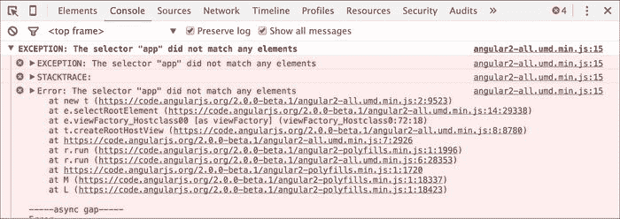

这是因为我们错过了一些非常重要的东西。我们没有在 `index.html` 中的任何地方使用根组件。为了完成应用程序，在 body 元素的开放标签之后添加以下 HTML 元素：

```ts
<app></app>
```

现在，您可以刷新浏览器以查看以下结果：

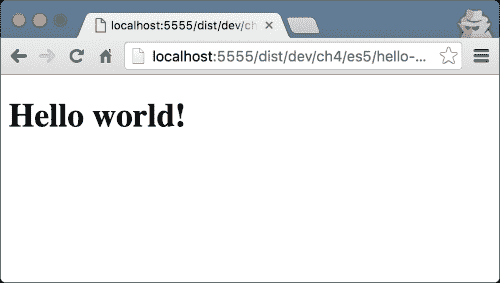

### 注意

**使用 TypeScript**

虽然我们已经运行了一个 Angular 2 应用程序，但我们可以做得更好！我们没有使用任何包管理器或模块加载器。在 第三章 中，*TypeScript Crash Course*，我们讨论了 TypeScript；然而，在前面的应用程序中我们没有写一行 TypeScript 代码。虽然不要求您在 Angular 2 中使用 TypeScript，但利用静态类型提供的所有奖励会更方便。

# 设置我们的环境

Angular 的核心团队为 Angular 2 开发了一个全新的 CLI 工具，允许我们通过几个命令来“引导”我们的应用程序。尽管我们将在最后一章介绍它，但为了加快我们的学习体验，我们将使用位于[`github.com/mgechev/switching-to-angular2`](https://github.com/mgechev/switching-to-angular2)的代码。它包括本书中的所有示例，并允许我们快速“引导”我们的 Angular 2 应用程序（您可以在第五章中了解如何快速开始使用 Angular 2 开发 Web 应用程序，*Angular 2 中的依赖注入*）。它在`package.json`中声明了所有必需的依赖项，定义了基本的 gulp 任务，如开发服务器、将您的 TypeScript 代码转译为 ECMAScript 5、实时重新加载等。我们即将介绍的示例将基于它。

为了设置`switching-to-angular2`项目，您需要在计算机上安装 Git、Node.js v5.x.x 和 npm。如果您安装了不同版本的 Node.js，我建议您查看 nvm（Node.js 版本管理器，可在[`www.npmjs.com/package/nvm`](https://www.npmjs.com/package/nvm)上找到）或 n（[`www.npmjs.com/package/n`](https://www.npmjs.com/package/n)）。使用这些工具，您可以在计算机上拥有多个 Node.js 版本，并通过命令行轻松切换它们。

## 安装我们的项目存储库

让我们从设置`switching-to-angular2`项目开始。打开您的终端并输入以下命令：

```ts
**# Will clone the repository and save it to directory called**
**# switching-to-angular2**
**git clone https://github.com/mgechev/switching-to-angular2.git**
**cd switching-to-angular2**
**npm install**

```

第一行将把`switching-to-angular2`项目克隆到一个名为`switching-to-angular2`的目录中。

在能够运行种子项目之前的最后一步是使用 npm 安装所有必需的依赖项。这一步可能需要一些时间，取决于您的互联网连接速度，所以请耐心等待，不要中断它。如果遇到任何问题，请毫不犹豫地在[`github.com/mgechev/switching-to-angular2/issues`](https://github.com/mgechev/switching-to-angular2/issues)上提出问题。

最后一步是启动开发服务器：

```ts
**npm start** 

```

当转译过程完成时，您的浏览器将自动打开此 URL：`http://localhost:5555/dist/dev`。现在，您应该看到与以下截图中显示的类似的视图：

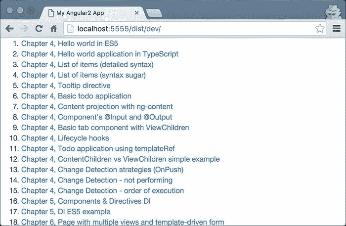

# 玩转 Angular 2 和 TypeScript

现在，让我们玩弄一下我们已经拥有的文件！转到`switching-to-angular2`内的`app/ch4/ts/hello-world`目录。然后，打开`app.ts`并用以下片段替换其内容：

```ts
// ch4/ts/hello-world/app.ts

import {Component} from 'angular2/core';
import {bootstrap} from 'angular2/platform/browser';

@Component({
  selector: 'app',
  templateUrl: './app.html'
})
class App {
  target: string;
  constructor() {
    this.target = 'world';
	}
}

bootstrap(App);
```

让我们逐行查看代码：

```ts
import {Component} from 'angular2/core';
import {bootstrap} from 'angular2/platform/browser';
```

最初，我们从`angular2/core`模块中导入`@Component`装饰器和从`angular2/platform/browser`中导入`bootstrap`函数。稍后，我们使用`@Component`来装饰`App`类。对于`@Component`装饰器，我们传递了几乎与应用程序的 ECMAScript 5 版本中使用的相同的对象文字，通过这种方式，我们定义了组件的 CSS 选择器。

作为下一步，我们定义组件的视图。但是，请注意，在这种情况下，我们使用`templateUrl`而不是简单地内联组件的模板。

打开`app.html`，并用`<h1>Hello {{target}}!</h1>`替换文件的内容。`app.html`的内容应与我们先前使用的内联模板相同。由于我们可以通过内联（使用`template`）和设置其 URL（`templateUrl`）来使用模板，因此组件的 API 与 AngularJS 1.x 指令 API 非常相似。

在片段的最后一行，我们通过提供根组件来`bootstrap`应用程序。

## 深入了解索引

现在，让我们来看一下`index.html`，以便了解启动应用程序时发生了什么：

```ts
<!-- ch4/ts/hello-world/index.html -->
<!DOCTYPE html>
<html lang="en">
<head>
  <meta charset="utf-8">
  <meta http-equiv="X-UA-Compatible" content="IE=edge">
  <title><%= TITLE %></title>
  <meta name="description" content="">
  <meta name="viewport" content="width=device-width, initial-scale=1">
  <!-- inject:css -->
  <!-- endinject -->
</head>
<body>
  <app>Loading...</app>
  <!-- inject:js -->
  <!-- endinject -->
  <%= INIT %>
</body>
</html>
```

请注意，在页面的主体中，我们使用`app`元素，并在其中使用文本节点的内容`"Loading…"`。`"Loading…"`标签将在应用程序启动并渲染主组件之前可见。

### 注意

有模板占位符`<%= INIT %>和<!-- inject:js…`，它们注入了特定于各个演示的内容。它们不是 Angular 特定的，而是旨在防止由于它们之间的共享结构而在附有书籍的代码示例中重复代码。为了查看此特定 HTML 文件已被转换的方式，请打开`/dist/dev/ch4/ts/hello-world/index.html`。

# 使用 Angular 2 指令

我们已经构建了简单的“Hello world!”应用程序。现在，让我们开始构建更接近真实应用程序的东西。在本节结束时，我们将拥有一个简单的应用程序，列出我们需要做的一些项目，并在页面的标题处向我们问候。

让我们从开发我们的`app`组件开始。我们需要对上一个示例进行两个修改，将`target`属性重命名为`name`，并在组件的控制器定义中添加一个`todos`列表：

```ts
// ch4/ts/ng-for/detailed-syntax/app.ts

import {Component} from 'angular2/core';
import {bootstrap} from 'angular2/platform/browser';

@Component({
  selector: 'app',
  templateUrl: './app.html',
})
class App {
  todos: string[];
  name: string;
  constructor() {
    this.name = 'John';
    this.todos = ['Buy milk', 'Save the world'];
  }
}
bootstrap(App);
```

唯一剩下的事情就是改变模板以消耗提供的数据。我们已经熟悉了 AngularJS 1.x 中的`ng-repeat`指令。它允许我们使用微语法循环列表项，稍后由 AngularJS 1.x 解释。然而，该指令没有足够的语义，因此很难构建执行静态代码分析并帮助我们改进开发体验的工具。由于`ng-repeat`指令非常有用，Angular 2 进一步改进了这个想法，以允许更复杂的工具通过引入更多的语义来进行更好的静态代码分析。这种支持将防止我们在编写代码时出现拼写错误，并允许我们拥有更流畅的开发体验。

在`app.html`中，添加以下内容：

```ts
<!-- ch4/ts/ng-for/detailed-syntax/app.html -->

<h1>Hello {{name}}!</h1>
<p>
  Here's a list of the things you need to do:
</p>
<ul>
  <template ngFor var-todo [ngForOf]="todos">
    <li>{{todo}}</li>
  </template>
</ul>
```

### 注意

`template`元素是一个我们可以放置标记的地方，并确保它不会被浏览器渲染。如果我们需要直接嵌入应用程序模板到页面标记中，并让我们使用的模板引擎稍后处理它们，这是非常有用的。在当前的例子中，这意味着如果 Angular 2 DOM 编译器不处理 DOM 树，我们在屏幕上看到的只有`h1`、`p`元素和`ul`元素，没有任何列表项。

现在，在刷新浏览器后，您应该看到以下结果：

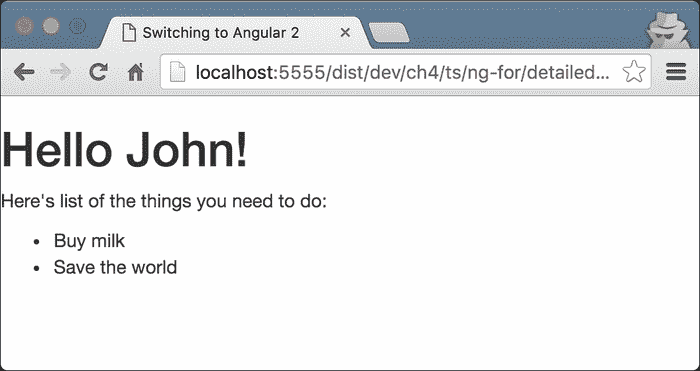

到目前为止，一切都很好！在前面的片段中，唯一剩下的新事物是我们不熟悉的`template`元素的属性，如`ngFor`、`var-todo`和`[ngForOf]`。让我们来看看它们。

## ngFor 指令

`ngFor` 指令是一个允许我们循环遍历项目集合的指令，它与 AngularJS 1.x 中的 `ng-repeat` 做的事情完全一样，但它带来了一些额外的语义。请注意，`ngForOf` 属性被括号括起来。起初，这些括号可能看起来像无效的 HTML。然而，根据 HTML 规范，它们在属性名称中是允许使用的。唯一会引起 W3C 验证器抱怨的是 `template` 元素不拥有这样的属性；然而，浏览器不会在处理标记时出现问题。

这些括号背后的语义是，它们括起来的属性的值是一个表达式，需要进行评估。

# 指令语法的改进语义

在第一章中，*开始使用 Angular 2*，我们提到了 Angular 2 中改进工具的机会。在 AngularJS 1.x 中存在的一个大问题是我们可以使用指令的不同方式。这需要理解属性值，它可以是文字，表达式，回调或微语法。Angular 2 通过引入一些内置到框架中的简单约定来消除这个问题：

+   `propertyName="value"`

+   `[propertyName]="expression"`

+   `(eventName)="handler()"`

在第一行中，`propertyName` 属性接受一个字符串文字作为值。Angular 不会进一步处理属性的值；它将使用模板中设置的方式。

第二种语法 `[propertyName]="expression"` 给 Angular 2 提供了一个提示，即属性的值应该被处理为表达式。当 Angular 2 发现一个被括号括起来的属性时，它将在与模板相关联的组件的上下文中解释表达式。简而言之，如果我们想要将非字符串值或表达式的结果作为给定属性的值设置，我们需要使用这种语法。

最后一个例子展示了我们如何绑定事件。 `(eventName)="handler()"` 背后的语义是，我们想要处理由给定组件触发的名为 `eventName` 的所有事件，并使用 `handler()` 表达式。

我们将在本章后面讨论更多例子。

### 注意

Angular 提供了另一种规范的替代语法，允许我们定义元素的绑定而不使用括号。例如，可以使用以下代码表示属性绑定：

```ts
<input [value]="foo">
```

也可以用这种方式表达：

```ts
<input bind-value="foo">
```

同样，我们可以用以下代码表达事件绑定：

```ts
<button (click)="handle()">Click me</button>
```

它们也可以用这种方式表达：

```ts
<button on-click="handle()">Click me</button>
```

## 在模板中声明变量

从前面的模板中剩下的最后一件事是`var-todo`属性。使用这种语法告诉 Angular 的是，我们想要声明一个名为`todo`的新变量，并将其绑定到从评估设置为`[ngForOf]`值的表达式的个别项目。

## 在模板中使用语法糖

尽管模板语法很棒，并且为我们使用的 IDE 或文本编辑器提供了更多的代码含义，但它相当冗长。Angular 2 提供了一种替代语法，它将被解糖为前面显示的语法。例如，我们可以使用`#todo`来代替`var-todo`，它具有相同的语义。

有一些 Angular 2 指令需要使用模板元素，例如`ngForOf`，`ngIf`和`ngSwitch`。由于这些指令经常被使用，因此有一种替代语法。我们可以简单地在指令前加上`*`，而不是明确地输入整个模板元素。这将允许我们将`ngForOf`指令语法的使用转换为以下形式：

```ts
<!-- ch4/ts/ng-for/syntax-sugar/app.html -->

<ul>
  <li *ngFor="#todo of todos">{{todo}}</li>
</ul>
```

稍后，此模板将被 Angular 2 解糖为之前描述的更冗长的语法。由于较少冗长的语法更容易阅读和编写，因此其使用被视为最佳实践。

### 注意

`*`字符允许您删除`template`元素，并直接将指令放在`template`元素的根上（在前面的示例中，列表项`li`）。

# 定义 Angular 2 指令

现在我们已经构建了一个简单的 Angular 2 组件，让我们继续通过理解 Angular 2 指令来继续我们的旅程。

使用 Angular 2 指令，我们可以在 DOM 上应用不同的行为或结构变化。在这个例子中，我们将构建一个简单的工具提示指令。

与组件相比，指令没有视图和模板。这两个概念之间的另一个核心区别是，给定的 HTML 元素可能只有一个组件，但可以有多个指令。换句话说，指令增强了元素，而组件是视图中的实际元素。

Angular 核心团队的建议是将指令作为带有命名空间前缀的属性使用。记住这一点，我们将以以下方式使用工具提示指令：

```ts
<div saTooltip="Hello world!"></div>
```

在上面的片段中，我们在`div`元素上使用了 tooltip 指令。作为命名空间，它的选择器使用了`sa`字符串。

### 注意

为简单起见，在本书的其余部分中，我们可能不会给我们的组件和指令的所有选择器加前缀。然而，对于生产应用程序来说，遵循最佳实践是必不可少的。您可以在[`github.com/mgechev/angular2-style-guide`](https://github.com/mgechev/angular2-style-guide)找到一个指出这些实践的 Angular 2 风格指南。

在实现我们的 tooltip 之前，我们需要从`angular2/core`中导入一些东西。打开一个名为`app.ts`的新的 TypeScript 文件，并输入以下内容；稍后我们将填写占位符：

```ts
import {Directive, ElementRef, HostListener...} from 'angular2/core';
```

在上面的行中，我们导入了以下定义：

+   `ElementRef`：这允许我们将元素引用（我们不仅限于 DOM）注入到宿主元素中。在上面 tooltip 的示例用法中，我们得到了一个`div`元素的 Angular 包装器，其中包含了 tooltip 属性。

+   `Directive`：这个装饰器允许我们为我们定义的新指令添加所需的元数据。

+   `HostListener(eventname)`：这是一个方法装饰器，接受一个事件名称作为参数。在指令初始化期间，Angular 2 将把装饰的方法添加为宿主元素的`eventname`事件的事件处理程序。

让我们来看看我们的实现；这是指令的定义看起来像什么：

```ts
// ch4/ts/tooltip/app.ts

@Directive({
  selector: '[saTooltip]'
})
export class Tooltip {
  @Input()
  saTooltip: string;

  constructor(private el: ElementRef, private overlay: Overlay) {
    this.overlay.attach(el.nativeElement);
  }
  @HostListener('mouseenter')
  onMouseEnter() {
    this.overlay.open(this.el, this.saTooltip);
  }
  @HostListener('mouseleave')
  onMouseLeave() {
    this.overlay.close();
  }
}
```

## 设置指令的输入

在上面的例子中，我们使用了`saTooltip`选择器声明了一个指令。请注意，Angular 的 HTML 编译器是区分大小写的，这意味着它将区分`[satooltip]`和`[saTooltip]`选择器。稍后，我们将使用`@Input`装饰器声明指令的输入，放在`saTooltip`属性上。这段代码背后的语义是：声明一个名为`saTooltip`的属性，并将其绑定到我们从传递给`saTooltip`属性的表达式的评估结果的值。

`@Input`装饰器接受一个参数——我们想要绑定的属性的名称。如果我们不传递参数，Angular 将创建一个属性名称与属性本身相同的属性之间的绑定。我们将在本章后面详细解释输入和输出的概念。

## 理解指令的构造函数

构造函数声明了两个私有属性：`el`是`ElementRef`类型的，`overlay`是`Overlay`类型的。`Overlay`类实现了管理工具提示覆盖层的逻辑，并将使用 Angular 的 DI 机制进行注入。为了声明它可以用于注入，我们需要以以下方式声明顶层组件：

```ts
@Component({
  selector: 'app',
  templateUrl: './app.html',
  providers: [Overlay],
  // ...
})
class App {}
```

### 注意

在下一章中，我们将看一下 Angular 2 的依赖注入机制，我们将解释如何声明我们的服务、指令和组件的依赖关系。

`Overlay`类的实现对本章的目的并不重要。然而，如果你对此感兴趣，你可以在`ch4/ts/tooltip/app.ts`中找到实现。

## 指令更好的封装

为了使工具提示指令可用于 Angular 的编译器，我们需要明确声明我们打算在哪里使用它。例如，看一下`ch4/ts/tooltip/app.ts`中的`App`类；在那里，你可以注意到以下内容：

```ts
@Component({
  selector: 'app',
  templateUrl: './app.html',
  providers: [Overlay],
  directives: [Tooltip]
})
class App {}
```

对于`@Component`装饰器，我们传递了一个具有`directives`属性的对象字面量。该属性包含了整个组件子树中应该可用的所有指令的列表，根据给定组件的根。

起初，你可能会觉得很烦人，因为你需要明确声明你的组件使用的所有指令；然而，这强化了更好的封装。在 AngularJS 1.x 中，所有指令都在全局命名空间中。这意味着应用程序中定义的所有指令都可以在所有模板中访问。这带来了一些问题，例如名称冲突。为了解决这个问题，我们引入了命名约定，例如，AngularJS 1.x 定义的所有指令都带有"`ng-`"前缀，Angular UI 中的所有指令都带有"`ui-`"前缀。

通过显式声明组件在 Angular 2 中使用的所有指令，我们创建了一个特定于各个组件子树的命名空间（即，指令将对给定根组件及其所有后继组件可见）。防止名称冲突不是我们得到的唯一好处；它还有助于我们更好地语义化我们生成的代码，因为我们始终知道给定组件可访问的指令。我们可以通过从组件到组件树顶部的路径，并取`@Component`装饰器中设置的`directives`数组的所有值的并集来找到给定组件的所有可访问指令。鉴于组件是从指令扩展而来，我们还需要显式声明所有使用的组件。

由于 Angular 2 定义了一组内置指令，`bootstrap`方法以类似的方式传递它们，以使它们在整个应用程序中可用，以防止我们重复编码。这些预定义指令的列表包括`NgClass`、`NgFor`、`NgIf`、`NgStyle`、`NgSwitch`、`NgSwitchWhen`和`NgSwitchDefault`。它们的名称相当自明；我们将在本章后面看看如何使用其中一些。

# 使用 Angular 2 的内置指令

现在，让我们构建一个简单的待办事项应用程序，以便进一步演示定义组件的语法！

我们的待办事项将具有以下格式：

```ts
interface Todo {
  completed: boolean;
  label: string;
}
```

让我们从导入我们将需要的一切开始：

```ts
import {Component, ViewEncapsulation} from 'angular2/core';
import {bootstrap} from 'angular2/platform/browser';
```

现在，让我们声明与组件相关的元数据：

```ts
@Component({
  selector: 'todo-app',
  templateUrl: './app.html',
  styles: [
    `ul li {
      list-style: none;
    }
    .completed {
      text-decoration: line-through;
    }`
  ],
  encapsulation: ViewEncapsulation.Emulated
})
```

在这里，我们指定`Todo`组件的选择器将是`todo-app`元素。稍后，我们添加模板 URL，指向`app.html`文件。之后，我们使用`styles`属性；这是我们第一次遇到它。从名称可以猜到，它用于设置组件的样式。

# 介绍组件的视图封装

正如我们所知，Angular 2 受到 Web 组件的启发，其核心功能是影子 DOM。影子 DOM 允许我们封装我们的 Web 组件的样式，而不允许它们泄漏到组件范围之外。Angular 2 提供了这个功能。如果我们希望 Angular 的渲染器使用影子 DOM，我们可以使用`ViewEncapsulation.Native`。然而，并非所有浏览器都支持影子 DOM；如果我们希望在不使用影子 DOM 的情况下具有相同级别的封装，我们可以使用`ViewEncapsulation.Emulated`。如果我们根本不想有任何封装，我们可以使用`ViewEncapsulation.None`。默认情况下，渲染器使用`Emulated`类型的封装。

# 实现组件的控制器

现在，让我们继续实现应用程序：

```ts
// ch4/ts/todo-app/app.ts
class TodoCtrl {
  todos: Todo[] = [{
    label: 'Buy milk',
    completed: false
  }, {
    label: 'Save the world',
    completed: false
  }];
  name: string = 'John';
  addTodo(label) { … }
  removeTodo(idx) { … }
  toggleCompletion(idx) { … }
}
```

这是与`Todo`应用程序模板相关的控制器实现的一部分。

在类声明内部，我们将`todos`属性初始化为一个包含两个`todo`项目的数组：

```ts
{
  label: 'Buy milk',
  completed: false
}, {
  label: 'Save the world',
  completed: false
}
```

现在，让我们更新模板并渲染这些项目！这是如何完成的：

```ts
<ul>
  <li *ngFor="#todo of todos; var index = index" [class.completed]="todo.completed">
    <input type="checkbox" [checked]="todo.completed"
      (change)="toggleCompletion(index)">
    {{todo.label}}
  </li>
</ul>
```

在前面的模板中，我们循环遍历了控制器的`todos`属性中的所有`todo`项目。对于每个`todo`项目，我们创建了一个复选框，可以`切换`项目的完成状态；我们还使用插值指令呈现了`todo`项目的标签。在这里，我们可以注意到之前解释过的语法：

+   我们使用`(change)="statement"`绑定到复选框的 change 事件。

+   我们使用`[checked]="expr"`绑定到`todo`项目的属性。

为了在已完成的`todo`项目上画一条线，我们绑定到元素的`class.completed`属性。由于我们想要将`completed`类应用于所有已完成的待办事项，我们使用`[class.completed]="todo.completed"`。这样，我们声明了我们想要根据`todo.completed`表达式的值应用`completed`类。现在我们的应用程序是这样的：

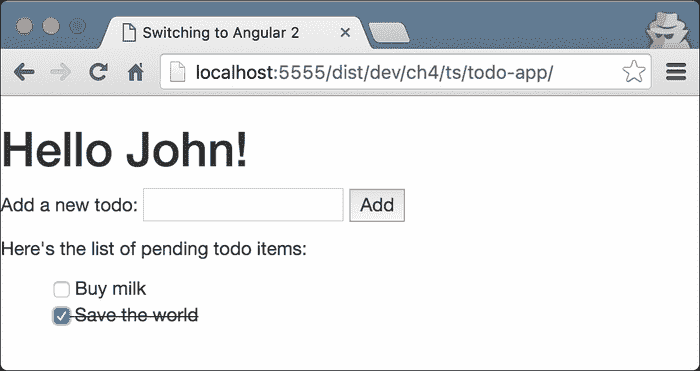

### 注意

与类绑定语法类似，Angular 允许我们绑定元素的样式和属性。例如，我们可以使用以下代码绑定到`td`元素的`colspan`属性：

```ts
<td [attr.colspan]="colspanCount"></td>
```

同样，我们可以使用这行代码绑定到任何`style`属性：

```ts
<div [style.backgroundImage]="expression"></td>
```

# 处理用户操作

到目前为止，一切顺利！现在，让我们实现`toggleCompletion`方法。这个方法接受待办事项的索引作为单个参数：

```ts
  toggleCompletion(idx) {
    let todo = this.todos[idx];
    todo.completed = !todo.completed;
  }
```

在`toggleCompletion`中，我们只是切换与当前待办事项相关联的`completed`布尔值，该值由传递给该方法的索引指定。

现在，让我们添加一个文本输入来添加新的待办事项：

```ts
<p>
  Add a new todo:
  <input #newtodo type="text">
  <button (click)="addTodo(newtodo.value); newtodo.value = ''">
    Add
  </button>
</p>
```

此处的输入定义了一个名为`newtodo`的新标识符。我们可以在模板中使用`newtodo`标识符引用输入。一旦用户点击按钮，控制器中定义的`addTodo`方法将以`newtodo`输入的值作为参数被调用。在传递给`(click)`属性的语句中，我们还通过将其设置为空字符串来重置`newtodo`输入的值。

### 注意

请注意，直接操作 DOM 元素不被视为最佳实践，因为它会阻止我们的组件在浏览器环境之外正常运行。我们将解释如何将此应用程序迁移到 Web Workers 中，详见第八章, *开发体验和服务器端渲染*。

现在，让我们定义`addTodo`方法：

```ts
  addTodo(label) {
    this.todos.push({
      label,
      completed: false
    });
  }
```

在其中，我们使用对象字面量语法创建一个新的待办事项。

我们应用程序中唯一剩下的事情是实现删除现有待办事项。由于它与用于切换待办事项完成情况的功能非常相似，我将把它的实现作为读者的简单练习留下。

## 使用指令的输入和输出

通过重构我们的`todo`应用程序，我们将演示如何利用指令的输入和输出：

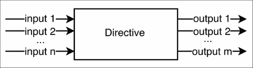

我们可以将输入视为给定指令接受的属性（甚至参数）。输出可以被视为它触发的事件。当我们使用第三方库提供的指令时，我们主要关心的是它的输入和输出，因为它们定义了它的 API。

输入是指参数化指令行为和/或视图的值。另一方面，输出是指指令在发生特殊事件时触发的事件。

## 查找指令的输入和输出

现在，让我们将我们的单体待办事项应用程序分成单独的组件，它们彼此通信。在下面的屏幕截图中，您可以看到单独的组件，当组合在一起时实现应用程序的功能：

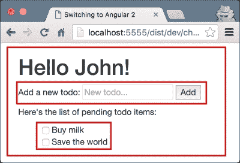

外部矩形代表整个`Todo`应用程序。第一个嵌套的矩形包含负责输入新待办事项标签的组件，下面的矩形列出了存储在根组件中的各个项目。

说到这一点，我们可以将这三个组件定义如下：

+   `TodoApp`：负责维护待办事项列表（添加新项目和切换完成状态）。

+   `InputBox`：负责输入新待办事项的标签。它具有以下输入和输出：

+   `Input`：文本框的占位符和提交按钮的标签。

+   `Output`：它应该在单击提交按钮时发出输入的内容。

+   `TodoList`：负责呈现各个待办事项。它具有以下输入和输出：

+   `Input`：待办事项列表。

+   `Output`：一旦任何待办事项的完成状态发生变化，该组件应该发出变化。

现在，让我们开始实施！

## 定义组件的输入和输出

让我们采用自下而上的方法，从`InputBox`组件开始。在此之前，我们需要从 Angular 的`angular2/core`包中导入一些内容：

```ts
import {
  Component,
  Input,
  Output,
  EventEmitter
} from 'angular2/core';
```

在前面的代码中，我们导入了`@Component`、`@Input`和`@Output`装饰器以及`EventEmitter`类。正如它们的名称所述，`@Input`和`@Output`用于声明指令的输入和输出。`EventEmitter`是一个通用类（即接受类型参数），它与`@Output`装饰器结合使用，帮助我们发出输出。

作为下一步，让我们来看一下`InputBox`组件的声明：

```ts
// ch4/ts/inputs-outputs/app.ts

@Component({
  selector: 'text-input',
  template: `
    <input #todoInput [placeholder]="inputPlaceholder">
    <button (click)="emitText(todoInput.value);
                     todoInput.value = '';">
      {{buttonLabel}}
    </button>
  `
})
class InputBox {...}
```

请注意，在模板中，我们声明了一个名为`todoInput`的文本输入，并将其占位符属性设置为我们从`inputPlaceholder`表达式的评估中获得的值。表达式的值是组件控制器中定义的`inputPlaceholder`属性的值。这是我们需要定义的第一个输入：

```ts
class InputBox {
  @Input() inputPlaceholder: string;
  ...
}
```

同样，我们声明了`buttonLabel`组件的另一个输入，我们将其用作按钮标签的值：

```ts
class InputBox {
  @Input() inputPlaceholder: string;
  @Input() buttonLabel: string;
  ...
}
```

在前面的模板中，我们将按钮的点击事件绑定到这个表达式：`emitText(todoInput.value); todoInput.value = '';`。`emitText`方法应该在组件的控制器中定义；一旦调用它，它应该发出文本输入的值。以下是我们可以实现这种行为的方法：

```ts
class InputBox {
  ...
  @Output() inputText = new EventEmitter<string>();
  emitText(text: string) {
    this.inputText.emit(text);
  }
}
```

最初，我们声明了一个名为`inputText`的输出。我们将其值设置为我们创建的`EventEmitter<string>`类型的新实例。

### 注意

请注意，所有组件的输出都需要是`EventEmitter`的实例。

在`emitText`方法内部，我们使用`inputText`实例的 emit 方法，并传入文本输入的值作为参数。

现在，让我们以相同的方式定义`TodoList`组件：

```ts
@Component(...)
class TodoList {
  @Input() todos: Todo[];
  @Output() toggle = new EventEmitter<Todo>();
  toggleCompletion(index: number) {
    let todo = this.todos[index];
    this.toggle.emit(todo);
  }
}
```

由于传递给`@Component`装饰器的对象文字的值对于本节的目的并不重要，我们已经省略了它。这个例子的完整实现可以在`ch4/ts/inputs-outputs/app.ts`中找到。让我们来看一下`TodoList`类的主体。同样，对于`InputBox`组件，我们定义了`todos`输入。我们还通过声明`toggle`属性，将其值设置为`EventEmitter<Todo>`类型的新实例，并用`@Output`装饰器装饰它，定义了`toggle`输出。

## 传递输入和消耗输出

现在，让我们结合前面定义的组件并实现我们的完整应用程序！

我们需要查看的最后一个组件是`TodoApp`：

```ts
@Component({
  selector: 'todo-app',
  directives: [TodoList, InputBox],
  template: `
    <h1>Hello {{name}}!</h1>

    <p>
      Add a new todo:
      <input-box inputPlaceholder="New todo..."
        buttonLabel="Add"
        (inputText)="addTodo($event)">
      </input-box>
    </p>

    <p>Here's the list of pending todo items:</p>
    <todo-list [todos]="todos" (toggle)="toggleCompletion($event)"></todo-list>
  `
})
class TodoApp {...}
```

首先，我们定义了`TodoApp`类，并用`@Component`装饰器装饰它。请注意，在组件使用的指令列表中，我们包括了`InputBox`和`TodoList`。这些组件如何协同工作的魔法发生在模板中：

```ts
<input-box inputPlaceholder="New todo..."
  buttonLabel="Add"
  (inputText)="addTodo($event)">
</input-box>
```

首先，我们使用`InputBox`组件并向输入传递值：`inputPlaceholder`和`buttonLabel`。请注意，就像我们之前看到的那样，如果我们想将表达式作为值传递给任何这些输入中的一个，我们需要用括号括起来（即`[inputPlaceholder]="expression"`）。在这种情况下，表达式将在拥有模板的组件的上下文中进行评估，并作为输入传递给拥有给定属性的组件。

在为`buttonLabel`输入传递值后，我们通过将`(inputText)`属性的值设置为`addTodo($event)`表达式来消耗`inputText`输出。`$event`的值将等于我们传递给`InputBox`的`inputText`对象的`emitText`方法中的`emit`方法的值（如果我们绑定到原生事件，事件对象的值将是原生事件对象本身）。

同样，我们传递`TodoList`组件的输入并处理其切换输出。现在，让我们定义`TodoApp`组件的逻辑：

```ts
class TodoApp {
  todos: Todo[] = [];
  name: string = 'John';
  addTodo(label: string) {
    this.todos.push({
      label,
      completed: false
    });
  }
  toggleCompletion(todo: Todo) {
    todo.completed = !todo.completed;
  }
}
```

在`addTodo`方法中，我们只是将一个新的待办事项推送到`todos`数组中。`toggleCompletion`的实现甚至更简单——我们切换作为参数传递给待办事项的完成标志的值。现在，我们熟悉了组件输入和输出的基础知识！

## 事件冒泡

在 Angular 中，我们有与 DOM 中相同的冒泡行为。例如，如果我们有以下模板：

```ts
<input-box inputPlaceholder="New todo..."
  buttonLabel="Add"
  (click)="handleClick($event)"
  (inputText)="addTodo($event)">
</input-box>
```

`input-box`的声明如下：

```ts
<input #todoInput [placeholder]="inputPlaceholder">
<button (click)="emitText(todoInput.value);
                 todoInput.value = '';">
  {{buttonLabel}}
</button>
```

用户一旦点击了模板中定义的`input-box`组件内的按钮，`handleClick($event)`表达式就会被评估。

此外，`handleClick`的第一个参数的`target`属性将是按钮本身，但`currentTarget`属性将是`input-box`元素。

### 注意

请注意，与原生事件不同，由`EventEmitter`触发的事件不会冒泡。

## 重命名指令的输入和输出

现在，我们将探讨如何重命名指令的输入和输出！假设我们有以下`TodoList`组件的定义：

```ts
class TodoList {
  ...
  @Output() toggle = new EventEmitter<Todo>();
  toggle(index: number) {
    ...
  }
}
```

组件的输出被称为`toggle`；负责切换个人待办事项完成状态的复选框的方法也被称为`toggle`。这段代码不会被编译，因为在`TodoList`控制器中，我们有两个同名的标识符。我们有两个选择：我们可以重命名方法或属性。如果我们重命名属性，这也会改变组件输出的名称。因此，以下代码将不再起作用：

```ts
<todo-list [toggle]="foobar($event)"...></todo-list>
```

我们可以做的是重命名`toggle`属性，并使用`@Output`装饰器显式设置输出的名称：

```ts
class TodoList {
  ...
  @Output('toggle') toggleEvent = new EventEmitter<Todo>();
  toggle(index: number) {
    ...
  }
}
```

这样，我们将能够使用`toggleEvent`属性触发`toggle`输出。

### 注意

请注意，这样的重命名可能会令人困惑，并且不被视为最佳实践。有关最佳实践的完整集合，请访问[`github.com/mgechev/angular2-style-guide`](https://github.com/mgechev/angular2-style-guide)。

同样，我们可以使用以下代码片段来重命名组件的输入：

```ts
class TodoList {
  @Input('todos') todoList: Todo[];
  @Output('toggle') toggleEvent = new EventEmitter<Todo>();
  toggle(index: number) {
    ...
  }
}
```

现在，无论我们如何重命名`TodoList`的输入和输出属性，它仍然具有相同的公共接口：

```ts
<todo-list [todos]="todos"
  (toggle)="toggleCompletion($event)">
</todo-list>
```

## 定义输入和输出的另一种语法

`@Input`和`@Output`装饰器是语法糖，用于更容易地声明指令的输入和输出。用于此目的的原始语法如下：

```ts
@Directive({
  outputs: ['outputName: outputAlias'],
  inputs: ['inputName: inputAlias']
})
class Dir {
  outputName = new EventEmitter();
}
```

使用`@Input`和`@Output`，前面的语法等同于这样：

```ts
@Directive(...)
class Dir {
  @Output('outputAlias') outputName = new EventEmitter();
  @Input('inputAlias') inputName;
}
```

尽管两者语义相同，但根据最佳实践，我们应该使用后者，因为它更容易阅读和理解。

# 解释 Angular 2 的内容投影

内容投影是开发用户界面时的一个重要概念。它允许我们将内容的片段投影到应用程序的用户界面的不同位置。Web 组件使用`content`元素解决了这个问题。在 AngularJS 1.x 中，它是通过臭名昭著的转置来实现的。

Angular 2 受到现代 Web 标准的启发，特别是 Web 组件，这导致了采用了一些在那里使用的内容投影方法。在本节中，我们将在 Angular 2 的上下文中使用`ng-content`指令来查看它们。

## Angular 2 中的基本内容投影

假设我们正在构建一个名为`fancy-button`的组件。该组件将使用标准的 HTML 按钮元素，并为其添加一些额外的行为。以下是`fancy-button`组件的定义：

```ts
@Component({
  selector: 'fancy-button',
  template: '<button>Click me</button>'
})
class FancyButton { … }
```

在`@Component`装饰器内部，我们设置了组件的内联模板以及其选择器。现在，我们可以使用以下标记使用组件：

```ts
<fancy-button></fancy-button>
```

在屏幕上，我们将看到一个标准的 HTML 按钮，其标签中包含内容**Click me**。这不是一种定义可重用 UI 组件的非常灵活的方式。很可能，漂亮按钮的用户将需要根据他们的应用程序更改标签的内容。

在 AngularJS 1.x 中，我们可以使用`ng-transclude`来实现这个结果：

```ts
// AngularJS 1.x example
app.directive('fancyButton', function () {
  return {
    restrict: 'E',
    transclude: true,
    template: '<button><ng-transclude></ng-transclude></button>'
  };
});
```

在 Angular 2 中，我们有`ng-content`元素：

```ts
// ch4/ts/ng-content/app.ts
@Component({
  selector: 'fancy-button',
  template: '<button><ng-content></ng-content></button>'
})
class FancyButton { /* Extra behavior */ }
```

现在，我们可以通过执行以下操作将自定义内容传递给漂亮按钮：

```ts
<fancy-button>Click <i>me</i> now!</fancy-button>
```

因此，在`fancy-button`标签的开头和结尾之间的内容将放置在`ng-content`指令所在的位置。

## 投影多个内容块

内容投影的另一个典型用例是，当我们将内容传递给自定义的 Angular 2 组件或 AngularJS 1.x 指令时，我们希望将此内容的不同部分投影到模板中的不同位置。

例如，假设我们有一个`panel`组件，它有一个标题和一个正文：

```ts
<panel>
  <panel-title>Sample title</panel-title>
  <panel-content>Content</panel-content>
</panel>
```

我们的组件模板如下：

```ts
<div class="panel">
  <div class="panel-title">
 **<!-- Project the content of panel-title here -->**
  </div>
  <div class="panel-content">
 **<!-- Project the content of panel-content here -->**
  </div>
</div>`
```

在 AngularJS 1.5 中，我们可以使用多槽传输来实现这一点，这是为了让我们能够更顺利地过渡到 Angular 2 而实施的。让我们看看我们如何可以在 Angular 2 中进行，以定义这样一个`panel`组件：

```ts
// ch4/ts/ng-content/app.ts
@Component({
  selector: 'panel',
  styles: [ … ],
  template: `
    <div class="panel">
      <div class="panel-title">
        <ng-content select="panel-title"></ng-content>
      </div>
      <div class="panel-content">
        <ng-content select="panel-content"></ng-content>
      </div>
    </div>`
})
class Panel { }
```

我们已经描述了`selector`和`styles`属性，现在让我们来看一下组件的模板。我们有一个带有`panel`类的`div`元素，它包裹了两个嵌套的`div`元素，分别用于`panel`的标题和内容。为了从`panel-title`元素中获取内容，并将其投影到渲染面板中`panel`标题应该在的位置，我们需要使用带有`selector`属性的`ng-content`元素，该属性具有`panel-title`值。`selector`属性的值是一个 CSS 选择器，在这种情况下，它将匹配位于目标`panel`元素内的所有`panel-title`元素。之后，`ng-content`将获取它们的内容并将其设置为自己的内容。

## 嵌套组件

我们已经构建了一些简单的应用程序，作为组件和指令的组合。我们看到组件基本上是带有视图的指令，因此我们可以通过嵌套/组合其他指令和组件来实现它们。以下图示说明了这一点：

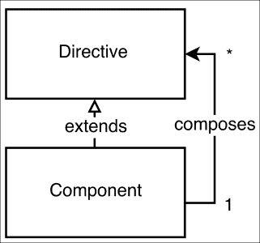

组合可以通过在组件模板中嵌套指令和组件来实现，利用所使用标记的嵌套特性。例如，假设我们有一个带有`sample-component`选择器的组件，其定义如下：

```ts
@Component({
  selector: 'sample-component',
  template: '<view-child></view-child>'
})
class Sample {}
```

`sample-component`选择器的模板有一个带有标签名`view-child`的子元素。

另一方面，我们可以在另一个组件的模板中使用`sample-component`选择器，由于它可以作为一个元素使用，我们可以在其中嵌套其他组件或指令：

```ts
<sample-component>
  <content-child1></content-child1>
  <content-child2></content-child2>
</sample-component>
```

这样，`sample-component`组件有两种不同类型的后继：

+   在它的模板中定义的后继。

+   作为嵌套元素传递的后继。

在 Angular 2 的上下文中，定义在组件模板中的直接子元素称为**视图子组件**，而在其开放和关闭标签之间嵌套的子元素称为**内容子组件**。

## 使用 ViewChildren 和 ContentChildren

让我们来看一下使用以下结构的`Tabs`组件的实现：

```ts
    <tabs (changed)="tabChanged($event)">
      <tab-title>Tab 1</tab-title>
      <tab-content>Content 1</tab-content>
      <tab-title>Tab 2</tab-title>
      <tab-content>Content 2</tab-content>
    </tabs>
```

前面的结构由三个组件组成：

+   `Tab`组件。

+   `TabTitle`组件。

+   `TabContent`组件。

让我们来看一下`TabTitle`组件的实现：

```ts
@Component({
  selector: 'tab-title',
  styles: […],
  template: `
    <div class="tab-title" (click)="handleClick()">
      <ng-content></ng-content>
    </div>
  `
})
class TabTitle {
  tabSelected: EventEmitter<TabTitle> =
    new EventEmitter<TabTitle>();
  handleClick() {
    this.tabSelected.emit(this);
  }
}
```

在这个实现中没有什么新的。我们定义了一个`TabTitle`组件，它有一个叫做`tabSelected`的属性。它是`EventEmitter`类型的，一旦用户点击标签标题，它就会被触发。

现在，让我们来看一下`TabContent`组件：

```ts
@Component({
  selector: 'tab-content',
  styles: […],
  template: `
    <div class="tab-content" [hidden]="!isActive">
      <ng-content></ng-content>
    </div>
  `
})
class TabContent {
  isActive: boolean = false;
}
```

这个实现甚至更简单——我们所做的就是将传递给`tab-content`元素的 DOM 投影到`ng-content`中，并在`isActive`属性的值变为`false`时隐藏它。

实现中有趣的部分是`Tabs`组件本身：

```ts
// ch4/ts/basic-tab-content-children/app.ts
@Component({
  selector: 'tabs',
  styles: […],
  template: `
    <div class="tab">
      <div class="tab-nav">
        <ng-content select="tab-title"></ng-content>
      </div>
      <ng-content select="tab-content"></ng-content>
    </div>
  `
})
class Tabs {
  @Output('changed')
  tabChanged: EventEmitter<number> = new EventEmitter<number>();

  @ContentChildren(TabTitle)
  tabTitles: QueryList<TabTitle>;

  @ContentChildren(TabContent)
  tabContents: QueryList<TabContent>;

  active: number;
  select(index: number) {…}
  ngAfterViewInit() {…}
}
```

在这个实现中，我们有一个尚未使用的装饰器——`@ContentChildren`装饰器。`@ContentChildren`属性装饰器获取给定组件的内容子组件。这意味着我们可以从`Tabs`组件的实例中获取对所有`TabTitle`和`TabContent`实例的引用，并按照它们在标记中声明的顺序获取它们。还有一个叫做`@ViewChildren`的替代装饰器，它获取给定元素的所有视图子组件。在我们进一步解释实现之前，让我们看看它们之间的区别。

## ViewChild 与 ContentChild

虽然这两个概念听起来相似，但它们的语义有很大的不同。为了更好地理解它们，让我们来看一个例子：

```ts
// ch4/ts/view-child-content-child/app.ts
@Component({
  selector: 'user-badge',
  template: '…'
})
class UserBadge {}

@Component({
  selector: 'user-rating',
  template: '…'
})
class UserRating {}
```

在这里，我们定义了两个组件：`UserBadge`和`UserRating`。让我们定义一个包含这两个组件的父组件：

```ts
@Component({
  selector: 'user-panel',
  template: '<user-badge></user-badge>',
  directives: [UserBadge]
})
class UserPanel {…}
```

请注意，`UserPanel`视图的模板仅包含`UserBadge`组件的选择器。现在，让我们在我们的应用程序中使用`UserPanel`组件：

```ts
@Component({
  selector: 'app',
  template: `<user-panel>
    <user-rating></user-rating>
  </user-panel>`,
  directives: [CORE_DIRECTIVES, UserPanel, UserRating]
})
class App {
  constructor() {}
}
```

我们主要的`App`组件的模板使用`UserPanel`组件，并嵌套了`UserRating`组件。现在，假设我们想要获取对`App`组件中`user-panel`元素内使用的`UserRating`组件实例的引用，以及对`UserPanel`模板内使用的`UserBadge`组件的引用。为了做到这一点，我们可以向`UserPanel`控制器添加两个属性，并为它们添加`@ContentChild`和`@ViewChild`装饰器，并使用适当的参数：

```ts
class UserPanel {
  @ViewChild(UserBadge)
  badge: UserBadge;

  @ContentChild(UserRating)
  rating: UserRating;
  constructor() {
    //
  }
}
```

`badge`属性声明的语义是：“获取在`UserPanel`模板内使用的类型为`UserBadge`的第一个子组件的实例”。相应地，`rating`属性声明的语义是：“获取在`UserPanel`宿主元素内嵌套的类型为`UserRating`的第一个子组件的实例”。

现在，如果您运行此代码，您会注意到在控制器的构造函数内，`badge`和`rating`的值仍然等于`undefined`。这是因为它们在组件生命周期的这个阶段仍然没有初始化。我们可以使用`ngAfterViewInit`和`ngAfterContentInit`生命周期钩子来获取对这些子组件的引用。我们可以通过向组件的控制器添加`ngAfterViewInit`和`ngAfterContentInit`方法的定义来简单地使用这些钩子。我们将很快对 Angular 2 提供的生命周期钩子进行全面概述。

总之，我们可以说给定组件的内容子代是嵌套在组件宿主元素内的子元素。相反，给定组件的视图子代指令是其模板中使用的元素。

### 注意

为了获得对 DOM 元素的平台无关引用，我们可以再次使用`@ContentChildren`和`@ViewChildren`。例如，如果我们有以下模板：`<input #todo>`，我们可以通过使用`@ViewChild('todo')`来获取对`input`的引用。

既然我们已经熟悉了视图子代和内容子代之间的核心区别，现在我们可以继续实现我们的选项卡。

在标签组件中，我们使用的是`@ContentChildren`而不是`@ContentChild`装饰器。我们这样做是因为我们有多个内容子级，我们想要获取它们所有：

```ts
@ContentChildren(TabTitle)
tabTitles: QueryList<TabTitle>;

@ContentChildren(TabContent)
tabContents: QueryList<TabContent>;
```

我们可以注意到的另一个主要区别是，`tabTitles`和`tabContents`属性的类型是带有相应类型参数的`QueryList`，而不是组件本身的类型。我们可以将`QueryList`数据结构视为 JavaScript 数组——我们可以对其应用相同的高阶函数（`map`、`filter`、`reduce`等），并循环遍历其元素；但是，`QueryList`也是可观察的，也就是说，我们可以观察它进行更改。

作为我们“标签”定义的最后一步，让我们来看一下`ngAfterContentInit`和“select”方法的实现：

```ts
ngAfterContentInit() {
  this.tabTitles
    .map(t => t.tabSelected)
    .forEach((t, i) => {
      t.subscribe(_ => {
        this.select(i)
      });
    });
  this.active = 0;
  this.select(0);
}
```

在方法实现的第一行，我们循环所有`tabTitles`并获取可观察的引用。这些对象有一个名为`subscribe`的方法，它接受一个回调作为参数。一旦调用了任何选项卡的`EventEmitter`实例（即任何选项卡的`tabSelected`属性）的`.emit()`方法，将调用传递给`subscribe`方法的回调。

现在，让我们来看一下`select`方法的实现：

```ts
select(index: number) {
  let contents: TabContent[] = this.tabContents.toArray();
  contents[this.active].isActive = false;
  this.active = index;
  contents[this.active].isActive = true;
  this.tabChanged.emit(index);
}
```

在方法的第一行，我们获取了`tabContents`的数组表示形式，它的类型是`QueryList<TabContent>`。之后，我们将当前活动选项卡的`isActive`标志设置为`false`，并选择下一个活动选项卡。在`select`方法的实现的最后一行中，我们通过调用`this.tabChanged.emit`并传入当前选定选项卡的索引来触发`Tabs`组件的选定事件。

# 挂钩到组件的生命周期

Angular 2 中的组件具有明确定义的生命周期，这使我们能够挂钩到其不同阶段，并进一步控制我们的应用程序。我们可以通过在组件的控制器中实现特定方法来实现这一点。为了更加明确，由于 TypeScript 的表现力，我们可以实现与生命周期阶段相关的不同接口。这些接口中的每一个都有一个与阶段本身相关联的单个方法。

虽然使用显式接口实现的代码语义更好，因为 Angular 2 也支持组件内的 ES5，我们可以简单地定义与生命周期钩子相同名称的方法（但这次以`ng`为前缀），并利用鸭子类型。

以下图表显示了我们可以挂钩的所有阶段：

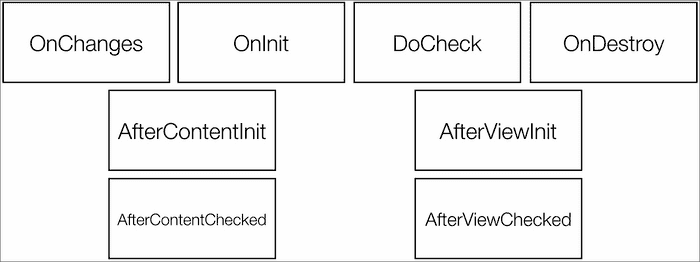

让我们来看一下不同的生命周期钩子：

+   `OnChanges`：一旦检测到给定组件的输入属性发生变化，将调用此钩子。例如，让我们来看一下以下组件：

```ts
@Component({
  selector: 'panel',
  inputs: ['title']
})
class Panel {…}
```

我们可以这样使用：

```ts
<panel [title]="expression"></panel>
```

一旦与`[title]`属性关联的表达式的值发生变化，将调用`ngOnChanges`钩子。我们可以使用以下代码片段来实现它：

```ts
@Component(…)
class Panel {
  ngOnChanges(changes) {
    Object.keys(changes).forEach(prop => {
      console.log(prop, 'changed. Previous value', changes[prop].previousValue);
    });
  }
}
```

前面的片段将显示所有更改的绑定及其旧值。为了在钩子的实现中更加明确，我们可以使用接口：

```ts
import {Component, OnChanges} from 'angular2/core';
@Component(…)
class Panel implements OnChanges {
  ngOnChanges(changes) {…}
}
```

代表各个生命周期钩子的所有接口都定义了一个以`ng`为前缀的接口名称的单个方法。在即将到来的列表中，我们将使用生命周期钩子这个术语，无论是接口还是方法，除非我们不会特别指代其中的一个。

+   `OnInit`：一旦给定组件被初始化，将调用此钩子。我们可以使用`OnInit`接口及其`ngOnInit`方法来实现它。

+   `DoCheck`：当给定组件的变更检测器被调用时，将调用此方法。它允许我们为给定组件实现自己的变更检测算法。请注意，`DoCheck`和`OnChanges`不应该在同一个指令上同时实现。

+   `OnDestroy`：如果我们实现了`OnDestroy`接口及其单个`ngOnDestroy`方法，我们可以钩入组件销毁生命周期阶段。一旦组件从组件树中分离，将调用此方法。

现在，让我们来看一下与组件内容和视图子元素相关的生命周期钩子：

+   `AfterContentInit`：如果我们实现了`ngAfterContentInit`生命周期钩子，那么当组件的内容完全初始化时，我们将收到通知。这是使用`ContentChild`或`ContentChildren`装饰的属性将被初始化的阶段。

+   `AfterContentChecked`：通过实现此钩子，我们将在每次 Angular 2 的变更检测机制检查给定组件的内容时收到通知。

+   `AfterViewInit`：如果我们实现了`ngAfterViewInit`生命周期钩子，那么当组件的视图完全初始化时，我们将收到通知。这是使用`ViewChild`或`ViewChildren`装饰的属性将被初始化的阶段。

+   `AfterViewChecked`：这类似于`AfterContentChecked`。一旦组件的视图被检查，`AfterViewChecked`钩子将被调用。

# 执行顺序

为了追踪与每个钩子相关的回调的执行顺序，让我们来看一下`ch4/ts/life-cycle/app.ts`示例：

```ts
@Component({
  selector: 'panel',
  inputs: ['title', 'caption'],
  template: '<ng-content></ng-content>'
})
class Panel {
  ngOnChanges(changes) {…}
  ngOnInit() {…}
  ngDoCheck() {…}
  ngOnDestroy() {…}
  ngAfterContentInit() {…}
  ngAfterContentChecked() {…}
  ngAfterViewInit() {…}
  ngAfterViewChecked() {…}
}
```

`Panel`组件实现了所有钩子，而没有显式实现与它们相关的接口。

我们可以在以下模板中使用该组件：

```ts
<button (click)="toggle()">Toggle</button>
<div *ngIf="counter % 2 == 0">
  <panel caption="Sample caption" title="Sample">Hello world!</panel>
</div>
```

在上面的示例中，我们有一个面板和一个按钮。每次点击按钮时，面板将通过`ngIf`指令被移除或附加到视图中。

在应用程序初始化期间，如果`"counter % 2 == 0"`表达式的结果被评估为`true`，`ngOnChanges`方法将被调用。这是因为标题和说明属性的值将首次设置。

紧接着，`ngOnInit`方法将被调用，因为组件已经初始化。一旦组件的初始化完成，将触发变更检测，这将导致调用`ngDoCheck`方法，允许我们钩入自定义逻辑以检测状态的变化。

### 注意

请注意，您不应该为同一个组件同时实现`ngDoCheck`和`ngOnChanges`方法，因为它们是互斥的。这里的示例仅用于学习目的。

在`ngDoCheck`方法之后，组件的内容将被检查（按顺序调用`ngAfterContentInit`和`ngAfterContentChecked`）。紧接着，组件的视图也将发生同样的情况（`ngAfterViewInit`后跟`ngAfterViewChecked`）。

一旦`ngIf`指令的表达式被评估为`false`，整个组件将从视图中分离，这将导致`ngOnDestroy`钩子的调用。

在下一个按钮点击时，如果`ngIf`表达式的值等于`true`，则与初始化阶段相同的生命周期钩子调用顺序将被执行。

# 使用 TemplateRef 定义通用视图

我们已经熟悉了输入、内容和视图子项的概念，也知道在组件的生命周期中何时可以获取对它们的引用。现在，我们将把它们结合起来，并引入一个新概念：`TemplateRef`。

让我们退一步，看一下本章早些时候开发的最后一个待办事项应用程序。在下面的屏幕截图中，你可以看到它的用户界面是什么样子的：

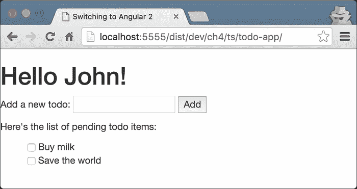

如果我们看一下它在`ch4/ts/inputs-outputs/app.ts`中的实现，我们会看到用于渲染单个待办事项的模板是在整个待办事项应用程序的模板中定义的。

如果我们想要使用不同的布局来渲染待办事项呢？我们可以通过创建另一个名为`Todo`的组件来实现这一点，该组件封装了渲染它们的责任。然后，我们可以为我们想要支持的不同布局定义单独的`Todo`组件。这样，即使我们只使用它们的模板，我们也需要为*n*个不同的布局定义*n*个不同的组件。

Angular 2 提供了一个更加优雅的解决方案。在本章的早些时候，我们已经讨论了模板元素。我们说它允许我们定义一块不会被浏览器处理的 HTML。Angular 2 允许我们引用这样的模板元素，并通过将它们作为内容子元素传递来使用它们！

以下是如何将自定义布局传递给我们重构后的`todo-app`组件：

```ts
// ch4/ts/template-ref/app.ts
<todo-app>
  <template var-todo>
    <input type="checkbox" [checked]="todo.completed"
      (change)="todo.completed = !todo.completed;">
    <span [class.completed]="todo.completed">
      {{todo.label}}
    </span><br>
  </template>
</todo-app>
```

在模板中，我们声明了一个名为`todo`的变量。稍后在模板中，我们可以使用它来指定我们希望可视化内容的方式。

现在，让我们看看如何在`TodoApp`组件的控制器中获取对这个模板的引用：

```ts
// ch4/ts/template-ref/app.ts
class TodoApp {
  @ContentChild(TemplateRef)
  private itemsTemplate: TemplateRef;
  // …
}
```

我们在这里所做的就是定义一个名为`itemsTemplate`的属性，并用`@ContentChild`装饰它。在组件的生命周期中（更准确地说，在`ngAfterContentInit`中），`itemsTemplate`的值将被设置为我们作为`todo-app`元素的内容传递的模板的引用。

不过还有一个问题——我们需要在`TodoList`组件中的模板中使用模板，因为那是我们渲染单个待办事项的地方。我们可以做的是在`TodoList`组件中定义另一个输入，并直接从`TodoApp`中传递模板：

```ts
// ch4/ts/template-ref/app.ts
class TodoList {
  @Input() todos: Todo[];
  @Input() itemsTemplate: TemplateRef;
  @Output() toggle = new EventEmitter<Todo>();
}
```

我们需要从`TodoApp`的模板中将其作为输入传递：

```ts
...
<todo-list [todos]="todos"
  [itemsTemplate]="itemsTemplate">
</todo-list>
```

只剩下的事情就是在`TodoList`应用程序的模板中使用这个模板引用：

```ts
<!-- … -->
<template *ngFor="var todo of todos; template: itemsTemplate"></template>
```

在本章的前几节中，我们解释了`ngForOf`指令的扩展语法。这个片段展示了这个指令的另一个属性：`ngForTemplate`属性。默认情况下，`ngForOf`指令的模板是它所用的元素。通过将模板引用指定为`ngForTemplate`属性，我们可以使用传递的`TemplateRef`。

# 理解和增强变更检测

我们已经简要描述了框架的变更检测机制。我们说过，与 AngularJS 1.x 相比，在 Angular 2 中，它在各个组件的上下文中运行。我们提到的另一个概念是 zone，它基本上拦截了我们使用浏览器 API 进行的所有异步调用，并为框架的变更检测机制提供执行上下文。Zone 解决了我们在 AngularJS 1.x 中遇到的烦人问题，即当我们在 Angular 之外使用 API 时，需要显式调用`digest`循环。

在第一章和第二章中，我们讨论了变更检测的两种主要实现：`DynamicChangeDetector`和`JitChangeDetector`。第一种对于具有严格**CSP**（**内容安全策略**）的环境非常有效，因为它禁用了 JavaScript 的动态评估。第二种则充分利用了 JavaScript 虚拟机的内联缓存机制，因此带来了很好的性能！

在本节中，我们将探讨`@Component`装饰器配置对象的另一个属性，它通过改变策略为我们提供了对框架的变更检测机制更进一步的控制。通过显式设置策略，我们能够阻止变更检测机制在组件的子树上运行，这在某些情况下可以带来很好的性能优势。

## 变更检测的执行顺序

现在，让我们简要描述一下变更检测在给定组件树中被调用的顺序。

为此，我们将使用我们拥有的待办事项应用程序的最后一个实现，但这次，我们将提取渲染单独待办事项的逻辑到一个名为 `TodoItem` 的单独组件中。在下图中，我们可以看到应用程序的结构：

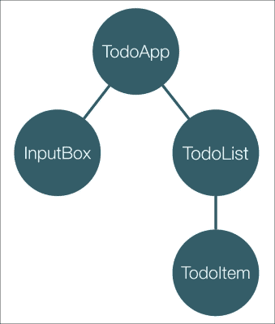

顶层是 `TodoApp` 组件，它有两个子组件：`InputBox` 和 `TodoList`。`TodoList` 组件在 `TodoItem` 组件中呈现单独的待办事项。实现细节对我们的目的不重要，所以我们将忽略它们。

现在，我们需要意识到父组件和其子组件之间存在隐含的依赖关系。例如，`TodoList` 组件的状态完全取决于其父级 `TodoApp` 组件中的待办事项。`TodoItem` 和 `TodoList` 之间也存在类似的依赖关系，因为 `TodoList` 组件将单独的待办事项传递给 `TodoItem` 组件的单独实例。

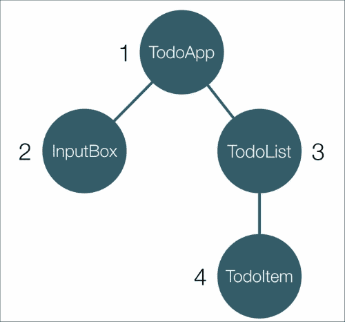

由于我们的最后观察，附加到各个组件的变更检测器的执行顺序如前图所示。一旦变更检测机制运行，它将首先对 `TodoApp` 组件进行检查。紧接着，将检查 `InputBox` 组件是否有变化，然后是 `TodoList` 组件。最后，Angular 将调用 `TodoItem` 组件的变更检测器。

您可以在 `ch4/ts/change_detection_strategy_order/app.ts` 示例中跟踪执行顺序，其中每个单独的组件在调用其 `ngDoCheck` 方法时记录一条消息。

### 注意

请注意，只有组件才有一个附加的变更检测器实例；指令使用其父组件的变更检测器。

## 变更检测策略

Angular 2 提供的变更检测策略有：`CheckOnce`、`Checked`、`CheckAlways`、`Detached`、`Default` 和 `OnPush`。我们将详细描述如何充分利用 `OnPush`，因为在使用不可变数据时非常强大。在深入研究 `OnPush` 之前，让我们简要描述其他策略。

现在，让我们导入 TypeScript `enum`，它可以用于配置用于各个组件的策略：

```ts
// ch4/ts/change_detection_strategy_broken/app.ts
import {ChangeDetectionStrategy} from 'angular2/core';
```

现在，我们可以配置`TodoList`组件以使用`Checked`策略：

```ts
@Component({
  selector: 'todo-list',
  changeDetection: ChangeDetectionStrategy.Checked,
  template: `...`,
  styles: […]
})
class TodoList { … }
```

这样，变更检测将被跳过，直到其模式（策略）更改为`CheckOnce`。但是，阻止变更检测运行意味着什么？您可以转到`http://localhost:5555/dist/dev/ch4/ts/change_detection_strategy_broken/`，并查看`TodoList`组件的不一致行为。当您在输入中添加一个新的待办事项并单击按钮时，它不会立即出现在列表中。

现在，让我们尝试`CheckOnce`！在`ch4/ts/change_detection_strategy_broken/app.ts`中，将`TodoList`组件的变更检测策略更改为`ChangeDetectionStrategy.CheckOnce`。刷新浏览器后，尝试添加一个新的待办事项。变更不应立即反映出来，因为`CheckOnce`会指示变更检测器仅执行一次检查（在这种情况下，在初始化期间），之后将不会发生任何变化。

默认情况下，它在`CheckAlways`模式下使用，正如其名称所示，不会阻止变更检测器运行。

如果我们将给定组件的策略声明为`Detached`，则变更检测器子树将不被视为主树的一部分，并将被跳过。

## 使用不可变数据和 OnPush 来提高性能

我们将要描述的最后一个变更检测策略是`OnPush`。当给定组件产生的结果仅取决于其输入时，它非常有用。在这种情况下，我们可以将不可变数据传递给输入，以确保它不会被任何其他组件改变。通过这种方式，通过具有仅依赖于其不可变输入的组件，我们可以确保它仅在接收到不同输入时（即不同引用）产生不同的用户界面。

在本节中，我们将在`TodoList`组件上应用`OnPush`策略。由于它仅依赖于其输入（`todos`输入），我们希望确保它的变更检测仅在收到`todos`集合的新引用时执行。

不可变数据的本质是它不能改变。这意味着一旦我们向`todos`集合添加新的待办事项，我们就不能改变它；相反，`add`（或在我们的情况下，`push`）方法将返回一个新的集合——包含新项目的初始集合的副本。

这可能看起来像是一个巨大的开销-每次更改都要复制整个集合。在大型应用程序中，这可能会对性能产生很大影响。然而，我们不需要复制整个集合。有一些库使用更智能的算法来实现不可变数据结构：持久数据结构。持久数据结构超出了当前内容的范围。关于它们的更多信息可以在大多数计算机科学高级数据结构的教科书中找到。好消息是，我们不必深入了解它们的实现就可以使用它们！有一个名为`Immutable.js`的库，它实现了一些常用的不可变数据结构。在我们的情况下，我们将使用不可变列表。通常，不可变列表的行为就像普通列表一样，但在每个应该改变它的操作上，它会返回一个新的列表。

这意味着如果我们有一个名为`foo`的不可变列表，并且向列表添加一个新项，我们将得到一个新的引用：

```ts
let foo = List.of(1, 2, 3);
let changed = foo.push(4);
foo === changed // false
console.log(foo.toJS()); // [ 1, 2, 3 ]
console.log(changed.toJS()); // [ 1, 2, 3, 4 ]
```

为了利用不可变性，我们需要使用 npm 安装`Immutable.js`。

我们已经在`ch4/ts/change_detection_strategy/app.ts`中做过这个。`Immutable.js`已经是`package.json`的一部分，它位于项目的根目录。

现在，是时候重构我们的待办事项应用程序，并使其使用不可变数据了！

## 在 Angular 中使用不可变数据结构

让我们看看我们目前如何在`TodoApp`组件中保存待办事项。

```ts
class TodoApp {
  todos: Todo[] = [...];
  ...
}
```

我们使用一个`Todo`项目的数组。JavaScript 数组是可变的，这意味着如果我们将其传递给使用`OnPush`策略的组件，如果我们得到相同的输入引用，跳过变更检测是不安全的。例如，我们可能有两个使用相同待办事项列表的组件。由于它是可变的，两个组件都可以修改列表。如果它们的变更检测没有执行，这将导致任何一个组件处于不一致的状态。这就是为什么我们需要确保保存项目的列表是不可变的。为了确保`TodoApp`组件将其数据保存在不可变数据结构中，我们需要做的就是这样：

```ts
// ch4/ts/change_detection_strategy/app.ts
class TodoApp {
  todos: ImmutableList<Todo> = ImmutableList.of({
    label: 'Buy milk',
    completed: false
  }, {
    label: 'Save the world',
    completed: false
  });
  ...
}
```

这样，我们将`todos`属性构造为不可变列表。由于不可变列表的变异操作会返回一个新列表，我们需要在`addTodo`和`toggleTodoCompletion`中进行轻微修改：

```ts
...
addTodo(label: string) {
  this.todos = this.todos.push({
    label,
    completed: false
  });
}
toggleCompletion(index: number) {
  this.todos = this.todos.update(index, todo => {
    let newTodo = {
      label: todo.label,
      completed: !todo.completed
    };
    return newTodo;
  });
}
…
```

`addTodo`函数看起来与以前完全相同，只是我们将`push`方法的结果设置为`todos`属性的值。

在`toggleTodoCompletion`中，我们使用不可变列表的`update`方法。作为第一个参数，我们传递要修改的待办事项的索引，第二个参数是执行实际修改的回调函数。请注意，由于在这种情况下我们使用的是不可变数据，所以我们复制了修改后的待办事项。这是必需的，因为它告诉`update`方法给定索引的项目已经更改（因为它是不可变的，只有当它具有新引用时才被认为已更改），这意味着整个列表已更改。

那就是复杂的部分！现在让我们来看一下`TodoList`组件的定义：

```ts
@Component({
  selector: 'todo-list',
  changeDetection: ChangeDetectionStrategy.OnPush,
  template: `...`,
  styles: [...]
})
class TodoList {
  @Input() todos: ImmutableList<Todo>;
  @Output() toggle = new EventEmitter<number>();
  toggleCompletion(index: number) {
    this.toggle.emit(index);
  }
}
```

在`@Component`装饰器内，我们将`changeDetection`属性设置为`OnPush`策略的值。这意味着组件只有在其任何输入获得新引用时才会运行其变更检测器。组件的模板保持完全相同，因为`ngForOf`在内部使用 ES2015 迭代器来循环提供的集合中的项目。它们受`Immutable.js`支持，因此不需要更改模板。

由于我们需要改变项目的索引（我们在`TodoApp`中的`todos`集合的`update`方法中使用的索引），我们将组件的输出类型更改为`EventEmitter<number>`。在`toggleCompletion`中，我们发出了更改的待办事项的索引。

这就是我们通过防止变更检测机制在父组件没有推送新引用的情况下运行整个右子树来优化我们的简单待办事项应用程序的方法。

# 总结

在本章中，我们介绍了 Angular 2 应用程序的核心构建模块：指令和组件。我们构建了一些示例组件，展示了用于定义这些基本概念的语法。我们还描述了每个指令的生命周期和给定指令和组件的核心功能集。作为下一步，我们看到了如何通过使用不可变数据和`OnPush`变更检测策略来增强应用程序的性能。

下一章完全致力于 Angular 2 服务和框架的依赖注入机制。我们将看看如何定义和实例化自定义注入器，以及如何利用依赖注入机制在我们的指令和组件中。
