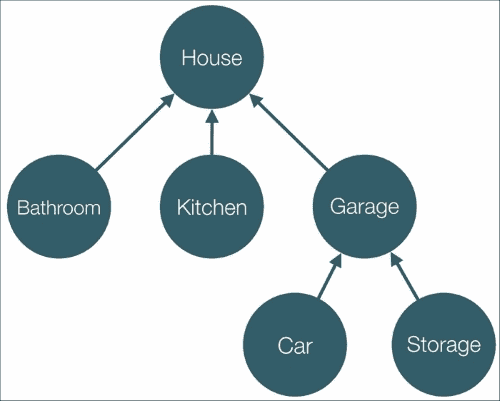

# 第五章：Angular 2 中的依赖注入

在本章中，我们将解释如何利用框架的**依赖注入**（**DI**）机制及其各种特性。

我们将探讨以下主题：

+   配置和创建注入器。

+   使用注入器实例化对象。

+   将依赖项注入到我们的指令和组件中。这样，我们将能够重用服务中定义的业务逻辑，并将其与 UI 逻辑连接起来。

+   注释我们将编写的 ES5 代码，以便获得与使用 TypeScript 语法时相同的结果。

# 我为什么需要依赖注入？

假设我们有一个依赖于`Engine`和`Transmission`类的`Car`类。我们如何实现这个系统？让我们看一下：

```ts
class Engine {…}
class Transmission {…}
class Car {
  engine;
  transmission;
  constructor() {
    this.engine = new Engine();
    this.transmission = new Transmission();
  }
}
```

在这个例子中，我们在`Car`类的构造函数中创建了它的依赖关系。虽然看起来很简单，但远非灵活。每次我们创建`Car`类的实例时，都会创建相同的`Engine`和`Transmission`类的实例。这可能会有问题，原因如下：

+   `Car`类变得不太可测试，因为我们无法独立测试它的`engine`和`transmission`依赖关系。

+   将`Car`类与用于实例化其依赖关系的逻辑耦合在一起。

# Angular 2 中的依赖注入

我们可以采用的另一种方法是利用 DI 模式。我们已经从 AngularJS 1.x 中熟悉了它。让我们演示如何在 Angular 2 的上下文中使用 DI 重构前面的代码：

```ts
class Engine {…}
class Transmission {…}

@Injectable()
class Car {
  engine;
  transmission;
  constructor(engine: Engine, transmission: Transmission) {
    this.engine = engine;
    this.transmission = transmission;
  }
}
```

在前面的片段中，我们所做的只是在`Car`类的定义顶部添加了`@Injectable`类装饰器，并为其构造函数的参数提供了类型注解。

## Angular 2 中 DI 的好处

还有一步剩下，我们将在下一节中看一下。但让我们看看所述方法的好处是什么：

+   我们可以轻松地为测试环境传递`Car`类的不同版本的依赖关系。

+   我们不再与依赖关系实例化周围的逻辑耦合在一起。

`Car`类只负责实现自己的领域特定逻辑，而不是与其他功能耦合，比如管理它的依赖关系。我们的代码也变得更加声明性和易于阅读。

现在，在我们意识到 DI 的一些好处之后，让我们看看为使这段代码工作所缺少的部分！

# 配置注入器

在我们的 Angular 2 应用程序中，通过框架的 DI 机制实例化各个依赖项的基本方法称为**注入器**。注入器包含一组**提供者**，封装了与**token**关联的已注册依赖项实例化的逻辑。我们可以将 token 视为注入器中注册的不同提供者的标识符。

让我们看一下下面的代码片段，它位于`ch5/ts/injector-basics/injector.ts`：

```ts
import 'reflect-metadata';
import {
  Injector, Inject, Injectable,
  OpaqueToken, provide
} from 'angular2/core';

const BUFFER_SIZE = new OpaqueToken('buffer-size');

class Buffer {
  constructor(@Inject(BUFFER_SIZE) private size: Number) {
    console.log(this.size);
  }
}

@Injectable()
class Socket {
  constructor(private buffer: Buffer) {}
}

let injector = Injector.resolveAndCreate([
  provide(BUFFER_SIZE, { useValue: 42 }),
  Buffer,
  Socket
]);

injector.get(Socket);
```

您可以使用以下命令运行该文件：

```ts
**cd app**
**ts-node ch5/ts/injector-basics/injector.ts**

```

如果您还没有安装`ts-node`，请参阅第三章 *TypeScript Crash Course*，了解如何继续在计算机上安装并运行它。

我们导入了`Injector`、`Injectable`、`Inject`、`OpaqueToken`和`provide`。

注入器表示用于实例化不同依赖项的**容器**。使用`provide`函数声明的规则和 TypeScript 编译器生成的元数据，它知道如何创建它们。

在前面的代码片段中，我们首先定义了`BUFFER_SIZE`常量，并将其设置为`new OpaqueToken('buffer-size')`的值。我们可以将`BUFFER_SIZE`的值视为应用程序中无法复制的唯一值（`OpaqueToken`是 ES2015 中`Symbol`类的替代品，因为在撰写本文时，TypeScript 不支持`Symbol`）。

我们定义了两个类：`Buffer`和`Socket`。`Buffer`类有一个构造函数，只接受一个名为`size`的依赖项，类型为`Number`。为了为依赖项解析过程添加额外的元数据，我们使用`@Inject`参数装饰器。这个装饰器接受一个标识符（也称为**token**），表示我们要注入的依赖项。通常情况下，它是依赖项的类型（即类的引用），但在某些情况下，它可以是不同类型的值。例如，在我们的例子中，我们使用了`OpaqueToken`类的实例。

## 使用生成的元数据进行依赖项解析

现在让我们看一下`Socket`类。我们用`@Injectable`装饰它。这个装饰器应该被任何接受依赖项的类使用，这些依赖项应该通过 Angular 2 的依赖注入机制注入。

`@Injectable`装饰器会强制 TypeScript 编译器为给定类接受的依赖项的类型生成额外的元数据。这意味着如果我们省略`@Injectable`装饰器，Angular 的 DI 机制将不会意识到与它需要解决的依赖项相关联的标记。

如果在类的顶部没有使用装饰器，TypeScript 不会生成任何元数据，这主要是出于性能方面的考虑。想象一下，如果为每个接受依赖项的类生成了这样的元数据，那么输出将充斥着未使用的额外类型元数据。

使用`@Injectable`的另一种方法是使用`@Inject`装饰器显式声明依赖项的类型。看一下下面的例子：

```ts
class Socket {
  constructor(@Inject(Buffer) private buffer: Buffer) {}
}
```

这意味着前面的代码与使用`@Injectable`的代码具有等效的语义，正如前面提到的。唯一的区别是，Angular 2 将会直接从`@Injector`装饰器添加的元数据中获取依赖项的类型（即与之关联的标记），而不是使用`@Injectable`时，它将查看编译器生成的元数据。

## 实例化注入器

现在，让我们创建一个注入器的实例，以便用它来实例化已注册的标记：

```ts
let injector = Injector.resolveAndCreate([
  provide(BUFFER_SIZE, { useValue: 42 }),
  Buffer,
  Socket
]);
```

我们使用`resolveAndCreate`的静态方法创建`Injector`的一个实例。这是一个工厂方法，接受一个提供者数组作为参数，并返回一个新的`Injector`。

`resolve`意味着提供者将经过解析过程，其中包括一些内部处理（展平多个嵌套数组并将单个提供者转换为数组）。稍后，注入器可以根据提供者封装的规则实例化我们已注册提供者的任何依赖项。

在我们的例子中，我们使用`provide`方法明确告诉 Angular 2 DI 机制在需要`BUFFER_SIZE`标记时使用值`42`。另外两个提供者是隐式的。一旦它们的所有依赖项都得到解决，Angular 2 将通过使用`new`运算符调用提供的类来实例化它们。

我们在`Buffer`类的构造函数中请求`BUFFER_SIZE`的值：

```ts
class Buffer {
  constructor(@Inject(BUFFER_SIZE) private size: Number) {
    console.log(this.size);
  }
}
```

在前面的例子中，我们使用了`@Inject`参数装饰器。它提示 DI 机制，`Buffer`类的构造函数的第一个参数应该用与传递给注入器的`BUFFER_SIZE`标记相关联的提供者实例化。

## 引入前向引用

Angular 2 引入了**前向引用**的概念。这是由于以下原因所必需的：

+   ES2015 类不会被提升。

+   允许解析在声明依赖提供者之后声明的依赖项。

在本节中，我们将解释前向引用解决的问题以及我们可以利用它们的方式。

现在，假设我们已经以相反的顺序定义了`Buffer`和`Socket`类：

```ts
// ch5/ts/injector-basics/forward-ref.ts

@Injectable()
class Socket {
  constructor(private buffer: Buffer) {…}
}

// undefined
console.log(Buffer);

class Buffer {
  constructor(@Inject(BUFFER_SIZE) private size: Number) {…}
}

// [Function: Buffer]
console.log(Buffer);
```

在这里，我们有与前面例子中相同的依赖关系，但在这种情况下，`Socket`类的定义在`Buffer`类的定义之前。请注意，直到 JavaScript 虚拟机评估`Buffer`类的声明之前，`Buffer`标识符的值将等于`undefined`。然而，`Socket`接受的依赖项类型的元数据将在`Socket`类定义之后生成并放置。这意味着除了解释生成的 JavaScript 之外，`Buffer`标记的值将等于`undefined`——也就是说，在 Angular 2 的 DI 机制的上下文中，框架将获得一个无效的值。

运行前面的代码片段将导致以下形式的运行时错误：

```ts
**Error: Cannot resolve all parameters for Socket(undefined). Make sure they all have valid type or annotations.**

```

解决这个问题的最佳方法是通过交换定义的顺序。我们可以继续的另一种方法是利用 Angular 2 提供的解决方案：前向引用：

```ts
…
import {forwardRef} from 'angular2/core';
…
@Injectable()
class Socket {
  constructor(@Inject(forwardRef(() => Buffer))
    private buffer: Buffer) {}
}
class Buffer {…}
```

前面的代码片段演示了我们如何利用前向引用。我们所需要做的就是使用`@Inject`参数装饰器，并将`forwardRef`函数的调用结果传递给它。`forwardRef`函数是一个高阶函数，接受一个参数——另一个负责返回与需要被注入的依赖项（或更准确地说是与其提供者相关联的）关联的标记的函数。这样，框架提供了一种推迟解析依赖项类型（标记）的过程的方式。

依赖项的标记将在首次需要实例化`Socket`时解析，而不是默认行为，在给定类的声明时需要标记。

## 配置提供程序

现在，让我们看一个类似于之前使用的示例，但注入器的配置不同的示例。

```ts
let injector = Injector.resolveAndCreate([
  provide(BUFFER_SIZE, { useValue: 42 }),
  provide(Buffer, { useClass: Buffer }),
  provide(Socket, { useClass: Socket })
]);
```

在这种情况下，在提供程序内部，我们明确声明了我们希望使用`Buffer`类来构建具有与`Buffer`类引用相等的标记的依赖项。对于与`Socket`标记关联的依赖项，我们做了完全相同的事情；但这次，我们提供了`Socket`类。这就是当我们省略`provide`函数的调用并只传递一个类的引用时，Angular 2 将如何进行。

明确声明用于实例化相同类的类可能看起来毫无价值，鉴于我们迄今为止看到的例子，这完全正确。然而，在某些情况下，我们可能希望为与给定类标记关联的依赖项的实例化提供不同的类。

例如，假设我们有一个名为`Http`的服务，它在一个名为`UserService`的服务中使用：

```ts
class Http {…}

@Injectable()
class UserService {
  constructor(private http: Http) {}
}

let injector = Injector.resolveAndCreate([
  UserService,
  Http
]);
```

`UserService`服务使用`Http`与 RESTful 服务进行通信。我们可以使用`injector.get(UserService)`来实例化`UserService`。这样，由注入器的`get`方法调用的`UserService`构造函数将接受`Http`服务的实例作为参数。然而，如果我们想要测试`UserService`，我们实际上并不需要对 RESTful 服务进行 HTTP 调用。在单元测试的情况下，我们可以提供一个虚拟实现，只会伪造这些 HTTP 调用。为了向`UserService`服务注入一个不同类的实例，我们可以将注入器的配置更改为以下内容：

```ts
class DummyHttp {…}

// ...

let injector = Injector.resolveAndCreate([
  UserService,
  provide(Http, { useClass: DummyHttp })
]);
```

现在，当我们实例化`UserService`时，它的构造函数将接收一个`DummyHttp`服务实例的引用。这段代码位于`ch5/ts/configuring-providers/dummy-http.ts`中。

### 使用现有的提供程序

另一种方法是使用提供程序配置对象的`useExisting`属性：

```ts
// ch5/ts/configuring-providers/existing.ts
let injector = Injector.resolveAndCreate([
  DummyService,
  provide(Http, { useExisting: DummyService }),
  UserService
]);
```

在前面的片段中，我们注册了三个令牌：`DummyService`、`UserService`和`Http`。我们声明要将`Http`令牌绑定到现有令牌`DummyService`。这意味着当请求`Http`服务时，注入器将找到用作`useExisting`属性值的令牌的提供者并实例化它或获取与之关联的值。我们可以将`useExisting`视为创建给定令牌的别名：

```ts
let dummyHttp = {
  get() {},
  post() {}
};
let injector = Injector.resolveAndCreate([
  provide(DummyService, { useValue: dummyHttp }),
  provide(Http, { useExisting: DummyService }),
  UserService
]);
console.assert(injector.get(UserService).http === dummyHttp);
```

前面的片段将创建一个`Http`令牌到`DummyHttp`令牌的别名。这意味着一旦请求`Http`令牌，调用将转发到与`DummyHttp`令牌关联的提供者，该提供者将解析为值`dummyHttp`。

# 定义实例化服务的工厂

现在，假设我们想创建一个复杂的对象，例如代表**传输层安全**（**TLS**）连接的对象。这样一个对象的一些属性是套接字、一组加密协议和证书。在这个问题的背景下，我们迄今为止看到的 Angular 2 的 DI 机制的特性似乎有点有限。

例如，我们可能需要配置`TLSConnection`类的一些属性，而不将其实例化过程与所有配置细节耦合在一起（选择适当的加密算法，打开我们将建立安全连接的 TCP 套接字等）。

在这种情况下，我们可以利用提供者配置对象的`useFactory`属性：

```ts
let injector = Injector.resolveAndCreate([
  provide(TLSConnection, {
    useFactory: (socket: Socket, certificate: Certificate, crypto: Crypto) =>  {
      let connection = new TLSConnection();
      connection.certificate = certificate;
      connection.socket = socket;
      connection.crypto = crypto;
      socket.open();
      return connection;
    },
    deps: [Socket, Certificate, Crypto]
  }),
  provide(BUFFER_SIZE, { useValue: 42 }),
  Buffer,
  Socket,
  Certificate,
  Crypto
]);
```

前面的代码一开始似乎有点复杂，但让我们一步一步地来看看它。我们可以从我们已经熟悉的部分开始：

```ts
let injector = Injector.resolveAndCreate([
  ...
  provide(BUFFER_SIZE, { useValue: 42 }),
  Buffer,
  Socket,
  Certificate,
  Crypto
]);
```

最初，我们注册了一些提供者：`Buffer`、`Socket`、`Certificate`和`Crypto`。就像前面的例子一样，我们还注册了`BUFFER_SIZE`令牌，并将其与值`42`关联起来。这意味着我们已经可以创建`Buffer`、`Socket`、`Certificate`和`Crypto`类型的对象：

```ts
// buffer with size 42
console.log(injector.get(Buffer));
// socket with buffer with size 42
console.log(injector.get(Socket));
```

我们可以通过以下方式创建和配置`TLSConnection`对象的实例：

```ts
let connection = new TLSConnection();
connection.certificate = certificate;
connection.socket = socket;
connection.crypto = crypto;
socket.open();
return connection;
```

现在，如果我们注册一个具有`TLSConnection`标记作为依赖项的提供者，我们将阻止 Angular 的依赖注入机制处理依赖项解析过程。为了解决这个问题，我们可以使用提供者配置对象的`useFactory`属性。这样，我们可以指定一个函数，在这个函数中我们可以手动创建与提供者标记相关联的对象的实例。我们可以将`useFactory`属性与`deps`属性一起使用，以指定要传递给工厂的依赖项：

```ts
provide(TLSConnection, {
  useFactory: (socket: Socket, certificate: Certificate, crypto: Crypto) =>  {
    // ...
  },
  deps: [Socket, Certificate, Crypto]
})
```

在前面的片段中，我们定义了用于实例化`TLSConnection`的工厂函数。作为依赖项，我们声明了`Socket`，`Certificate`和`Crypto`。这些依赖项由 Angular 2 的 DI 机制解析并注入到工厂函数中。您可以在`ch5/ts/configuring-providers/factory.ts`中查看整个实现并进行操作。

# 子注入器和可见性

在本节中，我们将看看如何构建注入器的层次结构。这是 Angular 2 引入的一个全新概念。每个注入器可以有零个或一个父注入器，每个父注入器可以分别有零个或多个子注入器。与 AngularJS 1.x 相比，在 Angular 2 中，所有注册的提供者都存储在树中，而不是存储在一个扁平的结构中。扁平结构更为有限；例如，它不支持标记的命名空间；也就是说，我们不能为同一个标记声明不同的提供者，这在某些情况下可能是必需的。到目前为止，我们看了一个没有任何子节点或父节点的注入器的示例。现在让我们构建一个注入器的层次结构！

为了更好地理解这种注入器的层次结构，让我们看一下下图：



在这里，我们看到一个树，其中每个节点都是一个注入器，每个注入器都保留对其父级的引用。注入器**House**有三个子注入器：**Bathroom**，**Kitchen**和**Garage**。

**Garage**有两个子节点：**Car**和**Storage**。我们可以将这些注入器视为内部注册了提供者的容器。

假设我们想要获取与标记**Tire**相关联的提供程序的值。如果我们使用注射器**Car**，这意味着 Angular 2 的 DI 机制将尝试在**Car**及其所有父级**Garage**和**House**中查找与此标记相关联的提供程序，直到找到为止。

## 构建注射器的层次结构

为了更好地理解上一段，让我们看一个简单的例子：

```ts
// ch5/ts/parent-child/simple-example.ts
class Http {}

@Injectable()
class UserService {
  constructor(public http: Http) {}
}

let parentInjector = Injector.resolveAndCreate([
  Http
]);
let childInjector = parentInjector.resolveAndCreateChild([
  UserService
]);

// UserService { http: Http {} }
console.log(childInjector.get(UserService));
// true
console.log(childInjector.get(Http) === parentInjector.get(Http));
```

由于它们对于解释前面的片段并不重要，所以省略了导入部分。我们有两个服务，`Http`和`UserService`，其中`UserService`依赖于`Http`服务。

最初，我们使用`Injector`类的`resolveAndCreate`静态方法创建了一个注射器。我们向此注射器传递了一个隐式提供程序，稍后将解析为具有`Http`标记的提供程序。使用`resolveAndCreateChild`，我们解析了传递的提供程序并实例化了一个注射器，该注射器指向`parentInjector`（因此我们得到与上图中**Garage**和**House**之间相同的关系）。

现在，使用`childInjector.get(UserService)`，我们能够获取与`UserService`标记相关联的值。类似地，使用`childInjector.get(Http)`和`parentInjector.get(Http)`，我们得到与`Http`标记相关联的相同值。这意味着`childInjector`向其父级请求与请求的标记相关联的值。

然而，如果我们尝试使用`parentInjector.get(UserService)`，我们将无法获取与该标记相关联的值，因为在此注射器中，我们没有注册具有此标记的提供程序。

## 配置依赖关系

现在我们熟悉了注射器的层次结构，让我们看看如何从其中获取适当注射器的依赖关系。

### 使用@Self 装饰器

现在假设我们有以下配置：

```ts
abstract class Channel {}
class Http extends Channel {}
class WebSocket extends Channel {}

@Injectable()
class UserService {
  constructor(public channel: Channel) {}
}

let parentInjector = Injector.resolveAndCreate([
  provide(Channel, { useClass: Http })
]);
let childInjector = parentInjector.resolveAndCreateChild([
  provide(Channel, { useClass: WebSocket }),
  UserService
]);
```

我们可以使用以下方法实例化`UserService`标记：

```ts
childInjector.get(UserService);
```

在`UserService`中，我们可以声明我们要使用`@Self`装饰器从当前注射器（即`childInjector`）获取`Channel`依赖项的值：

```ts
@Injectable()
class UserService {
  constructor(@Self() public channel: Channel) {}
}
```

尽管在实例化`UserService`期间，这将是默认行为，但使用`@Self`，我们可以更加明确。假设我们将`childInjector`的配置更改为以下内容：

```ts
let parentInjector = Injector.resolveAndCreate([
  provide(Channel, { useClass: Http })
]);
let childInjector = parentInjector.resolveAndCreateChild([
  UserService
]);
```

如果我们在`UserService`构造函数中保留`@Self`装饰器，并尝试使用`childInjector`实例化`UserService`，由于缺少`Channel`的提供程序，我们将收到运行时错误。

### 跳过自注入器

在某些情况下，特别是在注入 UI 组件的依赖项时，我们可能希望使用父注入器中注册的提供者，而不是当前注入器中注册的提供者。我们可以通过利用`@SkipSelf`装饰器来实现这种行为。例如，假设我们有以下类`Context`的定义：

```ts
class Context {
  constructor(public parentContext: Context) {}
}
```

`Context`类的每个实例都有一个父级。现在让我们构建一个包含两个注入器的层次结构，这将允许我们创建一个具有父上下文的上下文：

```ts
let parentInjector = Injector.resolveAndCreate([
  provide(Context, { useValue: new Context(null) })
]);
let childInjector = parentInjector.resolveAndCreateChild([
  Context
]);
```

由于根上下文没有父级，我们将设置其提供者的值为`new Context(null)`。

如果我们想要实例化子上下文，我们可以使用：

```ts
childInjector.get(Context);
```

对于子级的实例化，`Context`将由`childInjector`中注册的提供者使用。但是，作为一个依赖项，它接受一个`Context`类的实例对象。这些类存在于同一个注入器中，这意味着 Angular 将尝试实例化它，但它具有`Context`类型的依赖项。这个过程将导致一个无限循环，从而导致运行时错误。

为了防止这种情况发生，我们可以以以下方式更改`Context`的定义：

```ts
class Context {
  constructor(@SkipSelf() public parentContext: Context) {}
}
```

我们引入的唯一变化是参数装饰器`@SkipSelf`的添加。

### 具有可选依赖项

Angular 2 引入了`@Optional`装饰器，它允许我们处理没有与之关联的已注册提供者的依赖项。假设一个提供者的依赖项在负责其实例化的任何目标注入器中都不可用。如果我们使用`@Optional`装饰器，在实例化缺失依赖项的依赖提供者时，缺失依赖项的值将被传递为`null`。

现在让我们看一个例子：

```ts
abstract class SortingAlgorithm {
  abstract sort(collection: BaseCollection): BaseCollection;
}

@Injectable()
class Collection extends BaseCollection {
  private sort: SortingAlgorithm;
  constructor(sort: SortingAlgorithm) {
    super();
    this.sort = sort || this.getDefaultSort();
  }
}

let injector = Injector.resolveAndCreate([
  Collection
]);
```

在这种情况下，我们定义了一个名为`SortingAlgorithm`的抽象类和一个名为`Collection`的类，它接受一个扩展`SortingAlgorithm`的具体类的实例作为依赖项。在`Collection`构造函数内，我们将`sort`实例属性设置为传递的`SortingAlgorithm`类型的依赖项或默认的排序算法实现。

我们没有在我们配置的注入器中为`SortingAlgorithm`令牌定义任何提供者。因此，如果我们想使用`injector.get(Collection)`来获取`Collection`类的实例，我们将会得到一个运行时错误。这意味着，如果我们想使用框架的 DI 机制获取`Collection`类的实例，我们必须为`SortingAlgorithm`令牌注册一个提供者，尽管我们可以回退到默认排序算法的实现。

Angular 2 通过`@Optional`装饰器为这个问题提供了解决方案。

这就是我们可以使用框架提供的`@Optional`装饰器来解决问题的方式。

```ts
// ch5/ts/decorators/optional.ts
@Injectable()
class Collection extends BaseCollection {
  private sort: SortingAlgorithm;
  constructor(@Optional() sort: SortingAlgorithm) {
    super();
    this.sort = sort || this.getDefaultSort();
  }
}
```

在前面的片段中，我们将`sort`依赖声明为可选的，这意味着如果 Angular 2 找不到其令牌的任何提供者，它将传递`null`值。

### 使用多提供者

多提供者是 Angular 2 DI 机制引入的另一个新概念。它们允许我们将多个提供者与相同的令牌关联起来。如果我们正在开发一个带有不同服务的默认实现的第三方库，但是你想允许用户使用自定义的实现来扩展它，这将非常有用。它们还专门用于在 Angular 2 表单模块中对单个控件进行多个验证。我们将在第六章和第七章中解释这个模块。

另一个适用于多提供者的用例示例是 Angular 2 在其 WebWorkers 实现中用于事件管理的。他们为事件管理插件创建了多提供者。每个提供者返回一个不同的策略，支持不同的事件集（触摸事件、键盘事件等）。一旦发生特定事件，他们可以选择处理它的适当插件。

让我们来看一个例子，说明了多提供者的典型用法：

```ts
// ch5/ts/configuring-providers/multi-providers.ts
const VALIDATOR = new OpaqueToken('validator');

interface EmployeeValidator {
  (person: Employee): boolean;
}

class Employee {...}

let injector = Injector.resolveAndCreate([
  provide(VALIDATOR, { multi: true,
    useValue: (person: Employee) => {
      if (!person.name) {
        return 'The name is required';
      }
    }
  }),
  provide(VALIDATOR, { multi: true,
    useValue: (person: Employee) => {
      if (!person.name || person.name.length < 1) {
        return 'The name should be more than 1 symbol long';
      }
    }
  }),
  Employee
]);
```

在前面的代码片段中，我们声明了一个名为`VALIDATOR`的常量，其中包含`OpaqueToken`的新实例。我们还创建了一个注入器，在那里我们注册了三个提供程序——其中两个被用作值函数，根据不同的标准，验证`Employee`类的实例。这些函数的类型是`EmployeeValidator`。

为了声明我们希望注入器将所有注册的验证器传递给`Employee`类的构造函数，我们需要使用以下构造函数定义：

```ts
class Employee {
  name: string;
  constructor(@Inject(VALIDATOR) private validators: EmployeeValidator[]) {}
  validate() {
    return this.validators
      .map(v => v(this))
      .filter(value => !!value);
  }
}
```

在前面的示例中，我们声明了一个名为`Employee`的类，它接受一个依赖项——一个`EmployeeValidators`数组。在`validate`方法中，我们对当前类实例应用了各个验证器，并过滤结果，以便只获取返回错误消息的验证器。

请注意构造函数参数`validators`的类型是`EmployeeValidator[]`。由于我们不能将类型“对象数组”用作提供程序的标记，因为它不是有效的类型引用，所以我们需要使用`@Inject`参数装饰器。

## 在组件和指令中使用 DI

在第四章中，*使用 Angular 2 组件和指令入门*，当我们开发了我们的第一个 Angular 2 指令时，我们看到了如何利用 DI 机制将服务注入到我们的 UI 相关组件（即指令和组件）中。

让我们从依赖注入的角度快速看一下我们之前做的事情：

```ts
// ch4/ts/tooltip/app.ts
// ...
@Directive(...)
export class Tooltip {
  @Input()
  saTooltip:string;

  constructor(private el: ElementRef, private overlay: Overlay) {
    this.overlay.attach(el.nativeElement);
  }
  // ...
}
@Component({
  // ...
  providers: [Overlay],
  directives: [Tooltip]
})
class App {}
```

由于大部分早期实现的代码与我们当前的重点无直接关系，因此被省略。

请注意`Tooltip`的构造函数接受两个依赖项：

+   `ElementRef`类的一个实例。

+   `Overlay`类的一个实例。

依赖项的类型是与其提供程序关联的标记，来自提供程序的相应值将使用 Angular 2 的 DI 机制进行注入。

尽管`Tooltip`类的依赖项声明看起来与我们在之前的部分中所做的完全相同，但既没有任何显式配置，也没有任何注入器的实例化。

## 介绍元素注入器

在幕后，Angular 将为所有指令和组件创建注入器，并向其添加一组默认提供者。这就是所谓的**元素注入器**，是框架自己处理的事情。与组件关联的注入器称为**宿主注入器**。每个指令和组件注入器中的一个提供者与`ElementRef`令牌相关联；它将返回指令的宿主元素的引用。但是`Overlay`类的提供者在哪里声明？让我们看一下顶层组件的实现：

```ts
@Component({
  // ...
  providers: [Overlay],
  directives: [Tooltip]
})

class App {}
```

我们通过在`@Component`装饰器内声明`providers`属性来为`App`组件配置元素注入器。在这一点上，注册的提供者将被相应元素注入器关联的指令或组件以及组件的整个子树所看到，除非在层次结构的某个地方被覆盖。

### 声明元素注入器的提供者

将所有提供者的声明放在同一个地方可能会非常不方便。例如，想象一下，我们正在开发一个大型应用程序，其中有数百个组件依赖于成千上万的服务。在这种情况下，在根组件中配置所有提供者并不是一个实际的解决方案。当两个或更多提供者与相同的令牌相关联时，将会出现名称冲突。配置将会很庞大，很难追踪不同的令牌需要被注入的地方。

正如我们提到的，Angular 2 的`@Directive`（以及相应的`@Component`）装饰器允许我们使用`providers`属性引入特定于指令的提供者。以下是我们可以采用的方法：

```ts
@Directive({
  selector: '[saTooltip]',
  providers: [OverlayMock]
})
export class Tooltip {
  @Input()
  saTooltip: string;

  constructor(private el: ElementRef, private overlay: Overlay) {
    this.overlay.attach(el.nativeElement);
  }
  // ...
}

// ...

bootstrap(App);
```

前面的示例覆盖了`Tooltip`指令声明中`Overlay`令牌的提供者。这样，Angular 在实例化工具提示时将注入`OverlayMock`的实例，而不是`Overlay`。

覆盖提供者的更好方法是使用`bootstrap`函数。我们可以这样做：

```ts
bootstrap(AppMock, [provide(Overlay, {
  useClass: OverlayMock
})]);
```

在前面的`bootstrap`调用中，我们为`Overlay`服务提供了一个不同的顶层组件和提供者，它将返回`OverlayMock`类的实例。这样，我们可以测试`Tooltip`指令，忽略`Overlay`的实现。

### 探索组件的依赖注入

由于组件通常是带有视图的指令，到目前为止我们所看到的关于 DI 机制如何与指令一起工作的一切对组件也是有效的。然而，由于组件提供的额外功能，我们可以对它们的提供程序有更多的控制。

正如我们所说，与每个组件关联的注入器将被标记为**宿主**注入器。有一个称为`@Host`的参数装饰器，它允许我们从任何注入器中检索给定的依赖项，直到达到最近的宿主注入器。这意味着通过在指令中使用`@Host`装饰器，我们可以声明我们要从当前注入器或任何父注入器中检索给定的依赖项，直到达到最近父组件的注入器。

添加到`@Component`装饰器的`viewProviders`属性负责实现更多的控制。

### viewProviders 与 providers

让我们来看一个名为`MarkdownPanel`的组件的示例。这个组件将以以下方式使用：

```ts
<markdown-panel>
  <panel-title># Title</pane-title>
  <panel-content>
# Content of the panel
* First point
* Second point
  </panel-content>
</markdown-panel>
```

面板每个部分的内容将从 markdown 翻译成 HTML。我们可以将这个功能委托给一个名为`Markdown`的服务：

```ts
import * as markdown from 'markdown';
class Markdown {
  toHTML(md) {
    return markdown.toHTML(md);
  }
}
```

`Markdown`服务将 markdown 模块包装起来，以便通过 DI 机制进行注入。

现在让我们实现`MarkdownPanel`。

在下面的代码片段中，我们可以找到组件实现的所有重要细节：

```ts
// ch5/ts/directives/app.ts
@Component({
  selector: 'markdown-panel',
  viewProviders: [Markdown],
  styles: [...],
  template: `
    <div class="panel">
      <div class="panel-title">
        <ng-content select="panel-title"></ng-content>
      </div>
      <div class="panel-content">
        <ng-content select="panel-content"></ng-content>
      </div>
    </div>`
})
class MarkdownPanel {
  constructor(private el: ElementRef, private md: Markdown) {}
  ngAfterContentInit() {
    let el = this.el.nativeElement;
    let title = el.querySelector('panel-title');
    let content = el.querySelector('panel-content');
    title.innerHTML = this.md.toHTML(title.innerHTML);
    content.innerHTML = this.md.toHTML(content.innerHTML);
  }
}
```

我们使用了`markdown-panel`选择器并设置了`viewProviders`属性。在这种情况下，只有一个单一的视图提供程序：`Markdown`服务的提供程序。通过设置这个属性，我们声明了所有在其中声明的提供程序将可以从组件本身和所有的**视图子级**中访问。

现在，假设我们有一个名为`MarkdownButton`的组件，并且我们希望以以下方式将其添加到我们的模板中：

```ts
    <markdown-panel>
      <panel-title>### Small title</panel-title>
      <panel-content>
      Some code
      </panel-content>
      <markdown-button>*Click to toggle*</markdown-button>
   </markdown-panel>
```

`Markdown`服务将无法被下面使用`panel-content`元素的`MarkdownButton`访问；但是，如果我们在组件的模板中使用按钮，它将是可访问的：

```ts
@Component({
  selector: 'markdown-panel',
  viewProviders: [Markdown],
  directives: [MarkdownButton],
  styles: […],
  template: `
    <div class="panel">
      <markdown-button>*Click to toggle*</markdown-button>
      <div class="panel-title">
        <ng-content select="panel-title"></ng-content>
      </div>
      <div class="panel-content">
        <ng-content select="panel-content"></ng-content>
      </div>
    </div>`
})
```

如果我们需要提供程序在所有内容和视图子级中可见，我们只需要将`viewProviders`属性的属性名更改为`providers`。

你可以在`ch5/ts/directives/app.ts`目录下的文件中找到这个示例。

## 使用 ES5 的 Angular DI

我们已经熟练使用 TypeScript 进行 Angular 2 的依赖注入！正如我们所知，我们在开发 Angular 2 应用程序时并不局限于 TypeScript；我们也可以使用 ES5、ES2015 和 ES2016（以及 Dart，但这超出了本书的范围）。

到目前为止，我们在构造函数中使用标准的 TypeScript 类型注释声明了不同类的依赖关系。所有这些类都应该用`@Injectable`装饰器进行修饰。不幸的是，Angular 2 支持的其他一些语言缺少了一些这些特性。在下表中，我们可以看到 ES5 不支持类型注释、类和装饰器：

|   | ES5 | ES2015 | ES2016 |
| --- | --- | --- | --- |
| 类 | 否 | 是 | 是 |
| 装饰器 | 否 | 否 | 是（没有参数装饰器） |
| 类型注释 | 否 | 否 | 否 |

在这种情况下，我们如何利用这些语言中的 DI 机制？Angular 2 提供了一个内部 JavaScript**领域特定语言**（**DSL**），允许我们利用 ES5 的整个框架功能。

现在，让我们将我们在上一节中看到的`MarkdownPanel`示例从 TypeScript 翻译成 ES5。首先，让我们从`Markdown`服务开始：

```ts
// ch5/es5/simple-example/app.js
var Markdown = ng.core.Class({
  constructor: function () {},
  toHTML: function (md) {
    return markdown.toHTML(md);
  }
});
```

我们定义了一个名为`Markdown`的变量，并将其值设置为从调用`ng.core.Class`返回的结果。这种构造允许我们使用 ES5 模拟 ES2015 类。`ng.core.Class`方法的参数是一个对象字面量，必须包含`constructor`函数的定义。因此，`ng.core.Class`将返回一个 JavaScript 构造函数，其中包含来自对象字面量的`constructor`的主体。传递参数边界内定义的所有其他方法将被添加到函数的原型中。

一个问题已经解决：我们现在可以在 ES5 中模拟类；还有两个问题没有解决！

现在，让我们看看如何定义`MarkdownPanel`组件：

```ts
// ch5/es5/simple-example/app.js

var MarkdownPanel = ng.core.Component({
  selector: 'markdown-panel',
  viewProviders: [Markdown],
  styles: [...],
  template: '...'
})
.Class({
  constructor: [Markdown, ng.core.ElementRef, function (md, el) {
    this.md = md;
    this.el = el;
  }],
  ngAfterContentInit: function () {
    …
  }
});
```

从第四章, *使用 Angular 2 组件和指令入门*，我们已经熟悉了用于定义组件的 ES5 语法。现在，让我们看一下`MarkdownPanel`的构造函数，以确保我们如何声明我们组件甚至一般类的依赖关系。

从前面的片段中，我们可以注意到构造函数的值这次不是一个函数，而是一个数组。这可能让你觉得很熟悉，就像在 AngularJS 1.x 中一样，我们可以通过列出它们的名称来声明给定服务的依赖项：

```ts
Module.service('UserMapper',
  ['User', '$http', function (User, $http) {
    // …
  }]);
```

尽管 Angular 2 中的语法类似，但它带来了许多改进。例如，我们不再局限于使用字符串来表示依赖项的标记。

现在，假设我们想将`Markdown`服务作为可选依赖项。在这种情况下，我们可以通过传递装饰器数组来实现：

```ts
…
.Class({
  constructor: [[ng.core.Optional(), Markdown],
    ng.core.ElementRef, function (md, el) {
      this.md = md;
      this.el = el;
    }],
  ngAfterContentInit: function () {
    …
  }
});
…
```

通过嵌套数组，我们可以应用一系列装饰器：`[[ng.core.Optional()`, `ng.core.Self()`, `Markdown]`, `...]`。在这个例子中，`@Optional`和`@Self`装饰器将按指定的顺序向类添加关联的元数据。

尽管使用 ES5 使我们的构建更简单，并允许我们跳过转译的中间步骤，这可能很诱人，但谷歌的建议是利用 TypeScript 的静态类型优势。这样，我们就有了更清晰的语法，更少的输入，更好的语义，并提供了强大的工具。

# 总结

在本章中，我们介绍了 Angular 2 的 DI 机制。我们简要讨论了在项目中使用依赖注入的优点，通过在框架的上下文中引入它。我们旅程的第二步是如何实例化和配置注入器；我们还解释了注入器的层次结构和已注册提供者的可见性。为了更好地分离关注点，我们提到了如何在指令和组件中注入承载应用程序业务逻辑的服务。我们最后关注的一点是如何使用 ES5 语法与 DI 机制配合使用。

在下一章中，我们将介绍框架的新路由机制。我们将解释如何配置基于组件的路由器，并向我们的应用程序添加多个视图。我们将要涵盖的另一个重要主题是新的表单模块。通过构建一个简单的应用程序，我们将演示如何创建和管理表单。
