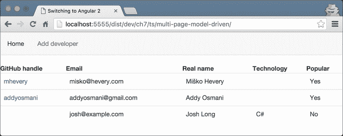
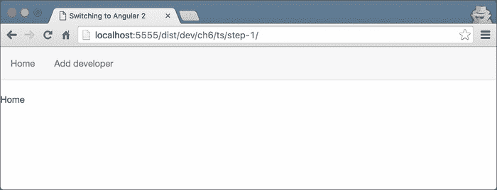
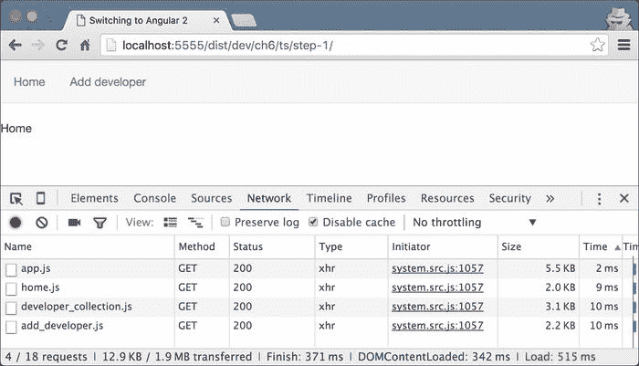
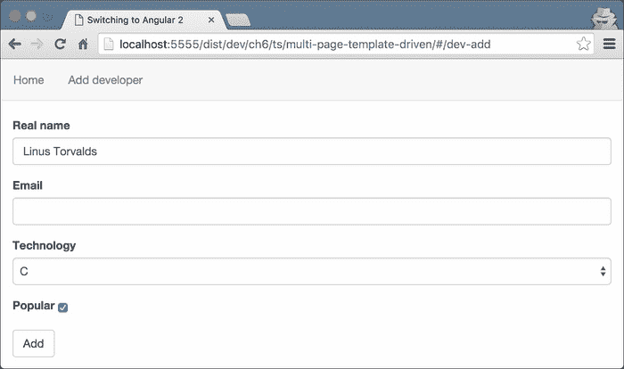
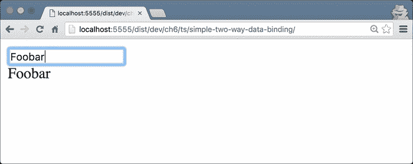
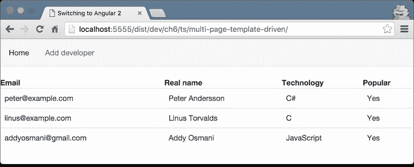

# 第六章：使用 Angular 2 路由器和表单

到目前为止，我们已经熟悉了框架的核心。我们知道如何定义组件和指令来开发我们应用程序的视图。我们还知道如何将与业务相关的逻辑封装到服务中，并使用 Angular 2 的依赖注入机制将所有内容连接起来。

在本章中，我们将解释一些概念，这些概念将帮助我们构建真实的 Angular 2 应用程序。它们如下：

+   框架的基于组件的路由器。

+   使用 Angular 2 表单。

+   开发基于模板的表单。

+   开发自定义表单验证器。

让我们开始吧！

# 开发“Coders repository”应用程序

在解释前面提到的概念的过程中，我们将开发一个包含开发人员存储库的示例应用程序。在我们开始编码之前，让我们解释一下应用程序的结构。

“Coders repository”将允许其用户通过填写有关他们的详细信息的表单或提供开发人员的 GitHub 句柄并从 GitHub 导入其个人资料来添加开发人员。

### 注意

为了本章的目的，我们将在内存中存储开发人员的信息，这意味着在刷新页面后，我们将丢失会话期间存储的所有数据。

应用程序将具有以下视图：

+   所有开发人员的列表。

+   一个添加或导入新开发人员的视图。

+   显示给定开发人员详细信息的视图。此视图有两个子视图：

+   **基本详情**：显示开发人员的姓名及其 GitHub 头像（如果有）。

+   **高级资料**：显示开发人员已知的所有详细信息。

应用程序主页的最终结果将如下所示：



图 1

### 注意

在本章中，我们将只构建列出的视图中的一些。应用程序的其余部分将在第七章中解释，*解释管道和与 RESTful 服务通信*。

每个开发人员将是以下类的实例：

```ts
// ch6/ts/multi-page-template-driven/developer.ts
export class Developer {
  public id: number;
  public githubHandle: string;
  public avatarUrl: string;
  public realName: string;
  public email: string;
  public technology: string;
  public popular: boolean;
}
```

所有开发人员将驻留在`DeveloperCollection`类中：

```ts
// ch6/ts/multi-page-template-driven/developer_collection.ts
class DeveloperCollection {
  private developers: Developer[] = [];
  getUserByGitHubHandle(username: string) {
    return this.developers
            .filter(u => u.githubHandle === username)
            .pop();
  }
  getUserById(id: number) {
    return this.developers
             .filter(u => u.id === id)
             .pop();
  }
  addDeveloper(dev: Developer) {
    this.developers.push(dev);
  }
  getAll() {
    return this.developers;
  }
}
```

这里提到的类封装了非常简单的逻辑，并没有任何特定于 Angular 2 的内容，因此我们不会深入讨论任何细节。

现在，让我们继续实现，通过探索新的路由器。

# 探索 Angular 2 路由器

正如我们已经知道的那样，为了引导任何 Angular 2 应用程序，我们需要开发一个根组件。 "Coders repository"应用程序并没有什么不同；在这种特定情况下唯一的额外之处是我们将有多个页面需要使用 Angular 2 路由连接在一起。

让我们从路由器配置所需的导入开始，并在此之后定义根组件：

```ts
// ch6/ts/step-0/app.ts
import {
  ROUTER_DIRECTIVES,
  ROUTER_PROVIDERS,
  Route,
  Redirect,
  RouteConfig,
  LocationStrategy,
  HashLocationStrategy
} from 'angular2/router';
```

在前面的片段中，我们直接从 Angular 2 路由器模块中导入了一些东西，这些东西是在框架的核心之外外部化的。

使用`ROUTER_DIRECTIVES`，路由器提供了一组常用的指令，我们可以将其添加到根组件使用的指令列表中。这样，我们将能够在模板中使用它们。

导入`ROUTE_PROVIDERS`包含一组与路由器相关的提供者，例如用于将`RouteParams`令牌注入组件构造函数的提供者。

`RouteParams`令牌提供了从路由 URL 中访问参数的能力，以便对给定页面关联的逻辑进行参数化。我们稍后将演示此提供程序的典型用例。

导入`LocationStrategy`类是一个抽象类，定义了`HashLocationStrategy`（用于基于哈希的路由）和`PathLocationStrategy`（利用历史 API 用于基于 HTML5 的路由）之间的公共逻辑。

### 注意

`HashLocationStrategy`不支持服务器端渲染。这是因为页面的哈希值不会发送到服务器，因此服务器无法找到与给定页面关联的组件。除了 IE9 之外，所有现代浏览器都支持 HTML5 历史 API。您可以在书的最后一章中找到有关服务器端渲染的更多信息。

我们没有看到的最后导入是`RouteConfig`，它是一个装饰器，允许我们定义与给定组件关联的路由；以及`Route`和`Redirect`，分别允许我们定义单个路由和重定向。使用`RouteConfig`，我们可以定义一组路由的层次结构，这意味着 Angular 2 的路由器支持嵌套路由，这与其前身 AngularJS 1.x 不同。

## 定义根组件并引导应用程序

现在，让我们定义一个根组件并配置应用程序的初始引导：

```ts
// ch6/ts/step-0/app.ts
@Component({
  selector: 'app',
  template: `…`,
  providers: [DeveloperCollection],
  directives: [ROUTER_DIRECTIVES]
})
@RouteConfig([…])
class App {}

bootstrap(…);
```

在前面的片段中，您可以注意到一个我们已经熟悉的语法，来自第四章，“开始使用 Angular 2 组件和指令”和第五章，“Angular 2 中的依赖注入”。我们定义了一个带有`app`选择器的组件，稍后我们将看一下`template`，以及提供者和指令的集合。

`App`组件使用了一个名为`DeveloperCollection`的单个提供者。这是一个包含应用程序存储的所有开发人员的类。您可以注意到我们添加了`ROUTER_DIRECTIVES`；它包含了 Angular 路由中定义的所有指令的数组。在这个数组中的一些指令允许我们链接到`@RouteConfig`装饰器中定义的其他路由（`routerLink`指令），并声明与不同路由相关联的组件应该呈现的位置（`router-outlet`）。我们将在本节后面解释如何使用它们。

现在让我们来看一下`bootstrap`函数的调用：

```ts
bootstrap(App, [
  ROUTER_PROVIDERS,
  provide(LocationStrategy, { useClass: HashLocationStrategy })
)]);
```

作为`bootstrap`的第一个参数，我们像往常一样传递应用程序的根组件。第二个参数是整个应用程序都可以访问的提供者列表。在提供者集中，我们添加了`ROUTER_PROVIDERS`，并且还配置了`LocationStrategy`令牌的提供者。Angular 2 使用的默认`LocationStrategy`令牌是`PathLocationStrategy`（即基于 HTML5 的令牌）。然而，在这种情况下，我们将使用基于哈希的令牌。

默认位置策略的两个最大优势是它得到了 Angular 2 的服务器渲染模块的支持，并且应用程序的 URL 对最终用户看起来更自然（没有使用`#`）。另一方面，如果我们使用`PathLocationStrategy`，我们可能需要配置我们的应用程序服务器，以便正确处理路由。

## 使用 PathLocationStrategy

如果我们想使用`PathLocationStrategy`，我们可能需要提供`APP_BASE_HREF`。例如，在我们的情况下，`bootstrap`配置应该如下所示：

```ts
import {APP_BASE_HREF} from 'angular2/router';
//...
bootstrap(App, [
  ROUTER_PROVIDERS,
  // The following line is optional, since it's
  // the default value for the LocationStrategy token
  provide(LocationStrategy, { useClass: PathLocationStrategy }),
  provide(APP_BASE_HREF, {
    useValue: '/dist/dev/ch6/ts/multi-page-template-driven/'
  }
)]);
```

默认情况下，与`APP_BASE_HREF`令牌关联的值是`/`；它表示应用程序内的基本路径名称。例如，在我们的情况下，“Coders repository”将位于`/ch6/ts/multi-page-template-driven/`目录下（即`http://localhost:5555/dist/dev/ch6/ts/multi-page-template-driven/`）。

## 使用@RouteConfig 配置路由

作为下一步，让我们来看看放置在`@RouteConfig`装饰器中的路由声明。

```ts
// ch6/ts/step-0/app.ts
@Component(…)
@RouteConfig([
  new Route({ component: Home, name: 'Home', path: '/' }),
  new Route({
    component: AddDeveloper,
    name: 'AddDeveloper',
    path: '/dev-add'
  }),
  //…
  new Redirect({
    path: '/add-dev',
    redirectTo: ['/dev-add']
  })
]) 
class App {}
```

正如前面的片段所示，`@RouteConfig`装饰器接受一个路由数组作为参数。在这个例子中，我们定义了两种类型的路由：使用`Route`和`Redirect`类。它们分别用于定义应用程序中的路由和重定向。

每个路由必须定义以下属性：

+   `component`：与给定路由相关联的组件。

+   `name`：用于在模板中引用的路由名称。

+   `path`：用于路由的路径。它将显示在浏览器的位置栏中。

### 注意

`Route`类还支持一个数据属性，其值可以通过使用`RouteData`令牌注入到其关联组件的构造函数中。数据属性的一个示例用例可能是，如果我们想要根据包含`@RouteConfig`声明的父组件的类型来注入不同的配置对象。

另一方面，重定向只包含两个属性：

+   `path`：用于重定向的路径。

+   `redirectTo`：用户被重定向到的路径。

在前面的例子中，我们声明希望用户打开路径`/add-dev`的页面被重定向到`['/dev-add']`。

现在，为了使一切正常运行，我们需要定义`AddDeveloper`和`Home`组件，这些组件在`@RouteConfig`中被引用。最初，我们将提供一个基本的实现，随着章节的进行逐步扩展。在`ch6/ts/step-0`中，创建一个名为`home.ts`的文件，并输入以下内容：

```ts
import {Component} from 'angular2/core';
@Component({
  selector: 'home',
  template: `Home`
})
export class Home {}
```

不要忘记在`app.ts`中导入`Home`组件。现在，打开名为`add_developer.ts`的文件，并输入以下内容：

```ts
import {Component} from 'angular2/core';

@Component({
  selector: 'dev-add',
  template: `Add developer`
})
export class AddDeveloper {}
```

## 使用 routerLink 和 router-outlet

我们已经声明了路由和与各个路由相关联的所有组件。唯一剩下的就是定义根`App`组件的模板，以便将所有内容链接在一起。

将以下内容添加到`ch6/ts/step-0/app.ts`中`@Component`装饰器内的`template`属性中：

```ts
@Component({
  //…
  template: `
    <nav class="navbar navbar-default">
      <ul class="nav navbar-nav">
        <li><a [routerLink]="['/Home']">Home</a></li>
        <li><a [routerLink]="['/AddDeveloper']">Add developer</a></li>
      </ul>
    </nav>
    <router-outlet></router-outlet>
  `,
  //…
})
```

在上面的模板中有两个特定于 Angular 2 的指令：

+   `routerLink`：这允许我们添加到特定路由的链接。

+   `router-outlet`：这定义了当前选定路由相关的组件需要被渲染的容器。

让我们来看一下`routerLink`指令。它接受一个路由名称和参数的数组作为值。在我们的例子中，我们只提供了一个以斜杠为前缀的单个路由名称（因为这个路由在根级别）。注意，`routerLink`使用的路由名称是在`@RouteConfig`内部的路由声明的`name`属性声明的。在本章的后面，我们将看到如何链接到嵌套路由并传递路由参数。

这个指令允许我们独立于我们配置的`LocationStrategy`来声明链接。例如，假设我们正在使用`HashLocationStrategy`；这意味着我们需要在模板中的所有路由前加上`#`。如果我们切换到`PathLocationStrategy`，我们就需要移除所有的哈希前缀。`routerLink`的另一个巨大好处是它对我们透明地使用 HTML5 历史推送 API，这样就可以节省我们大量的样板代码。

上一个模板中的下一个对我们新的指令是`router-outlet`。它的责任类似于 AngularJS 1.x 中的`ng-view`指令。基本上，它们都有相同的作用：指出`target`组件应该被渲染的位置。这意味着根据定义，当用户导航到`/`时，`Home`组件将在`router-outlet`指出的位置被渲染，当用户导航到`/dev-add`时，`AddDeveloper`组件也是一样。

现在我们有这两条路线已经在运行了！打开`http://localhost:5555/dist/dev/ch6/ts/step-0/`，你应该会看到以下的截图：



图 2

如果没有，请看一下`ch6/ts/step-1`，里面包含了最终结果。

## 使用 AsyncRoute 进行懒加载

AngularJS 1.x 模块允许我们将应用程序中逻辑相关的单元分组在一起。然而，默认情况下，它们需要在初始应用程序的`bootstrap`期间可用，并且不允许延迟加载。这要求在初始页面加载期间下载整个应用程序的代码库，对于大型单页应用程序来说，这可能是无法接受的性能损失。

在一个完美的场景中，我们希望只加载与用户当前浏览页面相关的代码，或者根据与用户行为相关的启发式预取捆绑模块，这超出了本书的范围。例如，从我们示例的第一步打开应用程序：`http://localhost:5555/dist/dev/ch6/ts/step-1/`。一旦用户在`/`，我们只需要`Home`组件可用，一旦他或她导航到`/dev-add`，我们希望加载`AddDeveloper`组件。

让我们在 Chrome DevTools 中检查实际发生了什么：



图 3

我们可以注意到在初始页面加载期间，我们下载了与所有路由相关的组件，甚至不需要的`AddDeveloper`。这是因为在`app.ts`中，我们明确要求`Home`和`AddDeveloper`组件，并在`@RouteConfig`声明中使用它们。

在这种特定情况下，加载这两个组件可能看起来不像是一个大问题，因为在这一步，它们非常简单，没有任何依赖关系。然而，在现实生活中的应用程序中，它们将导入其他指令、组件、管道、服务，甚至第三方库。一旦需要任何组件，它的整个依赖图将被下载，即使在那一点上并不需要该组件。

Angular 2 的路由器提供了解决这个问题的解决方案。我们只需要从`angular2/router`模块中导入`AsyncRoute`类，并在`@RouteConfig`中使用它，而不是使用`Route`：

```ts
// ch6/ts/step-1-async/app.ts

import {AsyncRoute} from 'angular2/router';
@Component(…)
@RouteConfig([
  new AsyncRoute({
    loader: () =>
      System.import('./home')
        .then(m => m.Home),
      name: 'Home',
      path: '/'
    }),
  new AsyncRoute({
    loader: () =>
      System.import('./add_developer')
        .then(m => m.AddDeveloper),
      name: 'AddDeveloper',
      path: '/dev-add'
    }),
    new Redirect({ path: '/add-dev', redirectTo: ['/dev-add'] })
])
class App {}
```

`AsyncRoute`类的构造函数接受一个对象作为参数，该对象具有以下属性：

+   `loader`：返回一个需要用与给定路由相关联的组件解析的 promise 的函数。

+   `name`：路由的名称，可以在模板中使用它（通常在`routerLink`指令内部）。

+   `path`：路由的路径。

一旦用户导航到与`@RouteConfig`装饰器中的任何异步路由定义匹配的路由，其关联的加载程序将被调用。当加载程序返回的 promise 被解析为目标组件的值时，该组件将被缓存和渲染。下次用户导航到相同的路由时，将使用缓存的组件，因此路由模块不会下载相同的组件两次。

### 注意

请注意，前面的示例使用了 System，但是 Angular 的`AsyncRoute`实现并不与任何特定的模块加载器耦合。例如，可以使用 require.js 实现相同的结果。

# 使用 Angular 2 表单

现在让我们继续实现应用程序。在下一步中，我们将在`AddDeveloper`和`Home`组件上工作。您可以通过扩展`ch6/ts/step-0`中当前的内容继续实现，或者如果您还没有达到步骤 1，您可以继续在`ch6/ts/step-1`中的文件上工作。

Angular 2 提供了两种开发带有验证的表单的方式：

+   基于模板驱动的方法：提供了一个声明性的 API，我们可以在组件的模板中声明验证。

+   基于模型驱动的方法：使用`FormBuilder`提供了一个命令式的 API。

在下一章中，我们将探讨两种方法。让我们从模板驱动的方法开始。

## 开发模板驱动的表单

对于每个**CRUD**（**创建检索更新和删除**）应用程序，表单都是必不可少的。在我们的情况下，我们想要为输入我们想要存储的开发者的详细信息构建一个表单。

在本节结束时，我们将拥有一个表单，允许我们输入给定开发者的真实姓名，添加他或她喜欢的技术，输入电子邮件，并声明他或她是否在社区中受欢迎。最终结果将如下所示：



图 4

将以下导入添加到`add_developer.ts`：

```ts
import {
  FORM_DIRECTIVES,
  FORM_PROVIDERS
} from 'angular2/common;
```

我们需要做的下一件事是将`FORM_DIRECTIVES`添加到`AddDeveloper`组件使用的指令列表中。`FORM_DIRECTIVES`指令包含一组预定义指令，用于管理 Angular 2 表单，例如`form`和`ngModel`指令。

`FORM_PROVIDERS`是一个包含一组预定义提供程序的数组，我们可以在应用程序的类中使用它们的令牌来注入与其关联的值。

现在将`AddDeveloper`的实现更新为以下内容：

```ts
@Component({
  selector: 'dev-add',
  templateUrl: './add_developer.html',
  styles: […],
  directives: [FORM_DIRECTIVES],
  providers: [FORM_PROVIDERS]
})
export class AddDeveloper {
  developer = new Developer();
  errorMessage: string;
  successMessage: string;
  submitted = false;
  technologies: string[] = [
    'JavaScript',
    'C',
    'C#',
    'Clojure'
  ];
  constructor(private developers: DeveloperCollection) {}
  addDeveloper() {}
}
```

`developer`属性包含与当前要添加到表单中的开发者相关的信息。最后两个属性，`errorMessage`和`successMessage`，分别用于在成功将开发者成功添加到开发者集合中或发生错误时显示当前表单的错误或成功消息。

## 深入研究模板驱动表单的标记

作为下一步，让我们创建`AddDeveloper`组件的模板（`step-1/add_developer.html`）。将以下内容添加到文件中：

```ts
<span *ngIf="errorMessage"
       class="alert alert-danger">{{errorMessage}}</span>
<span *ngIf="successMessage"
       class="alert alert-success">{{successMessage}}</span>
```

这两个元素旨在在添加新开发人员时显示错误和成功消息。当`errorMessage`和`successMessage`分别具有非假值时（即，与空字符串、`false`、`undefined`、`0`、`NaN`或`null`不同的值），它们将可见。

现在让我们开发实际的表单：

```ts
<form #f="ngForm" (ngSubmit)="addDeveloper()"
      class="form col-md-4" [hidden]="submitted">
  <div class="form-group">
    <label class="control-label"
           for="realNameInput">Real name</label>
    <div>
      <input id="realNameInput" class="form-control"
             type="text" ngControl="realName" required
             [(ngModel)]="developer.realName">
    </div>
  </div>
  <button class="btn btn-default"
          type="submit" [disabled]="!f.form.valid">Add</button>
  <!-- MORE CODE TO BE ADDED -->
</form> 
```

我们使用 HTML 的`form`标签声明一个新的表单。一旦 Angular 2 在父组件的模板中找到带有包含表单指令的这样的标签，它将自动增强其功能，以便用作 Angular 表单。一旦表单被 Angular 处理，我们可以应用表单验证和数据绑定。之后，使用`#f="ngForm"`，我们将为模板定义一个名为`f`的局部变量，这允许我们引用当前的表单。表单元素中剩下的最后一件事是提交事件处理程序。我们使用一个我们已经熟悉的语法`(ngSubmit)="expr"`，在这种情况下，表达式的值是附加到组件控制器的`addDeveloper`方法的调用。

现在，让我们来看一下类名为`control-group`的`div`元素。

### 注意

请注意，这不是一个特定于 Angular 的类；这是 Bootstrap 定义的一个`CSS`类，我们使用它来提供表单更好的外观和感觉。

在其中，我们可以找到一个没有任何 Angular 特定标记的`label`元素和一个允许我们设置当前开发人员的真实姓名的输入元素。我们将控件设置为文本类型，并声明其标识符等于`realNameInput`。`required`属性由 HTML5 规范定义，并用于验证。通过在元素上使用它，我们声明这个元素需要有一个值。虽然这个属性不是特定于 Angular 的，但使用`ngControl`属性，Angular 将通过包含验证行为来扩展`required`属性的语义。这种行为包括在控件状态改变时设置特定的`CSS`类，并管理框架内部保持的状态。

`ngControl`指令是`NgControlName`指令的选择器。它通过在值更改时对它们运行验证并在控件生命周期期间应用特定类来增强表单控件的行为。您可能熟悉这一点，因为在 AngularJS 1.x 中，表单控件在其生命周期的特定阶段装饰有`ng-pristine`、`ng-invalid`和`ng-valid`类等。

以下表总结了框架在表单控件生命周期中添加的`CSS`类：

| 类 | 描述 |
| --- | --- |
| `ng-untouched` | 控件尚未被访问 |
| `ng-touched` | 控件已被访问 |
| `ng-pristine` | 控件的值尚未更改 |
| `ng-dirty` | 控件的值已更改 |
| `ng-valid` | 控件附加的所有验证器都返回`true` |
| `ng-invalid` | 控件附加的任何验证器具有`false`值 |

根据这个表，我们可以定义我们希望所有具有无效值的输入控件以以下方式具有红色边框：

```ts
input.ng-dirty.ng-invalid {
  border: 1px solid red;
}
```

在 Angular 2 的上下文中，前面的`CSS`的确切语义是对所有已更改且根据附加到它们的验证器无效的输入元素使用红色边框。

现在，让我们探讨如何将不同的验证行为附加到我们的控件上。

## 使用内置表单验证器

我们已经看到，我们可以使用`required`属性来改变任何控件的验证行为。Angular 2 提供了另外两个内置验证器，如下所示：

+   `minlength`：允许我们指定给定控件应具有的值的最小长度。

+   `maxlength`：允许我们指定给定控件应具有的值的最大长度。

这些验证器是用 Angular 2 指令定义的，可以以以下方式使用：

```ts
<input id="realNameInput" class="form-control"
       type="text" ngControl="realName"
       minlength="2"
       maxlength="30">
```

通过这种方式，我们指定希望输入的值在`2`和`30`个字符之间。

## 定义自定义控件验证器

`Developer`类中定义的另一个数据属性是`email`字段。让我们为这个属性添加一个输入字段。在前面表单的按钮上方，添加以下标记：

```ts
<div class="form-group">
  <label class="control-label" for="emailInput">Email</label>
  <div>
    <input id="emailInput"
           class="form-control"
           type="text" ngControl="email"
     [(ngModel)]="developer.email"/>
  </div>
</div>
```

我们可以将`[(ngModel)]`属性视为 AngularJS 1.x 中`ng-model`指令的替代方法。我们将在*使用 Angular 2 进行双向数据绑定*部分详细解释它。

尽管 Angular 2 提供了一组预定义的验证器，但它们并不足以满足我们的数据可能存在的各种格式。有时，我们需要为特定于应用程序的数据定义自定义验证逻辑。例如，在这种情况下，我们想要定义一个电子邮件验证器。一个典型的正则表达式，在一般情况下有效（但并不涵盖定义电子邮件地址格式的整个规范），如下所示：`/^[a-zA-Z0-9_.+-]+@[a-zA-Z0-9-]+\.[a-zA-Z0-9-.]+$/`。

在`ch6/ts/step-1/add_developer.ts`中，定义一个函数，该函数接受 Angular 2 控件的实例作为参数，并在控件的值为空或与前面提到的正则表达式匹配时返回`null`，否则返回`{ 'invalidEmail': true }`：

```ts
function validateEmail(emailControl) {
  if (!emailControl.value ||
    /^[a-zA-Z0-9_.+-]+@[a-zA-Z0-9-]+\.[a-zA-Z0-9-.]+$/.test(emailControl.value)) {
    return null;
  } else {
    return { 'invalidEmail': true };
  }
}
```

现在，从模块`angular2/common`和`angular2/core`导入`NG_VALIDATORS`和`Directive`，并将此验证函数包装在以下指令中：

```ts
@Directive({
  selector: '[email-input]',
  providers: [provide(NG_VALIDATORS, {
    useValue: validateEmail, multi: true
  })]
})
class EmailValidator {}
```

在上述代码中，我们为令牌`NG_VALIDATORS`定义了一个多提供者。一旦我们注入与该令牌关联的值，我们将获得一个包含所有附加到给定控件的验证器的数组（有关多提供者的部分，请参阅第五章, *Angular 2 中的依赖注入*）。

使我们的自定义验证工作的唯一两个步骤是首先将`email-input`属性添加到电子邮件控件中：

```ts
<input id="emailInput"
   class="form-control"
 **email-input**
   type="text" ngControl="email"
   [(ngModel)]="developer.email"/>
```

接下来，将指令添加到组件`AddDeveloper`指令使用的列表中：

```ts
@Component({
  selector: 'dev-add',
  templateUrl: './add_developer.html',
  styles: [`
    input.ng-touched.ng-invalid {
      border: 1px solid red;
    }
  `],
  directives: [FORM_DIRECTIVES, **EmailValidator**],
  providers: [FORM_PROVIDERS]
})
class AddDeveloper {…}
```

### 注意

我们正在使用`AddDeveloper`控件的外部模板。关于给定模板是否应该被外部化或内联在具有`templateUrl`或`template`的组件中，没有最终答案。最佳实践规定，我们应该内联短模板并外部化较长的模板，但没有具体定义哪些模板被认为是短的，哪些是长的。模板应该内联还是放入外部文件的决定取决于开发人员的个人偏好或组织内的常见惯例。

## 使用 Angular 与选择输入

作为下一步，我们应该允许应用程序的用户输入开发人员最精通的技术。我们可以定义一个技术列表，并在表单中显示为选择输入。

在`AddDeveloper`类中，添加`technologies`属性：

```ts
class AddDeveloper {
  …
  technologies: string[] = [
    'JavaScript',
    'C',
    'C#',
    'Clojure'
  ];
  …
}
```

现在在模板中，在`submit`按钮的上方，添加以下标记：

```ts
<div class="form-group">
  <label class="control-label"
         for="technologyInput">Technology</label>
  <div>
    <select class="form-control"
            ngControl="technology" required
            [(ngModel)]="developer.technology">
        <option *ngFor="#t of technologies"
                [value]="t">{{t}}</option>
    </select>
  </div>
</div>
```

就像我们之前声明的输入元素一样，Angular 2 将根据选择输入的状态添加相同的类。为了在选择元素的值无效时显示红色边框，我们需要修改`CSS`规则：

```ts
@Component({
  …
  styles: [
    `input.ng-touched.ng-invalid,
     select.ng-touched.ng-invalid {
      border: 1px solid red;
    }`
  ],
  …
})
class AddDeveloper {…}
```

### 注意

注意，将所有样式内联到组件声明中可能是一种不好的做法，因为这样它们就无法重复使用。我们可以将所有组件中的通用样式提取到单独的文件中。`@Component`装饰器有一个名为`styleUrls`的属性，类型为`array`，我们可以在其中添加对给定组件使用的提取样式的引用。这样，如果需要，我们可以仅内联特定于组件的样式。

在此之后，我们将使用`ngControl="technology"`声明控件的名称等于"technology"。通过使用`required`属性，我们将声明应用程序的用户必须指定当前开发人员精通的技术。让我们最后一次跳过`[(ngModel)]`属性，看看如何定义选择元素的选项。

在`select`元素内部，我们将使用以下方式定义不同的选项：

```ts
<option *ngFor="#t of technologies"
        [value]="t">{{t}}</option>
```

这是我们已经熟悉的语法。我们将简单地遍历`AddDeveloper`类中定义的所有技术，并对于每种技术，我们将显示一个值为技术名称的选项元素。

## 使用 NgForm 指令

我们已经提到，表单指令通过添加一些额外的 Angular 2 特定逻辑来增强 HTML5 表单的行为。现在，让我们退一步，看看包围输入元素的表单：

```ts
<form #f="ngForm" (ngSubmit)="addDeveloper()"
      class="form col-md-4" [hidden]="submitted">
  …
</form>
```

在上面的片段中，我们定义了一个名为`f`的新标识符，它引用了表单。我们可以将表单视为控件的组合；我们可以通过表单的 controls 属性访问各个控件。此外，表单还具有**touched**、**untouched**、**pristine**、**dirty**、**invalid**和**valid**属性，这些属性取决于表单中定义的各个控件。例如，如果表单中的控件都没有被触摸过，那么表单本身的状态就是 untouched。然而，如果表单中的任何控件至少被触摸过一次，那么表单的状态也将是 touched。同样，只有当表单中的所有控件都有效时，表单才会有效。

为了说明`form`元素的用法，让我们定义一个带有选择器`control-errors`的组件，该组件显示给定控件的当前错误。我们可以这样使用它：

```ts
<label class="control-label" for="realNameInput">Real name</label>
<div>
  <input id="realNameInput" class="form-control" type="text"
     ngControl="realName" [(ngModel)]="developer.realName"
         required maxlength="50">
  <control-errors control="realName"
    [errors]="{
      'required': 'Real name is required',
      'maxlength': 'The maximum length of the real name is 50 characters'
      }"
   />
</div>
```

请注意，我们还向`realName`控件添加了`maxlength`验证器。

`control-errors`元素具有以下属性：

+   `control`：声明我们想要显示错误的控件的名称。

+   `errors`：创建控制错误和错误消息之间的映射。

现在在`add_developer.ts`中添加以下导入：

```ts
import {NgControl, NgForm} from 'angular2/common';
import {Host} from 'angular2/core';
```

在这些导入中，`NgControl`类是表示单个表单组件的抽象类，`NgForm`表示 Angular 表单，`Host`是与依赖注入机制相关的参数装饰器，我们已经在第五章中介绍过，*Angular 2 中的依赖注入*。

以下是组件定义的一部分：

```ts
@Component({
  template: '<div>{{currentError}}</div>',
  selector: 'control-errors',
  inputs: ['control', 'errors']
})
class ControlErrors {
  errors: Object;
  control: string;
  constructor(@Host() private formDir: NgForm) {}
  get currentError() {…}
}
```

`ControlErrors`组件定义了两个输入：`control`——使用`ngControl`指令声明的控件的名称（`ngControl`属性的值）——和`errors`——错误和错误消息之间的映射。它们可以分别由`control-errors`元素的`control`和`errors`属性指定。

例如，如果我们有控件：

```ts
<input type="text" ngControl="foobar" required />
```

我们可以通过以下方式声明其关联的`control-errors`组件：

```ts
<control-errors control="foobar"
      [errors]="{
       'required': 'The value of foobar is required'
      }"></control-errors>
```

在上面片段中的`currentError` getter 中，我们需要做以下两件事：

+   找到使用`control`属性声明的组件的引用。

+   返回与使当前控件无效的任何错误相关联的错误消息。

以下是实现此行为的代码片段：

```ts
@Component(…)
class ControlErrors {
  …
  get currentError() {
    let control = this.formDir.controls[this.control];
    let errorsMessages = [];
    if (control && control.touched) {
      errorsMessages = Object.keys(this.errors)
        .map(k => control.hasError(k) ? this.errors[k] : null)
        .filter(error => !!error);
    }
    return errorsMessages.pop();
  }
}
```

在`currentError`的实现的第一行中，我们使用注入表单的`controls`属性获取目标控件。它的类型是`{[key: string]: AbstractControl}`，其中键是我们用`ngControl`指令声明的控件的名称。一旦我们获得了目标控件的实例引用，我们可以检查它的状态是否被触摸（即是否已聚焦），如果是，我们可以循环遍历`ControlError`实例的`errors`属性中的所有错误。`map`函数将返回一个包含错误消息或`null`值的数组。唯一剩下的事情就是过滤掉所有的`null`值，并且只获取错误消息。一旦我们获得了每个错误的错误消息，我们将通过从`errorMessages`数组中弹出它来返回最后一个。

最终结果应如下所示：


图 5

如果在实现`ControlErrors`组件的过程中遇到任何问题，您可以查看`ch6/ts/multi-page-template-driven/add_developer.ts`中的实现。

每个控件的`hasError`方法接受一个错误消息标识符作为参数，该标识符由验证器定义。例如，在前面定义自定义电子邮件验证器的示例中，当输入控件具有无效值时，我们将返回以下对象字面量：`{ 'invalidEmail': true }`。如果我们将`ControlErrors`组件应用于电子邮件控件，则其声明应如下所示：

```ts
  <control-errors control="email"
    [errors]="{ 'invalidEmail': 'Invalid email address' }"/>
```

# Angular 2 的双向数据绑定

关于 Angular 2 最著名的传言之一是，双向数据绑定功能被移除，因为强制的单向数据流。这并不完全正确；Angular 2 的表单模块实现了一个带有选择器`[(ngModel)]`的指令，它允许我们轻松地实现双向数据绑定——从视图到模型，以及从模型到视图。

让我们来看一个简单的组件：

```ts
// ch6/ts/simple-two-way-data-binding/app.ts

import {Component} from 'angular2/core';
import {bootstrap} from 'angular2/platform/browser';
import {NgModel} from 'angular2/common';

@Component({
  selector: 'app',
  directives: [NgModel],
  template: `
    <input type="text" [(ngModel)]="name"/>
    <div>{{name}}</div>
  `,
})
class App {
  name: string;
}

bootstrap(App, []);
```

在上面的示例中，我们从`angular2/common`包中导入了指令`NgModel`。稍后，在模板中，我们将属性`[(ngModel)]`设置为值`name`。

起初，语法`[(ngModel)]`可能看起来有点不寻常。从第四章*使用 Angular 2 组件和指令入门*中，我们知道语法`(eventName)`用于绑定由给定组件触发的事件（或输出）。另一方面，我们使用语法`[propertyName]="foobar"`通过将属性（或在 Angular 2 组件术语中的输入）的值设置为表达式`foobar`的评估结果来实现单向数据绑定。`NgModel`语法将两者结合起来，以实现双向数据绑定。这就是为什么我们可以将其视为一种语法糖，而不是一个新概念。与 AngularJS 1.x 相比，这种语法的主要优势之一是我们可以通过查看模板来判断哪些绑定是单向的，哪些是双向的。

### 注意

就像`(click)`有其规范语法`on-click`和`[propertyName]`有`bind-propertyName`一样，`[(ngModel)]`的替代语法是`bindon-ngModel`。

如果你打开`http://localhost:5555/dist/dev/ch6/ts/simple-two-way-data-binding/`，你会看到以下结果：



图 6

一旦你改变输入框的值，它将自动更新以下标签。

我们已经在前面的模板中使用了`NgModel`指令。例如，我们绑定了开发人员的电子邮件：

```ts
<input id="emailInput"
       class="form-control" type="text"
       ngControl="email" [(ngModel)]="developer.email"
       email-input/>
```

这样，一旦我们改变文本输入的值，附加到`AddDeveloper`组件实例的开发人员对象的电子邮件属性的值就会被更新。

# 存储表单数据

让我们再次查看`AddDeveloper`组件控制器的接口：

```ts
export class AddDeveloper {
  submitted: false;
  successMessage: string;
  developer = new Developer();
  //…
  constructor(private developers: DeveloperCollection) {}
  addDeveloper(form) {…}
}
```

它有一个`Developer`类型的字段，我们使用`NgModel`指令将表单控件绑定到其属性。该类还有一个名为`addDeveloper`的方法，该方法在表单提交时被调用。我们通过绑定`submit`事件来声明这一点：

```ts
<!-- ch6/ts/multi-page-template-driven/add_developer.html -->
<form #f="form" (ngSubmit)="addDeveloper()"
      class="form col-md-4" [hidden]="submitted">
  …
  <button class="btn btn-default"
      type="submit" [disabled]="!f.form.valid">Add</button>
</form>
```

在上面的片段中，我们可以注意到两件事。我们使用`#f="ngForm"`引用了表单，并将按钮的 disabled 属性绑定到表达式`!f.form.valid`。我们已经在前一节中描述了`NgForm`控件；一旦表单中的所有控件都具有有效值，其 valid 属性将为 true。

现在，假设我们已经为表单中的所有输入控件输入了有效值。这意味着其**submit**按钮将被启用。一旦我们按下*Enter*或点击**Add**按钮，将调用`addDeveloper`方法。以下是此方法的示例实现：

```ts
class AddDeveloper {
  //…
addDeveloper() {
    this.developer.id = this.developers.getAll().length + 1;
    this.developers.addDeveloper(this.developer);
    this.successMessage = `Developer ${this.developer.realName} was successfully added`;
    this.submitted = true;
  }
```

最初，我们将当前开发人员的`id`属性设置为`DeveloperCollection`中开发人员总数加一。稍后，我们将开发人员添加到集合中，并设置`successMessage`属性的值。就在这之后，我们将提交属性设置为`true`，这将导致隐藏表单。

# 列出所有存储的开发人员

现在我们可以向开发人员集合添加新条目了，让我们在“Coders repository”的首页上显示所有开发人员的列表。

打开文件`ch6/ts/step-1/home.ts`并输入以下内容：

```ts
import {Component} from 'angular2/core';
import {DeveloperCollection} from './developer_collection';

@Component({
  selector: 'home',
  templateUrl: './home.html'
})
export class Home {
  constructor(private developers: DeveloperCollection) {}
  getDevelopers() {
    return this.developers.getAll();
  }
}
```

这对我们来说并不新鲜。我们通过提供外部模板并实现`getDevelopers`方法来扩展`Home`组件的功能，该方法将其调用委托给构造函数中注入的`DeveloperCollection`实例。

模板本身也是我们已经熟悉的东西：

```ts
<table class="table" *ngIf="getDevelopers().length > 0">
  <thead>
    <th>Email</th>
    <th>Real name</th>
    <th>Technology</th>
    <th>Popular</th>
  </thead>
  <tr *ngFor="#dev of getDevelopers()">
    <td>{{dev.email}}</td>
    <td>{{dev.realName}}</td>
    <td>{{dev.technology}}</td>
    <td [ngSwitch]="dev.popular">
      <span *ngSwitchWhen="true">Yes</span>
      <span *ngSwitchWhen="false">Not yet</span>
    </td>
  </tr>
</table>
<div *ngIf="getDevelopers().length == 0">
  There are no any developers yet
</div>
```

我们将所有开发人员列为 HTML 表格中的行。对于每个开发人员，我们检查其 popular 标志的状态。如果其值为`true`，那么在**Popular**列中，我们显示一个带有文本`Yes`的 span，否则我们将文本设置为`No`。

当您在**添加开发人员**页面输入了一些开发人员，然后导航到主页时，您应该看到类似以下截图的结果：



图 7

### 注意

您可以在`ch6/ts/multi-page-template-driven`找到应用程序的完整功能。

# 摘要

到目前为止，我们已经解释了 Angular 2 中路由的基础知识。我们看了一下如何定义不同的路由，并实现与它们相关的组件，这些组件在路由更改时显示出来。为了链接到不同的路由，我们解释了`routerLink`，并且我们还使用了`router-outlet`指令来指出与各个路由相关的组件应该被渲染的位置。

我们还研究了 Angular 2 表单功能，包括内置和自定义验证。之后，我们解释了`NgModel`指令，它为我们提供了双向数据绑定。

在下一章中，我们将介绍如何开发基于模型的表单和子路由以及参数化路由，使用`Http`模块进行 RESTful 调用，并使用自定义管道转换数据。
