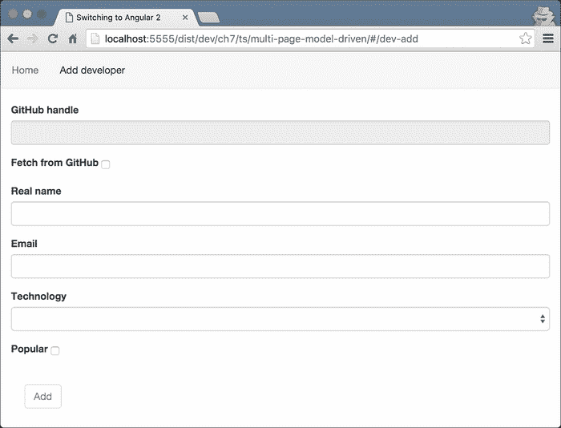
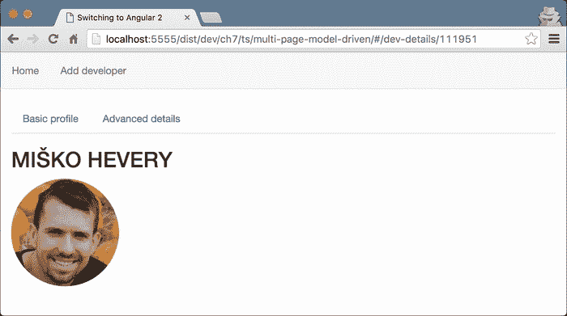
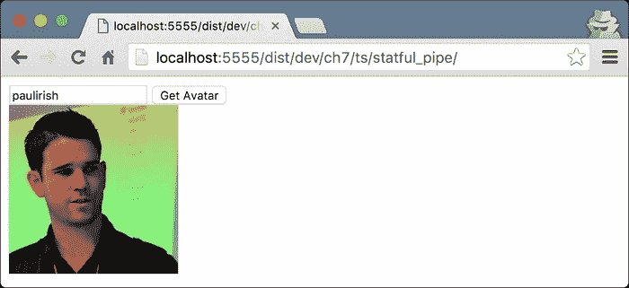

# 第七章：解释管道和与 RESTful 服务通信

在上一章中，我们介绍了框架的一些非常强大的功能。然而，我们可以更深入地了解 Angular 的表单模块和路由器的功能。在接下来的章节中，我们将解释如何：

+   开发模型驱动的表单。

+   定义参数化路由。

+   定义子路由。

+   使用`Http`模块与 RESTful API 进行通信。

+   使用自定义管道转换数据。

我们将在扩展“Coders repository”应用程序的功能过程中探索所有这些概念。在上一章的开头，我们提到我们将允许从 GitHub 导入开发者。但在我们实现这个功能之前，让我们扩展表单的功能。

# 在 Angular 2 中开发模型驱动的表单

这些将是完成“Coders repository”最后的步骤。您可以在`ch6/ts/step-1/`（或`ch6/ts/step-2`，具体取决于您之前的工作）的基础上构建，以便使用我们将要介绍的新概念扩展应用程序的功能。完整的示例位于`ch7/ts/multi-page-model-driven`。

这是我们在本节结束时要实现的结果：



在上面的截图中，有以下两种表单：

+   一个用于从 GitHub 导入现有用户的表单，其中包含：

+   GitHub 句柄的输入。

+   一个指出我们是否要从 GitHub 导入开发者或手动输入的复选框。

+   一个用于手动输入新用户的表单。

第二种形式看起来与我们在上一节中完成的方式完全一样。然而，这一次，它的定义看起来有点不同：

```ts
<form class="form col-md-4"
      [ngFormModel]="addDevForm" [hidden]="submitted">
  <!-- TODO -->
</form>
```

请注意，这一次，我们没有`submit`处理程序或`#f="ngForm"`属性。相反，我们使用`[ngFormModel]`属性来绑定到组件控制器内定义的属性。通过使用这个属性，我们可以绑定到一个叫做`ControlGroup`的东西。正如其名称所示，`ControlGroup`类包括一组控件以及与它们关联的验证规则集。

我们需要使用类似的声明来*导入开发者*表单。然而，这一次，我们将提供不同的`[ngFormModel]`属性值，因为我们将在组件控制器中定义一个不同的控件组。将以下片段放在我们之前介绍的表单上方：

```ts
<form class="form col-md-4"
   [ngFormModel]="importDevForm" [hidden]="submitted">
<!-- TODO -->
</form>
```

现在，让我们在组件的控制器中声明`importDevForm`和`addDevForm`属性：

```ts
import {ControlGroup} from 'angular2/common';
@Component(…)
export class AddDeveloper {
  importDevForm: ControlGroup;
  addDevForm: ControlGroup;
  …
  constructor(private developers: DeveloperCollection,
    fb: FormBuilder) {…}
  addDeveloper() {…}
}
```

最初，我们从`angular2`模块中导入了`ControlGroup`类，然后在控制器中声明了所需的属性。让我们还注意到`AddDeveloper`的构造函数有一个额外的参数叫做`fb`，类型为`FormBuilder`。

`FormBuilder`提供了一个可编程的 API，用于定义`ControlGroups`，在这里我们可以为组中的每个控件附加验证行为。让我们使用`FormBulder`实例来初始化`importDevForm`和`addDevForm`属性：

```ts
…
constructor(private developers: DeveloperCollection,
  fb: FormBuilder) {
  this.importDevForm = fb.group({
    githubHandle: ['', Validators.required],
    fetchFromGitHub: [false]
  });
  this.addDevForm = fb.group({
    realName: ['', Validators.required],
    email: ['', validateEmail],
    technology: ['', Validators.required],
    popular: [false]
  });
}
…
```

`FormBuilder`实例有一个名为`group`的方法，允许我们定义给定表单中各个控件的默认值和验证器等属性。

根据前面的片段，`importDevForm`有两个我们之前介绍的字段：`githubHandle`和`fetchFromGitHub`。我们声明`githubHandle`控件的值是必填的，并将`fetchFromGitHub`控件的默认值设置为`false`。

在第二个表单`addDevForm`中，我们声明了四个控件。对于`realName`控件的默认值，我们将其设置为空字符串，并使用`Validators.requred`来引入验证行为（这正是我们为`githubHandle`控件所做的）。作为电子邮件输入的验证器，我们将使用`validateEmail`函数，并将其初始值设置为空字符串。用于验证的`validateEmail`函数是我们在上一章中定义的：

```ts
function validateEmail(emailControl) {
  if (!emailControl.value ||
     /^[a-zA-Z0-9_.+-]+@[a-zA-Z0-9-]+\.[a-zA-Z0-9-.]+$/.test(emailControl.value)) {
    return null;
  } else {
    return { 'invalidEmail': true };
  }
}
```

我们在这里定义的最后两个控件是`technology`控件，其值是必填的，初始值为空字符串，以及`popular`控件，其初始值设置为`false`。

## 使用控件验证器的组合

我们看了一下如何将单个验证器应用于表单控件。然而，在一些应用程序中，领域可能需要更复杂的验证逻辑。例如，如果我们想要将必填和`validateEmail`验证器都应用于电子邮件控件，我们应该这样做：

```ts
this.addDevForm = fb.group({
  …
  email: ['', Validators.compose([
    Validators.required,
    validateEmail]
  )],
  …
});
```

`Validators`对象的`compose`方法接受一个验证器数组作为参数，并返回一个新的验证器。新的验证器的行为将是由作为参数传递的各个验证器中定义的逻辑组成，并且它们将按照它们在数组中被引入的顺序应用。

传递给`group`方法的对象文字的属性名称应与我们在模板中为输入设置的`ngControl`属性的值相匹配。

这是`importDevForm`的完整模板：

```ts
<form class="form col-md-4"
   [ngFormModel]="importDevForm" [hidden]="submitted" >
  <div class="form-group">
    <label class="control-label"
           for="githubHandleInput">GitHub handle</label>
    <div>
      <input id="githubHandleInput"
             class="form-control" type="text"
             [disabled]="!fetchFromGitHub" 
             ngControl="githubHandle">
      <control-errors control="githubHandle"
        [errors]="{
          'required': 'The GitHub handle is required'
        }"></control-errors>
    </div>
  </div>
  <div class="form-group">
    <label class="control-label"
           for="fetchFromGitHubCheckbox">
       Fetch from GitHub
    </label>
    <input class="checkbox-inline" id="fetchFromGitHubCheckbox"
           type="checkbox" ngControl="fetchFromGitHub"
           [(ngModel)]="fetchFromGitHub">
  </div>
</form>
```

在前面的模板中，您可以注意到一旦提交的标志具有值`true`，表单将对用户隐藏。在第一个输入元素旁边，我们将`ngControl`属性的值设置为`githubHandle`。

### 注意

请注意，给定输入元素的`ngControl`属性的值必须与我们在组件控制器中的`ControlGroup`定义中用于相应控件声明的名称相匹配。

关于`githubHandle`控件，我们还将`disabled`属性设置为等于表达式评估的结果：`!fetchFromGitHub`。这样，当`fetchFromGitHub`复选框未被选中时，`githubHandle`控件将被禁用。类似地，在前几节的示例中，我们使用了先前定义的`ControlErrors`组件。这次，我们设置了一个带有消息**GitHub 句柄是必需的**的单个错误。

`addDevForm`表单的标记看起来非常相似，因此我们不会在这里详细描述它。如果您对如何开发它的方法不是完全确定，可以查看`ch7/ts/multi-page-model-driven/add_developer.html`中的完整实现。

我们要查看的模板的最后部分是`Submit`按钮：

```ts
<button class="btn btn-default"
        (click)="addDeveloper()"
        [disabled]="(fetchFromGitHub && !importDevForm.valid) ||
                    (!fetchFromGitHub && !addDevForm.valid)">
  Add
</button>
```

单击按钮将调用组件控制器中定义的`addDeveloper`方法。在`[disabled]`属性的值设置为的表达式中，我们最初通过使用与复选框绑定的属性的值来检查选择了哪种表单，也就是说，我们验证用户是否想要添加新开发人员或从 GitHub 导入现有开发人员。如果选择了第一个选项（即，如果复选框未被选中），我们将验证添加新开发人员的`ControlGroup`是否有效。如果有效，则按钮将启用，否则将禁用。当用户选中复选框以从 GitHub 导入开发人员时，我们也会执行相同的操作。

# 探索 Angular 的 HTTP 模块

现在，在我们为导入现有开发人员和添加新开发人员开发表单之后，是时候在组件的控制器中实现其背后的逻辑了。

为此，我们需要与 GitHub API 进行通信。虽然我们可以直接从组件的控制器中进行此操作，但通过这种方式，我们可以将其与 GitHub 的 RESTful API 耦合在一起。为了进一步分离关注点，我们可以将与 GitHub 通信的逻辑提取到一个名为`GitHubGateway`的单独服务中。打开一个名为`github_gateway.ts`的文件，并输入以下内容：

```ts
import {Injectable} from 'angular2/core';
import {Http} from 'angular2/http';

@Injectable()
export class GitHubGateway {
  constructor(private http: Http) {}
  getUser(username: string) {
    return this.http
            .get(`https://api.github.com/users/${username}`);
  }
}
```

最初，我们从`angular2/http`模块导入了`Http`类。所有与 HTTP 相关的功能都是外部化的，并且在 Angular 的核心之外。由于`GitHubGateway`接受一个依赖项，需要通过框架的 DI 机制进行注入，因此我们将其装饰为`@Injectable`装饰器。

我们将要使用的 GitHub 的 API 中唯一的功能是用于获取用户的功能，因此我们将定义一个名为`getUser`的单个方法。作为参数，它接受开发者的 GitHub 句柄。

### 注意

请注意，如果您每天对 GitHub 的 API 发出超过 60 个请求，您可能会收到错误**GitHub API 速率限制已超出**。这是由于没有 GitHub API 令牌的请求的速率限制。有关更多信息，请访问[`github.com/blog/1509-personal-api-tokens`](https://github.com/blog/1509-personal-api-tokens)。

在`getUser`方法中，我们使用了在`constructor`函数中收到的`Http`服务的实例。`Http`服务的 API 尽可能接近 HTML5 fetch API。但是，有一些区别。其中最重要的一个是，在撰写本内容时，`Http`实例的所有方法都返回`Observables`而不是`Promises`。

`Http`服务实例具有以下 API：

+   `request(url: string | Request, options: RequestOptionsArgs)`: 对指定的 URL 进行请求。可以使用`RequestOptionsArgs`配置请求：

```ts
http.request('http://example.com/', {
  method: 'get',
  search: 'foo=bar',
  headers: new Headers({
    'X-Custom-Header': 'Hello'
	})
});
```

+   `get(url: string, options?: RequestOptionsArgs)`: 对指定的 URL 进行 get 请求。可以使用第二个参数配置请求头和其他选项。

+   `post(url: string, options?: RequestOptionsArgs)`: 对指定的 URL 进行 post 请求。可以使用第二个参数配置请求体、头和其他选项。

+   `put(url: string, options?: RequestOptionsArgs)`: 对指定的 URL 进行 put 请求。可以使用第二个参数配置请求头和其他选项。

+   `patch(url: string, options?: RequestOptionsArgs)`: 发送一个 patch 请求到指定的 URL。请求头和其他选项可以使用第二个参数进行配置。

+   `delete(url: string, options?: RequestOptionsArgs)`: 发送一个 delete 请求到指定的 URL。请求头和其他选项可以使用第二个参数进行配置。

+   `head(url: string, options?: RequestOptionsArgs)`: 发送一个 head 请求到指定的 URL。请求头和其他选项可以使用第二个参数进行配置。

## 使用 Angular 的 HTTP 模块

现在，让我们实现从 GitHub 导入现有用户的逻辑！打开文件 `ch6/ts/step-2/add_developer.ts` 并输入以下导入：

```ts
import {Response, HTTP_PROVIDERS} from 'angular2/http';
import {GitHubGateway} from './github_gateway';
```

将 `HTTP_PROVIDERS` 和 `GitHubGateway` 添加到 `AddDeveloper` 组件的提供者列表中：

```ts
@Component({
  …
  providers: [GitHubGateway, FORM_PROVIDERS, HTTP_PROVIDERS]
})
class AddDeveloper {…}
```

作为下一步，我们必须在类的构造函数中包含以下参数：

```ts
constructor(private githubAPI: GitHubGateway,
  private developers: DeveloperCollection,
  fb: FormBuilder) {
  //…
}
```

这样，`AddDeveloper` 类的实例将有一个名为 `githubAPI` 的私有属性。

唯一剩下的就是实现 `addDeveloper` 方法，并允许用户使用 `GitHubGateway` 实例导入现有的开发者。

用户按下 **添加** 按钮后，我们需要检查是否需要导入现有的 GitHub 用户或添加新的开发者。为此，我们可以使用 `fetchFromGitHub` 控件的值：

```ts
if (this.importDevForm.controls['fetchFromGitHub'].value) {
  // Import developer
} else {
  // Add new developer
}
```

如果它有一个真值，那么我们可以调用 `githubAPI` 属性的 `getUser` 方法，并将 `githubHandle` 控件的值作为参数传递：

```ts
this.githubAPI.getUser(model.githubHandle)
```

在 `getUser` 方法中，我们将调用 `Http` 服务的 `get` 方法，该方法返回一个可观察对象。为了获取可观察对象即将推送的结果，我们需要向其 `subscribe` 方法传递一个回调函数：

```ts
this.githubAPI.getUser(model.githubHandle)
  .map((r: Response) => r.json())
  .subscribe((res: any) => {
    // "res" contains the response of the GitHub's API 
  });
```

在上面的代码片段中，我们首先建立了 HTTP `get` 请求。之后，我们将得到一个可观察对象，通常会发出一系列的值（在这种情况下，只有一个值—请求的响应），并将它们映射到它们的主体的 JSON 表示。如果响应失败或其主体不是有效的 JSON 字符串，那么我们将得到一个错误。

### 注意

请注意，为了减小 RxJS 的体积，Angular 的核心团队只包含了它的核心部分。为了使用 `map` 和 `catch` 方法，您需要在 `add_developer.ts` 中添加以下导入：

```ts
**import 'rxjs/add/operator/map';**
**import 'rxjs/add/operator/catch';**

```

现在让我们实现订阅回调的主体：

```ts
let dev = new Developer();
dev.githubHandle = res.login;
dev.email = res.email;
dev.popular = res.followers >= 1000;
dev.realName = res.name;
dev.id = res.id;
dev.avatarUrl = res.avatar_url;
this.developers.addDeveloper(dev);
this.successMessage = `Developer ${dev.githubHandle} successfully imported from GitHub`;
```

在前面的例子中，我们设置了一个新的`Developer`实例的属性。在这里，我们建立了从 GitHub 的 API 返回的对象与我们应用程序中开发者表示之间的映射。我们还认为如果开发者拥有超过 1,000 个粉丝，那么他或她就是受欢迎的。

`addDeveloper`方法的整个实现可以在`ch7/ts/multi-page-model-driven/add_developer.ts`中找到。

### 注意

为了处理失败的请求，我们可以使用可观察实例的`catch`方法：

```ts
 **this.githubAPI.getUser(model.githubHandle)**
 **.catch((error, source, caught) => {**
 **console.log(error)**
 **return error;**
 **})**

```

# 定义参数化视图

作为下一步，让我们为每个开发者专门创建一个页面。在这个页面内，我们将能够详细查看他或她的个人资料。一旦用户在应用程序的主页上点击任何开发者的名称，他或她应该被重定向到一个包含所选开发者详细资料的页面。最终结果将如下所示：



为了做到这一点，我们需要将开发者的标识符传递给显示开发者详细资料的组件。打开`app.ts`并添加以下导入：

```ts
import {DeveloperDetails} from './developer_details';
```

我们还没有开发`DeveloperDetails`组件，所以如果运行应用程序，你会得到一个错误。我们将在下一段定义组件，但在此之前，让我们修改`App`组件的`@RouteConfig`定义：

```ts
@RouteConfig([
  //…
  new Route({
    component: DeveloperDetails,
    name: 'DeveloperDetails',
    path: '/dev-details/:id/...'
  }),
  //…
])
class App {}
```

我们添加了一个单一路由，与`DeveloperDetails`组件相关联，并且作为别名，我们使用了字符串`"DeveloperDetails"`。

`component`属性的值是对组件构造函数的引用，该构造函数应该处理给定的路由。一旦应用程序的源代码在生产中被压缩，组件名称可能会与我们输入的名称不同。这将在使用`routerLink`指令在模板中引用路由时创建问题。为了防止这种情况发生，核心团队引入了`name`属性，在这种情况下，它等于控制器的名称。

### 注意

尽管到目前为止的所有示例中，我们将路由的别名设置为与组件控制器的名称相同，但这并不是必需的。这个约定是为了简单起见，因为引入两个名称可能会令人困惑：一个用于指向路由，另一个用于与给定路由相关联的控制器。

在`path`属性中，我们声明该路由有一个名为`id`的单个参数，并用`"..."`提示框架，这个路由将在其中有嵌套路由。

现在，让我们将当前开发人员的`id`作为参数传递给`routerLink`指令。在你的工作目录中打开`home.html`，并用以下内容替换我们显示开发人员的`realName`属性的表格单元格：

```ts
<td>
  <a [routerLink]="['/DeveloperDetails',
      { 'id': dev.id }, 'DeveloperBasicInfo']">
    {{dev.realName}}
  </a>
</td>
```

`routerLink`指令的值是一个包含以下三个元素的数组：

+   `'/DeveloperDetails'`：显示根路由的字符串

+   `{ 'id': dev.id }`：声明路由参数的对象文字

+   `'DeveloperBasicInfo'`：显示在组件别名为`DeveloperDetails`的嵌套路由中应该呈现的组件的路由名称

# 定义嵌套路由

现在让我们跳到`DeveloperDetails`的定义。在你的工作目录中，创建一个名为`developer_details.ts`的文件，并输入以下内容：

```ts
import {Component} from 'angular2/core';
import {
  ROUTER_DIRECTIVES,
  RouteConfig,
  RouteParams
} from 'angular2/router';
import {Developer} from './developer';
import {DeveloperCollection} from './developer_collection';

@Component({
  selector: 'dev-details',
  template: `…`,
})
@RouteConfig(…)
export class DeveloperDetails {
  public dev: Developer;
  constructor(routeParams: RouteParams,
    developers: DeveloperCollection) {
    this.dev = developers.getUserById(
      parseInt(routeParams.params['id'])
    );
  }
}
```

在上面的代码片段中，我们定义了一个带有控制器的组件`DeveloperDetails`。您可以注意到，在控制器的构造函数中，通过 Angular 2 的 DI 机制，我们注入了与`RouteParams`令牌相关联的参数。注入的参数为我们提供了访问当前路由可见参数的权限。我们可以使用注入对象的`params`属性访问它们，并使用参数的名称作为键来访问目标参数。

由于我们从`routeParams.params['id']`得到的参数是一个字符串，我们需要将其解析为数字，以便获取与给定路由相关联的开发人员。现在让我们定义与`DeveloperDetails`相关的路由：

```ts
@Component(…)
@RouteConfig([{
    component: DeveloperBasicInfo,
    name: 'DeveloperBasicInfo',
    path: '/'
  },
  {
    component: DeveloperAdvancedInfo,
    name: 'DeveloperAdvancedInfo',
    path: '/dev-details-advanced'
  }])
export class DeveloperDetails {…}
```

在上面的代码片段中，对我们来说没有什么新的。路由定义遵循我们已经熟悉的完全相同的规则。

现在，让我们在组件的模板中添加与各个嵌套路由相关的链接：

```ts
@Component({
  selector: 'dev-details',
  directives: [ROUTER_DIRECTIVES],
  template: `
    <section class="col-md-4">
      <ul class="nav nav-tabs">
        <li>
          <a [routerLink]="['./DeveloperBasicInfo']">
            Basic profile
          </a>
        </li>
        <li>
          <a [routerLink]="['./DeveloperAdvancedInfo']">
            Advanced details
          </a>
        </li>
      </ul>
      <router-outlet/>
    </section>
  `,
})
@RouteConfig(…)
export class DeveloperDetails {…}
```

在模板中，我们声明了两个相对于当前路径的链接。第一个指向`DeveloperBaiscInfo`，这是在`DeveloperDetails`组件的`@RouteConfig`中定义的第一个路由的名称，相应地，第二个指向`DeveloperAdvancedInfo`。

由于这两个组件的实现非常相似，让我们只看一下`DeveloperBasicInfo`。作为练习，您可以开发第二个，或者查看`ch7/ts/multi-page-model-driven/developer_advanced_info.ts`中的实现：

```ts
import {
  Component,
  Inject,
  forwardRef,
  Host
} from 'angular2/core';
import {DeveloperDetails} from './developer_details';
import {Developer} from './developer';

@Component({
  selector: 'dev-details-basic',
  styles: […],
  template: `
    <h2>{{dev.realName}}</h2>
    
    
  `
})
export class DeveloperBasicInfo {
  dev: Developer;
  constructor(@Inject(forwardRef(() => DeveloperDetails))
    @Host() parent: DeveloperDetails) {
    this.dev = parent.dev;
  }
}
```

在上述代码片段中，我们结合了`@Inject`参数装饰器和`@Host`来注入父组件。在`@Inject`内部，我们使用`forwardRef`，因为在`developer_basic_info`和`developer_details`之间存在循环依赖（在`developer_basic_info`中，我们导入`developer_details`，而在`developer_details`中，我们导入`developer_basic_info`）。

我们需要一个对父组件实例的引用，以便获取与所选路由对应的当前开发者的实例。

# 使用管道转换数据

现在是 Angular 2 为我们提供的最后一个构建块的时间，这是我们尚未详细介绍的管道。

就像 AngularJS 1.x 中的过滤器一样，管道旨在封装所有数据转换逻辑。让我们来看看我们刚刚开发的应用程序的主页模板：

```ts
…
<td [ngSwitch]="dev.popular">
  <span *ngSwitch-when="true">Yes</span>
  <span *ngSwitch-when="false">Not yet</span>
</td>
…
```

在上述代码片段中，根据`popular`属性的值，我们使用`NgSwitch`和`NgSwitchThen`指令显示了不同的数据。虽然这样可以工作，但是有些冗余。

## 开发无状态管道

让我们开发一个管道，转换`popular`属性的值并在`NgSwitch`和`NgSwitchThen`的位置使用它。该管道将接受三个参数：应该被转换的值，当值为真时应该显示的字符串，以及在值为假时应该显示的另一个字符串。

通过使用 Angular 2 自定义管道，我们将能够简化模板为：

```ts
<td>{{dev.popular | boolean: 'Yes': 'No'}}</td>
```

我们甚至可以使用表情符号：

```
<td>{{dev.popular | boolean: '👍': '👎'}}</td>
```ts

我们将管道应用到值上的方式与在 AngularJS 1.x 中的方式相同。我们传递给管道的参数应该用冒号（`:`）符号分隔。

为了开发一个 Angular 2 管道，我们需要以下导入：

```
import {Pipe, PipeTransform} from 'angular2/core';
```ts

`Pipe`装饰器可用于向实现数据转换逻辑的类添加元数据。`PipeTransform`是一个具有名为 transform 的单个方法的接口：

```
import {Pipe, PipeTransform} from 'angular2/core';

@Pipe({
  name: 'boolean'
})
export class BooleanPipe implements PipeTransform {
  constructor() {}
  transform(flag: boolean, args: string[]): string {
    return flag ? args[0] : args[1];
  }
}
```ts

上述代码片段是`BooleanPipe`的整个实现。管道的名称决定了它在模板中的使用方式。

在能够使用管道之前，我们需要做的最后一件事是将`BooleanPipe`类添加到`Home`组件使用的管道列表中（`BooleanPipe`已经通过`@Pipe`装饰器附加了元数据，所以它的名称已经附加到它上面）：

```
@Component({
  …
  pipes: [BooleanPipe],
})
export class Home {
  constructor(private developers: DeveloperCollection) {}
  getDevelopers() {…}
}
```ts

## 使用 Angular 内置的管道

Angular 2 提供了以下一组内置管道：

+   `CurrencyPipe`：此管道用于格式化货币数据。作为参数，它接受货币类型的缩写（即`"EUR"`，`"USD"`等）。可以按以下方式使用：

```
{{ currencyValue | currency: 'USD' }} <!-- USD42 -->
```ts

+   `DatePipe`：此管道用于日期转换。可以按以下方式使用：

```
{{ dateValue | date: 'shortTime'  }} <!-- 12:00 AM -->
```ts

+   `DecimalPipe`：此管道用于转换十进制数。它接受的参数形式为`"{minIntegerDigits}.{minFractionDigits}-{maxFractionDigits}"`。可以按以下方式使用：

```
{{ 42.1618 | number: '3.1-2' }} <!-- 042.16 -->
```ts

+   `JsonPipe`：这将 JavaScript 对象转换为 JSON 字符串。可以按以下方式使用：

```
{{ { foo: 42 } | json }} <!-- { "foo": 42 } -->
```ts

+   `LowerCasePipe`：将字符串转换为小写。可以按以下方式使用：

```
{{ FOO | lowercase }} <!-- foo -->
```ts

+   `UpperCasePipe`：将字符串转换为大写。可以按以下方式使用：

```
{{ 'foo' | uppercase }} <!-- FOO -->
```ts

+   `PercentPipe`：这将数字转换为百分比。可以按以下方式使用：

```
{{ 42 | percent: '2.1-2' }}  <!-- 4,200.0% -->
```ts

+   `SlicePipe`：返回数组的一个切片。该管道接受切片的起始和结束索引。可以按以下方式使用：

```
{{ [1, 2, 3] | slice: 1: 2 }} <!-- 2 -->
```ts

+   `AsyncPipe`：这是一个`有状态`管道，接受一个 observable 或一个 promise。我们将在本章末尾看一下它。

## 开发有状态的管道

之前提到的所有管道之间有一个共同点——每次将它们应用于相同的值并传递相同的参数集时，它们都会返回完全相同的结果。具有引用透明属性的这种管道称为纯管道。

`@Pipe`装饰器接受以下类型的对象文字：`{ name: string, pure?: boolean }`，其中`pure`属性的默认值为`true`。这意味着当我们使用`@Pipe`装饰器装饰给定的类时，我们可以声明我们希望管道实现的逻辑是有状态的还是无状态的。纯属性很重要，因为如果管道是无状态的（即，对于相同的值和相同的参数集合应用时返回相同的结果），则可以优化变更检测。

现在让我们构建一个有状态的管道！我们的管道将向 JSON API 发出 HTTP `get`请求。为此，我们将使用`angular2/http`模块。

### 注意

请注意，在管道中具有业务逻辑并不被认为是最佳实践。这种类型的逻辑应该被提取到一个服务中。这里的示例仅用于学习目的。

在这种情况下，管道需要根据请求的状态（即是否挂起或已完成）来保持不同的状态。我们将以以下方式使用管道：

```
{{ "http://example.com/user.json" | fetchJson | json }}
```ts

这样，我们就可以在 URL 上应用`fetchJson`管道，一旦我们从远程服务获得响应并且请求的承诺已经解决，我们就可以在响应中得到的对象上应用`json`管道。该示例还展示了如何在 Angular 2 中链式应用管道。

同样，在前面的示例中，为了开发一个无状态的管道，我们需要导入`Pipe`和`PipeTransform`。然而，这次，由于 HTTP 请求功能，我们还需要从`'angular2/http'`模块导入`Http`和`Response`类：

```
import {Pipe, PipeTransform} from 'angular2/core';
import {Http, Response} from 'angular2/http';
import 'rxjs/add/operator/toPromise';
```ts

每当将`fetchJson`管道应用于与上一次调用中获得的参数不同的参数时，我们需要发起新的 HTTP `get`请求。这意味着作为管道的状态，我们至少需要保留远程服务响应的值和最后的 URL：

```
@Pipe({
  name: 'fetchJson',
  pure: false
})
export class FetchJsonPipe implements PipeTransform {
  private data: any;
  private prevUrl: string;
  constructor(private http: Http) {}
  transform(url: string): any {…}
}
```ts

剩下的逻辑只有`transform`方法：

```
…
transform(url: string): any {
  if (this.prevUrl !== url) {
    this.http.get(url).toPromise(Promise)
      .then((data: Response) => data.json())
      .then(result => this.data = result);
    this.prevUrl = url;
  }
  return this.data || {};
}
…
```ts

在其中，我们最初将作为参数传递的 URL 与我们当前保留引用的 URL 进行比较。如果它们不同，我们将使用传递给`constructor`函数的`Http`类的本地实例发起新的 HTTP `get`请求。一旦请求完成，我们将将响应解析为 JSON，并将`data`属性设置为结果。

现在，假设管道已经开始了`Http get`请求，在请求完成之前，变更检测机制再次调用了管道。在这种情况下，我们将比较`prevUrl`属性和`url`参数。如果它们相同，我们将不会执行新的`http`请求，并立即返回`data`属性的值。如果`prevUrl`的值与`url`不同，我们将开始一个新的请求。

## 使用有状态的管道

现在让我们使用我们开发的管道！我们将要实现的应用程序为用户提供了一个文本输入和一个按钮。一旦用户在文本输入中输入一个值并按下按钮，文本输入框下方将显示与 GitHub 用户对应的头像，如下面的屏幕截图所示：



现在，让我们开发一个示例组件，允许我们输入 GitHub 用户的句柄：

```
// ch7/ts/statful_pipe/app.ts

@Component({
  selector: 'app',
  providers: [HTTP_PROVIDERS],
  pipes: [FetchJsonPipe, ObjectGetPipe],
  template: `
    <input type="text" #input>
    <button (click)=" setUsername(input.value)">Get Avatar</button>
`
})
class App {
  username: string;
  setUsername(user: string) {
    this.username = user;
  }
}
```ts

在前面的例子中，我们添加了`FetchJsonPipe`用于`App`组件。唯一剩下的就是显示用户的 GitHub 头像。我们可以通过修改前面组件的模板来轻松实现这一点，使用以下`img`声明：

```

```ts

最初，我们将 GitHub 句柄附加到用于从 API 获取用户的基本 URL 上。后来，我们对其应用了`fetchJson`过滤器，并从返回的结果中得到了`avatar_url`属性。

### 注意

虽然前面的例子可以工作，但在管道中放入业务逻辑是不自然的。最好将与 GitHub API 通信的逻辑实现为一个服务，或者至少在组件中调用`Http`类的实例的`get`方法。

## 使用 Angular 的 AsyncPipe

Angular 的`AsyncPipe`转换方法接受 observable 或 promise 作为参数。一旦参数推送一个值（即 promise 已解析或 observable 的`subscribe`回调被调用并传递了一个值），`AsyncPipe`将返回它作为结果。让我们看看以下例子：

```
// ch7/ts/async-pipe/app.ts
@Component({
  selector: 'greeting',
  template: 'Hello {{ greetingPromise | async }}'
})
class Greeting {
  greetingPromise = new Promise<string>(resolve => this.resolve = resolve);
  resolve: Function;
  constructor() {
    setTimeout(_ => {
      this.resolve('Foobar!');
    }, 3000);
  }
}
```ts

在这里，我们定义了一个 Angular 2 组件，它有两个属性：`greetingPromise`的类型为`Promise<string>`，`resolve`的类型为`Function`。我们用一个新的`Promise<string>`实例初始化了`greetingPromise`属性，并将`resolve`属性的值设置为`promise`的`resolve`回调函数。

在类的构造函数中，我们启动了一个持续 3,000 毫秒的超时，在其回调函数中，我们解析了 promise。一旦 promise 被解析，表达式`{{ greetingPromise | async }}`的值将被评估为字符串`Foobar!`。用户在屏幕上看到的最终结果是文本**Hello Foobar!**。

当我们将`async`管道与`Http`请求或与推送值序列的 observable 结合使用时，`async`管道非常强大。

### 使用 observables 和 AsyncPipe

我们已经熟悉了前几章中的 observables 的概念。我们可以说，observable 对象允许我们订阅一系列值的发射，例如：

```
let observer = new Observable<number>(observer => {
  setInterval(() => {
    observer.next(new Date().getTime());
  }, 1000);
});
observer.subscribe(date => console.log(date));
```ts

一旦我们订阅了可观察对象，它将开始每秒发出值，这些值将被打印在控制台中。让我们将这段代码与组件的定义结合起来，实现一个简单的计时器：

```
// ch7/ts/async-pipe/app.ts
@Component({
  selector: 'timer'
})
class Timer {
  username: string;
  timer: Observable<number>;
  constructor() {
    let counter = 0;
    this.timer = new Observable<number>(observer => {
      setInterval(() => {
        observer.next(new Date().getTime());
      }, 1000);
    });
  }
}
```ts

为了能够使用计时器组件，唯一剩下的事情就是添加它的模板。我们可以通过使用`async`管道直接在我们的模板中订阅可观察对象：

```
{{ timer | async | date: "medium" }}
```

这样，每秒我们将得到可观察对象发出的新值，并且`date`管道将把它转换成可读形式。

# 总结

在本章中，我们深入研究了 Angular 2 表单，通过开发一个模型驱动的表单，并将其与`http`模块结合起来，以便能够将开发人员添加到我们的存储库中。我们看了一些新的基于组件的路由的高级特性，并了解了如何使用和开发我们定制的有状态和无状态管道。

下一章将致力于我们如何使我们的 Angular 2 应用程序对 SEO 友好，通过利用模块 universal 提供的服务器端渲染。我们还将看看 angular-cli 和其他工具，这些工具使我们作为开发人员的体验更好。
