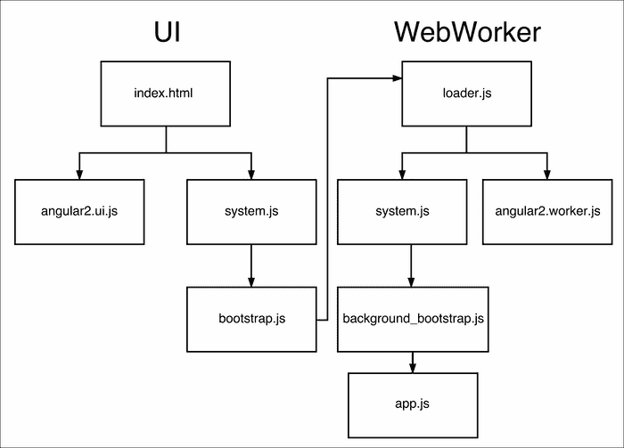
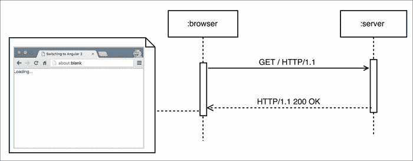
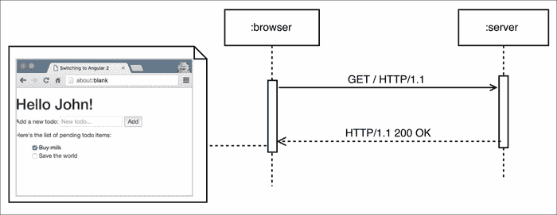

# 第八章：开发体验和服务器端渲染

我们已经熟悉了 Angular 2 的所有核心概念。我们知道如何开发基于组件的用户界面，利用框架提供的所有构建模块——指令、组件、依赖注入、管道、表单和全新的基于组件的路由器。

接下来，我们将看看从头开始构建**单页应用程序**（**SPA**）时应该从哪里开始。本章描述了如何执行以下操作：

+   对于性能敏感的应用程序，请使用 Web Workers。

+   使用服务器端渲染构建友好的 SEO 应用程序。

+   尽快启动项目。

+   增强我们作为开发者的体验。

所以，让我们开始吧！

# 在 Web Workers 中运行应用程序

在谈论前端 Web 开发的性能时，我们可以指的是网络、计算或渲染性能。在本节中，我们将集中讨论渲染和计算性能。

首先，让我们将 Web 应用程序和视频，以及浏览器和视频播放器进行对比。在浏览器中运行的 Web 应用程序和视频播放器中播放的视频文件之间最大的区别是，Web 页面需要动态生成，而视频已经被录制、编码和分发。然而，在这两种情况下，应用程序的用户都会看到一系列帧；核心区别在于这些帧是如何生成的。在视频处理领域，当我们播放视频时，视频已经被录制；视频解码器的责任是根据压缩算法提取单个帧。与此相反，在 Web 上，JavaScript 和 CSS 负责生成由浏览器渲染引擎渲染的帧。

在浏览器的上下文中，我们可以将每一帧视为在给定时刻的网页快照。不同的帧快速地一个接一个地渲染，因此理论上，应用程序的最终用户应该看到它们平滑地结合在一起，就像在视频播放器中播放视频一样。

在 Web 上，我们试图达到 60 帧每秒（每秒帧数），这意味着每帧大约有 16 毫秒在屏幕上计算和渲染。这段时间包括浏览器进行布局和页面渲染所需的时间，以及我们的 JavaScript 需要执行的时间。

最后，我们只有不到 16 毫秒的时间（因为浏览器渲染功能需要时间，取决于它需要执行的计算）来完成 JavaScript 的执行。如果超过这个持续时间，帧速率将下降一半。由于 JavaScript 是单线程语言，所有计算都需要在主 UI 线程中进行，这在计算密集型应用程序（如图像或视频处理、大型 JSON 字符串的编组和解组等）的情况下，可能会导致用户体验非常差，因为帧会被丢弃。

HTML5 引入了一个名为**Web Workers**的 API，它允许在浏览器环境中执行客户端代码到多个线程中。简单起见，标准不允许个别线程之间共享内存，而是允许通过消息传递进行通信。Web Workers 和主 UI 线程之间交换的消息必须是字符串，这经常需要对 JSON 字符串进行序列化和反序列化。

个别工作线程之间以及工作线程和主 UI 线程之间缺乏共享内存带来了一些限制，比如：

+   工作线程无法访问 DOM。

+   全局变量不能在个别计算单元（即工作线程和主 UI 线程以及反之）之间共享。

## Web Workers 和 Angular 2

由于 Angular 2 的平台不可知设计，核心团队决定利用这个 API，在 2015 年夏天，谷歌将 Web Workers 支持嵌入到了框架中。这个特性使得大多数 Angular 2 应用程序可以在单独的线程上运行，使得主 UI 线程只负责渲染。这有助于我们更容易地实现 60 帧每秒的目标，而不是在单个线程中运行整个应用程序。

Web Workers 支持默认情况下是未启用的。启用它时，我们需要记住一些事情——在一个准备好使用 Web Workers 的应用程序中，组件不会在主 UI 线程中运行，这不允许我们直接操作 DOM。在这种情况下，我们需要使用绑定，比如输入、输出，以及`NgModel`的组合。

## 在 Web Worker 中引导运行应用程序。

让我们将我们在第四章中开发的待办事项应用程序，在 Web Workers 中运行。您可以在 `ch8/ts/todo_webworkers/` 找到我们将要探索的示例。

首先，让我们讨论需要进行的更改。看一下 `ch4/ts/inputs-outputs/app.ts`。注意，在 `app.ts` 中，我们包含了来自 `angular2/platform/browser` 模块的 `bootstrap` 函数。这是我们需要修改的第一件事！在后台进程中运行的应用程序的 `bootstrap` 过程是不同的。

在重构我们的代码之前，让我们看一下一张图表，说明了在 Web Workers 中运行的典型 Angular 2 应用程序的 `bootstrap` 过程：



*Jason Teplitz* 在 *AngularConnect 2015* 上介绍了在 Angular 2 中实现 Web Worker 支持的这张图表。

该图分为两部分：**UI** 和 **Web Worker**。UI 显示了在主 UI 线程初始化期间执行的操作；图表的 **Web Worker** 部分显示了应用程序在后台线程中如何启动。现在，让我们逐步解释 `bootstrap` 过程。

首先，用户打开 `index.html` 页面，触发以下两个文件的下载：

+   用于在 Web Worker 中运行的 Angular 2 的 UI 捆绑包。

+   `system.js` 捆绑包（我们在第三章中讨论了全局对象 System，*TypeScript Crash Course*。我们可以将 `system.js` 捆绑包视为模块加载器的 polyfill）。

使用`system.js`，我们下载了用于初始化在主 UI 线程中运行的应用程序部分的脚本。此脚本在 Web Worker 中启动了`loader.js`。这是在后台线程中运行的第一个脚本。一旦工作线程启动，`loader.js`将下载`system.js`和 Angular 2 的捆绑包，这些捆绑包旨在在后台线程中运行。第一个请求通常会命中缓存，因为主线程已经请求了`system.js`。使用模块加载器，我们下载了负责引导后台应用程序`background_bootstrap.js`的脚本，最终将在后台启动我们应用程序的功能。

从现在开始，我们构建的整个应用程序将在 Web Worker 中运行，并将与主 UI 线程交换消息，以响应用户事件和渲染指令。

现在我们已经了解了在使用工作线程时初始化期间事件的基本流程，让我们重构我们的待办事项应用程序以利用它们。

## 将应用程序迁移到 Web Worker

在`index.html`中，我们需要添加以下脚本：

```ts
  <!-- ch8/ts/todo_webworkers/index.html -->
  …
  <script src="/node_modules/systemjs/dist/system.src.js">
  </script>
  <script src="/node_modules/angular2/bundles/angular2-polyfills.js"></script>
  <script src="/node_modules/angular2/bundles/web_worker/ui.dev.js">
  </script>
  <script>
  System.config({
    baseURL: '/dist/dev/ch8/ts/todo_webworkers/'
  });
  System.import('./bootstrap.js')
    .catch(function () {
      console.log('Report this error to https://github.com/mgechev/switching-to-angular2/issues', e);
    });
  </script>
  …
```

在上述片段中，我们包括了对`system.js`、`angular2-polyfills`（包括`zone.js`）和 Angular 库使用的其他文件的引用，以及需要在主 UI 线程中运行的捆绑包`ui.dev.js`。

在此之后，我们将通过设置模块加载器的`baseURL`属性来配置`system.js`。接下来，我们将显式导入包含用于在 Web Worker 中启动`loader.js`脚本的逻辑的`bootstrap.js`文件。

让我们探索`bootstrap.js`，这是经过转译的`bootstrap.js`的原始文件：

```ts
// ch8/ts/todo_webworkers/bootstrap.ts
import {platform, Provider} from 'angular2/core';
import {
  WORKER_RENDER_APPLICATION,
  WORKER_RENDER_PLATFORM,
  WORKER_SCRIPT
} from 'angular2/platform/worker_render';

platform([WORKER_RENDER_PLATFORM])
  .application([WORKER_RENDER_APPLICATION,
     new Provider(WORKER_SCRIPT, {useValue: 'loader.js'})]);
```

在这个文件中，我们将平台设置为`WORKER_RENDER_PLATFORM`类型，将应用程序类型设置为`WORKER_RENDER_APPLICATION`。我们配置了用于注入`WORKER_SCRIPT`令牌的提供程序，以使用值`'loader.js'`。正如我们所说，`loader.js`将在后台线程中运行。该脚本位于应用程序的根目录中。

现在，我们可以移动到*在 Web Worker 中运行应用程序的引导*部分中给出的图表的右侧。`loader.js`中的逻辑非常简单：

```ts
// ch8/ts/todo_webworkers/loader.ts
importScripts("/node_modules/systemjs/dist/system.src.js",
      "/node_modules/angular2/bundles/web_worker/worker.dev.js",
   "/node_modules/angular2/bundles/angular2-polyfills.js");

System.config({
  baseURL: '/dist/dev/ch8/ts/todo_webworkers/',
});

System.import('./background_app.js')
.then(() => console.log('The application has started successfully'),
  error => console.error('Error loading background', error));
```

作为第一步，我们导入`system.js`，Angular 2 的 Web Workers 捆绑包（`worker.dev.js`）以及所有必需的`polyfills`。然后，我们配置模块加载器的后台实例并导入`background_app`文件，该文件包含我们应用的逻辑以及 Web Workers 的引导调用。

现在，让我们探讨如何在 Web Worker 中引导应用程序：

```ts
import {platform} from 'angular2/core';
import {
  WORKER_APP_PLATFORM,
  WORKER_APP_APPLICATION
} from 'angular2/platform/worker_app';

// Logic for the application…

platform([WORKER_APP_PLATFORM])
  .application([WORKER_APP_APPLICATION])
  .bootstrap(TodoApp);
```

就像在主 UI 线程中引导一样，我们指定平台的类型和我们要引导的应用程序的类型。在最后一步中，我们设置根组件，就像在标准引导过程中所做的那样。`TodoApp`组件在`background_app`文件的导入和初始化调用之间定义。

## 使应用程序与 Web Workers 兼容

正如我们所说，运行在 Web Worker 上下文中的代码无法访问 DOM。让我们看看我们需要做哪些更改来解决这个限制。

这是`InputBox`组件的原始实现：

```ts
// ch4/ts/inputs-outputs/app.ts
@Component({
  selector: 'input-box',
  template: `
    <input #todoInput [placeholder]="inputPlaceholder">
    <button (click)="emitText(todoInput.value);
      todoInput.value = '';">
      {{buttonLabel}}
    </button>
  `
})
class InputBox {
  @Input() inputPlaceholder: string;
  @Input() buttonLabel: string;
  @Output() inputText = new EventEmitter<string>();
  emitText(text: string) {
    this.inputText.emit(text);
  }
}
```

请注意，在模板内部，我们将输入元素命名为`todoInput`并在表达式集中使用它的引用作为单击事件的处理程序。由于我们直接在模板内部访问 DOM 元素，这段代码将无法在 Web Worker 中运行。为了解决这个问题，我们需要重构代码片段，使其使用 Angular 2 绑定而不是直接触摸任何元素。我们可以在单向绑定有意义时使用输入，或者使用`NgModel`来实现双向数据绑定，这需要更多的计算资源。

让我们使用`NgModel`：

```ts
// ch8/ts/todo_webworkers/background_app.ts
import {NgModel} from 'angular2/common';
@Component({
  selector: 'input-box',
  template: `
    <input [placeholder]="inputPlaceholder" [(ngModel)]="input">
    <button (click)="emitText()">
      {{buttonLabel}}
    </button>
  `
})
class InputBox {
  @Input() inputPlaceholder: string;
  @Input() buttonLabel: string;
  @Output() inputText = new EventEmitter<string>();
  input: string;
  emitText() {
    this.inputText.emit(this.input);
    this.input = '';
  }
}
```

在这个版本的`InputBox`组件中，我们将在输入元素和`InputBox`组件的输入属性之间创建双向数据绑定。一旦用户点击按钮，将调用`emitText`方法，这将触发由`inputText EventEmitter`发出的新事件。为了重置输入元素的值，我们利用了我们声明的双向数据绑定，并将输入属性的值设置为空字符串。

### 注意

将组件模板中的整个逻辑移动到它们的控制器中带来了许多好处，比如改进了可测试性、可维护性、代码重用和清晰度。

前面的代码与 Web Workers 环境兼容，因为`NgModel`指令基于一个不直接操作 DOM 的抽象，在幕后与主 UI 线程异步交换消息。

总之，我们可以说，在 Web Workers 的上下文中运行应用程序时，我们需要牢记以下两点：

+   我们需要使用不同的引导过程。

+   我们不应直接访问 DOM。

违反第二点的典型情况如下：

+   通过选择元素并直接使用浏览器的原生 API 或第三方库来操作页面的 DOM。

+   访问使用`ElementRef`注入的原生元素。

+   在模板中创建对元素的引用并将其作为参数传递给方法。

+   直接操作模板中引用的元素。

在所有这些情况下，我们需要使用 Angular 提供的 API。如果我们根据这种做法构建我们的应用程序，我们不仅将从能够在 Web Workers 中运行它们中受益，而且在我们希望在不同平台上使用它们时，还将增加代码重用。

记住这一点将使我们能够利用服务器端渲染。

# 单页应用程序的初始加载

在本节中，我们将探讨服务器端渲染是什么，为什么我们需要在我们的应用程序中使用它，以及我们如何在 Angular 2 中使用它。

对于我们的目的，我们将解释用户打开在 Angular 2 中实现的 SPA 时的典型事件流程。首先，我们将跟踪禁用服务器端渲染时的事件，然后，我们将看到如何通过启用它来从这个功能中受益。我们的示例将在 HTTP 1.1 的上下文中进行说明。



这张图片展示了浏览器的第一个请求以及加载典型 SPA 时相应的服务器响应。客户端最初将看到的结果是 HTML 页面的初始内容，没有任何渲染的组件。

假设我们部署了我们在第四章构建的待办事项应用程序到一个具有`https://example.com`域关联的 Web 服务器上。

一旦用户导航到`https://example.com/`，浏览器将打开一个新的 HTTP GET 请求，获取根资源（/）。当服务器收到请求时，它将用一个 HTML 文件作为响应，而在我们的情况下，它将看起来像这样：

```ts
<!DOCTYPE html>
<html lang="en">
<head>
  <title>Switching to Angular 2</title>
  <link rel="stylesheet" href="bootstrap.min.css">
</head>
<body>
  <app>Loading...</app>
  <script src="es6-shim.min.js"></script>
  <script src="Reflect.js"></script>
  <script src="system.src.js"></script>
  <script src="angular2-polyfills.js"></script>
  <script src="Rx.min.js"></script>
  <script src="angular2.js"></script>
  <script src="router.js"></script>
  <script src="http.min.js"></script>
  <script>…</script>
</body>
</html>
```

浏览器将接收此内容作为响应的主体。当标记呈现到屏幕上时，用户将只看到标签：**加载中...**。

接下来，浏览器将查找 HTML 文件中外部资源的所有引用，比如样式和脚本，并开始下载它们。在我们的情况下，其中一些是 bootstrap.css，es6-shim.min.js，Reflect.js，system.src.js 和 angular2-polyfills.js。

一旦所有引用的资源都可用，用户将看不到任何显著的视觉进展（除非已经将下载的 CSS 文件中的样式应用到页面上）。这种情况直到 JavaScript 虚拟机处理了与应用程序实现相关的所有引用脚本之后才会改变。在这一点上，Angular 将根据当前 URL 和引导程序的配置知道需要渲染哪个组件。

如果与页面相关联的组件在我们的主应用程序包之外的单独文件中定义，那么框架将需要下载它以及其整个依赖图。如果组件的模板和样式是外部化的，Angular 还需要下载它们，然后才能渲染请求的页面。

在此之后，框架将能够编译与目标组件相关联的模板并渲染页面。

在先前的情景中，存在以下两个主要问题：

+   搜索引擎不擅长索引 JavaScript 生成的动态内容。这意味着我们的 SPA 的 SEO（搜索引擎优化）将受到影响。

+   在大型应用程序和/或网络连接差的情况下，用户体验将很差。

在过去，我们通过不同的变通方法解决了使用 AngularJS 1.x 构建的应用程序中的 SEO 问题，比如使用无头浏览器来渲染请求的页面，将其缓存到磁盘上，然后提供给搜索引擎。然而，有一个更加优雅的解决方案。

## 使用服务器端渲染的 SPA 的初始加载

几年前，诸如`Rendr`、`Derby`、`Meteor`等库引入了同构 JavaScript 应用程序的概念，后来被重命名为通用应用程序。实质上，通用应用程序可以在客户端和服务器上运行。只有在 SPA 与浏览器 API 之间耦合较低的情况下，才能实现这种可移植性。这种范式的最大好处是应用程序可以在服务器上重新渲染，然后发送到客户端。

通用应用程序不是特定于框架的；我们可以在任何可以在浏览器环境之外运行的框架中利用它们。从概念上讲，服务器端渲染的实践在各个平台和库中都非常相似；只是其实现细节可能有所不同。例如，Angular 2 Universal 模块实现了服务器端渲染，支持 node.js 以及 ASP.NET，在我撰写本文时，后者仍在进行中。



前面的图片显示了服务器对初始浏览器`GET`请求的响应。这一次，与加载 SPA 的典型情景相比，浏览器将获得 HTML 页面的渲染内容。

让我们追踪具有启用服务器端渲染功能的相同应用程序中事件的流程。在这种情况下，一旦服务器接收到浏览器的 HTTP `GET`请求，它将在 node.js 环境中在服务器上运行 SPA。所有的 DOM 调用都将被重定向到服务器端的 DOM 实现，并在所使用的平台的上下文中执行。同样，所有使用`http`模块的 AJAX 调用都将由模块的服务器端实现处理。这样，应用程序无论是在浏览器还是服务器的上下文中运行，都不会有任何区别。

一旦 SPA 的渲染版本可用，就可以将其序列化为 HTML 并发送到浏览器。这一次，在应用程序初始化期间，用户将立即看到他们请求的页面，而不是**加载中...**标签。

请注意，在此时，客户端将拥有应用程序的渲染版本，但所有引用的外部资源，如脚本和样式，仍然需要可用。这意味着最初，外部文件中声明的 CSS 样式将不会应用，并且应用程序将不会对任何与用户相关的交互做出响应，如鼠标和键盘事件。

### 注意

请注意，如果脚本被内联到服务器端渲染的页面中，应用程序将对用户事件做出响应。然而，内联大块的 JavaScript 通常被认为是一种不良实践，因为它会大幅增加页面的大小，并阻止脚本缓存。这两者都会影响网络性能。

当 JavaScript 虚拟机处理与页面相关的 JavaScript 时，我们的 SPA 将准备就绪。

## Angular 2 的服务器端渲染

在 2015 年上半年，Patrick Stapleton 和 Jeff Whelpley 宣布他们开始开发**Universal**模块。Universal 是一个库，允许我们使用 Angular 2 构建通用（也称为**同构**）JavaScript 应用程序；换句话说，它提供了服务器端渲染支持。

使用 Angular 2 和 Universal 构建的应用程序在处理完所请求页面的所有 JavaScript 之前将无法响应。这是一个我们已经提到过的缺点，对所有服务器端渲染的应用程序都适用。然而，Patrick 和 Jeff 引入了**preboot.js**，这是一个轻量级的库，将被内联到服务器渲染的页面中，并在初始客户端请求后可用。

Preboot.js 有几种策略来管理应用程序完全初始化之前接收到的客户端事件。它们如下：

+   记录并回放事件。

+   立即响应事件。

+   在页面重新渲染时保持焦点。

+   缓冲客户端重新渲染以实现更平滑的过渡。

+   如果用户点击按钮，冻结页面直到引导程序完成。

在撰写本文时，Universal 模块仍在积极开发中。但是，您可以尝试使用 Angular 2 通用启动器[`github.com/angular/universal-starter`](https://github.com/angular/universal-starter)。

# 增强我们的开发体验

作为开发人员，我们的经验可以通过提高生产力或允许我们在项目上更有乐趣来增强。这可以通过我们日常使用的所有工具、IDE、文本编辑器等来实现。在本节中，我们将简要介绍一些流行的 IDE 和文本编辑器，以便利用 Angular 2 提供的静态代码分析功能。

在本节的第二部分，我们将看到热重载是什么，以及在开发 Angular 2 应用程序时如何利用它。

## 文本编辑器和 IDE

正如我们在本书开头已经提到的，核心团队在增强 Angular 2 的工具支持方面付出了很大的努力。首先，该框架是用 TypeScript 构建的，这自然地允许我们在开发过程中使用静态类型。一些具有很好 TypeScript 支持的文本编辑器和 IDE 如下：

+   **IntelliJ Idea**：由 JetBrains 开发的通用 IDE。

+   **WebStorm**：JetBrains 专门为 Web 开发开发的 IDE。

+   **VSCode**：一款由微软开发的跨平台文本编辑器，使用 TypeScript 编写。

+   **Sublime Text**：一款跨平台文本编辑器。

+   **Atom**：一款跨平台文本编辑器。

最近，JetBrains 宣布在 IntelliJ Idea 和 WebStorm 中提供了先进的 Angular 2 支持，支持组件和绑定的自动完成。

尽管在撰写本文时，并非所有提到的 IDE 和文本编辑器都具有针对 Angular 2 的支持，但 Angular 2 具有出色的设计。它允许我们对应用程序的代码库进行高级静态代码分析，以便在不久的将来开发复杂的重构和生产工具。在那之前，Angular 2 至少提供了与市场上任何其他 JavaScript 框架一样好的工具支持。

## 热重载

热重载（或热加载）是在纯函数式用户界面的世界中变得流行的一种实践，例如在 ClojureScript 中使用的 Om 和 React 中。

在开发单页应用程序时，每次对样式、视图甚至组件进行小的更改后都需要刷新浏览器是非常恼人的。这就是为什么几年前开发了一个叫做**livereload**的工具。Livereload 监视我们应用程序的文件，当它检测到任何文件的变化时，就会发送消息给浏览器以刷新页面。通常，livereload 服务器和客户端之间建立的连接是通过 WebSockets，因为服务器需要发送推送通知。尽管这个工具在某些情况下效果很好，但它有一个很大的缺点：一旦页面刷新，开发者交互期间收集的所有状态都将丢失。

举例来说，想象一种情况，你正在开发一个视图复杂的应用程序。你浏览了几个页面，填写表单，设置输入字段的值，然后突然发现了一个问题。你去你的文本编辑器或者 IDE 修复了这个问题；livereload 服务器检测到了项目根目录的变化，并发送通知给浏览器以刷新页面。现在，你回到了应用程序的初始状态，需要经过所有这些步骤才能达到刷新之前的同样状态。

与 livereloading 相比，在大多数情况下，热重载可以消除状态丢失。让我们简要看一下它是如何工作的。

热重载的典型实现有两个主要模块：客户端和服务器。与 livereloading 中的服务器相比，热重载服务器不仅监视文件系统的变化，还会获取变化文件的内容并发送给浏览器。一旦浏览器接收到服务器发送的消息，它就可以用新的实现替换之前的实现。之后，受到变化影响的视图可以重新渲染以直观地反映变化。由于应用程序不会丢失其状态，我们可以从已经达到的点继续使用变化后的代码单元的新版本。

不幸的是，并不总是可能使用这种策略动态交换所有组件的实现。如果你更新了保存应用程序状态的代码片段，可能需要手动刷新页面。

### Angular 2 中的热重载

在撰写本文时，有一个可以在*Angular 2 快速入门*部分中使用的 angular2-seed 中测试的 Angular 2 热重载器的工作原型。该项目正在积极开发中，因此在路线图上有很多改进。但它已经提供了核心功能，可以显著简化开发体验。

# 使用 angular-cli 引导项目

在 AngularConnect 2015 期间，Angular 团队的 Brad Green 和 Igor Minar 宣布了`angular-cli`——一个 CLI（命令行界面）工具，用于简化启动和管理 Angular 2 应用程序。对于那些使用过 Ruby on Rails 的人来说，CLI 工具背后的想法可能很熟悉。该工具的基本目的是允许快速引导新项目和搭建新指令、组件、管道和服务。

在撰写本文时，该工具仍处于早期开发阶段，因此我们只会演示其基本用法。

## 使用 angular-cli

为了安装 CLI 工具，请在终端中运行以下命令：

```ts
**npm install -g angular-cli**

```

在此之后，全局的`ng`命令将出现在您的`$PATH`中。要创建一个新的 Angular 2 项目，请使用以下命令：

```ts
# May take a while, depending on your Internet connection
ng new angular-cli-project
cd angular-cli project
ng serve
```

上述命令将执行以下操作：

+   创建一个新的 Angular 2 项目并安装其所有 node.js 依赖项。

+   进入您的项目目录。

+   启动开发 Web 服务器，让您在 Web 浏览器中打开刚创建的应用程序。

要进一步阅读，请查看项目的存储库，位于[`github.com/angular/angular-cli`](https://github.com/angular/angular-cli)。

# Angular 2 快速入门

尽管 Angular 2 CLI 将会是令人惊叹的，但在撰写本文时，它仍处于早期开发阶段。它是构建工具不可知的，这意味着它不提供任何构建系统。幸运的是，社区开发了许多起始项目，可以为我们的下一个 Angular 2 项目提供一个很好的起点。

## Angular 2 seed

如果你喜欢 Gulp 和静态类型，可以尝试 angular2-seed 项目。它托管在 GitHub 上的以下 URL：[`github.com/mgechev/angular2-seed`](https://github.com/mgechev/angular2-seed)。

Angular 2 seed 提供以下关键功能：

+   使用 Gulp 构建的高级、即插即用、易于扩展、模块化和静态类型的构建系统。

+   生产和开发构建。

+   使用 Jasmine 和 Karma 进行示例单元测试。

+   使用 Protractor 进行端到端测试。

+   带有 Livereload 的开发服务器。

+   实验性的热重载支持。

+   遵循应用程序和文件组织的最佳实践。

+   与 TypeScript 相关的类型定义的管理器。

该书中分发的代码基于这个种子项目。

对于 angular2-seed，您需要安装 node.js、npm 和 Git，并且需要运行以下命令列表：

```ts
git clone --depth 1 https://github.com/mgechev/angular2-seed.git
cd angular2-seed
npm install
npm start
```

运行这些命令后，您的浏览器将自动打开种子的主页。在任何 TypeScript 文件发生更改时，代码将自动转译为 JavaScript，并且浏览器将被刷新。

生产构建是可配置的，默认情况下，它会生成一个包含应用程序的缩小版本和所有引用库的单个捆绑包。

## Angular 2 Webpack 起始程序

如果您喜欢使用 Webpack 进行声明性和极简主义构建，您可以使用*angular2-webpack-starter*。这是一个由*AngularClass*开发并托管在 GitHub 上的起始项目。您可以在以下 URL 找到它：[`github.com/AngularClass/angular2-webpack-starter`](https://github.com/AngularClass/angular2-webpack-starter)。

该起始程序提供以下功能：

+   Angular 2 文件和应用程序组织的最佳实践。

+   使用 Webpack 构建系统，用于处理 TypeScript。

+   使用 Jasmine 和 Karma 测试 Angular 2 代码。

+   使用 Istanbul 和 Karma 进行覆盖。

+   使用 Protractor 进行端到端的 Angular 2 代码。

+   带有 Typings 的类型管理器。

为了尝试一下，您需要安装 node.js、npm 和 git，并且需要运行以下命令：

```ts
git clone --depth 1 https://github.com/angularclass/angular2-webpack-starter.git
cd angular2-webpack-starter
npm install
./node_modules/.bin/typings install
npm start
```

# 摘要

我们通过介绍开发 Angular 2 的原因开始了这本书，接着是一个概念概述，让我们对框架为应用程序开发提供的构建块有了一个大致的了解。接下来，我们进行了一个 TypeScript 速成课程，为我们准备了第四章，*开始使用 Angular 2 组件和指令*，在这里我们深入研究了 Angular 的指令、组件和变更检测。

在第五章中，我们解释了 Angular 2 中的依赖注入机制，并看到了我们如何可以通过使用它来管理不同组件之间的关系。接下来的章节向我们解释了如何构建表单和管道，并利用 Angular 2 的基于组件的路由。

通过完成当前章节，我们完成了对这个框架的探索。在撰写本文时，Angular 2 核心背后的设计决策和思想已经稳固并最终确定。尽管这个框架仍然是全新的，但在过去几个月里，它的生态系统已经达到了一个水平，使我们能够开发出生产就绪、高性能、SEO 友好的应用，并且在此基础上，利用静态类型和热重载获得良好的开发体验。
