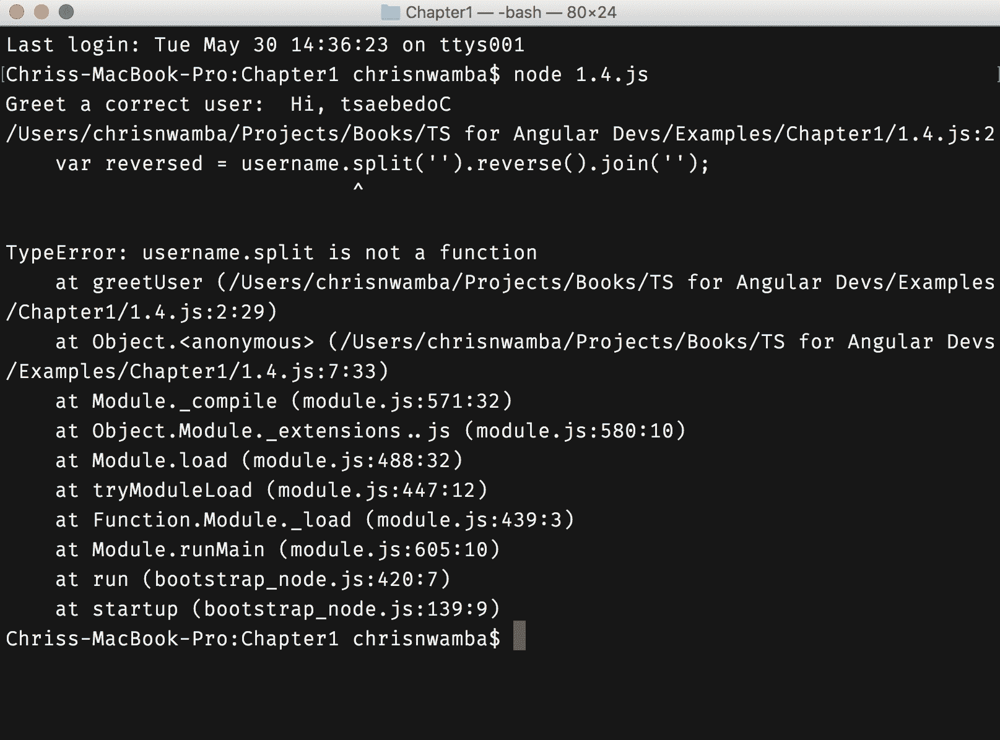
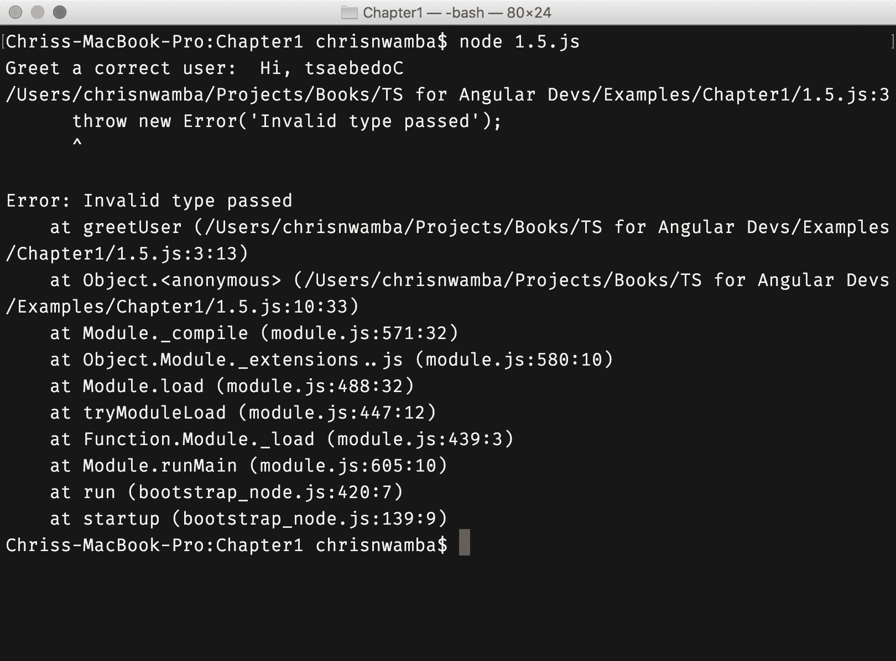

# 第一章：从松散类型到严格类型

*JavaScript 是松散类型的。*值得重复一下，*JavaScript 是松散类型的。*注意句子是被动的——我们不能绝对地责怪某人对 JavaScript 的松散类型本质，就像我们不能对 JavaScript 的其他著名故障负责一样。

对松散类型和松散类型语言的详细讨论将有助于理解我们计划用本书解决的问题。

当编程语言是松散类型时，意味着通过变量、函数或适用于语言的任何成员传递的数据*没有*定义的类型。可以声明变量*x*，但它持有的数据类型从未确定。松散类型的语言与强类型的语言相反，后者要求每个声明的成员必须严格定义它可以持有的数据类型。

这些类型被分类为：

+   字符串

+   数字（整数、浮点数等）

+   数据结构（数组、列表、对象、映射等）

+   布尔值（true 和 false）

JavaScript、PHP、Perl、Ruby 等都是松散类型的语言。Java、C、C#是强类型语言的例子。

在松散类型的语言中，一个成员最初可以被定义为字符串。在后续过程中，这个成员可能最终存储一个数字、一个布尔值，甚至一个数据结构。这种不稳定性导致了松散类型语言的含义。

# 术语定义

在继续之前，定义一下您可能在理解松散和严格类型的过程中遇到或将要遇到的常见行话会很有帮助：

+   **成员**：这些是描述数据如何存储和操作的语言特性。变量、函数、属性、类、接口等都是语言可能具有的成员的示例。

+   **声明与定义与赋值**：当一个变量被初始化而没有值时，它被称为*声明*。当它被声明并具有类型时，它被称为*定义*。当变量有一个值，无论是否有类型，它被*赋值*。

+   **类型**：这些用于根据它们被解析和操作的方式对数据进行分类。例如，数字、字符串、布尔值、数组等。

+   **值**：分配给给定成员的数据称为成员的值。

# 松散类型的含义

让我们从一个例子开始，展示松散类型语言的行为方式：

```ts
// Code 1.1

// Declare a variable and assign a value
var x = "Hello";

// Down the line
// you might have forgotten 
// about the original value of x
//
//
// Re-assign the value
x = 1;

// Log value
console.log(x); // 1
```

变量`x`最初被声明并赋予一个字符串值`Hello`。然后`x`被重新赋值为一个数值`1`。一切都没问题；代码被解释执行，当我们将值记录到控制台时，它记录了`x`的最新值，即`1`。

这不仅仅是一个字符串-数字的问题；同样的情况也适用于每一种类型，包括复杂的数据结构：

```ts
// Code 1.2

var isCompleted;

// Assign null
isCompleted = null;
console.log('When null:', isCompleted);

// Re-assign a boolean
isCompleted = false;
console.log('When boolean:', isCompleted);

// Re-assign a string
isCompleted = 'Not Yet!';
console.log('When string:', isCompleted);

// Re-assign a number
isCompleted = 0;
console.log('When number:', isCompleted);

// Re-assign an array
isCompleted = [false, true, 0];
console.log('When array:', isCompleted);

// Re-assign an object
isCompleted = {status: true, done: "no"};
console.log('When object:', isCompleted);

/**
* CONSOLE:
*
* When null: null
* When boolean: false
* When string: Not Yet!
* When number: 0
* When array: [ false, true, 0 ]
* When object: { status: true, done: 'no' }
*/
```

这里需要注意的重要事情不是*值*的变化。而是*类型*的变化。类型的改变不会影响执行。一切都运行正常，我们在控制台中得到了预期的结果。

函数参数和返回类型也不例外。您可以有一个接受字符串参数的函数签名，但是当您或任何其他开发人员在调用函数时传递数字时，JavaScript 将保持沉默：

```ts
function greetUser( username ) {
 return `Hi, ${username}`
}

console.log('Greet a user string: ', greetUser('Codebeast'))
console.log('Greet a boolean: ', greetUser(true))
console.log('Greet a number: ', greetUser(1))

/**
 * CONSOLE:
 *
 * Greet a user string: Hi, Codebeast
 * Greet a boolean: Hi, true
 * Greet a number: Hi, 1
 */
```

如果您来自强类型背景，并且没有使用松散类型语言的经验，那么前面的例子一定会感到奇怪。这是因为在强类型语言中，很难改变特定成员（变量、函数等）的类型。

那么，需要注意的含义是什么？显而易见的含义是，松散类型的成员是不一致的。因此，它们的值类型可以改变，这是您作为开发人员需要注意的事情。这样做会面临一些挑战；让我们来谈谈它们。

# 问题

松散类型很棘手。乍一看，它们似乎很好，很灵活，可以随意更改类型，而不像其他强类型语言那样会出现解释器发出错误的情况。就像任何其他形式的自由一样，这种自由也是有代价的。

主要问题是不一致性。很容易忘记成员的原始类型。这可能导致您处理一个字符串，就好像它仍然是一个字符串，而其值现在是布尔值。让我们看一个例子：

```ts
function greetUser( username ) {
 // Reverse the username
 var reversed = username.split('').reverse().join('');
 return `Hi, ${reversed}`
}

console.log('Greet a correct user: ', greetUser('Codebeast'))

 * CONSOLE:
 *
 * Greet a correct user: Hi, tsaebedoC
 */
```

在前面的例子中，我们有一个根据用户用户名向他们打招呼的函数。在打招呼之前，它首先颠倒用户名。我们可以通过传递用户名字符串来调用该函数。

当我们传递一个布尔值或其他没有`split`方法的类型时会发生什么？让我们来看看：

```ts
// Code 1.4

function greetUser( username ) {
 var reversed = username.split('').reverse().join('');
 return `Hi, ${reversed}`
}

console.log('Greet a correct user: ', greetUser('Codebeast'))

// Pass in a value that doesn't support
// the split method
console.log('Greet a boolean: ',greetUser(true))

 * CONSOLE:
 *
 * Greet a correct user: Hi, tsaebedoC
 * /$Path/Examples/chapter1/1.4.js:2
 * var reversed = username.split('').reverse().join('');
 ^
 * TypeError: username.split is not a function
 */
```

第一条日志输出，打印出一个字符串的问候语，效果很好。但第二次尝试失败了，因为我们传入了一个布尔值。就像 JavaScript 中的*一切*都是对象一样，布尔值没有`split`方法。下面的图片显示了前面示例的清晰输出：



是的，您可能会认为您是这段代码的作者；为什么在设计函数接收字符串时会传入布尔值？请记住，我们一生中编写的大部分代码都不是由我们维护的，而是由我们的同事维护的。

当另一个开发人员接手`greetUser`并决定将该函数作为 API 使用而不深入挖掘代码源或文档时，他/她很可能不会传入正确的值类型。这是因为*他/她是盲目的*。没有任何东西告诉他/她什么是正确的，什么是错误的。甚至函数的名称也不足以让她传入一个字符串。

JavaScript 发展了。这种演变不仅在内部体验到，而且在其庞大的社区中也有所体现。社区提出了解决 JavaScript 松散类型特性挑战的最佳实践。

# 缓解松散类型问题

JavaScript 没有任何明显的本地解决方案来解决松散类型带来的问题。相反，我们可以使用 JavaScript 的条件来进行各种形式的手动检查，以查看所讨论的值是否仍然是预期类型。

我们将看一些示例，手动检查以保持值类型的完整性。

在 JavaScript 中，*一切都是对象*这句流行的说法并不完全正确（[`blog.simpleblend.net/is-everything-in-javascript-an-object/`](https://blog.simpleblend.net/is-everything-in-javascript-an-object/)）。有*对象*和*原始值*。字符串、数字、布尔值、null、undefined 都是原始值，但在计算过程中只被视为对象。这就是为什么你可以在字符串上调用`.trim()`之类的方法。对象、数组、日期和正则表达式是有效的对象。说对象是对象，这确实让人费解，但这就是 JavaScript。

# typeof 运算符

`typeof`运算符用于检查给定操作数的类型。您可以使用该运算符来控制松散类型的危害。让我们看一些例子：

```ts
// Code 1.5
function greetUser( username ) {
 if(typeof username !== 'string') {
 throw new Error('Invalid type passed');
 };
 var reversed = username.split('').reverse().join('');
 return `Hi, ${reversed}`
}

console.log('Greet a correct user: ', greetUser('Codebeast'))
console.log('Greet a boolean: ',greetUser(true))
```

我们不应该等待系统在传入无效类型时告诉我们错误，而是尽早捕获错误并抛出自定义和更友好的错误，就像下面的截图所示：



typeof 运算符返回一个表示值类型的字符串。typeof 运算符并不完美，只有在你确定它的工作方式时才应该使用。参见下面的问题：

```ts
function greetUser( user ) {
 if ( typeof user !== 'object' ) {
 throw new Error('Type is not an object');
 }
 return `Hi, ${user.name}`;
}

console.log('Greet a correct user: ', greetUser( {name: 'Codebeast', age: 24 } ))
// Greet a correct user: Hi, Codebeast

console.log('Greet a boolean: ', greetUser( [1, 2, 3] ))
// Greet a boolean: Hi, undefined
```

当第二次调用函数时，你可能期望会抛出错误。但是程序没有通过检查，并在意识到它是未定义之前执行了`user.name`。为什么它通过了这个检查？记住数组是一个对象。因此，我们需要更具体的东西来捕获检查。日期和正则表达式也可能通过了检查，尽管这可能不是本意。

# toString 方法

toString 方法是所有对象和包装对象（原始对象）原型继承的。当你在它们上调用这个方法时，它会返回一个类型的字符串标记。看下面的例子：

```ts
Object.prototype.toString.call([]);  // [object Array]  Object.prototype.toString.call({});  // [object Object]  Object.prototype.toString.call('');  // [object String]  Object.prototype.toString.call(new  Date());  // [object Date]
// etc
```

现在你可以使用这个来检查类型，正如 Todd Motto 所示（[`toddmotto.com/understanding-javascript-types-and-reliable-type-checking/#true-object-types`](https://toddmotto.com/understanding-javascript-types-and-reliable-type-checking/#true-object-types)）：

```ts
var getType = function (elem) {
 return Object.prototype.toString.call(elem).slice(8, -1);
};
var isObject = function (elem) {
 return getType(elem) === 'Object';
};

// You can use the function
// to check types
if (isObject(person)) {
 person.getName();
}
```

前面的例子所做的是检查`toString`方法返回的字符串的一部分，以确定其类型。

# 最后说明

我们之前看到的例子对于简单的类型检查来说有些过度。如果 JavaScript 具有严格的类型特性，我们就不必经历这种压力。事实上，这一章可能根本就不存在。

想象一下 JavaScript 可以做到这一点：

```ts
function greet( username: string ) {
 return `Hi, ${username}`;
}
```

我们不必经历所有那些类型检查的痛苦，因为编译器（以及编辑器）在遇到类型不一致时会抛出错误。

这就是 TypeScript 发挥作用的地方。幸运的是，有了 TypeScript，我们可以编写类似于前面的代码，并将其转译为 JavaScript。

# 总结

在本书中，我们将讨论 TypeScript，不仅用于构建 JavaScript 应用程序，还用于构建 Angular 应用程序。Angular 是一个 JavaScript 框架；因此，除非通过 TypeScript 进行缓解，它将具有讨论的限制特性。

现在你知道手头的问题了，那就做好准备，让我们深入研究 Angular，并探讨 TypeScript 提供的可能解决方案。

目前为止，一切都很顺利！我们已经能够讨论以下关注点，以帮助我们继续前进：

+   理解松散类型

+   松散类型和严格类型之间的区别

+   松散类型编程语言的挑战，包括 JavaScript

+   减轻松散类型的影响
