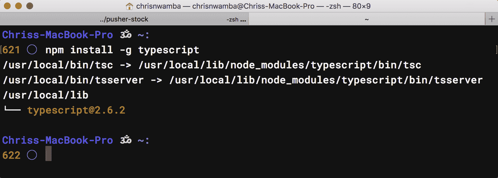
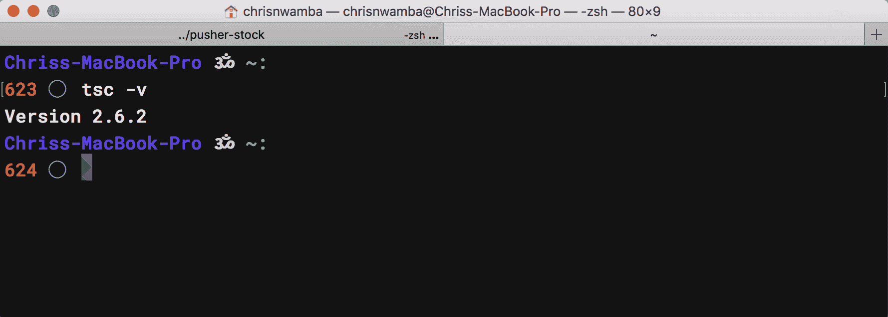
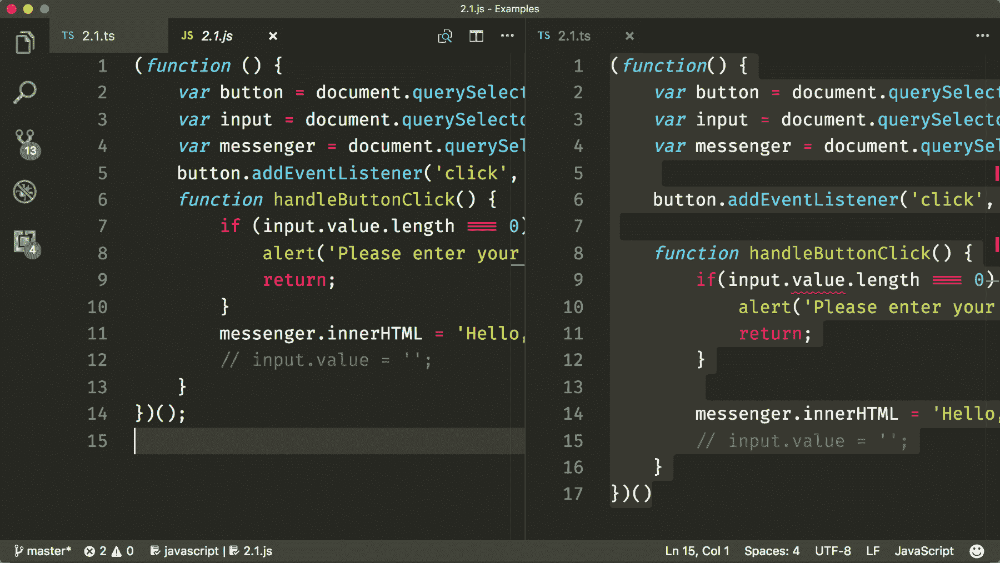
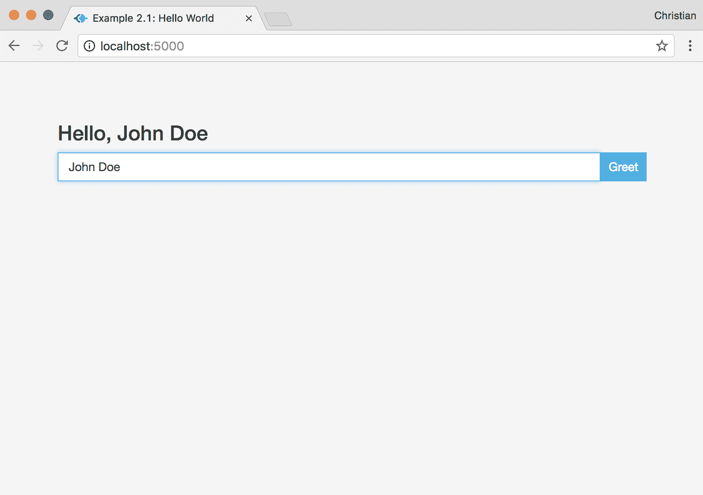
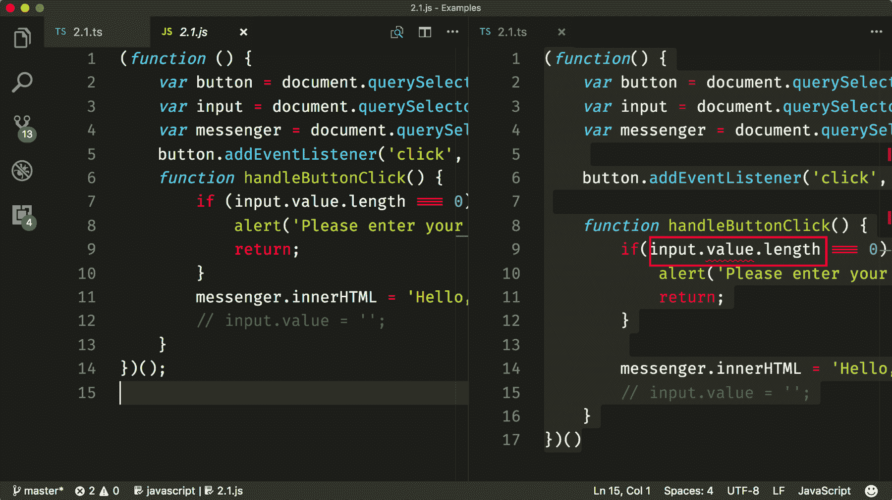
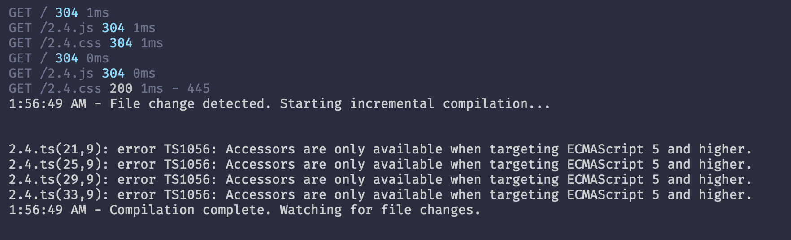
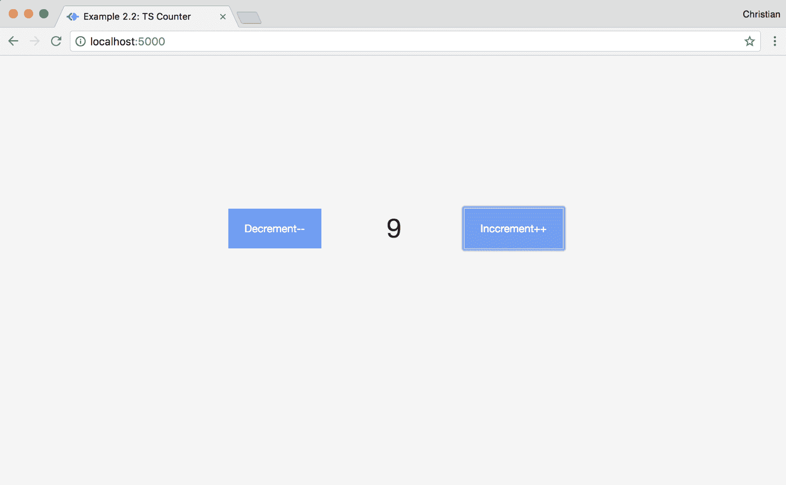

# 第二章：使用 TypeScript 入门

在上一章中，我们讨论了由于 JavaScript 语言的松散类型特性可能遇到的挑战。我们还看到了各种减轻这些挑战的尝试，但没有一种感觉自然。我们还介绍了 TypeScript 作为一种有助于的工具；本章将讨论 TypeScript 如何帮助我们。

TypeScript 的构建块和核心概念是关乎内心的事情，我们需要将它们视为这样。因此，通过实际示例，我们将讨论这些构建块，它们如何一起工作，以及如何将它们集成到您的工作流程中作为 JavaScript 开发人员。但首先，我们需要学习如何设置 TypeScript。

在本章中，我们将涵盖以下主题：

+   创建 TypeScript 环境

+   使用 TypeScript 构建工作示例

+   类型注解

+   ES6 和 TypeScript

# 设置 TypeScript

TypeScript 的设置取决于将要使用的上下文。这是因为只要为环境正确配置，就可以将其集成到任何 JavaScript 工具、库和框架中。现在，我们将专注于最简单和最基本的设置。

要开始使用 TypeScript，需要基本了解 Node 及其包管理器 npm。还需要从 Node 网站安装两者（[`nodejs.org/en/`](https://nodejs.org/en/)）。

安装了 Node 和 npm 后，可以使用命令行工具通过`npm`全局安装 TypeScript：

```ts
npm install -g typescript
```

如果在安装时出现权限警告，可以使用`sudo`命令：

```ts
sudo npm install -g typescript
```

如果安装顺利，将看到以下输出：



要确认 TypeScript 安装是否成功，可以检查已安装的版本。如果显示版本，则安装成功：

```ts
tsc -v
```

因此，您的计算机上的 TypeScript 实例将如下所示：



# Hello World

TypeScript 文件的扩展名为`.ts`。该扩展名支持 JavaScript 和 TypeScript。这意味着可以在`.ts`文件中编写 JavaScript 代码而不需要 TypeScript。让我们看一个例子。

首先，创建一个带有以下最小引导标记的`index.html`文件：

```ts
<!-- Code 2.1.html -->
<html>
 <head>
 <title>Example 2.1: Hello World</title>
 <!-- Include Bootstrap and custom style -->
 <link rel="stylesheet" href="https://maxcdn.bootstrapcdn.com/bootstrap/3.3.7/css/bootstrap.min.css">
 <link rel="stylesheet" href="2.1.css">
 </head>
 <body>
 <div class="container">
 <div class="col-md-4 col-md-offset-4 main">
 <h3 class="messenger"></h3>
 </div>
 <div class="col-md-4 col-md-offset-4 main">
 <input type="text" class="form-control">
 <button class="button">Greet</button>
 </div>
 </div>
 <!-- Include JavaScript file -->
 <script src="2.1.js"></script>
 </body>
</html>
```

请注意，在结束标记之前添加的 JavaScript 文件*不是*一个`.ts`文件；相反，它是一个带有`.js`扩展名的熟悉的 JavaScript 文件。这并不意味着我们的逻辑将用 JavaScript 编写；事实上，它是一个名为`2.1.ts`的 TypeScript 文件：

```ts
// Code 2.1.ts
(function() {
 var button = document.querySelector('.button');
 var input = document.querySelector('.form-control');
 var messenger = document.querySelector('.messenger');

 button.addEventListener('click', handleButtonClick);

 function handleButtonClick() {
 if(input.value.length === 0) {
 alert('Please enter your name');
 return;
 }
 // Update messanger 
 messenger.innerHTML = 'Hello, ' + input.value;
 }
})();
```

有什么奇怪的地方吗？不，我不这么认为。我们仍然在谈论纯 JavaScript，只是它存在于一个 TypeScript 文件中。这展示了 TypeScript 如何支持纯 JavaScript。

请记住，我们在`index.html`文件中导入的是`2.1.js`，而不是`2.1.ts`。因此，现在是时候生成浏览器可以理解的输出了。这就是我们通过`npm`安装的 TypeScript 编译器派上用场的地方。要编译，进入您的工作目录并在命令行中运行以下命令：

```ts
tsc 2.1.ts
```

*忽略关于值属性的警告。我们很快就会解决这个问题。*

这将生成一个编译后的`2.1.js`文件。正如您可能已经猜到的那样，查看这两者并没有语法差异：



然后，您可以使用 Web 服务器提供生成的资产来提供您的网页。有很多选项可以帮助您完成这一点，但`serve`非常受欢迎和稳定（[`github.com/zeit/serve`](https://github.com/zeit/serve)）。要安装`serve`，运行以下命令：

```ts
npm install -g serve
```

现在，您可以直接使用以下内容托管您的`index`文件：

```ts
serve --port 5000
```

使用`npm`脚本，您可以同时运行这两个命令。首先，初始化`package.json`：

```ts
npm init -y
```

现在，将以下脚本添加到 JSON 中：

```ts
"scripts": {"start": "tsc 2.1.ts -w & serve --port 5000"},
```

我们传入了`-w`选项，因此 TypeScript 可以在`.ts`文件中检测到更改时重新编译。

这就是我们的示例的样子：



# TypeScript 中的类型注释

值得再次提到的是，在我们刚刚看到的`Hello World`示例中，没有任何不同之处。让我们使用一些特定于 TypeScript 的功能，其中之一就是类型。类型是 TypeScript 存在的原因，除了类型之外的每个功能都只是语法糖。

我们不会详细讨论类型，因为第三章，*Typescript 原生类型和访问器*，涵盖了这一点。我们可以讨论的是类型注释，这是 TypeScript 用来对成员应用严格类型的机制。注释是通过在成员初始化后跟着一个冒号（`:`）和类型（例如，`string`）来实现的，如下所示：

```ts
var firstName: string;
```

让我们看一些带注释的示例：

```ts
var name: string = 'John';
console.log(name); // John

var age: number = 18;
console.log(age); // 18

var siblings: string[] = ['Lisa', 'Anna', 'Wili'];
console.log(siblings); // ['Lisa', 'Anna', 'Wili']

// OR

var siblings: Array<string> = ['Lisa', 'Anna', 'Wili'];
console.log(siblings); // ['Lisa', 'Anna', 'Wili']

// any type supports all other types
// and useful for objects when we are lazy
// to make types with interfaces/class for them

var attributes: any = {legs: 2, hands: 2, happy: true}
```

不仅基本类型，对象、数组和函数也可以被类型化。我们很快就会看到。

我们可以重写之前的`Hello World`例子，以便用类型注释来注释变量和函数。

再看一下这张图片：



在 TypeScript 部分（右侧），`value`似乎没有被编辑器识别为 DOM 的属性，因此出现了错误行。但等等，这还是你一直在写的老 JavaScript。这里有什么问题吗？

TypeScript 自带了 DOM 的定义类型。这意味着当我们尝试访问在相应的 DOM 接口中未定义的属性时，它会抛出错误（接口的更多内容稍后再说）。DOM 查询方法`querySelector`以及其他查询方法返回的是`Element`类型（如果没有注释的话会被推断出来）。`Element`类型是基本的，包含有关 DOM 的通用信息，这意味着从`Element`派生的属性和方法将不会被看到。

这不仅在 TypeScript 中有意义，在其他面向对象的语言中也是如此：

```ts
class Base {
 name: string = 'John'
}

class Derived extends Base {
 gender: string = 'male'
}

(new Base()).name // John
(new Base()).gender // throws an error
```

回到我们的例子，让我们看看如何使用注释和转换来解决这个问题：

```ts
// Code 2.2.ts
(function() {
 // 1\. Button type is Element
 var button: Element = document.querySelector('.button');
 // 2\. Input type is HTMLInputElement and we cast accordingly
 var input: HTMLInputElement = <HTMLInputElement>document.querySelector('.form-control');
 // 3\. Messanger is HTMLElement and we cast accordingly
 var messenger: HTMLElement = document.querySelector('.messenger') as HTMLElement;

 // 4\. The handler now takes a function and returns another function (callback)
 button.addEventListener('click', handleButtonClick('Hello,', 'Please enter your name'));

 function handleButtonClick(prefix, noNameErrMsg) {
 // Logic here
 // Should return a function 
 }
})()
```

没有行为上的改变，只是提高了生产力。让我们讨论一下发生了什么：

1.  按钮元素是`Element`类型。这里没有什么特别的，因为 TypeScript 已经内部推断出来了。

1.  输入元素是`HTMLInputElement`类型。因为 TypeScript 将返回值推断为`Element`，所以我们必须将其转换为正确的类型，即`HTMLInputElement`。这是通过在返回值前加上`<>`并传递我们想要转换的接口来完成的。

1.  信使元素是`HTMLElement`类型。我们仍然需要使用相同的原因进行转换，就像在*步骤 2*中看到的那样，但使用了不同的支持语法（`as`）。`HTMLElement`是`Element`的子类型，包括更具体的 DOM 属性/方法（如`innerText`）。

1.  我们不是直接传递回调函数，而是将其包装在一个函数中，这样我们就可以接收参数。

让我们看一下传递给`addEventListener`的方法：

```ts
// Code 2.2.ts
function handleButtonClick(prefix, noNameErrMsg) {
 return function() {
 if(input.value.length === 0) {
 if(typeof noNameErrMsg !== 'string') {
 alert('Something went wrong, and no valid error msg was provided')
 return;
 }
 alert(noNameErrMsg);
 return;
 }

 if(typeof prefix !== 'string') {
 alert('Improper types for prefix or error msg')
 }

 messenger.innerHTML = prefix + input.value;

 }
```

我们添加了很多验证逻辑，只是为了确保我们从参数中得到了正确的类型。我们可以通过使用 TypeScript 注释来简化这个过程：

```ts
// Code 2.3.ts
function handleButtonClick(prefix: string, noNameErrMsg: string) {
 return function(e: MouseEvent) {
 if(input.value.length === 0) {
 alert(noNameErrMsg);
 return;
 }

 messenger.innerHTML = prefix + input.value;

 }
}
```

这样好多了，对吧？类型检查已经处理了不必要的检查。事实上，在传递到浏览器之前，如果你的编辑器（例如 VS Code）支持 TypeScript，当使用无效类型调用方法时，你会得到语法错误。

类型注解帮助我们编写更简洁、更易理解和无 bug 的应用程序。TypeScript 使注解灵活；因此，你不必严格为逻辑中的每个成员提供类型。你可以自由地注解你认为必要的内容，从什么都不注解到全部注解；只需记住，你的注解越严格，你在浏览器中需要做的调试就越少。

# ES6 及更高版本

除了类型注解，TypeScript 还支持 EcamaScript 6（ES6/ES2015）以及其他有用的功能，如枚举、装饰器、可访问级别（private、public 和 protected）、接口、泛型等等

我们将在下一章深入了解一些功能。在那之前，让我们先尝试另一个例子，其中包括一些 ES6 和 TypeScript 特定的功能。我们将构建一个计数器应用程序。这只是一个让你对这些功能感到兴奋的尝试，你将看到 TypeScript 如何带来你一直希望存在于 JavaScript 中的功能。

让我们从一个基本的 HTML 模板开始：

```ts
<!-- Code 2.4.html -->
<div class="container">
 <div class="col-md-6 col-md-offset-3 main">
 <div class="row">
 <div class="col-md-4">
 <button id="decBtn">Decrement--</button>
 </div>
 <div class="col-md-4 text-center" id="counter">0</div>
 <div class="col-md-4">
 <button id="incBtn">Inccrement++</button>
 </div>
 </div>
 </div>
</div>
```

# 用户故事

*用户预期从按钮点击中增加或减少计数器*，基本上，一个初始化为`0`的计数器，一个增加按钮以增加`1`，一个减少按钮以减少`1`。

我们可以将 DOM 操作和事件逻辑组织成类，而不是在代码中到处散落。毕竟，这就是类存在的原因：

```ts
// Code 2.4.ts
class DOM {
 private _incBtn: HTMLElement;
 private _decBtn: HTMLElement;
 private _counter: HTMLElement;

 constructor() {
 this._incBtn = this._getDOMElement('#incBtn');
 this._decBtn = this._getDOMElement('#decBtn');
 this._counter = this._getDOMElement('#counter');
 }

 public _getDOMElement (selector: string) : HTMLElement {
 return document.querySelector(selector) as HTMLElement;
 }

 get incBtn(): HTMLElement {
 return this._incBtn;
 }

 get decBtn(): HTMLElement {
 return this._decBtn;
 }

 get counter(): number {
 return parseInt(this._counter.innerText);
 }

 set counter(value: number) {
 this._counter.innerText = value.toString();
 }
}
```

这就是 JavaScript 看起来像一个结构化语言。让我们花点时间解释一下正在发生的事情：

+   首先，我们创建一个类并声明一些私有属性来保存 HTML DOM 元素的临时状态。像`private`这样的可见性特性只在 TypeScript 中特有，但类在 ES6 中已经存在了。

+   构造函数使用了`_getDOMElement`私有实用方法来查询 DOM 并初始化私有属性的值。

+   `incBtn`和`decBtn`的 getter 用于将这些私有属性的值公开。这是面向对象编程中的常见模式。Getter 被归类为访问器，并在 ES6 中可用。

+   计数器访问器用于通过将它们转换为整数和字符串来设置和检索计数器文本的值。

您第一次尝试运行此应用程序应该会抛出错误，如下图所示：



这是因为 TypeScript 默认编译为 ES3，但在 ES3 中不支持 getter 和 setter（访问器）。要消除此错误，您可以告诉 TypeScript 编译器您更喜欢 ES5 而不是 ES3：

```ts
"start": "tsc 2.4.ts -w -t es5 & serve --port 5000"
```

`-t`标志，`--target`的别名，告诉 TypeScript 要编译到哪个版本。

`DOMEvent`类要简单得多--只有一个方法在调用时注册所有类型的事件：

```ts
// Code 2.4.ts
class DOMEvents {
 private register(htmlElement: HTMLElement, type:string, callback: (e: Event) => void): void {
 htmlElement.addEventListener(type, callback)
 }
}
```

该方法接受以下内容：

+   要监听事件的元素

+   事件类型（例如`click`，`mouseover`和`dblclick`）作为字符串

+   一个回调方法，返回`void`，但被传递给事件负载

然后该方法使用`addEventListener`注册事件。

最后，我们需要一个示例的入口点。这也将是一个类的形式，该类将依赖于`DOM`和`DOMEvent`类的实例：

```ts
// Code 2.4.ts
class App {
 constructor(public dom:DOM, public domEvents: DOMEvents) {
 this.setupEvents()
 }
 private setupEvents() {
 const buttons = [this.dom.incBtn, this.dom.decBtn];
 buttons.forEach(button => {
 this.domEvents.register(button, 'click', this.handleClicks.bind(this))
 })
 }
 private handleClicks(e: MouseEvent): void {
 const {id} = <HTMLElement>e.target;
 if(id === 'incBtn') {
 this.incrementCounter();
 } else {
 this.decrementCounter();
 }
 }

 private incrementCounter() {
 this.dom.counter++
 }

 private decrementCounter () {
 this.dom.counter--
 }
}
```

让我们讨论前面代码片段的工作原理：

+   构造函数在类初始化时被调用，尝试使用`setupEvents`方法设置事件。

+   `setupEvents`方法遍历 DOM 上的按钮列表，并在每个按钮上调用`DOMEvents register`方法

+   `register`方法作为`HTMLElement`传递给按钮，`click`作为事件类型，`handleClicks`作为事件处理程序。处理程序与正确的上下文`this`绑定。这在 JavaScript 中总是令人困惑；Yehuda Katz 已经以简单的方式解释了它的工作原理，网址为[`yehudakatz.com/2011/08/11/understanding-javascript-function-invocation-and-this/`](http://yehudakatz.com/2011/08/11/understanding-javascript-function-invocation-and-this/)。

+   回调方法根据被点击的按钮的 ID 调用`incrementCounter`或`decrementCounter`。这些方法分别从计数器中加 1 或减 1。

您可以通过创建`App`的实例来初始化应用程序：

```ts
// Code 2.4.ts
(new App(new DOM, new DOMEvents))
```

该图显示了我们新建的时髦计数器应用程序：



# 最后说明

重要的是再次指出我们在这些示例中使用的很酷的功能：

+   类

+   访问器

+   可见性

+   箭头函数（回调）：

```ts
var fooFunc = (arg1) => {
 return arg1
}
```

+   `const`关键字用于变量声明，而不是`var`

+   解构：

```ts
const {id} = <HTMLElement>e.target;
```

# 摘要

其中一些功能在 JavaScript 环境中是原生可用的；TypeScript 在此基础上进行了扩展，为开发人员提供更好的体验。这就是为什么它被称为 JavaScript 的超集。

在下一章中，我们将回顾和描述这些功能，并举更多例子让你熟悉工作流程。
