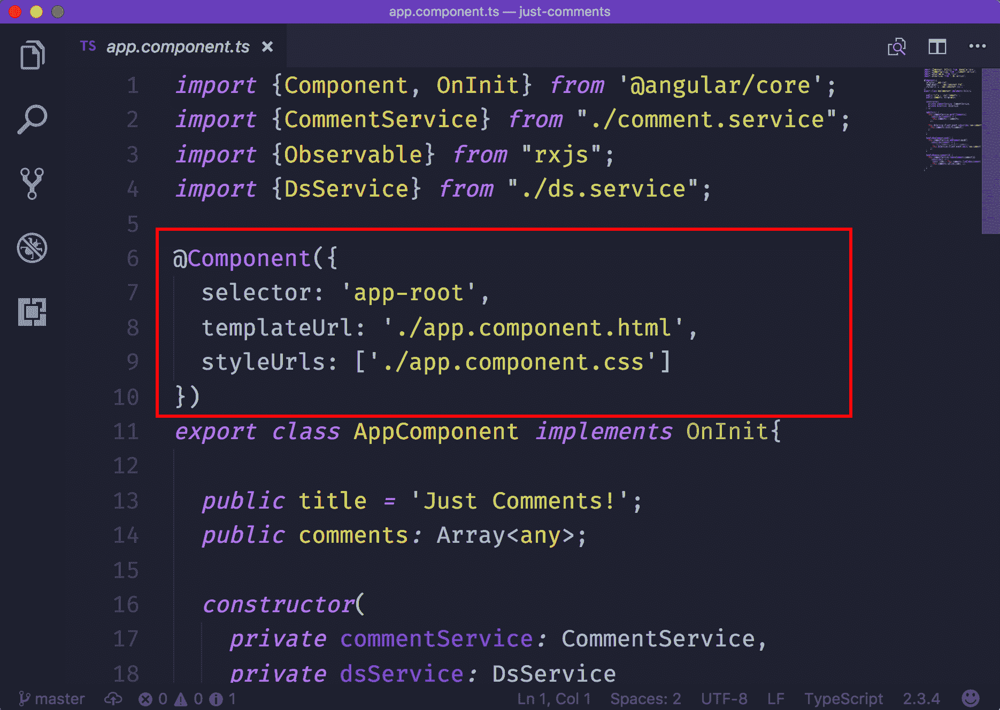

# 第三章：Typescript 本机类型和特性

您已经看到了使用 TypeScript 的不同示例。希望现在您知道 TypeScript 作为开发人员可以为您提供什么。在开始使用它构建 Angular 2 应用程序之前，还有一些 TypeScript 核心概念需要学习。本章将涵盖以下 TypeScript 概念：

+   基本类型，如字符串、数字、布尔、数组、void 等

+   函数类型

+   接口

+   装饰器

# 基本类型

让我们重新讨论基本类型。我们将讨论的大多数类型对您来说都很熟悉，但是通过复习会更好地欣赏 TypeScript 提供了什么。另一方面，一些类型在 JavaScript 中不可用，但是在 TypeScript 中是特定的。

# 字符串

字符串在 JavaScript 和 TypeScript 中都可用。它们用于表示文本数据。这些数据在程序中显示为字符串文字。这些文字在大多数编程语言中很容易识别，因为用双引号(`""`)括起来。在 JavaScript（和 TypeScript）中，这些文字用双引号(`""`)和单引号(`''`)表示：

```ts
let text: string = "Hi, I am a string. Now you know!";
```

在上面的片段中，`text`变量存储了这个字符串：`"Hi, I am a string. Now you know!"`。因为 TypeScript 支持 JavaScript 的最新特性，你可以使用新的 ES6 模板文字：

```ts
const outro: string = 'Now you know!';

let text: string = `Hi, I am not just a simple string.
 I am actually a paragraph. ${outro}`;
```

# 数字

数字在 JavaScript 和 TypeScript 中都可用。数字表示 JavaScript 中的浮点数。您可以直接用键盘输入它们，不需要像字符串那样进行任何装饰：

```ts
let whole: number = 6;
let decimal: number = 2.5; let hex: number = 0xf00d; let binary: number = 0b1010; let octal: number = 0o744;
```

# 布尔

布尔类型在 JavaScript 和 TypeScript 中都可用。布尔类型是您在编程语言中遇到的最简单的类型。它们用是或否回答问题，这在 JavaScript 中表示为`true`或`false`：

```ts
let isHappy: boolean = true;
let done: boolean = false;
```

# 数组

数组在 JavaScript 和 TypeScript 中都可用。JavaScript 中的数据结构基本上是用对象和数组表示的。对象是键值对，而数组具有可索引的结构。没有`array`类型，而是为数组中包含的项目提供类型。

您有两种选择。您可以使用`[]`符号对，如下所示：

```ts
let textArray: string[];

textArray = ["java", "kotlin", "typescript", "the rest..."]
```

或者，您可以使用内置的通用类型：

```ts
let numberArray: Array<number> = [9, 8, 7, 6, 5, 4, 3, 2, 1, 0]
```

# Void

Void 仅在 TypeScript 中可用。`void`类型适用于函数的返回类型（我们很快会讨论这个）。Void 表示函数不会返回任何东西：

```ts
let sum: number = 20

// No return type function
function addToGlobalSum(numToAdd): void { 
 number + numToAdd }

addToGlobalSum(30) 
console.log(number) // 50
```

# Any

Any 仅在 TypeScript 中可用。`any`类型是最灵活的类型。当需要时，它允许您更接近 JavaScript 的松散性质。这种需求可能来自未经类型化的第三方库，如果您不知道属性或方法可能返回的值类型。

这种类型可以存储所有已知的 JavaScript 类型：

```ts
// Stores a string
let name: any = 'John Doe' 

// Stores a number
let age: any = 24

// Stores a boolean
let employed: any = true

// ...even data structures
let person: any[] =['John Doe', 24, true] 
```

# 元组

元组仅在 TypeScript 中可用。它们允许数组中有不同的类型。元组意味着在创建类型时必须定义数组中的固定元素数量。例如，如果我们需要一个包含`string`、`number`和`boolean`的数组，它将如下所示：

```ts
let flexibleArray: [string, number, boolean];

flexibleArray = ['John Doe', 24, true] 
```

当您尝试访问最初未创建的索引时，新索引将以适当的推断类型添加：

```ts
let anotherFlexArray: [string, number];

anotherFlexArray = ['John Doe', 24];

Assign true to index 2
anotherFlexArray[2] = true;

// anotherFlexArray becomes ['John Doe', 24, true]
```

# 枚举

枚举类型仅在 TypeScript 中可用。在某些情况下，您可能只想存储一组数字，无论是连续的还是不连续的。枚举为您提供了一个数值数据结构控制，而无需引入数组或对象的复杂性。

以下示例显示了一个`enum`类型，其中包含从`0`到`2`的数字：

```ts
enum Status {Started, InProgress, Completed}

let status:Status = Status.InProgress // 1
```

枚举是基于`0`的；因此，`Started`为`0`，`InProgress`为`1`，`Completed`为`2`。此外，枚举是灵活的；因此，您可以为起始点提供一个数字，而不是`0`：

```ts
enum Status {Started = 1, InProgress, Completed}

let status:Status = Status.InProgress // 2
```

使用枚举可以编写更具表现力的代码。让我们看看如何在前面示例中使用百分比值来表示状态：

```ts
enum Status {Started = 33, InProgress = 66, Completed = 100}

let status:Status = Status.InProgress + '% done' // 66% done
```

如果您知道实际值，那么很容易找到值的名称：

```ts
enum Status {Started = 33, InProgress = 66, Completed = 100}

let status:string = Status[66] // InProgress

```

# 函数和函数类型

JavaScript 函数是松散类型的，也是语言中最常见的错误来源之一。基本函数看起来像这样：

```ts
function stringToArray(char) {
 return char.split(' ')
}
```

我们有多大把握`char`不是一个数字？嗯，我们可能无法控制使用`stringToArray`的开发人员会传入什么。这就是为什么我们需要使用 TypeScript 严格控制值类型的原因。

函数在声明的两个不同部分使用类型：

1.  函数参数

1.  函数返回值

# 函数参数

您可以告诉 TypeScript 函数应该期望什么类型的值，并且它将严格遵守。以下示例显示了一个接收类型化字符串和数字作为参数的函数：

```ts
// Typed parameters
function stringIndex(char: string, index: number) {
 const arr = char.split(' ')
 return arr[number];
}
```

`char`和`index`参数分别具有`string`和`number`类型。甚至在事情到达浏览器之前，TypeScript 会在您尝试一些愚蠢的事情时提醒您：

```ts
function stringIndex(char: string, index: number) {
 const arr = char.split(' ')
 return arr[number];
}

stringIndex(true, 'silly') // Types don't match
```

当然，函数表达式也不会被忽视：

```ts
const stringIndex = function (char: string, index: number) {
 const arr = char.split(' ')
 return arr[number];
}
```

此外，箭头函数也是可以的：

```ts
const stringIndex = (char: string, index: number) => char.split(' ')[number];
```

# 函数返回值

执行函数时期望的值也可以是严格类型的：

```ts
function stringIndex(char: string, index: number): string {
 const arr = char.split(' ')
 return arr[number];
}
```

从前面的代码片段中可以看出，返回类型位于包含参数的括号之后，也位于函数体的左大括号之前。预期该函数将返回一个字符串。除了字符串之外的任何内容都会报错。

# 可选参数

当函数的参数是严格类型时，当函数需要灵活时，它会感到僵硬。在我们的先前示例中，为什么我们应该传入`index`，如果我们打算在索引丢失的情况下返回整个字符串？

当在调用函数时省略索引参数时，TypeScript 将抛出错误。为了解决这个问题，我们可以将`index`参数声明为可选的：

```ts
function stringIndex(char: string, index?: number): string {
 // Just return string as is
 // if index is not passed in
 if(!index) return char;
 // else, return the index 
 // that was passed in
 const arr = char.split(' ')
 return arr[number];
}
```

参数名称后面的问号告诉 TypeScript，当调用时参数丢失是可以的。要小心处理函数体中未提供参数的情况，如前面的示例所示。

# 接口

接口是我们的代码遵循的合同。这是数据结构必须遵循的协议。这有助于每个实现接口的数据/逻辑免受不当或不匹配类型的影响。它还验证了传入的值的类型和可用性。

在 TypeScript 中，接口用于以下目的：

1.  为 JavaScript 对象创建类型。

1.  为类设置遵循的合同。

我们将讨论接口在我们刚才列出的情景中的应用。

# JavaScript 对象类型的接口

我们同意以下是一个有效的 JavaScript 对象：

```ts
// Option bag
let options = {show: true, container: '#main'};
```

这是有效的 JavaScript 代码，但是松散类型的。一直以来，我们一直在讨论字符串、数字、布尔值，甚至数组。我们还没有考虑对象。

正如您可能已经想象的那样，以下代码片段演示了先前示例的类型化版本：

```ts
// Typed object
let options: {show: boolean, container: string};

// Assing values
options = {show: true, container: '#main'};
```

这是正确的，但实际上，TypeScript 可以使用接口使其更易于维护和理解。以下是我们在 TypeScript 中编写接口的方式：

```ts
interface OptionBag {
 show: boolean,
 container: string
}
```

然后，您可以将`options`变量设置为`OptionBag`类型：

```ts
// Typed object
let options: OptionBag = {show: true, container: '#main'};
```

# 可选属性

不过关于接口的一件事是，接口定义的属性/方法在创建使用该接口类型的值时必须提供。基本上，我是说我们必须严格遵守与接口建立的契约。

因此，以下是不正确的，会抛出错误：

```ts
interface OptionBag {
 show: boolean,
 container: string
}

let options: OptionBag = {show: true}; // Error
```

我们可以将`container`设置为可选的；我们使用问号字面量，就像之前的例子中看到的那样：

```ts
interface OptionBag {
 show: boolean,
 container?: string
}

let options: OptionBag = {show: true}; // No Error
```

不过要小心，要考虑当未提供可选参数时。以下是一个这样做的例子：

```ts
// Get element
function getContainerElement(options: OptionBag):HTMLElement {
 let containerElement: HTMLElement
 if(!options.container) {
 // container was not passed in
 containerElement = document.querySelector('body');
 } else {
 // container was passed in
 containerElement = document.querySelector(options.container);
 }

 return containerElement
}
```

# 只读属性

另一个典型的情况是当你有属性，你打算只赋值一次，就像我们用 ES6 的`const`声明关键字一样。你可以将这些值标记为`readonly`：

```ts
interface StaticSettings {
 readonly width: number,
 readonly height: number
}

// There are no problems here
let settings: StaticSettings = {width: 1500, height: 750}

// ...but this will throw an error
settings.width = 1000
// or
settings.height = 500
```

# 接口作为契约

您可以确保一个类遵循特定的契约，使用接口。我使用契约这个术语，意思是接口中定义的所有属性和方法必须在类中实现。

假设我们有以下`Note`接口：

```ts
interface Note {
 wordCount: number
}
```

要使用类来实现接口，我们在类名后面加上`implements`关键字，然后是我们要实现的接口：

```ts
class NoteTaker implements Note {
 // Implement wordCount from
 // Note interface
 wordCount: number;
 constructor(count: number) {
 this.wordCount = count
 }
}
```

接口不仅定义属性的签名，还接受函数类型作为方法：

```ts
interface Note {
 wordCount: number;
 updateCount(count: number): void
}
```

这可以通过类来实现：

```ts
class NoteTaker implements Note {
 // Implement wordCount from
 // Note interface
 wordCount: number;
 constructor(count: number) {
 this.wordCount = count
 }

 updateCount(count: number): void {
 wordCount += count
 }
}
```

如果`NoteTaker`类中既没有`wordCount`属性也没有`updateCount`方法，TypeScript 会抛出错误。

# 装饰器

在 Angular 2+中引入的最常见特性是**装饰器**。装饰器乍一看令人困惑，因为它们的使用前面有一个不寻常的`@`符号：



上面的截图是来自一个 Angular 应用的代码片段。它显示了一个组件装饰器装饰了一个名为`AppComponent`的类。

起初，这可能看起来令人不知所措，因为在 JavaScript 的历史上，我从未见过`@`字面量以这种方式使用。如果我们知道它只是一个可以访问所装饰内容的函数就好了！类、属性、方法和访问器都可以被装饰。让我们讨论如何装饰方法和类

# 装饰方法

假设我们想要让类上的一个方法只读。因此，在创建方法之后，它不能被任何原因覆盖。例如，方法看起来是这样的：

```ts
class Report {
 errPayload;

 // To become readonly
 error() {
 console.log(`The following error occured ${errPayload}`)
 }
}
```

如果我们不想在应用程序的生命周期中覆盖`error`，我们可以编写一个装饰器将描述符的`writable`属性设置为`false`：

```ts
function readonly(target, key, descriptor) {
 descriptor.writable = false;
 return descriptor
}
```

通用签名是方法装饰器接受与`Object.defineProperty`相同的参数。在这种情况下，目标将是类，键将是方法名，这是类的属性，描述符将是`config`对象。

现在我们可以用刚刚创建的`readonly`装饰器装饰`error`方法：

```ts
class Report {
 errPayload;

 // Decorated method 
 @readonly
 error() {
 console.log(`The following error occured ${errPayload}`)
 }
}
```

任何试图改变`error`属性的尝试都将失败：

```ts
const report = new Report()

// This would never work
// because 'error' is read only
report.error = function() {
 console.log('I won't even be called')
}
```

# 装饰类

另一个常常被装饰的成员是类。事实上，在 Angular 中，几乎所有的类（组件、服务、模块、过滤器和指令）都被装饰。这就是为什么理解装饰器的存在是如此重要的原因。

装饰器可用于扩展类的功能，如下例所示：

```ts
// decorator function
function config(target) {
 target.options = {
 id: '#main',
 show: true
 }
}

// class
@config
class App {}

// options added
console.log(App.options) // {id: '#main', show: true}
```

# 装饰器工厂

前面的例子是固定的，因为`options`对象将始终具有相同的值。如果我们需要接收动态值怎么办？当然，这是一个有效的问题，因为`id`属性可能并不总是`#main`。因此，我们需要更灵活一些。

装饰器工厂是返回装饰器的函数，使您能够通过其工厂传递参数给装饰器：

```ts
// decorator factory function
function config(options) {
 // decorator function
 return function(target) {
 target.options = options
 }
}

// class decorator
// with arguments
@config({id: '#main', show: true})
class App {}

// options added
console.log(App.options) // {id: '#main', show: true}
```

# 总结

在前三章中，我们花了时间讨论 TypeScript 的基础知识，目的是在接下来的章节中（其中充满了大量的 Angular 内容）中，TypeScript 将不再是你需要担心的东西。

可以假设基本类型、函数类型、装饰器和接口已经添加到您对 TypeScript 的现有知识中。

在本书的接下来的章节中，我们将深入学习 Angular。如果你已经走到了这一步，那么你已经度过了本书中枯燥的部分，因为从现在开始，我们将用 Angular 2+构建许多有趣的示例。
