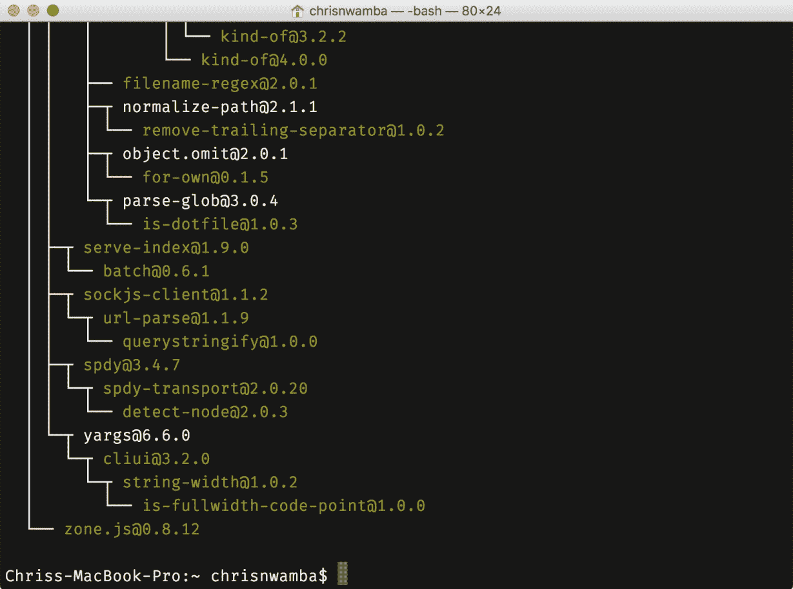
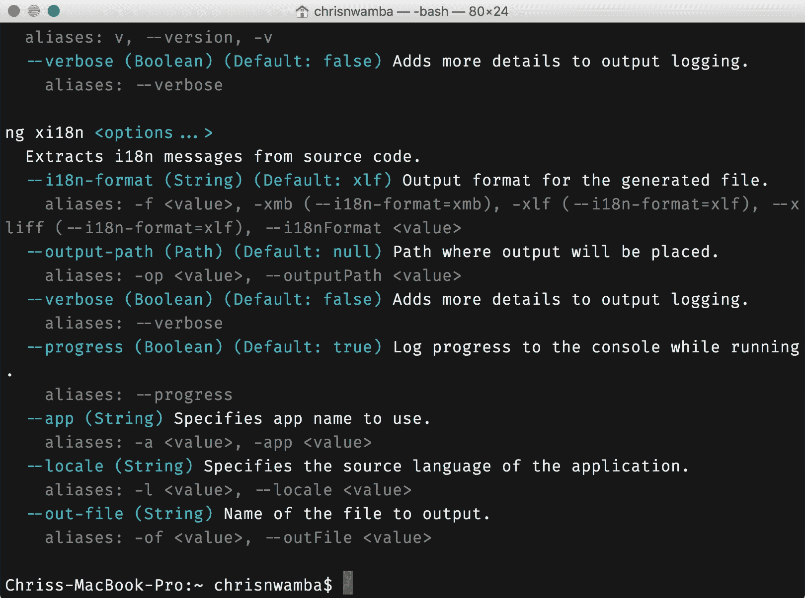
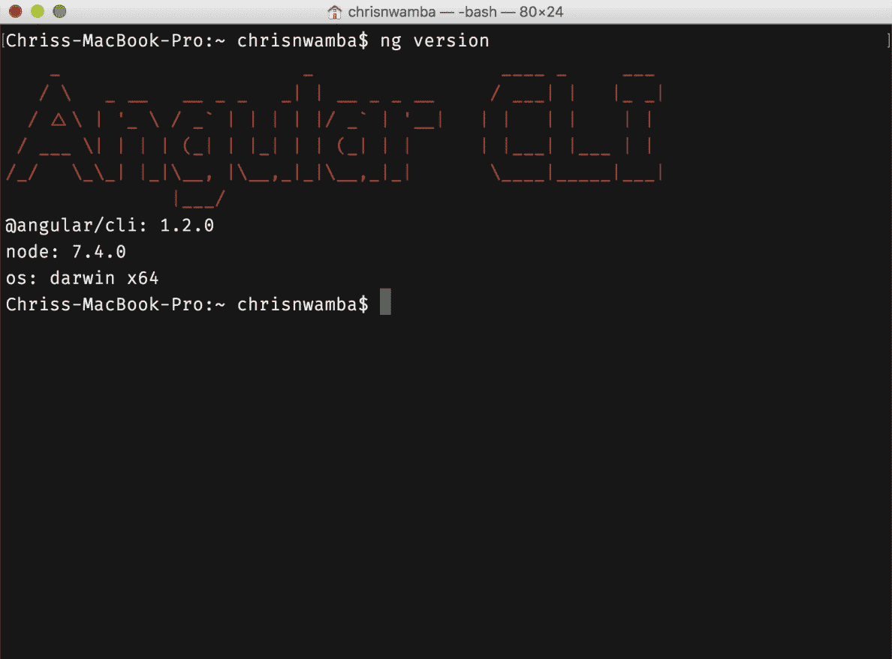
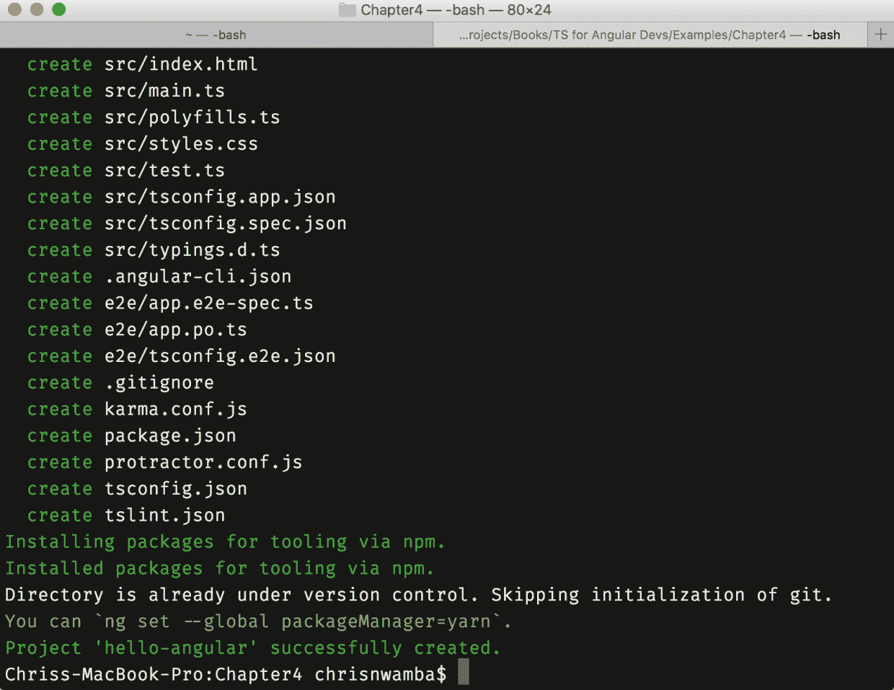
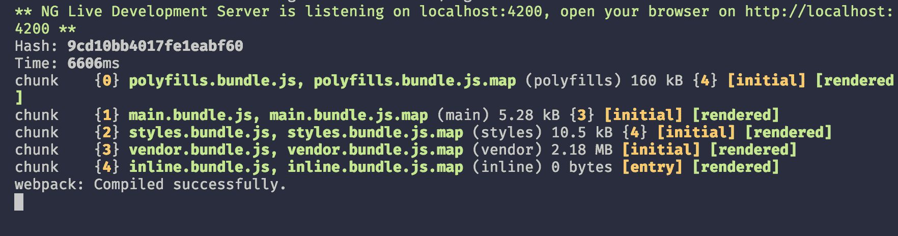
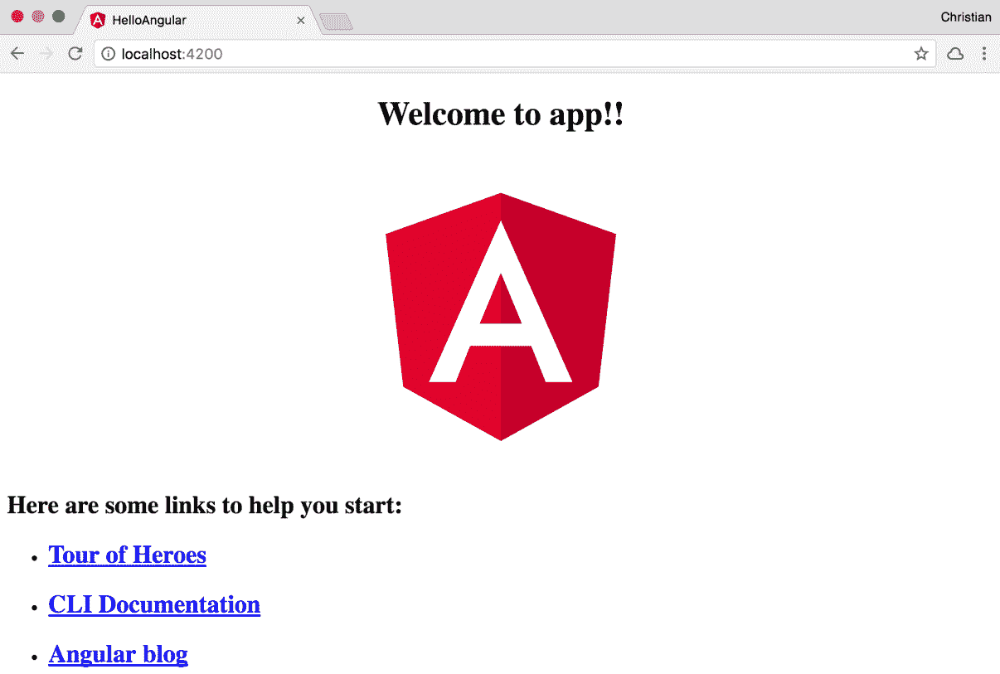
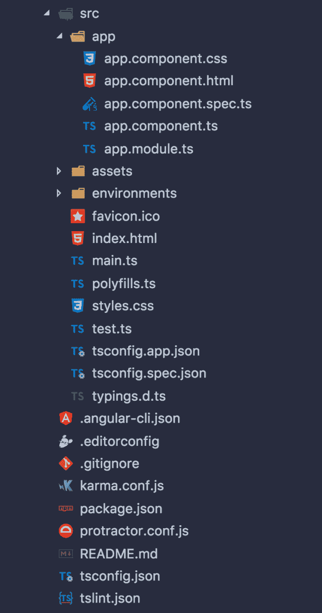
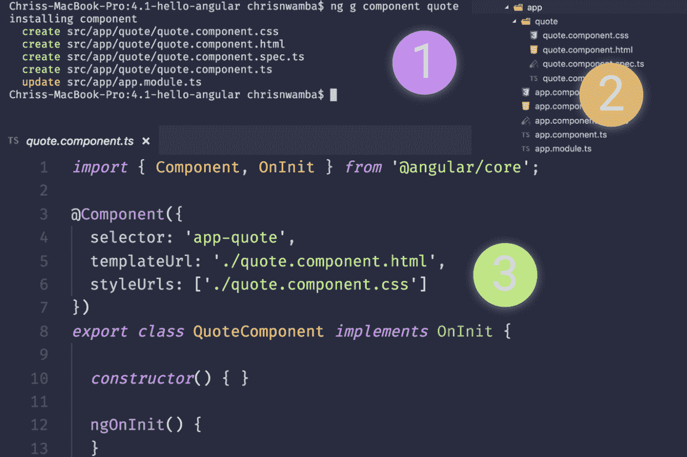
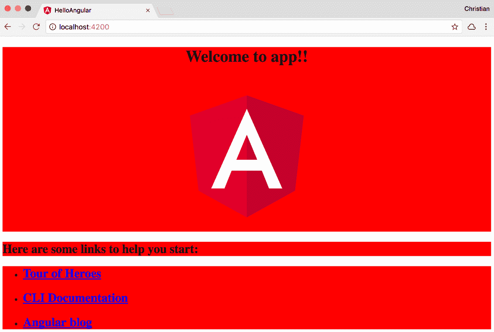
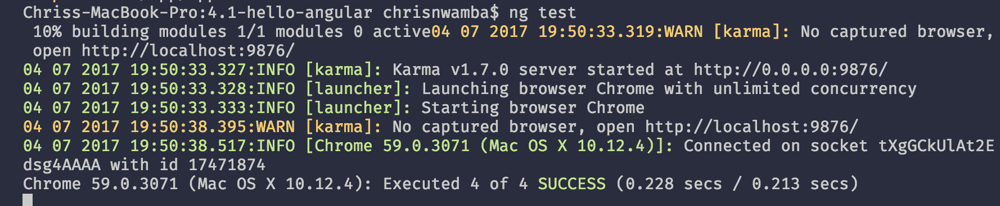

# 第四章：使用 Angular 和 TypeScript 快速上手

前几章旨在解释 TypeScript 的基本和最常见的特性。在开发 Angular 项目时，这些特性将被广泛使用。在构建 Angular 项目时，TypeScript 是完全可选的，但相信我，只使用 JavaScript 并不是你想要经历 TypeScript 简化开发过程后的选择。

本章介绍了本书中令人兴奋的部分--使用 TypeScript 构建 Angular 应用程序。本章将涵盖以下主题：

+   使用 TypeScript 设置 Angular

+   理解组件基础知识

+   学习关于 Angular 的模板语法

+   一些数据绑定魔法

所有这些令人兴奋的主题都将有很好的示例支持，这样你就可以亲自看到这些东西是如何工作的。让我们开始吧。

# 使用 Angular 和 TypeScript 设置

Angular 并不是一个难以入门的框架。不幸的是，从初学者的角度来看，生态系统可能会用大量术语压倒你。这些术语大多代表了使 Angular 工作的工具，而不是 Angular 本身。Webpack、linters、TypeScript、typings、构建过程等等，都是一些令人困惑的术语，可能会在你开始 Angular 之旅的时候让你望而却步。

因此，Angular 团队构建了一个全能工具，帮助你更少地关注周围的工具，而更多地关注构建你的项目。它被称为 Angular CLI，只需几个 CLI 命令，你就可以构建你的应用程序。如今花在管理 JavaScript 工具上的时间令人担忧，作为一个初学者（甚至是专业人士），你不想陷入那样的混乱中。

要安装 CLI，你需要用 npm 运行以下命令：

```ts
npm install -g @angular/cli
```

当安装完成时，你应该在控制台中看到以下 npm 日志：



你可以通过运行`help`或`version`命令来检查安装是否成功。

```ts
# Help command
ng help

# Version command
ng version
```

帮助命令将显示通过 CLI 工具可用的命令列表，而版本命令将显示当前安装的版本。如果安装不成功，这些命令都不会打印上述信息。

当你运行`help`命令时，以下是打印的日志详情：



运行版本命令会显示以下截图：



# 创建一个新的 Angular 项目

安装了 CLI 后，您现在可以在项目中开始使用它。当然，首先要做的是创建一个。CLI 的`new`命令只在项目中使用一次，用于生成项目需要的起始文件和配置：

```ts
ng new hello-angular
```

该命令不仅为您创建项目；它还安装了 npm 依赖项，因此您无需在开始之前运行安装命令：



直接导航到文件夹的根目录并运行`serve`命令：

```ts
ng serve
```

运行命令后，您将获得以下输出，显示您的应用程序成功运行的位置以及您可以访问它的位置。它还显示了捆绑文件，包括样式和脚本。请注意，这里没有 TypeScript 文件；一切都已转换为 JavaScript，以便浏览器理解：



您应该在`localhost:4200`看到您闪亮的应用程序正在运行：



# 项目结构

Angular 生成了许多辅助文件，以便测试、构建过程、包管理等。您可以成功构建一个项目，而不必关心这些文件的作用。因此，我们只会展示一些对我们开始很重要的文件：



我们现在应该关注`src`目录。这就是我们的项目文件（组件、服务、模板等）将存放的地方。

# 生成文件

您可以手动添加更多的 TypeScript 文件和模板，但使用 CLI 工具更有效。这是因为 CLI 工具不仅创建文件，还生成了起始片段来表示您尝试创建的文件类型。例如，让我们创建一个引用组件：

```ts
ng generate component quote
# OR
ng g component quote
```

这就是组件命令的样子，其中包含一些生成的代码和文件：



该图包括以下内容：

1.  生成过程的 CLI 输出。

1.  生成的组件、模板、CSS 和测试文件。

1.  TypeScript 组件。

CLI 可以用来生成其他 Angular/TypeScript 构建模块，而不仅仅是组件。我们现在不会尝试它；我们将在后续章节中讨论时再这样做。以下表格是在项目的 Github 自述文件中看到的生成命令：

| **脚手架** | **用法** |
| --- | --- |
| 组件 | `ng g component my-new-component` |
| 指令 | `ng g directive my-new-directive` |
| 管道 | `ng g pipe my-new-pipe` |
| 服务 | `ng g service my-new-service` |
| 类 | `ng g class my-new-class` |
| 守卫 | `ng g guard my-new-guard` |
| 接口 | `ng g interface my-new-interface` |
| 枚举 | `ng g enum my-new-enum` |
| 模块 | `ng g module my-module` |

# 基本概念

我们将在本书中深入探讨不同的主题，但大致解释正在发生的事情是个好主意，以便有上下文。

# 组件

您的好奇心可能会导致您打开`app.component.ts`或`quote.component.ts`。如果它们看起来令人不知所措，不要担心；我们将在本书中广泛讨论组件（特别是在接下来的两章中）。

组件是任何 Angular 项目的核心。它们是核心构建模块，其他所有功能都只是为了支持组件。提到的文件包含用 TypeScript 编写的 Angular 组件。这就是`app.component.ts`的样子：

```ts
import { Component } from '@angular/core';  @Component({  
 selector: 'app-root',  
 templateUrl: './app.component.html',  
 styleUrls: ['./app.component.css']  })  export class AppComponent {  title = 'app';  }  
```

组件是带有模板的装饰类。装饰的类型很重要，在这种情况下是`Component`装饰器。从前一章中记得装饰器只是扩展它们装饰的功能的函数。这就是前面例子中发生的事情。

首先，我们从 Angular 的核心模块`@angular/core`中导入这个装饰器。然后我们将装饰器放在我们的`AppComponent`类的正上方。装饰器以一个 JavaScript 对象作为其参数来描述组件。该对象包含以下内容：

+   `selector`：这是组件在应用程序的任何部分中被调用时将被识别为的内容。因为这个组件是您的应用程序的入口点，它将直接在 body 中使用，包括其选择器：

```ts
<!--./src/index.html-->
...
<body>  
 <app-root></app-root>  </body>
...
```

+   `templateUrl`：组件将模板呈现到视图中。我们需要一种方法来告诉组件要呈现哪个模板。这可以通过`template`或`templateUrl`属性实现。`template`属性接受 HTML 内容的字符串，而`templateUrl`接受模板 HTML 文件的 URL。

+   `styleUrls`：这是应用于定义模板的样式 URL 的数组。

实际组件的类（并且正在被装饰）成为与该组件相关的属性和方法的主页。所有这些一起作为一个整体，以创建一个可重用的功能，称为组件。

引用组件看起来非常相似：

```ts
import { Component, OnInit } from '@angular/core';  @Component({  
 selector: 'app-quote',  
 templateUrl: './quote.component.html',  
 styleUrls: ['./quote.component.css']  })  export class QuoteComponent implements OnInit {   
 constructor() { }   
 ngOnInit() {  }  }  
```

唯一明显的区别是它实现了`OnInit`接口，该接口具有一个`ngOnInit`方法，该方法类必须实现。这个方法被称为生命周期钩子，我们很快会讨论它。

# 模板

模板只是常规的 HTML 文件，但通过插值和指令进行了增强。以下是`app.component.html`的当前内容，这是`AppComponent`的模板：

```ts
<div style="text-align:center">  
 <h1>  Welcome to {{title}}!!  </h1>  
   </div>  <h2>Here are some links to help you start: </h2>  <ul>  
 <li>  <h2><a target="_blank" href="https://angular.io/tutorial">Tour of Heroes</a></h2>  </li>  
 <li>  <h2><a target="_blank" href="https://github.com/angular/angular-cli/wiki">CLI Documentation</a></h2>  </li>  
 <li>  <h2><a target="_blank" href="http://angularjs.blogspot.ca/">Angular blog</a></h2>  </li>  </ul>  
```

正如您所看到的，这只是普通的 HTML。不过有一件事可能看起来不太熟悉：

```ts
<h1>  Welcome to {{title}}!!  </h1>  
```

用双大括号括起来的`title`文本可能会让您感到困惑。这被称为插值。`title`值是根据组件类上的属性值在运行时解析的。不要忘记我们有一个值为`app`的 title 属性：

```ts
title = 'app';
```

除了像这样绑定值之外，您还可以在模板上执行许多令人惊奇的任务。它们包括以下内容：

+   属性和事件绑定

+   双向绑定

+   迭代和条件

+   样式和类绑定

+   简单表达式

+   管道和指令

与其向您提供与模板和模板语法相关的所有无聊的东西，我们应该讨论它们以及它们与其他即将到来的主题的关系。这样，您可以在示例中看到它们的实际应用，这应该更有趣。

# 组件样式

组件大量地展示了可重用性。实际上，这是您询问使用组件架构的好处时得到的第一个答案。这就是为什么模板和样式被限定在组件范围内，而不是用沉重的 HTML 和 CSS 来污染应用程序的环境的原因。

组件装饰器参数中的`styleUrls`属性接受一个指向要应用于组件的样式的 URL 数组。大多数情况下，您只需要一个文件；因此数组将只包含一个 URL 项，在我们的情况下是`app.component.css`。它目前是空的，但我们可以对其进行实验：

```ts
* {  
 background: red; }
```

`*`选择器应该选择文档中的所有内容。因此，我们说，*选择每个元素并将背景设置为红色*。您可能会对结果感到惊讶：



注意实际的 body 标签没有样式，这可能并不直观，因为您使用了全局选择器。组件样式被限定在组件内部；因此样式不能泄漏到包含父级。这就是为什么 body 保持为白色，而`AppComponent`模板中的内容为红色的原因。

# 模块

组件用于构建产品中的小型可重用功能。它们与服务、指令、管道等概念一起工作，以实现功能特性。在某些情况下，您可能希望将这些功能从一个项目移动到另一个项目，甚至在一个庞大的项目的不同部分之间移动。因此，您需要一种将它们收集在一起作为功能的方法。这正是模块所做的。

模块是用`NgModule`装饰器装饰的类。装饰器接受一个对象，就像组件装饰器一样。这个对象描述了你需要关联到这个模块的所有功能成员。可能的成员（但不是所有成员）如下：

+   **声明**: 这些包括组件、指令和管道

+   **提供者**: 这些包括可注入的服务

+   **导入**: 这些包括其他导入的模块

+   **引导**: 这是启动应用程序的入口组件

我们已经有一个模块，即`AppModule`：

```ts
import { BrowserModule } from '@angular/platform-browser';  import { NgModule } from '@angular/core';  import { AppComponent } from './app.component';  import { QuoteComponent } from './quote/quote.component';  @NgModule({  
 declarations: [  
 AppComponent,  
 QuoteComponent  
 ],  
 imports: [  
 BrowserModule  
 ],  
 providers: [],  
 bootstrap: [ 
 AppComponent 
 ]  })  export class AppModule { }  
```

让我们花点时间描述一下这个模块中的项目：

+   **声明**: `AppComponent`和`QuoteComponent`是组件。因此，它们属于这个类别。在生成引言组件后，Angular CLI 做的一件了不起的事情是自动将其添加到声明中。如果没有这样做，即使在应用程序的某个地方使用组件选择器，引言组件的内容仍然不会显示，并且您将在控制台中收到错误。

+   **导入**: `BrowserModule`是一个模块。它是一个包含常见浏览器任务的模块，特别是用于模板的指令，如`*ngFor`等。

+   **提供者**: 由于我们还没有任何服务，可以省略提供者，或者将数组留空。

+   **引导**: 应用程序模块是我们的入口模块。因此，它应该定义入口组件，即`AppComponent`。这就是`bootstrap`属性的作用。

# 单元测试

虽然我们不会在本书的最后一章之前涵盖测试，但养成测试的习惯是值得的。这就是为什么我们要在这里探索测试组件的简单性。

基本上，Angular 提供了一个测试组件的抽象层，借助`TestBed`。在你能看到你的组件是否按计划运行之前，你不需要运行整个应用程序。一个简单的测试已经与我们的应用组件的 CLI 脚手架捆绑在一起。它可以在文件旁边找到（这是一个常见且良好的做法），如`app.component.spec.ts`。

让我们查看这个文件的内容：

```ts
import { TestBed, async } from '@angular/core/testing';  import { AppComponent } from './app.component';  describe('AppComponent', () => {

});
```

首先，我们从`@angular/core/testing`导入测试工具和要测试的组件，即`AppComponent`。还创建了一个`describe`块，其中包含了给定功能（`AppComponent`）的测试套件集，但是为空的。

在开始编写测试套件之前，我们需要为组件配置一个临时测试模块。这是在`beforeEach`块中完成的：

```ts
//...
describe('AppComponent', () => {  
 beforeEach(async(() => {  
 TestBed.configureTestingModule({  
 declarations: [  AppComponent  ],  
 }).compileComponents();  
 }));
 // ...
});
```

在实际应用中，我们可以创建`AppModule`，其中`AppComponent`作为声明。在这里，我们只需要一个简单的模块，其中包含`AppComponent`，这要归功于`TestBed`的`configureTestingModule`模块使这成为可能。

接下来，我们可以开始编写对我们想要检查的任何场景的测试套件。首先，让我们检查`AppComponent`是否存在：

```ts
describe('AppComponent', () => {  
 it('should create the app', async(() => {  
 const fixture = TestBed.createComponent(AppComponent);  
 const app = fixture.debugElement.componentInstance;  
 expect(app).toBeTruthy();  
 }));
});
```

在使用`createComponent()`创建组件本身之后，我们首先尝试使用`componentInstance`创建组件的实例。

当我们使用`expect`断言来查看组件是否存在时，实际的检查是完成的，使用`toBeTruthy()`。

我们还可以检查组件属性的内容：

```ts
it(`should have as title 'app'`, async(() => {  
 const fixture = TestBed.createComponent(AppComponent);  
 const app = fixture.debugElement.componentInstance;  
 expect(app.title).toEqual('app');  
}));
```

通过`app`作为组件的一个实例，您可以访问此实例上的属性和方法。我们刚刚测试了`app.title`的初始值是否等于`app`。

最后的测试套件实际上检查了值的 DOM：

```ts
it('should render title in a h1 tag', async(() => {  
 const fixture = TestBed.createComponent(AppComponent);  
 fixture.detectChanges();  
 const compiled = fixture.debugElement.nativeElement; expect(compiled.querySelector('h1').textContent).toContain('Welcome to app!!');  }));
```

请注意，在这个测试套件中调用了`detectChanges`。这会启动模板上的绑定（如果有的话）。然后，我们不是创建一个实例，而是抓住编译后的元素，查询它的`h1`标签，并检查标签的文本内容是否包含`Welcome to app`。

要运行这些测试，请执行以下命令：

```ts
ng test
```

这应该启动 Karma，一个隔离的测试环境。您的测试将运行，并且以下内容将被打印到 CLI：



您可能想知道为什么最后一行说`4`个测试而不是`3`个；请记住，我们生成的引用组件也有一个单独的测试套件。

# 摘要

在本章中，您学会了如何创建 Angular 项目以及新项目必需的文件。现在您知道如何创建 Angular 项目，并且构建组件等基本构建块，了解了模块的存在原因，如何将简单样式应用到组件，以及 Angular 中的单元测试是什么样子的。

在下一章中，我们将深入探讨更多组件的创建，并看一些示例在实际中的运用。
