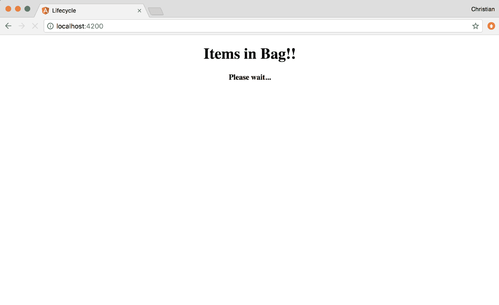
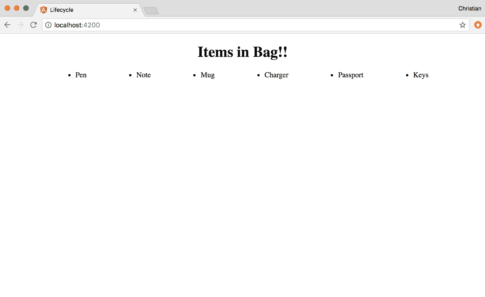
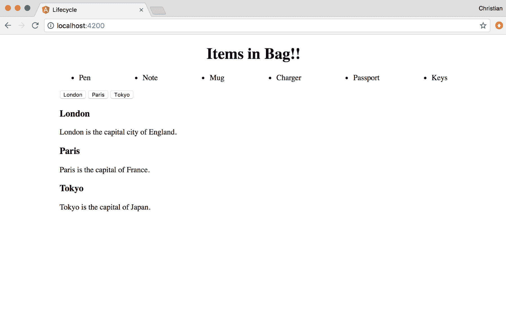
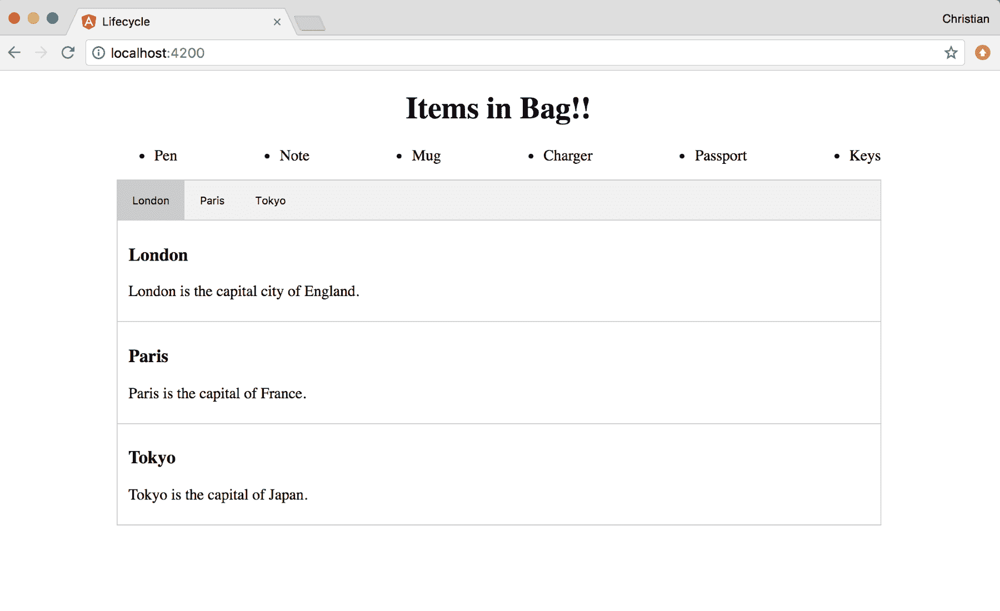
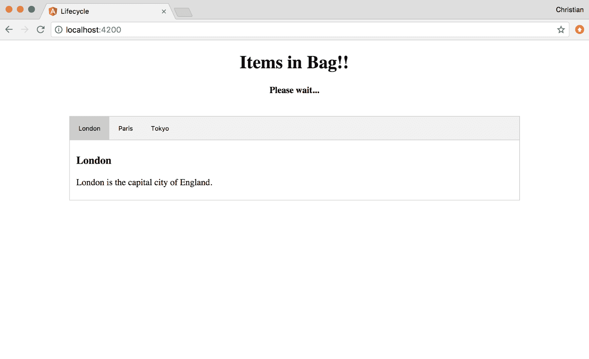
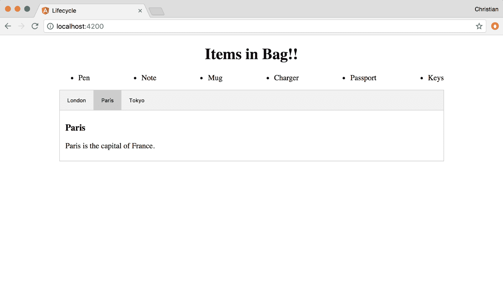
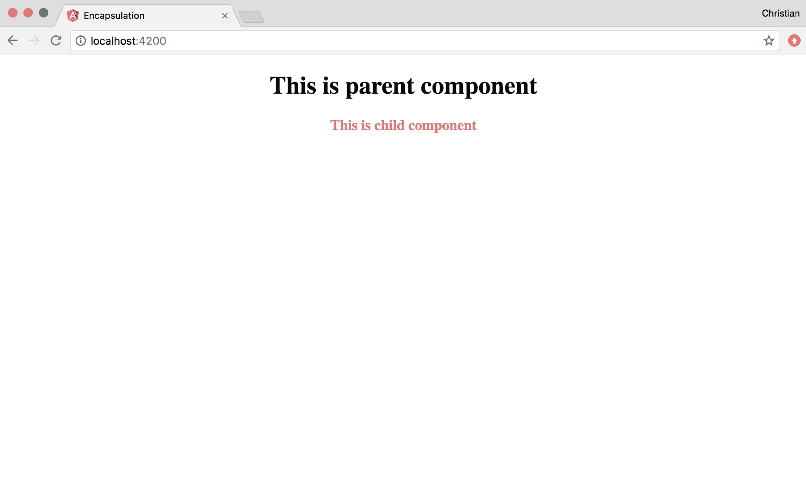
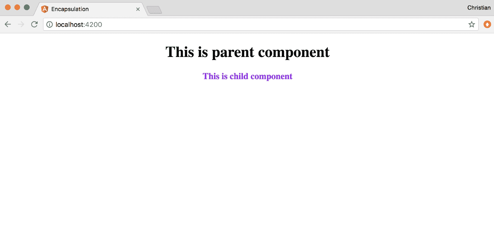
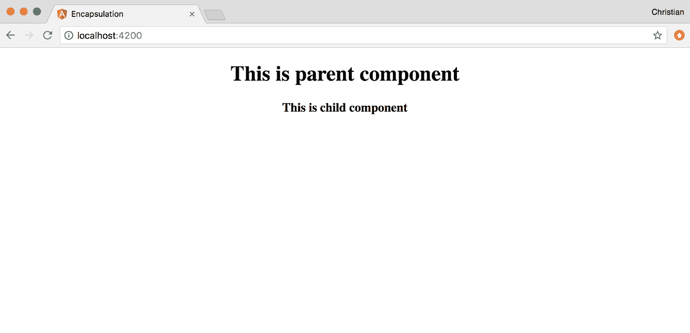
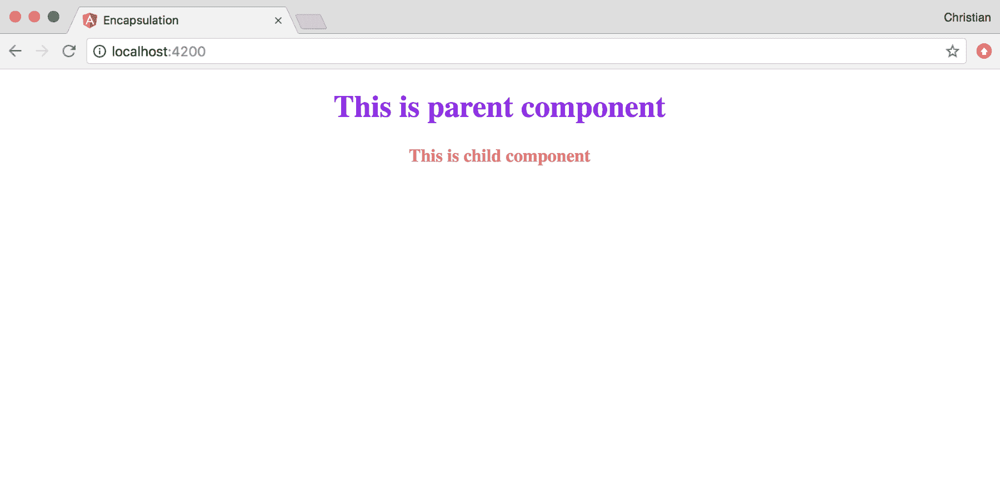

# 第五章：使用 TypeScript 创建高级自定义组件

在上一章中，我们讨论了组件的创建和使用基础知识。这些知识不足以构建健壮的应用程序。我们需要更深入地了解 Angular 令人兴奋的组件，并看看 TypeScript 如何使与组件一起工作变得更容易。

我们将在展示一些实际示例的同时，讨论以下主题：

+   **生命周期钩子**: 这些是 Angular 中的类方法，您可以连接到它们。通过实现 TypeScript 接口来实现。

+   **ElementRef**: 这涉及使用 ElementRef API 在 Angular 中安全地操作和查询 DOM。

+   **视图封装**: 您将学习如何将作用域样式应用于 Angular 组件，以及如何更改默认行为。

# 生命周期钩子

您在类中创建的大多数方法必须由您在某个地方调用，这是编程中的预期模式。这在 Angular 定义的生命周期钩子中并非如此。这些钩子是您为 Angular 在组件/指令的当前状态下内部调用它们而创建的方法。它们在组件或指令的类中创建。

以下钩子在 Angular 组件中可用：

+   `ngOnChanges`: 记住属性如何绑定到组件。这些属性是响应式的，意味着当它们改变时，视图也会更新。当任何绑定到视图的属性发生变化时，将调用此生命周期方法。因此，您可以在更改反映之前操纵发生的事情。

+   `ngOnInit`: 这是最常见的生命周期。在使用默认属性绑定初始化组件后调用。因此，在第一个`ngOnChanges`之后调用。

+   `ngDoCheck`: 通常，响应性（变更检测）由您处理，但在极端情况下，如果不是这样，您需要自己处理。使用`ngDoCheck`来检测并对 Angular 无法或不会自行检测的变化做出反应。

+   `ngAfterContentInit`: 组件内容初始化后调用。

+   `ngAfterContentChecked`: 在对组件内容进行每次检查后调用。

+   `ngAfterViewInit`: 在基于组件模板初始化视图后调用。

+   `ngAfterViewChecked`: 在检查组件视图和组件的子视图后调用。

+   `ngOnDestroy`: 在组件被销毁之前调用。这是一个清理的好地方。

有些生命周期钩子可能并不立即有意义。你不必担心它们，因为只有在极端情况下才会需要很多这样的钩子。

举个例子可以帮助澄清它们的工作原理。让我们探讨最常见的钩子，即`ngOnInit`。

使用 CLI 命令创建一个新的 Angular 项目。打开应用组件的 TypeScript 文件，并更新导入以包括`OnInit`：

```ts
// Code: 5.1
//./src/app/app.component.ts

import { Component, OnInit } from  '@angular/core';
```

`OnInit`是一个接口，任何打算实现`ngOnInit`的类都应该继承它。这在技术上并不是必需的（参见[`angular.io/guide/lifecycle-hooks#interfaces-are-optional-technically`](https://angular.io/guide/lifecycle-hooks#interfaces-are-optional-technically)）。

现在，你可以让`AppComponent`类实现这个接口：

```ts
// Code: 5.1 //./src/app/app.component.ts

@Component({  selector: 'app-root',  templateUrl: './app.component.html',  styleUrls: ['./app.component.css']  })  export class AppComponent implements OnInit {  title: string = 'Items in Bag';  items: Array<string> = [];  loading: boolean = false;  
 ngOnInit () {  this.loading = true;  
 setTimeout(() => {  this.items = [  'Pen',  'Note',  'Mug',  'Charger',  'Passport',  'Keys'  ]  this.loading = false;  }, 3000)  }  }
```

我们试图模拟一种异步行为，其中的值在将来被解析。这种操作最好在应用程序初始化时完成，这就是为什么我们在`ngOnInit`方法中处理这个操作。一旦组件准备就绪，Angular 就会调用这个钩子，它将在三秒后设置项目数组。

我们甚至可以在值到来之前就将其绑定到视图上。当值可用时，Angular 将始终更新视图：

```ts
<!-- Code: 5.1 -->
<!-- ./src/app/app.component.html --> 
<div style="text-align:center">  
 <h1>  {{title}}!!  </h1>  
 <h4 *ngIf="loading">Please wait...</h4>  
</div>  
<ul>  
 <li *ngFor="let item of items">{{item}}</li>  
</ul>
```

在 Angular 模板中迭代列表时，我们使用`*ngFor` **结构指令**，如前面的例子所示。`*ngIf`结构指令类似于`*ngFor`，但用于根据组件上的布尔属性显示 DOM 元素。

像往常一样，用`ng serve`运行应用程序，你将首先看到以下内容：



三秒后，“请稍候...”文本将消失，你将看到你的项目列表：



# DOM 操作

在 Angular 1.x 中，触及 DOM 似乎是神秘的；不是说你不能，但不知何故它会反过来伤害你。这很讽刺，因为作为网页设计师/开发者，我们所做的就是绘制 DOM，而这是不可能的，如果不对其进行操作。

使用 Angular 2+，这变得非常容易。Angular 抽象了 DOM，并为你提供了浅拷贝来操作。然后它负责在不伤害任何人的情况下将其放回。使用 TypeScript 会更有趣，因为你的编辑器可以为你提示大多数 DOM 属性方法。

# ElementRef

实现 DOM 操作的 API 是`ElementRef`。让我们基于[`www.w3schools.com/howto/howto_js_tabs.asp`](https://www.w3schools.com/howto/howto_js_tabs.asp)上的基本演示构建一个使用这个 API 的选项卡组件。

通过使用 CLI 生成命令生成一个新组件：

```ts
ng g component tab
```

将模板作为子级添加到我们的应用组件中，就在`*ngFor`指令之后：

```ts
<ul>   <li *ngFor="let item of items">{{item}}</li>  
</ul>  

<!--Add tab component to app-->
<app-tab></app-tab>
```

然后，用以下内容替换组件的模板：

```ts
<!--./src/app/tab/tab.component.css-->
<div class="tab">  
 <button class="tablink" (click)="openTab($event, 'London')">London</button> <button class="tablink" (click)="openTab($event, 'Paris')">Paris</button> <button class="tablink" (click)="openTab($event, 'Tokyo')">Tokyo</button> </div>  <div id="London" class="tabcontent">  <h3>London</h3>  <p>London is the capital city of England.</p> </div> <div id="Paris" class="tabcontent">   <h3>Paris</h3>   <p>Paris is the capital of France.</p>  </div> <div id="Tokyo" class="tabcontent">   <h3>Tokyo</h3>   <p>Tokyo is the capital of Japan.</p> </div>
```

你应该在浏览器上看到结果，如下面的截图所示：



让我们添加一些样式来创建一个选项卡的外观：

```ts
// based on styles from the base sample

/* ./src/app/tab/tab.component.css */
div.tab {
  overflow: hidden;
  border: 1px solid #ccc;
  background-color: #f1f1f1;
  }  div.tab button {
  background-color: inherit;
  float: left;
  border: none;
  outline: none;
  cursor: pointer;
  padding: 14px 16px;
  transition: 0.3s;
  } div.tab button:hover {
  background-color: #ddd;
  }   div.tab button.active {
  background-color: #ccc;
  }   .tabcontent {   padding: 6px 12px;
  border: 1px solid #ccc;
 border-top: none; }
```

有了样式，你应该看到下面截图中显示的结果：



现在是开始操作 DOM 的时候了。我们首先需要通过 CSS 默认隐藏所有选项卡内容；然后可以在 TypeScript 中激活它们：

```ts
.tabcontent {  
 display: none;   }
```

# 钩入内容初始化

为了确保能够访问 DOM，我们需要钩入`ngAfterContentInit`生命周期方法。在这个方法中，我们可以使用`ElementRef`来查询 DOM 并操作它：

```ts
import { Component, ElementRef, OnInit, AfterContentInit } from '@angular/core';  @Component({
  selector: 'app-tab',
  templateUrl: './tab.component.html',
  styleUrls: ['./tab.component.css']
  })  export class TabComponent implements OnInit, AfterContentInit {  tabContents: Array<HTMLElement>;
 tabLinks: Array<HTMLElement>;  
 constructor(
  private el: ElementRef
  ) { }

  ngOnInit() {}

  ngAfterContentInit() {
 // Grab the DOM
  this.tabContents = this.el.nativeElement.querySelectorAll('.tabcontent');
  this.tabLinks = this.el.nativeElement.querySelectorAll('.tablink');
   }   }  
```

该类实现了`AfterContentInit`和`OnInit`，展示了如何实现多个接口。然后，我们将按钮声明为`HTMLElement`链接的数组。选项卡内容也是如此。

就在构造函数中，我们创建一个名为`el`的`ElementRef`实例，我们可以用它来与 DOM 交互。`ngAfterContentInit`函数在 DOM 内容准备就绪后被调用，这使它成为处理启动时 DOM 操作的理想候选者。因此，我们在那里获取对 DOM 的引用。

我们需要在加载时显示第一个选项卡并使第一个选项卡链接处于活动状态。让我们扩展`ngAfterContentInit`来实现这一点：

```ts
export class TabComponent implements OnInit, AfterContentInit {
  tabContents: Array<HTMLElement>;
  tabLinks: Array<HTMLElement>;
  constructor(
  private el: ElementRef
  ) { }
  ngOnInit() {}
  ngAfterContentInit() {
  this.tabContents = this.el.nativeElement.querySelectorAll('.tabcontent');
  this.tabLinks = this.el.nativeElement.querySelectorAll('.tablink');

 // Activate first tab

 this.tabContents[0].style.display = "block";
 this.tabLinks[0].className = " active";
 }  }  
```

这将显示第一个选项卡，如下面的截图所示：



# 处理 DOM 事件

最后要做的事情是为点击事件添加事件侦听器并开始切换选项卡。在前面的模板中，我们为每个按钮附加了点击事件：

```ts
<button class="tablink" (click)="open($event, 'London')">London</button> <button class="tablink" (click)="open($event, 'Paris')">Paris</button> <button class="tablink" (click)="open($event, 'Tokyo')">Tokyo</button>
```

`openTab`方法是事件处理程序。让我们实现它：

```ts
export class TabComponent implements OnInit, AfterContentInit {
  tabContents: Array<HTMLElement>;
  tabLinks: Array<HTMLElement>;
  constructor(
  private el: ElementRef
  ) { }

 // ...

 open(evt, cityName) {
  for (let i = 0; i < this.tabContents.length; i++) {
  this.tabContents[i].style.display = "none";
  }
  for (let i = 0; i < this.tabLinks.length; i++) {
  this.tabLinks[i].className = this.tabLinks[i].className.replace(" active", "");
  }
  this.el.nativeElement.querySelector(`#${cityName}`).style.display = "block"; 
 evt.currentTarget.className += " active"; 
 } }  
```

当调用该方法时，我们遍历所有选项卡并隐藏它们。我们还遍历按钮并通过用空字符串替换活动类来禁用它们。然后，我们可以显示我们想要打开的选项卡并激活被点击的按钮。

现在当你点击选项卡按钮时，每个选项卡内容都会显示出来：



有不同的方法来解决这个问题，其中一些方法更加高级。我们刚刚展示的例子故意执行 DOM 查询，以向您展示在 Angular 中进行 DOM 操作是多么可能和简单。

# 视图封装

组件可以配置为以不同的方式应用样式。这个概念被称为封装，这就是我们现在要讨论的内容。

使用 CLI 创建另一个项目，并使用以下命令添加一个额外的组件：

```ts
ng g component child
```

然后，通过应用组件将这个新组件添加到视图中：

```ts
// Code 5.2
<!-- ./src/app/app.component.html -->

<div style="text-align:center">   <h1>  This is parent component  </h1>   <app-child></app-child>  </div>  
```

子组件的模板就是这么简单：

```ts
// Code 5.2
<!-- ./src/app/child/child.component.html -->

<h3>This is child component  </h3>  
```

这只是我们需要了解视图封装策略的最低设置。让我们来探索一下。

# 模拟

这是默认策略。通过 HTML 全局应用的任何样式（而不是父组件）以及应用到组件的所有样式都将被反映。在我们的例子中，如果我们针对`h3`并在`style.css`、`app.component.css`和`child.component.css`中应用样式，只有`style.css`和`child.component.css`会被反映。

以下 CSS 是子组件的：

```ts
h3 {  color: palevioletred  }
```

运行上述代码后，子组件视图上的结果如下：



在全局样式和组件本身上应用相同样式到相同元素的情况下，组件样式会覆盖全局样式。例如，假设`style.css`文件如下：

```ts
h3 {
 color: palevioletred }
```

现在考虑`child.component.css`文件如下：

```ts
h3 {
 color: blueviolet }
```

`h3`的颜色将是`blueviolet`，如下截图所示：



您可以在组件装饰器中设置这个，尽管这并不是必需的，因为`Emulated`是默认值：

```ts
import { Component, OnInit, ViewEncapsulation } from '@angular/core'; @Component({
 selector: 'app-child',
</span>  templateUrl: './child.component.html',
  styleUrls: ['./child.component.css'],
 // Encapsulation: Emulated
 encapsulation: ViewEncapsulation.Emulated })  export class ChildComponent implements OnInit {   constructor() { }
   ngOnInit() { } } 
```

# 本地

这种策略类似于模拟，但它禁止全局样式进入组件。将全局样式中的样式保持不变，将封装设置为本地：

```ts
@Component({
  selector: 'app-child',
  templateUrl: './child.component.html',
  styleUrls: ['./child.component.css'],
 // Encapsulation: Native
 encapsulation: ViewEncapsulation.Native })
```

即使全局样式将`h3`的颜色设置为`pinkvioletred`，文本颜色仍然是黑色，因为它无法渗透模板：



# 无

这是最自由的策略。无论样式设置在哪里--子组件还是父组件--样式都会泄漏到其他组件中：

```ts
@Component({
  selector: 'app-child',
  templateUrl: './child.component.html',
  styleUrls: ['./child.component.css'],
 // Encapsulation: Native
 encapsulation: ViewEncapsulation.None })
```

通过这个设置，您可以通过子组件的样式来为父标签中的`h1`标签设置样式：

```ts
// child component style
h1 {
 color: blueviolet }
```

这在视图中反映出来，如下图所示：



# 摘要

希望讨论的高级主题并不复杂或难以理解。你学会了如何实现生命周期钩子，控制组件范围样式的行为，并在渲染后操作 DOM 内容。

如果你只从这一章中学到了一件事，那就是如何使用 TypeScript 实现生命周期接口，并使用 TypeScript 装饰器配置组件。在下一章中，你将学习组件通信以及组件如何通过属性、事件、视图子元素和内容子元素相互交互。
