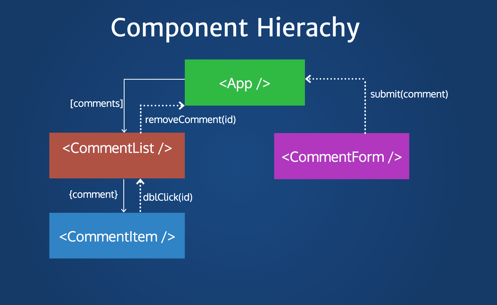
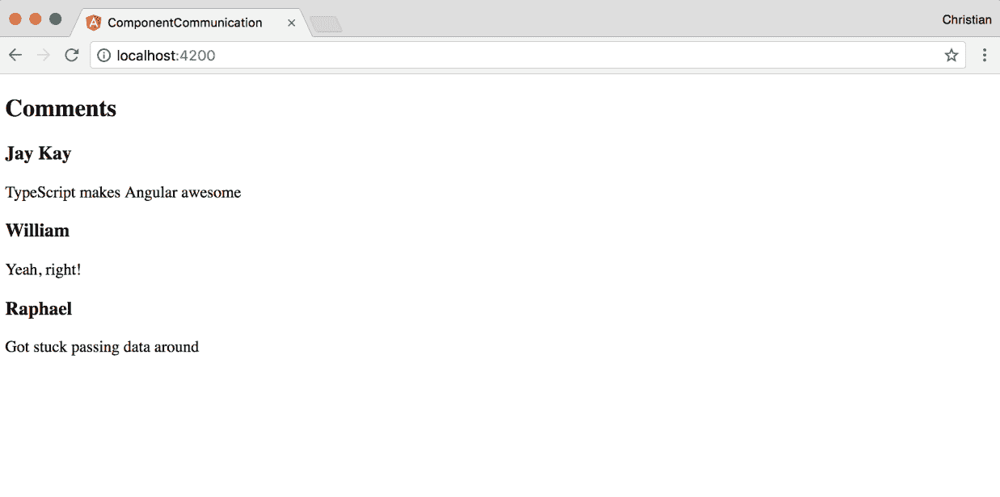
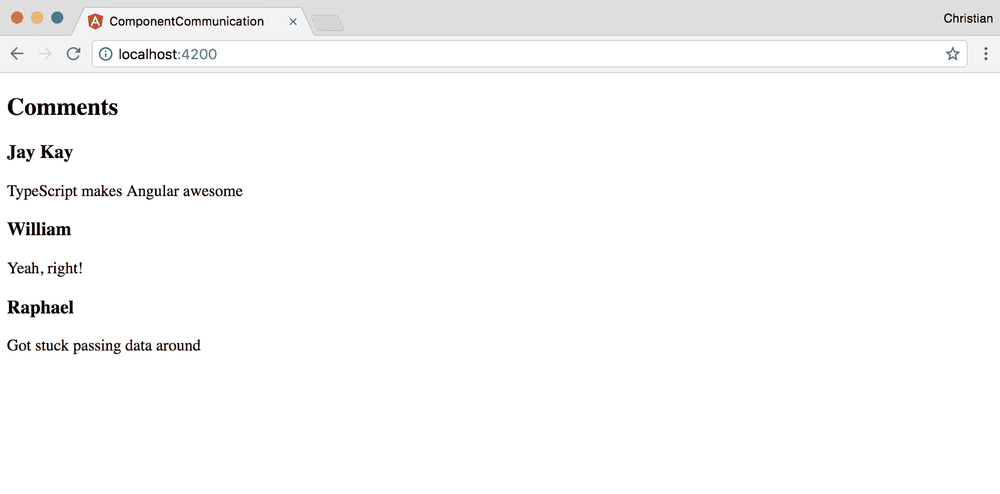
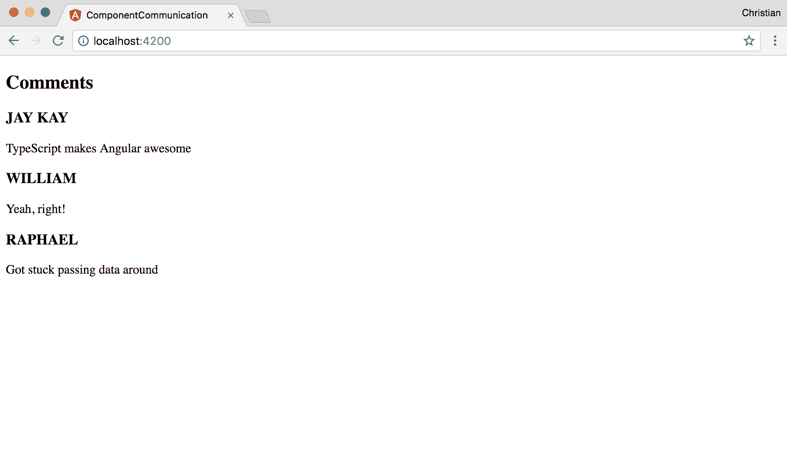
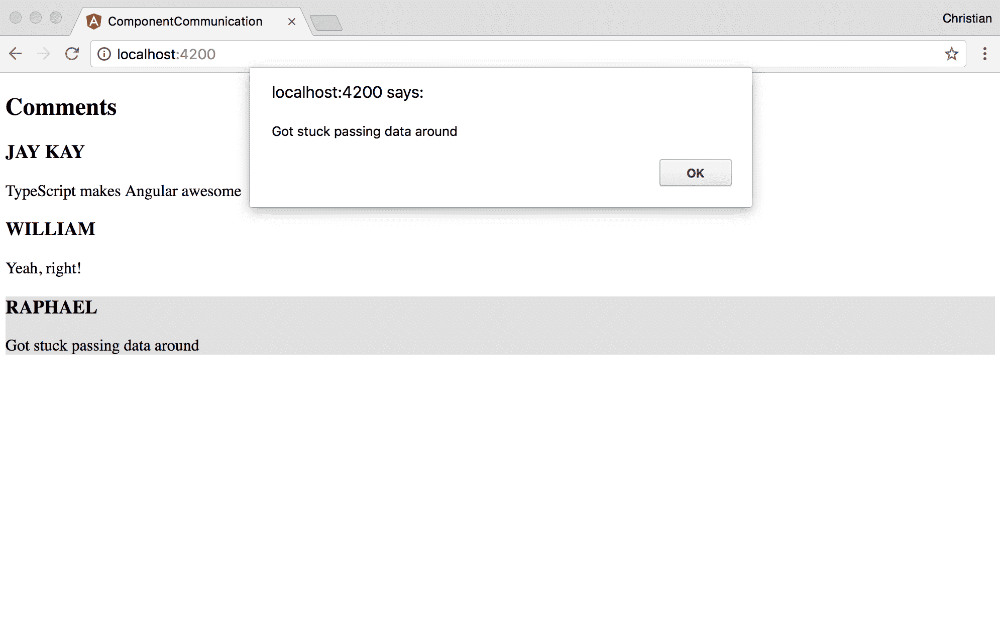
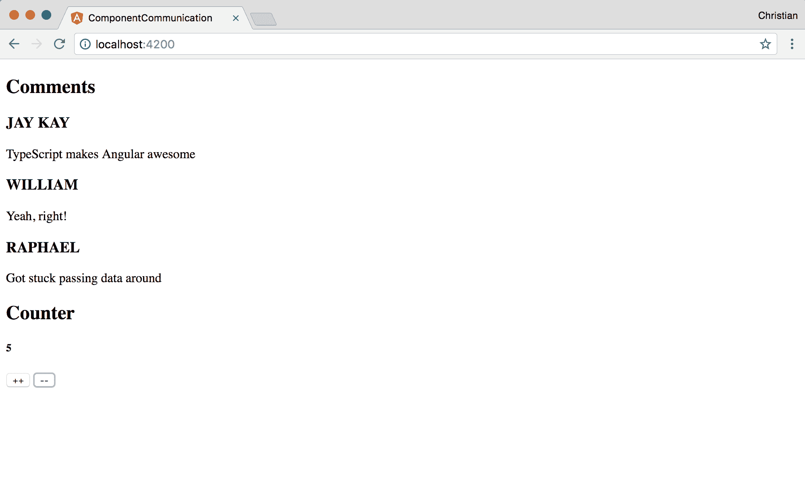

# 第六章：使用 TypeScript 进行组件组合

使用 TypeScript 编写的组件在保持简短和简单时效果最佳。然而，一个简短和简单的组件很难构建一个完整的应用程序。如何组合执行特定任务的组件并将它们组合在一起以制作可用的应用程序？这就是本章的内容。我们将讨论以下主题：

+   组件层次结构

+   不同级别组件之间的通信

我们还将看到一些实际示例，说明组件是如何组合的，以及这些组合的组件如何相互通信。

# 组件的可组合性

可组合性是组件最突出的特点和卖点。事实上，这就是使组件成为组件的原因。不仅在网络上，而且每当一个实体被称为组件时，它都有与其他组件组合的倾向。

虽然一些组件可以独立运行，但大多数隐式或显式地依赖于其他独立组件来完成特定任务。TypeScript 和模板极大地简化了 Angular 中的组合，使其能够以一种无缝和易于维护的方式将应用程序的各个部分组合在一起。

组合是分层发生的；因此，大多数组件关系要么是父子关系，要么是子父关系。还要记住，如果存在这样的父子关系，那么根据架构，一些组件可能是其他组件的兄弟。

# 分层组合

一个组合的组件与另一个组件有父子关系，可以是父组件或子组件。存在嵌套链的倾向；因此，没有什么能阻止子组件有一个祖父组件或父组件有一个孙子组件。

以下截图更好地说明了这一点：



在这里，入口 `App` 组件有两个子组件：`CommentList` 和 `CommentForm`。`CommentList` 也有一个子组件，`CommentItem`。可以说 `CommentItem` 是 `App` 的孙子。也可以说 `CommentList` 和 `CommentForm` 是兄弟。

粗箭头显示了数据如何从父组件流向子组件，而虚线箭头显示了数据如何作为事件从子组件推送到父组件。这种数据向下流动和向上移动的说明引导我们进入下一个讨论主题：组件通信。

# 组件通信

根据我们之前看到的图表，让我们看一些实际示例。开始的推荐位置是从父级到子级的数据流。

# 父子流程

立即开始并使用 Angular CLI 创建一个新的 Angular 项目。完成后，使用以下内容更新`AppComponent`：

```ts
import { Component } from '@angular/core';    @Component({  selector: 'app-root',  templateUrl: './app.component.html',  styleUrls: ['./app.component.css']  })  export class AppComponent {  title = 'app';  comments = [  {  author: 'Jay Kay',  content: 'TypeScript makes Angular awesome'  },  {  author: 'William',  content: 'Yeah, right!'  },  {  author: 'Raphael',  content: 'Got stuck passing data around'  }  ]  }  
```

关键区别在于我添加了一个评论数组。这些评论是我们打算传递给子组件的。

让我们使用 Angular CLI 生成命令创建`CommentListComponent`：

```ts
ng g component comment-list
```

创建的组件旨在从父组件`AppComponent`接收评论列表。当它接收到这个组件时，它可以对它们进行迭代并在屏幕上打印它们：

```ts
import { Component, OnInit, Input } from '@angular/core';    @Component({  selector: 'app-comment-list',  templateUrl: './comment-list.component.html',  styleUrls: ['./comment-list.component.css']  })  export class CommentListComponent implements OnInit {  // Received via Imputs @Input() comments;   constructor() { }   
 ngOnInit() {}    }   
```

`Input` TypeScript 装饰器用于指定一个类属性将由父组件设置。因此，我们不需要在`CommentListComponent.comments`上设置任何值，但是我们需要等待直到通过`AppComponent`传递一个值给它。请记住`AppComponent.comments`也存在，因此我们可以使用属性绑定将`AppComponent.comments`传递给`CommentListComponent.comments`在`app.component.html`中：

```ts
<div>  <h2>Comments</h2>  <app-comment-list [comments]="comments"></app-comment-list>  </div>  
```

`comments`数组是传递给`[comments]`属性的值。这个属性是我们在`CommentListComponent`组件中创建和装饰的。

现在您在父组件（`AppComponent`）上有一个评论数组；您已经通过属性绑定将此组件传递给子组件（`CommentListComponent`），并且正在使用`Input`装饰器接收评论列表。您需要做的下一件事是在`comment-list.component.html`上显示接收到的评论：

```ts
<div class="comment-box" *ngFor="let comment of comments">  <h3>{{comment.author}}</h3>  <p>{{comment.content}}</p>  </div>  
```

`*ngFor`指令用于遍历评论，获取每条评论，并在我们的视图上显示评论。

这就是输出的样子：



您可以再深入一层，创建一个评论项组件，它只需要一个评论并显示它。创建另一个组件：

```ts
ng g component comment-item
```

添加一个装饰的评论属性，它将从评论列表中接收评论项：

```ts
import { Component, OnInit, Input } from '@angular/core';    @Component({  selector: 'app-comment-item',  templateUrl: './comment-item.component.html',  styleUrls: ['./comment-item.component.css']  })  export class CommentItemComponent implements OnInit {  // Decorated comment 
 @Input() comment;   constructor() { }    ngOnInit() {}    }   
```

通过`评论列表`父组件将评论传递下去：

```ts
<app-comment-item 
 *ngFor="let comment of comments" [comment]="comment">  </app-comment-item>  
```

`comment`模板变量不必存在于组件类中。它是从迭代器中获取的。

然后，您可以简单地在`comment-item.component.html`模板上渲染评论项：

```ts
<h3>{{comment.author}}</h3>  <p>{{comment.content}}</p>  
```

添加另一个子组件说明了嵌套。`App | 评论列表 | 评论项`是流程。`App`是`评论列表`的父级，也是`评论项`的祖父级。`评论列表`是`评论项`的父级。

转到浏览器，看到，虽然实际上没有任何变化，但我们的代码结构更好了：



# 拦截属性更改

有时，您可能希望对从父组件流入子组件的数据进行一些调整。您可以使用 getter 和 setter 拦截数据并在将其设置到视图之前对其进行操作。让我们通过将作者名称大写化来演示这一点：

```ts
import { Component, OnInit, Input } from '@angular/core';    @Component({  selector: 'app-comment-item',  templateUrl: './comment-item.component.html',  styleUrls: ['./comment-item.component.css']  })  export class CommentItemComponent implements OnInit {   
 private _comment;  constructor() { }    ngOnInit() {}    @Input()  set comment(comment) {  this._comment = Object.assign(comment, {
 author: comment.author.toUpperCase()
 });  }    get comment() {  return this._comment  }    }   
```

装饰器不再设置在值属性上，而是设置在 setter 属性上。该属性接收来自评论列表（父组件）的评论。然后，它用作者姓名的大写版本覆盖作者属性。getter 只是返回评论，所以您可以从视图中访问它。

在浏览器中的效果如下：



# 子-父流程

在这个流程中，数据不是向下传递，而是需要沿着链条向上流动。大多数情况下，数据是根据用户在子组件上触发的事件而向上流动的，我们试图通知父组件有关该事件。因此，Angular 允许您在父组件上监听子事件并对事件做出反应。这些事件可以以数据作为有效载荷进行描述。

让我们首先通过评论列表组件在每个评论项上注册双击事件：

```ts
<app-comment-item 
 *ngFor="let comment of comments" 
 [comment]="comment" 
 (dblclick)="showComment(comment)">  </app-comment-item>  
```

然后，您需要在组件类上添加`showComment`处理程序来处理此事件：

```ts
import { 
 Component, 
 OnInit, 
 Input, 
 EventEmitter, 
 Output } from '@angular/core';    @Component({  selector: 'app-comment-list',  templateUrl: './comment-list.component.html',  styleUrls: ['./comment-list.component.css']  })  export class CommentListComponent implements OnInit {    @Input() comments;  @Output() onShowComment = new EventEmitter();    constructor() { }   ngOnInit() {}    showComment(comment) {  this.onShowComment.emit(comment);  }    }   
```

处理程序使用`onShowComment`，它被装饰为`Output`装饰器的输出属性，以发出`EventEmitter`类型的事件。这个发出的事件是父组件需要监听的。注意评论是如何传递给`emit`方法的；这显示了我们如何可以从子组件向父组件传递数据。

接下来，我们监听父组件（`App`）以便发生这个事件：

```ts
<div>  <h2>Comments</h2>  <app-comment-list 
 [comments]="comments" 
 (onShowComment)="onShowComment($event)">
 </app-comment-list>  </div>  
```

请注意，事件绑定注释`()`用于事件，在这种情况下是`onShowComment`。绑定指的是`EventEmitter`，而其值指的是尚未创建的处理程序方法。处理程序方法被调用，我们将来自子组件的值数据作为`$event`传递。

以下是处理程序的实现：

```ts
import { Component } from '@angular/core';    @Component({  selector: 'app-root',  templateUrl: './app.component.html',  styleUrls: ['./app.component.css']  })  export class AppComponent {  title = 'app';  comments = [  {  author: 'Jay Kay',  content: 'TypeScript makes Angular awesome'  },  // ...  ]    onShowComment(comment) {  alert(comment.content);  }  }   
```

该方法只是像下面的截图中所示警报评论：



# 通过父组件访问子组件的属性和方法

除了数据流向和事件向上推送之外，还有其他的通信策略。我们可以使用模板变量从父组件访问子成员。让我们创建一个计数器组件作为示例：

```ts
ng g component counter
```

现在添加一个计数器变量并将其初始化为零：

```ts
//counter.component.html
<h5>  {{counter}}  </h5> //counter.component.ts import { Component, OnInit } from '@angular/core';    @Component({  selector: 'app-counter',  templateUrl: './counter.component.html',  styleUrls: ['./counter.component.css']  })  export class CounterComponent implements OnInit {   
 counter: number = 0;    increment() {  this.counter++  }    decrement() {  this.counter--  }    }   
```

此外，还有两种方法只增加或减少计数器。请注意，没有任何东西调用这些方法；没有按钮附带事件来增加或减少。我们想要做的是从父组件访问这些方法。

为此，在模板中添加组件并使用模板变量：

```ts
<div>  <h2>Comments</h2>  <app-comment-list [comments]="comments" (onShowComment)="onShowComment($event)"></app-comment-list>  ...

  <h2>Counter</h2>  <app-counter #counter></app-counter>    </div>  
```

`#counter`是一个在模板中任何地方都可以访问的变量。因此，您可以将其用作访问计数器组件的方法和属性的对象：

```ts
<div>
  <h2>Comments</h2>
  <app-comment-list [comments]="comments" (onShowComment)="onShowComment($event)"></app-comment-list>

 ... <h2>Counter</h2>
  <app-counter #counter></app-counter>
  <button (click)="counter.increment()">++</button>
  <button (click)="counter.decrement()">--</button>
</div>
```

这显示了一个带有按钮的按钮计数器，我们可以点击按钮来增加或减少计数器：



# 使用 ViewChild 访问子成员

如果模板变量感觉不自然，您可以使用`ViewChild`来实现相同的行为。这允许您将子组件作为类上的变量而不是模板上的变量来访问：

```ts
//app.component.ts
import { Component, ViewChild } from '@angular/core';  import { CounterComponent } from './counter/counter.component'    @Component({  selector: 'app-root',  templateUrl: './app.component.html',  styleUrls: ['./app.component.css']  })  export class AppComponent {
  @ViewChild(CounterComponent)  counterComponent: CounterComponent   comments = [  {</span&gt;  author: 'Jay Kay',  content: 'TypeScript makes Angular awesome'  },  // ...  ]    onShowComment(comment) {  alert(comment.content);  }    } 
```

我们导入计数器组件，并使用`ViewChild`将其注册为此组件的子组件。然后，我们创建一个`CounterComponent`类型的`counterComponent`变量。然后我们可以在模板中使用这个变量：

```ts
<app-counter></app-counter>  <button (click)="counterComponent.increment()">++</button>  <button (click)="counterComponent.decrement()">--</button>  
```

# 总结

现在，您可以通过编写小型、可维护的组件，并使用组合使它们相互交互，从而将组件作为构建块来使用。在本章中，您学习了组件体系结构中层次继承的含义，数据如何在层次树中上下流动，以及组件如何相互交互。

在下一章中，我们将探讨一种更加集中的交互策略，即使用服务。这将帮助我们创建组件将共享的逻辑，从而保持我们的代码库非常干净（不重复自己）。
