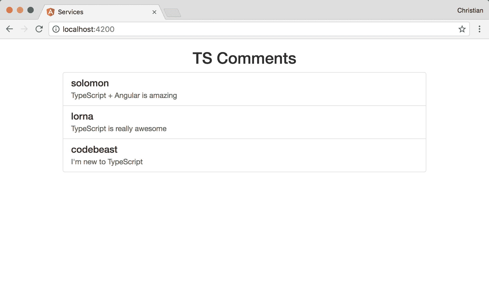
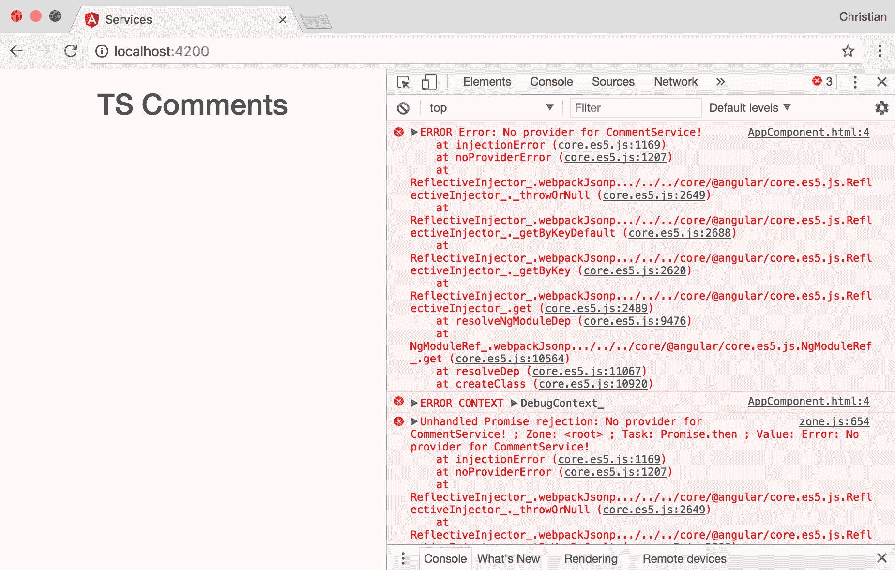
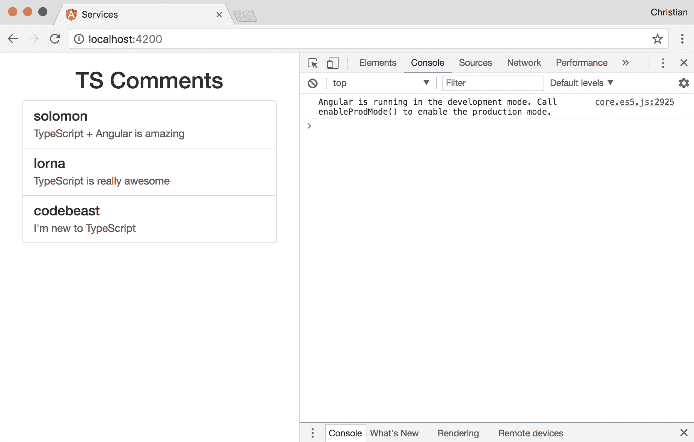
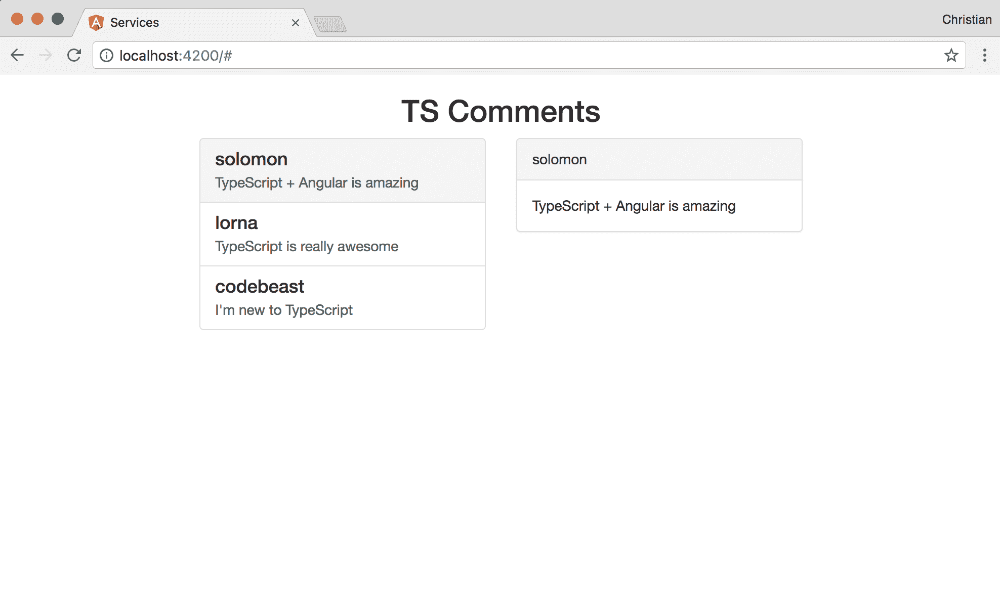
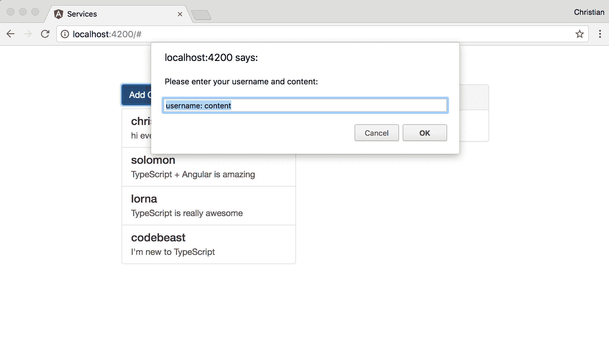

# 第七章：使用类型化服务分离关注点

本章在前一章的基础上构建，展示了更多关于应用程序构建模块内部通信的技术。在本章中，您将学习以下主题：

+   服务和依赖注入（DI）概念

+   使用服务进行组件通信

+   使用服务编写数据逻辑

要更好地理解服务，您需要至少了解依赖注入的基本概念。

# 依赖注入

在 TypeScript 中编写 Angular 要求您的构建模块（组件、指令、服务等）都是以类的形式编写的。它们只是构建模块，这意味着它们在成为功能模块之前需要相互交织，从而形成一个完整的应用程序。

这种交织的过程可能会非常令人望而生畏。因此，让我们首先了解问题。例如，考虑以下 TypeScript 类：

```ts
export class Developer {
 private skills: Array<Skill>;
 private bio: Person;
 constructor() {
 this.bio = new Person('Sarah', 'Doe', 24, 'female');
 this.skills = [
 new Skill('css'), 
 new Skill('TypeScript'), 
 new Skill('Webpack')
 ];
 }
}
```

`Person`和`Skill`类的实现就像下面这样简单：

```ts
// Person Class
export class Person {
 private fName: string;
 private lName: string;
 private age: number;
 private gender: string;
 constructor(
 fName: string, 
 lName: string, 
 age: number, 
 gender: string, 
 ) {
 this.fName = fName;
 this.lName = lName;
 this.age = age;
 this.gender = gender;
 }
}

// Skill Class
export class Skill {
 private type: string;
 constructor(
 type: string
 ) {
 this.type = type;
 }
}
```

前面的示例是非常实用和有效的代码，直到您开始使用这个类创建更多类型的开发人员。由于所有实现细节都与一个类绑定，因此实际上无法创建另一种类型的开发人员；因此，这个过程并不灵活。在可以用于创建更多类型的开发人员之前，我们需要使这个类更加通用。

让我们尝试改进`Developer`类，使其从构造函数中接收创建类所需的所有值，而不是在类中设置它：

```ts
export class Developer {
 private skills: Array<Skills>;
 private bio: Person;
 constructor(
 fName: string, 
 lName: string, 
 age: number, 
 gender: string, 
 skills: Array<string>
 ) {
 this.bio = new Person(fName, lName, age, gender);
 this.skills = skills.map(skill => new Skill(skill));
 }
}
```

这么少的代码就有了这么多的改进！我们现在使用构造函数使代码更加灵活。通过这个更新，您可以使用`Developer`类来创建所需数量的开发人员类型。

尽管这个解决方案看起来像是能拯救一天，但系统中仍然存在紧密耦合的问题。当`Person`和`Skill`类中的构造函数发生变化时会发生什么？这意味着您将不得不回来更新`Developer`类中对此构造函数的调用。以下是`Skill`中这种变化的一个例子：

```ts
// Skill Class
export class Skill {
 private type: string;
 private yearsOfExperience: number;
 constructor(
 type: string,
 yearsOfExperience: number
 ) {
 this.type = type;
 this.yearsOfExperience = yearsOfExperience
 }
}
```

我们为`yearsOfExperience`类添加了另一个字段，它是一个数字类型，表示开发人员练习所声称技能的时间有多长。为了使`Developer`中实际工作，我们还必须更新`Developer`类：

```ts
export class Developer {
 public skills: Array<Skill>;
 private bio: Person;
 constructor(
 fName: string, 
 lName: string, 
 age: number, 
 gender: string, 
 skils: Array<any>
 ) {
 this.bio = new Person(fName, lName, age, gender);
 this.slills = skills.map(skill => 
 new Skill(skill.type, skill.yearsOfExperience));
 }
}
```

每当依赖项发生变化时更新这个类是我们努力避免的。一个常见的做法是将依赖项的构造函数提升到类本身的构造函数中：

```ts
export class Developer {
 public skills: <Skill>;
 private person: Person;
 constructor(
 skill: Skill,
 person: Person
 ) {}
}
```

这样，`Developer`就不太了解`Skill`和`Person`的实现细节。因此，如果它们在内部发生变化，`Developer`不会在意；它仍然保持原样。

事实上，TypeScript 提供了一个高效的简写：

```ts
export class Developer {
 constructor(
 public skills: <Skill>,
 private person: Person
 ) {}
}
```

这个简写将隐式声明属性，并通过构造函数将它们分配为依赖项。

这还不是全部；提升这些依赖项还引入了另一个挑战。我们如何在应用程序中管理所有依赖项，而不失去它们应该在哪里的轨迹？这就是依赖注入的作用。这不是 Angular 的事情，而是在 Angular 中实现的一种流行模式。

让我们开始在 Angular 应用程序中看 DI 的实际应用。

# 组件中的数据

为了更好地理解服务和 DI 的重要性，让我们创建一个简单的应用程序，其中包含一个显示用户评论列表的组件。创建应用程序后，您可以运行以下命令来生成所需的组件：

```ts
ng g component comment-list
```

使用以下片段更新组件的代码：

```ts
import { Component, OnInit } from '@angular/core';

@Component({
 selector: 'app-comment-list',
 templateUrl: './comment-list.component.html',
 styleUrls: ['./comment-list.component.css']
})
export class CommentListComponent implements OnInit {

 comments: Array<any>
 constructor() { }

 ngOnInit() {
 this.comments = [
 {
 author: 'solomon',
 content: `TypeScript + Angular is amazing`
 },
 {
 author: 'lorna',
 content: `TypeScript is really awesome`
 },
 {
 author: 'codebeast',
 content: `I'm new to TypeScript`
 },
 ];
 }

}
```

该组件有一个`comments`数组，在组件通过`ngOnInit`生命周期初始化后，将使用硬编码的数据填充。现在我们需要遍历数组列表并在 DOM 上打印：

```ts
<div class="list-group">
 <a href="#" class="list-group-item" *ngFor="let comment of comments">
 <h4 class="list-group-item-heading">{{comment.author}}</h4>
 <p class="list-group-item-text">{{comment.content}}</p>
 </a>
</div>
```

您需要在入口（应用）组件中包含该组件才能显示出来：

```ts
<div class="container">
 <h2 class="text-center">TS Comments</h2>
 <div class="col-md-6 col-md-offset-3">
 <app-comment-list></app-comment-list>
 </div>
</div>
```

您的应用程序应该如下所示（记得包含 Bootstrap，就像在第二章中看到的那样，*使用 TypeScript 入门*）：



这个例子是有效的，但魔鬼在细节中。当另一个组件需要评论列表或列表的一部分时，我们最终会重新创建评论。这就是在组件中拥有数据的问题所在。

# 数据类服务

为了重用和可维护性，我们需要将组件中的逻辑关注点抽象出来，让组件只作为一个呈现层。这是 TypeScript 在 Angular 中发挥作用的用例之一。

您首先需要使用以下命令创建一个服务：

```ts
ng g service comment
```

这将创建您的服务类`./src/app/comment.service.ts`，其中包含一个框架内容。使用以下内容更新内容：

```ts
import { Injectable } from '@angular/core';

@Injectable()
export class CommentService {
 private comments: Array<any> = [
 {
 author: 'solomon',
 content: `TypeScript + Angular is amazing`
 },
 {
 author: 'lorna',
 content: `TypeScript is really awesome`
 },
 {
 author: 'codebeast',
 content: `I'm new to TypeScript`
 }
 ];
 constructor() {}

 getComments() {
 return this.comments;
 }
}
```

现在这个类会执行我们的组件应该对数据执行的操作，并且使用`getComments`方法获取数据，该方法简单地返回一个评论数组。`CommentService`类也被装饰了；这不是必需的，除非类有待解决的依赖关系。尽管如此，良好的实践要求我们始终使用`Injectable`进行装饰，以知道一个类是一个服务。

回到我们的列表组件，我们只需导入类，从构造函数中解析依赖项以创建服务类的实例，然后用`getComments`的返回值填充属性：

```ts
import { Component, OnInit } from '@angular/core';
import { CommentService } from '../comment.service';

@Component({
 selector: 'app-comment-list',
 templateUrl: './comment-list.component.html',
 styleUrls: ['./comment-list.component.css']
})
export class CommentListComponent implements OnInit {
 private comments: Array<any>;
 constructor(
 private commentService: CommentService
 ) { }

 ngOnInit() {
 this.comments = this.commentService.getComments();
 }

}
```

让我们尝试在浏览器中运行应用程序，看看当前的更改是否仍然按预期工作：



该死，不行！它刚刚爆炸了。出了什么问题？错误消息显示没有为 CommentService 提供程序！

请记住，当我们使用`ng`CLI 命令脚手架组件时，CLI 不仅会创建一个组件，还会将其添加到`ngModule`装饰器的声明数组中：

```ts
// ./src/app/app.module.ts
declarations: [
 AppComponent,
 // New scaffolded component here
 CommentListComponent
 ],
```

模块需要知道哪些组件和服务属于它们的成员。这就是为什么组件会自动添加给你的原因。但是对于服务来说情况并不相同，因为当你通过 CLI 工具创建服务类时，CLI 不会自动更新模块（它会在脚手架期间警告你）。我们需要通过`providers`数组手动添加服务：

```ts
import { CommentService } from './comment.service';
//...

@NgModule({
 //...
 providers: [
 CommentService
 ],
})
export class AppModule { }
```

现在再次运行应用程序，看看我们的服务现在如何驱动应用程序，控制台中不再有错误：



如果需要操作数据，则必须在服务中进行，而不是在组件中进行。假设您想通过双击列表中的每个项目来删除评论，那么在组件中接收事件是可以的，但实际的删除操作应该由服务处理。

首先为列表项添加事件监听器：

```ts
<a href="#" class="list-group-item" (dblclick)="removeComment(comment)" *ngFor="let comment of comments">
 <h4 class="list-group-item-heading">{{comment.author}}</h4>
 <p class="list-group-item-text">{{comment.content}}</p>
 </a>
```

`dblclick`事件是通过双击项目触发的。当这种情况发生时，我们调用`removeComment`方法，同时传递我们想要从项目中删除的评论。

这是组件中`removeComment`的样子：

```ts
removeComment(comment) {
 this.comments = this.commentService.removeComment(comment);
}
```

正如你所看到的，它除了调用服务上的一个方法之外，什么也不做，该方法也被称为`removeComment`。这个方法实际上负责从评论数组中删除项目：

```ts
// Comment service
removeComment(removableComment) {
 // find the index of the comment
 const index = this.comments.findIndex(
 comment => comment.author === removableComment.author
 );
 // remove the comment from the array
 this.comments.splice(index, 1);
 // return the new array
 return this.comments;
 }
```

# 组件与服务的交互

这是服务的一个非常方便的用例。在第六章中，*使用 TypeScript 进行组件组合*，我们讨论了组件如何相互交互，并展示了不同的方法。其中一种方法被遗漏了--使用服务作为不同组件的事件中心/通信平台。

再假设，当列表中的项目被点击时，我们使用评论列表组件的兄弟组件来显示所选评论的详细视图。首先，我们需要创建这个组件：

```ts
ng g component comment-detail
```

然后，您可以更新`app.component.html`文件以显示添加的组件：

```ts
<div class="container">
 <h2 class="text-center">TS Comments</h2>
 <div class="col-md-4 col-md-offset-2">
 <app-comment-list></app-comment-list>
 </div>
 <div class="col-md-4">
 <!-- Comment detail component -->
 <app-comment-detail></app-comment-detail>
 </div>
</div>

```

现在，我们需要定义我们的组件做什么，因为它现在是空的。但在此之前，让我们更新评论服务，使其也作为列表组件和兄弟详细组件之间的中心：

```ts
import { Injectable } from '@angular/core';
import { Subject } from 'rxjs/Subject';

@Injectable()
export class CommentService {
 private commentSelectedSource = new Subject<any>();
 public commentSelected$ = this.commentSelectedSource.asObservable();

 private comments: Array<any> = [
 // ...
 ];

 // ...

 showComment(comment) {
 this.commentSelectedSource.next(comment);
 }
}
```

现在，服务使用 Rx 主题来创建一个流和一个监听器，通过它传递和获取所选评论。`commentSelectedSource`对象负责在点击评论时向流中添加评论。`commetSelected$`对象是一个我们可以订阅并在点击此评论时执行操作的可观察对象。

现在，立即返回到您的组件，并添加一个点击事件来选择评论项：

```ts
<div class="list-group">
 <a href="#" class="list-group-item" 
 (dblclick)="removeComment(comment)" 
 *ngFor="let comment of comments"
 (click)="showComment(comment)"
 >
 <h4 class="list-group-item-heading">{{comment.author}}</h4>
 <p class="list-group-item-text">{{comment.content}}</p>
 </a>
</div>
```

点击事件触发组件上的`showComment`方法，然后调用服务上的`showComment`：

```ts
showComment(comment) {
 this.commentService.showComment(comment);
}
```

我们仍然需要更新评论详细组件，以便订阅我们在类中创建的可观察对象：

```ts
import { Component, OnInit } from '@angular/core';
import { CommentService } from '../comment.service';

@Component({
 selector: 'app-comment-detail',
 templateUrl: './comment-detail.component.html',
 styleUrls: ['./comment-detail.component.css']
})
export class CommentDetailComponent implements OnInit {

 comment: any = {
 author: '',
 content: ''
 };
 constructor(
 private commentService: CommentService
 ) { }

 ngOnInit() {
 this.commentService.commentSelected$.subscribe(comment => {
 this.comment = comment;
 })
 }

}
```

通过`ngOnInit`生命周期钩子，我们能够在组件准备就绪后创建对可观察对象的订阅。有一个评论属性将绑定到视图，这个属性通过订阅在每次点击评论项时更新。以下是显示所选评论的组件的模板：

```ts
<div class="panel panel-default" *ngIf="comment.author">
 <div class="panel-heading">{{comment.author}}</div>
 <div class="panel-body">
 {{comment.content}}
 </div>
</div>
```

您可以重新启动应用程序并尝试选择评论。您应该看到以下行为：



# 服务作为实用工具

除了管理状态和组件交互之外，服务还以处理实用操作而闻名。假设我们想要在评论应用中开始收集新评论。我们对表单还不太了解，所以我们可以使用浏览器的提示框。我们期望用户通过提示框中的同一文本框传递用户名和内容，如下所示：

```ts
<username>: <comment content>
```

因此，我们需要一个实用方法来从文本框中提取这些部分，形成一个具有作者和内容属性的评论对象。让我们从评论列表组件中收集信息开始：

```ts
showPrompt() {
 const commentString = window.prompt('Please enter your username and content: ', 'username: content');
 const parsedComment = this.commentService.parseComment(commentString);
 this.commentService.addComment(parsedComment);
 }
```

`showPrompt()`方法用于收集用户输入，并将输入传递给服务中的`parseComment`方法。这个方法是一个实用方法的例子，我们很快会实现它。我们还将实现`addComment`方法，该方法将使用解析后的评论来更新评论列表。接下来，在视图中添加一个按钮，并添加一个点击事件监听器来触发`showPrompt`：

```ts
<button class="btn btn-primary" 
 (click)="showPrompt()"
>Add Comment</button>
```

将这两种方法添加到评论服务中：

```ts
parseComment(commentString) {
 const commentArr = commentString.split(':');
 const comment = {
 author: commentArr[0].trim(),
 content: commentArr[1].trim()
 }
 return comment;
 }

 addComment(comment) {
 this.comments.unshift(comment);
 }
```

`parseComment`方法接受一个字符串，拆分字符串，并获取评论的作者和内容。然后返回评论。`addComment`方法接受一个评论并将其添加到现有评论列表中。

现在，您可以开始添加新评论，如下面的截图所示：



# 摘要

本章介绍了数据抽象中许多有趣的概念，同时利用了依赖注入的强大功能。您学会了组件如何使用服务作为中心相互交互，数据和逻辑如何从组件中抽象到服务中，以及如何在服务中处理可重用的实用代码以保持应用程序的清晰。在下一章中，您将学习 Angular 中表单和 DOM 事件的实际方法。
