# 第八章：使用 TypeScript 进行更好的表单和事件处理

让我们谈谈表单。自本书开始以来，我们一直在避免在示例中使用表单输入。这是因为我想把整个章节都专门用于表单。我们将涵盖尽可能多的内容，以构建收集用户信息的业务应用程序。以下是您可以从本章中期待的内容：

+   类型化表单输入和输出

+   表单控件

+   验证

+   表单提交和处理

+   事件处理

+   控件状态

# 为表单创建类型

我们希望尽可能地利用 TypeScript，因为它简化了我们的开发过程，并使我们的应用行为更可预测。因此，我们将创建一个简单的数据类作为表单值的类型。

首先，创建一个新的 Angular 项目来跟随示例。然后，使用以下命令创建一个新的类：

```ts
ng g class flight
```

该类在`app`文件夹中生成；用以下数据类替换其内容：

```ts
export class Flight {
 constructor(
 public fullName: string,
 public from: string,
 public to: string,
 public type: string,
 public adults: number,
 public departure: Date,
 public children?: number,
 public infants?: number,
 public arrival?: Date,
 ) {}
}
```

这个类代表了我们的表单（尚未创建）将拥有的所有值。以问号（`?`）结尾的属性是可选的，这意味着当相应的值未提供时，TypeScript 不会抛出错误。

在着手创建表单之前，让我们从一张干净的纸开始。用以下内容替换`app.component.html`文件：

```ts
<div class="container">
 <h3 class="text-center">Book a Flight</h3>
 <div class="col-md-offset-3 col-md-6">
 <!-- TODO: Form here -->
 </div>
</div>
```

运行应用并让其保持运行状态。您应该在本地主机的端口`4200`看到以下内容（记得包括 Bootstrap）：

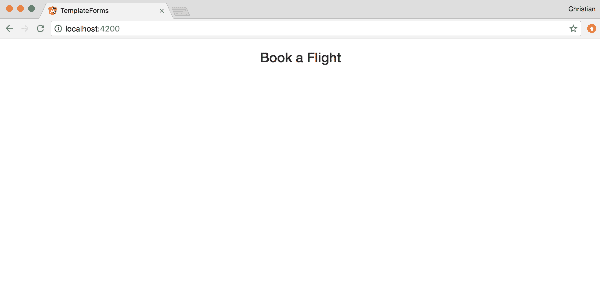

# 表单模块

现在我们有了一个我们希望表单遵循的约定，让我们现在生成表单的组件：

```ts
ng  g component flight-form
```

该命令还将该组件作为声明添加到我们的`App`模块中：

```ts
import { BrowserModule } from '@angular/platform-browser';
import { NgModule } from '@angular/core';

import { AppComponent } from './app.component';
import { FlightFormComponent } from './flight-form/flight-form.component';

@NgModule({
 declarations: [
 AppComponent,
 // Component added after
 // being generated
 FlightFormComponent
 ],
 imports: [
 BrowserModule
 ],
 providers: [],
 bootstrap: [AppComponent]
})
export class AppModule { }
```

Angular 表单的特殊之处和易用性在于提供了开箱即用的功能，比如`NgForm`指令。这些功能不在核心浏览器模块中，而在表单模块中。因此，我们需要导入它们：

```ts
import { BrowserModule } from '@angular/platform-browser';
import { NgModule } from '@angular/core';

// Import the form module
import { FormsModule } from '@angular/forms';

import { AppComponent } from './app.component';
import { FlightFormComponent } from './flight-form/flight-form.component';

@NgModule({
 declarations: [
 AppComponent,
 FlightFormComponent
 ],
 imports: [
 BrowserModule,
 // Add the form module 
 // to imports array
 FormsModule
 ],
 providers: [],
 bootstrap: [AppComponent]
})
export class AppModule { }
```

只需导入并将`FormModule`添加到`imports`数组中即可。

# 双向绑定

现在是在浏览器中使用表单组件显示一些表单控件的完美时机。在数据层（模型）和视图之间保持状态同步可能非常具有挑战性，但是使用 Angular 只需要使用`FormModule`中暴露的一个指令：

```ts
<!-- ./app/flight-form/flight-form.component.html -->
<form>
 <div class="form-group">
 <label for="fullName">Full Name</label>
 <input 
 type="text" 
 class="form-control" 
 [(ngModel)]="flightModel.fullName"
 name="fullName"
 >
 </div>
</form>
```

Angular 依赖于内部的`name`属性来进行绑定。因此，`name`属性是必需的。

注意`[(ngModel)]="flightModel.fullName"`；它试图将组件类上的属性绑定到表单。这个模型将是我们之前创建的`Flight`类型的类：

```ts
// ./app/flight-form/flight-form.component.ts

import { Component, OnInit } from '@angular/core';
import { Flight } from '../flight';

@Component({
 selector: 'app-flight-form',
 templateUrl: './flight-form.component.html',
 styleUrls: ['./flight-form.component.css']
})
export class FlightFormComponent implements OnInit {
 flightModel: Flight;
 constructor() {
 this.flightModel = new Flight('', '', '', '', 0, '', 0, 0, '');
 }

 ngOnInit() {}
}
```

`flightModel`属性被添加到组件中作为`Flight`类型，并用一些默认值进行初始化。

将组件包含在应用 HTML 中，以便在浏览器中显示：

```ts
<div class="container">
 <h3 class="text-center">Book a Flight</h3>
 <div class="col-md-offset-3 col-md-6">
 <app-flight-form></app-flight-form>
 </div>
</div>
```

这是你在浏览器中应该看到的：

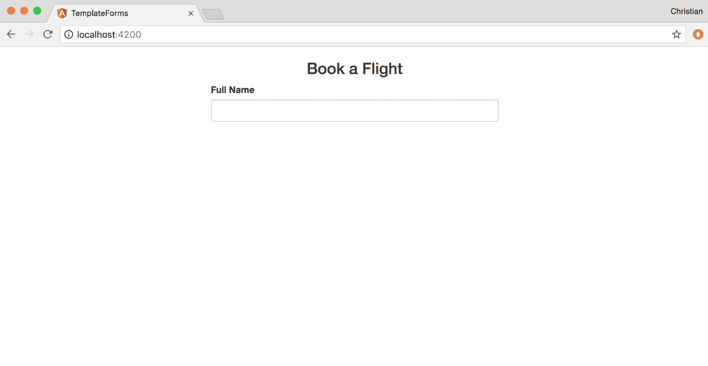

看到双向绑定的实际效果，使用插值来显示`flightModel.fullName`的值。然后，输入一个值并查看实时更新：

```ts
<form>
 <div class="form-group">
 <label for="fullName">Full Name</label>
 <input 
 type="text" 
 class="form-control" 
 [(ngModel)]="flightModel.fullName"
 name="fullName"
 >
 {{flightModel.fullName}}
 </div>
</form>
```

这是它的样子：

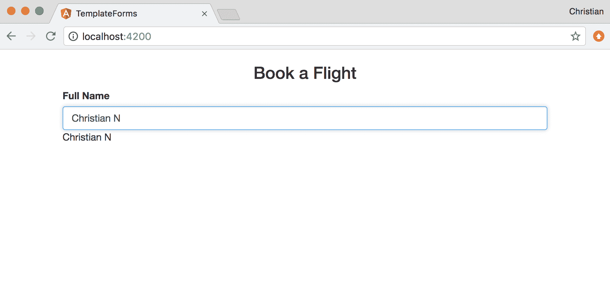

# 更多表单字段

让我们动手添加剩下的表单字段。毕竟，我们不能只提供我们的名字就预订航班。

`from`和`to`字段将是*选择框*，其中包含我们可以飞往和飞出的城市列表。这个城市列表将直接存储在我们的组件类中，然后我们可以在模板中对其进行迭代，并将其呈现为选择框：

```ts
export class FlightFormComponent implements OnInit {
 flightModel: Flight;
 // Array of cities
 cities:Array<string> = [
 'Lagos',
 'Mumbai',
 'New York',
 'London',
 'Nairobi'
 ];
 constructor() {
 this.flightModel = new Flight('', '', '', '', 0, '', 0, 0, '');
 }
}
```

数组以字符串形式存储了世界各地的一些城市。现在让我们使用`ngFor`指令来迭代这些城市，并在表单中使用选择框显示它们：

```ts
<div class="row">
 <div class="col-md-6">
 <label for="from">From</label>
 <select type="text" id="from" class="form-control" [(ngModel)]="flightModel.from" name="from">
 <option *ngFor="let city of cities" value="{{city}}">{{city}}</option>
 </select>
 </div>
 <div class="col-md-6">
 <label for="to">To</label>
 <select type="text" id="to" class="form-control" [(ngModel)]="flightModel.to" name="to">
 <option *ngFor="let city of cities" value="{{city}}">{{city}}</option>
 </select>
 </div>
 </div>
```

整洁！您可以打开浏览器，就在那里看到它：

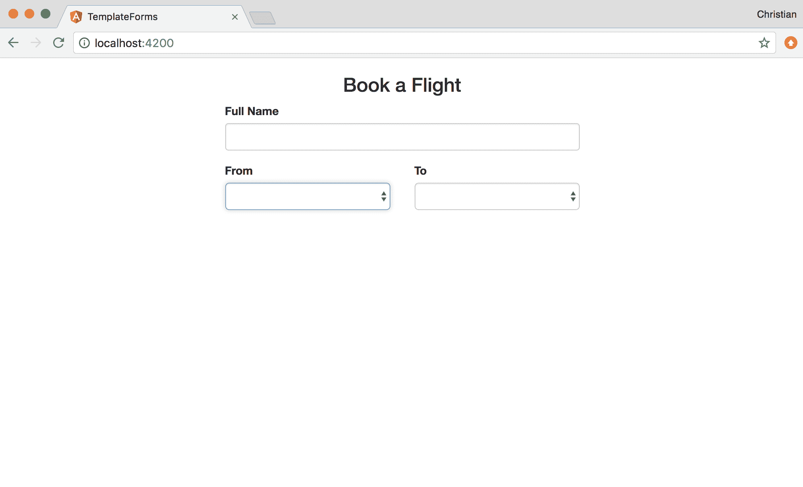

当点击选择下拉菜单时，会显示一个预期的城市列表：

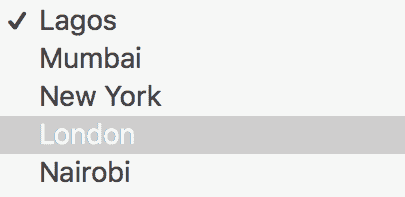

接下来，让我们添加行程类型字段（单选按钮）、出发日期字段（日期控件）和到达日期字段（日期控件）：

```ts
<div class="row" style="margin-top: 15px">
 <div class="col-md-5">
 <label for="" style="display: block">Trip Type</label>
 <label class="radio-inline">
 <input type="radio" name="type" [(ngModel)]="flightModel.type" value="One Way"> One way
 </label>
 <label class="radio-inline">
 <input type="radio" name="type" [(ngModel)]="flightModel.type" value="Return"> Return
 </label>
 </div>
 <div class="col-md-4">
 <label for="departure">Departure</label>
 <input type="date" id="departure" class="form-control" [(ngModel)]="flightModel.departure" name="departure">
 </div>
 <div class="col-md-3">
 <label for="arrival">Arrival</label>
 <input type="date" id="arrival" class="form-control" [(ngModel)]="flightModel.arrival" name="arrival">
 </div>
 </div>
```

数据如何绑定到控件与我们之前创建的文本和选择字段非常相似。主要区别在于控件的类型（单选按钮和日期）：

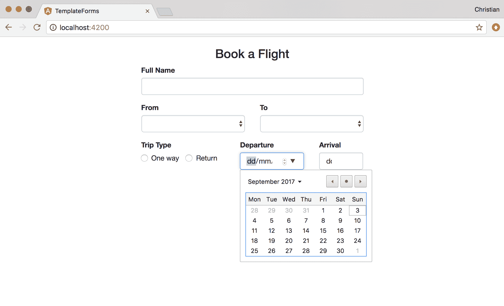

最后，添加乘客数量（成人、儿童和婴儿）：

```ts
<div class="row" style="margin-top: 15px">
 <div class="col-md-4">
 <label for="adults">Adults</label>
 <input type="number" id="adults" class="form-control" [(ngModel)]="flightModel.adults" name="adults">
 </div>
 <div class="col-md-4">
 <label for="children">Children</label>
 <input type="number" id="children" class="form-control" [(ngModel)]="flightModel.children" name="children">
 </div>
 <div class="col-md-4">
 <label for="infants">Infants</label>
 <input type="number" id="infants" class="form-control" [(ngModel)]="flightModel.infants" name="infants">
 </div>
 </div>
```

乘客部分都是数字类型，因为我们只需要选择每个类别上船的乘客数量：

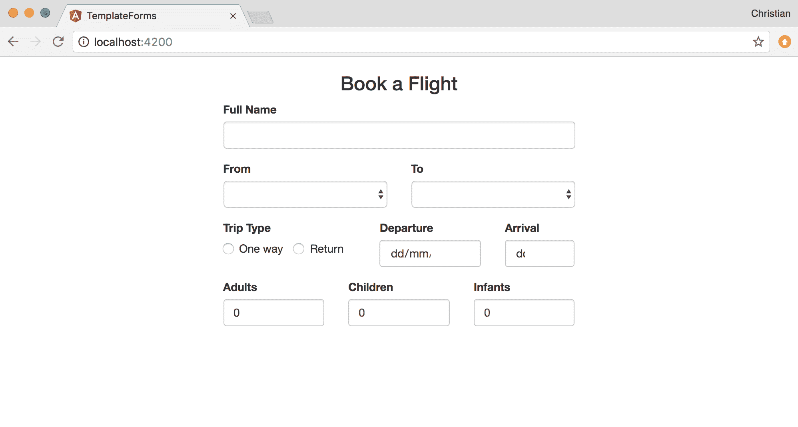

# 验证表单和表单字段

Angular 通过使用其内置指令和状态属性大大简化了表单验证。您可以使用状态属性来检查表单字段是否已被触摸。如果它被触摸但违反了验证规则，您可以使用`ngIf`指令来显示相关错误。

让我们看一个验证全名字段的例子：

```ts
<div class="form-group">
 <label for="fullName">Full Name</label>
 <input 
 type="text" 
 id="fullName" 
 class="form-control" 
 [(ngModel)]="flightModel.fullName" 
 name="fullName"

 #name="ngModel"
 required
 minlength="6">
 </div>
```

我们刚刚为表单的全名字段添加了三个额外的重要属性：`#name`，`required`和`minlength`。`#name`属性与`name`属性完全不同，前者是一个模板变量，通过`ngModel`值保存有关此给定字段的信息，而后者是通常的表单输入名称属性。

在 Angular 中，验证规则被传递为属性，这就是为什么`required`和`minlength`在那里的原因。

是的，字段已经验证，但用户没有得到任何反馈，不知道出了什么问题。让我们添加一些错误消息，以便在表单字段违反时显示：

```ts
<div *ngIf="name.invalid && (name.dirty || name.touched)" class="text-danger">
 <div *ngIf="name.errors.required">
 Name is required.
 </div>
 <div *ngIf="name.errors.minlength">
 Name must be at least 6 characters long.
 </div>
 </div>
```

`ngIf`指令有条件地显示这些`div`元素：

+   如果表单字段已被触摸但没有值，则会显示“名称是必需的”错误

+   当字段被触摸但内容长度小于*6*时，也会显示“名称必须至少为 6 个字符长”。

以下两个屏幕截图显示了浏览器中的这些错误输出：

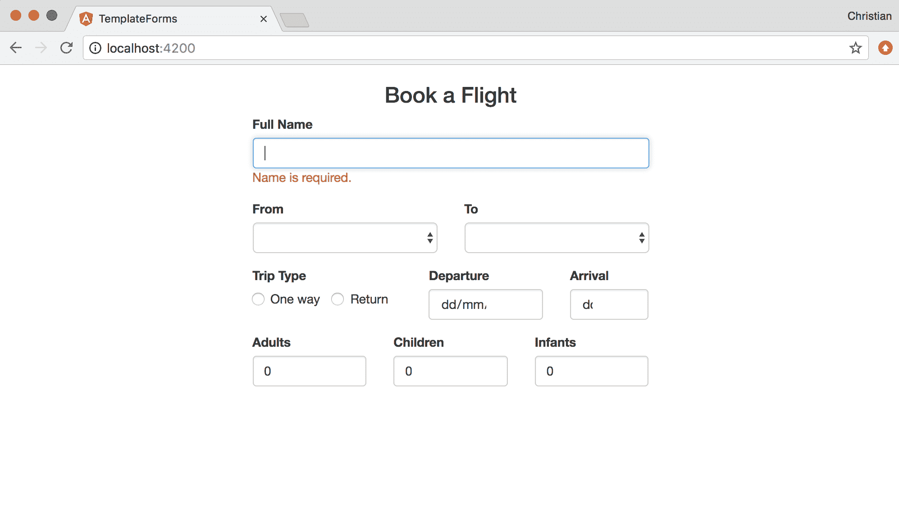

当输入一个值但值的文本计数不到 6 时，会显示不同的错误：

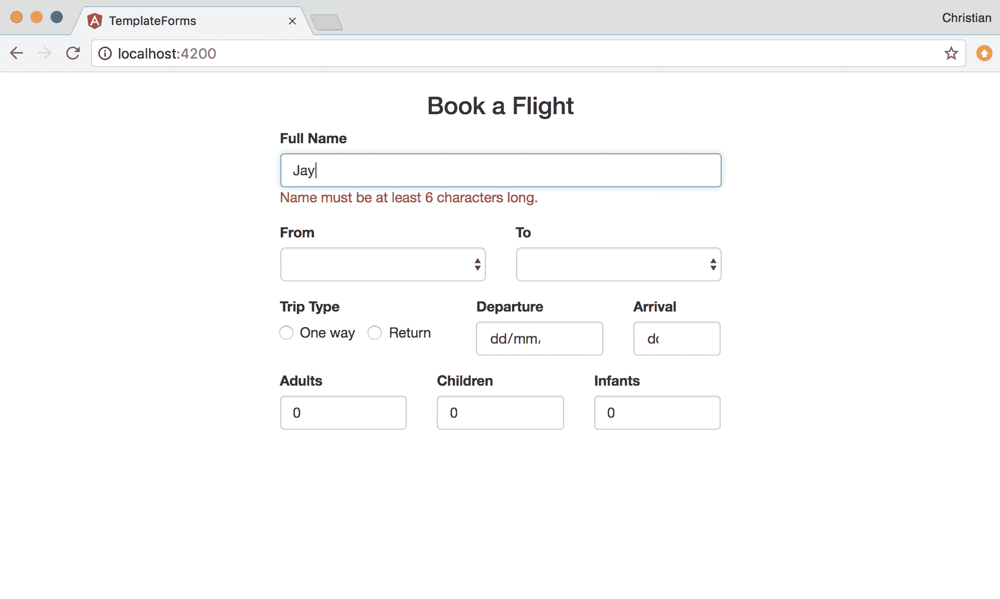

# 提交表单

在提交表单之前，我们需要考虑一些因素：

+   表单是否有效？

+   在提交之前是否有表单处理程序？

为了确保表单有效，我们可以禁用提交按钮：

```ts
<form #flightForm="ngForm">
 <div class="form-group" style="margin-top: 15px">
 <button class="btn btn-primary btn-block" [disabled]="!flightForm.form.valid">
 Submit
 </button>
 </div>
</form>
```

首先，我们向表单添加一个模板变量称为`flightForm`，然后使用该变量来检查表单是否有效。如果表单无效，我们将禁用按钮的点击：

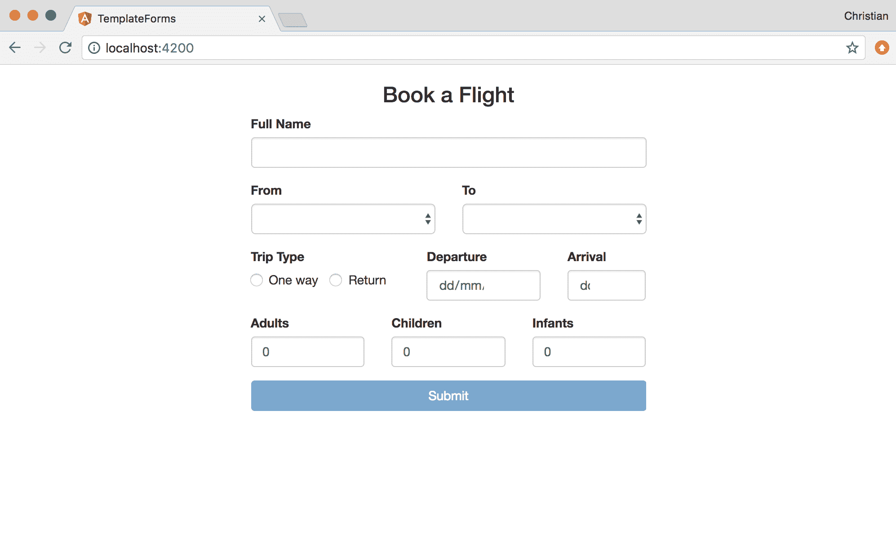

要处理提交，向表单添加一个`ngSubmit`事件。当点击按钮时，将调用此事件：

```ts
<form #flightForm="ngForm" (ngSubmit)="handleSubmit()">
 ...
</form>
```

现在，您可以添加一个类方法`handleSubmit`来处理表单提交。对于这个例子来说，简单的控制台日志可能就足够了：

```ts
export class FlightFormComponent implements OnInit {
 flightModel: Flight;
 cities:Array<string> = [
 ...
 ];
 constructor() {
 this.flightModel = new Flight('', '', '', '', 0, '', 0, 0, '');
 }

 // Handle for submission
 handleSubmit() {
 console.log(this.flightModel);
 }
}
```

# 处理事件

表单不是我们从用户那里接收值的唯一方式。简单的 DOM 交互、鼠标点击和键盘交互可能引发事件，这些事件可能导致用户的请求。当然，我们必须以某种方式处理他们的请求。有许多事件我们无法在本书中讨论。我们可以看一下基本的键盘和鼠标事件。

# 鼠标事件

为了演示两种常见的鼠标事件，单击和双击，创建一个新的 Angular 项目，然后添加以下自动生成的 `app.component.html`：

```ts
<div class="container">
 <div class="row">
 <h3 class="text-center">
 {{counter}}
 </h3>
 <div class="buttons">
 <div class="btn btn-primary">
 Increment
 </div>
 <div class="btn btn-danger">
 Decrement
 </div>
 </div>
 </div>
</div>
```

`counter` 属性通过插值和增量和减量按钮绑定到视图。该属性在应用程序组件上可用，并初始化为零：

```ts
import { Component } from '@angular/core';

@Component({
 selector: 'app-root',
 templateUrl: './app.component.html',
 styleUrls: ['./app.component.css']
})
export class AppComponent {
 counter = 0;
}
```

以下基本上是它的外观：

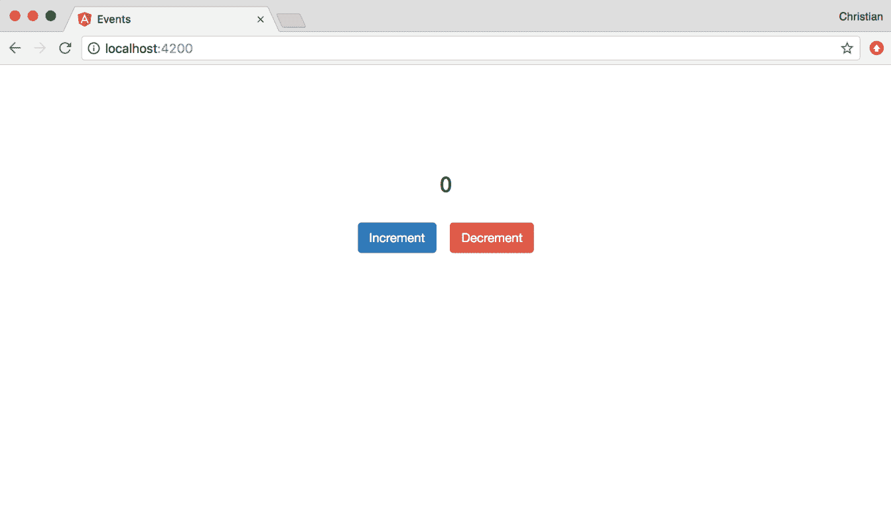

单击按钮完全没有任何作用。让我们为增量按钮添加一个点击事件，这样每次单击时它都会将 1 添加到计数器属性中：

```ts
export class AppComponent {
 counter = 0;
 increment() {
 this.counter++
 }
}
```

我们需要将此事件处理程序绑定到模板中的按钮，以便在单击按钮时实际增加计数器：

```ts
<div class="btn btn-primary" (click)="increment()">
 Increment
</div>
```

事件通过属性绑定到模板，但将属性包装在括号中。属性值成为组件类上将充当事件处理程序的方法。

我们需要为减量添加相同的功能。假设减量是您希望确保用户打算执行的操作，您可以附加双击事件：

```ts
<div class="btn btn-danger" (dblclick)="decrement()">
 Decrement
</div>
```

如您所见，我们使用 `dblclick` 事件而不是 `click`，然后将减量事件处理程序绑定到它。处理程序只是增量处理程序的反向，同时检查我们是否已经达到零：

```ts
decrement() {
 this.counter <= 0 ? (this.counter = 0) : this.counter--;
}
```

以下显示了新事件的执行情况：

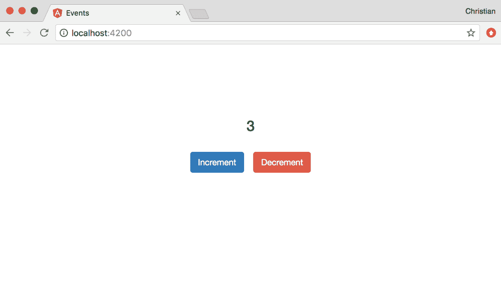

# 键盘事件

您可以通过监听各种键盘事件来跟踪键盘交互。`keypress` 事件告诉您按钮被点击；如果您附加了监听器，监听器将被触发。您可以以与附加鼠标事件相同的方式附加键盘事件：

```ts
<div class="container" (keypress)="showKey($event)" tabindex="1">
 ...
 <div class="key-bg" *ngIf="keyPressed">
 <h1>{{key}}</h1>
 </div>
<div>
```

具有 `key-bg` 类的元素在按下键时显示；它显示我们按下的确切键，该键保存在 `key` 属性中。`keyPressed` 属性是一个布尔值，当按下键时我们将其设置为 `true`。

事件触发 `showKey` 监听器；让我们实现它：

```ts
import { Component } from '@angular/core';

@Component({
 selector: 'app-root',
 templateUrl: './app.component.html',
 styleUrls: ['./app.component.css']
})
export class AppComponent {
 keyPressed = false;
 key = '';
 // ....
 showKey($event) {
 this.keyPressed = true;
 this.key = $event.key.toUpperCase();
 setTimeout(() => {
 this.keyPressed = false;
 }, 500)
 }
}
```

`showKey` 处理程序执行以下操作：

+   它使用按下的键的值设置了 `key` 属性

+   按下的键被表示为小写字符串，因此我们使用 `toUpperCase` 方法将其转换为大写

+   `keyPressed` 属性设置为 `true`，因此显示按下的键，然后在 500 毫秒后设置为 `false`，因此显示的键被隐藏

当您按下键时（并且 `container` div 获得焦点），以下屏幕截图显示了发生了什么：

>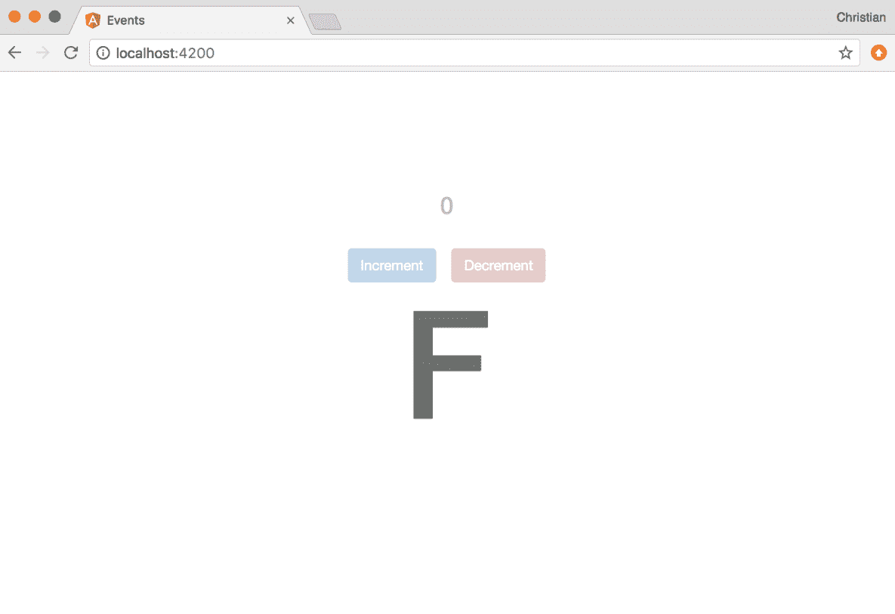

# 总结

你现在对通过表单或事件收集用户输入有了很多知识。我们还涵盖了表单的重要特性，如输入类型、验证、双向绑定、提交等。我们看到的事件示例涵盖了鼠标和键盘事件以及如何处理它们。所有这些有趣的经历都为你构建业务应用程序做好了准备。
