# 第九章：使用 TypeScript 编写模块、指令和管道

模块化对于构建大型软件系统至关重要，Angular 项目也不例外。当我们的应用开始增长时，在一个入口模块中管理其不同成员变得非常困难和混乱。当你有很多服务、指令和管道时，情况变得更具挑战性。说到指令和管道，我们将花一些时间在本章讨论它们的用例和示例，同时在模块中更好地管理我们的应用程序。

# 指令

DOM 操作并不总是最好在组件中处理。组件应该尽可能精简；这样，事情就会变得简单，你的代码可以轻松地移动和重用。那么，我们应该在哪里处理 DOM 操作呢？答案是指令。就像你应该将数据操作任务交给服务一样，最佳实践建议你将繁重的 DOM 操作交给指令。

Angular 中有三种指令类型：

+   组件

+   属性指令

+   结构指令

是的，组件！组件是合格的指令。它们是具有直接访问被操作的模板的指令。我们在本书中已经看到了足够多的组件；让我们专注于属性和结构指令。

# 属性指令

这类指令以为 DOM 添加行为特性而闻名，但不会删除或添加任何 DOM 内容。诸如改变外观、显示或隐藏元素、操作元素属性等等。

为了更好地理解属性指令，让我们构建一些应用于组件模板的 UI 指令。这些指令将在应用时改变 DOM 的行为。

在一个新项目中使用以下命令创建一个新的指令：

```ts
ng generate directive ui-button
```

这将在应用程序文件夹中创建一个空指令，内容如下：

```ts
import { Directive } from '@angular/core';

@Directive({
 selector: '[appUiButton]'
})
export class UiButtonDirective {
 constructor() {}
}
```

`Directive`装饰器首先从`@angular/core`模块中导入。该装饰器用于任何预期充当指令的类。就像组件上的装饰器一样，指令装饰器接受一个具有选择器属性的对象。当这个选择器应用到 DOM 时，指令的行为就会展现出来。

在这个例子中，我们试图实现的行为是用一个属性来为一个完全未经样式处理的按钮添加样式。假设我们在我们的应用组件中有以下按钮：

```ts
<div class="container">
 <button>Click!!</button>
</div>
```

这只是屏幕上的一个简单无聊的按钮：

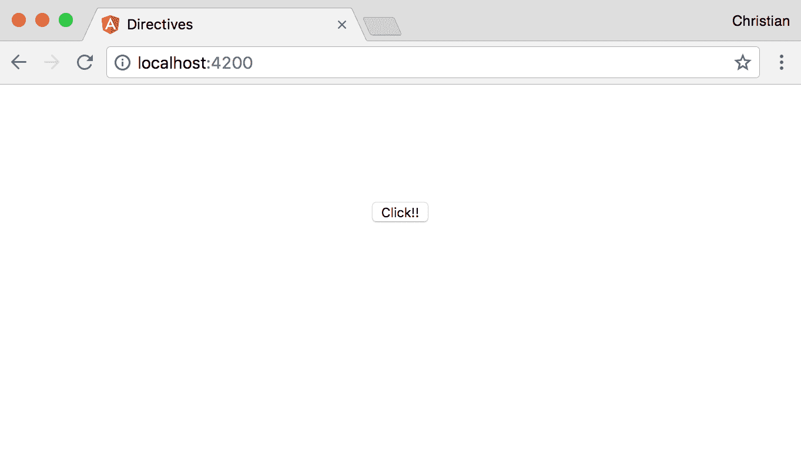

要使用我们刚刚创建的属性指令，将其作为*无值*属性添加到按钮中：

```ts
<button appUiButton>Click!!</button>
```

接下来，找到一种方法来从`directive`类中访问按钮元素。我们需要这种访问权限来能够直接从类中应用样式到按钮上。感谢`ElementRef`类，通过构造函数注入到指令中，它给了我们访问原生元素的权限，这就是按钮元素可以被访问的地方：

```ts
import { Directive, ElementRef } from '@angular/core';

@Directive({
 selector: '[appUiButton]'
})
export class UiButtonDirective {
 constructor(el: ElementRef) {

 }
}
```

它被注入并解析为`el`属性。我们可以从该属性访问按钮元素：

```ts
import { Directive, ElementRef } from '@angular/core';

@Directive({
 selector: '[appUiButton]'
})
export class UiButtonDirective {
 constructor(el: ElementRef) {
 el.nativeElement.style.backgroundColor = '#ff00a6';
 }
}
```

`nativeElement`属性让你可以访问应用属性指令的元素。然后你可以像处理 DOM API 一样处理这个值，这就是为什么我们可以访问`style`和`backgroundColor`属性：

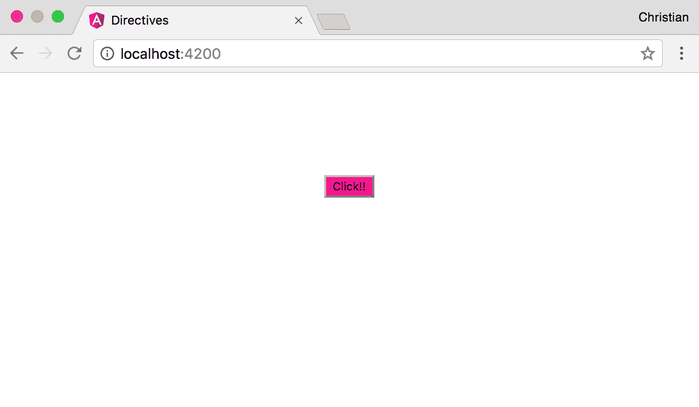

你可以看到粉色背景已经有效应用。让我们通过指令为按钮添加更多样式，使其更有趣：

```ts
import { Directive, ElementRef } from '@angular/core';

@Directive({
 selector: '[appUiButton]'
})
export class UiButtonDirective {
 constructor(el: ElementRef) {
 Object.assign(el.nativeElement.style, {
 backgroundColor: '#ff00a6',
 padding: '7px 15px',
 fontSize: '16px',
 color: '#fff',
 border: 'none',
 borderRadius: '4px'
 })
 }
}
```

我们不再使用多个点来设置值，而是使用`Object.assign`方法来减少我们需要编写的代码量。现在，我们在浏览器中有一个更漂亮的按钮，完全由指令进行样式设置：

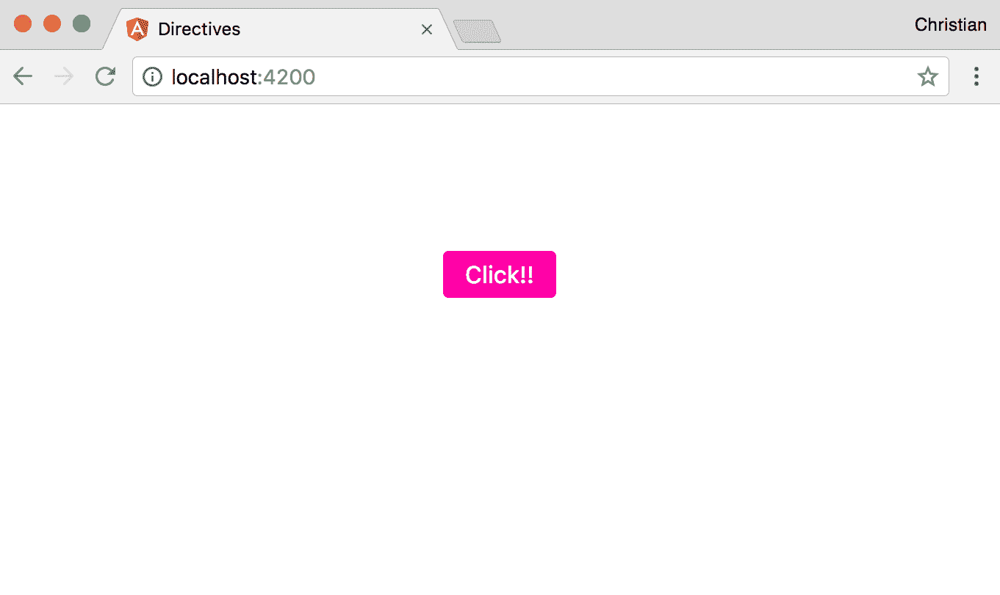

# 在指令中处理事件

指令非常灵活，可以根据用户触发的事件应用不同的状态。例如，我们可以为按钮添加一个悬停行为，当鼠标光标移动到按钮上时，按钮会应用不同的颜色（比如黑色）：

```ts
import { 
 Directive, 
 ElementRef, 
 HostListener } from '@angular/core';

@Directive({
 selector: '[appUiButton]'
})
export class UiButtonDirective {
 constructor(private el: ElementRef) {
 Object.assign(el.nativeElement.style, {
 backgroundColor: '#ff00a6',
 ...
 })
 }

 @HostListener('mouseenter') onMouseEnter() {
 this.el.nativeElement.style.backgroundColor = '#000';
 }

 @HostListener('mouseleave') onMouseLeave() {
 this.el.nativeElement.style.backgroundColor = '#ff00a6';
 }
}
```

我们在这个文件中引入了一些成员：

+   我们导入了`HostListener`，这是一个装饰器，可以扩展类中的方法。它将方法转换为附加到原生元素的事件监听器。装饰器接受事件类型的参数。

+   我们在`onMouseEnter`和`onMouseLeave`上定义了两种方法，然后用`HostListener`装饰这些方法。这些方法在悬停发生时改变按钮的背景颜色。

当我们将鼠标悬停在按钮上时，行为看起来像这样：

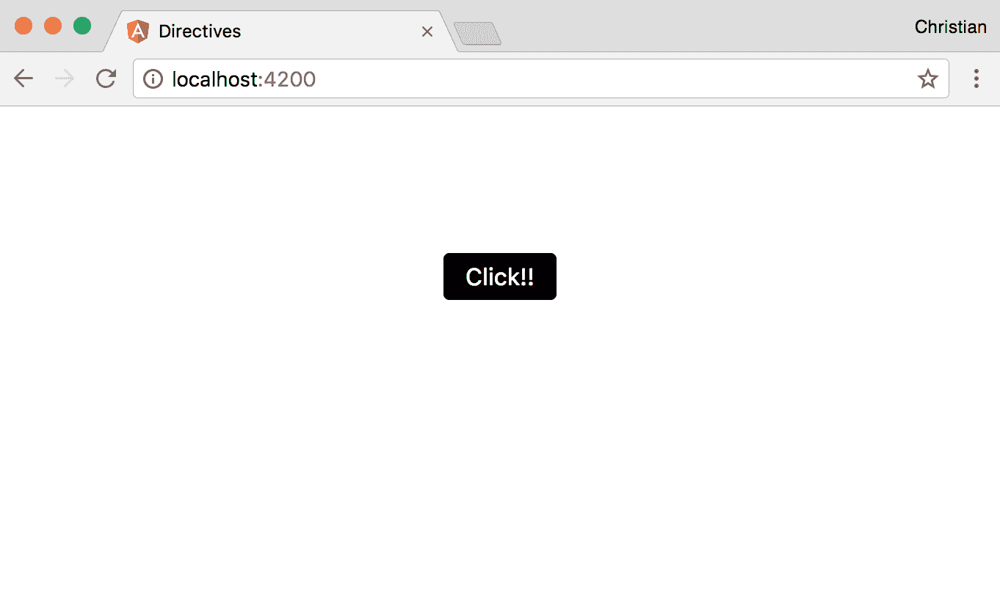

# 动态属性指令

如果我们，作为这个指令的作者，是最终的使用者呢？如果另一个开发人员将指令作为 API 进行重用呢？我们如何使它具有足够的灵活性来处理动态值？当你在编写指令时问自己这些问题时，就是使其动态化的时候了。

一直以来，我们一直在使用指令而没有任何值。实际上，我们可以使用属性值将输入传递到指令中：

```ts
<button appUiButton bgColor="red">Click!!</button>
```

我们添加了一个新属性`bgColor`，它不是一个指令，而是一个输入属性。该属性用于将动态值发送到指令，如下所示：

```ts
import { 
 Directive, 
 ElementRef, 
 HostListener, 
 Input,
 OnInit } from '@angular/core';

@Directive({
 selector: '[appUiButton]'
})
export class UiButtonDirective implements OnInit {
 @Input() bgColor: string;
 @Input() hoverBgColor: string;
 constructor(private el: ElementRef) {}

 ngOnInit() {
 Object.assign(this.el.nativeElement.style, {
 backgroundColor: this.bgColor || '#ff00a6',
 padding: '7px 15px',
 fontSize: '16px',
 color: '#fff',
 border: 'none',
 borderRadius: '4px'
 })
 }

 @HostListener('mouseenter') onMouseEnter() {
 console.log(this.bgColor);
 this.el.nativeElement.style.backgroundColor = this.hoverBgColor || '#000';
 }

 @HostListener('mouseleave') onMouseLeave() {
 this.el.nativeElement.style.backgroundColor = this.bgColor || '#ff00a6';
 }
}
```

以下是我们引入的更改：

+   引入了两个`Input`装饰的属性--`bgColor`和`bgHoverColor`--用作从模板到指令的动态值流。

+   该指令的设置从构造函数移至`ngOnInit`方法。这是因为 Angular 的变更检测设置了输入装饰器，构造函数中不会发生这种情况，因此当我们尝试从构造函数中访问它们时，`bgColor`和`bgHoverColor`是未定义的。

+   在设置样式时，我们不是硬编码`backgroundColor`的值，而是使用通过`bgColor`接收到的值。我们还设置了一个备用值，以防开发人员忘记包含属性。

+   鼠标进入和鼠标离开事件也会发生同样的事情。

现在，按钮的外观受到动态值的影响：

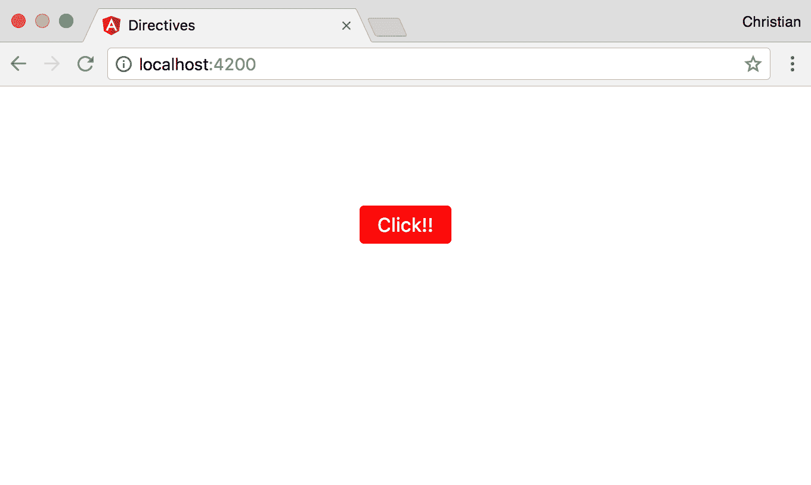

# 结构指令

结构指令与属性指令有很多共同之处，但它们在预期行为上有很大不同。与属性指令不同，结构指令预期创建或删除 DOM 元素。这与使用 CSS 显示属性来显示或隐藏元素不同。在这种情况下，元素仍然在 DOM 树中，但在隐藏时对最终用户不可见。

一个很好的例子是`*ngIf`。当使用`*ngIf`结构指令从 DOM 中移除元素时，该指令会从屏幕上消失，并从 DOM 树中删除。

# 为什么会有这样的差异？

您控制 DOM 元素的可见性的方式可能会对应用程序的性能产生重大影响。

举个例子，您可能有一个手风琴，用户预期点击以显示更多信息。用户在查看内容后可能决定隐藏手风琴的内容，并在以后的某个时间再次打开以供参考。很明显，手风琴的内容有可能随时显示和隐藏。

在这种情况下，最好使用一个不隐藏/移除手风琴内容，而只是隐藏它的属性指令。这样在需要时显示和隐藏会非常快速。使用`*ngIf`这样的结构指令会不断地创建和销毁 DOM 树的一部分，如果被控制的 DOM 内容很庞大，这样做会非常昂贵。

另一方面，当你有一些内容，你确信用户只会查看一次或最多两次时，最好使用`*ngIf`这样的结构指令。这样，你的 DOM 就不会被大量未使用的 HTML 内容所淹没。

# 星号的作用

星号在所有结构指令之前都非常重要。如果你从它们中移除星号，`*ngIf`和`*ngFor`指令将拒绝工作，这意味着星号是必需的。因此，问题是：为什么星号必须在那里呢？

它们在 Angular 中是语法糖，意味着不必以这种方式编写。这才是它们实际上的样子：

```ts
<div template="ngIf true">
 <p>Lorem ipsum dolor sit amet, consectetur adipisicing elit. Nesciunt non perspiciatis consequatur sapiente provident nemo similique. Minus quo veritatis ratione, quaerat dolores optio facilis dolor nemo, tenetur, obcaecati quibusdam, doloremque.</p>
</div>
```

这个模板属性转换成了 Angular 中的以下内容：

```ts
<ng-template [ngIf]="true">
 <div template="ngIf true">
 <p>Lorem ipsum dolor sit amet, consectetur adipisicing elit....</p>
 </div> </ng-template>
```

看看`ngIf`现在已经成为了一个普通的 Angular 属性，但被注入到了模板中。当值为`false`时，模板会从 DOM 树中被移除（而不是隐藏）。以这种方式编写这样的指令只是一大堆代码，所以 Angular 添加了语法糖来简化我们编写`ngIf`指令的方式：

```ts
<div *ngIf="true">
 <p>Lorem ipsum dolor sit amet, consectetur adipisicing elit. Nesciunt non perspiciatis consequatur sapiente provident nemo similique.</p>
</div>
```

# 创建结构指令

我们已经从之前的例子中看到了如何使用结构指令。我们如何创建它们呢？我们通过在终端中运行以下命令来创建它们：

```ts
ng generate directive when
```

是的，我们将指令命名为`when`。这个指令确实做了`*ngIf`做的事情，所以希望这样做能帮助你更好地理解你已经使用过的指令的内部工作原理。

使用以下内容更新指令：

```ts
import { 
 Directive, 
 Input, 
 TemplateRef, 
 ViewContainerRef } from '@angular/core';

@Directive({
 selector: '[appWhen]'
})
export class WhenDirective {
 constructor(
 private templateRef: TemplateRef<any>,
 private viewContainer: ViewContainerRef) { }
}
```

我们介绍了一些你还不熟悉的成员。`TemplateRef`是对我们之前看到的`ng-template`模板的引用，其中包含了我们正在控制的 DOM 内容。`ViewContainerRef`是对视图本身的引用。

在视图中使用`appWhen`指令时，它预期接受一个条件，比如`ngIf`。为了接收这样的条件，我们需要创建一个装饰过的`Input` setter 方法：

```ts
export class WhenDirective {
 private hasView = false;

 constructor(
 private templateRef: TemplateRef<any>,
 private viewContainer: ViewContainerRef) { }

 @Input() set appWhen(condition: boolean) {
 if (condition && !this.hasView) {
 this.viewContainer.createEmbeddedView(this.templateRef);
 this.hasView = true;
 } else if (!condition && this.hasView) {
 this.viewContainer.clear();
 this.hasView = false;
 }
 }
}
```

指令中的 setter 方法检查值是否解析为`true`，然后显示内容并创建视图（如果尚未创建）。当值解析为`false`时，情况将发生变化。

让我们通过单击我们在属性指令部分劳累的按钮来测试指令。单击按钮时，它会将属性切换为`true`或`false`。此属性绑定到我们创建的指令的值。

使用以下内容更新应用程序组件类：

```ts
export class AppComponent {
 toggle = false;
 updateToggle() {
 this.toggle = !this.toggle;
 }
}
```

`updateToggle`方法绑定到按钮，以便在用户单击时翻转`toggle`的值。以下是应用程序组件 HTML 的样子：

```ts
<h3 
 style="text-align:center" 
 *appWhen="toggle"
 >Hi, cute directive</h3>

<button 
 appUiButton 
 bgColor="red" 
 (click)="updateToggle()"
>Click!!</button>
```

点击按钮后，它通过将文本添加或从屏幕中移除来显示或隐藏文本：

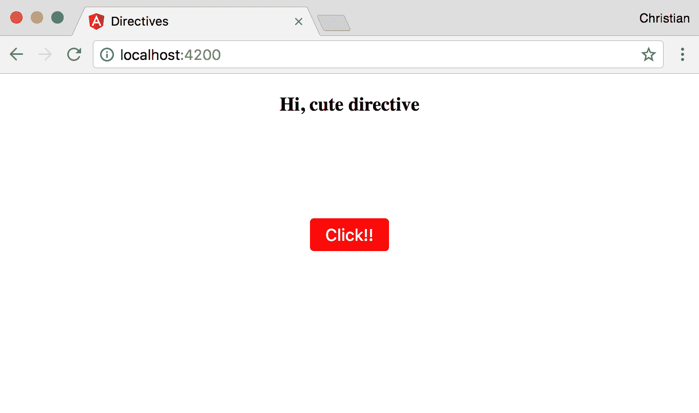

# 管道

我们还没有讨论的另一个有趣的模板功能是管道。管道允许您在模板中就地格式化模板内容。您可以在模板中编写管道来代替在组件中格式化内容。这是一个管道的完美示例：

```ts
<div class="container">
 <h2>{{0.5 | percent}}</h2>
</div>
```

在小数后添加`| percent`会将值更改为百分比表示，如下面的屏幕截图所示：

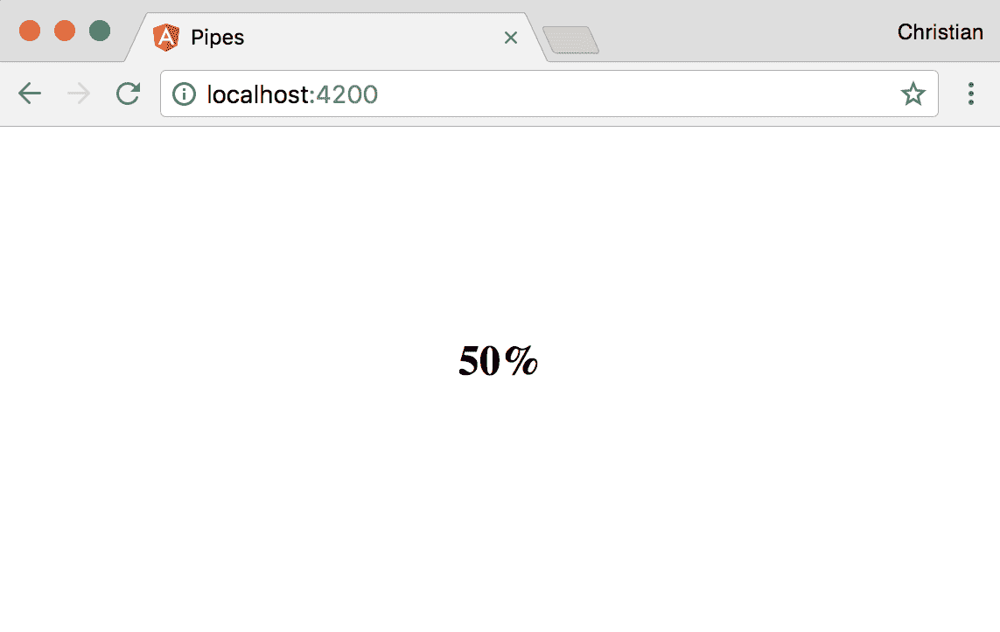

以下是使用一个案例管道的另一个示例：

```ts
<div class="container">
 <h2>{{0.5 | percent}}</h2>
 <h3>{{'this is uppercase' | uppercase}}</h3>
</div>
```

`uppercase`管道将文本字符串转换为大写。以下是前面代码示例的输出：

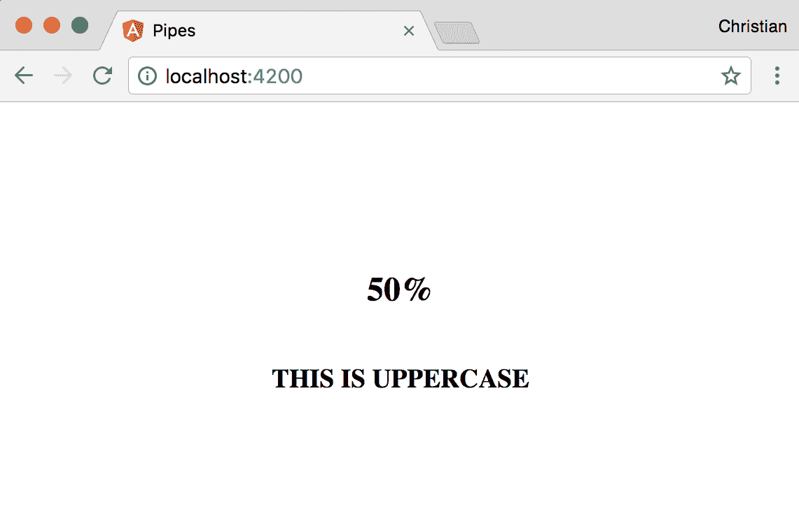

一些管道接受参数，这些参数有助于微调应用于某些内容的管道的行为。这样的管道的一个例子是货币管道，它接受一个参数来定义要使用哪种货币格式化内容： 

```ts
<h2>{{50.989 | currency:'EUR':true}}</h2>
```

以下屏幕截图显示了一个格式良好的值：

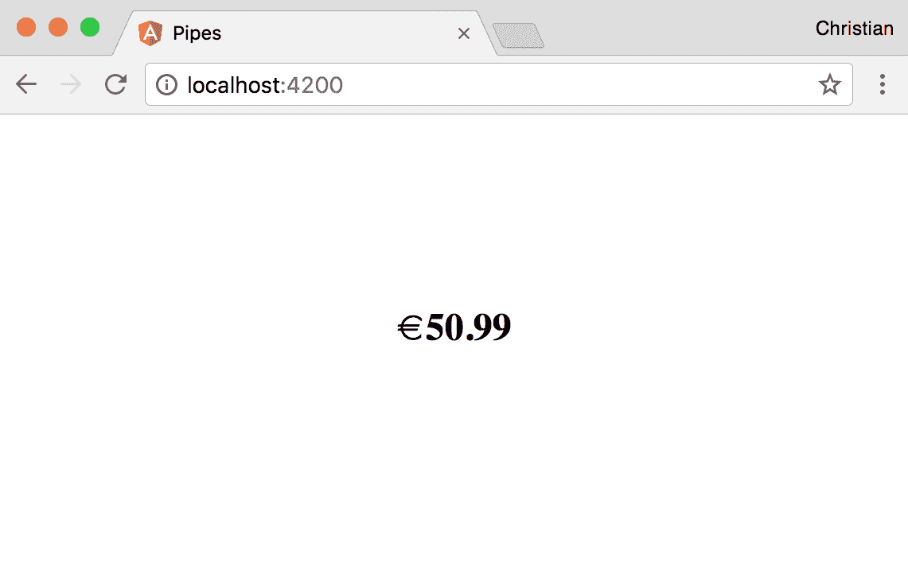

管道采用由冒号（`:`）分隔的两个参数。第一个参数是我们设置为欧元的货币。第二个参数是一个布尔值，表示显示的货币符号的类型。因为值为`true`，所以显示欧元符号。当值为`false`时，输出如下：

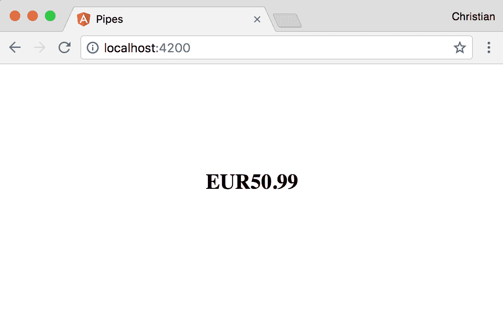

不使用符号，而是用货币代码（EUR）在值之前。

# 创建管道

我们已经了解了管道的用途和使用场景。接下来，我们需要了解如何使用 TypeScript 类来创建自定义管道。首先，运行以下命令生成一个空管道：

```ts
ng generate pipe reverse
```

然后，使用以下内容更新生成的类文件：

```ts
import { Pipe, PipeTransform } from '@angular/core';

@Pipe({
 name: 'reverse'
})
export class ReversePipe implements PipeTransform {

 transform(value: any, args?: any): any {
 return value.split('').reverse().join('');
 }

}
```

这个示例接受一个字符串并返回字符串的颠倒版本。`ReversePipe`类实现了`PipeTransform`接口，该接口定义了必须以特定签名创建的`transform`方法，如前所述。

该类使用`Pipe`装饰器进行装饰，该装饰器以配置对象作为参数。该对象必须定义一个`name`属性，该属性用作应用到模板时管道的标识符。在我们的情况下，管道的名称是`reverse`。

现在可以将自定义管道应用到模板中：

```ts
<h3>{{'watch me flip' | reverse}}</h3> 
```

当您查看示例时，文本被颠倒，现在以 p 开头，以 w 结尾：

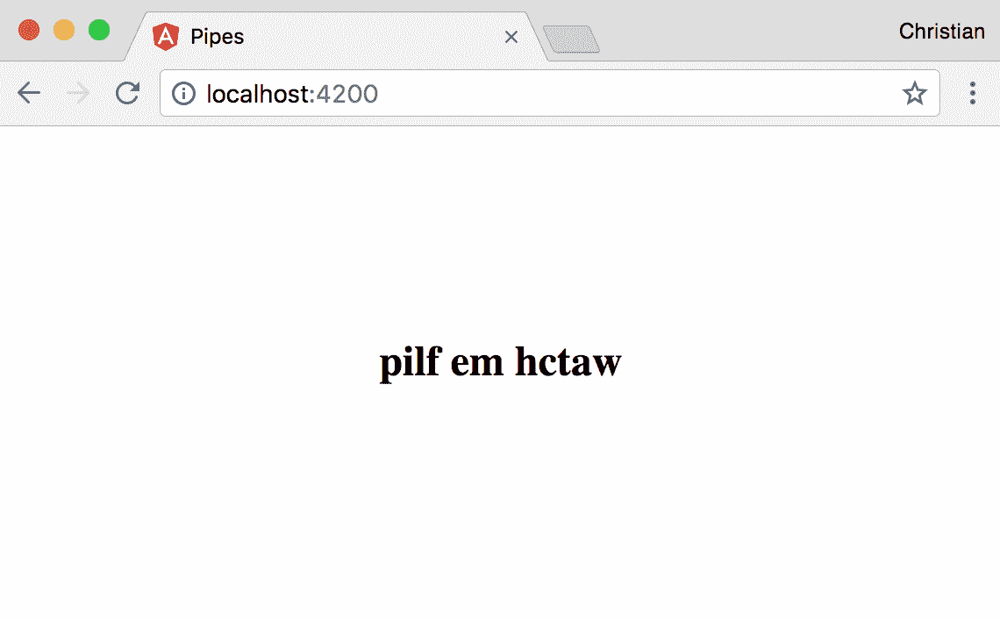

# 向管道传递参数

我们已经了解了如何创建管道，但我们也知道管道需要参数。我们如何将这些参数添加到我们的自定义管道中？

由于传递给 transform 方法的可选`args`参数，生成的管道可能已经给出了上一个示例的提示：

```ts
transform(value: any, args?: any): any {
 ...
}
```

假设我们想要定义字符串的颠倒是按字母还是按单词应用，向管道用户提供这种控制的最佳方式是通过参数。以下是更新后的示例：

```ts
export class ReversePipe implements PipeTransform {

 transform(value: any, args?: any): any {
 if(args){
 return value.split(' ').reverse().join(' ');
 } else {
 return value.split('').reverse().join('');
 }
 }

}
```

当提供的参数为`true`时，我们按单词而不是字母颠倒字符串。这是通过在存在空格的地方拆分字符串来实现的，而不是空字符串。当为`false`时，我们在空字符串处拆分，这样就可以根据字母颠倒字符串。

现在我们可以在传递参数的同时使用管道：

```ts
<h2>{{'watch me flip' | reverse:true}}</h2> 
```

这是生成的输出：

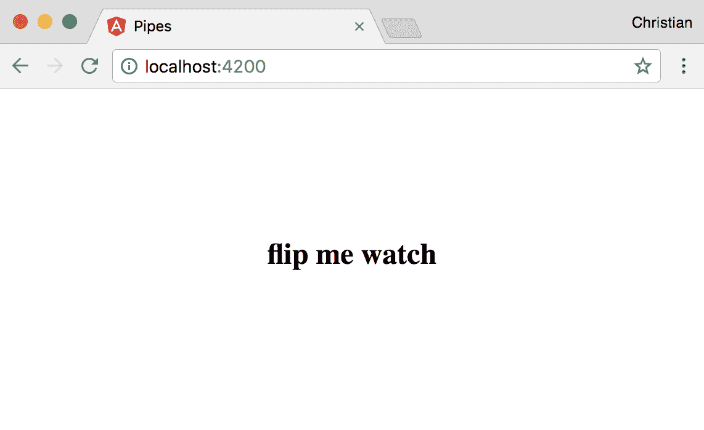

# 模块

我们在本文开头提到了模块以及它们如何帮助我们组织项目。考虑到这一点，看一下这个应用模块：

```ts
import { BrowserModule } from '@angular/platform-browser';
import { NgModule } from '@angular/core';

import { AppComponent } from './app.component';
import { UiButtonDirective } from './ui-button.directive';
import { WhenDirective } from './when.directive';

@NgModule({
 declarations: [
 AppComponent,
 UiButtonDirective,
 WhenDirective
 ],
 imports: [
 BrowserModule
 ],
 providers: [],
 bootstrap: [AppComponent]
})
export class AppModule { }
```

这是来自指令的一个模块：

```ts
examples:import { BrowserModule } from '@angular/platform-browser';
import { NgModule } from '@angular/core';

import { AppComponent } from './app.component';
import { ReversePipe } from './reverse.pipe';

@NgModule({
 declarations: [
 AppComponent,
 ReversePipe
 ],
 imports: [
 BrowserModule
 ],
 providers: [],
 bootstrap: [AppComponent]
})
export class AppModule { }
```

如果您对细节如此关注，您可能已经注意到我们在指令中从未添加`UiButtonDirective`或`WhenDirective`。在管道示例中也没有添加`ReversePipe`。这些添加是在运行`generate`命令时为所有成员自动完成的，除了服务。

对于您创建的所有成员，即组件、指令、管道和服务，您需要将它们包含在其所属的模块中。

模块（通常称为 `NgModule`）是一个用 `NgModule` 装饰器装饰的类。这个装饰器接受一个配置对象，告诉 Angular 应用中创建的成员以及它们所属的位置。

以下是不同的属性：

+   `declarations`：组件、指令和管道必须在 `declarations` 数组中定义，以便向应用程序公开它们。如果未这样做，将在控制台中记录错误，告诉您省略的成员未被识别。

+   `imports`：应用程序模块并不是唯一存在的模块。您可以拥有更小、更简单的模块，将相关任务成员组合在一起。在这种情况下，您仍然需要将较小的模块导入到应用程序模块中。这就是 `imports` 数组的作用。这些较小的模块通常被称为特性模块。特性模块也可以被导入到另一个特性模块中。

+   `providers`：如果您有抽象特定任务并需要通过依赖注入注入到应用程序中的服务，您需要在 `providers` 数组中指定这些服务。

+   `bootstrap`：`bootstrap` 数组只在入口模块中声明，通常是应用程序模块。这个数组定义了应该首先启动哪个组件，或者哪个组件作为应用程序的入口点。该值始终为 `AppComponent`，因为这是入口点。

# 总结

您学到了许多概念，从指令和管道到模块。您学到了不同类型的指令（属性和结构性），以及如何创建每种指令。我们还讨论了在创建管道时如何传递参数。在下一章中，我们将讨论 Angular 应用程序中的路由以及 TypeScript 扮演的重要角色。
