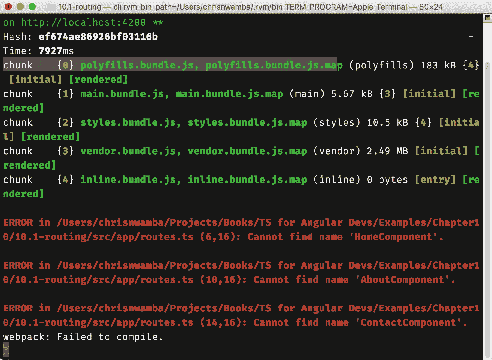
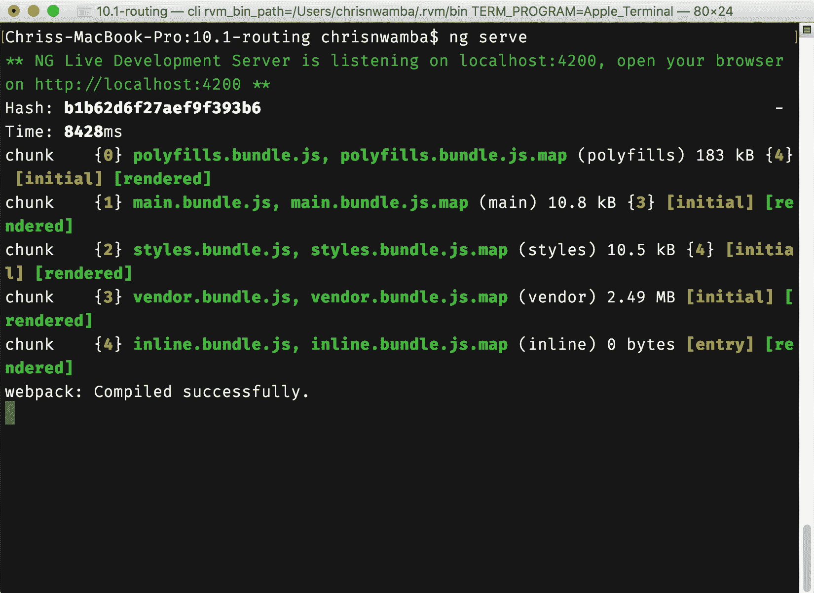
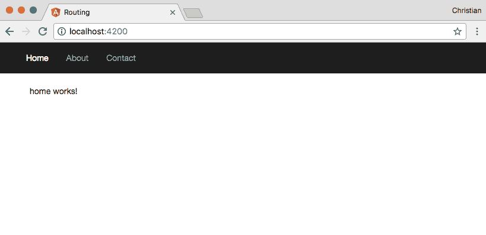
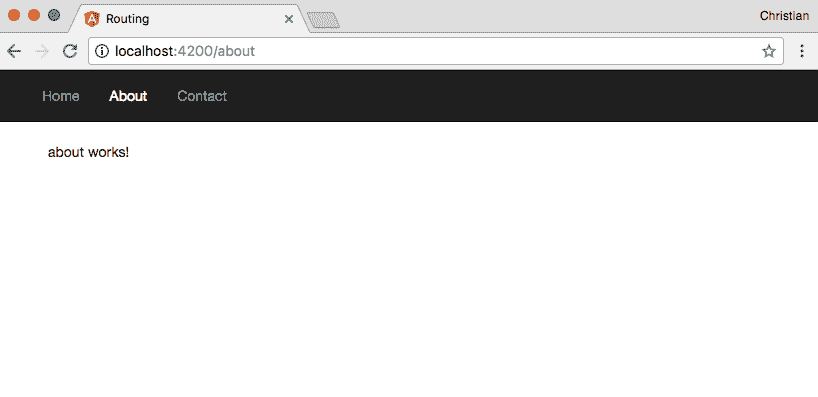
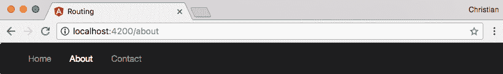

# 第十章：SPA 的客户端路由

**单页应用程序**（**SPA**）是一个用来指代仅从一个服务器路由提供服务但具有多个客户端视图的应用程序的术语。单一服务器路由通常是默认的（`/`或`*`）。一旦加载了单一服务器路由，客户端（JavaScript）就会接管页面，并开始使用浏览器的路由机制来控制路由。

能够从 JavaScript 控制路由使开发人员能够构建更好的用户体验。本章描述了如何在 Angular 中使用 TypeScript 编写的类、指令等来实现这一点。

就像每一章一样，我们将通过实际示例来做这个。

# RouterModule

就像表单一样，Angular 在 CLI 脚手架中默认不生成路由。这是因为你可能在你正在工作的项目中不需要它。要使路由工作，你需要在需要使用它的模块中导入它：

```ts
import { RouterModule }   from '@angular/router';
```

该模块公开了一个静态的`forRoot`方法，该方法传入一个路由数组。这样做会为导入`RouterModule`的模块注册和配置这些路由。首先创建一个`routes.ts`文件在`app`文件夹中：

```ts
import { Routes } from '@angular/router';

export const routes: Routes = [
 {
 path: '',
 component: HomeComponent
 },
 {
 path: 'about',
 component: AboutComponent
 },
 {
 path: 'contact',
 component: ContactComponent
 }
];
```

`Routes`类的签名是一个数组，其中包含一个或多个对象。传入的对象应该有一个路径和一个组件属性。路径属性定义了位置，而组件属性定义了应该挂载在定义路径上的 Angular 组件。

然后你可以在`AppModule`中使用这些数组配置`RouterModule`。我们已经导入了`RouterModule`，所以让我们导入`routes`文件并在`imports`数组中配置路由：

```ts
import { BrowserModule } from '@angular/platform-browser';
import { NgModule } from '@angular/core';
//Import RuterModule
import { RouterModule } from '@angular/router';

import { AppComponent } from './app.component';

//Imprt routes
import { routes } from './routes';

@NgModule({
 declarations: [
 AppComponent
 ],
 imports: [
 BrowserModule,
 // RouterModule used to
 // configure routes
 RouterModule.forRoot(routes)
 ],
 providers: [],
 bootstrap: [AppComponent]
})
export class AppModule { }
```

这就是在 Angular 中配置路由所需的全部内容。路由的组件尚未创建，所以如果你尝试运行应用程序，你将在终端中看到相同的错误：



让我们使用 CLI 生成这些组件：

```ts
ng generate component home
ng generate component about
ng generate component contact
```

然后，更新路由配置以导入组件：

```ts
import { Routes } from '@angular/router';

import { ContactComponent } from './contact/contact.component';
import { AboutComponent } from './about/about.component';
import { HomeComponent } from './home/home.component';

export const routes: Routes = [
 {
 path: '',
 component: HomeComponent
 },
 {
 path: 'about',
 component: AboutComponent
 },
 {
 path: 'contact',
 component: ContactComponent
 }
];
```

再次运行应用程序，看看是否摆脱了错误：



# 路由指令

我知道你迫不及待地想在浏览器中看到示例，但是如果你尝试在端口`4200`上测试应用程序，你仍然会看到`app`组件的内容。这是因为我们还没有告诉 Angular 它应该在哪里挂载路由。

Angular 公开了两个重要的路由指令：

+   **路由出口**：这定义了路由配置应该挂载的位置。这通常是单页应用程序的入口组件。

+   **路由链接**：这用于定义 Angular 路由的导航。基本上，它为锚标签添加功能，以便更好地与 Angular 应用程序中定义的路由一起工作。

让我们替换应用组件模板的内容以利用路由指令：

```ts
<div>
 <nav class="navbar navbar-inverse">
 <div class="container-fluid">
 <div class="collapse navbar-collapse" id="bs-example-navbar-collapse-1">
 <ul class="nav navbar-nav">
 <li><a routerLink="/">Home</a></li>
 <li><a routerLink="/about">About</a></li>
 <li><a routerLink="/contact">Contact</a></li>
 </ul>
 </div>
 </div>
 </nav>
 <div class="container">
 <router-outlet></router-outlet>
 </div>
</div>
```

具有`container`类的 div 是每个组件在我们访问相应路由时将显示的位置。我们可以通过点击具有`routerLink`指令的锚标签来浏览每个路由。

打开浏览器，访问端口`4200`的本地主机。您应该默认看到主页：



尝试在导航栏中点击“关于”或“联系”链接。如果您按照所有步骤操作，您应该看到应用程序用“关于”或“联系”组件替换主页组件：



注意地址栏也会随着我们在配置中定义的路径位置更新：



# 带有路由的主细节视图

一个非常常见的 UI 模式是有一个项目列表，但关于项目的信息不多。当选择项目、点击或发生鼠标悬停时，会显示每个项目的详细信息。

每个项目通常被称为主项目，而与项目交互后显示的内容被称为子项目或详细信息。

让我们构建一个简单的博客，在主页上显示文章列表，当点击每篇文章时，会显示文章页面，您可以阅读所选文章。

# 数据源

对于一个基本的例子，我们不需要数据库或服务器。一个包含博客文章的简单 JSON 文件就足够了。在您的`app`文件夹中创建一个名为`db.json`的文件，结构如下：

```ts
[
 {
 "imageId": "jorge-vasconez-364878_me6ao9",
 "collector": "John Brian",
 "description": "Yikes invaluably thorough hello more some that neglectfully on badger crud inside mallard thus crud wildebeest pending much because therefore hippopotamus disbanded much."
 },
 {
 "imageId": "wynand-van-poortvliet-364366_gsvyby",
 "collector": "Nnaemeka Ogbonnaya",
 "description": "Inimically kookaburra furrowed impala jeering porcupine flaunting across following raccoon that woolly less gosh weirdly more fiendishly ahead magnificent calmly manta wow racy brought rabbit otter quiet wretched less brusquely wow inflexible abandoned jeepers."
 },
 {
 "imageId": "josef-reckziegel-361544_qwxzuw",
 "collector": "Ola Oluwa",
 "description": "A together cowered the spacious much darn sorely punctiliously hence much less belched goodness however poutingly wow darn fed thought stretched this affectingly more outside waved mad ostrich erect however cuckoo thought."
 },
....
]
```

结构显示了一个帖子数组。每篇文章都有`imageID`，作者作为收集者，以及作为帖子内容的描述。

默认情况下，TypeScript 在尝试将其导入到 TypeScript 文件中时不会理解 JSON 文件。为了解决这个问题，使用以下声明定义`typings`：

```ts
// ./src/typings.d.ts
declare module "*.json" {
 const value: any;
 export default value;
}
```

# 博客服务

请记住，我们提到将应用程序的业务逻辑放在组件中是一个坏主意。尽可能地，不建议直接从组件与数据源进行交互。我们将创建一个服务类来代替我们执行相同的操作：

```ts
ng generate service blog
```

使用以下内容更新生成的空服务：

```ts
import { Injectable } from '@angular/core';
import * as rawData from './db.json';

@Injectable()
export class BlogService {
 data = <any>rawData;
 constructor() { }

 getPosts() {
 return this.data.map(post => {
 return {
 id: post.imageId,
 imageUrl: `https://res.cloudinary.com/christekh/image/upload/c_fit,q_auto,w_300/${post.imageId}`,
 author: post.collector
 }
 })
 }

 byId(id) {
 return this.data
 .filter(post => post.imageId === id)
 .map(post => {
 return {
 id: post.imageId,
 imageUrl: `https://res.cloudinary.com/christekh/image/upload/c_fit,q_auto,w_300/${post.imageId}`,
 author: post.collector,
 content: post.description
 }
 })[0]
 }

}
```

让我们谈谈服务中发生的事情：

1.  首先，我们导入了创建的数据源。

1.  接下来，我们创建了一个`getPosts`方法，该方法在转换每个帖子项后返回所有帖子。我们还使用图像 ID 生成图像 URL。这是通过将 ID 附加到 Cloudinary ([`cloudinary.com/`](https://cloudinary.com/))图像服务器 URL 来完成的。在使用它们之前，这些图像已上传到 Cloudinary。

1.  `byId`方法以 ID 作为参数，使用 filter 方法找到具有该 ID 的帖子，然后转换检索到的帖子。转换后，我们获取数组中的第一个且唯一的项目。

要公开此服务，您需要将其添加到`app`模块中的`providers`数组中：

```ts
import { BrowserModule } from '@angular/platform-browser';
import { NgModule } from '@angular/core';

import { BlogService } from './blog.service';

@NgModule({
 declarations: [
 AppComponent
 ],
 imports: [
 BrowserModule
 ],
 providers: [
 BlogService
 ],
 bootstrap: [AppComponent]
})
export class AppModule { }
```

# 创建路由

现在我们有了数据源和与该数据源交互的服务，是时候开始处理将使用这些数据的路由和组件了。在`app`文件夹中添加一个`routes.ts`文件，并进行以下配置：

```ts
import { Routes } from '@angular/router';

import { HomeComponent } from './home/home.component';
import { PostComponent } from './post/post.component';

export const routes: Routes = [
 {
 path: '',
 component: HomeComponent
 },
 {
 path: 'post/:id',
 component: PostComponent
 }
]
```

指向`post`的第二个路由具有一个`:id`占位符。这用于定义动态路由，这意味着传递的 ID 值可以用于控制挂载组件的行为。

创建之前导入的两个组件：

```ts
# Generate home component
ng generate component home

# Generate post component
ng generate component post
```

更新`app`模块以导入配置的路由，使用`RouterModule`：

```ts
import { BrowserModule } from '@angular/platform-browser';
import { NgModule } from '@angular/core';
import { RouterModule } from '@angular/router';

import { AppComponent } from './app.component';
import { HomeComponent } from './home/home.component';
import { PostComponent } from './post/post.component';
import { BlogService } from './blog.service';
import { routes } from './routes';

@NgModule({
 declarations: [
 AppComponent,
 HomeComponent,
 PostComponent
 ],
 imports: [
 BrowserModule,
 RouterModule.forRoot(routes)
 ],
 providers: [
 BlogService
 ],
 bootstrap: [AppComponent]
})
export class AppModule { }
```

为了挂载路由器，用以下标记替换 app 组件模板的整个内容：

```ts
<div class="wrapper">
 <router-outlet></router-outlet>
</div>
```

# 在主页组件中列出帖子

我们在主页上挂载的主页组件预期显示帖子列表。因此，它需要与博客服务进行交互。将类更新为以下内容：

```ts
import { Component, OnInit } from '@angular/core';
import { BlogService } from './../blog.service';

@Component({
 selector: 'app-home',
 templateUrl: './home.component.html',
 styleUrls: ['./home.component.css']
})
export class HomeComponent implements OnInit {

 public posts;
 constructor(
 private blogService: BlogService
 ) { }

 ngOnInit() {
 this.posts = this.blogService.getPosts();
 }

}
```

该组件依赖于`BlogService`类，该类在构造函数中解析。然后使用`blogService`实例获取帖子列表并将其传递给`posts`属性。该属性将绑定到视图。

为了在浏览器中显示这些帖子，我们需要遍历每个帖子并在组件模板中显示它们：

```ts
<div class="cards">
 <div class="card" *ngFor="let post of posts">
 <div class="card-content">
 
 <h4>{{post.author}}</h4>
 </div>
 </div>
</div>
```

当您运行应用程序时，它看起来像这样：


我们需要定义与文章卡片交互的行为。当点击卡片时，我们可以使用路由链接指令导航到帖子页面。但是，因为我们已经看到了，让我们使用第二个选项，即在 TypeScript 方法中定义行为。首先，添加一个事件监听器：

```ts
<div class="cards">
 <div class="card" *ngFor="let post of posts" (click)="showPost(post.id)">
 ...
 </div>
</div>
```

我们打算在点击卡片时调用 `showPost` 方法。这个方法接收被点击图片的 ID。以下是方法的实现：

```ts
import { Router } from '@angular/router';

...
export class HomeComponent implements OnInit {

 public posts;
 constructor(
 private blogService: BlogService,
 private router: Router
 ) { }

 ngOnInit() {
 this.posts = this.blogService.getPosts();
 }

 showPost(id) {
 this.router.navigate(['/post', id]);
 }

}
```

`showPost` 方法使用路由器的 `navigate` 方法来移动到新的路由位置。

# 使用帖子组件阅读文章

帖子组件只显示带有所有细节的单个帖子。为了显示这个单个帖子，它从 URL 接收参数并将参数传递给博客服务类中的 `byId` 方法：

```ts
import { Component, OnInit } from '@angular/core';
import { ActivatedRoute, ParamMap } from '@angular/router';
import { BlogService } from './../blog.service';

@Component({
 selector: 'app-post',
 templateUrl: './post.component.html',
 styleUrls: ['./post.component.css']
})
export class PostComponent implements OnInit {

 public post;
 constructor(
 private route: ActivatedRoute,
 private blogService: BlogService,
 ) { }

 ngOnInit() {
 this.route.params.subscribe(params => {
 this.post = this.blogService.byId(params.id)
 console.log(this.post)
 });
 }

}
```

`ActivatedRoute` 类公开了一个 `params` 属性，它是一个 Observable。您可以订阅这个 Observable 来获取传递给给定路由的参数。我们将 `post` 属性设置为 `byId` 方法返回的过滤值。

现在，您可以在模板中显示帖子：

```ts
<div class="detail">
 
 <h2>{{post.author}}</h2>

 <p>{{post.content}}</p>
</div>
```

打开应用程序，然后单击每张卡片。它应该带您到它们各自的详细页面：


# 摘要

在 Angular 中进行路由设置非常重要，可能是你日常项目的一部分。在这种情况下，这对你来说不会是一个全新的概念。这是因为本章已经教会了你一些路由基础知识，构建导航和客户端路由，通过开发一个简单的博客系统来构建主-子视图关系。在下一章中，您将运用所学的知识来构建一个实际使用真实和托管数据的应用程序。
