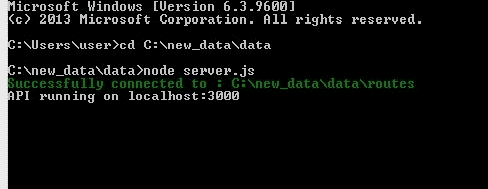
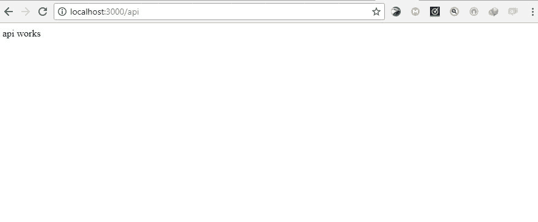
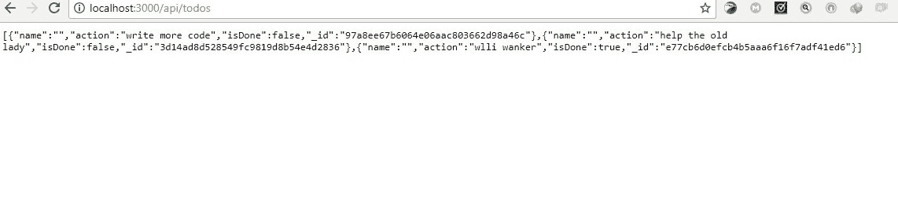
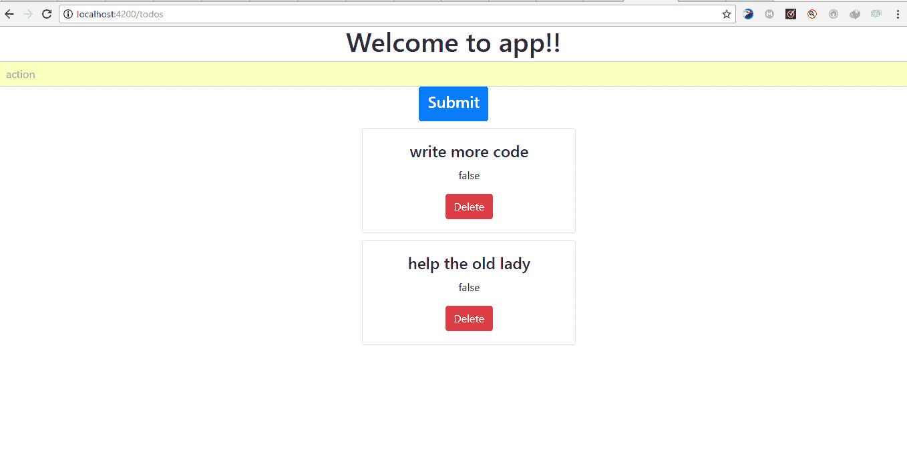

# 第十一章：使用真实托管的数据

现代 Web 应用程序通常是数据驱动的。我们经常需要从各种资源中创建、读取、更新和删除数据，或者消费 API。Angular 让我们能够轻松地从外部资源中获取数据，以供我们的组件使用。

Angular 提供了一个简单的 HTTP API，为我们的应用程序提供了 HTTP 功能。它建立在现代浏览器暴露的原生 XMLHttpRequest 接口之上，我们可以执行任何这些 HTTP 操作：

+   Get：从资源中请求数据

+   Post：提交数据到资源

+   Put：修改资源中的数据

+   Delete：删除指定的资源

在本章中，我们将学习如何使用 Angular 来消费 API，并使我们的应用程序成为数据驱动的。

# Observables

**Observables**，类似于 promises，帮助处理应用程序中的异步事件。Observables 和 promises 之间的关键区别在于：

+   Observables 可以处理多个值，而 promises 只能调用一次并返回一个值

+   Observables 是可取消的，而 promises 不是

为了使用 Observables，Angular 利用了**JavaScript 的响应式扩展**（**RxJs**）Observables 库。Angular 在处理 HTTP 请求和响应时广泛使用 Observables；我们将在本章中更多地了解它们。

# HTTP 模块

要开始在组件中使用 HTTP，你需要在应用程序模块中安装提供它的`HttpModule`。首先，导入这个模块：

```ts
import { HttpModule } from '@angular/http';
```

接下来，你需要在应用程序模块中的导入数组中包含这个模块，就在`BrowserModule`之后：

```ts
// app.module.ts
@NgModule({
imports: [
BrowserModule,
HttpModule,
],
})
```

# 构建一个简单的 todo 演示应用

让我们构建一个简单的`todo`应用程序，以更好地理解如何在 Angular 应用程序中处理数据。

Angular-CLI 将被用来快速搭建应用程序。应用程序的 API 将使用 Express.js 构建，我们的 Angular 应用程序将连接到这个 API 来 CRUD todo 数据。

# 项目设置

使用 CLI 创建一个新项目：

```ts
ng new [project name]
```

`ng new`命令创建一个新的 angular 应用程序

# 构建 API

从命令行通过 npm 安装 express、body-parser 和 cors 作为依赖项：

```ts
npm install express body-parser cors
```

如果你使用 npm 5，你不需要在`package.json`文件中指定`-S`或`--save`标志来保存为依赖项。

接下来，我们将在 Angular 项目的根文件夹中创建一个`server.js`文件，其中将包含我们所有的 API 逻辑：

```ts
// server.js
const express = require('express');
const path = require('path');
const http = require('http');
const bodyParser = require('body-parser');
const cors = require('cors');
const app = express();
// Get API routes
const route = require('./routes/index');
// Parser for POST data
app.use(bodyParser.json());
app.use(bodyParser.urlencoded({ extended: false }));
// Use CORS
app.use(cors());
// Declare API routes
app.use('/api', route);
/**
* Get port from environment. Default is 3000
*/
const port = process.env.PORT || '3000';
/**
* Create HTTP server.
*/
const server = http.createServer(app);
/**
* Listen on port
*/
app.listen(port, function () {
console.log(`API running on port ${port}`)
} );
```

这个文件使用了 ES6 的新版本，所以你应该注意一些情况，你的代码编辑器可能不会立即识别它。

`/api` 路由指向 `./routes/index.js` 文件，但我们还没有它。在下一步中，我们将创建它。仍然在 `root` 目录中，创建一个名为 `routes` 的文件夹，在其中创建一个名为 `index.js` 的文件：

```ts
// routes/index.js
const express = require('express');
// create a new router object
const router = express.Router();
/* GET api listing. */
router.get('/', (req, res) => {
res.send('api works');
});
module.exports = router;
```

要启动服务器，请输入以下命令：

```ts
node server.js
```

当服务器开始运行时，这是输出：



在这里我们可以看到服务器正在运行，并且监听在 3000 端口上。

打开浏览器并访问 `localhost:3000/api/`：



如果您可以在前面的图像中看到响应，那么 API 是有效的。现在我们可以引入更复杂的逻辑，这样我们就有实际的数据可以使用了。

# 安装 diskdb

**Diskdb** 是一个轻量级的基于磁盘的 JSON 数据库，具有类似于 Node 的 MongoDB API。我们可以使用以下命令安装 diskdb：

```ts
npm install diskdb
```

在目录的根目录创建一个 `todos.json` 文件。这个文件将作为我们的数据库集合，其中包含我们的待办事项。您可以在这里了解更多关于 diskdb 的信息 [`www.npmjs.com/package/diskdb`](https://www.npmjs.com/package/diskdb)。

# 更新 API 端点

让我们更新 `routes/index.js` 文件，使用新的逻辑来处理我们的 todos：

```ts
// routes/index.js
const express = require('express');
const router = express.Router();
// require diskdb
const db = require('diskdb');
db.connect(__dirname, ['todos']);
// store Todo
router.post('/todo', function(req, res, next) {
var todo = req.body;
if (!todo.action || !(todo.isDone + '')) {
res.status(400);
res.json({
error: 'bad data'
});
} else {
db.todos.save(todo);
res.json(todo);
}
});
// get Todos
router.get('/todos', function(req, res, next) {
const todos = db.todos.find();
res.json(todos);
});
// update Todo
router.put('/todo/:id', function(req, res, next) {
const todo = req.body;
db.todos.update({_id: req.params.id}, todo);
res.json({ msg: `${req.params.id} updated`});
});
// delete Todo
router.delete('/todo/:id', function(req, res, next) {
db.todos.remove({
_id: req.params.id
});
res.json({ msg: `${req.params.id} deleted` });
});
module.exports = router;
```

在前面的代码中，我们能够使用 `get`、`post`、`put` 和 `delete` 端点更新我们的 API。

接下来，我们将用一些数据填充我们的数据库。更新 `todos.json` 文件：

```ts
[{
"action":"write more code",
"isDone":false,"
_id":"97a8ee67b6064e06aac803662d98a46c"
},{
"action":"help the old lady",
"isDone":false,"
_id":"3d14ad8d528549fc9819d8b54e4d2836"
},{
```

```ts
"action":"study",
"isDone":true,"
_id":"e77cb6d0efcb4b5aaa6f16f7adf41ed6"
}]
```

现在我们可以重新启动服务器并访问 `localhost:3000/api/todos` 来查看我们的 API 在运行中：

从数据库中获取的待办事项列表。

# 创建一个 Angular 组件

接下来，我们将创建一个 `todo` 组件。我们可以使用 Angular-CLI 轻松完成这个命令：

```ts
ng generate component todos
```

这将生成以下文件：`todos.component.ts`、`todos.component.html` 和 `todos.component.ts`。todos 组件也会自动导入到 `app.module.ts` 中。

```ts
// app.module.ts
import { BrowserModule } from '@angular/platform-browser';
import { NgModule } from '@angular/core';
import { AppComponent } from './app.component';
import { TodosComponent } from './todos/todos.component';
@NgModule({
declarations: [
AppComponent,
TodosComponent
],
imports: [
BrowserModule
],
providers: [],
bootstrap: [AppComponent]
})
export class AppModule { }
```

我们应该确保在 `src/index.html` 的头标签中添加 `<base href="/">`。这是为了告诉路由器如何组合导航 URL。当我们使用 Angular-CLI 生成 angular 项目时，`index.html` 文件会自动创建：

```ts
<!-- index.html -->
<!doctype html>
<html lang="en">
<head>
<meta charset="utf-8">
<title>Data</title>
<base href="/">
<meta name="viewport" content="width=device-width, initial-scale=1">
<link rel="icon" type="image/x-icon" href="favicon.ico">
</head>
<body>
<app-root></app-root>
</body>
</html>
```

# 创建应用程序路由

接下来，我们将创建一个 `/todos` 路由，并让我们的应用程序默认重定向到它。

首先，从 `@angular/router` 导入 `RouterModule` 并将其添加到 `AppModule` 的导入数组中：

```ts
import { RouterModule } from '@angular/router';
...
imports: [
...
RouterModule.forRoot(ROUTES)
],
```

在 `ngModule` 声明的上方创建一个 `ROUTES` 数组，并将以下路由定义添加到其中：

```ts
const ROUTES = [
{
path: '',
redirectTo: 'todos',
pathMatch: 'full'
},
{
path: 'todos',
component: TodosComponent
}
]
```

在`app.component.html`文件中，让我们在想要渲染路由的地方添加一个 router-outlet：

```ts
<div style="text-align:center">
<h1>
Welcome to {{ title }}!
</h1>
<router-outlet></router-outlet>
```

# 创建一个 todos 服务

接下来，我们将创建一个服务，用于处理调用并将我们的组件连接到 express API。使用 Angular-CLI 生成服务：

```ts
ng generate service todos
```

服务已经创建但未注册——要在我们的应用中注册它，我们需要将它添加到主应用模块的 providers 部分。

Angular-CLI 不会自动注册服务。

将 TodosService 添加到 providers 数组中：

```ts
import {TodosService} from './todos.service';
...
providers: [TodosService],
...
})
export class AppModule { }
```

现在，在我们的服务中，我们将发起 HTTP 调用到 express 服务器来执行我们的 CRUD 操作。首先，我们将导入`HTTP`、`Headers`和`rxjs/add/operator/map`：

```ts
import { Injectable } from '@angular/core';
import { Http, Headers} from '@angular/http';
import 'rxjs/add/operator/map';
@Injectable()
export class TodosService {
// constructor and methods to execute the crud operations will go in here
}
```

定义一个构造函数并注入 HTTP 服务：

```ts
import { Injectable } from '@angular/core';
import { Http, Headers } from '@angular/http';
import 'rxjs/add/operator/map';
@Injectable()
export class TodosService {
constructor(private http: Http) {}
}
Next, we will define a method that will fetch all todos from the API. Updating todos.service.ts:
// todo.service.ts
...
export class TodosService {
isDone: false;
constructor(private http: Http) {}
// Get all todos
getTodos() {
return this.http
.get('http://localhost:3000/api/todos')
.map(res => res.json());
}
}
```

在上述代码中，我们利用`HttpModule`发起了一个简单的`get`请求到我们的 API 以检索 Todos 列表。然后将请求的响应以 JSON 格式返回。

接下来，我们将编写一个存储 todo 项目的方法，名为`addTodos()`。这个方法将用于发起存储 todos 的 post 请求。

```ts
// todo.service.ts
...
addTodos(todo) {
let headers = new Headers();
headers.append('Content-Type', 'application/json');
return this.http
.post('http://localhost:3000/api/todo', JSON.stringify(todo), { headers })
.map(res => res.json());
}
}
```

在上述代码中，我们设置了新的头部，并将`Content-Type`设置为告诉服务器它将接收什么类型的内容（`'application/json'`）。

我们利用`http.post()`方法发起了一个 post 请求。参数`JSON.stringify(todo)`表示我们要将新的 todo 以 JSON 编码的字符串形式发送。最后，我们可以以 JSON 格式返回 API 的响应。

接下来，我们将定义一个名为`deleteTodo()`的删除方法。这个方法将用于发起删除请求。这使我们能够从 todos 列表中删除 todos。再次更新`todos.service.ts`：

```ts
import { Injectable } from '@angular/core';
import { Http, Headers } from '@angular/http';
import 'rxjs/add/operator/map';
@Injectable()
export class TodosService {
constructor(private http: Http) {}
getTodos() {
return this.http
.get('http://localhost:3000/api/todos')
.map(res => res.json());
}
addTodos(todo) {
let headers = new Headers();
headers.append('Content-Type', 'application/json');
return this.http
.post('http://localhost:3000/api/todo', JSON.stringify(todo), { headers })
.map(res => res.json());
}
deleteTodo(id) {
return this.http
.delete(`http://localhost:3000/api/todo/${id}`)
.map(res => res.json());
}
}
```

在上述代码中，我们定义了`deleteTodo()`方法，它以要删除的帖子的`id`作为唯一参数。这个方法发起了一个删除请求到 API，从数据库中移除指定的 todo。API 的响应也以 JSON 格式返回。

最后，我们将定义一个名为`updateStatus()`的方法。这个方法将用于发起一个`put`请求来改变 todos 项目的状态。

```ts
import { Injectable } from '@angular/core';
import { Http, Headers } from '@angular/http';
import 'rxjs/add/operator/map';
@Injectable()
export class TodosService {
isDone: false;
constructor(private http: Http) {}
getTodos() {
return this.http
.get('http://localhost:3000/api/todos')
.map(res => res.json());
}
addTodos(todo) {
let headers = new Headers();
headers.append('Content-Type', 'application/json');
return this.http
.post('http://localhost:3000/api/todo', JSON.stringify(todo), { headers })
.map(res => res.json());
}
deleteTodo(id) {
return this.http
.delete(`http://localhost:3000/api/todo/${id}`)
.map(res => res.json());
}
updateStatus(todo) {
let headers = new Headers();
headers.append('Content-Type', 'application/json');
return this.http
.put('http://localhost:3000/api/todo/' + todo._id, JSON.stringify(todo), {
headers: headers
})
.map(res => res.json());
}
}
```

在上述代码中，我们创建了一个`updateStatus()`方法，它类似于`addTodos()`方法。不同之处在于`updateStatus()`方法发起了一个`put`请求。我们还将`todo._id`连接到被调用的 API 端点上。这使我们能够修改 todos 列表中单个项目的状态。

请记住，我们在我们的服务中使用了 HTTP API，因此，我们应该在`app.module.ts`中导入`HttpModule`并将其包含在导入数组中：

```ts
import {HttpModule} from '@angular/http';
...
imports: [
HttpModule,
BrowserModule,
RouterModule.forRoot(ROUTES)
],
...
```

# 将服务与我们的 todos 组件连接起来

首先，我们必须在 todos 组件中导入 todos 服务：

```ts
import {TodosService} from '../todos.service';
```

然后在组件的构造函数中添加`TodosService`类：

```ts
constructor(private todoService: TodosService) { }
```

现在，我们将使用 todo 服务来`获取`、`创建`、`删除`和`更新`todos。

这就是我们的 todos 组件应该看起来的样子：

```ts
import { Component, OnInit } from '@angular/core';
import { TodosService } from '../todos.service';
@Component({
selector: 'app-todos',
templateUrl: './todos.component.html',
styleUrls: ['./todos.component.css']
})
export class TodosComponent implements OnInit {
//define data types
todos: any = [];
todo: any;
action: any;
name: any;
isDone: boolean;
constructor(private todoService: TodosService) {}
ngOnInit() {
this.todoService.getTodos().subscribe(todos => {
this.todos = todos;
});
}
addTodos(event) {
event.preventDefault();
let newTodo = {
name: this.name,
action: this.action,
isDone: false
};
this.todoService.addTodos(newTodo).subscribe(todo => {
this.todos.push(todo);
this.name = '';
this.action = '';
});
}
deleteTodo(id) {
let todos = this.todos;
this.todoService.deleteTodo(id).subscribe(data => {
const index = this.todos.findIndex(todo => todo._id == id);
todos.splice(index, 1)
});
}
updateStatus(todo) {
var _todo = {
_id: todo._id,
action: todo.action,
isDone: !todo.isDone
};
this.todoService.updateStatus(_todo).subscribe(data => {
const index = this.todos.findIndex(todo => todo._id == _todo._id)
this.todos[index] = _todo;
});
}
choice(todo) {
console.log(todo);
return todo.isDone;
}
}
```

我们刚刚启用了服务和组件之间的通信。`component.ts`文件现在可以使用服务和其中的方法。

现在我们已经连接了服务和组件，我们必须在`todos.component.html`中在浏览器中显示 todos 操作。

# 实现视图

为了显示 todos，我们将使用：

+   Angular 的`*ngFor`指令，它遍历 todos 数组，并为该数组中的每个 todo 呈现此模板的一个实例

+   Angular 的插值绑定语法，`{{}}`

更新`todos.component.html`：

```ts
<div class="container">
<form (submit) = "addTodos($event)">
<input type="text"
class="form-control" placeholder="action"
[(ngModel)] ="action" name="action">
<button type="submit"><h4>Submit</h4></button>
</form>
<div *ngFor="let todo of todos">
<div class="container">
<p (click)="updateStatus(todo)" [ngStyle]="{ 'text-decoration': todo.isDone ? 'line-through' : ''}" >Action: {{todo.action}}</p>
{{todo.isDone}}
<button (click) ="deleteTodo(todo._id)" >Delete</button>
</div>
</div>
</div>
```

为了让我们的应用看起来更好，我们将使用 bootstrap。**Bootstrap**是一个强大的前端框架，用于创建网页和用户界面组件，如表单、模态框、手风琴、轮播和选项卡：

```ts
<!-- Index.html --&gt;
<!doctype html>
<html lang="en">
<head>
<link rel="stylesheet" href="https://maxcdn.bootstrapcdn.com/bootstrap/4.0.0-beta/css/bootstrap.min.css" integrity="sha384-/Y6pD6FV/Vv2HJnA6t+vslU6fwYXjCFtcEpHbNJ0lyAFsXTsjBbfaDjzALeQsN6M" crossorigin="anonymous">
<meta charset="utf-8">
<title>Data</title>
<base href="/">
<meta name="viewport" content="width=device-width, initial-scale=1">
<link rel="icon" type="image/x-icon" href="favicon.ico">
</head>
<body>
<app-root></app-root>
</body>
</html>
```

更新`todos.component.html`：

```ts
<form (submit) = "addTodos($event)">
<input type="text" class="form-control" placeholder="action" [(ngModel)] ="action" name="action">
<button class="btn btn-primary" type="submit"><h4>Submit</h4></button>
</form>
<div class="card pos" style="width: 20rem;" *ngFor="let todo of todos">
<div class="card-body">
<h4 class="card-title" (click)="updateStatus(todo)" [ngStyle]="{ 'text-decoration': todo.isDone ? 'line-through' : ''}">{{todo.action}}</h4>
<p class="card-text">{{todo.isDone}}</p>
<button (click) ="deleteTodo(todo._id)" class="btn btn-danger">Delete</button>
</div>
</div>
We'll also update app.component.css file to add some optional extra styling.
// app.component.css
.isDone{
text-decoration: line-through;
}
.pos{
margin-left: 40%;
margin-top: 10px;
}
```

打开命令行/终端并导航到项目文件夹。运行`node server.js`启动服务器。在`project`文件夹中打开另一个终端窗口，并运行`ng serve`来提供 Angular 应用。

打开浏览器并访问`localhost:4200`。这就是结果应该看起来像以下截图：



我们已成功创建了一个 todo 应用，通过服务向 node 服务器发出 HTTP 请求，然后通过组件将结果呈现到 DOM 中。您可以添加一个 todo，删除一个 todo，获取所有 todos，当您点击一个 todo 时，布尔值会改变，并且在特定的 todo 上出现删除线。当您重新加载浏览器时，您可以看到对 todo 列表所做的更改是持久的。

让我们简要回顾一下我们所做的一切：

+   首先，我们使用 Angular-CLI 创建了一个 Angular 应用

+   然后我们创建了一个服务器文件，在那里我们需要我们的依赖项，创建了一个 express 应用程序，设置了我们的 API 路由，声明了一个端口供我们的服务器监听，添加了用于 post 数据的解析器，等等

+   然后我们定义了我们的数据源，这是一个与**diskdb**通信的 todos 的`.json`文件

+   创建一个 Angular 组件

+   创建一个具有`get`、`post`、`put`和`delete`方法的服务，用于与 REST API 通信

让我们看另一个例子。我们将创建一个简单的应用程序，显示用户列表以及他们的电子邮件和电话号码。用户还将具有一个真假状态，指示他们是否可用或不可用。

# 使用 Angular 构建用户目录

我们即将构建的应用程序将具有一个 REST API，在本示例的过程中将创建该 API。在这个简单的例子中，我们将创建一个“用户”应用程序，这将是非常简单的。该应用程序基本上将是一个包含用户列表及其电子邮件地址和电话号码的表格。表中的每个用户都将具有一个*active*状态，其值为布尔值。我们将能够将特定用户的*active*状态从 false 更改为 true，反之亦然。该应用程序将使我们能够添加新用户，还可以从表中删除用户。与上一个例子一样，diskDB 将用作此示例的数据库。我们将有一个 Angular 服务，其中包含负责与 REST 端点通信的方法。这些方法将负责向 REST API 发出`get`、`post`、`put`和`delete`请求。服务中的第一个方法将负责向 API 发出`get`请求。这将使我们能够从后端检索所有用户。接下来，我们将有另一个方法，该方法将向 API 发出`post`请求。这将使我们能够将新用户添加到现有用户数组中。

接下来的方法将负责向 API 发出“删除”请求，以便删除用户。最后，我们将有一个方法，该方法将向 API 发出`put`请求。这将是赋予我们编辑/修改用户状态的能力的方法。为了向 REST API 发出这些请求，我们将不得不使用 HttpModule。本节的目的是巩固您对 HTTP 的知识。作为 JavaScript 和实际上是 Angular 开发人员，您几乎总是需要与 API 和 Web 服务器进行交互。今天开发人员使用的许多数据都是以 API 的形式存在的，为了与这些 API 进行交互，我们需要不断地使用 HTTP 请求。事实上，HTTP 是 Web 数据通信的基础。

# 创建一个新的 Angular 应用程序

如前所示，要启动一个新的 Angular 应用程序，请运行以下命令：

```ts
ng new user
```

这创建了 Angular 2 用户应用程序。

安装以下依赖项：

+   表达

+   Body-parser

+   Cors

```ts
npm install express body-parser cors --save
```

# 创建一个 Node 服务器

在项目目录的根目录创建一个名为`server.js`的文件。这将是我们的 node 服务器。

使用以下代码块填充`server.js`：

```ts
// Require dependencies
const express = require('express');
const path = require('path');
const http = require('http');
const cors = require('cors');
const bodyParser = require('body-parser');
// Get our API routes
const route = require('./route');
const app = express();
app.use(bodyParser.json());
app.use(bodyParser.urlencoded({ extended: false }));
// Use CORS
app.use(cors());
// Set our api routes
app.use('/api', route);
/**
* Get port from environment.
*/
const port = process.env.PORT || '3000';
/**
* Create HTTP server.
*/
const server = http.createServer(app);
//Listen on provided port
app.listen(port);
console.log('server is listening');
```

这里正在发生的事情非常简单：

+   我们需要并使用了依赖项

+   我们定义并设置了 API 路由

+   为我们的服务器设置一个端口

API 路由正在从`./route`中被引用，但这个路径还不存在。让我们快速创建它。

在项目目录的根目录，创建一个名为`route.js`的文件。这是 API 路由将被创建的地方。我们需要有一个数据库形式，从中我们可以获取、发布、删除和修改数据。

就像在之前的例子中一样，我们将使用 diskdb。路由将基本上与第一个例子中的模式相同。

# 安装 diskDB

在项目文件夹中运行以下命令以安装 diskdb：

```ts
npm install diskdb
```

在项目目录的根目录创建一个名为`users.json`的文件，作为我们的数据库集合，其中包含我们用户的详细信息。

使用以下内容填充`users.json`：

```ts
[{"name": "Marcel", "email": "test1@gmail.com", "phone_number":"08012345", "isOnline":false}]
```

现在，更新`route.js`。

```ts
route.js
const express = require('express');
const router = express.Router();
const db = require('diskdb');
db.connect(__dirname, ['users']);
//save
router.post('/users', function(req, res, next) {
var user = req.body;
if (!user.name && !(user.email + '') && !(user.phone_number + '') && !(user.isActive + '')) {
res.status(400);
res.json({
error: 'error'
});
} else {
console.log('ds');
db.users.save(todo);
res.json(todo);
}
});
//get
router.get('/users', function(req, res, next) {
var foundUsers = db.users.find();
console.log(foundUsers);
res.json(foundUsers);
foundUsers = db.users.find();
console.log(foundUsers);
});
//updateUsers
router.put('/user/:id', function(req, res, next) {
var updUser = req.body;
console.log(updUser, req.params.id)
db.users.update({_id: req.params.id}, updUser);
res.json({ msg: req.params.id + ' updated' });
});
//delete
router.delete('/user/:id', function(req, res, next) {
console.log(req.params);
db.users.remove({
_id: req.params.id
});
res.json({ msg: req.params.id + ' deleted' });
});
module.exports = router;
```

我们已经创建了一个 REST API，使用 diskDB 作为数据库的 API 路由。

使用以下命令启动服务器：

```ts
node server.js
```

服务器正在运行，并且正在监听分配的端口。现在，打开浏览器并转到`http://localhost:3000/api/users`。

在这里，我们可以看到我们输入到`users.json`文件中的数据。这表明我们的路由正在工作，并且我们正在从数据库中获取数据。

# 创建一个新组件

运行以下命令创建一个新组件：

```ts
ng g component user
```

这创建了`user.component.ts`、`user.component.html`、`user.component.css`和`user.component.spec.ts`文件。`User.component.spec.ts`用于测试，因此我们在本章中不会使用它。新创建的组件会自动导入到`app.module.ts`中。我们必须告诉根组件有关用户组件。我们将通过将选择器从`user.component.ts`导入到根模板组件（`app.component.html`）来实现这一点：

```ts
<div style="text-align:center">
<app-user></app-user>
</div>
```

# 创建一个服务

下一步是创建一个与我们之前创建的 API 交互的服务：

```ts
ng generate service user
```

这创建了一个名为`user.service.ts`的用户服务。接下来，将`UserService`类导入`app.module.ts`并将其包含在 providers 数组中：

```ts
Import rxjs/add/operator/map in the imports section.
import { Injectable } from '@angular/core';
import { Http, Headers } from '@angular/http';
import 'rxjs/add/operator/map';
Within the UserService class, define a constructor and pass in the angular 2 HTTP service.
import { Injectable } from '@angular/core';
import { Http, Headers } from '@angular/http';
import 'rxjs/add/operator/map';
@Injectable()
export class UserService {
constructor(private http: Http) {}
}
```

在服务类中，编写一个发出 `get` 请求以从 API 获取所有用户及其详细信息的方法：

```ts
getUser() {
return this.http
.get('http://localhost:3000/api/users')
.map(res => res.json());
}
```

编写一个发出 `post` 请求并创建新待办事项的方法：

```ts
addUser(newUser) {
var headers = new Headers();
headers.append('Content-Type', 'application/json');
return this.http
.post('http://localhost:3000/api/user', JSON.stringify(newUser), {
headers: headers
})
.map(res => res.json());
}
```

编写另一个发出 `delete` 请求的方法。这将使我们能够从用户集合中删除用户：

```ts
deleteUser(id) {
return this.http
.delete('http://localhost:3000/api/user/' + id)
.map(res => res.json());
}
```

最后，编写一个发出 `put` 请求的方法。这个方法将使我们能够修改用户的状态：

```ts
updateUser(user) {
var headers = new Headers();
headers.append('Content-Type', 'application/json');
return this.http
.put('http://localhost:3000/api/user/' + user._id, JSON.stringify(user), {
headers: headers
})
.map(res => res.json());
}
```

更新 `app.module.ts` 以导入 `HttpModule` 和 `FormsModule` 并将它们包含到导入数组中：

```ts
import { HttpModule } from '@angular/http';
import { FormsModule } from '@angular/forms';
.....
imports: [
.....
HttpModule,
FormsModule
]
```

接下来要做的是教会用户组件使用服务：

```ts
Import UserService in user.component.ts.
import {UserService} from '../user.service';
Next, include the service class in the user component constructor.
constructor(private userService: UserService) { }.
Just below the exported UserComponent class, add the following properties and define their data types:
users: any = [];
user: any;
name: any;
email: any;
phone_number: any;
isOnline: boolean;
```

现在，我们可以在用户组件中使用用户服务的方法。

# 更新 user.component.ts

在 `ngOnInit` 方法中，使用用户服务从 API 中获取所有用户：

```ts
ngOnInit() {
this.userService.getUser().subscribe(users => {
console.log(users);
this.users = users;
});
}
```

在 `ngOnInit` 方法下面，编写一个使用用户服务中的 `post` 方法添加新用户的方法：

```ts
addUser(event) {
event.preventDefault();
var newUser = {
name: this.name,
email: this.email,
phone_number: this.phone_number,
isOnline: false
};
this.userService.addUser(newUser).subscribe(user => {
this.users.push(user);
this.name = '';
this.email = '';
this.phone_number = '';
});
}
```

让我们使用用户服务中的 `delete` 方法来使我们能够删除用户：

```ts
deleteUser(id) {
var users = this.users;
this.userService.deleteUser(id).subscribe(data => {
console.log(id);
const index = this.users.findIndex(user => user._id == id);
users.splice(index, 1)
});
}
```

最后，我们将使用用户服务向 API 发出 `put` 请求：

```ts
updateUser(user) {
var _user = {
_id: user._id,
name: user.name,
email: user.email,
phone_number: user.phone_number,
isActive: !user.isActive
};
this.userService.updateUser(_user).subscribe(data => {
const index = this.users.findIndex(user => user._id == _user._id)
this.users[index] = _user;
});
}
```

我们与 API、服务和组件之间的所有通信都已经完成。我们必须更新 `user.component.html`，以便在浏览器中说明我们所做的一切。

我们将使用 bootstrap 进行样式设置。因此，我们必须在 `index.html` 中导入 bootstrap CDN：

```ts
<!doctype html>
<html lang="en">
<head>
//bootstrap CDN
<link rel="stylesheet" href="https://maxcdn.bootstrapcdn.com/bootstrap/4.0.0-beta/css/bootstrap.min.css" integrity="sha384-/Y6pD6FV/Vv2HJnA6t+vslU6fwYXjCFtcEpHbNJ0lyAFsXTsjBbfaDjzALeQsN6M" crossorigin="anonymous">
<meta charset="utf-8">
<title>User</title>
<base href="/">
<meta name="viewport" content="width=device-width, initial-scale=1">
<link rel="icon" type="image/x-icon" href="favicon.ico">
</head>
<body>
<app-root></app-root>
</body>
</html>
```

# 更新 user.component.html

以下是用户组件的组件模板：

```ts
<form class="form-inline" (submit) = "addUser($event)">
<div class="form-row">
<div class="col">
<input type="text" class="form-control" [(ngModel)] ="name" name="name">
</div>
<div class="col">
<input type="text" class="form-control" [(ngModel)] ="email" name="email">
</div>
<div class="col">
<input type="text" class="form-control" [(ngModel)] ="phone_number" name="phone_number">
</div>
</div> <br>
<button class="btn btn-primary" type="submit" (click) = "addUser($event)"><h4>Add User</h4></button>
</form>
<table class="table table-striped" >
<thead>
<tr>
<th>Name</th>
<th>Email</th>
<th>Phone_Number</th>
<th>Active</th>
</tr>
</thead>
<tbody *ngFor="let user of users">
<tr>
<td>{{user.name}}</td>
<td>{{user.email}}</td>
<td>{{user.phone_number}}</td>
<td>{{user.isActive}}</td>
<td><input type="submit" class="btn btn-warning" value="Update Status" (click)="updateUser(user)" [ngStyle]="{ 'text-decoration-color:': user.isActive ? 'blue' : ''}"></td>
<td><button (click) ="deleteUser(user._id)" class="btn btn-danger">Delete</button></td>
</tr>
</tbody>
</table>
```

在上述代码中发生了很多事情，让我们深入了解代码块：

+   我们有一个表单，其中包含三个输入和一个提交按钮，当点击时会触发 `addUser()` 方法

+   还有一个删除按钮，当点击时会触发 `delete` 方法

+   还有一个更新状态输入元素，当点击时会触发 `updateUser()` 方法

+   我们创建了一个表格，其中将使用 Angular 的 `*ngFor` 指令和 Angular 的插值绑定语法 `{{}}` 来显示用户的详细信息

项目将添加一些额外的样式。转到 `user.component.css` 并添加以下内容：

```ts
form{
margin-top: 20px;
margin-left: 20%;
size: 50px;
}
table{
margin-top:20px;
height: 50%;
width: 50%;
margin-left: 20%;
}
button{
margin-left: 20px;
}
```

# 运行应用程序

打开两个命令行界面/终端。在两者中都导航到项目目录。在其中一个中运行 `node server.js` 启动服务器。在另一个中运行 `ng serve` 来提供 Angular 2 应用程序。

打开浏览器并转到 `localhost:4200`。

在这个简单的用户应用程序中，我们可以执行所有的 CRUD 操作。我们可以创建新用户，获取用户，删除用户，并更新用户的状态。

默认情况下，新添加用户的活动状态为 false。可以通过点击更改状态按钮来更改。

# 摘要

在开发任何应用程序时，使用来自数据库或 API 的实际数据非常重要。HTTP 与可观察对象和 Rxjs 使得可以从 API 中使用所需的数据集，并执行所有 CRUD 操作。

在下一章中，我们将看一下编写单元测试和调试。
