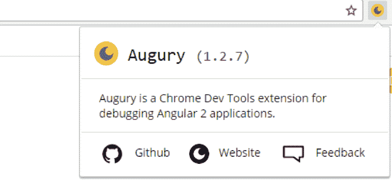
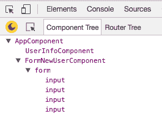
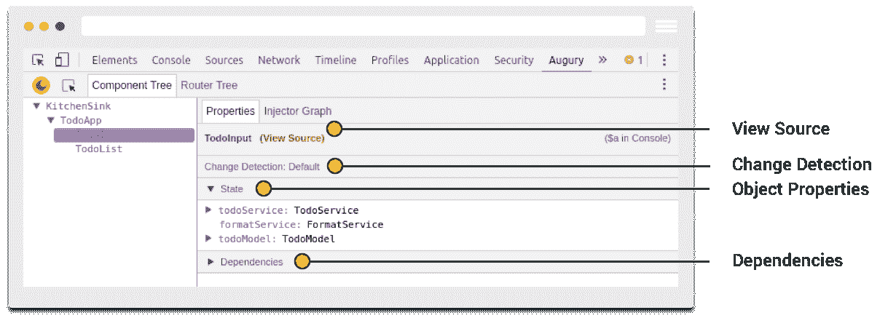
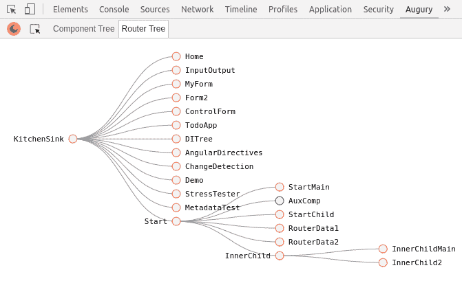
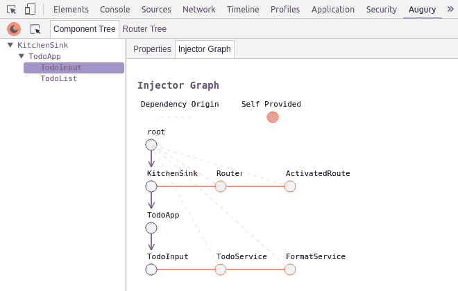

# 第十二章：测试和调试

测试对于构建可投入生产的应用程序至关重要。在单元测试中，我们独立于外部来源测试组件，以确保其按预期工作。Angular 2 自带了测试功能。在本章中，我们将查看对以下元素执行单元测试：

+   组件

+   服务

+   管道

+   指令

# Angular 2 测试工具

在 Angular 2 中用于辅助测试的一些工具如下：

+   茉莉花

+   Karma

+   Protractor

+   Angular 2 测试平台

让我们更深入地了解每一个。

# 茉莉花

Jasmine 是一个开源的测试框架。它使用行为驱动的符号，带来了改进的测试。

# 茉莉花的主要概念

在我们深入实际测试案例之前，这里有一些您应该了解的 Jasmine 概念：

+   **套件**：这些是由`describe`块编写和描述的。它们以函数的形式出现。

+   **规范定义**：`it（string，function）`函数。此函数的主体包含实际的断言。

+   **期望**：这些是评估为布尔值的断言。这用于查看输入是否等于预期值。

+   **匹配器**：这些是常见断言的辅助工具，例如，`toBe`（expected），`toEqual`（expected）。

# Karma

Karma 是由 Angular 团队创建的 JavaScript 测试运行器。Karma 可以成为项目的持续集成过程的一部分，也可以成为其开发的一部分。

# Protractor

Protractor 是用于 Angular 应用的端到端测试框架。使用 Protractor，您可以设置期望并根据我们的假设进行测试。顾名思义，端到端测试不仅确保系统自身正常工作，还验证其与外部系统的功能。它们探索应用程序的最终用户体验。

# Angular 测试平台

Angular 测试平台用于测试类与 Angular 和 DOM 的交互。Angular 测试平台使我们能够检查类的实例，而不依赖于 Angular 或注入的值。

在本章中，我们将专注于 Jasmine 和 Karma 进行测试。

当使用 Angular-CLI 创建新项目时，将创建包含使用 Protractor 的端到端测试的`e2e`文件夹，以及`karma.conf.js`和`protractor.conf.js`文件，这些是 Karma 和 Protractor 测试的配置文件。

# 使用 Karma（与 Jasmine 一起）

使用 Karma，您可以在运行应用程序时测试您的代码，因为 Karma 为测试创建了一个浏览器环境。除了您的浏览器，您还可以在其他设备上测试您的代码，比如手机和平板电脑。

Jasmine 是用于测试 JavaScript 代码的行为驱动开发框架。Jasmine 无需依赖，不需要 DOM，并经常与 Karma 一起使用。我们现在将继续创建一个新项目并测试其元素。

# 创建一个新项目

我们将使用以下命令创建一个名为`Angular-test`的新项目：

```ts
ng new Angular-test
```

# 安装 Karma CLI

要安装 Karma CLI，请输入以下命令：

```ts
npm install -g karma-cli
```

我们的测试将在`.spec.ts`文件中执行。在`./app/`文件夹中创建一个新的测试文件（`sampletest.spec.ts`）并复制以下内容：

```ts
// ./app/sampletest.spec.ts
describe('Sample Test', () => {
 it('true is true', () => expect(true).toBe(true));
 });

 import {AppComponent} from './app.component';

 describe('AppComponent', () => {
 beforeEach(function() {
 this.app = new AppComponent();
 });

 it('should have hello property', function() {
 expect(this.app.hello).toBe('Hello, World!');
 });
 });
```

在上述代码中，我们首先编写一个示例测试来展示 Jamine 中的主要概念。我们创建一个测试套件，定义我们的测试套件，并编写期望。在示例测试中，我们进行了一个简单的检查，看看`true`是否与`true`相同。

我们还为`AppComponent`编写了一个简单的测试。我们期望该组件具有一个`hello`属性，其值等于`Hello, World`。让我们通过更新`app.component.ts`来确保测试通过：

```ts
private hello: string = 'Hello, World!';
```

通过创建带有`.spec.ts`扩展名的文件，我们满足了 Karma 的配置要求。

您也可以测试多个组件。例如，当您通过 Angular CLI 创建新组件时，它会自动为组件创建测试文件（`.spec.ts`），这些文件只是测试组件是否与其他组件正确配合工作。对于 Angular 来说，惯例是为每个`.ts`文件都有一个`.spec.ts`文件。当您使用`ng test`命令时，这些文件将通过 Karma 任务运行器使用 Jasmine JavaScript 测试框架运行。

# 配置 Karma

为了配置我们的 Karma，我们需要更新`karma.conf.js`文件。默认文件的内容如下：

```ts
// ./karma.conf.js.
module.exports = function (config) {
 config.set({
 basePath: '',
 frameworks: ['jasmine', 'angular-cli'],
 plugins: [
 require('karma-jasmine'),
 require('karma-chrome-launcher'),
 require('karma-remap-istanbul'),
 require('angular-cli/plugins/karma')
 ],
 files: [
 { pattern: './src/test.ts', watched: false }
 ],
 preprocessors: {
 './src/test.ts': ['angular-cli']
 },
 remapIstanbulReporter: {
 reports: {
 html: 'coverage',
 lcovonly: './coverage/coverage.lcov'
 }
 },
 angularCli: {
 config: './angular-cli.json',
 environment: 'dev'
 },
 reporters: ['progress', 'karma-remap-istanbul'],
 port: 9876,
 colors: true,
 logLevel: config.LOG_INFO,
 autoWatch: true,
 browsers: ['PhantomJS'],
 singleRun: false
 });
 };
```

在这里，我们展示了将使用 PhantomJS 浏览器；将使用 Jasmine 测试框架和 Webpack 进行文件捆绑。

# 测试组件

组件是 Angular 的核心。它们是整个框架构建的核心。我们将探讨组件是什么，为什么它很重要，以及如何测试它。

我们的测试策略围绕验证组件的属性和方法的正确性展开。

在为组件编写单元测试时，我们手动初始化组件并注入任何依赖项，而不是启动应用程序。

`TestBed`函数将用于测试组件，这是所有 Angular 测试接口的主要入口。它将使我们能够创建我们的组件以用于运行单元测试。

`TestBed`是为 Angular 应用程序和库编写单元测试的主要 API。

创建一个名为`sample`的新组件：

```ts
ng generate component sample
```

这将自动生成`.ts`和`.spec.ts`文件。我们还将在生成的`.spec.ts`文件中添加一些测试，以了解测试的工作原理：

```ts
//sample.component.ts
import { Component, OnInit } from '@angular/core';

 @Component({
 selector: 'app-sample',
 templateUrl: './sample.component.html',
 styleUrls: ['./sample.component.css']
 })
 export class SampleComponent implements OnInit {
 title = 'Test Sample Component';
 constructor() { }
 ngOnInit() {
 }
 }
```

这是更新后的测试规范：

```ts
//sample.component.spec.ts
import { ComponentFixture, TestBed } from '@angular/core/testing';
import { By } from '@angular/platform-browser';
import { DebugElement } from '@angular/core';
import { SampleComponent } from './sample.component';
describe('SampleComponent (inline template)', () => {
let component: SampleComponent;
let fixture: ComponentFixture<SampleComponent>;
// For Debugging HTML Elements
let debug: DebugElement;
let htmlElem: HTMLElement;
beforeEach(() => {
TestBed.configureTestingModule({
declarations: [ SampleComponent ], // Our Test sample component
});
// Get the ComponentFixture
fixture = TestBed.createComponent(SampleComponent);
component = fixture.componentInstance; // SampleComponent test instance
// CSS Element selector
debug = fixture.debugElement.query(By.css('h1'));
htmlElem = debug.nativeElement;
});
it('don't show any title on DOM until we call `detectChanges`', () => {
expect(htmlElem.textContent).toEqual('');
});
it('should display original title', () => {
fixture.detectChanges();
expect(htmlElem.textContent).toContain(component.title);
});
it('should display a different test title', () => {
component.title = Different Test Title';
fixture.detectChanges();
expect(htmlElem.textContent).toContain('Different Test Title');
});
});
```

`TestBed`中的`createComponent`方法创建组件的实例。这些测试告诉 Angular 何时通过`fixture.detectChanges()`（我们从`createComponent`中获得）执行变更检测。默认情况下，`TestBed.createComponent`不会触发变更检测。这就是为什么我们测试中的特定部分不会在 DOM 上显示更改。

利用`@angular/core/testing`中的`ComponentFixtureAutoDetect`可以全局应用自动检测：

```ts
TestBed.configureTestingModule({
 declarations: [ SampleComponent ],
 providers: [
 { provide: ComponentFixtureAutoDetect, useValue: true }
 ]
 })
```

# 测试服务

让我们创建一个示例服务。我们的服务只有一个方法，返回应用程序可用用户的数组：

```ts
//a simple service
export class UsersService {
get() {
return ['Ken', 'Mark', 'Chris'];
}
}
```

我们使用`beforeEach`方法实例化服务。即使我们只有一个规范，这也是一个好习惯。我们正在检查每个单独的用户和总数：

```ts
describe('Service: UsersService', () => {
let service;
beforeEach(() => TestBed.configureTestingModule({
providers: [ UsersService ]
}));
beforeEach(inject([UsersService], s => {
service = s;
}));
it('should return available users', () => {
let users = service.get();
expect(users).toContain('en');
expect(users).toContain('es');
expect(users).toContain('fr');
expect(users.length).toEqual(3);
});
});
```

# 使用 HTTP 进行测试

让我们首先创建一个`users.serviceHttp.ts`文件：

```ts
// users.serviceHttp.ts
export class UsersServiceHttp {
constructor(private http:Http) { }
get(){
return this.http.get('api/users.json')
.map(response => response.json());
}
}
```

在这种情况下，它使用`http.get()`从 JSON 文件中获取数据。然后我们使用`Observable.map()`使用`json()`将响应转换为最终结果。

这个测试与之前的测试之间的区别在于使用了异步测试：

```ts
//users.serviceHttp.spec.ts
describe('Service: UsersServiceHttp', () => {
let service;
//setup
beforeEach(() => TestBed.configureTestingModule({
imports: [ HttpModule ],
providers: [ UsersServiceHttp ]
}));
beforeEach(inject([UsersServiceHttp], s => {
service = s;
}));
//specs
it('should return available users', async(() => {
service.get().subscribe(x => {
expect(x).toContain('en');
expect(x).toContain('es');
expect(x).toContain('fr');
expect(x.length).toEqual(3);
});
}));
})
```

# 使用 MockBackend 进行测试

一个更明智的方法是用 MockBackend 替换 HTTP 调用。为此，我们可以使用`beforeEach()`方法。这将允许我们模拟我们的响应并避免访问真实的后端，从而提高我们的测试：

```ts
//users.serviceHttp.spec.ts
describe('MockBackend: UsersServiceHttp', () => {
let mockbackend, service;
//setup
beforeEach(() => {
TestBed.configureTestingModule({
imports: [ HttpModule ],
providers: [
UsersServiceHttp,
{ provide: XHRBackend, useClass: MockBackend }
]
})
});
beforeEach(inject([UsersServiceHttp, XHRBackend], (_service, _mockbackend) => {
service = _service;
mockbackend = _mockbackend;
}));
//specs
it('should return mocked response (sync)', () => { 
 let response = ["ru", "es"]; 
 mockbackend.connections.subscribe(connection => { 
 connection.mockRespond(new Response(new ResponseOptions({ 
 body: JSON.stringify(response) 
 }))); 
 service.get().subscribe(users => { 
 expect(users).toContain('ru'); 
 expect(users).toContain('es'); 
 expect(users.length).toBe(2); 
 }); 
 }); 
}); 
```

我们制作了模拟响应。因此，当我们最终调用我们的服务时，它会得到预期的结果。

# 测试一个指令

在 Angular 中，指令装饰器用于装饰一个负责根据定义的方法和逻辑扩展 DOM 中组件的类。

以更改背景的指令为例：

```ts
import { Directive, HostBinding, HostListener } from '@angular/core';

@Directive({
 selector: '[appBackgroundChanger]'
})
export class BackgroundChangerDirective {

 @HostBinding('style.background-color') backgroundColor: string;

 @HostListener('mouseover') onHover() {
 this.backgroundColor = 'red';
 }

 @HostListener('mouseout') onLeave() {
 this.backgroundColor = 'inherit';
 }

}
```

我们将使用一个属性指令`logClicks`，它记录宿主元素上的点击次数。

让我们创建一个`container`组件。这将是我们的宿主，重现我们指令发出的事件：

```ts
@Component({
 selector: 'container',
 template: `<div log-clicks (changes)="changed($event)"></div>`,
 directives: [logClicks]
 })
 export class Container {
 @Output() changes = new EventEmitter();
 changed(value){
 this.changes.emit(value);
 }
 }
```

以下是测试规范：

```ts
describe('Directive: logClicks', () => {
let fixture;
let container;
let element;
//setup
beforeEach(() => {
TestBed.configureTestingModule({
declarations: [ Container, logClicks ]
});
fixture = TestBed.createComponent(Container);
container = fixture.componentInstance; // to access properties and methods
element = fixture.nativeElement; // to access DOM element
});
//specs
it('should increment counter', fakeAsync(() => {
let div = element.querySelector('div');
//set up subscriber
container.changes.subscribe(x => {
expect(x).toBe(1);
});
//trigger click on container
div.click();
//execute all pending asynchronous calls
tick();
}));
})
```

`beforeEach`方法用于将创建组件的逻辑与测试分开。建议使用 DOM API 来触发容器上的点击。

# 测试管道

Angular 中的管道是可以将输入数据转换为用户可读格式的函数。以下是我们`src`文件夹中一个名为`capitalise`的自定义管道的示例，使用了标准的`String.toUpperCase()`。这只是一个例子；Angular 已经有了自己的管道来进行大写转换：

```ts
//capitalise.pipe.ts
import {Pipe, PipeTransform} from '@angular/core';
@Pipe({
name: 'capitalise'
})
export class CapitalisePipe implements PipeTransform {
transform(value: string): string {
if (typeof value !== 'string') {
throw new Error('Requires a String as input');
}
return value.toUpperCase();
}
}
```

`capitalise.pipe.spec.ts`文件将如下所示：

```ts
describe('Pipe: CapitalisePipe', () => {
let pipe;
//setup
beforeEach(() => TestBed.configureTestingModule({
providers: [ CapitalisePipe ]
}));
beforeEach(inject([CapitalisePipe], p => {
pipe = p;
}));
//specs
it('should work with empty string', () => {
expect(pipe.transform('')).toEqual('');
});
it('should capitalise', () => {
expect(pipe.transform('wow')).toEqual('WOW');
});
it('should throw with invalid values', () => {
//must use arrow function for expect to capture exception
expect(()=>pipe.transform(undefined)).toThrow();
expect(()=>pipe.transform()).toThrow();
expect(()=>pipe.transform()).toThrowError('Requires a String as input');
});
})
```

# 调试

Augury 是用于调试 Angular 应用程序的 Chrome 扩展，就像 Batarang 用于调试 Angular 1 应用程序一样。安装后，该扩展被视为具有测试 Angular 应用程序行为功能的开发工具插件。

# Augury

Augury 检查和可视化一个或多个组件的不同属性的组件树。从 Augury Chrome 扩展页面安装 Augury 工具([`chrome.google.com/webstore/detail/augury/elgalmkoelokbchhkhacckoklkejnhcd`](https://chrome.google.com/webstore/detail/augury/elgalmkoelokbchhkhacckoklkejnhcd))，然后单击“添加到 Chrome”按钮。安装完成后，需要按照以下步骤才能使用 Augury：

+   使用*Ctrl* + *Shift* + *I*打开 Chrome 开发者工具窗口。

+   单击 Augury 打开工具。它显示菜单选项，如组件树、路由器树和 NgModules。

一旦安装完成，您可以在浏览器的右上角看到 Augury 图标。

打开后，您将看到当前加载的组件列表，按其层次结构排序。您还可以看到它们在 DOM 中的位置。对组件所做的任何更改也将显示出来。

有了这个，开发人员可以更容易地了解他们的应用程序的性能以及问题和错误可能来自哪里：



# Augury 功能

让我们详细看一些 Augury 功能。

# 组件树

这是可见的第一个视图，显示了属于应用程序的加载组件：

****

组件树显示了组件之间的分层关系。通过选择每个组件，还可以显示有关组件的更多信息：

****

# 路由器树

路由器树以分层顺序显示应用程序树中每个组件的路由信息：



# 源映射

值得注意的是，TypeScript 代码将显示源映射文件是否存在。在生产环境中，如果找不到源映射，将仅显示编译后的 JavaScript 代码，这可能也是经过缩小处理的，难以阅读。

单击“注入图形”将显示组件和服务的依赖关系：

****

值得注意的是，要使 Augury 调试工作，应用程序必须设置为开发模式。

# 总结

进行单元测试很重要，因为它们运行更快，我们将能够更快地获得反馈。测试的一个很大优势是它有助于防止回归（破坏现有代码的更改）。

调试帮助我们识别和从代码中删除错误。使用 Augury，开发人员可以通过组件树和可视化调试工具看到应用程序的可视化效果。这使得调试更容易。
