# 第八章：使用 TypeScript 优化表单和事件处理

让我们谈谈表单。从本书的开头，我们就避免在示例中使用表单输入。这是因为我想将整个章节都专门用于表单。我们将涵盖构建收集用户信息的企业应用所需的所有内容。以下是您应该从这个章节中期待的内容：

+   带类型表单输入和输出

+   表单控件

+   验证

+   表单提交和处理

+   事件处理

+   控制状态

# 为表单创建类型

我们希望尽可能多地使用 TypeScript，因为它简化了我们的开发过程，并使我们的应用行为更加可预测。因此，我们将创建一个简单的数据类来作为表单值的类型。

首先，创建一个新的 Angular 项目以跟随示例。然后，使用以下命令创建一个新的类：

```js
ng g class flight
```

类生成在 `app` 文件夹中；用以下数据类替换其内容：

```js
export class Flight {
  constructor(
    public fullName: string,
    public from: string,
    public to: string,
    public type: string,
    public adults: number,
    public departure: Date,
    public children?: number,
    public infants?: number,
    public arrival?: Date,
  ) {}
}
```

此类代表我们的表单（尚未创建）将拥有的所有值。后面跟着问号（`?`）的属性是可选的，这意味着当相应的值未提供时，TypeScript 不会抛出错误。

在开始创建表单之前，让我们从一张白纸开始。用以下内容替换 `app.component.html` 文件：

```js
<div class="container">
  <h3 class="text-center">Book a Flight</h3>
  <div class="col-md-offset-3 col-md-6">
    <!-- TODO: Form here -->
  </div>
</div>
```

运行应用并保持其运行。您应该在本地主机的 `4200` 端口看到以下内容（请记住包括 Bootstrap）：

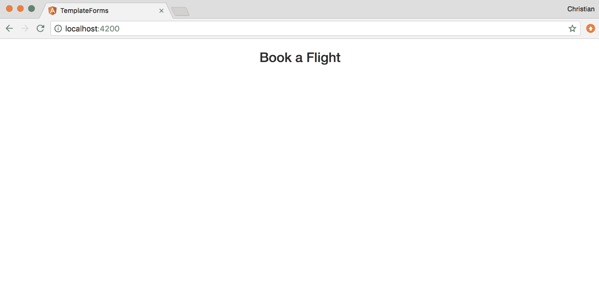

# 表单模块

现在我们有一个想要表单遵循的合约，现在让我们生成表单的组件：

```js
ng  g component flight-form
```

命令还将组件作为声明添加到我们的 `App` 模块中：

```js
import { BrowserModule } from '@angular/platform-browser';
import { NgModule } from '@angular/core';

import { AppComponent } from './app.component';
import { FlightFormComponent } from './flight-form/flight-form.component';

@NgModule({
  declarations: [
    AppComponent,
    // Component added after
    // being generated
    FlightFormComponent
  ],
  imports: [
    BrowserModule
  ],
  providers: [],
  bootstrap: [AppComponent]
})
export class AppModule { }
```

使 Angular 表单特别且易于使用的是开箱即用的功能，如 `NgForm` 指令。这些功能在核心浏览器模块中不可用，但在表单模块中可用。因此，我们需要导入它们：

```js
import { BrowserModule } from '@angular/platform-browser';
import { NgModule } from '@angular/core';

// Import the form module
import { FormsModule } from '@angular/forms';

import { AppComponent } from './app.component';
import { FlightFormComponent } from './flight-form/flight-form.component';

@NgModule({
  declarations: [
    AppComponent,
    FlightFormComponent
  ],
  imports: [
    BrowserModule,
    // Add the form module 
    // to imports array
    FormsModule
  ],
  providers: [],
  bootstrap: [AppComponent]
})
export class AppModule { }
```

简单地导入并将 `FormModule` 添加到 `imports` 数组中，这就是我们所需做的。

# 双向绑定

现在是使用浏览器中的表单组件显示一些表单控件的最佳时机。在数据层（模型）和视图之间保持状态同步可能非常具有挑战性，但使用 Angular，这只是一个使用来自 `FormModule` 的一个指令的问题：

```js
<!-- ./app/flight-form/flight-form.component.html -->
<form>
  <div class="form-group">
    <label for="fullName">Full Name</label>
    <input 
      type="text" 
      class="form-control" 
      [(ngModel)]="flightModel.fullName"
      name="fullName"
    >
  </div>
</form>
```

Angular 依赖于内部的 `name` 属性来执行绑定。因此，`name` 属性是必需的。

注意 `[(ngModel)]="flightModel.fullName"`；它试图将组件类上的属性绑定到表单。此模型将是 `Flight` 类型，这是我们之前创建的类：

```js
// ./app/flight-form/flight-form.component.ts

import { Component, OnInit } from '@angular/core';
import { Flight } from '../flight';

@Component({
  selector: 'app-flight-form',
  templateUrl: './flight-form.component.html',
  styleUrls: ['./flight-form.component.css']
})
export class FlightFormComponent implements OnInit {
  flightModel: Flight;
  constructor() {
    this.flightModel = new Flight('', '', '', '', 0, '', 0, 0, '');
  }

  ngOnInit() {}
}
```

将 `flightModel` 属性添加到组件中，类型为 `Flight` 并初始化为一些默认值。

在应用 HTML 中包含组件，以便它可以在浏览器中显示：

```js
<div class="container">
  <h3 class="text-center">Book a Flight</h3>
  <div class="col-md-offset-3 col-md-6">
    <app-flight-form></app-flight-form>
  </div>
</div>
```

这是您应该在浏览器中看到的内容：

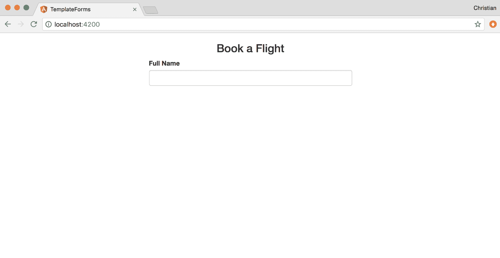

要查看双向绑定的实际效果，使用插值显示`flightModel.fullName`的值。然后，输入一个值并查看实时更新：

```js
<form>
  <div class="form-group">
    <label for="fullName">Full Name</label>
    <input 
      type="text" 
      class="form-control" 
      [(ngModel)]="flightModel.fullName"
      name="fullName"
    >
    {{flightModel.fullName}}
  </div>
</form>
```

这就是它的样子：

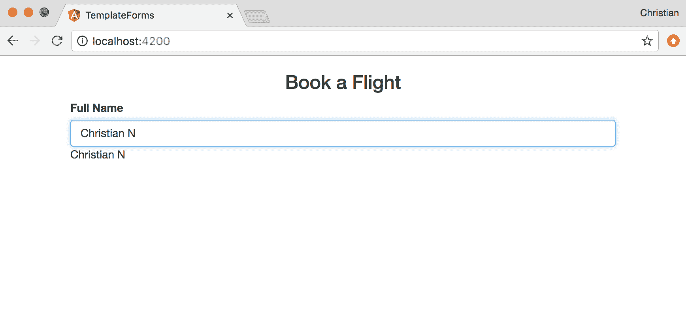

# 更多表单字段

让我们动手添加剩余的表单字段。毕竟，我们不能只提供我们的名字就预订航班。

`from`和`to`字段将是一个带有可以飞入和飞出的城市列表的*选择框*。这个城市列表将直接存储在我们的组件类中，然后我们可以在模板中遍历它并将其渲染为选择框：

```js
export class FlightFormComponent implements OnInit {
  flightModel: Flight;
  // Array of cities
  cities:Array<string> = [
    'Lagos',
    'Mumbai',
    'New York',
    'London',
    'Nairobi'
  ];
  constructor() {
    this.flightModel = new Flight('', '', '', '', 0, '', 0, 0, '');
  }
}
```

数组存储了来自世界各地的几个城市作为字符串。现在让我们使用`ngFor`指令遍历城市，并在表单中使用选择框显示它们：

```js
<div class="row">
    <div class="col-md-6">
      <label for="from">From</label>
      <select type="text" id="from" class="form-control" [(ngModel)]="flightModel.from" name="from">
        <option *ngFor="let city of cities" value="{{city}}">{{city}}</option>
      </select>
    </div>
    <div class="col-md-6">
      <label for="to">To</label>
      <select type="text" id="to" class="form-control" [(ngModel)]="flightModel.to" name="to">
        <option *ngFor="let city of cities" value="{{city}}">{{city}}</option>
      </select>
    </div>
  </div>
```

清晰整洁！您可以在浏览器中打开并直接看到它：

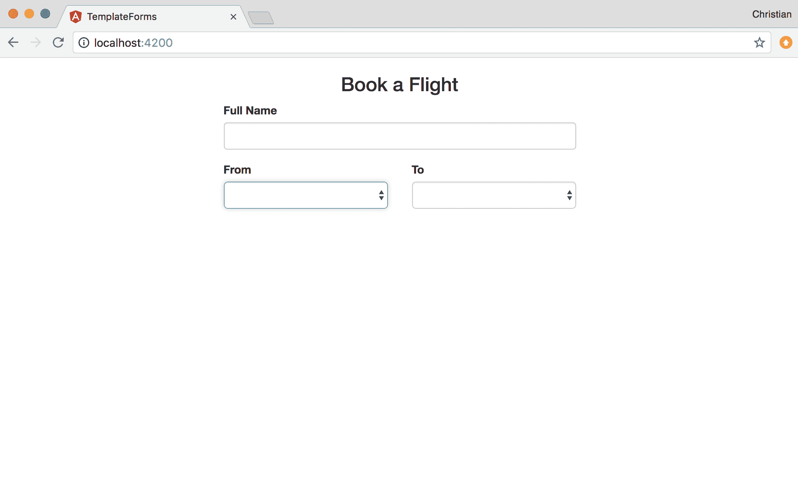

当点击下拉选择框时，会显示城市列表，正如预期的那样：

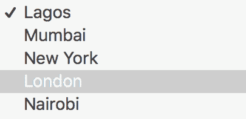

接下来，让我们添加行程类型字段（单选按钮）、出发日期字段（日期控件）和到达日期字段（日期控件）：

```js
<div class="row" style="margin-top: 15px">
    <div class="col-md-5">
      <label for="" style="display: block">Trip Type</label>
      <label class="radio-inline">
        <input type="radio" name="type" [(ngModel)]="flightModel.type" value="One Way"> One way
      </label>
      <label class="radio-inline">
        <input type="radio" name="type" [(ngModel)]="flightModel.type" value="Return"> Return
      </label>
    </div>
    <div class="col-md-4">
      <label for="departure">Departure</label>
      <input type="date" id="departure" class="form-control" [(ngModel)]="flightModel.departure" name="departure">
    </div>
    <div class="col-md-3">
      <label for="arrival">Arrival</label>
      <input type="date" id="arrival" class="form-control" [(ngModel)]="flightModel.arrival" name="arrival">
    </div>
  </div>
```

数据绑定到控件的方式与之前创建的文本和选择字段非常相似。主要区别是控件类型（单选按钮和日期）：

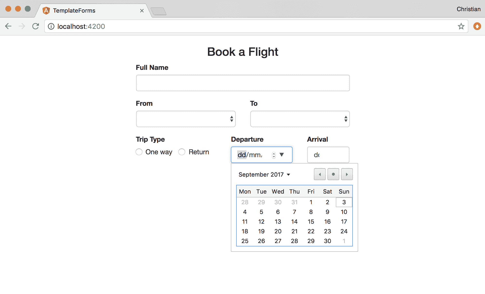

最后，添加乘客数量（成人、儿童和婴儿）：

```js
<div class="row" style="margin-top: 15px">
    <div class="col-md-4">
      <label for="adults">Adults</label>
      <input type="number" id="adults" class="form-control" [(ngModel)]="flightModel.adults" name="adults">
    </div>
    <div class="col-md-4">
      <label for="children">Children</label>
      <input type="number" id="children" class="form-control" [(ngModel)]="flightModel.children" name="children">
    </div>
    <div class="col-md-4">
      <label for="infants">Infants</label>
      <input type="number" id="infants" class="form-control" [(ngModel)]="flightModel.infants" name="infants">
    </div>
  </div>
```

乘客部分都是数字类型，因为我们只是预期从每个类别中挑选上船的乘客数量：

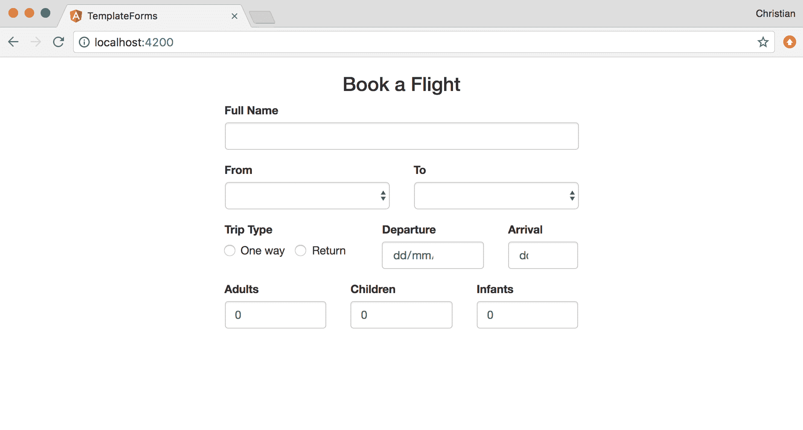

# 验证表单和表单字段

Angular 通过使用其内置指令和状态属性大大简化了表单验证。您可以使用状态属性来检查表单字段是否已被触摸。如果它已被触摸但违反了验证规则，您可以使用`ngIf`指令来显示相关错误。

让我们看看验证全名字段的例子：

```js
<div class="form-group">
    <label for="fullName">Full Name</label>
    <input 
      type="text" 
      id="fullName" 
      class="form-control" 
      [(ngModel)]="flightModel.fullName" 
      name="fullName"

      #name="ngModel"
      required
      minlength="6">
  </div>
```

我们只是为表单的全名字段添加了三个额外的显著属性：`#name`、`required`和`minlength`。`#name`属性与`name`属性完全不同，前者是一个模板变量，通过`ngModel`值持有关于此特定字段的信息，而后者是常规表单输入名称属性。

在 Angular 中，验证规则作为属性传递，这就是为什么会有`required`和`minlength`。

是的，字段已经进行了验证，但没有向用户反馈出什么出了问题。让我们添加一些错误消息，当表单字段违反时显示：

```js
<div *ngIf="name.invalid && (name.dirty || name.touched)" class="text-danger">
      <div *ngIf="name.errors.required">
        Name is required.
      </div>
      <div *ngIf="name.errors.minlength">
        Name must be at least 6 characters long.
      </div>
    </div>
```

`ngIf`指令条件性地显示这些`div`元素：

+   如果表单字段已被触摸但没有值，则会显示“名称是必需的”错误

+   当字段被触摸但内容长度小于*6*时，也会显示“名称至少为 6 个字符长”。

以下两个截图显示了这些错误输出在浏览器中的样子：

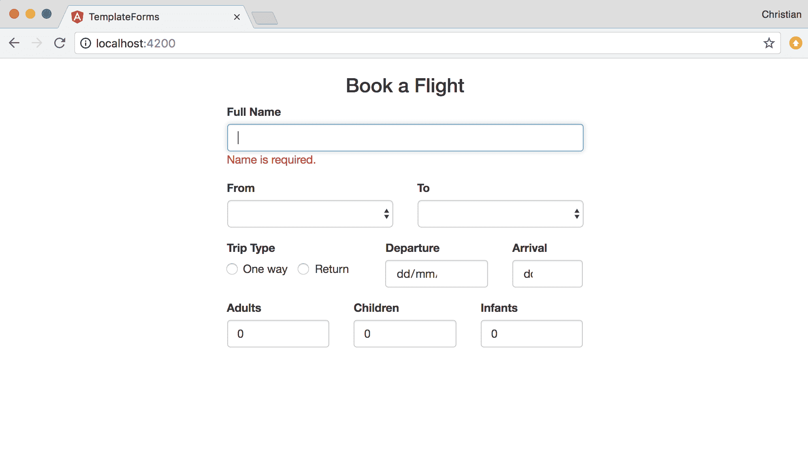

当输入值但值文本计数未达到 6 时，会显示不同的错误：

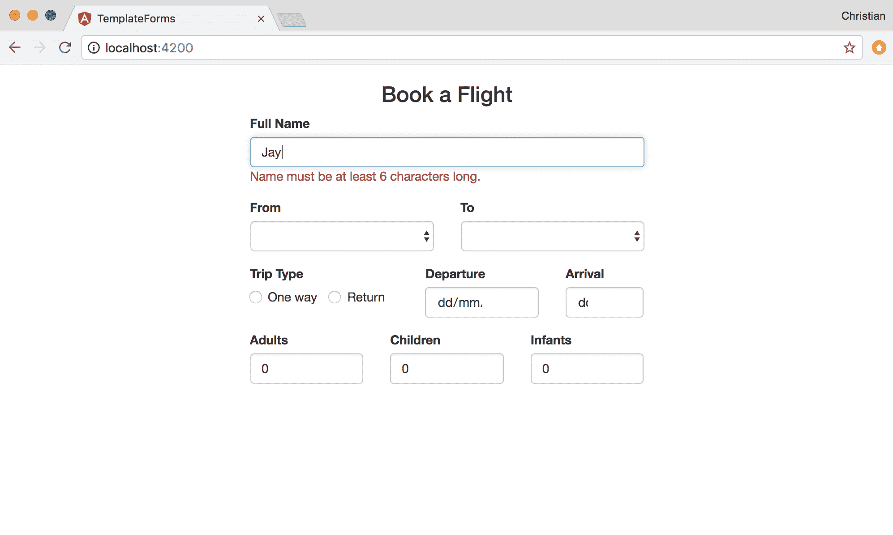

# 提交表单

在提交表单之前，我们需要考虑几个因素：

+   表单是否有效？

+   在提交之前是否有表单的处理程序？

为了确保表单有效，我们可以禁用提交按钮：

```js
<form #flightForm="ngForm">
  <div class="form-group" style="margin-top: 15px">
    <button class="btn btn-primary btn-block" [disabled]="!flightForm.form.valid">
      Submit
    </button>
  </div>
</form>
```

首先，我们在表单中添加一个名为`flightForm`的模板变量，然后使用该变量检查表单是否有效。如果表单无效，我们禁用按钮的点击：

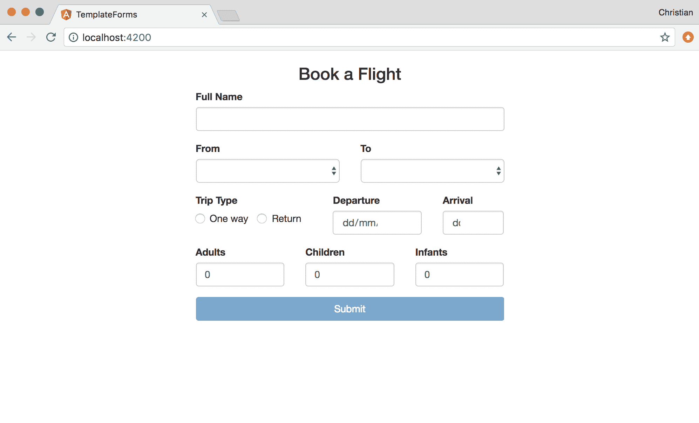

为了处理提交，向表单添加一个`ngSubmit`事件。当按钮被点击时，将调用此事件：

```js
<form #flightForm="ngForm" (ngSubmit)="handleSubmit()">
    ...
</form>
```

你现在可以添加一个名为`handleSubmit`的方法，用于处理表单提交。在这个例子中，简单的控制台日志可能就足够了：

```js
export class FlightFormComponent implements OnInit {
  flightModel: Flight;
  cities:Array<string> = [
    ...
  ];
  constructor() {
    this.flightModel = new Flight('', '', '', '', 0, '', 0, 0, '');
  }

  // Handle for submission
  handleSubmit() {
    console.log(this.flightModel);
  }
}
```

# 事件处理

表单并不是我们接收用户输入的唯一方式。简单的 DOM 交互、鼠标点击和键盘交互都可以引发可能导致用户请求的事件。当然，我们必须以某种方式处理他们的请求。这本书中有很多我们无法讨论的事件。我们可以做的是查看基本的键盘和鼠标事件。

# 鼠标事件

为了演示两种流行的鼠标事件，点击和双击，创建一个新的 Angular 项目，然后添加以下自动生成的`app.component.html`：

```js
<div class="container">
  <div class="row">
    <h3 class="text-center">
      {{counter}}
    </h3>
    <div class="buttons">
      <div class="btn btn-primary">
        Increment
      </div>
      <div class="btn btn-danger">
        Decrement
      </div>
    </div>
  </div>
</div>
```

使用插值和递增和递减按钮将`counter`属性绑定到视图。该属性在 app 组件中可用，并初始化为零：

```js
import { Component } from '@angular/core';

@Component({
  selector: 'app-root',
  templateUrl: './app.component.html',
  styleUrls: ['./app.component.css']
})
export class AppComponent {
  counter = 0;
}
```

以下是其基本外观：

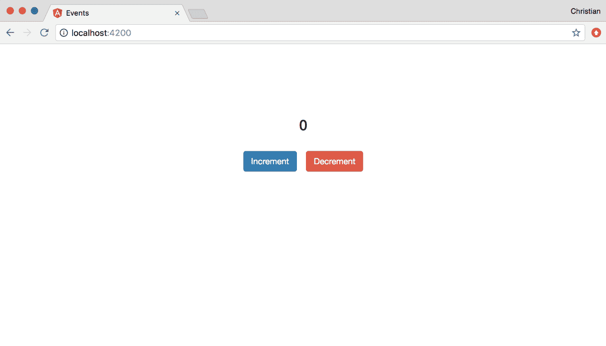

点击按钮没有任何作用。让我们给递增按钮添加一个点击事件，每次点击都会将计数属性加 1：

```js
export class AppComponent {
  counter = 0;
  increment() {
    this.counter++
  }
}
```

我们需要将此事件处理程序绑定到模板中的按钮，以便在按钮被点击时实际增加计数器：

```js
<div class="btn btn-primary" (click)="increment()">
   Increment
</div>
```

事件通过属性绑定到模板上，但将属性包裹在括号中。属性值成为组件类上的方法，将作为事件处理程序。

我们需要为递减功能提供相同的功能。假设递减是一个你想要确保用户有意实施的操作，你可以附加一个双击事件：

```js
<div class="btn btn-danger" (dblclick)="decrement()">
  Decrement
</div>
```

如您所见，我们不是使用`click`，而是使用`dblclick`事件，然后将递减事件处理程序绑定到它。处理程序只是递增处理程序的逆操作，并检查我们是否达到了零：

```js
decrement() {
  this.counter <= 0 ? (this.counter = 0) : this.counter--;
}
```

以下展示了新事件的实际应用：

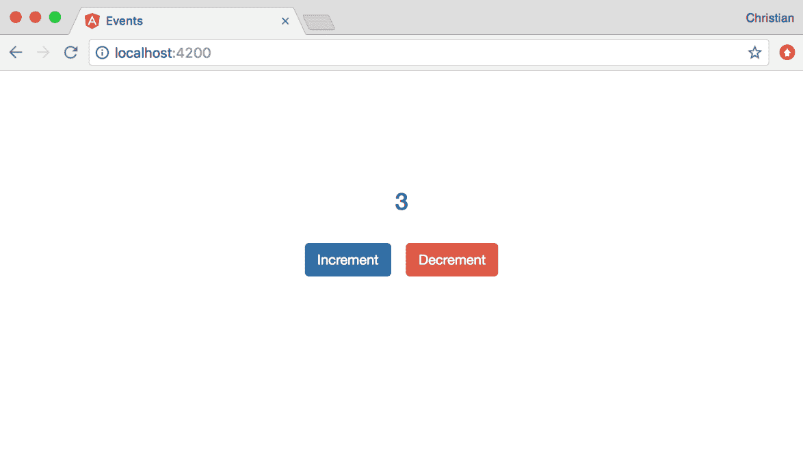

# 键盘事件

你可以通过监听各种键盘事件来跟踪键盘交互。`keypress`事件告诉你一个按钮被点击了；如果你有一个监听器附加到它上面，那么监听器就会被触发。你可以以与我们附加鼠标事件相同的方式附加键盘事件：

```js
<div class="container" (keypress)="showKey($event)" tabindex="1">
  ...
  <div class="key-bg" *ngIf="keyPressed">
    <h1>{{key}}</h1>
  </div>
<div>
```

当按下键时，具有`key-bg`类的元素会被显示出来；它显示我们按下的确切键，该键存储在`key`属性中。`keyPressed`属性是一个布尔值，我们在按下键时将其设置为`true`。

事件触发`showKey`监听器；让我们来实现它：

```js
import { Component } from '@angular/core';

@Component({
  selector: 'app-root',
  templateUrl: './app.component.html',
  styleUrls: ['./app.component.css']
})
export class AppComponent {
  keyPressed = false;
  key = '';
  // ....
  showKey($event) {
    this.keyPressed = true;
    this.key = $event.key.toUpperCase();
    setTimeout(() => {
      this.keyPressed = false;
    }, 500)
  }
}
```

`showKey`处理程序执行以下操作：

+   它将`key`属性设置为按下的键的值

+   按下的键被表示为一个小写字符串，所以我们使用`toUpperCase`方法将其转换为大写

+   `keyPressed`属性被设置为`true`，因此它显示按下的键，然后在 500 毫秒后将其设置为`false`，所以显示的键会被隐藏

当你按下键（并且`container` div 有焦点时），以下截图显示了会发生什么：

>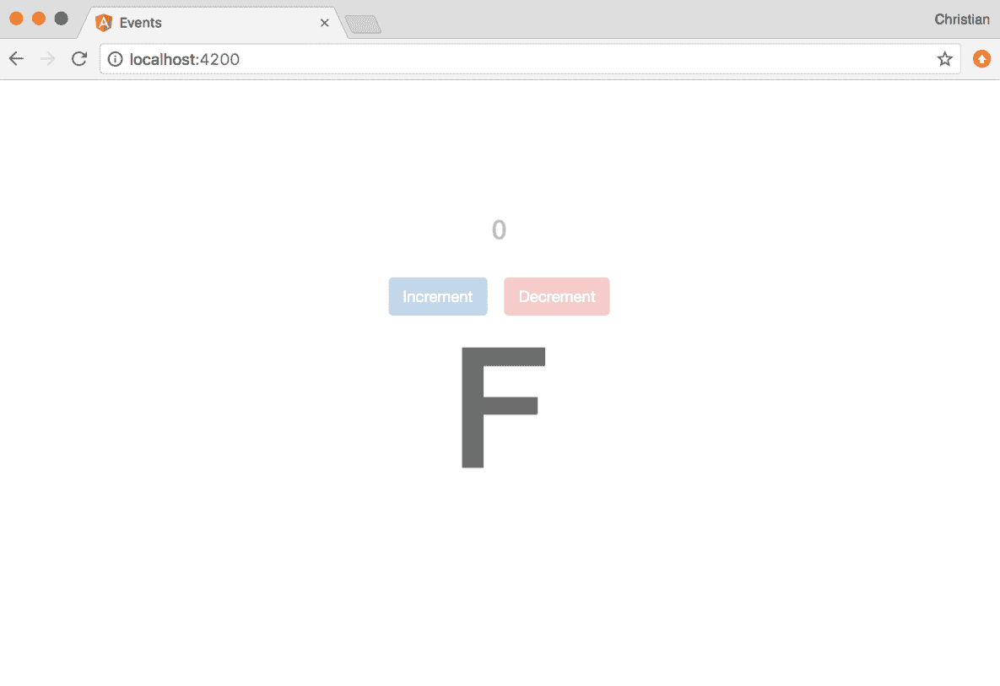

# 摘要

你现在对通过表单或事件收集用户输入有了大量的了解。我们还涵盖了表单的重要特性，例如文本输入、验证、双向绑定、提交等。我们看到的示例事件涵盖了鼠标和键盘事件以及如何处理它们。所有这些有趣的遭遇都为你构建商业应用程序做好了准备。
