# 第九章：使用 TypeScript 编写模块、指令和管道

模块化对于构建大型软件系统至关重要，Angular 项目也不例外。当我们的应用程序开始增长时，在一个入口模块中管理其不同的成员开始变得非常困难和混乱。当你有很多服务、指令和管道时，这变得更加具有挑战性。说到指令和管道，我们将花一些时间讨论本章中的用例和示例，同时在我们使用模块更好地管理应用程序的过程中进行探索。

# 指令

DOM 操作并不总是最好在组件中处理。组件应该尽可能瘦；这样，事情保持简单，你的代码可以轻松地移动和重用。那么，我们应该在哪里处理 DOM 操作呢？答案是指令。就像你应该将数据操作任务带到服务中一样，最佳实践建议你将重量级的 DOM 操作带到指令中。

Angular 中有三种类型的指令：

+   组件

+   属性指令

+   结构指令

是的，组件！组件是有资格的指令。它们是有直接访问正在操作的模板的指令。在这本书中，我们已经看到了足够的组件；让我们专注于属性和结构指令。

# 属性指令

这类指令以其向 DOM 添加行为特性而闻名，但不会删除或添加任何 DOM 内容。例如，改变外观、显示或隐藏元素、操作元素的属性等等。

为了更好地理解属性指令，让我们构建一些应用于组件模板的 UI 指令。这些指令在应用时将改变 DOM 的行为。

使用以下命令在新的项目中创建一个新的指令：

```js
ng generate directive ui-button
```

这将在应用程序文件夹中创建一个空的指令，内容如下：

```js
import { Directive } from '@angular/core';

@Directive({
  selector: '[appUiButton]'
})
export class UiButtonDirective {
  constructor() {}
}
```

`Directive` 装饰器首先从 `@angular/core` 模块导入。装饰器用于任何预期作为指令的类。就像组件上的装饰器一样，指令装饰器接受一个具有选择器属性的对象。当这个选择器应用于 DOM 时，指令的行为就会展现出来。

在这个例子中，我们试图实现的行为是通过单个属性来样式化一个完全未样式的按钮。让我们假设在我们的应用程序组件中有一个以下按钮：

```js
<div class="container">
  <button>Click!!</button>
</div>
```

这只是一个简单的无聊按钮在屏幕上：

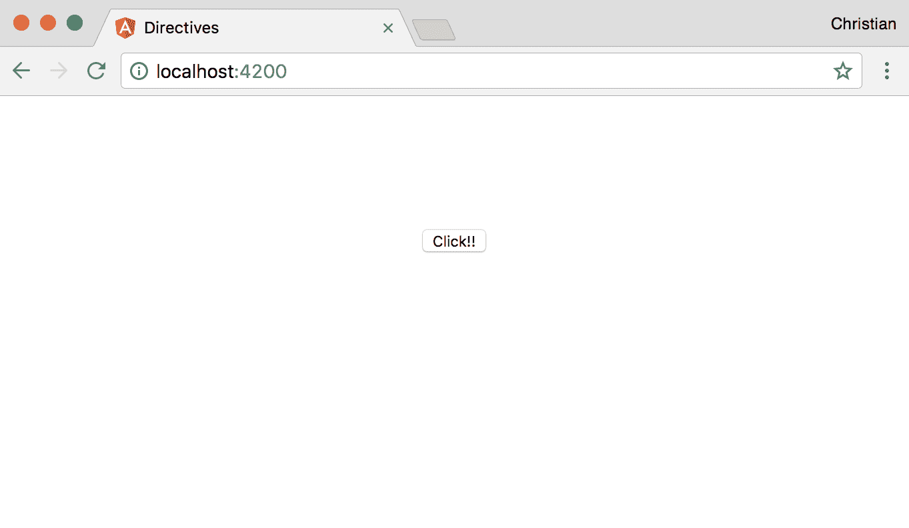

要使用我们刚刚创建的属性指令，将其添加为无值的属性到按钮上：

```js
<button appUiButton>Click!!</button>
```

接下来，找到一种方法从 `directive` 类中访问按钮元素。我们需要这种访问来能够从类中直接应用样式到按钮上。多亏了 `ElementRef` 类，它通过构造函数注入到指令中，给了我们访问原生元素的能力，这是按钮元素可以访问的地方：

```js
import { Directive, ElementRef } from '@angular/core';

@Directive({
  selector: '[appUiButton]'
})
export class UiButtonDirective {
  constructor(el: ElementRef) {

  }
}
```

它被注入并解析到`el`属性中。我们可以从属性中访问按钮元素：

```js
import { Directive, ElementRef } from '@angular/core';

@Directive({
  selector: '[appUiButton]'
})
export class UiButtonDirective {
  constructor(el: ElementRef) {
    el.nativeElement.style.backgroundColor = '#ff00a6';
  }
}
```

`nativeElement`属性允许你访问应用了属性指令的元素。然后你可以将值当作 DOM API 来处理，这就是为什么我们可以访问`style`和`backgroundColor`属性：

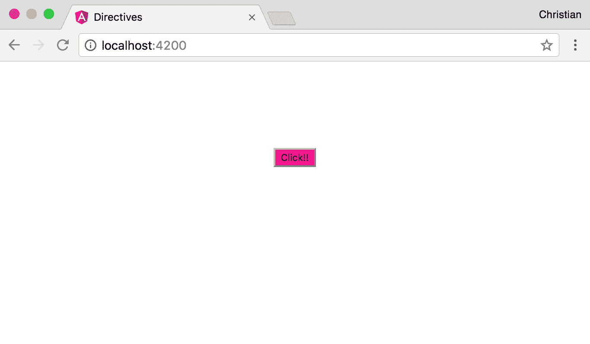

你可以看到粉红色的背景被有效地应用了。让我们通过指令添加更多样式，使按钮更有趣：

```js
import { Directive, ElementRef } from '@angular/core';

@Directive({
  selector: '[appUiButton]'
})
export class UiButtonDirective {
  constructor(el: ElementRef) {
    Object.assign(el.nativeElement.style, {
      backgroundColor: '#ff00a6',
      padding: '7px 15px',
      fontSize: '16px',
      color: '#fff',
      border: 'none',
      borderRadius: '4px'
    })
  }
}
```

我们不再使用多个点来设置值，而是使用`Object.assign`方法来减少我们需要编写的代码量。现在，我们在浏览器中有一个更漂亮的按钮，完全使用指令进行样式设置：

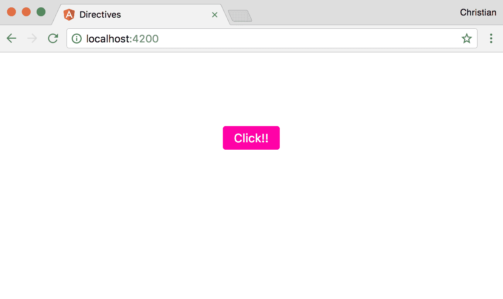

# 在指令中处理事件

指令非常灵活，允许你根据用户触发的事件应用不同的状态。例如，我们可以给按钮添加一个悬停行为，当鼠标光标移到按钮上时，按钮应用不同的颜色（比如黑色）：

```js
import { 
  Directive, 
  ElementRef, 
  HostListener } from '@angular/core';

@Directive({
  selector: '[appUiButton]'
})
export class UiButtonDirective {
  constructor(private el: ElementRef) {
    Object.assign(el.nativeElement.style, {
      backgroundColor: '#ff00a6',
      ...
    })
  }

  @HostListener('mouseenter') onMouseEnter() {
    this.el.nativeElement.style.backgroundColor = '#000';
  }

  @HostListener('mouseleave') onMouseLeave() {
    this.el.nativeElement.style.backgroundColor = '#ff00a6';
  }
}
```

我们向这个文件引入了一些成员：

+   我们导入了`HostListener`，这是一个扩展类中方法的装饰器。它将方法转换为一个附加到原生元素的事件监听器。装饰器接受一个事件类型的参数。

+   我们在`onMouseEnter`和`onMouseLeave`上定义了两个方法，然后用`HostListener`装饰这些方法。这些方法在鼠标悬停时改变按钮的背景颜色。

当我们将鼠标悬停在按钮上时，行为如下：

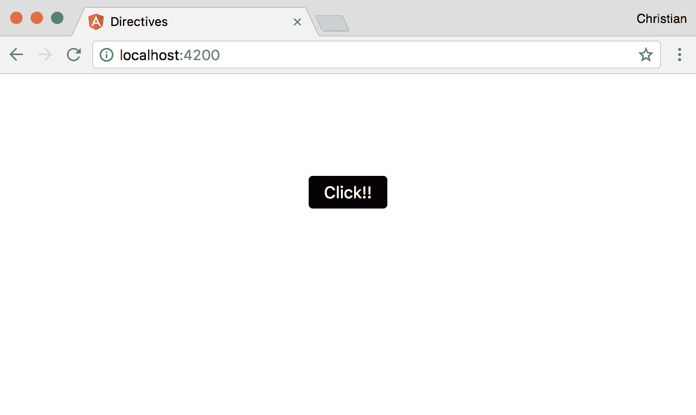

# 动态属性指令

如果我们，这个指令的作者，是最终的消费者？如果另一个开发者将指令作为 API 重用呢？我们如何使它足够灵活以处理动态值？当你写指令时问自己这些问题，那么是时候让它变得动态了。

在此期间，我们一直在没有值的情况下使用指令。实际上，我们可以使用属性值将输入接收进指令：

```js
<button appUiButton bgColor="red">Click!!</button>
```

我们添加了一个新的属性，`bgColor`，它不是一个指令而是一个输入属性。该属性用于将动态值发送到指令，如下所示：

```js
import { 
  Directive, 
  ElementRef, 
  HostListener, 
  Input,
  OnInit } from '@angular/core';

@Directive({
  selector: '[appUiButton]'
})
export class UiButtonDirective implements OnInit {
  @Input() bgColor: string;
  @Input() hoverBgColor: string;
  constructor(private el: ElementRef) {}

  ngOnInit() {
    Object.assign(this.el.nativeElement.style, {
      backgroundColor: this.bgColor || '#ff00a6',
      padding: '7px 15px',
      fontSize: '16px',
      color: '#fff',
      border: 'none',
      borderRadius: '4px'
    })
  }

  @HostListener('mouseenter') onMouseEnter() {
    console.log(this.bgColor);
    this.el.nativeElement.style.backgroundColor = this.hoverBgColor || '#000';
  }

  @HostListener('mouseleave') onMouseLeave() {
    this.el.nativeElement.style.backgroundColor = this.bgColor || '#ff00a6';
  }
}
```

这里是我们引入的更改：

+   两个装饰过的`Input`属性--`bgColor`和`bgHoverColor`--被引入，作为从模板到指令的动态值流。

+   这个指令的设置从构造函数移动到了`ngOnInit`方法。这是因为输入装饰器是由 Angular 的变更检测设置的，这不会在构造函数中发生，因此当我们尝试从构造函数中访问它们时，`bgColor`和`bgHoverColor`是未定义的。

+   在设置样式时，我们不是使用硬编码的`backgroundColor`值，而是使用通过`bgColor`接收到的值。我们还提供了一个回退值，以防开发者忘记包含该属性。

+   同样的事情也发生在鼠标进入和鼠标离开事件上。

现在，按钮的视觉效果受到动态值的影响：

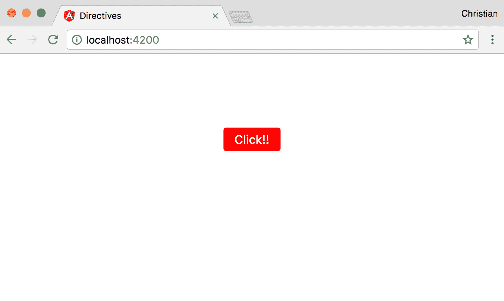

# 结构指令

结构指令在创建方式上与属性指令有很多共同之处，但在预期行为上却非常不同。与属性指令不同，结构指令预期会创建或删除一个 DOM 元素。这与使用 CSS 显示属性来显示或隐藏一个元素不同。在这种情况下，元素仍然在 DOM 树中，但在隐藏时对最终用户不可见。

一个很好的例子是 `*ngIf`。当使用 `*ngIf` 结构指令从 DOM 中删除元素时，该指令既从屏幕上消失，也从 DOM 树中删除。

# 为什么会有这种差异？

你控制 DOM 元素可见性的方式可能会对你的应用程序性能产生重大影响。

以折叠面板为例，用户预期会点击它来显示更多信息。用户可能会在查看内容后决定隐藏折叠面板的内容，然后在稍后时间回来重新打开它以供参考。很明显，折叠面板的内容有在任意时间显示和隐藏的倾向。

当这种情况发生时，最好使用一个属性指令，该指令不会隐藏/删除折叠面板内容，而只是隐藏它。这使得在需要时快速显示和再次隐藏变得非常快。使用结构指令如 `*ngIf` 会不断创建和销毁 DOM 树的一部分，如果被控制的 DOM 内容很大，这可能会非常昂贵。

另一方面，当你有一些你确信用户只会查看一次或最多两次的内容时，最好使用结构指令如 `*ngIf`。这样，你的 DOM 就不会被大量未使用的 HTML 内容所充斥。

# 星号的处理

所有结构指令之前的前缀星号非常重要。当你从 `*ngIf` 和 `*ngFor` 指令中移除星号时，这些指令将拒绝工作，这意味着星号是必需的。因此，问题是：为什么星号必须在那里？

在 Angular 中，它们是语法糖，意味着它们不必以这种方式编写。这就是它们的实际样子：

```js
<div template="ngIf true">
  <p>Lorem ipsum dolor sit amet, consectetur adipisicing elit. Nesciunt non perspiciatis consequatur sapiente provident nemo similique. Minus quo veritatis ratione, quaerat dolores optio facilis dolor nemo, tenetur, obcaecati quibusdam, doloremque.</p>
</div>
```

这个模板属性反过来会被 Angular 转换为以下内容：

```js
<ng-template [ngIf]="true">
  <div template="ngIf true">
    <p>Lorem ipsum dolor sit amet, consectetur adipisicing elit....</p>
  </div>
</ng-template>
```

看看 `ngIf` 现在已经成为一个正常的 Angular 属性，但被注入到模板中。当值为 `false` 时，模板将从 DOM 树中移除（而不是隐藏）。以这种方式编写这样的指令只是写了很多代码，所以 Angular 添加了语法糖来简化我们编写 `ngIf` 指令的方式：

```js
<div *ngIf="true">
  <p>Lorem ipsum dolor sit amet, consectetur adipisicing elit. Nesciunt non perspiciatis consequatur sapiente provident nemo similique.</p>
</div>
```

# 创建结构指令

我们已经在之前的示例中看到了如何使用结构指令。我们如何创建它们？我们通过在您的终端运行以下命令来创建它们，就像我们创建属性指令一样：

```js
ng generate directive when
```

是的，我们正在将指令命名为`when`。这个指令确实与`*ngIf`做的一样，所以，希望它能帮助您更好地理解您已经使用的指令的内部机制。

使用以下内容更新指令：

```js
import { 
  Directive, 
  Input, 
  TemplateRef, 
  ViewContainerRef } from '@angular/core';

@Directive({
  selector: '[appWhen]'
})
export class WhenDirective {
  constructor(
    private templateRef: TemplateRef<any>,
    private viewContainer: ViewContainerRef) { }
}
```

我们介绍了一些您还不熟悉的成员。`TemplateRef`是对我们之前看到的`ng-template`模板的引用，其中包含我们正在控制的 DOM 内容。`ViewContainerRef`是对视图本身的引用。

当在视图中使用`appWhen`指令时，它期望接收一个条件，例如`ngIf`。为了接收这样的条件，我们需要创建一个装饰的`Input`设置方法：

```js
export class WhenDirective {
  private hasView = false;

  constructor(
    private templateRef: TemplateRef<any>,
    private viewContainer: ViewContainerRef) { }

  @Input() set appWhen(condition: boolean) {
    if (condition && !this.hasView) {
      this.viewContainer.createEmbeddedView(this.templateRef);
      this.hasView = true;
    } else if (!condition && this.hasView) {
      this.viewContainer.clear();
      this.hasView = false;
    }
  }
}
```

指令中的设置方法检查值是否解析为`true`，然后显示内容并创建视图（如果尚未创建）。当值解析为`false`时，情况相反。

让我们通过点击属性指令部分中我们一直在努力工作的按钮来测试指令。当按钮被点击时，它会切换一个属性到`true`或`false`。这个属性绑定到我们创建的指令的值。

使用以下内容更新应用程序组件类：

```js
export class AppComponent {
  toggle = false;
  updateToggle() {
    this.toggle = !this.toggle;
  }
}
```

`updateToggle`方法绑定到按钮上，以便在用户点击时翻转`toggle`的值。以下是应用程序组件 HTML 的样式：

```js
<h3 
  style="text-align:center" 
  *appWhen="toggle"
 >Hi, cute directive</h3>

<button 
  appUiButton 
  bgColor="red" 
  (click)="updateToggle()"
>Click!!</button>
```

一旦您点击按钮，它就会通过添加或从屏幕中移除文本来显示或隐藏文本：

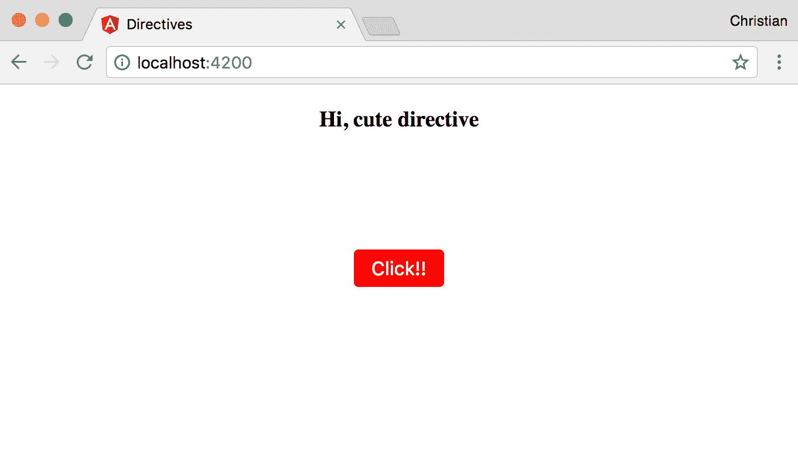

# 管道

另一个我们尚未讨论的有趣模板功能是管道。管道允许您在模板内直接格式化模板内容。您不需要在组件中格式化内容，只需在模板中编写一个管道即可完成。以下是一个管道的完美示例：

```js
<div class="container">
  <h2>{{0.5 | percent}}</h2>
</div>
```

在小数点后添加`| percent`会将值转换为百分比表示，如下面的截图所示：

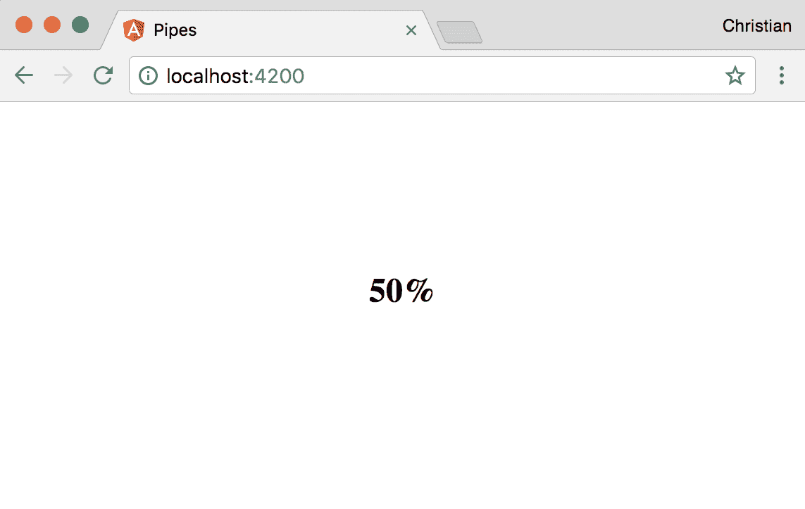

这里是另一个使用其中一个案例管道的示例：

```js
<div class="container">
  <h2>{{0.5 | percent}}</h2>
  <h3>{{'this is uppercase' | uppercase}}</h3>
</div>
```

`uppercase`管道将文本字符串转换为大写。以下是前面代码示例的输出：

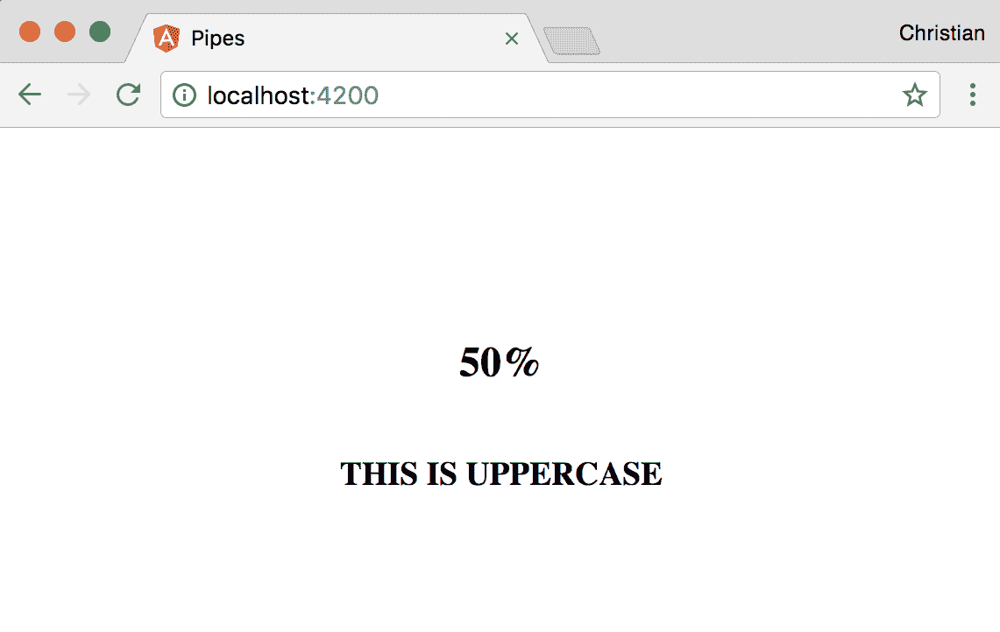

一些管道接受参数，这有助于在将管道应用于某些内容时微调管道的行为。这样的管道示例是货币管道，它接受一个参数来定义内容将使用哪种货币进行格式化：

```js
<h2>{{50.989 | currency:'EUR':true}}</h2>
```

以下截图显示了一个格式良好的值：

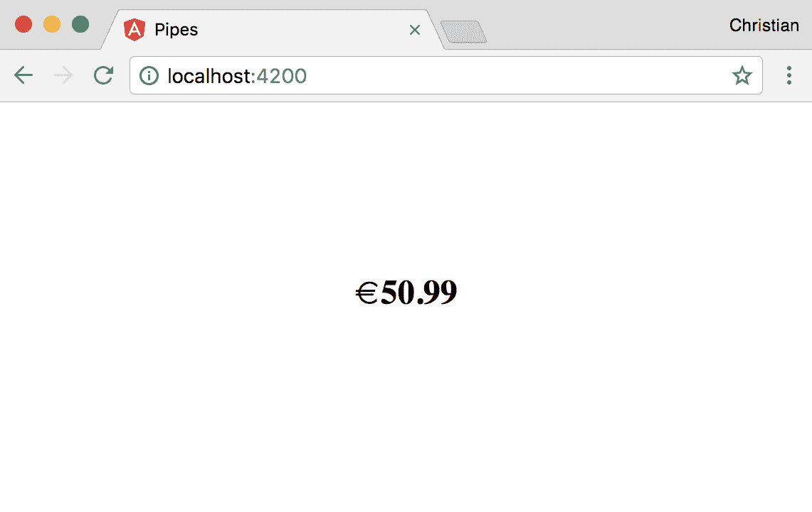

管道接受两个由冒号（`:`）分隔的参数。第一个参数是我们设置为欧元的货币。第二个参数是一个布尔值，表示显示的货币符号类型。因为值为`true`，所以显示了欧元符号。以下是当值为`false`时的输出：

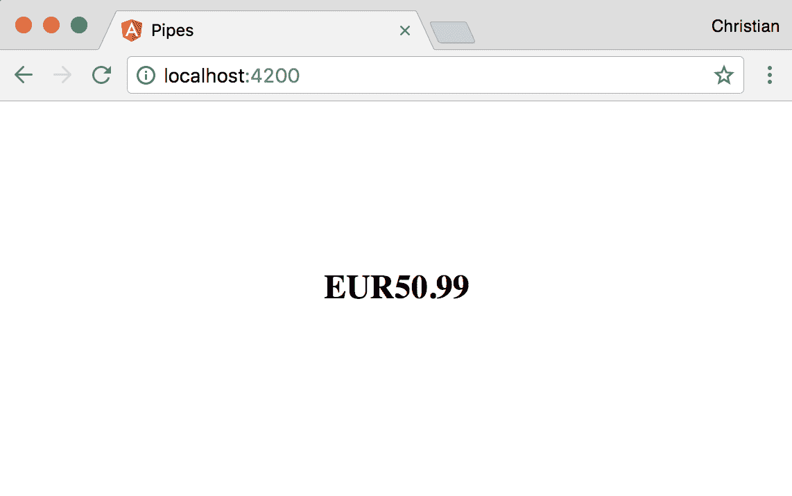

它不是使用符号，而是用货币代码（EUR）在值之前。

# 创建管道

我们已经看到了我们可以使用管道做什么以及在哪里使用它们。接下来我们需要了解的是如何使用 TypeScript 类创建我们自己的自定义管道。首先，运行以下命令来生成一个空管道：

```js
ng generate pipe reverse
```

然后，使用以下内容更新生成的类文件：

```js
import { Pipe, PipeTransform } from '@angular/core';

@Pipe({
  name: 'reverse'
})
export class ReversePipe implements PipeTransform {

  transform(value: any, args?: any): any {
    return value.split('').reverse().join('');
  }

}
```

这个例子接受一个字符串并返回字符串的逆序版本。`ReversePipe`类实现了`PipeTransform`接口，该接口定义了一个必须以一定签名创建的`transform`方法，如之前所见。

该类被`Pipe`装饰器装饰，该装饰器接受一个配置对象作为参数。该对象必须定义一个`name`属性，该属性作为管道应用于模板时的标识符。在我们的例子中，管道的名称是`reverse`。

你现在可以将你的自定义管道应用于模板：

```js
<h3>{{'watch me flip' | reverse}}</h3> 
```

当你查看示例时，文本被反转，所以它现在以 p 开头以 w 结尾：

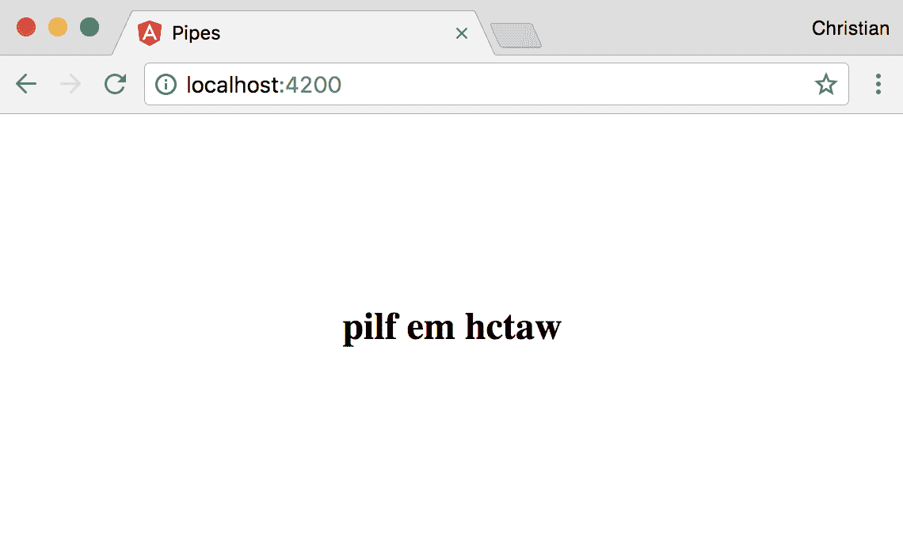

# 向管道传递参数

我们看到了如何创建管道，但我们也在心里记着管道接受参数。我们如何将这些参数添加到我们的自定义管道中？

由于传递给转换方法的可选`args`参数，生成的管道可能已经从上一个示例中给出了提示：

```js
transform(value: any, args?: any): any {
    ...
}
```

假设我们想要定义字符串的逆序是按字母还是按单词进行的，向管道用户提供这种控制的最佳方式是通过参数。以下是一个更新的示例：

```js
export class ReversePipe implements PipeTransform {

  transform(value: any, args?: any): any {
    if(args){
      return value.split(' ').reverse().join(' ');
    } else {
      return value.split('').reverse().join('');
    }
  }

}
```

当提供的参数是`true`时，我们按单词而不是按字母逆序字符串。这是通过在存在空白处分割字符串来完成的，而不是空字符串。当它是`false`时，我们在空字符串处分割，这基于字母逆序字符串。

我们现在可以在传递参数时使用管道：

```js
<h2>{{'watch me flip' | reverse:true}}</h2> 
```

这是生成的输出：


# 模块

我们在文章开头提到了模块以及它们如何帮助我们组织项目。考虑到这一点，看看这个应用模块：

```js
import { BrowserModule } from '@angular/platform-browser';
import { NgModule } from '@angular/core';

import { AppComponent } from './app.component';
import { UiButtonDirective } from './ui-button.directive';
import { WhenDirective } from './when.directive';

@NgModule({
  declarations: [
    AppComponent,
    UiButtonDirective,
    WhenDirective
  ],
  imports: [
    BrowserModule
  ],
  providers: [],
  bootstrap: [AppComponent]
})
export class AppModule { }
```

这里是一个来自指令的模块：

```js
examples:import { BrowserModule } from '@angular/platform-browser';
import { NgModule } from '@angular/core';

import { AppComponent } from './app.component';
import { ReversePipe } from './reverse.pipe';

@NgModule({
  declarations: [
    AppComponent,
    ReversePipe
  ],
  imports: [
    BrowserModule
  ],
  providers: [],
  bootstrap: [AppComponent]
})
export class AppModule { }
```

如果你如此关注细节，你可能已经注意到我们从未在指令中添加`UiButtonDirective`或`WhenDirective`。同样，在管道示例中也没有添加`ReversePipe`。当运行`generate`命令时，这些添加会自动应用于所有成员，除了服务。

对于你创建的所有成员，即组件、指令、管道和服务，你需要将它们包含在它们所属的模块中。

模块（通常称为`NgModule`）是一个被`NgModule`装饰器装饰的类。这个装饰器接受一个配置对象，它告诉 Angular 关于在应用中创建的成员以及它们属于哪里。

这里是不同的属性：

+   `声明`: 组件、指令和管道必须在`声明`数组中定义，以便它们可以被暴露给应用。如果没有这样做，将在你的控制台中记录错误，告诉你被省略的成员没有被识别。

+   `导入`: 应用模块不是唯一存在的模块。你可以有更小、更简单的模块，它们将相关的任务成员分组在一起。在这种情况下，你仍然需要将较小的模块导入到应用模块中。`导入`数组就是你在那里做的。这些较小的模块通常被称为功能模块。一个功能模块也可以被导入到另一个功能模块中。

+   `提供者`: 如果你有一些抽象特定任务的服务，并且需要通过依赖注入将它们注入到应用中，你需要在`提供者`数组中指定这些服务。

+   `引导`: `引导`数组仅在入口模块中声明，这通常是应用模块。这个数组定义了哪个组件应该首先启动或哪个组件作为你应用的入口点。值总是`AppComponent`，因为那是入口点。

# 摘要

你学到了很多概念，从指令和管道到模块。你学习了不同类型的指令（属性和结构）以及如何创建每一个。我们还讨论了在创建管道时如何传递参数。在下一章中，我们将讨论 Angular 应用程序中的路由以及 TypeScript 如何发挥重要作用。
