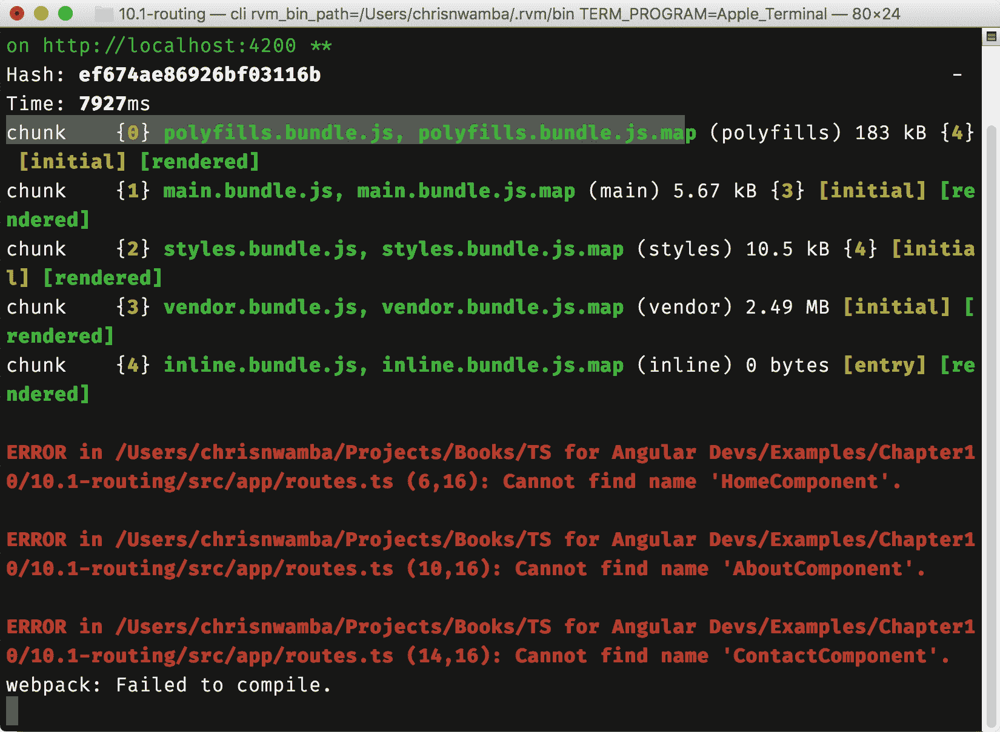
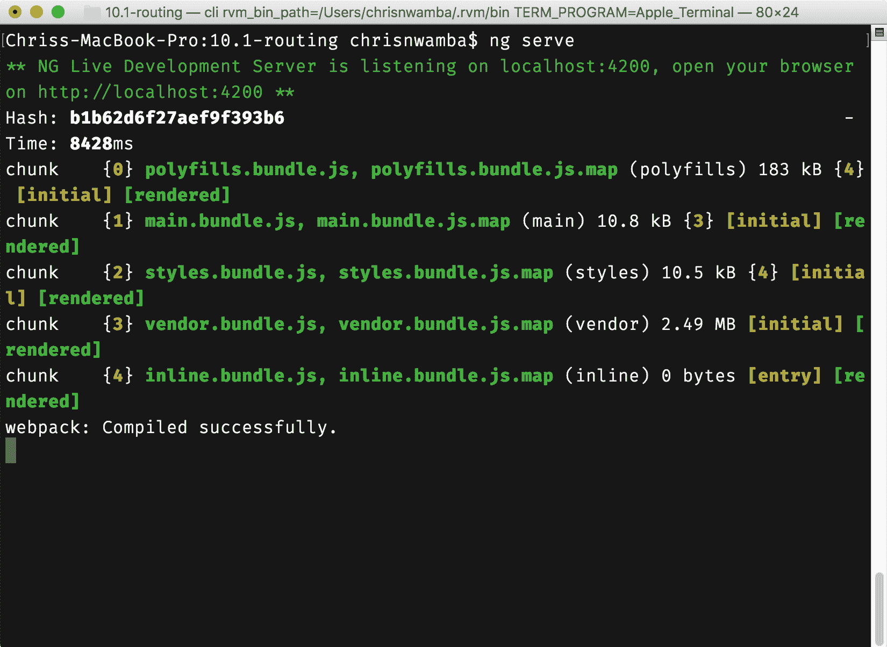
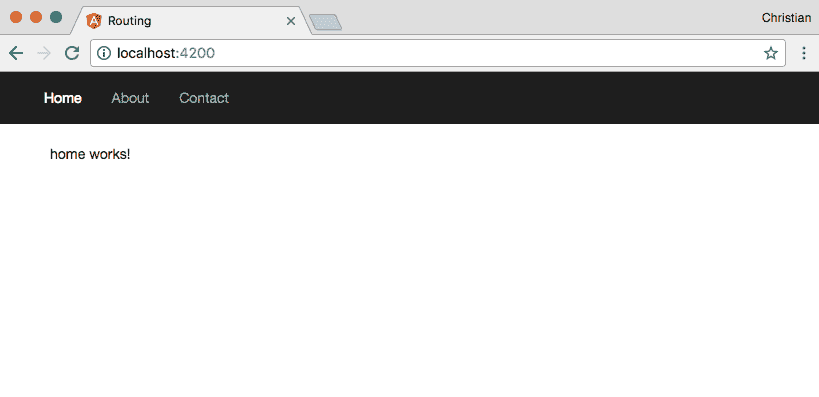
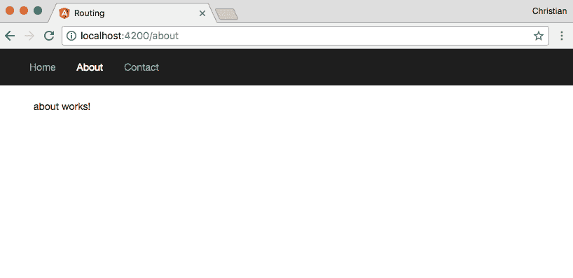
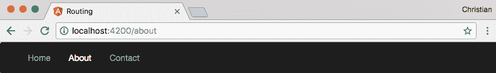
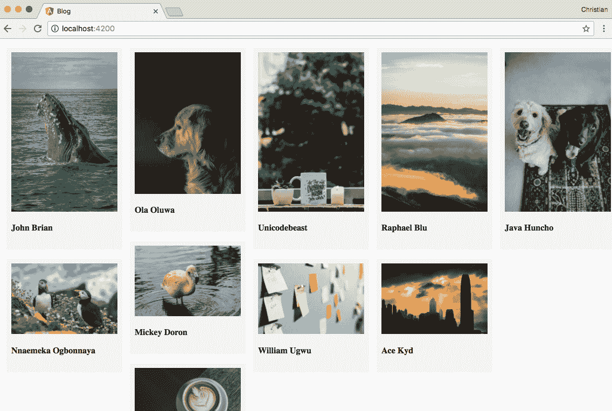
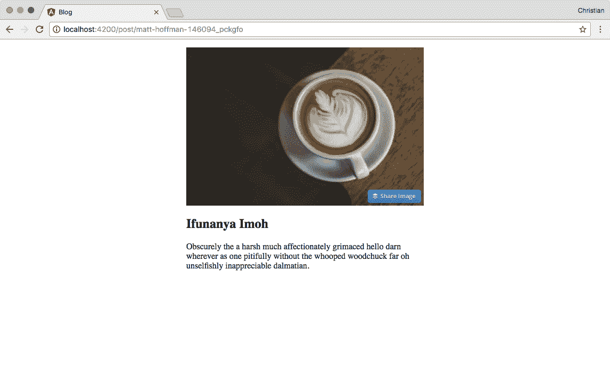

# 第十章：客户端路由（SPA）

**单页应用（SPA**）是一个术语，用来指代从单个服务器路由提供但具有多个客户端视图的应用。单个服务器路由通常是默认的（`/`或`*`）。一旦单个服务器路由被加载，客户端（JavaScript）就会劫持页面并开始使用浏览器的路由机制来控制路由。

能够从 JavaScript 中控制路由使开发者能够构建更好的用户体验。本章描述了如何在 Angular 中使用 TypeScript 编写的类、指令等来实现这一点。

就像每一章一样，我们将通过实际例子来完成这个任务。

# RouterModule

就像表单一样，Angular 在 CLI 脚手架中默认不生成路由。这是因为你可能不需要在正在工作的项目中使用它。为了使路由工作，你需要将其导入需要使用它的模块中：

```js
import { RouterModule }   from '@angular/router';
```

该模块公开了一个静态的`forRoot`方法，它接受一个路由数组。这样做为导入`RouterModule`的模块注册和配置了这些路由。从在`app`文件夹中创建一个`routes.ts`文件开始：

```js
import { Routes } from '@angular/router';

export const routes: Routes = [
  {
    path: '',
    component: HomeComponent
  },
  {
    path: 'about',
    component: AboutComponent
  },
  {
    path: 'contact',
    component: ContactComponent
  }
];
```

`Routes`类的签名是一个数组，它接受一个或多个对象。传入的对象应该有一个路径和一个组件属性。路径属性定义位置，而组件属性定义应该在定义的路径上挂载的 Angular 组件。

你可以在`AppModule`中使用这些数组来配置`RouterModule`。我们已经导入了`RouterModule`，所以让我们导入`routes`文件并在`imports`数组中配置路由：

```js
import { BrowserModule } from '@angular/platform-browser';
import { NgModule } from '@angular/core';
//Import RuterModule
import { RouterModule } from '@angular/router';

import { AppComponent } from './app.component';

//Imprt routes
import { routes } from './routes';

@NgModule({
  declarations: [
    AppComponent
  ],
  imports: [
    BrowserModule,
    // RouterModule used to
    // configure routes
    RouterModule.forRoot(routes)
  ],
  providers: [],
  bootstrap: [AppComponent]
})
export class AppModule { }
```

这就是配置 Angular 路由所需的所有步骤。路由的组件尚未创建，所以如果你尝试运行应用，你将在终端看到相同的错误：



让我们使用 CLI 生成这些组件：

```js
ng generate component home
ng generate component about
ng generate component contact
```

然后，更新路由配置以导入组件：

```js
import { Routes } from '@angular/router';

import { ContactComponent } from './contact/contact.component';
import { AboutComponent } from './about/about.component';
import { HomeComponent } from './home/home.component';

export const routes: Routes = [
  {
    path: '',
    component: HomeComponent
  },
  {
    path: 'about',
    component: AboutComponent
  },
  {
    path: 'contact',
    component: ContactComponent
  }
];
```

再运行一次应用，看看你是否已经消除了错误：



# 路由指令

我知道你迫不及待想看到浏览器中的示例，但如果你尝试在端口`4200`测试应用，你仍然会看到`app`组件的内容。这是因为我们没有告诉 Angular 它应该在何处挂载路由。

Angular 暴露了两个重要的路由指令：

+   **路由出口**：这定义了路由配置应该挂载的位置。这通常是在单页应用的入口组件中。

+   **路由链接**：这用于定义 Angular 路由的导航。基本上，它向锚标签添加功能，以便更好地与 Angular 应用中定义的路由一起工作。

让我们替换应用组件模板的内容，以利用路由指令：

```js
<div>
  <nav class="navbar navbar-inverse">
    <div class="container-fluid">
      <div class="collapse navbar-collapse" id="bs-example-navbar-collapse-1">
        <ul class="nav navbar-nav">
          <li><a routerLink="/">Home</a></li>
          <li><a routerLink="/about">About</a></li>
          <li><a routerLink="/contact">Contact</a></li>
        </ul>
      </div>
    </div>
  </nav>
  <div class="container">
    <router-outlet></router-outlet>
  </div>
</div>
```

当我们访问相应的路由时，具有`container`类的 div 是每个组件将被显示的地方。我们可以通过点击具有`routerLink`指令的锚标签来导航到每个路由。

打开浏览器并访问本地的`4200`端口。默认情况下，你应该能看到主页：



尝试点击导航栏中的关于或联系链接。如果你遵循了所有步骤，你应该看到应用程序用关于或联系组件替换了主页组件：



注意地址栏也会更新为我们配置中定义的路径位置：



# 主-详细信息视图与路由

一个非常常见的 UI 模式是有一个没有太多项目信息的项目列表。当项目被选中、点击或鼠标悬停时，会显示每个项目的详细信息。

每个项目通常被称为主项目，而与项目交互后显示的内容被称为子项目或详细信息。

让我们构建一个简单的博客，在主页上显示文章列表，当点击每篇文章时，会显示帖子页面，你可以阅读所选的文章。

# 数据源

对于一个基本的例子，我们不需要数据库或服务器。一个包含博客文章的简单 JSON 文件就足够了。在你的`app`文件夹中创建一个名为`db.json`的文件，其结构如下：

```js
[
  {
    "imageId": "jorge-vasconez-364878_me6ao9",
    "collector": "John Brian",
    "description": "Yikes invaluably thorough hello more some that neglectfully on badger crud inside mallard thus crud wildebeest pending much because therefore hippopotamus disbanded much."
  },
  {
    "imageId": "wynand-van-poortvliet-364366_gsvyby",
    "collector": "Nnaemeka Ogbonnaya",
    "description": "Inimically kookaburra furrowed impala jeering porcupine flaunting across following raccoon that woolly less gosh weirdly more fiendishly ahead magnificent calmly manta wow racy brought rabbit otter quiet wretched less brusquely wow inflexible abandoned jeepers."
  },
  {
    "imageId": "josef-reckziegel-361544_qwxzuw",
    "collector": "Ola Oluwa",
    "description": "A together cowered the spacious much darn sorely punctiliously hence much less belched goodness however poutingly wow darn fed thought stretched this affectingly more outside waved mad ostrich erect however cuckoo thought."
  },
....
]
```

结构显示了一个帖子数组。每个帖子都有一个`imageID`，一个作者作为收藏者，以及一个描述作为帖子内容。

TypeScript 默认情况下，当你尝试将 JSON 文件导入 TypeScript 文件时，不会理解该 JSON 文件。为了解决这个问题，需要使用以下声明定义`typings`：

```js
// ./src/typings.d.ts
declare module "*.json" {
  const value: any;
  export default value;
}
```

# 博客服务

记住我们提到过，将我们应用程序的业务逻辑放在组件中是一个坏主意。尽可能避免直接从组件与数据源交互。我们更愿意创建一个服务类来为我们完成同样的工作：

```js
ng generate service blog
```

更新生成的空服务如下：

```js
import { Injectable } from '@angular/core';
import * as rawData from './db.json';

@Injectable()
export class BlogService {
  data = <any>rawData;
  constructor() { }

  getPosts() {
    return this.data.map(post => {
      return {
        id: post.imageId,
        imageUrl: `https://res.cloudinary.com/christekh/image/upload/c_fit,q_auto,w_300/${post.imageId}`,
        author: post.collector
      }
    })
  }

  byId(id) {
    return this.data
      .filter(post => post.imageId === id)
      .map(post => {
        return {
          id: post.imageId,
          imageUrl: `https://res.cloudinary.com/christekh/image/upload/c_fit,q_auto,w_300/${post.imageId}`,
          author: post.collector,
          content: post.description
        }
      })[0]
  }

}
```

让我们谈谈服务中发生的事情：

1.  首先，我们导入我们创建的数据源。

1.  接下来，我们创建一个`getPosts`方法，它返回转换后的所有帖子。我们还使用图像 ID 生成一个图像 URL。这是通过将 ID 附加到 Cloudinary（[`cloudinary.com/`](https://cloudinary.com/））图像服务器 URL 来完成的。这些图像在使用之前已上传到 Cloudinary。

1.  `byId`方法接受 ID 作为参数，使用过滤方法找到具有该 ID 的帖子，然后转换检索到的帖子。转换后，我们从数组中获取第一个也是唯一的项目。

要公开这个服务，你需要将其添加到`app`模块中的`providers`数组：

```js
import { BrowserModule } from '@angular/platform-browser';
import { NgModule } from '@angular/core';

import { BlogService } from './blog.service';

@NgModule({
  declarations: [
    AppComponent
  ],
  imports: [
    BrowserModule
  ],
  providers: [
    BlogService
  ],
  bootstrap: [AppComponent]
})
export class AppModule { }
```

# 创建路由

现在我们已经有了数据源和与之交互的服务，是时候开始处理将消费这些数据的路由和组件了。在`app`文件夹中添加一个`routes.ts`文件，包含以下配置：

```js
import { Routes } from '@angular/router';

import { HomeComponent } from './home/home.component';
import { PostComponent } from './post/post.component';

export const routes: Routes = [
  {
    path: '',
    component: HomeComponent
  },
  {
    path: 'post/:id',
    component: PostComponent
  }
]
```

指向`post`的第二条路由有一个`:id`占位符。这用于定义一个动态路由，这意味着传入的 ID 值可以用来控制挂载组件的行为。

创建我们之前导入的两个组件：

```js
# Generate home component
ng generate component home

# Generate post component
ng generate component post
```

更新`app`模块以导入配置的路由，使用`RouterModule`：

```js
import { BrowserModule } from '@angular/platform-browser';
import { NgModule } from '@angular/core';
import { RouterModule } from '@angular/router';

import { AppComponent } from './app.component';
import { HomeComponent } from './home/home.component';
import { PostComponent } from './post/post.component';
import { BlogService } from './blog.service';
import { routes } from './routes';

@NgModule({
  declarations: [
    AppComponent,
    HomeComponent,
    PostComponent
  ],
  imports: [
    BrowserModule,
    RouterModule.forRoot(routes)
  ],
  providers: [
    BlogService
  ],
  bootstrap: [AppComponent]
})
export class AppModule { }
```

要挂载路由，将应用组件模板的全部内容替换为以下标记：

```js
<div class="wrapper">
  <router-outlet></router-outlet>
</div>
```

# 在主页组件中列出帖子

我们在主页上挂载的主页组件预期将显示帖子列表。因此，它需要与博客服务交互。更新类如下：

```js
import { Component, OnInit } from '@angular/core';
import { BlogService } from './../blog.service';

@Component({
  selector: 'app-home',
  templateUrl: './home.component.html',
  styleUrls: ['./home.component.css']
})
export class HomeComponent implements OnInit {

  public posts;
  constructor(
    private blogService: BlogService
  ) { }

  ngOnInit() {
    this.posts = this.blogService.getPosts();
  }

}
```

组件依赖于`BlogService`类，该类在构造函数中解析。然后使用`blogService`实例获取帖子列表并将其传递给`posts`属性。这个属性将绑定到视图。

要在浏览器中显示这些帖子，我们需要遍历它们并在组件的模板中显示它们：

```js
<div class="cards">
  <div class="card" *ngFor="let post of posts">
    <div class="card-content">
      
      <h4>{{post.author}}</h4>
    </div>
  </div>
</div>
```

这就是当你运行应用时的样子：



我们需要定义与文章卡片交互的行为。当点击卡片时，我们可以使用路由器链接指令导航到帖子页面。然而，因为我们已经看到了这一点，所以让我们使用第二种选项，即在 TypeScript 方法中定义行为。首先，添加一个事件监听器：

```js
<div class="cards">
  <div class="card" *ngFor="let post of posts" (click)="showPost(post.id)">
    ...
  </div>
</div>
```

当点击卡片时，我们打算调用`showPost`方法。此方法接收被点击图像的 ID。以下是方法实现：

```js
import { Router } from '@angular/router';

...
export class HomeComponent implements OnInit {

  public posts;
  constructor(
    private blogService: BlogService,
    private router: Router
  ) { }

  ngOnInit() {
    this.posts = this.blogService.getPosts();
  }

  showPost(id) {
    this.router.navigate(['/post', id]);
  }

}
```

`showPost`方法使用路由器的`navigate`方法移动到新的路由位置。

# 使用 post 组件阅读文章

post 组件仅显示一个包含所有详细信息的单个帖子。为了显示这个单个帖子，它从 URL 接收参数并将参数传递给博客服务类中的`byId`方法：

```js
import { Component, OnInit } from '@angular/core';
import { ActivatedRoute, ParamMap } from '@angular/router';
import { BlogService } from './../blog.service';

@Component({
  selector: 'app-post',
  templateUrl: './post.component.html',
  styleUrls: ['./post.component.css']
})
export class PostComponent implements OnInit {

  public post;
  constructor(
    private route: ActivatedRoute,
    private blogService: BlogService,
  ) { }

  ngOnInit() {
    this.route.params.subscribe(params => {
      this.post = this.blogService.byId(params.id)
      console.log(this.post)
   });
  }

}
```

`ActivatedRoute`类公开一个`params`属性，它是一个 Observable。你可以订阅这个 Observable 来获取传递给给定路由的参数。我们将`post`属性设置为`byId`方法返回的过滤后的值。

现在，你可以在模板中显示帖子：

```js
<div class="detail">
  
  <h2>{{post.author}}</h2>

  <p>{{post.content}}</p>
</div>
```

打开应用，并点击每个卡片。它应该带你去它们各自的详情页面：



# 摘要

在 Angular 中进行路由配置非常重要，它可以是您日常项目中大部分内容的一部分。在这种情况下，这对你来说不会是一个全新的概念。这是因为这一章节已经向您介绍了一些路由基础知识，包括构建导航和客户端路由，构建主子视图关系，通过开发一个简单的博客系统来实现。在下一章中，您将应用所学的知识来构建一个真正使用真实和托管数据的 APP。
